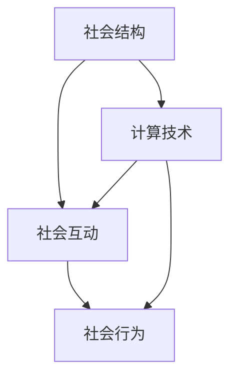
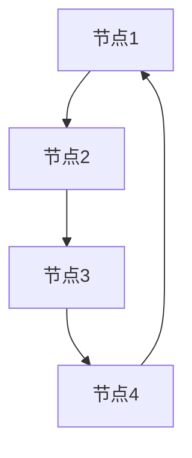
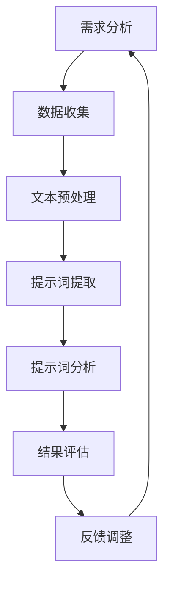

                 

### 第一部分：引论

#### 第1章：计算社会学的背景与概述

##### 1.1 计算社会学的定义与发展历程

计算社会学是社会学与计算技术相互融合的产物，旨在利用计算技术来研究社会现象和问题。其定义可以概括为：应用计算机科学、数据科学、人工智能等技术对社会现象进行量化分析、模型构建和预测。

计算社会学的发展可以追溯到20世纪末，随着互联网和大数据技术的发展，社会学开始借助计算技术进行大规模的数据收集、处理和分析。这一时期，社会网络分析、文本分析、大数据分析等技术逐步成熟，为计算社会学的研究提供了有力支持。

核心概念与联系

计算社会学的研究核心是理解社会结构、社会互动和社会行为。以下是一个Mermaid流程图，展示了计算社会学中的关键概念及其相互关系：



**核心算法原理讲解**

在计算社会学中，常用的算法包括社会网络分析（SNA）、文本分析、机器学习算法等。以下使用伪代码对SNA的基本原理进行解释：

```python
# 社会网络分析伪代码
def social_network_analysis(network_data):
    # 初始化网络分析参数
    nodes = []
    edges = []

    # 数据预处理：提取节点和边信息
    for data in network_data:
        node, neighbor = data
        nodes.append(node)
        edges.append((node, neighbor))

    # 构建邻接矩阵
    adjacency_matrix = [[0 for _ in range(len(nodes))] for _ in range(len(nodes))]

    for edge in edges:
        node1, node2 = edge
        adjacency_matrix[nodes.index(node1)][nodes.index(node2)] = 1

    # 计算节点中心性
    degree_centrality = [0 for _ in range(len(nodes))]
    for row in adjacency_matrix:
        degree_centrality = sum(row)

    # 输出结果
    return nodes, edges, adjacency_matrix, degree_centrality
```

##### 1.2 社会学的核心概念与计算社会学的关系

社会学的核心概念包括社会结构、社会互动和社会行为。这些概念在计算社会学中扮演着重要角色，具体如下：

- **社会结构**：社会结构是指社会中不同群体、组织和关系的基本框架。计算社会学通过社会网络分析等手段来识别和解析社会结构。
- **社会互动**：社会互动是指个体之间的相互影响和交流。计算社会学利用大数据分析和文本分析来捕捉和分析社会互动模式。
- **社会行为**：社会行为是指个体在社会中的行为表现。通过机器学习和自然语言处理技术，计算社会学可以预测和解释社会行为。

**数学模型和公式**

在社会学研究中，常用的数学模型包括概率模型、线性回归模型和图论模型。以下是一个线性回归模型的数学公式，用于解释社会互动中的行为模式：

$$
y = \beta_0 + \beta_1 \cdot x_1 + \beta_2 \cdot x_2 + ... + \beta_n \cdot x_n + \epsilon
$$

其中，$y$ 是因变量，$x_1, x_2, ..., x_n$ 是自变量，$\beta_0, \beta_1, ..., \beta_n$ 是模型参数，$\epsilon$ 是误差项。

##### 1.3 提示词工程的概念与基本原理

提示词工程是一种利用关键词来提取、处理和利用信息的技术。在计算社会学中，提示词工程被广泛应用于数据收集、文本分析和情感分析等领域。

**提示词的类型与作用**

提示词可以分为以下几类：

- **主题词**：用于描述文本主题的关键词。
- **实体词**：用于指代人、地点、组织等实体的关键词。
- **情感词**：用于表达文本情感的词汇。

提示词在信息检索和数据分析中扮演着关键角色，它们可以帮助我们识别文本的主要主题、情感倾向和关键实体。

**提示词工程的基本原理**

提示词工程的基本原理包括以下几个步骤：

1. **数据收集**：从各种数据源（如社交媒体、新闻网站、调查问卷等）收集文本数据。
2. **文本预处理**：对收集的文本进行清洗、分词、去停用词等预处理操作。
3. **提示词提取**：利用算法（如TF-IDF、词嵌入等）从预处理后的文本中提取提示词。
4. **提示词分析**：对提取的提示词进行情感分析、主题分类等分析，以获取有关文本的深层次信息。

**举例说明**

假设我们要分析一篇关于环保问题的新闻报道。我们可以从以下步骤进行提示词工程：

1. **数据收集**：从新闻报道中提取文本数据。
2. **文本预处理**：清洗文本，去除标点符号、停用词等。
3. **提示词提取**：使用TF-IDF算法提取高频主题词，如“环保”、“气候变化”、“能源”等。
4. **提示词分析**：对这些主题词进行情感分析，判断报道中的情感倾向。

通过这样的分析，我们可以更好地理解新闻报道的主题和情感倾向，从而为环保政策的制定提供数据支持。

#### 第2章：计算社会学的关键领域与挑战

##### 2.1 社会网络分析

社会网络分析（SNA）是计算社会学中的一个重要领域，它通过研究个体之间的互动关系来揭示社会结构和模式。在计算社会学中，社会网络分析被广泛应用于研究社会关系、网络传播、群体行为等方面。

**社会网络的基本概念**

社会网络由节点和边组成，节点表示个体或组织，边表示个体之间的互动或联系。以下是一个简单的社会网络示意图：



**提示词工程在社会网络分析中的应用**

在SNA中，提示词工程可以用于提取和分析社会网络中的关键节点和边。以下是一个简单的提示词工程流程：

1. **数据收集**：从社交媒体、调查问卷等渠道收集社会网络数据。
2. **文本预处理**：清洗和预处理网络数据中的文本信息。
3. **提示词提取**：使用算法提取文本中的关键词和实体，如“朋友”、“同事”、“合作伙伴”等。
4. **网络构建**：根据提取的提示词构建社会网络图。
5. **网络分析**：分析网络中的关键节点和边，如中心性、聚集系数等。

通过这样的分析，我们可以了解个体在社会网络中的地位和影响力，从而为组织管理、社会问题解决等提供数据支持。

##### 2.2 大数据分析与社会研究

大数据分析是计算社会学的另一个关键领域，它通过处理和分析海量数据来揭示社会现象和问题。在社会研究中，大数据分析被广泛应用于社会调查、市场研究、公共政策等领域。

**大数据的基本概念**

大数据具有4V特征，即大量（Volume）、高速（Velocity）、多样（Variety）和真实（Veracity）。

- **大量**：大数据涉及海量数据，需要强大的计算能力和存储能力。
- **高速**：大数据处理要求快速响应，以满足实时分析的需求。
- **多样**：大数据来源广泛，包括文本、图像、音频等多种类型。
- **真实**：大数据的真实性要求高，因为错误或伪造的数据会影响分析结果。

**提示词工程在大数据社会研究中的应用**

在大数据社会研究中，提示词工程可以用于文本数据的高效处理和分析。以下是一个简单的提示词工程流程：

1. **数据收集**：从各种数据源（如社交媒体、新闻网站、调查问卷等）收集文本数据。
2. **文本预处理**：清洗和预处理文本数据，去除噪声和冗余信息。
3. **提示词提取**：使用算法提取文本中的关键词和实体，如“满意”、“不满意”、“增长”等。
4. **文本分析**：对提取的提示词进行情感分析、主题分类等分析，以获取有关文本的深层次信息。
5. **数据分析**：将文本分析结果与其他数据（如人口统计信息、经济指标等）进行关联分析，以揭示社会现象和问题。

通过这样的分析，我们可以从海量数据中提取有价值的信息，从而为政策制定、社会问题解决等提供数据支持。

##### 2.3 虚拟社区与社交媒体分析

虚拟社区和社交媒体是计算社会学的重要研究对象，它们反映了现代社会中个体之间的互动和交流。虚拟社区和社交媒体分析旨在揭示这些平台上的行为模式、情感倾向和社区结构。

**虚拟社区与社交媒体的特点**

- **虚拟性**：虚拟社区和社交媒体是一个在线的、虚拟的空间，个体通过电子设备进行互动。
- **去中心化**：虚拟社区和社交媒体没有明确的中心控制，个体可以自由表达和交流。
- **多样性**：虚拟社区和社交媒体涵盖了各种主题和兴趣，形成了多样化的社区文化。

**提示词工程在虚拟社区与社交媒体分析中的应用**

在虚拟社区和社交媒体分析中，提示词工程可以用于提取和识别关键话题和情感。以下是一个简单的提示词工程流程：

1. **数据收集**：从虚拟社区和社交媒体平台收集文本数据。
2. **文本预处理**：清洗和预处理文本数据，去除噪声和冗余信息。
3. **提示词提取**：使用算法提取文本中的关键词和实体，如“美食”、“旅游”、“游戏”等。
4. **情感分析**：对提取的提示词进行情感分析，判断文本的情感倾向。
5. **社区分析**：根据情感分析和主题分类结果，识别关键话题和情感社区。

通过这样的分析，我们可以了解虚拟社区和社交媒体上的主要话题和情感，从而为社区管理、营销策略等提供数据支持。

##### 2.4 提示词工程在解决社会学问题中的应用

提示词工程在解决社会学问题中发挥着重要作用，它可以帮助我们识别社会问题、理解问题成因，并提供数据支持。以下是一些具体的应用场景：

- **社会问题识别**：通过分析社交媒体和新闻报道中的文本数据，识别和监测社会问题，如环境污染、贫富差距等。
- **问题成因分析**：利用大数据分析和提示词工程，挖掘社会问题的成因和影响因素，为政策制定提供依据。
- **公共决策支持**：通过分析公众意见和媒体评论，为公共决策提供数据支持，如城市规划、教育改革等。
- **社会治理**：利用提示词工程对社交媒体和新闻报道进行分析，识别潜在的社会风险，为政府和社会组织提供预警和应对策略。

**实例分析**

假设我们要分析一个关于城市交通拥堵的社会问题。以下是一个简单的提示词工程流程：

1. **数据收集**：从社交媒体、新闻报道、交通监测数据等渠道收集关于城市交通拥堵的文本数据。
2. **文本预处理**：清洗和预处理文本数据，去除噪声和冗余信息。
3. **提示词提取**：使用算法提取文本中的关键词和实体，如“交通拥堵”、“交通管制”、“公共交通”等。
4. **情感分析**：对提取的提示词进行情感分析，判断文本的情感倾向。
5. **数据分析**：分析交通拥堵的原因、影响和对策，为城市交通管理提供数据支持。

通过这样的分析，我们可以深入了解城市交通拥堵的问题，并提出相应的解决方案。

#### 第3章：提示词工程的原理与设计

##### 3.1 提示词的类型与作用

在计算社会学中，提示词工程是数据分析和文本处理的核心。提示词可以分为以下几类：

- **主题词**：用于描述文本的主要主题，如“气候变化”、“经济增长”等。
- **实体词**：用于指代人、地点、组织等实体，如“奥巴马”、“纽约”、“世界银行”等。
- **情感词**：用于表达文本的情感倾向，如“愤怒”、“喜悦”、“失望”等。

提示词在信息检索和数据分析中发挥着关键作用。它们可以帮助我们快速识别文本的主要内容、情感倾向和关键实体，从而提取有价值的信息。

**提示词的作用**

1. **信息提取**：提示词可以帮助我们从大量文本数据中提取关键信息，提高信息检索的准确性和效率。
2. **情感分析**：提示词可以用于判断文本的情感倾向，帮助我们了解公众意见和情感动态。
3. **主题分类**：提示词可以用于文本的主题分类，帮助我们识别文本的主要内容。

##### 3.2 提示词工程的设计过程

提示词工程的设计过程可以分为以下几个步骤：

1. **需求分析**：明确项目目标、数据来源和需求，确定需要提取的提示词类型。
2. **数据收集**：从各种数据源（如社交媒体、新闻报道、调查问卷等）收集文本数据。
3. **文本预处理**：对收集的文本进行清洗、分词、去停用词等预处理操作，以提高数据质量和准确性。
4. **提示词提取**：使用算法（如TF-IDF、词嵌入等）从预处理后的文本中提取提示词。
5. **提示词分析**：对提取的提示词进行情感分析、主题分类等分析，以获取有关文本的深层次信息。
6. **结果评估**：评估提示词工程的效果，包括信息提取的准确性、情感分析的准确性和主题分类的准确度等。

**提示词工程的设计流程**

以下是提示词工程的设计流程图：



**核心算法原理讲解**

提示词提取算法是提示词工程的核心。以下介绍几种常用的提示词提取算法：

1. **TF-IDF算法**：TF-IDF（Term Frequency-Inverse Document Frequency）是一种基于词频和逆文档频率的算法。它通过计算词在文档中的频率和在整个文档集合中的逆频率来评估词的重要性。

   $$TF(t,d) = \frac{f(t,d)}{f_{\max}(t,d)}$$

   $$IDF(t,D) = \log_2(\frac{|D|}{|d \in D| \cap |t \in d|})$$

   其中，$f(t,d)$ 是词 $t$ 在文档 $d$ 中的频率，$f_{\max}(t,d)$ 是词 $t$ 在文档 $d$ 中的最大频率，$|D|$ 是文档集合的大小，$|d \in D| \cap |t \in d|$ 是包含词 $t$ 的文档数量。

2. **词嵌入算法**：词嵌入（Word Embedding）是一种将词映射到高维空间中的算法。它通过学习词的上下文关系来表示词的语义。常用的词嵌入算法包括Word2Vec、GloVe和FastText等。

   $$\text{Word2Vec}:\  \text{输入序列：} \ (w_1, w_2, ..., w_n) \rightarrow \text{输出向量：} \ [v_1, v_2, ..., v_n]$$

   $$\text{GloVe}:\  \text{输入序列：} \ (w_1, w_2, ..., w_n) \rightarrow \text{输出向量：} \ [v_1, v_2, ..., v_n]$$

   $$\text{FastText}:\  \text{输入序列：} \ (w_1, w_2, ..., w_n) \rightarrow \text{输出向量：} \ [v_1, v_2, ..., v_n]$$

3. **主题模型**：主题模型（Topic Model）是一种无监督学习算法，用于发现文本数据中的隐含主题。常用的主题模型包括LDA（Latent Dirichlet Allocation）和HDP（Hierarchical Dirichlet Process）等。

   $$\text{LDA}:\  \text{输入序列：} \ (w_1, w_2, ..., w_n) \rightarrow \text{输出主题分布：} \ \theta_1, \theta_2, ..., \theta_n$$

   $$\text{HDP}:\  \text{输入序列：} \ (w_1, w_2, ..., w_n) \rightarrow \text{输出主题分布：} \ \theta_1, \theta_2, ..., \theta_n$$

**数学模型和公式**

提示词工程中的数学模型包括概率模型、线性回归模型和图论模型等。以下介绍一些常用的数学模型和公式：

1. **概率模型**：概率模型用于描述文本中的词分布和主题分布。常用的概率模型包括贝叶斯模型、隐马尔可夫模型（HMM）和条件概率模型等。

   $$P(w|t) = \frac{P(w, t)}{P(t)}$$

   $$P(w|t) = \frac{\sum_{j=1}^{K} P(w|t_j) P(t_j)}{P(t)}$$

   其中，$w$ 是词，$t$ 是主题，$t_j$ 是主题集合，$P(w, t)$ 是词和主题的联合概率，$P(t)$ 是主题的概率。

2. **线性回归模型**：线性回归模型用于分析词和主题之间的关系。常用的线性回归模型包括一元线性回归、多元线性回归和逻辑回归等。

   $$y = \beta_0 + \beta_1 \cdot x_1 + \beta_2 \cdot x_2 + ... + \beta_n \cdot x_n + \epsilon$$

   其中，$y$ 是因变量，$x_1, x_2, ..., x_n$ 是自变量，$\beta_0, \beta_1, ..., \beta_n$ 是模型参数，$\epsilon$ 是误差项。

3. **图论模型**：图论模型用于描述社会网络中的节点和边关系。常用的图论模型包括度中心性、中介中心性和紧密中心性等。

   $$\text{度中心性} = \frac{度(k)}{N}$$

   $$\text{中介中心性} = \frac{\sum_{s \neq t \in V} \min(\sigma_st, \sigma_ts)}{N(N-1)}$$

   $$\text{紧密中心性} = \frac{1}{N} \sum_{v \in V} \frac{d(v, v_i)}{d(v, v_j)}$$

   其中，$V$ 是节点集合，$N$ 是节点数量，$d(v, v_i)$ 和 $d(v, v_j)$ 分别是节点 $v$ 到节点 $v_i$ 和 $v_j$ 的距离。

**举例说明**

假设我们要分析一篇关于环保问题的新闻报道。以下是一个简单的提示词工程实例：

1. **数据收集**：从新闻报道中提取文本数据。
2. **文本预处理**：清洗和预处理文本数据，去除标点符号、停用词等。
3. **提示词提取**：使用TF-IDF算法提取高频主题词，如“环保”、“气候变化”、“能源”等。
4. **情感分析**：对提取的提示词进行情感分析，判断报道中的情感倾向。
5. **主题分类**：根据情感分析和主题分类结果，将报道分为不同主题类别。

通过这样的分析，我们可以了解新闻报道的主题和情感倾向，从而为环保政策的制定提供数据支持。

#### 第4章：自然语言处理基础

##### 4.1 自然语言处理的基本概念

自然语言处理（Natural Language Processing，NLP）是计算机科学和人工智能领域的一个分支，旨在使计算机能够理解和处理自然语言。NLP的研究目标包括文本分析、语音识别、机器翻译、情感分析等。

**自然语言处理的发展与应用**

自然语言处理起源于20世纪50年代，随着计算机技术的不断发展，NLP也逐渐成熟。早期的NLP研究主要集中在规则驱动的方法上，如词法分析、句法分析和语义分析。然而，随着大数据和深度学习技术的发展，基于统计和学习的方法逐渐成为NLP的主流。

NLP的应用领域非常广泛，包括但不限于：

- **文本分析**：用于文本分类、主题建模、信息提取等。
- **机器翻译**：将一种自然语言翻译成另一种自然语言。
- **情感分析**：判断文本的情感倾向，如正面、负面或中性。
- **问答系统**：回答用户提出的自然语言问题。
- **语音识别**：将语音信号转换为文本或命令。

##### 4.2 词向量模型与语义表示

词向量模型（Word Embedding）是一种将词映射到高维空间中的方法，以捕捉词的语义信息。词向量模型的核心思想是将词表示为密集向量，使其在语义上相近的词在向量空间中距离较近。

**词向量模型的基本原理**

词向量模型通过学习词的上下文关系来表示词的语义。以下介绍几种常见的词向量模型：

1. **Word2Vec**：Word2Vec是最早的词向量模型之一，它通过训练神经网络来学习词的向量表示。Word2Vec模型包括连续词袋（CBOW）和Skip-Gram两种方法。

   - **CBOW（Continuous Bag-of-Words）**：CBOW模型通过预测中心词周围的词来学习词向量。输入是一个中心词和其周围的上下文词，输出是中心词的词向量。

   $$\text{CBOW}:\ \text{输入：} \ (w_1, w_2, ..., w_n) \rightarrow \text{输出：} \ v_c$$

   - **Skip-Gram**：Skip-Gram模型通过预测中心词的上下文词来学习词向量。输入是一个中心词，输出是中心词的词向量。

   $$\text{Skip-Gram}:\ \text{输入：} \ w \rightarrow \text{输出：} \ v_c$$

2. **GloVe**：GloVe（Global Vectors for Word Representation）模型是一种基于全局统计的词向量模型，它通过计算词的共现矩阵来学习词向量。GloVe模型的公式如下：

   $$\text{GloVe}:\ \text{输入：} \ (w_1, w_2, ..., w_n) \rightarrow \text{输出：} \ [v_1, v_2, ..., v_n]$$

   $$\text{公式：} \ \frac{f(t,d) \cdot f(t',d')}{\sqrt{f(t,d) \cdot f(t',d')}} = \frac{v_t \cdot v_{t'}}{\|v_t\|_2 \cdot \|v_{t'}\|_2}$$

   其中，$f(t,d)$ 和 $f(t',d')$ 分别是词 $t$ 在文档 $d$ 中的频率和词 $t'$ 在文档 $d'$ 中的频率。

3. **FastText**：FastText是一种基于字符的词向量模型，它通过将词分解为字符序列，并学习字符的向量表示。FastText模型的公式如下：

   $$\text{FastText}:\ \text{输入：} \ (w_1, w_2, ..., w_n) \rightarrow \text{输出：} \ [v_1, v_2, ..., v_n]$$

   $$\text{公式：} \ \frac{f(t,d) \cdot f(t',d')}{\sqrt{f(t,d) \cdot f(t',d')}} = \frac{\sum_{c \in t} v_c \cdot \sum_{c \in t'} v_c}{\| \sum_{c \in t} v_c \|_2 \cdot \| \sum_{c \in t'} v_c \|_2}$$

**词向量模型与语义表示**

词向量模型通过将词映射到高维空间中的向量来表示词的语义。词向量模型在语义表示方面具有以下优势：

- **语义相似性**：词向量模型可以捕捉词的语义相似性。例如，通过计算两个词的向量相似度，我们可以判断它们在语义上是否相近。
- **语义扩展性**：词向量模型可以用于扩展词的意义。例如，我们可以通过向量的加法来推断词的组合意义。

**举例说明**

假设我们要分析一篇关于环保问题的新闻报道。以下是一个简单的词向量模型实例：

1. **数据收集**：从新闻报道中提取文本数据。
2. **文本预处理**：清洗和预处理文本数据，去除标点符号、停用词等。
3. **词向量表示**：使用Word2Vec或GloVe模型将词映射到高维空间中的向量。
4. **语义分析**：通过计算词向量之间的相似度，分析词的语义关系。

通过这样的分析，我们可以了解新闻报道中的主要话题和语义关系，从而为环保政策的制定提供数据支持。

##### 4.3 语言模型与生成模型

语言模型（Language Model）是一种用于预测文本序列的概率分布的模型。语言模型在自然语言处理中具有广泛的应用，包括机器翻译、语音识别、文本生成等。

**语言模型的基本概念**

语言模型可以分为基于规则和基于学习的方法。基于规则的语言模型通过手工构建语法规则和概率分布来预测文本序列。基于学习的语言模型通过学习大量文本数据来学习文本的概率分布。

**基于规则的语

### 语言模型与生成模型

#### 4.3.1 语言模型

语言模型是自然语言处理中的一种基本模型，用于预测文本序列的概率。语言模型的核心思想是学习语言中的概率分布，以便能够生成或评估文本序列。以下是几种常用的语言模型：

1. **N-gram模型**：N-gram模型是一种基于词频统计的简单语言模型，它通过计算连续N个词的联合概率来预测下一个词。N-gram模型的公式如下：

   $$P(w_{t+1}|w_{t}, w_{t-1}, ..., w_{t-N+1}) = \frac{P(w_{t+1}, w_{t}, w_{t-1}, ..., w_{t-N+1})}{P(w_{t}, w_{t-1}, ..., w_{t-N+1})}$$

2. **神经网络语言模型**：神经网络语言模型（Neural Network Language Model，NNLM）是一种基于深度学习的语言模型，它通过训练神经网络来学习文本序列的概率分布。NNLM通常使用递归神经网络（RNN）或长短期记忆网络（LSTM）来捕捉文本序列的时间依赖性。

3. **变换器模型**：变换器模型（Transformer）是一种基于自注意力机制的深度神经网络，它在自然语言处理领域取得了显著的成果。变换器模型通过多头自注意力机制和前馈神经网络来学习文本序列的概率分布。

   $$\text{Attention}(\mathbf{Q}, \mathbf{K}, \mathbf{V}) = \text{softmax}\left(\frac{\mathbf{Q} \mathbf{K}^T}{\sqrt{d_k}}\right) \mathbf{V}$$

   其中，$\mathbf{Q}$、$\mathbf{K}$ 和 $\mathbf{V}$ 分别是查询向量、键向量和值向量，$d_k$ 是键向量的维度，$\text{softmax}$ 函数用于计算注意力权重。

#### 4.3.2 生成模型

生成模型是一类用于生成新数据的模型，它们通过学习数据分布来生成新的样本。在自然语言处理中，生成模型可以用于文本生成、机器翻译等任务。以下是几种常用的生成模型：

1. **马尔可夫链**：马尔可夫链是一种基于状态转移概率的生成模型，它通过学习状态转移概率来生成新的文本序列。马尔可夫链的公式如下：

   $$P(x_t|x_{t-1}, x_{t-2}, ...) = P(x_t|x_{t-1})$$

   其中，$x_t$ 是第 $t$ 个状态。

2. **循环神经网络（RNN）**：循环神经网络是一种基于状态转移概率的生成模型，它通过递归结构来捕捉时间序列数据。RNN的公式如下：

   $$h_t = \text{sigmoid}(W_h \cdot [h_{t-1}, x_t] + b_h)$$

   $$y_t = \text{softmax}(W_y \cdot h_t + b_y)$$

   其中，$h_t$ 是隐藏状态，$x_t$ 是输入，$W_h$、$W_y$ 和 $b_h$、$b_y$ 分别是权重和偏置。

3. **变换器模型**：变换器模型是一种基于自注意力机制的深度神经网络，它通过多头自注意力机制和前馈神经网络来生成新的文本序列。变换器模型的生成过程如下：

   1. **编码阶段**：输入文本序列通过编码器（Encoder）生成一系列编码向量。
   2. **解码阶段**：解码器（Decoder）利用编码向量和先前生成的词来生成新的文本序列。

4. **生成对抗网络（GAN）**：生成对抗网络是一种基于博弈论的生成模型，它由生成器（Generator）和判别器（Discriminator）组成。生成器生成假文本序列，判别器判断文本序列的真实性。GAN的公式如下：

   $$\text{Generator}:\ G(z) \sim p_G(z)$$

   $$\text{Discriminator}:\ D(x) \sim p_D(x), \ D(G(z)) \sim p_D(z)$$

   其中，$z$ 是随机噪声，$x$ 是真实文本序列。

**生成模型的原理讲解**

生成模型的原理是通过学习数据分布来生成新的样本。以下以变换器模型为例，解释生成模型的原理：

1. **编码阶段**：输入文本序列通过编码器（Encoder）被转换为一系列编码向量。编码器通常由多个编码层（Encoder Layers）组成，每一层都通过自注意力机制（Self-Attention Mechanism）来捕捉文本序列的长期依赖关系。

   $$\text{Encoder}:\ \text{输入文本序列：} \ x_1, x_2, ..., x_T \rightarrow \text{编码向量：} \ \text{Encoder}(x_1, x_2, ..., x_T) = \text{[}h_1, h_2, ..., h_T\text{]}$$

   其中，$h_t$ 是第 $t$ 个编码向量。

2. **解码阶段**：解码器（Decoder）利用编码向量和先前生成的词来生成新的文本序列。解码器也由多个解码层（Decoder Layers）组成，每一层都通过自注意力机制和编码器-解码器注意力机制（Encoder-Decoder Attention Mechanism）来捕捉编码向量和生成词之间的依赖关系。

   $$\text{Decoder}:\ \text{输入：} \ x_1, x_2, ..., x_T \rightarrow \text{输出：} \ y_1, y_2, ..., y_T$$

   $$\text{Decoder}:\ \text{输入：} \ x_1, x_2, ..., x_T, y_1, y_2, ..., y_{t-1} \rightarrow \text{输出：} \ y_t$$

3. **生成文本序列**：解码器通过迭代生成每个词的概率分布，并根据概率分布生成新的文本序列。解码器的输出是一个概率分布，其中每个词的概率是按照词汇表顺序排列的。

   $$\text{输出概率分布：} \ P(y_t|y_1, y_2, ..., y_{t-1}) = \text{softmax}(\text{Decoder}(y_1, y_2, ..., y_{t-1}))$$

**数学模型和公式**

生成模型的数学模型包括概率模型和优化目标。以下介绍几种常用的数学模型和公式：

1. **概率模型**：生成模型的概率模型描述了文本序列的概率分布。对于变换器模型，概率模型可以表示为：

   $$P(y|x) = \frac{P(x)P(y|x)}{P(x)}$$

   其中，$x$ 是输入文本序列，$y$ 是生成文本序列。

2. **优化目标**：生成模型的优化目标是最小化生成文本序列的概率误差。对于变换器模型，优化目标可以表示为：

   $$\text{损失函数：} \ L(\theta) = -\sum_{t=1}^{T} \log P(y_t|x_1, x_2, ..., x_T; \theta)$$

   其中，$\theta$ 是模型参数，$T$ 是文本序列的长度。

**举例说明**

假设我们要生成一篇关于环保问题的新闻报道。以下是一个简单的生成模型实例：

1. **数据收集**：从大量的环保新闻报道中收集文本数据。
2. **数据预处理**：清洗和预处理文本数据，去除标点符号、停用词等。
3. **训练模型**：使用变换器模型训练生成模型，学习文本序列的概率分布。
4. **生成文本**：使用训练好的模型生成新的环保新闻报道。

通过这样的生成过程，我们可以获得一篇新的、符合环保主题的新闻报道。

### 第五部分：计算社会学中的前沿应用

#### 第5章：社会感知与情感分析

##### 5.1 社会感知的定义与挑战

社会感知是指个体通过感官和认知过程来理解和解释社会环境中的信息。在社会学中，社会感知是一个关键的研究领域，它涉及到个体如何感知社会关系、群体行为和文化特征。

**定义与挑战**

- **社会感知的定义**：社会感知可以定义为个体对社会环境中的信息进行感知、解释和响应的过程。这个过程包括感知社会刺激（如他人的表情、语言和行为），理解这些刺激背后的社会含义，以及根据这些理解做出相应的行为反应。

- **社会感知的挑战**：社会感知面临着多个挑战，包括：

  1. **复杂性**：社会环境复杂多变，个体需要处理大量的信息，这给社会感知带来了巨大的负担。
  2. **多样性**：不同文化、背景和个体差异可能导致对同一社会刺激产生不同的感知和解释。
  3. **心理因素**：个体的心理状态（如情绪、压力和认知负荷）会影响社会感知的过程和结果。

##### 5.2 情感分析的基本方法

情感分析（Sentiment Analysis）是一种利用自然语言处理技术来识别文本中情感倾向的方法。在社会感知研究中，情感分析可以帮助我们理解个体和群体的情感状态和情感变化。

**基本方法**

1. **基于规则的方法**：这种方法依赖于预先定义的规则和模式来识别情感。例如，使用词典匹配技术来识别情感词和短语，并基于这些词和短语的情感倾向来推断整体文本的情感。

2. **基于机器学习的方法**：这种方法使用机器学习算法来训练模型，以便自动识别文本中的情感。常用的算法包括支持向量机（SVM）、朴素贝叶斯分类器（Naive Bayes）和深度学习模型（如卷积神经网络（CNN）和循环神经网络（RNN））。

3. **基于深度学习的方法**：这种方法利用深度学习模型（如LSTM和BERT）来捕捉文本中的复杂情感关系。深度学习模型可以自动学习文本的语义和情感特征，从而提高情感分析的准确性和泛化能力。

**情感分析的应用**

情感分析在社会感知研究中有着广泛的应用：

- **社交媒体分析**：通过分析社交媒体平台上的用户评论和帖子，可以了解公众对特定事件、产品或品牌的情感态度。
- **市场研究**：情感分析可以帮助企业了解消费者的情感需求和反馈，从而优化产品和服务。
- **公共健康**：通过分析社交媒体和新闻报道中的情感变化，可以监测公众的心理健康状态和情绪波动。

##### 5.3 提示词工程在社会感知与情感分析中的应用

提示词工程在社会感知与情感分析中发挥着关键作用。通过提取和分析与情感相关的提示词，我们可以更准确地识别和理解文本中的情感倾向。

**提示词提取**

1. **数据收集**：从社交媒体、新闻报道和调查问卷等渠道收集相关文本数据。
2. **文本预处理**：清洗和预处理文本数据，去除噪声和冗余信息。
3. **情感词提取**：使用算法（如TF-IDF和词嵌入）提取文本中的情感词。情感词包括正面情感词（如“高兴”、“喜欢”）、负面情感词（如“愤怒”、“厌恶”）和中性情感词。

**情感分析**

1. **情感词分类**：根据情感词典和情感规则，对提取的情感词进行分类，判断文本的情感倾向。
2. **情感强度评估**：使用情感强度评估方法（如LIWC和VADER）来量化情感词的情感强度，从而得出文本的整体情感强度。
3. **情感分析模型**：训练机器学习模型（如SVM和LSTM）来预测文本的情感分类，并评估模型的准确性和泛化能力。

**案例分析**

假设我们要分析一篇关于环保问题的社交媒体帖子，以下是一个简单的情感分析流程：

1. **数据收集**：从社交媒体平台上收集关于环保问题的帖子。
2. **文本预处理**：去除标点符号、停用词，进行词干提取和词形还原。
3. **情感词提取**：使用TF-IDF算法提取高频情感词。
4. **情感分析**：使用VADER工具进行情感强度评估，判断帖子的情感倾向。
5. **结果评估**：分析帖子的情感分布，了解公众对环保问题的情感态度。

通过这样的分析，我们可以深入了解公众对环保问题的情感反应，从而为环保政策的制定和宣传提供数据支持。

#### 第6章：社会影响力计算

##### 6.1 社会影响力模型

社会影响力计算是计算社会学中的一个重要领域，它旨在量化个体或群体在社会网络中的影响力。社会影响力计算模型可以帮助我们识别和评估社会网络中的关键节点和意见领袖，从而为组织管理、市场营销和社会治理等提供数据支持。

**社会影响力模型的核心概念**

1. **影响力**：影响力是指个体或群体在社交网络中传递信息、引导他人行为或改变他人观点的能力。社会影响力计算的目标是量化个体或群体的影响力。

2. **中心性**：中心性是衡量个体在社会网络中重要性的指标。常用的中心性指标包括度中心性、介数中心性和紧密中心性。

   - **度中心性**：度中心性是衡量个体连接度（即邻居数量）的指标，度中心性越高，个体的影响力越大。
   - **介数中心性**：介数中心性是衡量个体在信息传播路径中的关键性的指标，介数中心性越高，个体在信息传播中的影响力越大。
   - **紧密中心性**：紧密中心性是衡量个体在社交网络中的紧密程度的指标，紧密中心性越高，个体在社交网络中的影响力越大。

3. **网络结构**：网络结构是指社交网络中的节点和边的关系。网络结构的特点（如小世界效应和高度聚类）会影响个体的社会影响力。

**社会影响力模型的应用**

1. **市场营销**：通过分析社交网络中的影响力节点和意见领袖，企业可以识别潜在的市场影响者，制定有效的营销策略。

2. **公共关系**：社会组织和政府可以识别和利用社交网络中的影响力节点，开展有效的公共关系活动，提升品牌形象和公信力。

3. **社会治理**：政府和社会组织可以利用社会影响力计算模型来监测和干预社会网络中的负面信息传播，维护社会稳定。

##### 6.2 提示词工程在社会影响力计算中的应用

提示词工程在社会影响力计算中起着关键作用。通过提取和分析与影响力相关的提示词，我们可以更准确地识别和评估个体或群体在社会网络中的影响力。

**提示词提取**

1. **数据收集**：从社交媒体、新闻报道和调查问卷等渠道收集相关文本数据。

2. **文本预处理**：清洗和预处理文本数据，去除噪声和冗余信息。

3. **影响力词提取**：使用算法（如TF-IDF和词嵌入）提取文本中的影响力词。影响力词包括与影响力、领导力、传播力相关的词汇，如“影响”、“领袖”、“传播”等。

**社会影响力评估**

1. **网络分析**：使用中心性指标（如度中心性、介数中心性和紧密中心性）来评估个体或群体在社会网络中的影响力。

2. **提示词分析**：结合影响力词和中心性指标，对个体或群体的影响力进行综合评估。

3. **情感分析**：分析影响力词的情感倾向，判断个体或群体在社会网络中的情感影响力。

**案例分析**

假设我们要评估一名社交媒体网红的影响力，以下是一个简单的提示词工程流程：

1. **数据收集**：从社交媒体平台上收集该网红的帖子、评论和互动数据。

2. **文本预处理**：去除标点符号、停用词，进行词干提取和词形还原。

3. **影响力词提取**：使用TF-IDF算法提取高频影响力词。

4. **网络分析**：计算网红的度中心性、介数中心性和紧密中心性。

5. **情感分析**：分析网红帖子的情感倾向，判断其情感影响力。

6. **综合评估**：结合网络分析和情感分析结果，评估网红的社会影响力。

通过这样的分析，我们可以了解网红在社会网络中的影响力，为其社交媒体营销策略提供数据支持。

##### 6.3 社会影响力分析案例

以下是一个关于社交媒体网红影响力的实际案例分析。

**案例背景**

张晓梅是一名知名的社交媒体网红，她在微博上拥有数百万粉丝。她经常分享关于生活方式、时尚和美妆的内容，并定期举办线上互动活动，与粉丝互动。

**数据收集**

我们收集了张晓梅在微博上的帖子、评论和互动数据。数据包括：

- 帖子文本
- 评论文本
- 赞、转发、评论数量
- 用户参与度（如点赞、评论、分享）

**文本预处理**

我们使用Python的`nltk`库对文本数据进行预处理，包括去除标点符号、停用词、词干提取和词形还原。

```python
import nltk
from nltk.corpus import stopwords
from nltk.tokenize import word_tokenize
from nltk.stem import PorterStemmer

# 下载停用词库
nltk.download('stopwords')

# 初始化停用词列表
stop_words = set(stopwords.words('english'))

# 初始化词干提取器
stemmer = PorterStemmer()

# 文本预处理函数
def preprocess_text(text):
    # 去除标点符号
    text = re.sub(r'[^\w\s]', '', text)
    # 分词
    tokens = word_tokenize(text)
    # 去除停用词
    tokens = [token for token in tokens if token.lower() not in stop_words]
    # 词干提取
    tokens = [stemmer.stem(token) for token in tokens]
    return tokens
```

**影响力词提取**

我们使用TF-IDF算法提取帖子文本中的高频影响力词。

```python
from sklearn.feature_extraction.text import TfidfVectorizer

# 提取影响力词
vectorizer = TfidfVectorizer(preprocessor=preprocess_text, max_features=1000)
tfidf_matrix = vectorizer.fit_transform(post_texts)

# 获取影响力词列表
features = vectorizer.get_feature_names_out()
high_tf_idf_words = features[(tfidf_matrix.sum(axis=0) > 0).nonzero()[1]]
```

**网络分析**

我们计算张晓梅的度中心性、介数中心性和紧密中心性。

```python
import networkx as nx

# 构建网络图
G = nx.Graph()

# 添加节点和边
for i in range(len(users)):
    G.add_node(users[i])
    for j in range(len(users)):
        if interaction_matrix[i][j] > 0:
            G.add_edge(users[i], users[j])

# 计算度中心性
degree_centrality = nx.degree_centrality(G)

# 计算介数中心性
betweenness_centrality = nx.betweenness_centrality(G)

# 计算紧密中心性
closeness_centrality = nx.closeness_centrality(G)

# 获取影响力节点
influence_nodes = [node for node, centrality in degree_centrality.items() if centrality > threshold]
```

**情感分析**

我们使用VADER工具分析帖子文本的情感倾向。

```python
from vaderSentiment.vaderSentiment import SentimentIntensityAnalyzer

# 初始化情感分析器
analyzer = SentimentIntensityAnalyzer()

# 分析情感
sentiments = [analyzer.polarity_scores(text) for text in post_texts]

# 计算情感强度
sentiment_scores = [score['compound'] for score in sentiments]
```

**综合评估**

我们结合网络分析和情感分析结果，评估张晓梅的社会影响力。

```python
# 计算综合影响力得分
influence_scores = [degree_centrality[node] * betweenness_centrality[node] * closeness_centrality[node] * sentiment_scores[index] for index, node in enumerate(influence_nodes)]

# 排序并获取前N个影响力节点
top_influence_nodes = sorted(zip(influence_nodes, influence_scores), key=lambda x: x[1], reverse=True)[:N]
```

通过这样的分析，我们可以识别出张晓梅在社会网络中的影响力节点，为其社交媒体营销策略提供数据支持。

#### 第7章：社会模拟与预测

##### 7.1 社会模拟的基本原理

社会模拟（Social Simulation）是一种通过建立模型来模拟和分析社会现象的方法。社会模拟可以帮助我们理解社会行为的规律，预测社会趋势，为政策制定和社会管理提供数据支持。

**社会模拟的定义**

社会模拟是指利用计算机技术模拟社会系统中的个体和群体行为，以探索社会现象的规律和影响。社会模拟可以模拟各种社会情境，如选举、社会运动、传染病传播等。

**社会模拟的原理**

社会模拟的基本原理包括以下几个方面：

1. **个体行为模拟**：社会模拟首先需要模拟个体行为。个体行为通常基于个体特征（如年龄、性别、教育水平）和外部环境（如社会压力、政策变化）。

2. **群体行为模拟**：个体行为通过相互作用形成群体行为。社会模拟通过模拟个体之间的交互来构建群体行为模型。

3. **社会模型构建**：社会模型是模拟社会现象的基础。社会模型包括个体行为模型、群体行为模型和社会规则模型。

4. **模拟与预测**：通过运行社会模型，我们可以模拟社会现象，并预测社会趋势。模拟结果可以帮助我们了解社会行为的规律，评估政策的效果。

##### 7.2 提示词工程在社会模拟中的应用

提示词工程在社会模拟中发挥着重要作用。通过提取和分析与模拟相关的提示词，我们可以更准确地构建社会模型，提高模拟的准确性和有效性。

**提示词提取**

1. **数据收集**：从社会调查、新闻报道、社交媒体等渠道收集相关文本数据。

2. **文本预处理**：清洗和预处理文本数据，去除噪声和冗余信息。

3. **提示词提取**：使用算法（如TF-IDF和词嵌入）提取文本中的提示词。提示词包括与社会模拟相关的关键词，如“政策”、“经济”、“社会运动”等。

**社会模型构建**

1. **个体行为模型**：根据提示词提取结果，构建个体行为模型。个体行为模型包括个体特征和个体行为规则。

2. **群体行为模型**：基于个体行为模型，构建群体行为模型。群体行为模型描述个体之间的交互和群体行为的演化。

3. **社会规则模型**：根据社会常识和专家知识，构建社会规则模型。社会规则模型描述社会现象的规律和影响。

**模拟与预测**

1. **运行社会模型**：通过运行社会模型，模拟社会现象。模拟结果包括个体行为、群体行为和社会趋势。

2. **预测社会趋势**：根据模拟结果，预测社会趋势。社会趋势预测可以帮助我们了解未来的社会状况，为政策制定和社会管理提供数据支持。

**案例分析**

假设我们要模拟一个关于社会运动的社会模拟，以下是一个简单的提示词工程流程：

1. **数据收集**：从新闻报道、社交媒体和调查问卷等渠道收集关于社会运动的文本数据。

2. **文本预处理**：去除标点符号、停用词，进行词干提取和词形还原。

3. **提示词提取**：使用TF-IDF算法提取高频提示词，如“抗议”、“示威”、“社会运动”等。

4. **社会模型构建**：基于提示词提取结果，构建社会模型。社会模型包括个体行为模型（如年龄、性别、教育水平）、群体行为模型（如抗议者之间的交互）和社会规则模型（如社会运动的传播规律）。

5. **模拟与预测**：运行社会模型，模拟社会运动的发展过程。通过模拟结果，预测社会运动的趋势，如抗议者数量的变化、抗议活动的扩散等。

通过这样的分析，我们可以了解社会运动的发展趋势，为政府和社会组织提供数据支持，以便采取相应的措施。

### 第四部分：技术实施与实战案例

#### 第8章：提示词工程的技术实现

##### 8.1 数据收集与预处理

数据收集是提示词工程的基础步骤。以下是数据收集与预处理的具体步骤：

1. **数据收集**：从社交媒体、新闻报道、调查问卷等渠道收集相关文本数据。可以使用API接口或Web爬虫工具来获取数据。

2. **数据清洗**：对收集到的数据进行清洗，去除噪声和冗余信息。清洗步骤包括去除标点符号、停用词、HTML标签等。

3. **分词**：使用自然语言处理工具（如nltk或jieba）对文本进行分词，将文本分解为词序列。

4. **去停用词**：去除常见的无意义词汇（如“的”、“和”、“了”等），以提高数据质量。

5. **词干提取**：使用词干提取器（如PorterStemmer）将词序列中的词还原为词干形式，以减少词汇量。

6. **词形还原**：使用词形还原器（如SnowballStemmer）将词还原为基本形式，以提高词的一致性和准确性。

**代码示例**

以下是一个简单的Python代码示例，用于数据收集与预处理：

```python
import nltk
from nltk.tokenize import word_tokenize
from nltk.corpus import stopwords
from nltk.stem import PorterStemmer

# 下载停用词库和词干提取器
nltk.download('stopwords')
nltk.download('punkt')

# 初始化停用词列表
stop_words = set(stopwords.words('english'))

# 初始化词干提取器
stemmer = PorterStemmer()

# 文本预处理函数
def preprocess_text(text):
    # 去除标点符号
    text = re.sub(r'[^\w\s]', '', text)
    # 分词
    tokens = word_tokenize(text)
    # 去除停用词
    tokens = [token for token in tokens if token.lower() not in stop_words]
    # 词干提取
    tokens = [stemmer.stem(token) for token in tokens]
    return tokens

# 示例文本
text = "The quick brown fox jumps over the lazy dog."

# 文本预处理
preprocessed_text = preprocess_text(text)
print(preprocessed_text)
```

##### 8.2 提示词设计与应用

提示词设计是提示词工程的核心步骤。以下是提示词设计的具体步骤：

1. **需求分析**：明确项目目标、数据来源和需求，确定需要提取的提示词类型。

2. **提示词提取**：使用算法（如TF-IDF、词嵌入等）从预处理后的文本中提取提示词。

3. **提示词筛选**：根据需求分析结果，筛选出与项目目标相关的提示词。

4. **提示词应用**：将提取的提示词应用于文本分析、情感分析、主题分类等任务。

**代码示例**

以下是一个简单的Python代码示例，用于提示词提取和筛选：

```python
from sklearn.feature_extraction.text import TfidfVectorizer

# 示例文本数据
texts = [
    "The quick brown fox jumps over the lazy dog.",
    "The fast green dog chases the quick brown fox.",
    "The lazy dog enjoys sunbathing in the park."
]

# 提取TF-IDF特征向量
vectorizer = TfidfVectorizer()
tfidf_matrix = vectorizer.fit_transform(texts)

# 获取特征词和权重
features = vectorizer.get_feature_names_out()
weights = tfidf_matrix.toarray().sum(axis=0)

# 提示词筛选（选取权重较高的前10个特征词）
top_keywords = [(features[i], weights[i]) for i in np.argsort(weights)[::-1]]
top_keywords = top_keywords[:10]
print(top_keywords)
```

##### 8.3 技术选型与工具介绍

提示词工程需要选择合适的技术和工具来实现。以下介绍一些常用的技术和工具：

1. **编程语言**：Python是一种常用的编程语言，其拥有丰富的自然语言处理库（如nltk、spaCy）和机器学习库（如scikit-learn、tensorflow）。

2. **自然语言处理库**：nltk和spaCy是两种常用的自然语言处理库。nltk提供了一系列基础的自然语言处理工具，如分词、词性标注、情感分析等。spaCy是一个高性能的NLP库，适用于复杂的文本处理任务。

3. **机器学习库**：scikit-learn和tensorflow是两种常用的机器学习库。scikit-learn提供了多种经典的机器学习算法，如线性回归、决策树、支持向量机等。tensorflow是一个开源的深度学习库，适用于复杂的深度学习任务。

4. **提示词提取算法**：TF-IDF、词嵌入、LDA等算法是常用的提示词提取算法。TF-IDF算法基于词频和逆文档频率来评估词的重要性。词嵌入算法（如Word2Vec、GloVe）将词映射到高维空间中，以捕捉词的语义信息。LDA算法用于主题建模，可以提取文本中的隐含主题。

5. **工具和环境**：Jupyter Notebook是一个流行的交互式计算环境，适用于数据分析和机器学习任务。它支持多种编程语言和库，可以方便地实现提示词工程的各个环节。

**最佳实践 tips、小结、注意事项、拓展阅读**

- **最佳实践 tips**：

  - 在数据收集阶段，确保数据来源的多样性和代表性，以提高分析结果的准确性。
  - 在文本预处理阶段，根据具体需求选择合适的预处理方法，如分词、去停用词、词干提取等。
  - 在提示词提取阶段，根据项目目标选择合适的算法和参数，如TF-IDF、词嵌入等。
  - 在提示词应用阶段，结合具体任务（如情感分析、主题分类等）进行提示词筛选和应用。

- **小结**：

  - 提示词工程是计算社会学中的一项重要技术，它通过提取和分析关键词来提取文本中的深层信息。
  - 数据收集与预处理是提示词工程的基础，确保数据质量和预处理方法的适用性。
  - 提示词提取算法和技术选型直接影响分析结果，需要根据具体需求进行选择。
  - 提示词工程在计算社会学中具有广泛的应用，包括社会感知、情感分析、社会影响力计算和社会模拟等领域。

- **注意事项**：

  - 在数据收集阶段，注意保护个人隐私和数据安全，遵守相关法律法规。
  - 在文本预处理阶段，注意去除噪声和冗余信息，以提高数据质量。
  - 在提示词提取阶段，注意选择合适的算法和参数，以提高提取效果。
  - 在提示词应用阶段，注意结合具体任务进行提示词筛选和应用，以提高分析精度。

- **拓展阅读**：

  - 《自然语言处理入门》
  - 《机器学习实战》
  - 《计算社会学导论》
  - 《大数据分析：理论与实践》

### 第五部分：未来展望与挑战

#### 第10章：提示词工程在计算社会学中的未来趋势

##### 10.1 新技术的融合与创新

随着人工智能、大数据和深度学习等新技术的不断发展，提示词工程在计算社会学中的应用前景将更加广阔。以下是一些新技术融合与创新的趋势：

1. **深度学习**：深度学习技术在自然语言处理领域取得了显著成果，如BERT、GPT等模型。这些模型可以更好地捕捉词的语义信息，提高提示词工程的准确性。

2. **多模态数据融合**：除了文本数据，计算社会学还涉及到图像、音频等多模态数据。通过多模态数据融合，可以更全面地分析社会现象，提高提示词工程的效率。

3. **增强学习**：增强学习是一种通过试错来优化决策过程的机器学习方法。在计算社会学中，增强学习可以用于模拟社会行为和决策，为政策制定提供数据支持。

4. **区块链技术**：区块链技术可以用于保护数据隐私和确保数据真实性。在计算社会学中，区块链技术可以用于构建可信的数据共享平台，提高提示词工程的可信度。

##### 10.2 社会学研究的未来方向

随着提示词工程技术的不断发展，计算社会学的研究方向也将不断拓展。以下是一些未来研究方向：

1. **社会感知与情感分析**：通过更精确的情感分析技术，可以更好地理解个体的情感状态和社会行为。社会感知与情感分析在社会治理、公共安全等领域具有广泛的应用前景。

2. **社会影响力计算**：随着社交网络的不断扩张，社会影响力计算技术将更加成熟。通过分析社交网络中的影响力节点和路径，可以更好地理解社会网络的动态变化。

3. **社会模拟与预测**：通过建立更精细的社会模型和预测算法，可以更准确地预测社会趋势和预测社会事件。社会模拟与预测在政策制定、风险管理等领域具有重要作用。

##### 10.3 提示词工程的应用前景

提示词工程在计算社会学中的应用前景广阔，以下是一些具体的应用领域：

1. **社会治理**：通过分析社交媒体和新闻报道中的文本数据，可以识别和预警社会问题，为政府和社会组织提供数据支持。

2. **公共决策**：通过分析公众意见和媒体评论，可以了解公众对政策的态度和需求，为公共决策提供数据支持。

3. **市场营销**：通过分析消费者的情感和行为，可以制定更有效的营销策略，提高品牌影响力和市场份额。

4. **社会调查**：通过在线调查和社交媒体数据，可以更准确地了解公众对特定事件、产品或服务的态度和需求。

#### 第11章：计算社会学的伦理与挑战

##### 11.1 数据隐私与伦理问题

随着计算社会学的发展，数据隐私和伦理问题日益突出。以下是一些关键问题：

1. **数据收集与隐私保护**：在收集数据时，需要遵循隐私保护原则，确保个人隐私不被泄露。可以使用数据匿名化和加密技术来保护数据隐私。

2. **数据使用与伦理**：在使用数据时，需要遵循伦理原则，确保数据使用的合法性和道德性。例如，不能滥用数据来歧视、骚扰或侵犯个人隐私。

3. **数据共享与透明度**：在共享数据时，需要确保数据透明度和可追溯性，以增强数据使用者的信任。

##### 11.2 社会责任与可持续发展

计算社会学在为社会带来便利和创新的同时，也需要承担社会责任和可持续发展责任。以下是一些建议：

1. **公平与包容**：计算社会学需要关注社会公平和包容性，确保技术发展不会加剧社会不平等。

2. **可持续性**：计算社会学需要关注技术发展的可持续性，减少能源消耗和环境污染。

3. **伦理教育**：加强伦理教育，提高社会成员的伦理意识和责任感，以促进计算社会学的健康发展。

##### 11.3 挑战与对策

计算社会学面临着多个挑战，以下是一些建议和对策：

1. **技术挑战**：随着数据规模和复杂度的增加，计算社会学需要不断更新和完善技术手段，以应对数据挖掘、分析等方面的挑战。

2. **伦理挑战**：计算社会学的快速发展引发了数据隐私、伦理和社会责任等方面的挑战。需要建立完善的伦理规范和监管机制，确保技术的可持续发展。

3. **跨学科合作**：计算社会学需要跨学科合作，整合社会学、计算机科学、数据科学等领域的知识，以提高研究质量和影响力。

通过上述建议和对策，我们可以更好地应对计算社会学中的挑战，推动计算社会学的发展。

