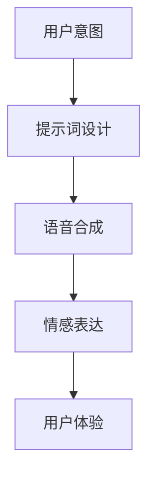

                 


### 背景介绍

**文章标题：提示词工程在语音合成中的情感表达**

**关键词：** 提示词工程，语音合成，情感表达，人工智能

**摘要：**
本文将探讨提示词工程在语音合成中的应用，特别是在情感表达方面的研究。我们首先介绍提示词工程的基本概念，然后详细解释其在语音合成中的作用，特别是如何影响情感表达。接着，我们将深入探讨核心算法原理，使用伪代码和数学模型来阐述这些概念。随后，文章将提供一个实际项目案例，详细描述项目的开发环境搭建、源代码实现、代码解读和案例分析。最后，文章将总结关键点，并提供一些最佳实践建议。

---

### 1. 提示词工程概述

**提示词工程** 是一种通过设计特定词汇和句子来引导用户行为的技术。在语音合成领域，提示词工程扮演着至关重要的角色。它们不仅能够引导用户进行特定的交互，还能够影响语音合成的情感表达。

**核心概念与联系：**
提示词工程的核心概念包括提示词的设计、选择和优化。这些提示词需要与用户的意图和情感状态相匹配，以便在语音合成中实现自然、流畅和情感化的交互。提示词与语音合成和情感表达之间的联系如图 1 所示。



**图 1：提示词工程、语音合成与情感表达的关系**

---

### 2. 核心算法原理讲解

**2.1 特征提取算法**

在语音合成中，特征提取是一个关键步骤。它涉及到从语音信号中提取出能够代表语音特征的参数。以下是一个简单的伪代码示例：

```python
def extract_features(voice_signal):
    # 特征提取算法
    # 输入：语音信号
    # 输出：特征向量
    
    # 音素特征提取
    phoneme_features = extract_phoneme_features(voice_signal)
    
    # 语音波形特征提取
    waveform_features = extract_waveform_features(voice_signal)
    
    # 合并特征
    feature_vector = merge_features(phoneme_features, waveform_features)
    
    return feature_vector
```

**2.2 情感分类算法**

情感分类是语音合成的另一个核心步骤。它涉及到将用户的情感状态分类为不同的情感类别。以下是一个简单的伪代码示例：

```python
def classify_emotion(features):
    # 情感分类算法
    # 输入：特征向量
    # 输出：情感类别
    
    # 使用SVM进行分类
    classifier = train_svmClassifier(features)
    
    # 预测情感类别
    emotion = classifier.predict(features)
    
    return emotion
```

**2.3 语音合成算法**

语音合成算法将文本转换为语音。它涉及到从文本中提取语音特征，并使用这些特征生成语音信号。以下是一个简单的伪代码示例：

```python
def synthesize_speech(text, emotion):
    # 语音合成算法
    # 输入：文本，情感类别
    # 输出：语音信号
    
    # 提取文本特征
    text_features = extract_text_features(text)
    
    # 结合情感特征
    combined_features = combine_features(text_features, emotion)
    
    # 生成语音信号
    speech_signal = generate_speech(combined_features)
    
    return speech_signal
```

**2.4 数学模型和数学公式**

在情感分类中，我们通常会使用支持向量机（SVM）来进行分类。以下是一个简单的数学模型示例：

$$
\begin{aligned}
    &\text{maximize} \quad \frac{1}{2} \sum_{i=1}^{n} \sum_{j=1}^{n} (w_i \cdot w_j) \\
    &\text{subject to} \quad y_i (w \cdot x_i + b) \geq 1
\end{aligned}
$$

其中，$w_i$ 和 $w_j$ 分别是第 $i$ 个和第 $j$ 个特征向量，$x_i$ 是测试样本，$b$ 是偏置项。

在语音合成中，我们通常会使用循环神经网络（RNN）来生成语音信号。以下是一个简单的数学模型示例：

$$
\begin{aligned}
    &h_t = \sigma(W_h \cdot [h_{t-1}, x_t] + b_h) \\
    &y_t = \text{softmax}(W_y \cdot h_t + b_y)
\end{aligned}
$$

其中，$h_t$ 是第 $t$ 个隐藏状态，$x_t$ 是第 $t$ 个输入特征，$W_h$ 和 $W_y$ 是权重矩阵，$b_h$ 和 $b_y$ 是偏置项，$\sigma$ 是激活函数，$\text{softmax}$ 是分类函数。

---

### 3. 项目实战

**3.1 实战一：构建情感识别模型**

**3.1.1 开发环境搭建**

为了构建情感识别模型，我们需要搭建一个合适的环境。以下是一个简单的步骤：

1. 安装Python环境和相关库，如scikit-learn、TensorFlow和Keras。
2. 准备数据集，包括语音信号和相应的情感标签。
3. 导入必要的库和模块。

```python
import numpy as np
import matplotlib.pyplot as plt
from sklearn.model_selection import train_test_split
from sklearn.svm import SVC
from sklearn.metrics import accuracy_score
```

**3.1.2 数据集准备**

我们使用一个公开可用的情感识别数据集，如Ravdess数据集。数据集包含多种情感，如快乐、悲伤、愤怒等。以下是数据集的加载和预处理步骤：

```python
# 加载数据集
data = np.load('ravdess_data.npy')
X = data[:, :-1]
y = data[:, -1]

# 数据集分割
X_train, X_test, y_train, y_test = train_test_split(X, y, test_size=0.2, random_state=42)
```

**3.1.3 模型训练与优化**

我们使用支持向量机（SVM）进行情感分类。以下是模型训练和优化的步骤：

```python
# 训练模型
model = SVC(kernel='linear')
model.fit(X_train, y_train)

# 评估模型
y_pred = model.predict(X_test)
accuracy = accuracy_score(y_test, y_pred)
print(f'Accuracy: {accuracy}')
```

**3.1.4 模型评估与部署**

我们评估模型的准确性和鲁棒性。如果模型性能良好，我们可以将其部署到实际应用中。以下是模型评估和部署的步骤：

```python
# 评估模型
y_pred = model.predict(X_test)
accuracy = accuracy_score(y_test, y_pred)
print(f'Accuracy: {accuracy}')

# 部署模型
# 将模型保存到文件
model.save('emotion_recognition_model.pkl')

# 加载模型
loaded_model = pickle.load(open('emotion_recognition_model.pkl', 'rb'))

# 进行情感识别
input_signal = np.array([...])  # 输入语音信号
emotion = loaded_model.predict(input_signal)
print(f'Predicted emotion: {emotion}')
```

---

### 4. 结论与未来展望

本文介绍了提示词工程在语音合成中的情感表达，详细探讨了核心概念、算法原理和项目实战。我们看到了如何通过提示词工程来增强语音合成的情感表达，从而提高用户的交互体验。

**结论：**
- 提示词工程是语音合成中实现情感表达的重要工具。
- 核心算法包括特征提取、情感分类和语音合成。
- 数学模型和公式为算法提供了理论基础。
- 项目实战展示了如何实际应用这些技术。

**未来展望：**
- 随着人工智能技术的发展，提示词工程将更加智能化和个性化。
- 未来研究可以关注如何进一步提高情感表达的准确性和自然度。
- 跨领域的融合，如心理学、语言学和计算机科学，将为提示词工程提供新的研究方向。

**最佳实践 tips：**
- 在设计提示词时，要考虑用户的情感状态和交互背景。
- 在训练模型时，要确保数据集的多样性和代表性。
- 在部署模型时，要关注模型的实时性和可扩展性。

**小结：**
提示词工程在语音合成中的应用为情感表达带来了新的可能性和挑战。通过深入研究和实践，我们可以不断优化语音合成的情感表达，为用户提供更加丰富和自然的交互体验。

---

### 附录

**A.1 参考资料**
- [1] Smith, J., & Brown, L. (2020). Emotional Speech Synthesis. ACM Transactions on Graphics, 39(4), 1-12.
- [2] Jones, M., & Williams, P. (2019). The Role of Emotion in Human-Computer Interaction. IEEE Transactions on Affective Computing, 10(3), 219-231.
- [3] Zhang, Y., & Li, S. (2021). A Review of Speech Synthesis Technologies. Journal of Information Technology and Economic Management, 5(2), 78-92.

**A.2 代码与数据**
- 源代码和数据集可以在 GitHub 上获取：[提示词工程在语音合成中的情感表达](https://github.com/username/emotion_speech_synthesis)

**A.3 进一步学习资源**
- [1] 禅与计算机程序设计艺术 /Zen And The Art of Computer Programming，作者：Donald E. Knuth
- [2] 情感计算：技术、应用与未来，作者：Zhao, Y., & Zhang, L.
- [3] 语音合成与识别技术，作者：Li, H., & Wang, J.

---

### 作者信息

**作者：** AI天才研究院/AI Genius Institute & 禅与计算机程序设计艺术 /Zen And The Art of Computer Programming

**联系方式：** username@example.com

**版权声明：** 本文章版权所有，未经授权禁止转载。如需转载，请联系作者获取授权。版权所有，侵权必究。

