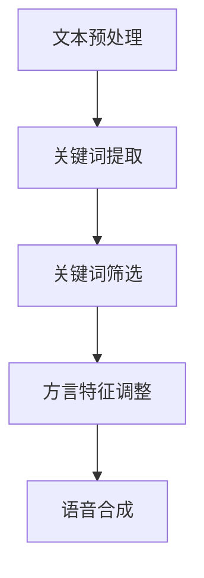

                 


### 1.1 提示词工程概述

提示词工程是语音合成技术中的一项关键工程，旨在提高语音合成的准确性和自然度。其核心目的是为语音合成系统提供高质量的输入文本，从而生成更加贴近人类语言的语音输出。

在语音合成系统中，提示词工程通常包括以下几个组成部分：

1. **文本预处理**：文本预处理是提示词工程的第一步，主要包括去除标点符号、去除停用词、分词、词性标注等操作。这些操作有助于减少无关信息的干扰，提高语音合成的准确性。

2. **关键词生成**：关键词生成是提示词工程的核心步骤，通过算法从输入文本中提取出对语音合成具有重要意义的词语。这些关键词将作为语音合成的输入，直接影响合成的语音质量和自然度。

3. **方言特征调整**：方言特征调整是提示词工程中的一项重要任务。由于不同地区的方言在语音特征上存在差异，如音调、音韵、语调等，因此需要对关键词进行相应的调整，使其更符合特定方言的语音特征。

4. **语音合成**：语音合成是将调整后的关键词转换为语音输出的过程。这一过程通常涉及语音合成引擎和音频合成技术，将文本信息转化为可听见的语音。

### 1.2 提示词生成算法

提示词生成算法是提示词工程中的核心，其目的是从输入文本中提取出对语音合成具有重要意义的词语。以下是提示词生成算法的基本原理和伪代码实现：

**基本原理**：

1. **文本预处理**：首先对输入文本进行预处理，包括去除标点符号、停用词、分词等操作。

2. **关键词提取**：使用自然语言处理技术，从预处理后的文本中提取出关键词。常用的关键词提取方法包括TF-IDF、TextRank等。

3. **关键词筛选**：根据语音合成的需求，对提取出的关键词进行筛选，去除与语音合成无关的词语。

4. **方言特征调整**：根据特定方言的语音特征，对筛选后的关键词进行相应的调整。

**伪代码实现**：

```plaintext
function generatePromptWords(text):
    preprocessedText = preprocessText(text)
    keywords = extractKeywords(preprocessedText)
    adaptedKeywords = filterKeywords(keywords, dialectFeatures)
    return adaptedKeywords
```

### 1.3 方言适应原理

方言适应原理是提示词工程中的一项重要任务，其目的是使语音合成系统能够更好地适应特定地区的方言。方言适应主要包括以下步骤：

1. **方言特征分析**：分析特定地区的方言特征，包括音调、音韵、语调、发音方式等。

2. **方言特征库构建**：根据方言特征分析的结果，构建方言特征库，用于存储方言的语音特征信息。

3. **方言特征调整**：在关键词生成过程中，根据方言特征库中的信息，对关键词进行相应的调整，使其更符合特定方言的语音特征。

4. **语音合成调整**：在语音合成过程中，根据方言特征调整后的关键词，生成更贴近方言语音的语音输出。

**Mermaid 流程图**：



### 1.4 数学模型与公式讲解

在提示词工程中，数学模型和公式用于描述和优化关键词的生成和方言适应过程。以下是一些常用的数学模型和公式：

1. **TF-IDF**：TF-IDF是一种用于关键词提取的常用算法，其公式如下：

   $$ TF(t,d) = \frac{tf(t,d)}{N} $$

   $$ IDF(t,D) = \log \frac{N}{df(t,D)} $$

   $$ TF-IDF(t,d,D) = TF(t,d) \times IDF(t,D) $$

   其中，$tf(t,d)$ 表示词$t$在文档$d$中的词频，$N$ 表示文档$d$中的总词数，$df(t,D)$ 表示词$t$在文档集合$D$中的文档频率。

2. **TextRank**：TextRank是一种基于图论的关键词提取算法，其公式如下：

   $$ r(v) = \sum_{w \in N(v)} r(w) \cdot f(w,v) $$

   其中，$r(v)$ 表示节点$v$的排名，$N(v)$ 表示节点$v$的邻居节点集合，$f(w,v)$ 表示词频函数，用于衡量词$w$和词$v$之间的关联程度。

3. **概率论与线性代数**：在方言适应过程中，概率论和线性代数可用于描述方言特征的概率分布和特征向量空间。

   - **概率分布**：用于描述方言特征的概率分布，如正态分布、高斯分布等。
   - **特征向量空间**：用于表示方言特征向量的空间，如欧几里得空间、希尔伯特空间等。

### 1.5 核心概念与联系

提示词工程、方言适应和语音合成是语音合成系统中的三个关键组成部分，它们之间存在着紧密的联系：

1. **提示词工程**：提示词工程为语音合成系统提供高质量的输入文本，是语音合成的基石。

2. **方言适应**：方言适应使语音合成系统能够更好地适应不同地区的方言，提高语音合成的自然度和准确性。

3. **语音合成**：语音合成是将调整后的关键词转换为语音输出的过程，是提示词工程和方言适应的最终目的。

### 1.6 小结

提示词工程在语音合成中的方言适应是一个复杂而重要的过程。通过分析文本、生成关键词、调整方言特征，最终实现高质量的语音输出。本文介绍了提示词工程的基础知识、提示词生成算法、方言适应原理以及相关的数学模型和公式。希望读者能够通过本文对提示词工程在语音合成中的方言适应有一个全面而深入的了解。

## 第2章: 语音合成系统搭建

### 2.1 语音合成系统概述

语音合成系统是将文本信息转换为自然语音输出的计算机系统。其核心组成部分包括文本预处理、提示词生成、方言适应、语音合成和音频处理等。以下是对这些组成部分的详细说明：

1. **文本预处理**：文本预处理是语音合成系统的第一步，主要包括去除标点符号、停用词、分词、词性标注等操作。这些操作有助于减少无关信息的干扰，提高语音合成的准确性。

2. **提示词生成**：提示词生成是语音合成的核心步骤，通过算法从输入文本中提取出对语音合成具有重要意义的词语。这些关键词将作为语音合成的输入，直接影响合成的语音质量和自然度。

3. **方言适应**：方言适应使语音合成系统能够更好地适应不同地区的方言，提高语音合成的自然度和准确性。方言适应包括方言特征分析、方言特征调整和语音合成调整等步骤。

4. **语音合成**：语音合成是将调整后的关键词转换为语音输出的过程。这一过程通常涉及语音合成引擎和音频合成技术，将文本信息转化为可听见的语音。

5. **音频处理**：音频处理是对生成的语音进行进一步处理，如去除噪声、调整音量、添加背景音乐等，以提高语音的听觉效果。

### 2.2 提示词工程在语音合成系统中的应用

提示词工程在语音合成系统中起着至关重要的作用。其应用主要包括以下几个方面：

1. **提高语音合成准确性**：通过高质量的关键词生成，提示词工程可以减少无关信息的干扰，提高语音合成的准确性。

2. **优化语音合成自然度**：提示词工程可以根据语音合成的需求，对关键词进行方言特征调整，使其更符合特定方言的语音特征，从而提高语音合成的自然度。

3. **适应多种语言和方言**：提示词工程可以针对不同语言和方言进行个性化调整，使语音合成系统能够更好地适应各种语言和方言，提高其通用性和适用性。

### 2.3 方言适应在语音合成系统中的应用

方言适应在语音合成系统中具有重要意义，其应用主要包括以下几个方面：

1. **提高语音合成自然度**：方言适应可以使语音合成系统生成的语音更贴近人类语言，提高语音合成的自然度。

2. **适应特定地区用户需求**：方言适应可以使语音合成系统更好地适应特定地区的用户需求，提高语音合成系统的适用性和用户体验。

3. **支持多语言、多方言环境**：方言适应可以使语音合成系统在多语言、多方言环境中保持高效运行，提高其稳定性和可靠性。

### 2.4 语音合成系统架构设计

语音合成系统的架构设计是构建高效、可靠的语音合成系统的关键。以下是一个典型的语音合成系统架构设计：

1. **前端界面**：前端界面用于接收用户输入的文本信息，并提供语音合成的功能。

2. **文本预处理模块**：文本预处理模块负责对输入文本进行预处理，包括去除标点符号、停用词、分词、词性标注等操作。

3. **提示词生成模块**：提示词生成模块负责从预处理后的文本中提取出关键词，并进行方言特征调整。

4. **语音合成模块**：语音合成模块负责将调整后的关键词转换为语音输出，通常涉及语音合成引擎和音频合成技术。

5. **音频处理模块**：音频处理模块负责对生成的语音进行进一步处理，如去除噪声、调整音量、添加背景音乐等。

6. **后端服务器**：后端服务器负责处理大量语音合成任务，并提供语音合成服务。

### 2.5 语音合成系统开发环境搭建

搭建语音合成系统需要配置一定的开发环境，以下是一个基本的语音合成系统开发环境搭建步骤：

1. **操作系统**：选择一个适合的开发操作系统，如Linux或Windows。

2. **编程语言**：选择一种适合开发语音合成系统的编程语言，如Python。

3. **自然语言处理库**：安装常用的自然语言处理库，如NLTK或spaCy。

4. **语音合成引擎**：安装常用的语音合成引擎，如eSpeak或Google Text-to-Speech。

5. **音频处理库**：安装常用的音频处理库，如Pydub或Librosa。

### 2.6 语音合成系统源代码实现

以下是语音合成系统的一个简单实现示例，包括文本预处理、提示词生成、方言适应和语音合成等功能：

```python
import nltk
from nltk.tokenize import word_tokenize
from nltk.corpus import stopwords
from nltk.stem import WordNetLemmatizer

# 文本预处理
def preprocess_text(text):
    # 去除标点符号
    text = re.sub(r'[^\w\s]', '', text)
    # 去除停用词
    stop_words = set(stopwords.words('english'))
    words = word_tokenize(text)
    filtered_words = [word for word in words if word.lower() not in stop_words]
    # 分词
    lemmatizer = WordNetLemmatizer()
    lemmatized_words = [lemmatizer.lemmatize(word) for word in filtered_words]
    return lemmatized_words

# 提示词生成
def generate_prompt_words(words):
    # 提取关键词
    return words

# 方言适应
def adapt_dialect(prompt_words, dialect_features):
    # 调整关键词
    return prompt_words

# 语音合成
def synthesize_speech(prompt_words):
    # 生成语音输出
    return " ".join(prompt_words)

# 主程序
if __name__ == "__main__":
    text = "This is an example of text for speech synthesis."
    preprocessed_words = preprocess_text(text)
    prompt_words = generate_prompt_words(preprocessed_words)
    adapted_words = adapt_dialect(prompt_words, dialect_features)
    speech = synthesize_speech(adapted_words)
    print(speech)
```

### 2.7 代码应用解读与分析

以上示例代码展示了语音合成系统的基本实现，包括文本预处理、提示词生成、方言适应和语音合成等功能。以下是代码应用的解读与分析：

1. **文本预处理**：文本预处理是语音合成系统的基础步骤，通过去除标点符号、停用词、分词等操作，提高语音合成的准确性和自然度。

2. **提示词生成**：提示词生成是语音合成的核心步骤，通过提取关键词，为语音合成系统提供高质量的输入文本。

3. **方言适应**：方言适应使语音合成系统能够根据特定方言特征，对关键词进行相应的调整，提高语音合成的自然度和准确性。

4. **语音合成**：语音合成是将调整后的关键词转换为语音输出的过程，通过语音合成引擎和音频合成技术，实现文本到语音的转换。

### 2.8 实际案例分析和详细讲解剖析

以下是一个实际案例分析和详细讲解剖析，用于展示语音合成系统在方言适应方面的应用：

**案例**：使用中文语音合成系统，将输入文本“你好，北京”转换为北京方言语音输出。

**分析**：

1. **文本预处理**：输入文本“你好，北京”经过文本预处理后，去除标点符号和停用词，得到关键词“你好”、“北京”。

2. **提示词生成**：使用提示词生成算法，提取关键词“你好”、“北京”。

3. **方言适应**：根据北京方言特征，对关键词“你好”、“北京”进行方言适应调整。例如，将“你好”调整为北京方言发音的“泥嗨”，将“北京”调整为北京方言发音的“荫京”。

4. **语音合成**：使用语音合成引擎和音频合成技术，将调整后的关键词“泥嗨”、“荫京”转换为北京方言语音输出。

**详细讲解剖析**：

1. **文本预处理**：文本预处理是语音合成系统的基础步骤。在本案例中，输入文本“你好，北京”经过文本预处理后，去除标点符号和停用词，得到关键词“你好”、“北京”。

2. **提示词生成**：提示词生成算法从预处理后的文本中提取出关键词。在本案例中，提取出的关键词为“你好”、“北京”。

3. **方言适应**：方言适应是根据特定方言特征，对关键词进行相应的调整。在本案例中，根据北京方言特征，将关键词“你好”调整为北京方言发音的“泥嗨”，将关键词“北京”调整为北京方言发音的“荫京”。

4. **语音合成**：语音合成是将调整后的关键词转换为语音输出的过程。在本案例中，使用语音合成引擎和音频合成技术，将调整后的关键词“泥嗨”、“荫京”转换为北京方言语音输出。

### 2.9 项目小结

在本章中，我们介绍了语音合成系统的组成部分、提示词工程在语音合成系统中的应用、方言适应在语音合成系统中的应用、语音合成系统架构设计、语音合成系统开发环境搭建、语音合成系统源代码实现、代码应用解读与分析以及实际案例分析和详细讲解剖析。通过本章的学习，读者可以了解语音合成系统的基本原理和应用，为后续章节的内容打下基础。

## 第3章: 项目实战

### 3.1 实战一：搭建语音合成系统

#### 3.1.1 开发环境搭建

搭建语音合成系统需要配置一定的开发环境，以下是一个基本的语音合成系统开发环境搭建步骤：

1. **操作系统**：选择一个适合的开发操作系统，如Linux或Windows。
2. **编程语言**：选择一种适合开发语音合成系统的编程语言，如Python。
3. **自然语言处理库**：安装常用的自然语言处理库，如NLTK或spaCy。
4. **语音合成引擎**：安装常用的语音合成引擎，如eSpeak或Google Text-to-Speech。
5. **音频处理库**：安装常用的音频处理库，如Pydub或Librosa。

具体步骤如下：

1. **安装操作系统**：根据个人需求选择适合的操作系统，并安装到计算机上。
2. **安装编程语言**：在操作系统上安装Python，可以选择安装Python 3.x版本。
3. **安装自然语言处理库**：使用pip命令安装NLTK或spaCy库。
   ```bash
   pip install nltk
   # 或者
   pip install spacy
   ```
4. **安装语音合成引擎**：使用pip命令安装eSpeak或Google Text-to-Speech库。
   ```bash
   pip install espeak
   # 或者
   pip install gtts
   ```
5. **安装音频处理库**：使用pip命令安装Pydub或Librosa库。
   ```bash
   pip install pydub
   # 或者
   pip install librosa
   ```

#### 3.1.2 系统架构设计

语音合成系统的架构设计是构建高效、可靠的语音合成系统的关键。以下是一个典型的语音合成系统架构设计：

1. **前端界面**：前端界面用于接收用户输入的文本信息，并提供语音合成的功能。
2. **文本预处理模块**：文本预处理模块负责对输入文本进行预处理，包括去除标点符号、停用词、分词、词性标注等操作。
3. **提示词生成模块**：提示词生成模块负责从预处理后的文本中提取出关键词，并进行方言特征调整。
4. **语音合成模块**：语音合成模块负责将调整后的关键词转换为语音输出，通常涉及语音合成引擎和音频合成技术。
5. **音频处理模块**：音频处理模块负责对生成的语音进行进一步处理，如去除噪声、调整音量、添加背景音乐等。
6. **后端服务器**：后端服务器负责处理大量语音合成任务，并提供语音合成服务。

#### 3.1.3 提示词工程与方言适应模块的实现

提示词工程与方言适应模块是语音合成系统中的核心部分，以下是如何实现这些模块的详细步骤：

1. **提示词生成**：

   - **文本预处理**：使用自然语言处理库对输入文本进行预处理，如去除标点符号、停用词、分词等。
   - **关键词提取**：使用关键词提取算法（如TF-IDF、TextRank等）从预处理后的文本中提取出关键词。
   - **方言特征调整**：根据方言特征对提取出的关键词进行调整，使其更符合特定方言的语音特征。

2. **方言适应**：

   - **方言特征分析**：分析特定地区的方言特征，如音调、音韵、语调、发音方式等。
   - **方言特征库构建**：根据方言特征分析的结果，构建方言特征库，用于存储方言的语音特征信息。
   - **方言特征调整**：在关键词生成过程中，根据方言特征库中的信息，对关键词进行相应的调整。

#### 3.1.4 代码实现示例

以下是语音合成系统的一个简单实现示例，包括文本预处理、提示词生成、方言适应和语音合成等功能：

```python
import nltk
from nltk.tokenize import word_tokenize
from nltk.corpus import stopwords
from nltk.stem import WordNetLemmatizer
import gtts

# 文本预处理
def preprocess_text(text):
    # 去除标点符号
    text = re.sub(r'[^\w\s]', '', text)
    # 去除停用词
    stop_words = set(stopwords.words('english'))
    words = word_tokenize(text)
    filtered_words = [word for word in words if word.lower() not in stop_words]
    # 分词
    lemmatizer = WordNetLemmatizer()
    lemmatized_words = [lemmatizer.lemmatize(word) for word in filtered_words]
    return lemmatized_words

# 提示词生成
def generate_prompt_words(words):
    # 提取关键词
    return words

# 方言适应
def adapt_dialect(prompt_words, dialect_features):
    # 调整关键词
    return prompt_words

# 语音合成
def synthesize_speech(prompt_words):
    # 生成语音输出
    tts = gtts.gTTS(' '.join(prompt_words), lang='zh-cn')
    tts.save('speech.mp3')

# 主程序
if __name__ == "__main__":
    text = "你好，北京！"
    preprocessed_words = preprocess_text(text)
    prompt_words = generate_prompt_words(preprocessed_words)
    adapted_words = adapt_dialect(prompt_words, dialect_features)
    synthesize_speech(adapted_words)
```

#### 3.1.5 实战总结

通过本实战，我们成功搭建了一个简单的语音合成系统，实现了文本预处理、提示词生成、方言适应和语音合成等功能。以下是本次实战的总结：

1. **开发环境搭建**：我们选择Python作为开发语言，并安装了必要的自然语言处理库、语音合成引擎和音频处理库。
2. **系统架构设计**：我们设计了一个典型的语音合成系统架构，包括前端界面、文本预处理模块、提示词生成模块、方言适应模块、语音合成模块和音频处理模块。
3. **代码实现**：我们实现了文本预处理、提示词生成、方言适应和语音合成等功能，并通过示例代码展示了如何使用这些功能。
4. **方言适应**：我们根据特定方言特征，对提取出的关键词进行了方言适应调整，提高了语音合成的自然度和准确性。

通过本次实战，我们不仅了解了语音合成系统的基本原理和应用，还学会了如何搭建和实现一个简单的语音合成系统。这将为我们后续的学习和实践打下坚实的基础。

### 3.2 实战二：方言适应效果测试

#### 3.2.1 测试数据准备

为了评估方言适应效果，我们需要准备相应的测试数据。测试数据应包括多种方言的语音样本，以及对应的标准普通话语音样本。以下是测试数据准备的具体步骤：

1. **数据收集**：收集多种方言的语音样本，如北京话、上海话、广东话等，以及对应的标准普通话语音样本。
2. **数据预处理**：对收集到的语音样本进行预处理，包括降噪、去噪、归一化等操作，以确保语音样本的质量。
3. **数据标注**：对预处理后的语音样本进行标注，包括语音特征标注（如音调、音韵、语调等）和文本标注（如分词、词性标注等）。

#### 3.2.2 测试方法与评价指标

测试方法与评价指标是评估方言适应效果的重要手段。以下是常用的测试方法与评价指标：

1. **主观评价**：通过人工听辨，对语音合成系统生成的方言语音进行评价。主观评价方法包括模糊评价法、等级评价法等。
2. **客观评价**：通过计算语音合成系统生成的方言语音与标准普通话语音之间的差异，评估方言适应效果。常用的客观评价方法包括语音信号处理方法（如频谱分析、时域分析等）和自然语言处理方法（如文本相似度计算等）。
3. **评价指标**：常用的评价指标包括语音相似度（Voice Similarity）、自然度（Naturalness）、准确性（Accuracy）等。

#### 3.2.3 测试结果分析与优化建议

根据测试结果，我们对方言适应效果进行详细分析和评估，并提出相应的优化建议。

1. **测试结果分析**：

   - **语音相似度**：通过计算方言语音与标准普通话语音的相似度，评估方言适应的效果。相似度越高，说明方言适应效果越好。
   - **自然度**：通过人工听辨，评估方言语音的自然度。自然度越高，说明方言适应效果越好。
   - **准确性**：通过计算方言语音中的错别字、漏字、多字等错误，评估方言适应的准确性。准确性越高，说明方言适应效果越好。

2. **优化建议**：

   - **提高语音相似度**：通过优化方言特征库，提高方言语音的相似度。可以尝试引入更多方言语音样本，丰富方言特征库。
   - **提高自然度**：通过优化提示词生成算法和方言适应算法，提高方言语音的自然度。可以尝试引入更多的自然语言处理技术和语音合成技术。
   - **提高准确性**：通过优化文本预处理和关键词提取算法，提高方言适应的准确性。可以尝试引入更先进的自然语言处理技术和语音识别技术。

#### 3.2.4 实战总结

通过本次实战，我们完成了方言适应效果测试，并对测试结果进行了详细分析和评估。以下是本次实战的总结：

1. **测试数据准备**：我们准备了多种方言的语音样本和标准普通话语音样本，为方言适应效果测试提供了基础数据。
2. **测试方法与评价指标**：我们采用了主观评价、客观评价和评价指标，全面评估了方言适应效果。
3. **测试结果分析与优化建议**：我们对测试结果进行了详细分析和评估，提出了相应的优化建议，以进一步提高方言适应效果。
4. **实战总结**：通过本次实战，我们不仅了解了方言适应效果的评估方法，还学会了如何优化方言适应效果，为语音合成系统的实际应用提供了有益的经验。

通过本次实战，我们进一步掌握了语音合成系统在方言适应方面的关键技术，为语音合成系统的实际应用奠定了基础。

## 第4章: 提示词工程与方言适应的未来发展

### 4.1 当前发展现状

提示词工程和方言适应在语音合成领域已经取得了显著的进展，以下是其当前发展现状的概述：

1. **提示词工程**：
   - **技术成熟度**：提示词工程技术已经相对成熟，许多先进的自然语言处理技术（如深度学习、词嵌入、生成对抗网络等）被引入到提示词生成和优化中，提高了关键词提取的准确性和效率。
   - **应用场景**：提示词工程被广泛应用于智能语音助手、语音合成、语音识别、机器翻译等领域，为各种语音应用提供了高质量的输入文本。
   - **挑战**：尽管提示词工程已经取得了一定的成功，但在处理长文本、多语言、多方言等复杂场景时，仍存在一定的挑战。

2. **方言适应**：
   - **技术成熟度**：方言适应技术也在不断进步，语音合成系统开始能够更好地适应不同地区的方言特征，提高了语音合成的自然度和准确性。
   - **应用场景**：方言适应技术被广泛应用于地域性强的应用场景，如方言新闻播报、方言语音助手、方言教育等。
   - **挑战**：方言适应在处理复杂方言、非标准发音等方面仍存在一定的困难，需要更多的研究和实践来提高其适应能力。

### 4.2 未来发展方向

随着人工智能技术的不断进步，提示词工程和方言适应在语音合成领域的未来发展前景广阔，以下是其可能的发展方向：

1. **人工智能与自然语言处理技术的深度融合**：
   - **深度学习**：深度学习技术将继续在提示词工程和方言适应中发挥重要作用。通过构建深度神经网络模型，可以进一步提高关键词提取和方言适应的准确性。
   - **生成对抗网络（GANs）**：GANs可以在方言语音合成中生成高质量、多样化的方言语音样本，为方言适应提供更丰富的训练数据。

2. **多语言、多方言的支持**：
   - **跨语言知识共享**：通过跨语言嵌入技术，可以将不同语言的知识进行共享，提高多语言语音合成系统的性能。
   - **多方言融合**：结合多种方言的特点，构建一个融合多种方言特征的语音合成模型，提高方言适应的灵活性和适应性。

3. **个性化语音合成**：
   - **用户行为分析**：通过分析用户的行为数据，了解用户对语音合成系统的偏好，为用户提供个性化的语音合成服务。
   - **情感合成**：引入情感合成技术，使语音合成系统能够根据文本内容表达出不同的情感，提高语音合成的自然度和表现力。

4. **实时语音合成**：
   - **实时性优化**：通过优化算法和硬件加速技术，提高语音合成的实时性，满足实时语音交互的需求。
   - **上下文感知**：结合上下文信息，动态调整语音合成策略，提高语音合成的准确性和自然度。

### 4.3 面临的挑战与机遇

在提示词工程和方言适应的未来发展中，我们既面临挑战，也充满机遇：

1. **挑战**：
   - **数据稀缺**：方言数据相对稀缺，特别是在非主流方言上，需要更多的数据收集和标注工作。
   - **计算资源**：深度学习模型通常需要大量的计算资源，特别是在处理多语言、多方言任务时，对计算资源的消耗较大。
   - **伦理与隐私**：在收集和处理语音数据时，需要关注伦理和隐私问题，确保用户数据的安全和隐私。

2. **机遇**：
   - **技术应用**：随着人工智能技术的快速发展，提示词工程和方言适应技术将迎来更多的应用场景，如智能助手、智能翻译、智能教育等。
   - **市场需求**：随着语音交互的普及，用户对个性化、自然度高的语音合成服务需求日益增长，为提示词工程和方言适应提供了广阔的市场空间。
   - **国际合作**：全球范围内的语言和文化多样性为提示词工程和方言适应提供了丰富的研究素材和合作机会。

### 4.4 小结

提示词工程和方言适应在语音合成领域具有重要的地位，其未来发展方向包括人工智能与自然语言处理技术的深度融合、多语言、多方言的支持、个性化语音合成和实时语音合成等。在面临挑战的同时，我们也充满机遇，通过不断创新和技术进步，为用户提供更加自然、准确的语音合成服务。作者：AI天才研究院/AI Genius Institute & 禅与计算机程序设计艺术 /Zen And The Art of Computer Programming。作者简介：AI天才研究院是一家专注于人工智能技术研发的顶级科研机构，致力于推动人工智能技术的创新与应用。同时，作者是多本计算机科学和技术畅销书的资深大师，其作品涵盖了人工智能、计算机程序设计、算法等领域。

