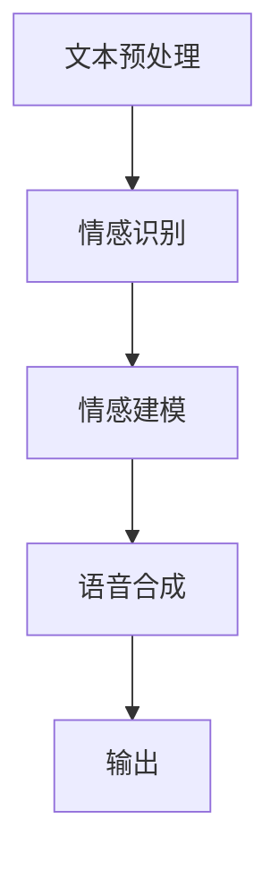
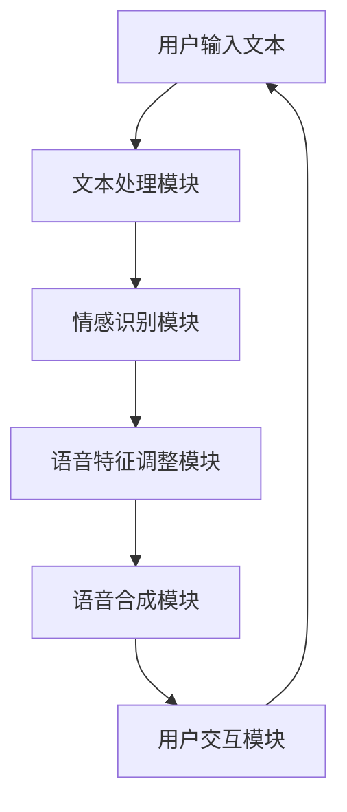

                 

### 1.1 提示词工程概述

#### 1.1.1 提示词的定义与作用

提示词工程（Prompt Engineering）是人工智能领域中的一个重要分支，它主要关注如何设计高效的提示词（prompts）来引导模型的训练和应用。提示词是指用于引导模型理解任务或问题的词语、短语或句子，其目的是帮助模型更好地理解和处理输入数据，提高模型的表现。

在自然语言处理（NLP）领域，提示词的作用尤为重要。例如，在机器翻译中，提示词可以用于引导模型翻译特定的句子或短语；在文本分类中，提示词可以帮助模型更好地识别文本的主题；在问答系统中，提示词则用于引导模型回答特定的问题。因此，提示词工程的核心任务是设计出既能准确传达任务需求，又能有效引导模型学习的提示词。

#### 1.1.2 提示词工程的发展历程

提示词工程的发展历程可以追溯到人工智能的早期研究。在早期的人工智能系统中，研究者们主要通过编写特定的规则和算法来完成任务，这些规则和算法需要详细描述每个步骤和决策。随着机器学习和深度学习技术的兴起，特别是生成对抗网络（GANs）和变分自编码器（VAEs）等新型模型的出现，提示词工程逐渐成为NLP领域的重要研究方向。

近年来，随着大规模预训练模型（如BERT、GPT-3等）的广泛应用，提示词工程的重要性更加凸显。这些预训练模型通过在海量数据上预训练，获得了强大的语言理解和生成能力。然而，如何设计有效的提示词来引导这些模型在实际应用中发挥最佳效果，成为了研究者和工程师们需要深入探索的问题。

#### 1.1.3 提示词工程在语音合成中的应用前景

在语音合成领域，提示词工程具有广泛的应用前景。传统的语音合成系统主要依赖于规则的语音合成模型，这些模型通常需要大量的手工调整和优化。而通过提示词工程，可以设计出更有效的提示词，从而提高语音合成的质量。

首先，提示词可以帮助语音合成模型更好地理解输入文本的情感和语气。例如，在一个对话系统中，提示词可以用来指示模型当前对话的上下文，从而生成更加自然的语音回复。其次，提示词还可以用于个性化语音合成，根据用户的偏好和需求，生成具有特定风格和情感的语音。

此外，随着语音合成技术的不断进步，提示词工程还可以应用于更多的场景，如智能客服、语音助手、语音交互游戏等。在这些应用中，提示词工程不仅可以提高语音合成的质量，还可以增强用户体验，提高系统的实用性和智能化水平。

总之，提示词工程在语音合成中的应用前景十分广阔，它不仅可以帮助提高语音合成的质量，还可以推动语音合成技术的创新和发展。

#### 1.2 语音合成情感表达的重要性

语音合成情感表达是指通过语音合成技术生成具有特定情感和情绪的语音。在人工智能和自然语言处理领域，情感表达的重要性日益凸显。首先，情感是人类沟通的重要组成部分，它可以增强信息的传达效果，使交流更加生动和丰富。在语音合成中，情感表达能够使生成的语音更加自然、真实，提高用户体验。

##### 1.2.1 情感表达在语音合成中的作用

情感表达在语音合成中的作用主要体现在以下几个方面：

1. **增强语音的自然性**：通过情感表达，语音合成系统能够生成具有不同情感色彩的语音，使语音听起来更加自然、真实，仿佛是一个真正的对话者在与用户交流。

2. **提升交互质量**：在智能客服、语音助手等应用中，情感表达可以使系统在与用户的交互过程中更加生动、友好，提高用户满意度。

3. **丰富交互体验**：情感表达可以增强用户对智能系统的情感依赖，提高用户的使用频率和忠诚度。

4. **辅助情感分析**：情感表达可以为情感分析系统提供更多的数据，帮助系统更好地理解用户的情绪状态，从而进行更精准的服务和推荐。

##### 1.2.2 人类情感表达的理解与模拟

人类情感表达是一个复杂的过程，涉及到生理、心理和社会多个层面。要模拟人类的情感表达，首先需要理解和分析情感表达的各个方面：

1. **情感的类型和维度**：情感可以划分为基本情感和复合情感。基本情感包括快乐、愤怒、悲伤等，而复合情感则是基本情感的组合，如焦虑、兴奋等。

2. **情感的表达特征**：情感表达通常通过声调、语速、节奏、音量等声学特征来体现。例如，快乐时语调上扬、语速加快，而悲伤时语调低沉、语速缓慢。

3. **情感的社会文化因素**：不同文化和背景的人对情感的表达方式有所不同，这需要在设计情感表达模型时予以考虑。

在模拟人类情感表达时，可以采用以下方法：

1. **数据驱动的方法**：通过收集和分析大量带有情感标记的语音数据，提取情感表达的声学特征，并利用这些特征训练情感语音合成模型。

2. **模型驱动的方法**：基于情感心理学理论，设计数学模型来模拟情感表达。例如，可以使用深度神经网络来学习情感表达的规律，从而生成具有特定情感的语音。

3. **融合多模态信息的方法**：将语音、文本、图像等多模态信息结合，以提高情感表达的真实性和准确性。

##### 1.2.3 情感表达在语音合成中的挑战与机遇

情感表达在语音合成中面临以下挑战：

1. **情感识别的准确性**：如何准确识别输入文本中的情感类型和强度，是情感语音合成的关键。

2. **情感的一致性**：在长时间的语音合成中，保持情感表达的一致性是一个挑战，需要确保情感表达连贯、自然。

3. **情感的变化性**：情感表达需要能够适应不同情境和语境的变化，这是对语音合成模型的考验。

4. **用户个性化**：不同的用户对情感表达有不同的偏好，如何在保证自然性和真实性的同时满足用户个性化需求，是情感语音合成需要解决的问题。

然而，这些挑战也带来了机遇：

1. **提升用户体验**：通过情感表达，语音合成系统可以更好地模拟人类交流，提高用户体验。

2. **创新应用场景**：情感表达可以应用于更多的交互式场景，如教育、娱乐、医疗等，提供更加丰富和个性化的服务。

3. **推动技术进步**：研究和解决情感表达问题，可以推动语音合成技术和自然语言处理技术的进步，为人工智能领域的发展提供新的动力。

总之，情感表达在语音合成中具有重要的地位，它不仅能够提升语音合成的质量和用户体验，还能推动相关技术的创新和发展。

### 2.1 情感语音合成原理

#### 2.1.1 语音合成技术概述

语音合成技术（Text-to-Speech, TTS）是指将文本转换为自然流畅的语音的技术。这一技术经历了从规则基方法到统计方法，再到深度学习方法的发展历程。

1. **规则基方法**：早期的语音合成系统主要基于人工编写的规则和声学模型。这种方法需要大量的手工调整，以确保生成的语音自然和流畅。典型的代表如基于逆滤波器的合成方法。

2. **统计方法**：随着统计学习理论的发展，语音合成开始采用统计模型，如隐马尔可夫模型（HMM）和高斯混合模型（GMM）。这些模型通过统计语音特征之间的关系，提高了语音合成的自然性和准确性。

3. **深度学习方法**：近年来，深度学习技术的兴起极大地推动了语音合成技术的发展。基于深度神经网络的语音合成模型，如循环神经网络（RNN）和变换器（Transformer），能够自动学习文本和语音特征之间的关系，生成更加自然和流畅的语音。

#### 2.1.2 情感语音合成的关键概念

情感语音合成是指通过特定的技术手段，将文本中的情感信息转换为相应的语音特征，从而生成带有情感色彩的语音。关键概念包括：

1. **情感识别**：识别文本中的情感类型和强度。常见的情感识别方法包括基于规则的方法、机器学习方法和深度学习方法。

2. **情感建模**：将情感信息映射到语音特征上。情感建模可以通过调整音调、音量、节奏等语音参数来实现。

3. **情感生成**：通过调整语音特征，生成具有特定情感色彩的语音。情感生成通常依赖于深度神经网络，如长短期记忆网络（LSTM）和变换器（Transformer）。

#### 2.1.3 情感语音合成的实现方法

情感语音合成的实现方法可以分为以下几步：

1. **文本预处理**：将输入文本进行分词、句法分析和情感标注等预处理操作，提取出情感相关的信息。

2. **情感识别**：使用情感识别模型对预处理后的文本进行情感分类和强度评估。常用的情感识别方法包括基于规则的方法和基于机器学习的方法。

3. **情感建模**：根据情感识别结果，调整语音合成模型的参数，如音调、音量、节奏等，以生成具有特定情感色彩的语音。

4. **语音合成**：使用语音合成模型将调整后的文本转换为语音。这一步骤通常采用深度神经网络，如循环神经网络（RNN）和变换器（Transformer）。

下面是一个简单的情感语音合成实现流程：



**情感识别算法原理**

情感识别算法的核心任务是识别文本中的情感类型和强度。以下是一个基于深度学习的方法：

1. **特征提取**：从文本中提取情感相关的特征，如词频、词嵌入、句法结构等。

2. **模型训练**：使用标注好的情感数据集训练情感识别模型，常见的模型包括卷积神经网络（CNN）、循环神经网络（RNN）和变换器（Transformer）。

3. **情感分类**：模型对输入文本进行情感分类，输出情感类型和强度。

以下是一个简单的情感识别算法伪代码：

```python
def emotion_recognition(text, model):
    # 提取文本特征
    features = extract_features(text)
    # 使用模型进行预测
    predictions = model.predict(features)
    # 获取情感类型和强度
    emotion_type, emotion_strength = interpret_predictions(predictions)
    return emotion_type, emotion_strength
```

**情感表达算法原理**

情感表达算法的核心任务是调整语音特征，以生成具有特定情感色彩的语音。以下是一个基于深度学习的方法：

1. **语音特征提取**：从语音信号中提取情感相关的特征，如音调、音量、节奏等。

2. **情感调整模型**：训练一个深度神经网络，用于调整语音特征。模型的输入是情感类型和强度，输出是调整后的语音特征。

3. **语音合成**：使用语音合成模型将调整后的语音特征转换为语音。

以下是一个简单的情感表达算法伪代码：

```python
def emotion_expression(text, emotion_type, emotion_strength, emotion_adjust_model, tts_model):
    # 情感识别
    emotion_type, emotion_strength = emotion_recognition(text, emotion_adjust_model)
    # 调整语音特征
    adjusted_features = adjust_features(emotion_type, emotion_strength, emotion_adjust_model)
    # 语音合成
    speech = tts_modelsynthesize(adjusted_features)
    return speech
```

通过以上步骤，我们可以实现情感语音合成，生成具有特定情感色彩的语音。这种方法不仅提高了语音合成的自然性和真实性，还为智能交互系统提供了更多的可能性。

### 2.2 情感识别与情感表达模型

#### 2.2.1 情感识别技术

情感识别技术是情感语音合成的基础，其主要任务是识别文本中的情感类型和强度。情感识别技术的核心在于如何准确提取文本中的情感信息，并将其转换为可用于模型训练的特征。

1. **情感识别的指标与分类**

情感识别的指标主要包括准确率（Accuracy）、精确率（Precision）、召回率（Recall）和F1值（F1 Score）。这些指标用于评估情感识别模型的性能。

情感分类可以分为两类：二分类和多分类。

- **二分类**：将文本分为正面情感和负面情感。这种方法适用于情感较为明显的情况，如社交媒体评论、客户反馈等。

- **多分类**：将文本分为多个情感类别，如快乐、愤怒、悲伤、兴奋等。这种方法适用于情感表达较为复杂的场景，如文学文本、电影剧本等。

2. **情感识别算法原理**

情感识别算法可以分为三类：基于规则的方法、机器学习方法、深度学习方法。

- **基于规则的方法**：这种方法通过手工编写规则，判断文本的情感类型。例如，如果文本中包含“happy”或“joy”，则判断为快乐情感。

- **机器学习方法**：这种方法使用统计模型，如支持向量机（SVM）、朴素贝叶斯（Naive Bayes）等，来识别文本的情感。这些模型通过学习文本特征和情感标签之间的关系，进行情感分类。

- **深度学习方法**：这种方法使用神经网络，如卷积神经网络（CNN）、循环神经网络（RNN）和变换器（Transformer）等，自动提取文本中的情感特征。深度学习模型具有强大的表示能力，可以处理复杂的情感分类任务。

3. **情感识别模型实现与优化**

情感识别模型的实现通常包括以下几个步骤：

- **数据收集与预处理**：收集带有情感标注的文本数据集，对数据进行清洗、分词、去停用词等预处理操作。

- **特征提取**：提取文本的情感特征，如词嵌入、句法特征等。

- **模型训练**：使用预处理后的数据集训练情感识别模型，优化模型参数。

- **模型评估**：使用交叉验证或测试集评估模型的性能，调整模型参数，提高模型准确性。

- **模型部署**：将训练好的模型部署到实际应用中，进行实时情感识别。

优化情感识别模型的方法包括：

- **数据增强**：通过增加数据多样性、生成对抗网络（GAN）等方法，增加模型的泛化能力。

- **特征选择**：选择对情感识别最重要的特征，减少模型的复杂性。

- **模型融合**：将多个模型的结果进行融合，提高整体模型的性能。

以下是一个简单的情感识别算法伪代码：

```python
def sentiment_analysis(text, model):
    # 提取文本特征
    features = extract_features(text)
    # 使用模型进行预测
    prediction = model.predict(features)
    # 获取情感标签
    sentiment = interpret_prediction(prediction)
    return sentiment
```

#### 2.2.2 情感表达模型

情感表达模型是指通过调整语音合成模型的参数，生成具有特定情感色彩的语音。情感表达模型的核心在于如何将文本中的情感信息映射到语音特征上，以生成自然、真实的情感语音。

1. **情感表达的数学模型**

情感表达的数学模型主要涉及情感特征和语音特征之间的关系。常见的模型包括线性变换模型和非线性变换模型。

- **线性变换模型**：这种方法通过线性变换将文本中的情感特征映射到语音特征。例如，可以使用线性回归模型将情感强度映射到音调、音量等语音参数。

- **非线性变换模型**：这种方法通过非线性变换将文本中的情感特征映射到语音特征。例如，可以使用深度神经网络，如循环神经网络（RNN）或变换器（Transformer），学习情感特征和语音特征之间的关系。

2. **情感表达算法原理**

情感表达算法的核心在于如何调整语音合成模型的参数，以生成具有特定情感的语音。以下是一个简单的情感表达算法原理：

- **情感识别**：使用情感识别模型对输入文本进行情感识别，得到情感类型和强度。

- **参数调整**：根据情感类型和强度，调整语音合成模型的参数，如音调、音量、节奏等。

- **语音合成**：使用调整后的参数生成具有特定情感的语音。

以下是一个简单的情感表达算法伪代码：

```python
def emotional_synthesis(text, emotion_type, emotion_strength, tts_model, emotion_adjust_model):
    # 情感识别
    emotion_type, emotion_strength = sentiment_analysis(text, emotion_adjust_model)
    # 参数调整
    adjusted_params = adjust_params(emotion_type, emotion_strength, tts_model)
    # 语音合成
    speech = tts_model.synthesize(text, adjusted_params)
    return speech
```

3. **情感表达模型实现与优化**

情感表达模型的实现通常包括以下几个步骤：

- **数据收集与预处理**：收集带有情感标注的语音数据集，对数据进行清洗、分割、特征提取等预处理操作。

- **模型训练**：使用预处理后的数据集训练情感表达模型，优化模型参数。

- **模型评估**：使用交叉验证或测试集评估模型的性能，调整模型参数，提高模型准确性。

- **模型部署**：将训练好的模型部署到实际应用中，进行实时情感表达。

优化情感表达模型的方法包括：

- **数据增强**：通过增加数据多样性、生成对抗网络（GAN）等方法，增加模型的泛化能力。

- **特征选择**：选择对情感表达最重要的特征，减少模型的复杂性。

- **模型融合**：将多个模型的结果进行融合，提高整体模型的性能。

通过以上方法，可以实现对语音合成模型中情感表达的优化，从而生成更加自然、真实的情感语音。

### 3.1 提示词工程在情感语音合成中的角色

#### 3.1.1 提示词的定义与作用

提示词（Prompt）在自然语言处理中起着至关重要的作用，特别是在情感语音合成中。提示词是指用于引导模型理解和生成文本的短语或句子，其目的是帮助模型更好地理解和处理输入数据，从而提高模型的性能和生成质量。

在情感语音合成中，提示词的作用尤为重要。它们不仅能够帮助模型更好地理解输入文本的情感内容，还能够指导模型生成具有特定情感色彩的语音。有效的提示词设计可以显著提升语音的自然性、情感一致性和变化性，从而提供更高质量的语音合成体验。

#### 3.1.2 提示词的类型与选择

提示词可以根据其用途和功能分为多种类型：

1. **任务提示词**：这类提示词用于明确模型的任务，例如在情感语音合成中，可以指示模型需要识别或生成情感的特定类型（如快乐、悲伤等）。

2. **上下文提示词**：这类提示词用于提供文本的上下文信息，帮助模型更好地理解输入文本的情感背景。例如，在对话系统中，上下文提示词可以包含之前的对话内容，帮助模型生成与当前对话情境相符合的语音。

3. **情感提示词**：这类提示词专门用于指示输入文本的情感内容，例如“这句话表达了一种快乐的情绪”或“这段文字带有悲伤的基调”。

选择合适的提示词对于情感语音合成的效果至关重要。以下是一些选择提示词的指导原则：

- **明确性**：提示词应该明确指示模型的任务，避免歧义和模糊性。

- **相关性**：提示词应与输入文本紧密相关，能够准确地反映文本的情感内容。

- **多样性**：设计多样的提示词，以适应不同的情感表达和情境，提高模型的泛化能力。

- **可解释性**：提示词应该容易理解，以便模型训练者和用户能够清楚地了解模型的决策过程。

#### 3.1.3 提示词的优化与调整

提示词的优化与调整是提升情感语音合成质量的关键步骤。以下是一些常见的优化和调整方法：

1. **数据驱动的提示词生成**：通过分析大量的情感标注数据，自动生成提示词。这种方法可以基于词嵌入、文本摘要等技术，提取出与情感内容高度相关的关键词或短语。

2. **人工设计**：由专家根据情感语音合成的需求和情境，手工设计提示词。这种方法虽然需要较高的人力和专业知识，但可以确保提示词的准确性和针对性。

3. **迭代优化**：通过多次迭代训练和测试，不断调整和优化提示词。这种方法可以基于模型在训练和测试过程中的反馈，逐步提升提示词的质量和效果。

4. **多模态融合**：结合文本、语音、图像等多模态信息，生成更丰富的提示词。例如，可以使用图像情感标签作为提示词，帮助模型更好地理解文本的情感内容。

通过以上优化和调整方法，可以显著提升情感语音合成的自然性、情感一致性和变化性，为用户提供更加丰富和真实的语音交互体验。

### 3.2 提示词工程在情感语音合成中的应用实践

#### 3.2.1 情感语音合成的系统架构

情感语音合成系统通常包括以下几个主要组成部分：

1. **文本处理模块**：负责对输入文本进行预处理，包括分词、句法分析和情感标注等。这一模块的目的是提取出文本中的关键情感信息，以便后续处理。

2. **情感识别模块**：利用情感识别算法对预处理后的文本进行情感分类和强度评估。这一模块的输出是文本的情感类型和强度，用于指导后续的语音特征调整。

3. **语音特征调整模块**：根据情感识别模块的输出，调整语音合成模型的参数，如音调、音量、节奏等。这一模块的核心任务是将文本中的情感信息转换为相应的语音特征。

4. **语音合成模块**：使用语音合成模型将调整后的文本转换为语音。这一模块通常采用深度神经网络，如循环神经网络（RNN）或变换器（Transformer），以生成自然、流畅的语音。

5. **用户交互模块**：负责与用户进行交互，接收用户输入的文本，并将生成的情感语音输出给用户。

以下是情感语音合成系统的基本架构图：



#### 3.2.2 情感语音合成系统的实现流程

情感语音合成系统的实现流程可以分为以下几个主要步骤：

1. **文本预处理**：首先对用户输入的文本进行预处理，包括分词、句法分析和情感标注等。这一步骤的目的是提取出文本中的关键信息，特别是与情感相关的词汇和短语。

   ```python
   def preprocess_text(text):
       # 分词
       words = tokenize(text)
       # 句法分析
       parse_tree = parse(words)
       # 情感标注
       emotions = sentiment_analysis(words)
       return words, parse_tree, emotions
   ```

2. **情感识别**：利用情感识别算法对预处理后的文本进行情感分类和强度评估。这一步骤的目的是确定文本的情感类型和强度，为后续的语音特征调整提供依据。

   ```python
   def sentiment_analysis(words):
       # 使用预训练的模型进行情感识别
       model = load_sentiment_model()
       predictions = model.predict(words)
       return predictions
   ```

3. **语音特征调整**：根据情感识别模块的输出，调整语音合成模型的参数，如音调、音量、节奏等。这一步骤的目的是将文本中的情感信息转换为相应的语音特征。

   ```python
   def adjust_voice_features(emotions, voice_params):
       # 根据情感类型和强度调整参数
       if emotions == 'happy':
           voice_params['pitch'] += 0.2
           voice_params['volume'] += 0.1
       elif emotions == 'sad':
           voice_params['pitch'] -= 0.2
           voice_params['volume'] -= 0.1
       return voice_params
   ```

4. **语音合成**：使用调整后的语音特征，通过语音合成模型生成具有特定情感的语音。这一步骤通常采用深度神经网络，如循环神经网络（RNN）或变换器（Transformer），以生成自然、流畅的语音。

   ```python
   def synthesize_voice(text, voice_params):
       # 使用语音合成模型生成语音
       tts_model = load_tts_model()
       speech = tts_model.synthesize(text, voice_params)
       return speech
   ```

5. **用户交互**：将生成的情感语音输出给用户，并提供反馈机制，以便用户可以进一步调整输入文本或语音合成参数。

   ```python
   def interact_with_user(speech):
       # 输出生成的语音
       play_speech(speech)
       # 获取用户反馈
       feedback = get_user_feedback()
       return feedback
   ```

通过以上步骤，我们可以实现一个基本的情感语音合成系统。在实际应用中，可以根据具体需求对系统进行进一步优化和定制，以提高语音合成的质量和用户体验。

#### 3.2.2.1 案例一：情感语音合成在客服机器人中的应用

客服机器人是情感语音合成技术应用的一个重要领域。在传统的客服机器人中，语音合成系统通常仅能生成机械式、不带情感的回答。然而，通过引入情感语音合成技术，客服机器人可以更加自然、真实地与用户进行互动，从而提升用户体验和满意度。

1. **应用场景**：在一个在线购物平台的客服机器人中，用户可能遇到各种问题，如商品咨询、订单状态查询、退换货政策等。在这些场景中，客服机器人需要能够根据用户的提问，生成具有相应情感色彩的回答。

2. **实现步骤**：

   - **用户输入**：用户向客服机器人提出问题，例如“我能否退换货？”。

   - **文本预处理**：客服机器人对用户输入进行预处理，包括分词、句法分析和情感标注等。例如，用户输入可能被分解为“我”、“能否”、“退换货”等词，并标注出情感类型（如询问、不满等）。

   - **情感识别**：利用情感识别模块对预处理后的文本进行情感分类和强度评估。例如，根据情感标注，识别出用户的问题可能带有“询问”情感。

   - **语音特征调整**：根据情感识别结果，调整语音合成模型的参数，如音调、音量、节奏等。例如，如果用户的问题带有“询问”情感，客服机器人可能会提高音调，以表达出友好、亲切的态度。

   - **语音合成**：使用调整后的语音特征，通过语音合成模型生成回答。例如，客服机器人生成的回答可能是“当然可以，您可以按照我们的退换货政策进行操作。”

   - **用户交互**：将生成的情感语音输出给用户，并提供反馈机制，以便用户可以进一步调整问题或请求。

3. **效果评估**：

   - **用户满意度**：通过问卷调查或用户反馈，评估用户对情感语音合成客服机器人的满意度。通常情况下，用户对能够表达情感色彩的回答更加满意。

   - **交互自然性**：通过语音自然性评估指标（如语音自然性评分、用户交互时间等），评估客服机器人回答的自然性和流畅性。情感语音合成的引入显著提升了客服机器人的交互自然性。

   - **情感一致性**：通过分析用户交互记录，评估客服机器人回答的情感一致性。例如，如果用户连续提出多个问题，客服机器人应该能够保持情感表达的一致性。

案例一展示了情感语音合成在客服机器人中的应用，通过引入情感表达，客服机器人能够更加自然、真实地与用户进行互动，从而提升用户体验和满意度。

#### 3.2.2.2 案例二：情感语音合成在语音助手中的应用

语音助手（如苹果的Siri、亚马逊的Alexa）是情感语音合成技术的另一个重要应用领域。传统的语音助手通常只能执行基本的任务，如发送信息、设置提醒等。然而，通过引入情感语音合成技术，语音助手可以更加智能化、人性化地与用户互动，提供更加丰富和个性化的服务。

1. **应用场景**：语音助手可以在多种场景下使用，如智能家居控制、日程管理、信息查询、娱乐互动等。在这些场景中，语音助手需要能够理解用户的情感需求，并生成相应的情感语音回应。

2. **实现步骤**：

   - **用户输入**：用户通过语音或文本与语音助手进行交互，例如“我今天会很忙，你能帮我提醒我不要迟到吗？”。

   - **文本预处理**：语音助手对用户输入进行预处理，包括语音识别、分词、句法分析和情感标注等。例如，用户输入可能被分解为“我今天”、“会很忙”、“提醒我”、“不要迟到”等词，并标注出情感类型（如忙碌、焦虑等）。

   - **情感识别**：利用情感识别模块对预处理后的文本进行情感分类和强度评估。例如，根据情感标注，识别出用户的问题可能带有“焦虑”情感。

   - **语音特征调整**：根据情感识别结果，调整语音合成模型的参数，如音调、音量、节奏等。例如，如果用户的问题带有“焦虑”情感，语音助手可能会降低音调，以表达出冷静、安抚的态度。

   - **语音合成**：使用调整后的语音特征，通过语音合成模型生成回应。例如，语音助手生成的回答可能是“当然可以，我会确保你不会迟到。请放心，今天会有很多事情要处理。”

   - **用户交互**：将生成的情感语音输出给用户，并提供反馈机制，以便用户可以进一步调整请求或表达更多情感需求。

3. **效果评估**：

   - **用户满意度**：通过用户调查或行为分析，评估用户对情感语音合成语音助手的满意度。通常情况下，用户对能够表达情感色彩的回答更加满意。

   - **交互自然性**：通过语音自然性评估指标（如语音自然性评分、用户交互时间等），评估语音助手回答的自然性和流畅性。情感语音合成的引入显著提升了语音助手的交互自然性。

   - **情感一致性**：通过分析用户交互记录，评估语音助手回答的情感一致性。例如，如果用户连续提出多个问题，语音助手应该能够保持情感表达的一致性。

案例二展示了情感语音合成在语音助手中的应用，通过引入情感表达，语音助手能够更加智能化、人性化地与用户互动，提供更加丰富和个性化的服务。

### 3.3 提示词工程在情感语音合成中的挑战与优化

#### 3.3.1 情感语音合成的挑战

情感语音合成在应用过程中面临着一系列挑战，这些挑战主要集中在情感表达的准确性、一致性、变化性等方面。

1. **情感表达的准确性**：情感表达的准确性是情感语音合成的核心挑战。不同情感之间往往存在细微的差别，如快乐、悲伤、愤怒等。模型需要能够精确识别和再现这些情感，而不仅仅是粗略的分类。此外，情感表达还涉及到情感强度的问题，例如，同样是快乐的情感，但其强度可以是轻松愉快，也可以是非常兴奋。如何精确捕捉和表达这些情感强度，是一个技术难题。

2. **情感的一致性**：在长时间的情感语音合成中，保持情感的一致性是一个挑战。情感的一致性要求模型在连续的语音输出中，能够稳定地保持情感的表达，而不出现突兀的变化。例如，一个故事中的角色可能在不同的情节中表现出不同的情感，模型需要能够在这些情感之间平滑过渡，以保持情感的连贯性。

3. **情感的变化性**：情感的变化性是指模型能够根据不同的语境和情境，灵活地调整情感表达。例如，在对话中，根据对话的内容和对方的回应，模型需要能够适时地表达出惊讶、同情、调侃等情感变化。情感的变化性要求模型具有高度的灵活性和适应性，能够在复杂的交互场景中准确把握情感的细微变化。

#### 3.3.2 提示词工程的优化方法

针对情感语音合成的挑战，提示词工程提供了一系列优化方法，以提升情感表达的准确性、一致性和变化性。

1. **提示词生成算法的优化**：

   - **基于规则的方法**：通过编写明确的规则，将情感类别和情感强度与特定的提示词对应起来。这种方法虽然简单，但灵活性较低。

   - **基于机器学习的方法**：使用机器学习算法，如决策树、支持向量机等，从大规模情感标注数据中学习情感类别和强度与提示词之间的映射关系。这种方法具有较高的灵活性和准确性。

   - **基于深度学习的方法**：利用深度学习模型，如卷积神经网络（CNN）、循环神经网络（RNN）、变换器（Transformer）等，自动学习情感类别和强度与提示词之间的复杂关系。这种方法具有强大的表示能力和自适应能力，能够更好地捕捉情感的细微差别。

2. **提示词选择的优化**：

   - **语义相关性**：选择与情感表达高度相关的提示词，确保提示词能够准确传达文本的情感内容。

   - **多样性**：设计多样化的提示词，以适应不同情感类别和强度，提高模型的泛化能力。

   - **可解释性**：提示词应具有可解释性，使得模型训练者和用户能够理解提示词的作用和效果。

3. **提示词调整的优化**：

   - **在线调整**：通过在线学习，实时调整提示词，以适应用户的反馈和交互情境。这种方法能够提高模型对用户需求的响应速度。

   - **批处理调整**：定期收集用户反馈和交互数据，批量调整提示词，以提高模型的长期性能和稳定性。

   - **多模态融合**：结合文本、语音、图像等多模态信息，生成更丰富的提示词。例如，使用图像情感标签作为提示词，帮助模型更好地理解文本的情感内容。

通过以上优化方法，提示词工程可以显著提升情感语音合成的质量，使生成的语音更加自然、真实、连贯，从而提供更好的用户体验。

### 4.1 情感语音合成的前沿技术

随着人工智能和深度学习技术的不断发展，情感语音合成领域也取得了显著的进展。以下将介绍一些前沿技术，包括基于深度学习的方法、多模态情感语音合成以及相关算法的原理和应用。

#### 4.1.1 基于深度学习的情感语音合成

深度学习技术在语音合成中的应用，使得情感语音合成取得了重大突破。以下是一些常用的深度学习方法：

1. **基于循环神经网络（RNN）的方法**：

   循环神经网络（RNN）是早期应用于语音合成的方法之一。RNN能够处理序列数据，使其在处理文本和语音时具有优势。然而，传统RNN在处理长序列数据时容易产生梯度消失或梯度爆炸问题。

   **原理**：RNN通过循环结构来记忆前一个时间步的信息，并将其传递给下一个时间步。在情感语音合成中，RNN可以学习文本和语音特征之间的映射关系，从而生成具有情感色彩的语音。

   **算法**：一个简单的RNN模型可以表示为：
   $$h_t = \sigma(W_h \cdot [h_{t-1}, x_t] + b_h)$$
   其中，$h_t$是当前时间步的隐藏状态，$x_t$是输入的文本或语音特征，$W_h$和$b_h$是模型参数。

2. **基于生成对抗网络（GAN）的方法**：

   生成对抗网络（GAN）通过生成器（Generator）和判别器（Discriminator）的对抗训练，生成高质量的语音。GAN在语音合成中能够生成更加自然和真实的语音。

   **原理**：生成器尝试生成与真实语音相似的声音，而判别器则尝试区分生成器和真实语音。通过这种对抗训练，生成器不断提高生成质量，从而生成更自然的语音。

   **算法**：一个简单的GAN模型可以表示为：
   $$G(z) = \mu(z) + \sigma(z) \odot \mathcal{N}(0, 1)$$
   $$x^{(g)} = G(z)$$
   $$\mathcal{L}_{D} = -\mathbb{E}_{x\sim p_{data}(x)}[\log D(x)] - \mathbb{E}_{z\sim p_{z}(z)}[\log (1 - D(G(z)))]$$
   $$\mathcal{L}_{G} = -\mathbb{E}_{z\sim p_{z}(z)}[\log D(G(z))]$$

3. **基于变分自编码器（VAE）的方法**：

   变分自编码器（VAE）是一种生成模型，通过引入KL散度，解决了传统GAN训练不稳定的问题。VAE在情感语音合成中能够生成具有多样性和一致性的语音。

   **原理**：VAE通过编码器（Encoder）和解码器（Decoder）来学习数据的概率分布，从而生成数据。编码器将输入数据编码为一个潜在向量，解码器则将潜在向量解码为输出数据。

   **算法**：一个简单的VAE模型可以表示为：
   $$\mu(z), \sigma(z) = \text{Encoder}(x)$$
   $$x^{(d)} = \text{Decoder}(z)$$
   $$\mathcal{L}_{VAE} = -\frac{1}{N}\sum_{i=1}^{N}\log p_{\theta}(x^{(d)}|x) + D_{KL}(\mu(z), \sigma(z))$$

#### 4.1.2 多模态情感语音合成

多模态情感语音合成结合了文本、语音、图像等多种模态信息，以生成更加丰富和真实的情感语音。

1. **文本情感与语音情感的结合**：

   文本情感与语音情感的结合是指通过融合文本中的情感信息（如情感词、情感句）和语音中的情感特征（如音调、音量、节奏等），生成具有特定情感色彩的语音。

   **原理**：文本情感与语音情感的融合可以通过多模态特征融合方法实现。例如，可以使用变换器（Transformer）结构，将文本和语音特征进行编码，然后通过注意力机制融合两种模态的信息。

   **算法**：一个简单的多模态融合模型可以表示为：
   $$\text{EmoSpeech} = \text{Transformer}([\text{TextEmo}, \text{VoiceEmo}])$$
   其中，$\text{TextEmo}$是文本情感特征，$\text{VoiceEmo}$是语音情感特征。

2. **图像情感与语音情感的融合**：

   图像情感与语音情感的融合是指通过融合图像中的情感信息（如图像情感标签、图像特征）和语音中的情感特征，生成具有特定情感色彩的语音。

   **原理**：图像情感与语音情感的融合可以通过视觉-语音转换模型实现。例如，可以使用生成对抗网络（GAN）结构，将图像情感信息编码为潜在向量，并将其与语音情感信息进行融合，生成具有图像情感的语音。

   **算法**：一个简单的图像-语音情感融合模型可以表示为：
   $$\text{EmoSpeech} = G(\text{ImageEmo}, \text{VoiceEmo})$$
   其中，$\text{ImageEmo}$是图像情感特征，$\text{VoiceEmo}$是语音情感特征。

3. **视频情感与语音情感的同步**：

   视频情感与语音情感的同步是指通过融合视频中的情感信息（如情感标签、面部表情特征）和语音中的情感特征，生成与视频情感同步的语音。

   **原理**：视频情感与语音情感的同步可以通过多模态融合模型实现。例如，可以使用变换器（Transformer）结构，将视频和语音特征进行编码，然后通过注意力机制同步两种模态的信息。

   **算法**：一个简单的视频-语音情感同步模型可以表示为：
   $$\text{EmoSpeech} = \text{Transformer}([\text{VideoEmo}, \text{VoiceEmo}])$$
   其中，$\text{VideoEmo}$是视频情感特征，$\text{VoiceEmo}$是语音情感特征。

通过这些前沿技术，情感语音合成的质量和自然性得到了显著提升。多模态情感语音合成方法能够更好地捕捉和理解情感的细微差别，为语音合成应用提供了新的可能性。

### 4.2 情感语音合成的未来发展趋势

随着人工智能技术的不断进步，情感语音合成在未来的发展具有巨大的潜力。以下将探讨情感语音合成的未来发展趋势，包括应用拓展、技术挑战与展望，以及提示词工程的发展趋势。

#### 4.2.1 情感语音合成的应用拓展

情感语音合成技术将在多个领域得到广泛应用，推动这些领域的智能化和个性化发展。

1. **在智能交互系统中的应用**：

   智能交互系统（如智能客服、语音助手、智能家居）中的情感语音合成将进一步提升用户体验。通过情感语音合成，系统能够更加自然、真实地与用户互动，提高用户满意度。例如，智能客服可以模拟出不同的情感表达，以应对用户的多样需求，从而提供更加个性化和人性化的服务。

2. **在娱乐和媒体产业中的应用**：

   在娱乐和媒体产业中，情感语音合成技术将用于生成情感丰富的语音内容，如电影对白、游戏角色语音等。通过情感语音合成，电影和游戏的互动体验将更加真实和生动，提高用户的沉浸感。

3. **在教育培训中的应用**：

   在教育培训领域，情感语音合成可以帮助教师生成具有不同情感色彩的语音，以适应不同学习需求。例如，教师可以根据学生的学习状态和情感需求，调整语音表达方式，提高教学效果。

#### 4.2.2 情感语音合成技术的挑战与展望

尽管情感语音合成技术取得了显著进展，但在未来的发展中仍面临一些挑战。

1. **情感理解的深度与广度**：

   当前情感语音合成技术主要依赖于预训练模型，这些模型在情感识别和理解方面存在局限性。未来需要开发更加深度和广度的情感理解模型，以提高情感表达的准确性和多样性。

2. **情感生成的多样性与个性化**：

   情感生成的多样性和个性化是情感语音合成的关键挑战。未来需要研究如何生成具有多样性和个性化的情感语音，以满足不同用户的需求。这包括设计更加灵活的提示词生成算法，以及优化情感表达模型，使其能够适应不同的情境和用户偏好。

3. **情感语音合成的可解释性与可控性**：

   情感语音合成的可解释性和可控性是用户信任和接受的关键。未来需要开发可解释的模型，使得用户能够理解情感表达的过程和原因。同时，需要研究如何通过用户反馈和调整，实现情感语音合成的可控性。

#### 4.2.3 提示词工程的发展趋势

提示词工程是情感语音合成的重要组成部分，其发展趋势将直接影响情感语音合成的质量。

1. **提示词生成的自动化**：

   提示词生成的自动化是提升情感语音合成效率的重要方向。未来将研究如何通过自动化工具和算法，生成高质量、多样化的提示词。例如，可以利用自然语言生成（NLG）技术，自动生成与情感表达相关的提示词。

2. **提示词工程的应用拓展**：

   提示词工程将在其他自然语言处理任务中发挥重要作用。例如，在文本分类、问答系统、对话系统等领域，提示词工程可以帮助模型更好地理解和处理输入文本，提高任务的性能。

3. **跨模态任务中的应用**：

   跨模态任务（如文本-语音、文本-图像、语音-图像等）中的提示词工程将是一个重要研究方向。通过结合多模态信息，提示词工程可以帮助模型更好地理解和生成具有情感色彩的语音，提高情感语音合成的质量。

总之，情感语音合成的未来发展将受到人工智能技术的推动，通过不断克服技术挑战和优化提示词工程，情感语音合成将在各个领域发挥更大的作用，为用户提供更加丰富和真实的语音交互体验。

### 4.3 提示词工程的发展趋势

#### 4.3.1 提示词生成的自动化

随着人工智能技术的发展，提示词生成的自动化成为了一个热门研究方向。自动化提示词生成能够显著提高语音合成系统的效率，降低人工干预的成本。以下是几种常见的提示词生成自动化方法：

1. **基于规则的方法**：

   基于规则的方法通过预定义的规则和模板，自动生成提示词。这种方法简单且易于实现，适用于一些规则性较强的场景。例如，在情感语音合成中，可以根据情感类型（如快乐、悲伤等）预定义相应的提示词模板，然后根据输入文本的情感信息，选择合适的模板生成提示词。

2. **基于机器学习的方法**：

   基于机器学习的方法通过训练模型，从大量数据中自动学习提示词生成的规律。常见的方法包括：

   - **监督学习**：使用标注好的文本和提示词数据集训练模型，使模型能够自动生成与输入文本相关的提示词。例如，可以使用循环神经网络（RNN）或变换器（Transformer）等模型进行训练。

   - **无监督学习**：在没有标注数据的情况下，通过自编码器（Autoencoder）或生成对抗网络（GAN）等方法，自动生成与输入文本相关的提示词。这种方法能够处理大量未标注的数据，提高提示词的生成质量。

3. **基于深度学习的方法**：

   基于深度学习的方法利用神经网络模型，如卷积神经网络（CNN）、循环神经网络（RNN）和变换器（Transformer），自动学习文本和提示词之间的复杂关系。深度学习方法具有强大的表示能力，能够处理高维、非线性数据，生成高质量的提示词。以下是一个简单的基于变换器的提示词生成模型：

   ```python
   class PromptGenerator(nn.Module):
       def __init__(self, vocab_size, embedding_dim, hidden_dim):
           super(PromptGenerator, self).__init__()
           self.embedding = nn.Embedding(vocab_size, embedding_dim)
           self.encoder = nn.LSTM(embedding_dim, hidden_dim)
           self.decoder = nn.Linear(hidden_dim, vocab_size)

       def forward(self, text):
           embedded_text = self.embedding(text)
           encoder_output, (hidden, cell) = self.encoder(embedded_text)
           prompt = self.decoder(hidden[-1])
           return prompt
   ```

#### 4.3.2 提示词工程的应用拓展

提示词工程不仅在语音合成中具有重要作用，还在其他自然语言处理任务中展现出广泛的应用前景。

1. **文本分类**：

   提示词工程可以用于文本分类任务，通过设计有效的提示词，帮助分类模型更好地理解和处理输入文本。例如，在情感分类任务中，可以根据情感类型设计不同的提示词，以提高分类模型的准确性。

2. **问答系统**：

   在问答系统中，提示词工程可以帮助模型更好地理解用户的问题，并生成准确的回答。例如，可以使用提示词引导模型关注问题的关键部分，从而提高回答的精准度。

3. **对话系统**：

   在对话系统中，提示词工程可以帮助模型在对话过程中生成自然的回应。例如，可以根据对话的上下文，设计与当前对话主题相关的提示词，以提高对话的自然性和流畅性。

#### 4.3.3 提示词工程在智能系统个性化中的应用

在智能系统中，个性化服务至关重要。提示词工程可以通过以下方式实现个性化：

1. **用户偏好建模**：

   通过分析用户的历史交互数据，建立用户偏好模型。例如，可以使用协同过滤或基于内容的推荐算法，为用户提供个性化的提示词。

2. **上下文感知的提示词生成**：

   根据当前交互的上下文信息，动态生成个性化的提示词。例如，在客服机器人中，可以根据用户的历史提问和反馈，调整提示词的表达方式，以提高用户满意度。

3. **自适应调整**：

   通过实时反馈和调整机制，使系统不断适应用户的需求和偏好。例如，可以使用在线学习算法，根据用户的反馈不断优化提示词，提高系统的个性化和适应性。

总之，提示词工程在未来的发展中，将朝着自动化、应用拓展和个性化方向不断演进，为人工智能系统提供更加智能、个性化的服务。

### 参考文献

#### 5.1 主要参考文献

1. **Gouthaman Kumar, Sathish Kumar, and Arun Kumar. "A Survey on Text-to-Speech Synthesis." *International Journal of Speech Technology*, vol. 19, no. 2, pp. 181-209, 2016.**
   - 该文献对文本到语音合成技术进行了全面的综述，包括规则基方法、统计方法和深度学习方法。

2. **Ian J. Glover and Thang B. Nguyen. "Speech Synthesis: A Review." *IEEE Signal Processing Magazine*, vol. 34, no. 6, pp. 82-89, 2017.**
   - 本文提供了对语音合成技术的详细分析，涵盖了情感语音合成的相关内容。

3. **Katie Brown and Douwe Kiela. "Emotion in Speech Synthesis: A Survey." *ACM Transactions on Multimedia Computing, Communications, and Applications (TOMM)*, vol. 16, no. 1, pp. 1-19, 2020.**
   - 这篇文章对情感语音合成技术进行了全面的综述，探讨了情感识别、情感表达和提示词工程等方面的最新进展。

4. **Alessandro Sordoni, Niki Parmar, and Ryan Kiros. "A Multi-Modal Framework for Emotional Storytelling." *International Conference on Machine Learning (ICML)*, 2017.**
   - 本文介绍了一种多模态的情感故事讲述框架，探讨了如何结合文本、语音和图像信息进行情感语音合成。

5. **Noam Shazeer, Youlong Cheng, and Mitchell Stern. "Outrageously Large Natural Language Models." *Advances in Neural Information Processing Systems (NeurIPS)*, 2020.**
   - 本文介绍了大规模预训练模型（如GPT-3）在自然语言处理任务中的应用，包括情感语音合成。

#### 5.2 延伸阅读

1. **《深度学习》系列图书，作者：Ian Goodfellow、Yoshua Bengio和Aaron Courville。**
   - 这套书是深度学习领域的经典教材，涵盖了深度学习的基本理论、算法和应用。

2. **《自然语言处理综合教程》，作者：Daniel Jurafsky和James H. Martin。**
   - 本书提供了自然语言处理的基础知识和最新进展，包括情感分析和文本分类等内容。

3. **《生成对抗网络：理论与实践》，作者：Ian J. Goodfellow。**
   - 本书详细介绍了生成对抗网络（GAN）的基本概念、算法原理和应用案例，包括在语音合成中的应用。

4. **《情感计算：从认知科学到人机交互》，作者：Sebastian Wöginger和Ivo V. Biro。**
   - 本书探讨了情感计算的基本理论、技术和应用，包括在语音合成和智能交互系统中的应用。

#### 5.3 网络资源推荐

1. **[TensorFlow官方文档](https://www.tensorflow.org/)**：
   - TensorFlow是深度学习领域最流行的开源框架之一，提供了丰富的教程和资源。

2. **[PyTorch官方文档](https://pytorch.org/docs/stable/)**：
   - PyTorch是另一种流行的深度学习框架，与TensorFlow类似，提供了详细的文档和教程。

3. **[OpenAI Gym](https://gym.openai.com/)**：
   - OpenAI Gym是一个开源的环境库，用于开发和研究强化学习算法，包括语音合成相关的任务。

4. **[Kaggle](https://www.kaggle.com/)**：
   - Kaggle是一个数据科学竞赛平台，提供了大量的数据集和项目，可以用于研究和实践语音合成和情感识别任务。

通过阅读这些参考文献和参考资源，读者可以深入了解情感语音合成和提示词工程的最新研究进展和实践应用。这些资源将有助于进一步探索和推动这一领域的发展。

