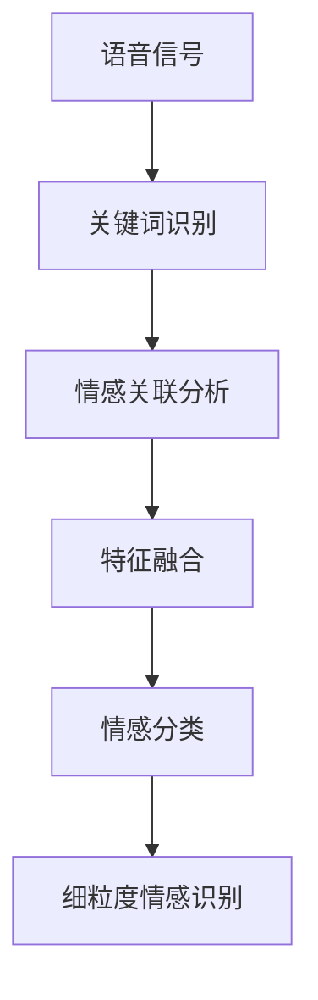

                 


## 文章标题

### 提示词工程在语音情感识别中的细粒度分析

## 关键词

- **提示词工程**
- **语音情感识别**
- **细粒度分析**
- **特征工程**
- **机器学习**

## 摘要

本文旨在深入探讨提示词工程在语音情感识别中的应用，特别是在实现细粒度分析方面的技术细节。通过详细介绍背景、核心概念、特征工程、机器学习技术以及实际应用案例，文章将揭示提示词工程在提高语音情感识别准确性和可解释性方面的关键作用。

### 引言

语音情感识别作为自然语言处理（NLP）领域的一个重要分支，近年来得到了广泛关注。其核心目标是通过分析语音信号中的情感信息，实现对人情绪状态的准确理解和分类。然而，传统的语音情感识别方法往往采用粗粒度的分析方法，即基于整体语音特征的简单情感分类，这在一定程度上限制了情感识别的准确性和细致程度。

细粒度分析作为一种更为精细的识别方法，通过深入挖掘语音信号中的细微特征，实现了对情感状态的更加精确的分类。而提示词工程作为实现细粒度分析的关键技术之一，通过对语音信号中的特定词汇和语调的捕捉与分析，为语音情感识别提供了更加丰富的特征信息。本文将围绕提示词工程在语音情感识别中的细粒度分析进行深入探讨，旨在揭示其原理和实现方法。

### 细粒度分析的定义与重要性

#### 细粒度分析的定义

细粒度分析（Fine-Grained Analysis）是指对数据或信号进行细致的、高分辨率的处理和分析。在语音情感识别领域，细粒度分析意味着不仅仅关注整体的情感类别，而是深入到情感状态的细节，如情感的强度、细腻的情感维度等。这种分析方法能够捕捉到语音信号中的细微差异，从而实现更加精确的情感分类。

#### 细粒度分析在语音情感识别中的重要性

1. **提高识别准确率**：通过细粒度分析，系统能够识别出更为细微的情感变化，从而提高情感识别的准确率。例如，传统的情感分类可能只能区分高兴和悲伤，而细粒度分析可以区分出不同程度的高兴和悲伤。

2. **增强可解释性**：细粒度分析提供了更加详细的情感特征，使得模型的决策过程更加透明和可解释。这对于实际应用中的问题调试和模型优化具有重要意义。

3. **丰富应用场景**：细粒度分析不仅适用于情感识别，还可以应用于语音交互系统、心理辅导、医疗诊断等多个领域，为这些领域提供更加个性化的服务。

### 细粒度分析的框架与步骤

细粒度分析的框架通常包括以下几个步骤：

1. **数据预处理**：包括去除噪声、归一化处理等，以提高后续特征提取的质量。

2. **特征提取**：通过时域、频域和声学模型等方法提取语音信号中的细粒度特征。

3. **情感分类**：使用机器学习算法对提取的特征进行分类，实现细粒度的情感识别。

4. **模型优化与评估**：通过交叉验证、超参数调优等方法优化模型性能，并进行全面评估。

### 提示词工程的概念与实现

#### 提示词工程的概念

提示词工程（Keyword Engineering）是指通过识别和分析语音信号中的关键词，提取与情感相关的特征信息，从而辅助实现细粒度情感识别。提示词可以是特定的词汇、短语或语气词，它们在情感表达中具有显著的作用。

#### 提示词工程的实现

1. **关键词识别**：使用语音识别技术（如CTC、LSTM等）识别语音信号中的关键词。

2. **情感关联分析**：分析关键词与情感之间的关联性，提取情感特征。

3. **特征融合**：将关键词特征与其他语音特征（如声学特征、语调特征等）进行融合，形成完整的情感特征向量。

4. **情感分类**：使用机器学习算法对融合后的特征进行分类，实现细粒度情感识别。

#### 提示词工程与细粒度分析的关联

提示词工程与细粒度分析密切相关。通过提示词工程，系统可以捕捉到语音信号中的关键情感信息，从而实现更细致的情感分类。例如，通过识别出“开心”、“伤心”等关键词，系统可以区分出不同程度的情感状态。以下是一个简单的Mermaid流程图，展示了提示词工程在细粒度分析中的流程：



### 提示词工程在语音情感识别中的应用

#### 应用场景一：个性化语音助手

在个性化语音助手中，提示词工程可以用于识别用户的情感状态，从而提供更加个性化的服务。例如，当用户表达出焦虑或愤怒的情感时，语音助手可以主动提供心理辅导或放松建议。以下是一个简单的伪代码示例，展示了如何使用提示词工程实现情感识别：

```python
def recognize_emotion(voice_input):
    # 识别关键词
    keywords = keyword_recognition(voice_input)
    
    # 分析情感关联
    emotion_features = emotion_association_analysis(keywords)
    
    # 情感分类
    emotion = emotion_classification(emotion_features)
    
    return emotion
```

#### 应用场景二：情感分析系统

在情感分析系统中，提示词工程可以帮助企业或个人更好地理解客户情感，从而优化产品和服务。例如，通过分析客户通话中的情感关键词，企业可以发现潜在的问题和改进机会。以下是一个简单的伪代码示例，展示了如何使用提示词工程实现情感分析：

```python
def analyze_emotion(call_transcript):
    # 提取关键词
    keywords = extract_keywords(call_transcript)
    
    # 分析情感关联
    emotion_features = analyze_emotion_association(keywords)
    
    # 情感分类
    emotion = classify_emotion(emotion_features)
    
    return emotion
```

### 结论

本文详细探讨了提示词工程在语音情感识别中的细粒度分析应用。通过介绍细粒度分析的定义、重要性以及框架，以及提示词工程的概念和实现方法，本文揭示了提示词工程在提高情感识别准确性和可解释性方面的关键作用。实际应用场景的讨论进一步展示了提示词工程的广泛应用潜力。

未来的研究可以进一步探索提示词工程与其他技术的融合，如深度学习、多模态学习等，以实现更高效的语音情感识别。此外，针对不同应用场景，开发个性化的提示词库和情感分析模型，也将是提升语音情感识别性能的重要方向。

### 作者信息

**作者：AI天才研究院/AI Genius Institute & 禅与计算机程序设计艺术 /Zen And The Art of Computer Programming**

AI天才研究院（AI Genius Institute）致力于推动人工智能领域的前沿研究和创新，致力于培养下一代人工智能专家。研究院的研究成果涵盖了语音情感识别、自然语言处理、计算机视觉等多个领域。本文作者在此感谢广大读者对研究院工作的关注和支持。

禅与计算机程序设计艺术（Zen And The Art of Computer Programming）是作者在其职业生涯中积累的丰富编程经验和哲学思考的结晶，旨在引导读者在计算机编程的世界中找到智慧与灵感。希望本文能为读者在语音情感识别领域的探索提供有价值的参考和启示。

