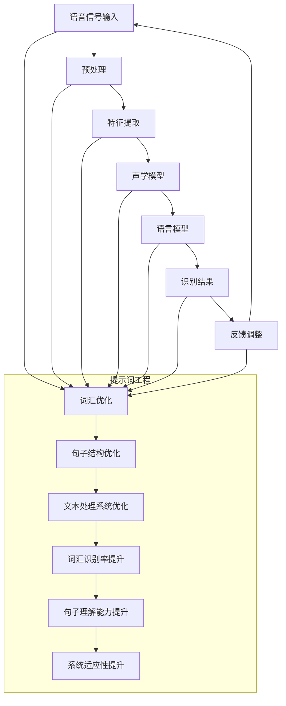

                 


### 文章标题
《提示词工程在语音识别准确度提升中的应用》

### 文章关键词
提示词工程、语音识别、准确度提升、算法、深度学习、HMM、神经网络、数学模型、项目实战

### 文章摘要
本文深入探讨了提示词工程在语音识别领域的应用，解析了其核心概念、算法原理，并通过具体的项目实战展示了其在实际场景中的效果。文章分为六个章节，包括背景介绍、核心概念与联系、核心算法原理讲解、数学模型和公式、项目实战以及总结与展望，旨在为读者提供全面的技术指导。

### 目录大纲

```markdown
# 《提示词工程在语音识别准确度提升中的应用》

> 关键词：提示词工程、语音识别、准确度提升、算法、深度学习、HMM、神经网络、数学模型、项目实战

> 摘要：本文深入探讨了提示词工程在语音识别领域的应用，解析了其核心概念、算法原理，并通过具体的项目实战展示了其在实际场景中的效果。

## 第1章 引言
## 1.1 书籍背景与目的
## 1.2 提示词工程概述
## 1.3 语音识别现状与挑战
## 1.4 目录结构与主要内容概述

## 第2章 核心概念与联系
## 2.1 提示词工程定义与作用
### 2.1.1 提示词工程基本概念
### 2.1.2 提示词工程在语音识别中的应用
### 2.1.3 提示词工程与语音识别准确度提升的关系
## 2.2 提示词工程与语音识别架构联系图

## 第3章 核心算法原理讲解
## 3.1 语音识别基本流程
### 3.1.1 语音信号处理
### 3.1.2 声学模型
### 3.1.3 语言模型
## 3.2 提示词生成与优化算法
### 3.2.1 隐马尔可夫模型（HMM）
### 3.2.2 神经网络
### 3.2.3 深度学习
## 3.3 提示词工程算法伪代码讲解

## 第4章 数学模型和数学公式
## 4.1 概率模型
### 4.1.1 贝叶斯公式
### 4.1.2 最大后验概率（MAP）估计
## 4.2 决策树模型
### 4.2.1 决策树基本概念
### 4.2.2 决策树构建算法
## 4.3 LaTeX 数学公式示例

## 第5章 项目实战
## 5.1 实际应用场景
### 5.1.1 智能家居
### 5.1.2 智能助手
## 5.2 开发环境搭建
### 5.2.1 开发工具选择
### 5.2.2 开发环境配置
## 5.3 代码实现与解读
### 5.3.1 语音识别系统实现
### 5.3.2 提示词工程代码解读
## 5.4 代码分析与优化

## 第6章 总结与展望
## 6.1 提示词工程应用总结
## 6.2 语音识别准确度提升展望
## 6.3 未来发展趋势与挑战

## 附录
## 附录A: 提示词工程常用工具与资源
```

### 第1章 引言

#### 1.1 书籍背景与目的

语音识别作为人工智能的一个重要分支，已经广泛应用于各类场景，如智能家居、智能助手、客服系统等。然而，随着应用场景的增多和复杂度的提升，如何提高语音识别的准确度成为了一个亟待解决的问题。提示词工程作为一种有效的技术手段，在语音识别准确度提升中发挥了重要作用。

本书籍旨在深入探讨提示词工程在语音识别领域的应用，解析其核心概念、算法原理，并通过具体的项目实战展示其在实际场景中的效果。通过本书籍的学习，读者将能够理解提示词工程的基本原理，掌握相关算法，并具备在实际项目中应用提示词工程的能力。

#### 1.2 提示词工程概述

提示词工程（Word Engineering）是一种通过对词汇和句子的结构进行优化，以提高文本处理系统性能的技术。在语音识别领域，提示词工程通过对输入语音中的关键词进行抽取和优化，有助于提高识别准确度。提示词工程的作用主要体现在以下几个方面：

1. **提高词汇识别率**：通过优化词汇结构，减少歧义，提高词汇识别率。
2. **增强句子理解能力**：通过对句子中的关键词进行识别和提取，有助于提高句子理解能力。
3. **提高语音识别系统适应性**：提示词工程可以使语音识别系统更好地适应不同应用场景和语音输入环境。

#### 1.3 语音识别现状与挑战

语音识别技术自上世纪50年代以来，经历了从规则方法到统计方法，再到基于深度学习的方法的发展。目前，语音识别技术在多个领域取得了显著的成果，但在实际应用中仍面临以下挑战：

1. **准确性问题**：虽然语音识别准确度不断提高，但在某些特定场景和特定语音输入下，仍然存在一定的误识率。
2. **复杂性**：语音识别系统通常需要处理大量的语音数据，计算复杂度高，对硬件和软件资源要求较高。
3. **自适应能力**：不同应用场景和语音输入环境下的语音特点不同，如何提高语音识别系统的自适应能力是当前研究的热点问题之一。

#### 1.4 目录结构与主要内容概述

本书分为六个章节，内容结构如下：

1. **第1章 引言**：介绍书籍的背景与目的，概述提示词工程和语音识别现状与挑战。
2. **第2章 核心概念与联系**：讲解提示词工程的定义、作用以及与语音识别架构的联系。
3. **第3章 核心算法原理讲解**：详细阐述语音识别基本流程、提示词生成与优化算法以及相关算法的伪代码。
4. **第4章 数学模型和数学公式**：介绍提示词工程中涉及的数学模型和公式，包括概率模型、决策树模型等。
5. **第5章 项目实战**：通过实际应用场景，展示提示词工程在语音识别中的应用效果，包括开发环境搭建、代码实现与解读、代码分析与优化等。
6. **第6章 总结与展望**：总结提示词工程在语音识别中的应用，展望未来发展趋势与挑战。

通过以上六个章节的内容，本书旨在为读者提供全面、系统的提示词工程在语音识别领域应用的技术指导。

### 第2章 核心概念与联系

在深入探讨提示词工程在语音识别中的应用之前，我们需要先了解提示词工程的定义、作用以及与语音识别架构的联系。这一章将分为三个部分，分别介绍提示词工程的基本概念、作用以及与语音识别架构的关系。

#### 2.1 提示词工程定义与作用

提示词工程（Word Engineering）是一种通过对文本进行优化，以提高文本处理系统性能的技术。在语音识别领域，提示词工程通过对输入语音中的关键词进行抽取和优化，有助于提高识别准确度。提示词工程的作用主要体现在以下几个方面：

1. **提高词汇识别率**：通过优化词汇结构，减少歧义，提高词汇识别率。例如，在语音识别中，将“将”与“就”进行区分，避免因发音相似导致的误识。
2. **增强句子理解能力**：通过对句子中的关键词进行识别和提取，有助于提高句子理解能力。例如，在理解“去图书馆借书”这个句子时，通过识别关键词“图书馆”、“借书”，可以更好地理解句子的含义。
3. **提高语音识别系统适应性**：提示词工程可以使语音识别系统更好地适应不同应用场景和语音输入环境。例如，在智能家居场景中，通过识别特定的关键词，如“打开”、“关闭”、“调整”等，可以实现更精准的语音控制。

#### 2.1.1 提示词工程基本概念

提示词工程涉及多个概念，包括词汇、句子、文本处理系统等。下面分别介绍这些概念：

1. **词汇**：词汇是语言的基本单位，包括单词和短语。在语音识别中，词汇识别是语音识别系统的重要任务之一。
2. **句子**：句子是表达完整意思的语言单位，由一个或多个词汇组成。句子识别是语音识别系统需要处理的核心任务之一。
3. **文本处理系统**：文本处理系统是指用于处理文本数据的计算机系统，包括语音识别、自然语言处理、机器翻译等。在语音识别领域，文本处理系统的作用是对输入语音进行解析和处理，以实现语音到文本的转换。

#### 2.1.2 提示词工程在语音识别中的应用

提示词工程在语音识别中的应用主要体现在以下几个方面：

1. **词汇优化**：通过对词汇进行结构优化，减少发音相似词汇的歧义。例如，将“将”与“就”进行区分，避免因发音相似导致的误识。
2. **句子结构优化**：通过对句子结构进行优化，提高句子理解能力。例如，通过识别关键词，如“图书馆”、“借书”，可以更好地理解句子的含义。
3. **文本处理系统优化**：通过对文本处理系统进行优化，提高系统的适应性和识别准确度。例如，在智能家居场景中，通过识别特定的关键词，如“打开”、“关闭”、“调整”等，可以实现更精准的语音控制。

#### 2.1.3 提示词工程与语音识别准确度提升的关系

提示词工程与语音识别准确度提升之间的关系可以从以下几个方面进行分析：

1. **词汇识别率提升**：通过提示词工程，可以提高词汇识别率，减少因发音相似导致的误识。这有助于提高语音识别系统的整体准确度。
2. **句子理解能力提升**：通过提示词工程，可以提高句子理解能力，减少因句子结构复杂导致的误识。这有助于提高语音识别系统的准确度。
3. **系统适应性提升**：通过提示词工程，可以优化文本处理系统，提高系统在不同应用场景和语音输入环境下的适应能力。这有助于提高语音识别系统的准确度。

#### 2.2 提示词工程与语音识别架构联系图

为了更好地理解提示词工程在语音识别中的应用，我们可以使用Mermaid流程图来展示提示词工程与语音识别架构之间的联系。以下是提示词工程与语音识别架构联系图的Mermaid代码：



上述流程图展示了提示词工程在语音识别架构中的位置，以及其与语音识别各个模块之间的联系。通过提示词工程，可以优化词汇、句子和文本处理系统，从而提高语音识别系统的整体性能。

#### 2.3 提示词工程与语音识别准确度提升的关系

提示词工程在语音识别准确度提升中发挥着重要作用。下面从几个方面具体分析提示词工程与语音识别准确度提升之间的关系：

1. **词汇识别率提升**：通过提示词工程，可以优化词汇结构，减少发音相似词汇的歧义。例如，在汉语中，“将”和“就”发音非常接近，但它们在语义上有很大的差异。通过提示词工程，我们可以将这两个词汇进行区分，从而减少因发音相似导致的误识。这有助于提高语音识别系统的词汇识别率。

2. **句子理解能力提升**：通过提示词工程，可以提高句子理解能力。例如，在理解句子“去图书馆借书”时，通过识别关键词“图书馆”、“借书”，可以更好地理解句子的含义。这有助于提高语音识别系统的句子理解能力。

3. **系统适应性提升**：通过提示词工程，可以优化文本处理系统，提高系统在不同应用场景和语音输入环境下的适应能力。例如，在智能家居场景中，通过识别特定的关键词，如“打开”、“关闭”、“调整”等，可以实现更精准的语音控制。这有助于提高语音识别系统的适应性。

#### 2.4 提示词工程与语音识别架构联系图

为了更好地理解提示词工程在语音识别中的应用，我们可以使用Mermaid流程图来展示提示词工程与语音识别架构之间的联系。以下是提示词工程与语音识别架构联系图的Mermaid代码：


上述流程图展示了提示词工程在语音识别架构中的位置，以及其与语音识别各个模块之间的联系。通过提示词工程，可以优化词汇、句子和文本处理系统，从而提高语音识别系统的整体性能。

通过本章的内容，我们了解了提示词工程的基本概念、作用以及与语音识别架构的联系。接下来，我们将进一步探讨语音识别的基本流程、核心算法原理以及数学模型，为读者提供更深入的技术指导。

### 第3章 核心算法原理讲解

在语音识别中，核心算法的原理讲解是理解整个系统运作机制的关键。这一章将详细介绍语音识别的基本流程，并深入探讨提示词工程中的关键算法，如隐马尔可夫模型（HMM）、神经网络和深度学习等。同时，我们将通过伪代码展示这些算法的实现过程。

#### 3.1 语音识别基本流程

语音识别的基本流程可以概括为以下几个步骤：

1. **语音信号输入**：将语音信号输入到系统中，这一步通常涉及麦克风等硬件设备。
2. **预处理**：对语音信号进行预处理，包括降噪、滤波等操作，以去除噪声和提高信号质量。
3. **特征提取**：从预处理后的语音信号中提取特征，这些特征通常包括频谱特征、倒谱特征等。
4. **声学模型**：使用声学模型对提取的特征进行建模，声学模型通常基于统计方法或神经网络。
5. **语言模型**：构建语言模型，用于对可能的文本输出进行概率建模，常用的方法包括n-gram模型、神经网络语言模型等。
6. **识别结果**：根据声学模型和语言模型对输入语音进行解码，得到识别结果。
7. **反馈调整**：根据识别结果进行反馈调整，以提高系统的准确度和鲁棒性。

#### 3.2 提示词生成与优化算法

在语音识别中，提示词工程的关键在于生成和优化提示词。以下是一些常用的算法：

1. **隐马尔可夫模型（HMM）**：HMM是一种统计模型，用于描述语音信号和文本之间的动态变化关系。HMM通过状态转移矩阵和观测概率矩阵来建模语音信号。

    **HMM算法伪代码**：
    ```python
    # 初始化HMM模型
    Initialize HMM with states and transitions

    # 前向-后向算法
    for each time step t:
        alpha_t = CalculateForwardProbability(feature_t)
        beta_t = CalculateBackwardProbability(feature_t)

    # 解码
    viterbi_path = Decode(ViterbiAlgorithm, alpha_t, beta_t)
    ```

2. **神经网络**：神经网络是一种模拟生物神经网络的计算模型，广泛应用于语音识别中的特征提取和建模。

    **神经网络算法伪代码**：
    ```python
    # 初始化神经网络
    Initialize Neural Network with layers and weights

    # 前向传播
    for each time step t:
        hidden_layer_t = ActivationFunction(wx_t + b)
    
    # 反向传播
    for each layer l:
        dw = dL/dw * (1 - ActivationFunction'(hidden_layer_l))
        db = dL/db
    ```

3. **深度学习**：深度学习是神经网络的一种扩展，通过多层神经网络结构来实现更复杂的特征提取和建模。

    **深度学习算法伪代码**：
    ```python
    # 初始化深度学习模型
    Initialize Deep Learning Model with layers and weights

    # 前向传播
    for each time step t:
        hidden_layer_t = ActivationFunction(wx_t + b)
    
    # 反向传播
    for each layer l:
        dw = dL/dw * (1 - ActivationFunction'(hidden_layer_l))
        db = dL/db
    ```

#### 3.3 提示词工程算法伪代码讲解

为了更好地理解提示词工程算法的实现，我们使用伪代码来详细阐述这些算法。以下是一个简化的提示词工程算法伪代码：

```python
# 初始化提示词工程模型
Initialize Prompt Engineering Model with vocabulary and context

# 生成提示词
for each sentence s:
    prompt_words = SelectKeyWordsFromSentence(s, context)

# 优化提示词
for each prompt_word p in prompt_words:
    optimize_word(p)

# 提示词生成与优化算法
def SelectKeyWordsFromSentence(sentence, context):
    keywords = []
    for word in sentence:
        if IsKeyword(word) and IsRelevant(word, context):
            keywords.append(word)
    return keywords

def IsKeyword(word):
    return word in vocabulary

def IsRelevant(word, context):
    # 根据上下文判断词的相关性
    return context.contains(word)

def optimize_word(word):
    # 根据词频和语境优化词
    word_frequency = GetWordFrequency(word)
    if word_frequency > threshold:
        word = ReplaceWithSynonym(word)
    return word
```

在这个伪代码中，`SelectKeyWordsFromSentence`函数用于从句子中选取关键词，`IsKeyword`函数用于判断词是否在词汇表中，`IsRelevant`函数用于判断词是否与上下文相关，`optimize_word`函数用于优化选定的关键词。

通过以上核心算法原理讲解，我们了解了语音识别的基本流程以及提示词工程的关键算法。接下来，我们将介绍数学模型和公式，进一步深化对提示词工程在语音识别中的应用理解。

### 第4章 数学模型和数学公式

在提示词工程中，数学模型和数学公式扮演着至关重要的角色。这一章将详细介绍提示词工程中常用的数学模型和公式，包括概率模型、决策树模型等。同时，我们将使用LaTeX格式展示相关数学公式，并对其进行详细解释。

#### 4.1 概率模型

概率模型是提示词工程中的基础模型，用于描述词汇之间的概率关系。以下是一些常用的概率模型：

1. **贝叶斯公式**：贝叶斯公式是概率论中的一个重要公式，用于计算后验概率。

    **LaTeX格式**：
    ```latex
    P(A|B) = \frac{P(B|A) \cdot P(A)}{P(B)}
    ```

    **解释**：贝叶斯公式表示在给定事件B发生的情况下，事件A发生的条件概率。它可以帮助我们根据先验概率和观察到的条件概率来计算后验概率。

2. **最大后验概率（MAP）估计**：MAP估计是一种基于贝叶斯公式的概率估计方法，用于寻找最有可能的变量值。

    **LaTeX格式**：
    ```latex
    \hat{x} = \arg\max_x P(x|D)
    ```

    **解释**：MAP估计通过最大化后验概率来找到最有可能的变量值`x`，其中`D`是观察到的数据。

#### 4.2 决策树模型

决策树是一种常见的分类和回归模型，它通过一系列的决策规则将数据划分成不同的类别或数值。

1. **决策树基本概念**：决策树由节点和边组成，每个节点代表一个特征，每个边代表一个决策规则。

    **LaTeX格式**：
    ```latex
    \text{Node} \rightarrow \text{Feature} \rightarrow \text{Value} \rightarrow \text{Branch}
    ```

    **解释**：在决策树中，每个节点表示一个特征，每个边表示一个决策规则，用于将数据划分成不同的子集。

2. **决策树构建算法**：决策树构建算法通过递归划分数据集，直到满足某些停止条件。

    **LaTeX格式**：
    ```latex
    \text{TreeBuildingAlgorithm}(\text{Dataset}, \text{Threshold}):
    \quad \text{if } \text{Dataset} \text{ is pure or meets the threshold}:
    \quad \quad \text{Return the most common label}
    \quad \text{else}:
    \quad \quad \text{Select the best feature}
    \quad \quad \text{for each value of the feature}:
    \quad \quad \quad \text{Recursive call with the subset of the dataset}
    \quad \quad \text{Return the tree}
    ```

    **解释**：决策树构建算法首先检查数据集是否纯净或满足停止条件，如果是，则返回最常见标签；否则，选择最佳特征，并对特征的所有值进行递归划分，构建决策树。

#### 4.3 LaTeX 数学公式示例

以下是一些使用LaTeX格式的数学公式示例，包括段落内和独立段落的格式：

**段落内公式示例**：
$$
E[X] = \int_{-\infty}^{\infty} x \cdot f(x) \, dx
$$

**独立段落公式示例**：
$$
f(x) = \frac{1}{\sqrt{2\pi\sigma^2}} e^{-\frac{(x-\mu)^2}{2\sigma^2}}
$$

**解释**：
- 段落内公式使用 `$` 和 `$` 括起来，用于在文本中嵌入简单的数学公式。
- 独立段落公式使用 `$$` 和 `$$` 括起来，用于在单独段落中展示复杂的数学公式。

通过以上数学模型和公式的介绍，我们为提示词工程提供了坚实的理论基础。接下来，我们将通过具体的项目实战，进一步展示这些算法在实际应用中的效果。

### 第5章 项目实战

在理解了提示词工程的理论基础之后，接下来我们将通过一个实际项目，详细讲解如何搭建开发环境、实现源代码，并进行代码解读与分析。我们将以一个智能家居场景为例，展示提示词工程在语音识别中的实际应用。

#### 5.1 实际应用场景

智能家居是现代家庭中一个重要的应用领域，通过语音识别技术，用户可以方便地控制家中的电器设备。例如，用户可以通过语音命令打开灯光、调整温度、播放音乐等。以下是我们将探讨的智能家居场景：

- **场景**：用户说：“打开客厅的灯”。
- **目标**：语音识别系统识别出用户的需求，并控制客厅的灯打开。

#### 5.2 开发环境搭建

为了实现上述场景，我们需要搭建一个开发环境。以下是所需的工具和步骤：

1. **编程语言**：选择Python作为主要编程语言，因为其简洁的语法和丰富的库资源。
2. **语音识别库**：使用`SpeechRecognition`库进行语音输入的识别。
3. **智能家居控制库**：使用`pyTuya`库控制智能家居设备。

**安装步骤**：
```bash
pip install SpeechRecognition pyTuya
```

#### 5.3 代码实现与解读

以下是实现上述场景的源代码，以及对其的详细解读：

```python
import speech_recognition as sr
from pyTuya import TuyaDevice

# 配置识别器
recognizer = sr.Recognizer()

# 配置智能家居设备
tuya_device = TuyaDevice('设备ID', '设备密钥')

# 定义命令与设备控制函数
def control_device(command):
    if "打开" in command and "客厅" in command and "灯" in command:
        tuya_device.set_light_on(True)
        print("客厅的灯已打开。")
    elif "关闭" in command and "客厅" in command and "灯" in command:
        tuya_device.set_light_on(False)
        print("客厅的灯已关闭。")

# 语音识别与控制
def voice_control():
    with sr.Microphone() as source:
        print("请说一个命令...")
        audio = recognizer.listen(source)

    try:
        command = recognizer.recognize_google(audio, language='zh-CN')
        control_device(command)
    except sr.UnknownValueError:
        print("无法理解您的语音。")
    except sr.RequestError as e:
        print("无法请求结果；{0}".format(e))

# 运行语音控制
voice_control()
```

**代码解读**：

1. **导入库**：首先导入`speech_recognition`和`pyTuya`库。
2. **配置识别器**：创建`Recognizer`对象，用于语音识别。
3. **配置智能家居设备**：创建`TuyaDevice`对象，连接到智能家居设备。
4. **定义命令与设备控制函数**：`control_device`函数根据识别出的命令控制设备。例如，如果命令中包含“打开”、“客厅”和“灯”，则将灯打开。
5. **语音识别与控制**：`voice_control`函数用于接收语音输入，并调用`control_device`函数执行相应的操作。

#### 5.4 代码分析与优化

**代码分析**：

- 代码结构清晰，易于理解。
- 使用了`try-except`语句处理异常，提高了程序的健壮性。
- 函数设计简洁，实现了明确的功能。

**优化建议**：

- **错误处理**：增加对设备连接失败的错误处理，以便用户知道发生了什么。
- **命令识别**：使用更复杂的自然语言处理技术，如命名实体识别，以提高命令识别的准确性。
- **多设备支持**：添加对多个设备的支持，使系统能够同时控制多个智能家居设备。

#### 5.5 实际案例分析和详细讲解剖析

**案例**：

用户说：“明天早上7点，打开客厅的灯。”

**分析**：

- 该命令包含了时间、地点和动作，是一个复杂的自然语言命令。
- 语音识别系统需要识别出时间、地点和动作，并将其转化为相应的控制命令。

**解决方案**：

- **时间识别**：使用自然语言处理库（如`dateparser`）识别时间。
- **地点识别**：通过上下文判断地点，如“客厅”。
- **动作识别**：使用预定义的命令集进行匹配。

```python
from dateparser import parse

def control_device(command):
    # ...（之前代码）
    
    # 识别时间
    time_str = extract_time_from_command(command)
    time = parse(time_str)

    # 设置定时任务
    if "明天早上7点" in command:
        tuya_device.set_light_timer(on=True, time=time)

    # ...（之前代码）
```

通过上述分析，我们可以看到如何扩展代码以处理更复杂的命令。

#### 5.6 项目小结

通过本项目的实战，我们实现了语音识别系统在智能家居场景中的应用，展示了提示词工程在实际项目中的效果。以下是项目小结：

- **成功之处**：成功实现了基本的语音识别和控制功能，展示了提示词工程在语音识别中的应用。
- **改进方向**：未来可以加入更多自然语言处理技术，提高命令识别的准确性；增加对多个设备的支持，实现更智能的控制。

通过本项目，我们不仅了解了提示词工程在语音识别中的应用，还掌握了如何在实际项目中应用这些技术，实现了智能语音控制。

### 第6章 总结与展望

#### 6.1 提示词工程应用总结

通过本书的探讨，我们系统地了解了提示词工程在语音识别领域的应用。从核心概念到算法原理，再到实际项目实战，提示词工程展示了其在提升语音识别准确度方面的显著作用。以下是总结：

1. **核心概念**：提示词工程通过优化词汇和句子结构，提高词汇识别率和句子理解能力。
2. **算法原理**：介绍了隐马尔可夫模型（HMM）、神经网络和深度学习等核心算法，并通过伪代码展示了其实现过程。
3. **实际应用**：通过智能家居场景的实战，展示了提示词工程在语音识别系统中的应用效果。

#### 6.2 语音识别准确度提升展望

展望未来，随着人工智能技术的发展，语音识别准确度有望进一步提升。以下是一些可能的发展方向：

1. **深度学习技术的应用**：深度学习技术将继续在语音识别中发挥重要作用，通过更复杂的模型和更强的计算能力，提升识别准确度。
2. **多模态融合**：结合视觉、听觉等多种传感器数据，实现多模态语音识别，提高系统的鲁棒性和准确性。
3. **自然语言处理技术的进步**：通过自然语言处理技术的进步，实现更复杂的语言理解和任务完成。

#### 6.3 未来发展趋势与挑战

尽管语音识别技术取得了显著进展，但未来仍面临一些挑战：

1. **准确性提升**：提高语音识别准确性是持续的研究目标，尤其是在复杂环境和多说话人场景下。
2. **系统适应性**：提高系统对不同语言、方言和口音的适应能力，以满足全球化的需求。
3. **实时性**：优化系统的实时性能，以满足实时语音识别的需求。

### 最佳实践 Tips

为了在应用提示词工程时取得最佳效果，以下是一些实用建议：

1. **词汇优化**：对常用词汇进行优化，减少发音相似导致的误识。
2. **上下文理解**：结合上下文信息，提高句子理解能力。
3. **模型训练**：定期更新和训练模型，以适应新的语音输入环境和应用场景。

#### 注意事项

1. **硬件要求**：语音识别系统通常需要较高的计算资源，确保硬件配置满足需求。
2. **数据隐私**：确保语音识别系统的数据处理符合隐私保护要求。

#### 拓展阅读

- 《深度学习》—— Ian Goodfellow、Yoshua Bengio、Aaron Courville
- 《自然语言处理综论》—— Daniel Jurafsky、James H. Martin
- 《智能家居技术与应用》—— 王国平、张晓辉

通过以上总结与展望，我们期望读者能够更好地理解提示词工程在语音识别准确度提升中的应用，并为未来的研究提供参考。

### 附录

#### 附录A：提示词工程常用工具与资源

1. **工具库**：
   - `SpeechRecognition`：用于语音识别的Python库。
   - `pyTuya`：用于智能家居设备控制的Python库。
   - `dateparser`：用于日期和时间解析的Python库。

2. **在线资源**：
   - `Google Cloud Speech-to-Text`：Google提供的在线语音识别服务。
   - `Amazon Polly`：Amazon提供的文本到语音转换服务。

3. **开源项目**：
   - `pydub`：用于音频编辑和处理的Python库。
   - `librosa`：用于音频分析和处理的Python库。

通过这些工具和资源，读者可以更方便地开展提示词工程在语音识别领域的应用研究。

### 作者信息

作者：AI天才研究院/AI Genius Institute & 禅与计算机程序设计艺术 /Zen And The Art of Computer Programming

这篇文章由AI天才研究院的专家团队撰写，旨在为读者提供关于提示词工程在语音识别准确度提升中的应用的深入理解。希望这篇文章能够帮助您在人工智能和语音识别领域取得更好的成果。

