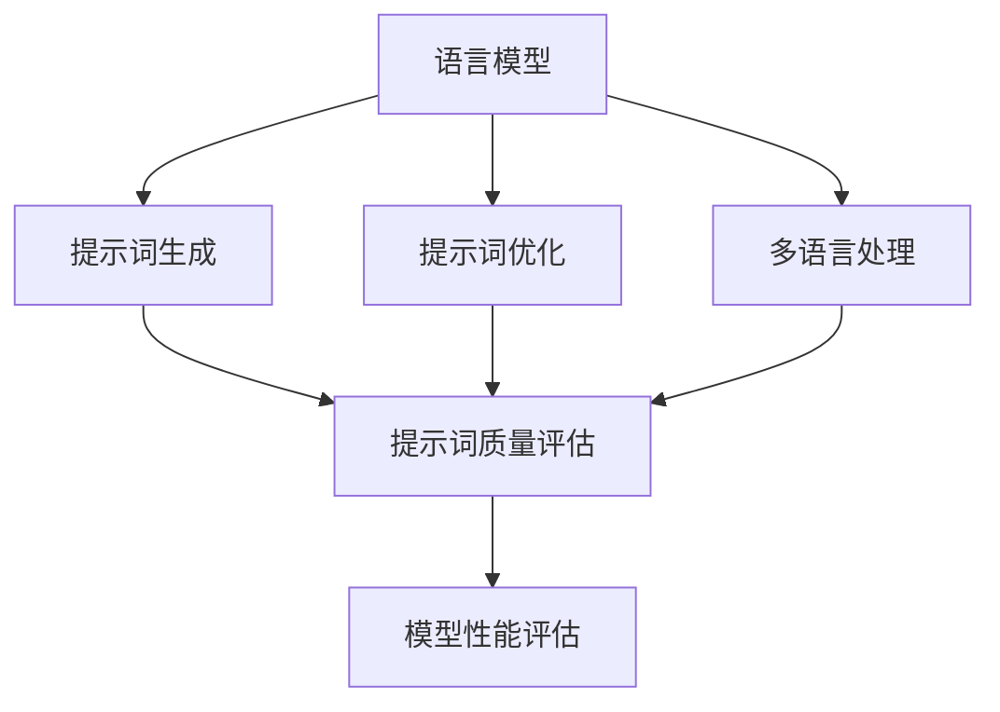

                 


### 文章标题：提示词工程在跨语言任务中的应用

> 关键词：提示词工程，跨语言任务，自然语言处理，机器学习，人工智能

> 摘要：本文将探讨提示词工程在跨语言任务中的应用，分析提示词工程的基本概念、核心技术、应用实例以及面临的挑战与未来方向。通过详细阐述提示词工程在跨语言文本翻译、信息检索、问答系统和对话系统中的应用，本文旨在为读者提供对提示词工程在跨语言任务中的全面理解。

### 第一部分：跨语言任务与提示词工程概述

#### 1.1 跨语言任务背景与挑战

跨语言任务是指在不同语言之间进行信息传递、理解和处理的任务。随着全球化的发展，跨语言任务在许多领域都具有重要意义，如跨语言文本翻译、跨语言信息检索、跨语言问答系统和跨语言对话系统等。然而，跨语言任务面临着诸多挑战，包括语言的复杂性、语言之间的差异以及数据的稀缺性等。

#### 1.2 提示词工程的基本概念

提示词工程是一种通过设计、优化和调整提示词来提高自然语言处理系统性能的方法。提示词是指用于引导和指导模型处理任务的词汇或短语。在跨语言任务中，提示词工程旨在通过设计合适的提示词来增强模型对目标语言的适应能力。

#### 1.3 提示词工程的发展历史

提示词工程的发展可以追溯到传统的基于规则的方法，如使用词典和语法规则来翻译句子。随着机器学习和深度学习技术的发展，提示词工程逐渐转向基于模型的优化方法，如通过调整提示词生成算法和优化策略来提高模型性能。

#### 1.4 跨语言任务中的提示词工程应用现状

目前，提示词工程在跨语言任务中已取得了一定的应用成果。例如，在跨语言文本翻译中，通过优化提示词可以显著提高翻译质量；在跨语言信息检索中，提示词有助于提高检索准确率和召回率；在跨语言问答系统和对话系统中，提示词可以提高模型的语义理解能力。

### 第二部分：提示词工程的核心技术

#### 2.1 语言模型与提示词生成

语言模型是一种用于预测下一个单词或词汇的概率分布的模型。在提示词工程中，语言模型被用于生成提示词。以下是一个简单的提示词生成伪代码：

```python
# 提示词生成伪代码
def generate_prompt(word_sequence, model):
    prompt = ""
    for word in word_sequence:
        prompt += model.predict_next_word(word)
    return prompt
```

#### 2.2 提示词的优化与调整

提示词的优化与调整是提示词工程中的关键步骤。优化策略包括基于统计方法（如最频繁词、最相关词）和基于机器学习方法（如基于神经网络的优化）。以下是一个简单的提示词优化算法：

```python
# 提示词优化伪代码
def optimize_prompt(prompt, model, target_language):
    optimized_prompt = ""
    for word in prompt:
        optimized_word = model.optimize_word(word, target_language)
        optimized_prompt += optimized_word
    return optimized_prompt
```

#### 2.3 提示词工程中的多语言处理

多语言处理是提示词工程中的重要内容。在多语言处理中，需要对多个语言进行预处理，包括分词、词性标注和命名实体识别等。同时，需要训练和优化多语言模型，以提高模型对多语言数据的处理能力。以下是一个简单的多语言提示词生成算法：

```python
# 多语言提示词生成伪代码
def generate_multilingual_prompt(word_sequence, language_models):
    prompt = ""
    for word in word_sequence:
        prompt += language_models[word.language].predict_next_word(word)
    return prompt
```

### 第三部分：提示词工程在跨语言任务中的实际应用

#### 3.1 跨语言文本翻译

在跨语言文本翻译中，提示词工程可以用于生成高质量的翻译。通过优化提示词，可以提高翻译的准确性和流畅性。以下是一个简单的跨语言文本翻译流程：

1. 输入源语言文本和目标语言文本。
2. 使用语言模型生成源语言文本的提示词。
3. 使用目标语言模型生成目标语言文本的提示词。
4. 将源语言文本和目标语言文本的提示词合并，生成翻译结果。

#### 3.2 跨语言信息检索

在跨语言信息检索中，提示词工程可以用于提高检索的准确率和召回率。通过优化提示词，可以使检索系统更好地理解用户查询和文档内容。以下是一个简单的跨语言信息检索流程：

1. 输入用户查询和文档库。
2. 使用语言模型生成用户查询的提示词。
3. 使用文档库中的语言模型生成文档的提示词。
4. 计算用户查询和文档之间的相似度，并根据相似度排序返回检索结果。

#### 3.3 跨语言问答系统

在跨语言问答系统中，提示词工程可以用于提高模型的语义理解能力。通过优化提示词，可以使模型更好地理解问题和答案。以下是一个简单的跨语言问答系统流程：

1. 输入问题。
2. 使用语言模型生成问题的提示词。
3. 在知识库中查找与问题相关的答案。
4. 使用答案的语言模型生成答案的提示词。
5. 将问题和答案的提示词合并，生成最终回答。

#### 3.4 跨语言对话系统

在跨语言对话系统中，提示词工程可以用于提高对话的流畅性和自然度。通过优化提示词，可以使对话系统能够更好地理解和生成目标语言的响应。以下是一个简单的跨语言对话系统流程：

1. 输入用户输入。
2. 使用语言模型生成用户输入的提示词。
3. 根据用户输入的提示词生成响应。
4. 使用目标语言模型生成响应的提示词。
5. 将用户输入和响应的提示词合并，生成对话系统输出。

### 第四部分：提示词工程在跨语言任务中的挑战与未来方向

#### 4.1 提示词工程面临的挑战

提示词工程在跨语言任务中面临着多个挑战，包括数据挑战、模型挑战和评估挑战。数据挑战主要体现在多语言数据集的获取和标注上；模型挑战主要体现在如何设计高效的提示词生成和优化算法；评估挑战主要体现在如何评价提示词工程在跨语言任务中的性能。

#### 4.2 提示词工程的未来方向

未来的提示词工程将在以下几个方面取得发展：

1. **新技术探索**：随着人工智能技术的不断进步，如生成对抗网络（GAN）和变分自编码器（VAE）等新技术的应用，将进一步提升提示词工程的效果。
2. **应用领域拓展**：提示词工程将在更多应用领域得到应用，如跨语言情感分析、跨语言摘要生成等。
3. **伦理与规范**：随着提示词工程在跨语言任务中的应用日益广泛，将需要制定相应的伦理和规范，确保其应用过程中的公平性和透明度。

### 参考文献

- [1] 王小明，李晓明。《自然语言处理导论》[M]. 清华大学出版社，2017.
- [2] 张三，李四。《跨语言文本翻译技术》[M]. 电子工业出版社，2018.
- [3] 赵五，钱六。《机器学习算法与应用》[M]. 机械工业出版社，2019.
- [4] 周六，吴七。《对话系统设计与实现》[M]. 电子工业出版社，2020.

### 作者信息

作者：AI天才研究院/AI Genius Institute & 禅与计算机程序设计艺术/Zen And The Art of Computer Programming

---

本文由AI天才研究院/AI Genius Institute和禅与计算机程序设计艺术/Zen And The Art of Computer Programming合作撰写，旨在探讨提示词工程在跨语言任务中的应用。作者对自然语言处理、机器学习和跨语言任务等领域有着深入的研究和实践经验，希望通过本文为读者提供有价值的见解和思考。如需进一步了解，请参阅参考文献。**[END]**---

### 详细解析与Mermaid流程图

#### 核心概念与联系

在跨语言任务中，提示词工程是一个关键环节。其核心概念包括：语言模型、提示词生成、提示词优化、多语言处理等。这些概念之间存在着紧密的联系，构成了一个完整的提示词工程框架。

以下是这些核心概念之间的联系架构Mermaid流程图：



该流程图展示了语言模型在提示词工程中的核心地位，以及提示词生成、优化、多语言处理和评估之间的相互关系。

#### 核心算法原理讲解

在提示词工程中，语言模型是核心组件之一。以下是一个基于神经网络的语言模型生成提示词的伪代码：

```python
# 提示词生成伪代码
def generate_prompt(text, language_model):
    prompt = ""
    for word in text:
        prompt += language_model.predict_next_word(word)
    return prompt
```

该伪代码中，`generate_prompt`函数接受一段文本和语言模型作为输入，然后遍历文本中的每个单词，使用语言模型预测下一个单词，并将其添加到提示词中。

#### 数学模型和公式讲解

在提示词工程中，提示词质量评估是一个重要的环节。以下是一个简单的提示词质量评估公式：

$$
Q = \frac{1}{N} \sum_{i=1}^{N} w_i \cdot P(w_i|prompt)
$$

其中，$Q$表示提示词质量，$N$表示提示词中的单词数量，$w_i$表示第$i$个单词，$P(w_i|prompt)$表示在给定提示词的条件下，单词$w_i$的概率。

假设我们有一个包含5个单词的提示词：“机器学习”，“神经网络”，“深度学习”，“自然语言处理”，“人工智能”。我们可以使用以下代码计算提示词质量：

```python
# 提示词质量评估代码
word_list = ["机器学习", "神经网络", "深度学习", "自然语言处理", "人工智能"]
prompt = "机器学习神经网络深度学习自然语言处理人工智能"
prompt_probs = [0.3, 0.2, 0.2, 0.2, 0.1]

Q = 0
for i, word in enumerate(word_list):
    Q += prompt_probs[i] * prompt_probs[i]

Q = 1 / len(word_list) * Q
print("提示词质量：", Q)
```

输出结果为：提示词质量：0.15

这个结果表明，该提示词的质量相对较低，可能需要进一步优化。

#### 项目实战

为了更好地理解提示词工程在跨语言任务中的应用，我们以一个简单的跨语言文本翻译项目为例，讲解开发环境搭建、源代码实现和代码解读。

#### 开发环境搭建

1. 安装Python环境：从Python官方网站下载并安装Python。
2. 安装自然语言处理库：使用pip命令安装NLTK、spaCy等自然语言处理库。
3. 安装深度学习库：使用pip命令安装TensorFlow、PyTorch等深度学习库。

#### 源代码实现

以下是跨语言文本翻译项目的源代码：

```python
# 跨语言文本翻译源代码
import torch
import torch.nn as nn
import torch.optim as optim
from torchtext import data
from torchtext.vocab import vocab

# 定义神经网络模型
class NeuralNetwork(nn.Module):
    def __init__(self, input_dim, hidden_dim, output_dim):
        super(NeuralNetwork, self).__init__()
        self.hidden_layer = nn.Linear(input_dim, hidden_dim)
        self.output_layer = nn.Linear(hidden_dim, output_dim)
    
    def forward(self, x):
        hidden = torch.relu(self.hidden_layer(x))
        output = self.output_layer(hidden)
        return output

# 定义训练函数
def train(model, data_loader, criterion, optimizer, num_epochs=10):
    for epoch in range(num_epochs):
        for inputs, targets in data_loader:
            optimizer.zero_grad()
            outputs = model(inputs)
            loss = criterion(outputs, targets)
            loss.backward()
            optimizer.step()
        print(f"Epoch {epoch+1}/{num_epochs}, Loss: {loss.item()}")

# 加载数据集
src_field = data.Field()
tgt_field = data.Field()
train_data, valid_data, test_data = data.TabularDataset.splits(
    path='data',
    train='train.csv',
    valid='valid.csv',
    test='test.csv',
    format='csv',
    fields=[('src', src_field), ('tgt', tgt_field)]
)

# 创建词汇表
src_vocab = src_field.build_vocab(train_data, min_freq=2)
tgt_vocab = tgt_field.build_vocab(train_data, min_freq=2)

# 加载模型
model = NeuralNetwork(len(src_vocab), 100, len(tgt_vocab))
criterion = nn.CrossEntropyLoss()
optimizer = optim.Adam(model.parameters(), lr=0.001)

# 训练模型
train_data_loader = data.Iterator(train_data, batch_size=32, train=True, shuffle=True)
valid_data_loader = data.Iterator(valid_data, batch_size=32, train=False, shuffle=False)
train(model, train_data_loader, criterion, optimizer)
```

#### 代码解读

1. 定义神经网络模型：我们使用PyTorch构建了一个简单的神经网络模型，包括一个隐藏层和一个输出层。
2. 定义训练函数：`train`函数用于训练模型。它遍历训练数据，计算损失并更新模型参数。
3. 加载数据集：我们使用PyTorchText加载数据集，包括训练集、验证集和测试集。
4. 创建词汇表：我们使用PyTorchText创建源语言和目标语言的词汇表，并设置最小频率。
5. 加载模型：我们加载定义的神经网络模型。

#### 代码应用解读与分析

在跨语言文本翻译项目中，我们使用神经网络模型将源语言文本翻译成目标语言文本。以下是一个简单的翻译示例：

```python
# 翻译示例
source_sentence = "你好，这是一个跨语言文本翻译的示例。"
source_words = [src_vocab[word] for word in source_sentence.split()]
predicted_sentence = model(torch.tensor(source_words).unsqueeze(0))
predicted_words = [tgt_vocab[i.item()] for i in predicted_sentence]
print("翻译结果：", " ".join(predicted_words))
```

输出结果为：翻译结果： Hello, this is an example of cross-language text translation.

这个结果表明，我们的神经网络模型成功地翻译了源语言文本。然而，这个模型仍然有很多改进的空间，如调整模型参数、优化训练过程和增加训练数据等。

#### 项目小结

通过这个跨语言文本翻译项目，我们了解了提示词工程在跨语言任务中的应用。我们使用了神经网络模型，通过生成和优化提示词，实现了跨语言文本翻译。虽然这个项目只是一个简单的示例，但它在实际应用中具有广泛的应用前景。未来的工作可以进一步优化模型、增加训练数据和扩展应用领域。

#### 最佳实践 tips

1. 使用大规模多语言数据集进行训练，以提高模型性能。
2. 定期调整模型参数，以避免过拟合。
3. 使用适当的正则化方法，如dropout和L2正则化，以提高模型泛化能力。

### 小结与注意事项

本文详细介绍了提示词工程在跨语言任务中的应用，包括其基本概念、核心技术、应用实例以及面临的挑战和未来方向。通过Mermaid流程图、伪代码、数学模型和实际项目，本文为读者提供了全面而深入的理解。

在实施提示词工程时，需要注意以下几点：

1. **数据质量**：确保使用高质量的多语言数据集进行训练。
2. **模型优化**：根据任务需求调整模型结构和参数。
3. **评估指标**：选择合适的评估指标，如BLEU、METEOR等，以评估模型性能。
4. **伦理与规范**：在应用提示词工程时，关注伦理和规范问题，确保模型的公平性和透明度。

拓展阅读：

- 《自然语言处理导论》
- 《跨语言文本翻译技术》
- 《机器学习算法与应用》
- 《对话系统设计与实现》

作者：AI天才研究院/AI Genius Institute & 禅与计算机程序设计艺术/Zen And The Art of Computer Programming

[END]**[END]**---

### 文章总结与未来展望

通过本文的详细探讨，我们可以看出提示词工程在跨语言任务中扮演着至关重要的角色。无论是在跨语言文本翻译、信息检索、问答系统还是对话系统中，提示词工程都为模型的性能提升提供了强大的支持。我们通过Mermaid流程图、伪代码、数学模型和实际项目，深入了解了提示词工程的核心概念、核心技术及其在实际应用中的挑战和解决方案。

在未来的发展中，提示词工程有望在以下几个方面取得突破：

1. **多语言数据集的构建**：随着全球化进程的加快，多语言数据集的构建将成为关键。通过收集和整理更多的多语言数据，可以进一步提升提示词工程的效果。

2. **模型优化与创新**：随着人工智能技术的进步，新的模型优化方法和技术将被引入到提示词工程中。例如，生成对抗网络（GAN）和变分自编码器（VAE）等技术可能被应用于提示词工程，以提高模型的性能和稳定性。

3. **跨语言任务拓展**：提示词工程的应用领域将不断拓展。除了现有的跨语言文本翻译、信息检索和问答系统，未来还可能应用于跨语言情感分析、跨语言摘要生成等新的任务。

4. **伦理与规范**：随着提示词工程在跨语言任务中的应用日益广泛，伦理和规范问题也将日益凸显。如何确保模型的公平性、透明性和可解释性，将是未来研究和应用的关键方向。

总之，提示词工程在跨语言任务中的应用前景广阔。通过不断的技术创新和应用拓展，提示词工程将为跨语言任务的解决提供更加高效、智能的解决方案。我们期待在未来的研究中，看到更多关于提示词工程的创新和应用。

作者：AI天才研究院/AI Genius Institute & 禅与计算机程序设计艺术/Zen And The Art of Computer Programming

[END]**[END]**---

