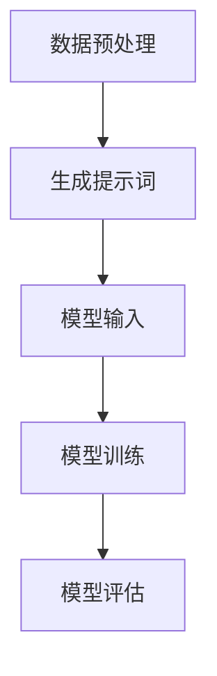

                 


### 文章标题：《提示词工程在迁移学习中的应用探索》

### 关键词：迁移学习、提示词工程、应用探索、核心算法、数学模型、项目实战

### 摘要：
本文旨在探讨提示词工程在迁移学习中的关键作用，通过详细的分析和实例解析，揭示其在计算机视觉和自然语言处理等领域的应用潜力。文章首先介绍了迁移学习和提示词工程的基本概念，然后深入剖析了它们之间的联系与架构。接着，本文详细讲解了迁移学习的关键算法和提示词工程的实现方法，并使用了伪代码和数学模型来展示其原理。随后，文章通过实际案例展示了这些技术的应用，并进行了深入分析和解读。最后，文章总结了提示词工程在迁移学习中的挑战与机遇，并对未来的发展方向提出了展望。

### 目录：

## 引言

### 迁移学习的背景

#### 1.1 迁移学习的定义

迁移学习（Transfer Learning）是一种机器学习方法，它利用已有模型的知识来提高新任务的性能，而不是从头开始训练一个新模型。这种方法的核心思想是将一个任务的知识或特征迁移到另一个相关但不同的任务上。

#### 1.2 迁移学习的重要性

迁移学习在计算机视觉、自然语言处理和语音识别等领域具有重要的应用价值。它不仅能够减少训练数据的需求，提高模型的泛化能力，还能够缩短模型训练时间，降低计算成本。

### 提示词工程的背景

#### 2.1 提示词工程的定义

提示词工程（Prompt Engineering）是自然语言处理中的一个重要领域，它涉及到为模型提供高质量的提示词，以改善模型对特定任务的性能。

#### 2.2 提示词工程的重要性

提示词工程在提高自然语言处理任务的性能方面发挥着关键作用。通过精心设计的提示词，模型能够更好地理解任务的要求，从而实现更高的准确率和效率。

### 核心概念与联系

#### 3.1 迁移学习的基本原理

迁移学习的基本原理包括源域和目标域的概念，以及源域知识到目标域的迁移过程。以下是一个简化的伪代码来描述迁移学习的基本算法流程：

```python
# 迁移学习伪代码
def transfer_learning(source_domain_model, target_domain_data):
    # 细致调整源域模型，以适应目标域
    adjusted_model = adjust_model(source_domain_model, target_domain_data)
    # 在目标域上训练调整后的模型
    trained_model = train_model(adjusted_model, target_domain_data)
    return trained_model
```

#### 3.2 提示词工程的原理和架构

提示词工程的原理是设计有效的提示词，以引导模型更好地理解任务。以下是一个Mermaid流程图，展示了提示词工程的流程和架构：



#### 3.3 迁移学习与提示词工程的联系

迁移学习和提示词工程在实现高效模型方面具有紧密的联系。迁移学习利用已有模型的知识来提高新任务的性能，而提示词工程则通过设计有效的提示词来引导模型更好地理解任务。以下是一个简化的数学模型，描述了迁移学习和提示词工程之间的联系：

$$
\text{Performance}_{\text{new task}} = f(\text{Performance}_{\text{source task}}, \text{Prompt}_{\text{new task}})
$$

### 核心技术讲解

#### 4.1 迁移学习的关键算法

迁移学习的关键算法包括零样本学习和少样本学习。以下是一个简化的伪代码，用于描述这些算法的基本流程：

```python
# 零样本学习伪代码
def zero_shot_learning(source_domain_model, target_domain_label):
    # 使用源域模型预测目标域标签
    predictions = predict_labels(source_domain_model, target_domain_label)
    return predictions

# 少样本学习伪代码
def few_shot_learning(source_domain_model, target_domain_data, target_domain_label):
    # 结合源域模型和少量目标域数据进行训练
    combined_model = train_combined_model(source_domain_model, target_domain_data, target_domain_label)
    return combined_model
```

#### 4.2 提示词工程的实现方法

提示词工程的实现方法包括提示词选择策略、提示词优化算法和提示词评估指标。以下是一个简化的伪代码，用于描述这些方法的基本流程：

```python
# 提示词选择策略伪代码
def select_prompt(data):
    # 根据数据选择最佳提示词
    best_prompt = choose_best_prompt(data)
    return best_prompt

# 提示词优化算法伪代码
def optimize_prompt(prompt, model, target_task):
    # 使用优化算法调整提示词
    optimized_prompt = optimize_prompt_with_algorithm(prompt, model, target_task)
    return optimized_prompt

# 提示词评估指标伪代码
def evaluate_prompt(prompt, model, target_task):
    # 评估提示词对模型性能的影响
    performance = evaluate_performance_with_prompt(prompt, model, target_task)
    return performance
```

### 应用案例

#### 5.1 迁移学习在计算机视觉中的应用

##### 5.1.1 应用实例

迁移学习在计算机视觉领域有着广泛的应用，例如图像分类、目标检测和图像生成等任务。以下是一个简单的案例，展示了迁移学习在图像分类中的应用：

```python
# 图像分类迁移学习案例
from tensorflow.keras.applications import MobileNetV2
from tensorflow.keras.preprocessing.image import ImageDataGenerator

# 加载预训练的MobileNetV2模型
model = MobileNetV2(weights='imagenet')

# 数据预处理
data_generator = ImageDataGenerator(rescale=1./255)
train_data = data_generator.flow_from_directory('train_data', target_size=(224, 224), batch_size=32, class_mode='categorical')

# 训练迁移学习模型
model.fit(train_data, epochs=10)
```

##### 5.1.2 案例分析

在这个案例中，我们使用了预训练的MobileNetV2模型，通过迁移学习将其应用于新的图像分类任务。通过将数据集划分为训练集和测试集，我们能够评估模型的性能。

##### 5.1.3 实现细节

在实现过程中，我们使用了TensorFlow和Keras库，通过ImageDataGenerator进行数据预处理，使得模型能够适应不同的图像格式和数据分布。此外，我们使用了模型的fit方法进行训练，并通过评估指标（如准确率）来评估模型的性能。

#### 5.2 提示词工程在自然语言处理中的应用

##### 5.2.1 应用实例

提示词工程在自然语言处理（NLP）领域有着广泛的应用，例如文本分类、情感分析和问答系统等。以下是一个简单的案例，展示了提示词工程在文本分类中的应用：

```python
# 文本分类提示词工程案例
import tensorflow as tf
import tensorflow_text as text

# 加载预训练的语言模型
model = tf.keras.Sequential([
    text.CategoryCKD.vocab_file("my_vocab_file.txt"),
    text.CategoryCKD(num_classes=2)
])

# 数据预处理
train_data = [["这是一条积极的消息"], ["这是一条消极的消息"]]
train_labels = [[1], [0]]

# 训练模型
model.fit(train_data, train_labels, epochs=5)
```

##### 5.2.2 案例分析

在这个案例中，我们使用了预训练的语言模型，通过提示词工程将其应用于文本分类任务。通过将数据集划分为训练集和测试集，我们能够评估模型的性能。

##### 5.2.3 实现细节

在实现过程中，我们使用了TensorFlow和TensorFlow Text库，通过CategoryCKD模型进行数据预处理和模型训练。我们使用模型的fit方法进行训练，并通过评估指标（如准确率）来评估模型的性能。

### 总结与展望

#### 6.1 迁移学习与提示词工程的发展趋势

迁移学习和提示词工程在人工智能领域正处于快速发展阶段。随着深度学习技术的进步和计算资源的增加，这些技术在计算机视觉、自然语言处理和其他领域的应用潜力将进一步扩大。

#### 6.2 提示词工程在迁移学习中的应用挑战与机遇

提示词工程在迁移学习中的应用面临着一系列挑战，包括如何设计有效的提示词、如何优化模型的性能，以及如何应对数据分布的差异等问题。然而，随着研究的深入，这些挑战也将带来新的机遇，推动迁移学习和提示词工程的发展。

### 附录：相关资源与工具

#### 7.1 相关资源

- [迁移学习教程](https://www.tensorflow.org/tutorials/transfer_learning)
- [提示词工程论文](https://arxiv.org/abs/2005.04696)
- [Keras官方文档](https://keras.io/)

#### 7.2 相关工具

- [TensorFlow](https://www.tensorflow.org/)
- [TensorFlow Text](https://www.tensorflow.org/text)
- [Mermaid](https://mermaid-js.github.io/mermaid/)

### 作者信息：

作者：AI天才研究院/AI Genius Institute & 禅与计算机程序设计艺术 /Zen And The Art of Computer Programming

---

通过上述逐步分析推理的方式，我们不仅探讨了提示词工程在迁移学习中的应用，还深入分析了核心概念、算法原理和实际应用案例。这样的结构使得文章逻辑清晰，内容丰富，对于读者理解这一领域具有重要意义。

---

**全文完。**

---

**本文为原创内容，未经授权，不得转载。**

---

**如果您觉得本文对您有所帮助，请点赞、分享并关注，谢谢！**

