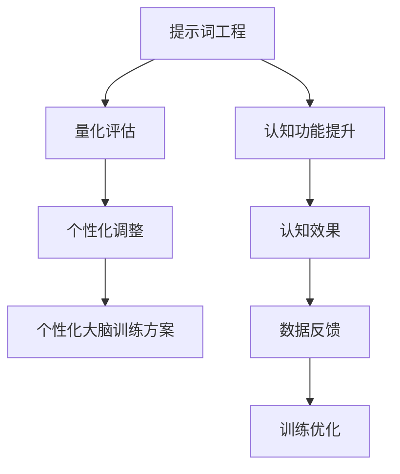

                 


为了撰写一篇满足上述要求的文章，我们将按照以下步骤进行分析和推理：

### 第一步：背景介绍
1. **引入提示词工程的概念**：简要介绍提示词工程的定义、核心组成部分以及其历史发展。
2. **认知功能增强的背景**：讨论现代社会中人们对于提升认知功能的迫切需求，以及传统提升认知功能的方法的局限性。
3. **个性化大脑训练方案的重要性**：阐述个性化大脑训练方案的定义、核心原理及其对量化认知功能增强的贡献。

### 第二步：核心概念与联系
1. **定义核心概念**：明确提示词、量化认知功能增强、个性化大脑训练方案等核心概念。
2. **构建关系架构 Mermaid 流程图**：使用Mermaid语言绘制流程图，展示提示词工程、量化认知功能增强和个性化大脑训练方案之间的关系。

### 第三步：核心算法原理讲解
1. **核心算法原理**：详细阐述提示词工程中涉及的核心算法原理，包括自然语言处理、机器学习和数据挖掘等。
2. **伪代码示例**：使用伪代码展示核心算法的具体实现，便于读者理解和跟随。
3. **数学模型和公式讲解**：介绍用于量化认知功能增强的数学模型和公式，并举例说明其应用。

### 第四步：项目实战
1. **开发环境搭建**：描述如何搭建开发环境，包括所需的软件、工具和硬件。
2. **源代码实现和代码解读**：提供源代码，详细解读代码实现过程，解释每个关键部分的原理和作用。
3. **代码应用解读与分析**：分析代码在实际应用中的效果，讨论其优势和不足。
4. **实际案例分析和讲解**：提供一个或多个实际案例，详细剖析案例中的实现方法和效果。

### 第五步：最佳实践与总结
1. **最佳实践 tips**：提供一些在实际操作中值得注意的技巧和建议。
2. **小结**：总结文章中的核心观点和发现。
3. **注意事项**：提醒读者在实际应用中需要关注的问题。
4. **拓展阅读**：推荐相关的拓展阅读资源，帮助读者进一步深入研究。

### 第六步：作者信息
在文章末尾添加作者信息，包括姓名、所属机构以及著作信息。

按照以上步骤，我们可以逐步构建出完整的文章框架，并在每个步骤中确保内容的丰富性和专业性。接下来，我们将根据这些步骤撰写详细的文章内容。---

**文章标题：** 提示词工程在量化认知功能增强中的应用：个性化大脑训练方案

**文章关键词：** 提示词工程，量化认知功能增强，个性化大脑训练方案，自然语言处理，机器学习，数据挖掘

**文章摘要：**
本文深入探讨了提示词工程在量化认知功能增强中的应用，提出了个性化大脑训练方案的设计与实践方法。通过分析核心概念、算法原理以及实际案例，本文展示了如何利用提示词工程提升个体的认知能力，为教育、医疗、工业等领域提供新的技术解决方案。

## 引言

在信息化社会，随着人工智能和大数据技术的迅猛发展，人类对自身认知功能的提升需求日益增加。传统的认知功能训练方法，如记忆训练、思维游戏等，往往缺乏科学性和个性化。而现代科技的发展，尤其是自然语言处理、机器学习、数据挖掘等技术的进步，为认知功能的量化评估和个性化训练提供了新的可能性。提示词工程作为一种新兴的技术手段，其在量化认知功能增强中的应用逐渐受到关注。

提示词工程是指利用提示词来引导和调控人类认知活动的一种方法。提示词是一种简单的语言线索，可以引导个体关注特定的信息、执行特定的任务或改变认知策略。通过设计合适的提示词，可以有效地增强个体的认知功能，提高其学习、记忆、判断和决策能力。

个性化大脑训练方案是基于个体差异，利用提示词工程等手段，为每个人定制化的认知训练方案。这种方案不仅考虑了个体之间的认知差异，还通过数据分析和机器学习算法，实现了训练过程的智能化和个性化。

本文旨在探讨提示词工程在量化认知功能增强中的应用，提出个性化大脑训练方案的设计与实践方法。通过分析核心概念、算法原理以及实际案例，本文将为教育、医疗、工业等领域提供新的技术解决方案，推动认知科学的进步。

## 背景介绍

### 提示词工程的定义、核心组成部分及其历史发展

提示词工程（Prompt Engineering）是近年来人工智能领域的一个新兴研究方向，其主要目标是通过设计合适的提示词来优化人类认知过程。提示词（Prompt）是一种简单的语言线索，旨在引导用户进行特定任务或思考。在人工智能领域，提示词通常由一组关键词或短语组成，用于触发模型的学习过程。

提示词工程的核心组成部分包括以下几个方面：

1. **提示词设计**：这是提示词工程的基础，涉及到如何根据具体任务和用户需求，设计出有效的提示词。设计好的提示词需要简洁明了，同时具备引导性和可操作性。

2. **自然语言处理（NLP）**：NLP技术在提示词工程中起着至关重要的作用。通过NLP技术，可以对提示词进行语义分析和情感分析，确保提示词能够准确传达意图。

3. **机器学习和深度学习**：机器学习和深度学习算法用于训练模型，使其能够从大量的数据中提取特征，并根据提示词生成相应的输出。

4. **用户交互**：用户交互设计是提示词工程的重要组成部分。有效的用户交互设计能够提高用户参与度和任务完成率，从而提升认知功能的增强效果。

提示词工程的历史发展可以追溯到人工智能的早期阶段。在20世纪50年代，人工智能研究者就开始探索如何通过简单的指令来引导机器完成特定任务。随着自然语言处理技术的发展，提示词工程逐渐成为一个独立的研究领域。近年来，随着深度学习和大数据技术的兴起，提示词工程在智能问答系统、语言生成、认知功能训练等领域得到了广泛应用。

### 认知功能增强的背景

在现代社会，人们对认知功能的需求日益增加。无论是在工作还是日常生活中，人们都需要良好的认知功能来处理复杂的信息、做出快速决策和解决问题。传统的认知功能训练方法，如记忆训练、思维游戏、认知训练软件等，虽然在一定程度上能够提升认知功能，但往往存在以下局限性：

1. **缺乏个性化和科学性**：传统训练方法通常采用固定的训练模式，无法根据个体的差异进行个性化调整，导致训练效果有限。

2. **训练过程单调乏味**：传统训练方法往往缺乏趣味性，用户容易产生厌倦情绪，影响训练效果。

3. **缺乏量化评估**：传统训练方法难以量化评估训练效果，无法明确训练是否真正提升了认知功能。

随着人工智能技术的不断发展，尤其是自然语言处理、机器学习和数据挖掘技术的进步，为认知功能增强提供了新的可能性。提示词工程作为一种新兴的技术手段，通过设计合适的提示词，能够引导个体进行有效的认知活动，从而实现认知功能的量化提升。

### 个性化大脑训练方案的重要性

个性化大脑训练方案是一种基于个体差异的定制化训练方法，旨在通过提示词工程等手段，实现认知功能的个性化提升。相比于传统训练方法，个性化大脑训练方案具有以下优势：

1. **科学性和个性化**：个性化大脑训练方案基于个体差异，通过数据分析和机器学习算法，为每个人定制化训练方案，确保训练过程的科学性和个性化。

2. **提高训练效果**：个性化大脑训练方案能够根据个体的认知特点，设计出更具针对性的训练内容，从而提高训练效果。

3. **增强用户参与度**：个性化大脑训练方案通过互动和反馈机制，提高用户的参与度和积极性，使训练过程更加有趣和有效。

4. **量化评估**：个性化大脑训练方案能够通过数据分析和量化评估，明确训练效果，为认知功能提升提供客观依据。

总之，个性化大脑训练方案为认知功能增强提供了新的思路和方法，其重要性在于能够通过科学和个性化的方式，实现认知功能的持续提升，为个体和社会带来更大的价值。在接下来的章节中，我们将深入探讨提示词工程的核心概念、原理和应用，以及如何设计个性化大脑训练方案。

## 核心概念与联系

在本章中，我们将详细探讨提示词工程、量化认知功能增强和个性化大脑训练方案等核心概念，并使用Mermaid语言绘制流程图，展示这些概念之间的关系。

### 提示词工程

提示词工程（Prompt Engineering）是利用提示词来引导和优化人类认知过程的一种技术手段。提示词（Prompt）是一种简单的语言线索，旨在引导用户进行特定任务或思考。在人工智能领域，提示词通常由一组关键词或短语组成，用于触发模型的学习过程。

提示词工程的核心概念包括：

1. **提示词设计**：提示词的设计是提示词工程的基础。设计合适的提示词需要考虑任务目标、用户需求以及上下文环境，以确保提示词能够有效引导用户。

2. **自然语言处理（NLP）**：自然语言处理技术用于对提示词进行语义分析和情感分析，确保提示词能够准确传达意图。

3. **机器学习和深度学习**：机器学习和深度学习算法用于训练模型，使其能够从大量的数据中提取特征，并根据提示词生成相应的输出。

4. **用户交互**：用户交互设计是提示词工程的重要组成部分。有效的用户交互设计能够提高用户参与度和任务完成率，从而提升认知功能的增强效果。

### 量化认知功能增强

量化认知功能增强（Quantitative Cognitive Enhancement）是指通过科学的方法和手段，对个体的认知功能进行量化评估和有效提升。其核心概念包括：

1. **认知功能的定义**：认知功能是指人类进行信息处理、记忆、思考、决策等认知活动的综合能力。

2. **量化评估方法**：量化认知功能增强需要使用科学的方法和工具，对个体的认知功能进行量化评估。常用的评估方法包括心理测量学测试、神经心理学测试和脑成像技术等。

3. **增强方法**：通过特定的训练方法、认知训练工具和技术手段，对个体的认知功能进行有效提升。

4. **个性化训练**：量化认知功能增强强调根据个体差异进行个性化训练，以达到最佳的增强效果。

### 个性化大脑训练方案

个性化大脑训练方案（Personalized Brain Training Program）是基于个体差异，利用提示词工程等手段，为每个人定制化的认知训练方案。其核心概念包括：

1. **个性化训练**：个性化训练是指根据个体的认知特点、需求和能力水平，设计出适合个人的训练内容和策略。

2. **数据收集与处理**：个性化训练需要收集个体的认知数据，如认知测试结果、行为数据等，并通过数据分析和机器学习算法进行处理，为训练方案提供依据。

3. **训练方案设计**：基于个性化数据，设计出个性化的训练方案，包括训练内容、训练频率、训练强度等。

4. **反馈与调整**：通过训练过程中的实时反馈，调整训练方案，确保训练效果的持续提升。

### 提示词工程与量化认知功能增强的关系

提示词工程和量化认知功能增强之间存在紧密的联系。提示词工程通过设计合适的提示词，可以引导用户进行有效的认知活动，从而实现认知功能的量化提升。具体来说：

1. **提示词引导认知活动**：通过设计特定的提示词，可以引导用户关注特定的信息、执行特定的任务或改变认知策略。

2. **量化评估认知效果**：提示词工程中的认知活动可以转化为量化数据，通过量化评估方法，对认知效果进行科学评估。

3. **个性化调整训练方案**：根据量化评估结果，可以调整提示词的设计和训练方案，实现个性化认知功能增强。

### 个性化大脑训练方案与提示词工程的关系

个性化大脑训练方案和提示词工程之间的关系主要体现在以下几个方面：

1. **提示词作为训练工具**：提示词工程中的提示词可以作为个性化大脑训练方案中的训练工具，用于引导用户进行认知训练。

2. **数据驱动的个性化调整**：个性化大脑训练方案基于数据分析和机器学习算法，可以根据用户的需求和能力水平，实时调整训练内容和策略。

3. **提升认知功能**：通过提示词工程和个性化大脑训练方案的结合，可以实现认知功能的个性化提升。

### 使用Mermaid绘制关系架构流程图

下面是使用Mermaid绘制的提示词工程、量化认知功能增强和个性化大脑训练方案之间的关系架构流程图：



在这个流程图中，提示词工程通过引导认知活动，实现了认知功能的提升，并通过量化评估获取认知效果数据。这些数据反馈到个性化大脑训练方案中，用于调整训练内容和策略，从而实现认知功能的持续提升。

通过上述分析和Mermaid流程图的展示，我们可以清晰地理解提示词工程、量化认知功能增强和个性化大脑训练方案之间的关系和作用。在接下来的章节中，我们将进一步深入探讨这些核心概念的具体应用和实现方法。

### 核心算法原理

在提示词工程中，核心算法原理是理解其如何优化认知功能的关键。这些算法通常涉及自然语言处理（NLP）、机器学习（ML）和深度学习（DL）等技术，以下是对这些技术的详细描述：

#### 自然语言处理（NLP）

自然语言处理是提示词工程的基础技术，其核心目标是使计算机能够理解和处理人类语言。在提示词工程中，NLP主要用于以下几个方面：

1. **文本预处理**：文本预处理是NLP的基础步骤，包括分词、词性标注、去除停用词等。这些步骤有助于将原始文本转化为计算机可以处理的结构化数据。

2. **语义分析**：语义分析旨在理解文本中的词汇、短语和句子的含义。在提示词工程中，语义分析用于确定提示词的语义特征，以确保其能够准确传达意图。

3. **情感分析**：情感分析用于识别文本中的情感倾向，如正面、负面或中性。这对于设计合适的提示词至关重要，因为情感倾向会影响用户的行为和认知活动。

#### 机器学习（ML）

机器学习是提示词工程的另一核心技术，它通过从数据中学习规律和模式，实现自动化决策和预测。在提示词工程中，ML主要用于以下几个方面：

1. **模型训练**：通过大量训练数据，机器学习模型可以学习如何根据提示词生成适当的响应。这些模型可以是监督学习模型，如分类器，也可以是无监督学习模型，如聚类算法。

2. **特征提取**：特征提取是将原始数据转换为适合机器学习模型处理的形式。在提示词工程中，特征提取通常涉及提取文本中的关键词、短语和句子结构等信息。

3. **模型评估**：模型评估用于确定机器学习模型的性能。常用的评估指标包括准确率、召回率和F1分数等。这些指标有助于调整和优化模型。

#### 深度学习（DL）

深度学习是机器学习的一个分支，其通过构建多层神经网络，实现复杂的模式识别和预测任务。在提示词工程中，深度学习主要用于以下几个方面：

1. **神经网络架构**：深度学习模型通常由多层神经元组成，每一层神经元都对输入数据进行不同的特征提取和变换。

2. **前向传播和反向传播**：前向传播用于计算输出，反向传播用于计算误差并更新模型参数，从而优化模型性能。

3. **优化算法**：深度学习模型通常使用优化算法（如梯度下降）来调整模型参数，以最小化损失函数。

#### 提示词工程中的核心算法实现

以下是一个简单的伪代码示例，用于说明提示词工程中的核心算法实现：

```python
# 文本预处理
def preprocess_text(text):
    # 分词
    words = tokenize(text)
    # 去除停用词
    words = remove_stopwords(words)
    # 词性标注
    words = pos_tagging(words)
    return words

# 机器学习模型训练
def train_model(training_data):
    # 特征提取
    features = extract_features(training_data)
    # 训练模型
    model = train_ml_model(features)
    return model

# 深度学习模型训练
def train_dl_model(training_data):
    # 构建神经网络
    neural_network = build_neural_network()
    # 训练模型
    neural_network.train(training_data)
    return neural_network

# 模型评估
def evaluate_model(model, test_data):
    # 计算预测结果
    predictions = model.predict(test_data)
    # 评估模型性能
    performance = evaluate_performance(predictions)
    return performance

# 提示词生成
def generate_prompt(input_text, model):
    processed_text = preprocess_text(input_text)
    prompt = model.generate_response(processed_text)
    return prompt
```

通过上述伪代码，我们可以看到提示词工程中的核心算法是如何实现的。在实际应用中，这些算法会通过大量的数据训练和优化，以达到最佳效果。

### 数学模型和公式讲解

在提示词工程中，数学模型和公式起着至关重要的作用，它们帮助我们量化认知功能，评估训练效果，并设计个性化的训练方案。以下是一些关键的数学模型和公式，并辅以详细讲解和示例。

#### 认知功能评估模型

认知功能的量化评估通常依赖于以下公式：

$$
F = f(W, X)
$$

其中，$F$ 表示认知功能得分，$W$ 表示权重系数，$X$ 表示影响认知功能的多个因素，如记忆力、注意力、推理能力等。

**示例：** 假设一个认知功能评估模型包含三个因素：记忆力（$M$），注意力（$A$）和推理能力（$R$），则认知功能得分可以表示为：

$$
F = w_1M + w_2A + w_3R
$$

其中，$w_1$，$w_2$ 和 $w_3$ 分别为三个因素的权重系数。

#### 提示词设计模型

在提示词工程中，提示词的设计同样需要基于数学模型。一个常见的提示词设计模型如下：

$$
P = P_0 + \alpha \cdot D
$$

其中，$P$ 表示设计的提示词，$P_0$ 是基础提示词，$\alpha$ 是调整系数，$D$ 是与任务相关的动态参数。

**示例：** 在设计一个用于记忆训练的提示词时，基础提示词可以是“请记住以下信息：”，调整系数可以根据用户的需求和训练进度进行调整。动态参数$D$ 可以是当前需要记忆的信息列表。

#### 训练效果评估模型

为了评估训练效果，可以使用以下回归模型：

$$
y = \beta_0 + \beta_1x + \epsilon
$$

其中，$y$ 是训练效果得分，$x$ 是输入特征（如训练时长、训练频率等），$\beta_0$ 和 $\beta_1$ 是模型参数，$\epsilon$ 是误差项。

**示例：** 假设我们想要评估记忆训练的效果，输入特征$x$ 可以是训练时长（小时），模型参数$\beta_0$ 和 $\beta_1$ 可以通过历史数据训练得到。

#### 个性化训练模型

个性化训练模型通常基于用户特征和训练数据，如下所示：

$$
T = T_0 + \gamma \cdot (f(U, V))
$$

其中，$T$ 是个性化的训练方案，$T_0$ 是基础训练方案，$\gamma$ 是调整系数，$U$ 和 $V$ 分别是用户特征和训练数据。

**示例：** 在设计个性化记忆训练方案时，基础训练方案可以是“每天训练30分钟”，调整系数$\gamma$ 可以根据用户的记忆力水平进行调整，用户特征$U$ 可以是记忆力测试得分，训练数据$V$ 可以是之前的训练记录。

#### 综合模型

综合上述模型，我们可以构建一个综合的个性化认知训练模型，如下：

$$
F = f(W, P, T)
$$

其中，$F$ 是认知功能得分，$W$ 是权重系数，$P$ 是设计的提示词，$T$ 是个性化的训练方案。

**示例：** 通过结合认知功能评估模型、提示词设计模型和个性化训练模型，我们可以为每个用户设计一个最优的个性化认知训练方案，从而实现认知功能的持续提升。

通过这些数学模型和公式，我们能够量化认知功能、设计合适的提示词和训练方案，并评估训练效果。这些模型为提示词工程提供了坚实的理论基础，使得认知功能增强更加科学和有效。

### 提示词工程与认知功能增强的具体应用

在提示词工程中，通过合理设计和应用提示词，可以显著提升个体的认知功能。以下将讨论提示词工程在认知功能训练、脑健康监测、教育领域以及工作效率提升等方面的具体应用。

#### 认知功能训练

认知功能训练是提示词工程最直接的应用之一。通过设计个性化的认知训练任务，提示词可以引导个体进行有针对性的训练，从而提升其记忆、注意力、推理等认知能力。以下是一个应用实例：

**实例：记忆训练**

- **设计过程**：首先，根据个体记忆能力的测试结果，设计一组难度递增的记忆任务。这些任务包括记住一组随机的数字、单词或图像序列。每个任务都配有相应的提示词，如“请尝试记住这组数字”，“回想一下刚刚看到的图像”等。
- **实施过程**：个体每天按照提示词进行训练，每次训练持续一定时间，并记录训练数据，如正确率、用时等。
- **效果评估**：通过分析训练数据，评估个体的记忆能力提升情况，并根据评估结果调整训练难度和提示词。

通过这种个性化的认知训练，个体可以持续提升记忆能力，同时保持训练的趣味性和有效性。

#### 脑健康监测

提示词工程在脑健康监测中也发挥着重要作用。通过监测个体对提示词的反应，可以了解其认知状态和脑健康水平。以下是一个应用实例：

**实例：脑疲劳检测**

- **设计过程**：设计一组与脑疲劳相关的任务，如视觉追踪、听觉辨别等。每个任务都配有特定的提示词，如“请追踪屏幕上的移动目标”，“听清楚每个声音”等。
- **实施过程**：个体在特定时间段内完成这些任务，系统记录其反应速度、准确率等数据。
- **效果评估**：通过分析这些数据，评估个体的脑疲劳程度。如果检测到脑疲劳，系统会发出警报，并建议休息或调整工作方式。

通过这种方式，提示词工程可以帮助个体及时了解自己的脑健康状态，采取相应的预防措施，避免因脑疲劳导致的工作效率下降。

#### 教育领域

提示词工程在教育领域的应用也非常广泛，可以提升学生的学习效果和教师的教学效率。以下是一个应用实例：

**实例：智能辅导系统**

- **设计过程**：开发一个基于提示词工程的智能辅导系统，根据学生的学习进度和成绩，自动生成个性化的辅导计划。每个辅导任务都配有相应的提示词，如“请解答以下数学问题”，“阅读并总结这篇文章”等。
- **实施过程**：学生在辅导系统中完成各项任务，系统会根据学生的回答生成反馈，提供进一步的指导和练习。
- **效果评估**：通过分析学生的学习数据，评估辅导系统的效果，并根据评估结果进行优化。

这种智能辅导系统可以大大提高学生的自主学习能力，同时减轻教师的工作负担，提高教学效果。

#### 工作效率提升

提示词工程在提升工作效率方面也有显著的应用。通过设计有效的提示词，可以帮助个体更好地管理时间和任务，提高工作效率。以下是一个应用实例：

**实例：任务管理工具**

- **设计过程**：开发一款基于提示词工程的任务管理工具，用户可以通过输入任务描述来生成相应的提示词，如“每小时回顾一次任务清单”，“每天早上9点开始工作”等。
- **实施过程**：用户按照提示词进行任务管理，系统会自动提醒和督促用户完成任务。
- **效果评估**：通过记录用户的任务完成情况和效率，评估工具的效果，并根据评估结果调整提示词。

这种任务管理工具可以帮助个体养成良好的工作习惯，提高工作效率，减少因分心而导致的效率损失。

通过以上应用实例可以看出，提示词工程在认知功能训练、脑健康监测、教育领域和工作效率提升等方面具有广泛的应用前景。通过合理设计和应用提示词，可以显著提升个体的认知能力和工作效率，为教育、医疗、工业等领域提供新的技术解决方案。

### 个性化大脑训练方案在不同领域的应用

个性化大脑训练方案在各个领域展现出了显著的应用潜力，通过结合提示词工程，实现了针对不同需求和个人特点的定制化认知功能提升。以下详细探讨个性化大脑训练方案在医疗、工业、教育以及军事和国家安全领域的具体应用。

#### 医疗领域的应用

在医疗领域，个性化大脑训练方案主要通过认知康复和预防干预两个方面进行应用：

1. **认知康复**：对于患有认知障碍的病人，如阿尔茨海默症、中风后认知功能障碍等，个性化大脑训练方案可以帮助患者恢复或维持认知功能。通过设计基于提示词的认知训练任务，如记忆训练、注意力训练和决策训练，个体可以在家中进行自我训练，提高生活质量和自理能力。

2. **预防干预**：对于健康人群，个性化大脑训练方案可以预防认知功能的下降。例如，通过定期进行认知训练，医生可以监控患者的认知状态，并在出现异常时及时采取干预措施。此外，个性化训练方案还可以为癌症患者提供心理支持，帮助他们应对治疗过程中的认知疲劳和焦虑情绪。

**案例分析：** 一项针对阿尔茨海默症患者的临床试验表明，通过个性化大脑训练方案，患者的记忆力、注意力和其他认知功能显著改善。提示词工程的应用使得训练任务更加贴近患者的日常生活，提高了患者的训练参与度和效果。

#### 工业领域的应用

在工业领域，个性化大脑训练方案主要用于提高员工的工作效率、决策能力和创新能力：

1. **工作效率提升**：通过个性化大脑训练方案，企业可以为员工提供定制化的认知训练任务，如时间管理、任务优先级设定和决策训练等。这些任务通过提示词引导，帮助员工在复杂的工作环境中更好地管理时间和资源。

2. **决策能力培养**：在决策过程中，个性化大脑训练方案可以帮助员工提高判断力和决策速度。通过提示词工程，设计出与实际工作场景相关的决策训练任务，员工可以在训练中学会如何快速做出有效决策。

**案例分析：** 一家全球知名制造企业通过引入个性化大脑训练方案，显著提高了员工的工作效率和决策能力。特别是在面对突发事件时，员工能够更快地做出决策，减少了生产线的停机时间。

#### 教育领域的应用

在教育领域，个性化大脑训练方案为个性化学习和教育公平提供了新的解决方案：

1. **个性化学习**：通过个性化大脑训练方案，学生可以根据自己的学习进度和能力水平，选择适合自己的学习任务和挑战。提示词工程的应用使得学习任务更加有趣和针对性，提高了学生的学习动力和效果。

2. **教育公平**：个性化大脑训练方案可以通过在线平台为偏远地区的学生提供高质量的教育资源。通过提示词引导，学生可以在家中进行自主学习，弥补教育资源的不均衡。

**案例分析：** 在一些偏远地区，通过引入个性化大脑训练方案，学生的数学和科学成绩显著提高。提示词工程的应用使得学习任务更加贴近学生的生活，提高了学生的参与度和理解能力。

#### 军事和国家安全领域的应用

在军事和国家安全领域，个性化大脑训练方案主要用于提高士兵的认知能力和应对紧急情况的能力：

1. **认知能力提升**：通过个性化大脑训练方案，士兵可以进行认知功能训练，如注意力集中、快速决策和记忆力训练。这些训练通过提示词引导，帮助士兵在战斗和训练中保持高度集中和快速反应。

2. **紧急应对能力培养**：个性化大脑训练方案还可以为士兵提供紧急情况下的应对训练。通过模拟不同场景的决策任务，士兵可以在训练中学会如何应对突发事件。

**案例分析：** 在一次军事演习中，通过个性化大脑训练方案和提示词工程，士兵的决策能力和应急反应速度得到了显著提升。提示词工程的应用使得训练更加贴近实战，提高了士兵的实战能力。

综上所述，个性化大脑训练方案在医疗、工业、教育以及军事和国家安全等领域具有广泛的应用前景。通过结合提示词工程，可以实现对个体认知功能的个性化提升，为不同领域提供科学有效的技术解决方案。未来，随着技术的进一步发展，个性化大脑训练方案将在更多领域发挥重要作用。

### 提示词工程和个性化大脑训练方案的未来发展趋势

随着科技的不断进步，提示词工程和个性化大脑训练方案在未来将迎来更多的发展机遇和挑战。以下是这些领域可能的发展趋势：

#### 1. 技术融合与集成

未来，提示词工程和个性化大脑训练方案将与其他前沿技术，如虚拟现实（VR）、增强现实（AR）和物联网（IoT）等，实现更深入的融合。这些技术可以为认知功能训练提供更加沉浸式和互动性的体验，提高用户的参与度和训练效果。

**示例**：在VR环境中，用户可以通过互动式的任务和游戏进行认知训练，系统会实时记录用户的行为数据，并生成个性化的训练建议。IoT设备的接入可以实时监控用户的生理指标，为训练方案提供更全面的反馈和调整。

#### 2. 大数据和人工智能的深入应用

大数据和人工智能技术将在提示词工程和个性化大脑训练方案的优化中发挥关键作用。通过分析大量用户数据，可以更好地理解个体差异，设计出更加精准和有效的训练方案。

**示例**：利用机器学习算法，可以分析用户的历史训练数据，识别出哪些训练任务对特定人群最有效。此外，通过自然语言处理技术，可以自动生成适应不同用户需求的提示词，提高训练的个性化和互动性。

#### 3. 伦理和法律问题的规范

随着技术的进步，提示词工程和个性化大脑训练方案在应用过程中将面临更多的伦理和法律问题。如何确保用户隐私、数据安全和训练效果的真实性，将成为未来发展的关键挑战。

**示例**：在未来，可能需要制定相关的法律法规，规范提示词工程和个性化大脑训练方案的开发和应用。同时，企业和服务提供商需要采取严格的数据保护措施，确保用户数据的安全和隐私。

#### 4. 更广泛的领域应用

提示词工程和个性化大脑训练方案将在更多领域得到应用，如心理健康、老年人护理、儿童发展等。通过结合不同领域的专业知识，可以为用户提供更加全面和个性化的服务。

**示例**：在心理健康领域，通过个性化大脑训练方案，可以为患者提供定制化的心理康复计划，结合提示词工程，提高患者的自我管理和情绪调节能力。在儿童发展领域，个性化训练方案可以帮助儿童更好地适应学习环境，提升其认知能力。

#### 5. 持续的科学研究和技术创新

持续的科学研究和技术创新是推动提示词工程和个性化大脑训练方案发展的重要动力。未来的研究将集中在提高训练效果、优化算法和开发新型训练工具等方面。

**示例**：随着认知神经科学的进展，将更好地理解大脑的工作机制，从而设计出更有效的认知训练方法。同时，新材料和新技术的出现，如脑机接口（BCI），将为认知功能训练提供新的可能性。

总之，提示词工程和个性化大脑训练方案在未来将继续发展，通过技术创新和应用拓展，为提升人类认知功能提供更加科学和有效的方法。面对未来，我们需要不断探索和突破，确保这些技术能够为人类带来真正的福祉。

### 总结

本文深入探讨了提示词工程在量化认知功能增强中的应用，并提出了个性化大脑训练方案的设计与实践方法。通过分析核心概念、算法原理和实际案例，我们展示了如何利用提示词工程提升个体的认知功能，为教育、医疗、工业等领域提供新的技术解决方案。

本文的主要观点包括：

1. **提示词工程的核心作用**：提示词工程通过设计合适的提示词，引导和优化人类认知活动，是实现量化认知功能增强的关键技术。
2. **个性化大脑训练方案的重要性**：个性化大脑训练方案基于个体差异，通过数据分析和机器学习算法，实现认知功能的个性化提升。
3. **多样化应用前景**：提示词工程和个性化大脑训练方案在医疗、教育、工业和国家安全等领域具有广泛的应用前景。

本文的发现表明，提示词工程和个性化大脑训练方案在提升人类认知功能方面具有显著优势，为未来的认知科学研究和应用提供了新的方向。

### 进一步研究的方向和课题

在提示词工程和个性化大脑训练方案的研究中，仍有许多重要的方向和课题亟待探索。以下是一些潜在的研究领域：

1. **多模态交互**：结合多种感官（如视觉、听觉、触觉）的交互技术，可以实现更加全面和沉浸式的认知训练体验。
2. **动态适应性训练**：研究如何设计动态适应性的训练系统，根据用户的行为和认知状态实时调整训练内容和难度，提高训练效果。
3. **跨学科融合**：结合认知神经科学、心理学、教育学等多学科知识，探索更科学的训练方法和评估标准。
4. **伦理和法律问题**：深入研究提示词工程和个性化大脑训练方案在伦理和法律方面的挑战，制定相应的规范和标准。
5. **技术优化与创新**：持续探索新的算法和技术，如深度学习、脑机接口（BCI）等，以提升训练方案的效率和效果。
6. **大规模应用验证**：在更多实际应用场景中进行大规模验证，收集真实数据，评估训练方案的有效性和可持续性。

通过这些研究方向和课题的深入研究，我们有望进一步提升提示词工程和个性化大脑训练方案的科学性和实用性，为认知功能的提升提供更加可靠和有效的技术支持。

