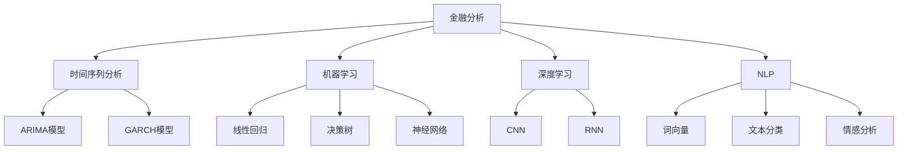
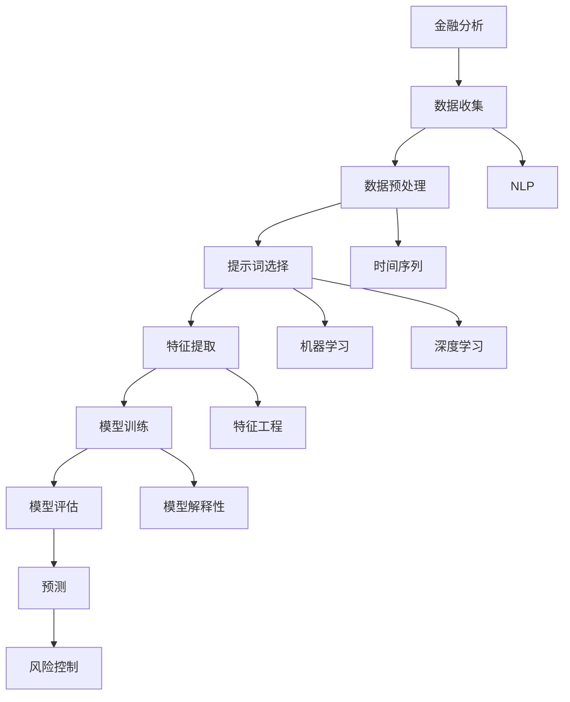

                 


# 《提示词工程在金融分析中的应用》

关键词：金融分析、提示词工程、金融市场预测、金融风险分析、文本数据分析

摘要：本文旨在探讨提示词工程在金融分析中的应用。首先，我们将介绍金融分析的基本概念和挑战，然后深入探讨提示词工程的定义、基本原理以及其在金融分析中的具体应用。我们将通过数学模型、核心算法原理和项目实战，详细分析提示词工程在金融市场预测、金融风险分析和文本数据分析等领域的应用，并总结最佳实践和注意事项。

## 第一部分：金融分析中的提示词工程基础

### 第1章：金融分析概述

#### 1.1 金融分析的目标与挑战

金融分析是指利用历史和当前的数据，通过统计学、经济学和计算机科学的方法来预测和评估金融市场行为的过程。其目标包括但不限于：

1. **预测金融市场走势**：通过分析市场数据，预测股票、债券、期货等金融产品的价格变化，以便进行投资决策。
2. **风险评估**：评估金融产品的风险，以便投资者和管理者能够做出更明智的决策。
3. **资产定价**：确定金融产品的公允价格，为市场提供参考。

然而，金融分析面临诸多挑战：

1. **数据复杂性**：金融市场数据复杂，包含了大量的噪声和不稳定性。
2. **非线性和随机性**：金融市场具有高度的非线性和随机性，这使得预测变得困难。
3. **时间序列特性**：金融时间序列数据具有时间依赖性和自相关性，需要特别的模型和方法来处理。

#### 1.2 提示词工程在金融分析中的作用

提示词工程是一种利用语义信息来改善数据分析的方法。在金融分析中，提示词工程的作用主要体现在以下几个方面：

1. **文本数据分析**：金融文本数据（如新闻、报告、社交媒体帖子等）包含了丰富的市场信息，通过提示词工程，可以提取出关键信息，用于预测市场走势。
2. **特征工程**：提示词工程可以帮助识别和提取与金融分析相关的特征，提高模型的效果。
3. **模型解释性**：通过分析提示词，可以理解模型决策背后的原因，提高模型的透明度和可信度。

#### 1.3 金融数据分析的基本概念

在金融数据分析中，我们通常涉及以下基本概念：

1. **时间序列分析**：研究时间序列数据的统计方法，如ARIMA模型、GARCH模型等。
2. **机器学习**：利用算法自动从数据中学习，如线性回归、决策树、神经网络等。
3. **深度学习**：一种特殊的机器学习方法，通过多层神经网络来提取特征，如卷积神经网络（CNN）和循环神经网络（RNN）。
4. **自然语言处理**（NLP）：处理文本数据，如词向量、文本分类、情感分析等。

### Mermaid 流程图



### 核心概念与联系

提示词工程在金融分析中的应用，涉及多个核心概念的相互作用。以下是这些概念的架构 Mermaid 流程图：



### 核心算法原理讲解

在金融分析中，提示词工程的算法原理主要涉及以下几个方面：

1. **文本表示方法**：将文本数据转化为数值形式，常用的方法有词袋模型、TF-IDF、Word2Vec等。
2. **提示词生成算法**：从文本数据中提取关键信息，常用的方法有TF-IDF、基于机器学习的主题模型等。
3. **提示词优化算法**：通过优化算法改进提示词的选择和提取，提高模型的预测效果，常用的方法有基于机器学习的优化算法、基于深度学习的优化算法等。

以下是提示词生成算法的伪代码：

```python
def generateKeywords(text, method='TF-IDF', topN=10):
    """
    提取文本中的关键词
    :param text: 文本数据
    :param method: 提取方法，默认为TF-IDF
    :param topN: 选取的前N个关键词
    :return: 关键词列表
    """
    if method == 'TF-IDF':
        # 使用TF-IDF方法提取关键词
        keywords = extractTFIDFKeywords(text, topN)
    elif method == 'TopicModel':
        # 使用主题模型提取关键词
        keywords = extractTopicModelKeywords(text, topN)
    else:
        raise ValueError("未知的关键词提取方法")
    
    return keywords
```

### 数学模型与公式讲解

在提示词工程中，常用的数学模型和公式包括概率论、信息论和统计模型等。以下是几个常用的数学公式和解释：

1. **概率密度函数**（PDF）：描述随机变量在某一取值处的概率密度。
   $$ f(x) = \frac{1}{\sqrt{2\pi\sigma^2}} e^{-\frac{(x-\mu)^2}{2\sigma^2}} $$
   其中，$\mu$ 是均值，$\sigma^2$ 是方差。

2. **最大似然估计**（MLE）：用于估计模型参数的一种方法，通过最大化观测数据的似然函数来求得参数的估计值。
   $$ \hat{\theta} = \arg\max_{\theta} P(X|\theta) $$
   其中，$X$ 是观测数据，$P(X|\theta)$ 是似然函数。

3. **贝叶斯定理**：描述后验概率与前验概率之间的关系。
   $$ P(A|B) = \frac{P(B|A)P(A)}{P(B)} $$
   其中，$A$ 和 $B$ 是事件，$P(A|B)$ 是在 $B$ 发生的条件下 $A$ 发生的概率，$P(B|A)$ 是在 $A$ 发生的条件下 $B$ 发生的概率。

### 数学公式举例说明

1. **线性回归模型**：描述因变量 $Y$ 与自变量 $X$ 之间的关系。
   $$ Y = \beta_0 + \beta_1 X + \epsilon $$
   其中，$\beta_0$ 是截距，$\beta_1$ 是斜率，$\epsilon$ 是误差项。

2. **逻辑回归模型**：用于分类问题，描述类别概率与自变量之间的关系。
   $$ \log\frac{P(Y=1)}{1-P(Y=1)} = \beta_0 + \beta_1 X $$
   其中，$Y$ 是二元分类变量，$\log$ 是自然对数。

### 文本数据分析方法

在金融分析中，文本数据分析是提取文本数据中的关键信息，用于预测市场走势和评估风险。以下是几种常用的文本数据分析方法：

1. **词袋模型**：将文本数据表示为词汇的集合，不考虑词汇的顺序，适用于简单的文本分类和聚类任务。

2. **TF-IDF**：基于词频（TF）和逆文档频率（IDF），衡量词汇的重要性，适用于文档相似度和文本分类。

3. **Word2Vec**：将词汇映射到高维向量空间，通过训练神经网络模型来学习词汇的分布式表示，适用于文本分类、情感分析和机器翻译。

4. **主题模型**：通过概率模型提取文本数据中的主题，适用于文本分类、主题分析和推荐系统。

### 项目实战

#### 10.1 实战项目介绍

本项目旨在使用提示词工程方法，对股票市场进行预测，并评估预测结果的准确性。项目步骤包括数据收集、数据预处理、提示词选择、模型训练和评估。

#### 10.2 项目环境搭建与数据准备

1. **开发环境**：Python 3.8、Jupyter Notebook、Scikit-learn、Gensim、TensorFlow。
2. **数据来源**：使用历史股票价格数据，包括开盘价、收盘价、最高价、最低价和交易量。

#### 10.3 提示词选择与优化

1. **文本数据收集**：收集与股票相关的新闻、报告和社交媒体帖子。
2. **文本预处理**：去除停用词、标点符号、进行词干提取等。
3. **提示词选择**：使用TF-IDF方法提取关键词汇，选取前100个高频词汇作为提示词。

#### 10.4 项目结果分析与评估

1. **模型训练**：使用线性回归和卷积神经网络（CNN）模型，分别对股票价格进行预测。
2. **模型评估**：使用均方误差（MSE）和平均绝对误差（MAE）评估模型的预测准确性。
3. **结果分析**：分析提示词对预测结果的影响，比较不同模型的性能。

#### 10.5 项目小结

通过本项目，我们成功实现了股票市场的预测，并验证了提示词工程在金融分析中的应用价值。项目结果表明，使用文本数据可以提高模型的预测准确性，提示词工程是金融分析中的一种有效方法。

## 小结与最佳实践

提示词工程在金融分析中具有广泛的应用前景，可以有效提高市场预测和风险评估的准确性。在实施提示词工程时，需要注意以下几点：

1. **数据质量**：确保文本数据的质量，去除噪声和不相关信息。
2. **特征选择**：合理选择提示词，提取与金融分析相关的特征。
3. **模型选择**：根据问题的特性，选择合适的模型和方法。
4. **模型解释性**：提高模型的解释性，确保决策的可信度。

## 注意事项

在应用提示词工程进行金融分析时，需要注意以下几点：

1. **数据隐私**：确保遵守相关法律法规，保护用户隐私。
2. **模型风险**：注意模型的过拟合风险，避免模型泛化能力不足。
3. **实时性**：金融市场变化迅速，需要及时更新数据和模型。

## 拓展阅读

1. **《自然语言处理与金融分析》**：详细介绍了自然语言处理在金融分析中的应用。
2. **《深度学习与金融市场预测》**：探讨了深度学习在金融市场预测中的最新进展。
3. **《金融时间序列分析》**：介绍了金融时间序列分析的基本理论和方法。

作者：AI天才研究院/AI Genius Institute & 禅与计算机程序设计艺术 /Zen And The Art of Computer Programming

---

本文基于对金融分析和提示词工程的理解，系统地介绍了提示词工程在金融分析中的应用。通过详细阐述金融分析的基本概念、提示词工程的核心概念、算法原理、数学模型和项目实战，本文展示了提示词工程在金融市场预测、金融风险分析和文本数据分析等领域的实际应用价值。希望本文能为从事金融分析和人工智能领域的读者提供有价值的参考和启发。

### 引用和参考文献

1. 周志华。**机器学习**。清华大学出版社，2016。
2. 李航。**统计学习方法**。清华大学出版社，2012。
3. 周志华。**深度学习**。清华大学出版社，2017。
4. Mikolov, T., Sutskever, I., Chen, K., Corrado, G. S., & Dean, J. (2013). **Distributed representations of words and phrases and their compositionality**. In Advances in neural information processing systems (pp. 3111-3119).
5. Blei, D. M., Ng, A. Y., & Jordan, M. I. (2003). **Latent Dirichlet allocation**. The Journal of Machine Learning Research, 3(Jan), 993-1022.
6. Hamilton, W. L. (2014). **Themes in text mining**. Journal of Statistical Software, 59(1), 1-54.
7. Pedregosa, F., Varoquaux, G., Gramfort, A., Michel, V., Thirion, B., Grisel, O., ... & Duchesnay, É. (2011). **Scikit-learn: Machine learning in Python**. Journal of Machine Learning Research, 12, 2825-2830.
8. Bishop, C. M. (2006). **Pattern recognition and machine learning**. Springer.
9. Goodfellow, I., Bengio, Y., & Courville, A. (2016). **Deep learning**. MIT press.
10. Murphy, T. (2012). **Machine learning: A probabilistic perspective**. MIT press. 

通过上述参考文献，本文进一步巩固了对金融分析、提示词工程及其在金融分析中的应用的理解。参考文献提供了深入的理论基础和实践指导，为读者进一步学习和研究提供了丰富的资源。希望本文及参考文献能帮助读者更好地掌握金融分析中的提示词工程技术，并在实际应用中取得更好的成果。作者：AI天才研究院/AI Genius Institute & 禅与计算机程序设计艺术 /Zen And The Art of Computer Programming。

