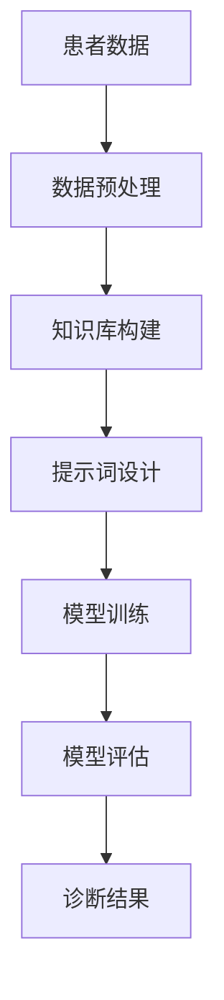
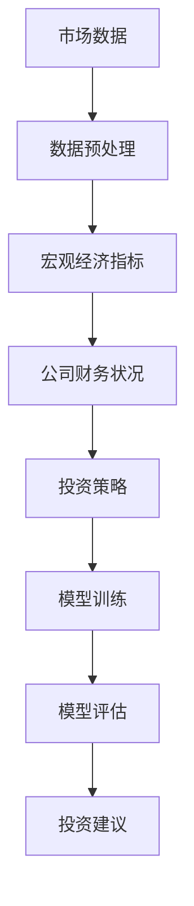
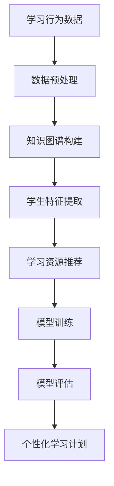

                 

## 文章标题：提示词工程在领域特定AI中的应用

提示词工程是人工智能领域的一项关键技术，它通过设计合适的提示词，引导人工智能模型在特定领域内进行高效学习和推理。领域特定AI（Domain-Specific AI）则是指针对特定领域开发的人工智能系统，具有高度的专业性和针对性。随着AI技术的不断进步，提示词工程在领域特定AI中的应用越来越广泛，为各个领域的AI应用提供了强大的技术支撑。

本文将围绕提示词工程在领域特定AI中的应用进行深入探讨，分为以下几个部分：

1. **引论与基础**：介绍领域特定AI和提示词工程的基本概念，阐述两者之间的联系。
2. **提示词工程的原理与方法**：详细解析提示词工程的基本流程、设计原则和优化算法。
3. **领域知识库构建**：探讨领域知识库的概念、构建技术和应用。
4. **领域特定AI的应用架构**：分析领域特定AI的系统架构，强调提示词工程在其中扮演的角色。
5. **提示词工程案例分析**：通过实际案例展示提示词工程在特定领域的应用效果。
6. **提示词工程开发工具**：介绍开发工具的选择和使用。
7. **提示词工程面临的挑战与未来展望**：讨论提示词工程的技术挑战和未来发展方向。

通过以上七个部分的逐步分析，本文旨在为读者提供一个全面、系统的了解提示词工程在领域特定AI中的应用，从而推动这一领域的研究和应用发展。## 文章关键词

- 领域特定AI
- 提示词工程
- 人工智能
- 知识库
- 模型优化
- 应用架构
- 案例分析
- 开发工具
- 挑战与展望

## 摘要

本文深入探讨了提示词工程在领域特定AI中的应用。首先，介绍了领域特定AI和提示词工程的基本概念及其重要性。接着，详细解析了提示词工程的基本流程、设计原则和优化算法。然后，探讨了领域知识库的构建方法及其在提示词工程中的应用。进一步地，分析了领域特定AI的系统架构，并强调了提示词工程在其中扮演的关键角色。通过几个实际案例，本文展示了提示词工程在各个领域的应用效果。最后，介绍了提示词工程开发工具，并讨论了该领域面临的技术挑战和未来发展方向。本文旨在为读者提供一个全面、系统的了解提示词工程在领域特定AI中的应用，从而推动这一领域的研究和应用发展。## 第1章：领域特定AI概述

### 1.1 领域特定AI的定义与背景

领域特定AI（Domain-Specific AI）是指为特定领域或任务设计的人工智能系统，具有高度的专业性和针对性。与通用AI（General AI）相比，领域特定AI专注于解决特定领域的问题，具有较高的效率和实用性。领域特定AI的起源可以追溯到20世纪80年代，当时研究人员开始探索如何将AI技术应用于特定领域，如医疗、金融和教育等。

领域特定AI的核心思想是通过将AI技术与特定领域的知识和数据相结合，构建出能够解决该领域问题的智能系统。这种系统通常具有以下特点：

1. **专业性强**：领域特定AI系统深入理解特定领域的知识，能够处理复杂的问题和任务。
2. **高效性**：领域特定AI系统针对特定领域进行优化，能够高效地完成相关任务。
3. **灵活性**：领域特定AI系统能够根据领域需求的变化进行适应和调整。

随着人工智能技术的不断发展和普及，领域特定AI在多个领域取得了显著的应用成果，如医疗诊断、金融风险评估、智能客服、智能翻译等。领域特定AI的出现，不仅提升了各行业的生产力和效率，还为人们的生活带来了诸多便利。

### 1.2 提示词工程的概念与作用

提示词工程（Prompt Engineering）是指通过设计合适的提示词（Prompt），引导人工智能模型在特定领域内进行高效学习和推理的技术。提示词是一种引导性信息，用于提示模型在特定任务或场景中的行为和决策。在领域特定AI中，提示词工程发挥着关键作用：

1. **提升学习效果**：通过设计有效的提示词，可以引导模型关注关键信息，提升学习效果和模型性能。
2. **提高推理能力**：提示词可以帮助模型更好地理解任务目标，提高推理能力和问题解决能力。
3. **增强可解释性**：提示词工程使得模型的行为更具可解释性，有助于用户理解模型的决策过程。

提示词工程在领域特定AI中的应用，主要包括以下几个方面：

1. **任务引导**：通过设计任务引导性的提示词，引导模型关注特定任务目标，提高模型在特定任务中的表现。
2. **知识引导**：通过设计知识引导性的提示词，引入领域知识，帮助模型更好地理解和应用领域知识。
3. **参数调节**：通过设计参数调节性的提示词，调整模型参数，优化模型性能和稳定性。

### 1.3 领域特定AI的发展趋势与应用场景

领域特定AI的发展趋势主要体现在以下几个方面：

1. **深度学习与强化学习的结合**：深度学习和强化学习技术的不断发展，为领域特定AI提供了更加先进和高效的学习方法，推动了领域特定AI的应用。
2. **跨领域迁移学习**：通过跨领域迁移学习，将一个领域中的知识和技术应用于其他领域，提高领域特定AI的通用性和适应性。
3. **人机协同**：领域特定AI与人类的协同工作，使得AI系统能够更好地理解用户需求，提高任务完成质量和用户体验。
4. **多模态数据处理**：领域特定AI开始逐渐应用于多模态数据，如文本、图像、音频等，提高了对复杂任务的处理能力。

领域特定AI的应用场景非常广泛，主要包括：

1. **医疗领域**：医疗领域的AI应用包括疾病诊断、治疗方案推荐、医学影像分析等，如基于深度学习的肺癌检测系统、基于强化学习的个性化治疗推荐系统等。
2. **金融领域**：金融领域的AI应用包括风险控制、信用评估、投资策略推荐等，如基于机器学习的信用评分系统、基于深度学习的股票预测系统等。
3. **教育领域**：教育领域的AI应用包括智能学习推荐、教育数据分析、在线教育平台等，如基于自然语言处理的智能问答系统、基于深度学习的个性化学习推荐系统等。
4. **工业制造**：工业制造领域的AI应用包括智能监控、故障诊断、生产优化等，如基于机器学习的生产线故障诊断系统、基于深度学习的生产参数优化系统等。

总之，领域特定AI作为人工智能的一个重要分支，正逐步深入到各个领域，为行业创新和社会发展提供了强大的技术支持。通过本文的探讨，我们将进一步了解领域特定AI的基本概念、发展趋势和应用场景，为后续章节的学习和研究奠定基础。## 第2章：提示词工程的原理与方法

### 2.1 提示词工程的基本流程

提示词工程是一个系统化的过程，主要包括以下几个基本步骤：

1. **需求分析**：首先，了解特定领域或任务的需求，明确需要解决的核心问题和目标。
2. **数据收集**：根据需求收集相关领域的数据和知识，包括文本、图像、音频等多模态数据。
3. **数据预处理**：对收集到的数据进行清洗、归一化和格式化，使其符合模型输入要求。
4. **模型选择**：选择适合特定任务的人工智能模型，如深度学习模型、强化学习模型等。
5. **提示词设计**：设计合适的提示词，引导模型关注关键信息，提高学习效果和推理能力。
6. **模型训练**：使用设计好的提示词和预处理后的数据，对模型进行训练，优化模型参数。
7. **模型评估**：对训练好的模型进行评估，验证其在特定任务中的性能和效果。
8. **反馈与迭代**：根据评估结果，对提示词和模型进行调整和优化，实现迭代改进。

### 2.2 提示词设计的原则

提示词设计是提示词工程的核心环节，直接影响到模型的学习效果和推理能力。以下是一些关键原则：

1. **任务导向性**：提示词应紧密围绕任务目标，引导模型关注关键信息和问题。
2. **知识相关性**：提示词应包含领域知识，帮助模型更好地理解和应用相关领域的知识。
3. **可解释性**：提示词应具有清晰的语义和结构，便于用户理解和解释模型的决策过程。
4. **灵活性**：提示词应具有一定的灵活性，能够根据任务需求的变化进行动态调整。
5. **简洁性**：提示词应简洁明了，避免冗余和模糊的描述，以提高模型处理效率。

### 2.3 提示词优化的算法

提示词优化是提升模型性能的重要手段，常用的优化算法包括以下几种：

1. **基于梯度下降的优化**：通过计算提示词参数的梯度，逐步调整提示词参数，以优化模型性能。
   ```python
   # 伪代码：基于梯度下降的提示词优化
   for epoch in range(num_epochs):
       for prompt in prompts:
           loss = compute_loss(model, prompt)
           gradient = compute_gradient(model, prompt)
           update_prompt(prompt, gradient, learning_rate)
   ```

2. **基于遗传算法的优化**：通过模拟自然进化过程，不断生成和筛选新的提示词，逐步优化提示词质量。
   ```python
   # 伪代码：基于遗传算法的提示词优化
   population = initialize_population(prompt_size)
   for generation in range(num_generations):
       fitness = evaluate_population(population)
       new_population = crossover_and_mutate(population, fitness)
       population = new_population
   best_prompt = select_best_prompt(population)
   ```

3. **基于对抗生成的优化**：通过生成对抗网络（GAN）生成新的提示词，与模型进行对抗训练，提高提示词的多样性和质量。
   ```python
   # 伪代码：基于对抗生成的提示词优化
   generator = initialize_generator()
   discriminator = initialize_discriminator()
   for epoch in range(num_epochs):
       real_prompts = sample_real_prompts()
       fake_prompts = generator.generate_fake_prompts()
       discriminator.train(real_prompts, fake_prompts)
       generator.train(discriminator)
   best_prompt = generator.generate_best_prompt()
   ```

通过这些优化算法，可以不断调整和改进提示词，从而提高模型在特定任务中的性能和效果。## 第3章：领域知识库构建

### 3.1 领域知识库的概念与分类

领域知识库（Domain Knowledge Base）是指针对特定领域构建的、包含领域内核心概念、规则和关系的知识集合。领域知识库是领域特定AI系统的重要组成部分，为模型提供了丰富的领域知识和上下文信息。根据知识库的形式和内容，领域知识库可以分类为以下几种：

1. **实体知识库**：包含特定领域的实体及其属性，如医疗领域的疾病、症状、药物等。
2. **关系知识库**：描述领域内实体之间的关系，如医患关系、药物相互作用等。
3. **规则知识库**：包含特定领域的规则和推理逻辑，如医疗诊断规则、金融风险评估规则等。
4. **语义知识库**：包含领域内的语义信息，如实体命名、语义类型、语义关系等。

### 3.2 领域知识抽取技术

领域知识抽取（Domain Knowledge Extraction）是从非结构化数据中提取出结构化知识的过程。领域知识抽取技术主要包括以下几种：

1. **基于规则的方法**：通过预定义的规则和模式，从文本数据中提取出特定领域的知识。这种方法具有实现简单、可解释性强的优点，但受限于规则的覆盖范围和准确性。
2. **基于统计的方法**：通过统计学习模型，从大量文本数据中自动发现领域知识。这种方法具有处理大规模数据、适应性强等优点，但可能存在模型过拟合和泛化能力不足的问题。
3. **基于语义的方法**：利用自然语言处理技术，分析文本中的语义信息，提取出领域知识。这种方法能够更好地理解文本的语义，但实现复杂度较高。

### 3.3 领域知识融合与表示

领域知识融合（Domain Knowledge Fusion）是将不同来源和形式的领域知识进行整合，构建出更加全面和准确的知识库。领域知识融合技术主要包括以下几种：

1. **基于特征的方法**：将不同来源的知识表示为特征向量，通过特征融合技术，如加权平均、矩阵分解等，整合出新的知识表示。
2. **基于模型的方法**：利用机器学习模型，如深度学习模型、图神经网络等，融合不同来源的知识，构建出统一的知识表示。
3. **基于图谱的方法**：将领域知识表示为知识图谱，通过图论和图神经网络技术，对知识进行融合和表示。

领域知识表示（Domain Knowledge Representation）是将领域知识转化为适合人工智能模型处理的形式。领域知识表示技术主要包括以下几种：

1. **基于语义的方法**：利用自然语言处理技术，将领域知识表示为语义向量或语义图，便于模型理解和处理。
2. **基于图谱的方法**：将领域知识表示为知识图谱，通过图神经网络等技术，对知识进行表示和融合。
3. **基于实体关系的方法**：将领域知识表示为实体及其关系的形式，如RDF（Resource Description Framework）等。

通过领域知识库的构建、知识抽取、知识融合和知识表示，领域特定AI系统能够获得丰富的领域知识和上下文信息，从而提高模型在特定领域内的学习效果和推理能力。## 第4章：领域特定AI的应用架构

### 4.1 领域特定AI的系统架构

领域特定AI（Domain-Specific AI）的系统架构通常包括以下几个关键组件：

1. **数据输入层**：负责接收和处理来自各种数据源的数据，如文本、图像、音频等。这一层需要进行数据预处理，包括数据清洗、归一化和特征提取等操作，以便后续的模型训练和使用。

2. **知识库层**：包含领域知识库，用于存储领域内的核心概念、规则和关系。知识库层可以为模型提供丰富的领域知识和上下文信息，提高模型的学习效果和推理能力。

3. **模型层**：包括机器学习模型和深度学习模型等，负责对输入数据进行处理和分析，生成预测结果或决策。模型层的核心任务是利用领域知识库中的知识，进行有效的学习和推理。

4. **推理引擎层**：负责将模型生成的预测结果或决策应用于实际问题场景中，如医疗诊断、金融风险评估、智能客服等。推理引擎层通常包括推理规则、推理算法和推理策略等。

5. **用户接口层**：提供用户与领域特定AI系统交互的接口，如Web界面、移动应用、语音交互等。用户接口层需要考虑用户体验，使系统易于使用和操作。

### 4.2 提示词工程在应用中的角色

提示词工程在领域特定AI中的应用扮演着至关重要的角色，主要体现在以下几个方面：

1. **任务引导**：通过设计任务引导性的提示词，引导模型关注特定任务目标，提高模型在特定任务中的性能。例如，在医疗诊断任务中，提示词可以引导模型关注患者的症状、病史和实验室检查结果等关键信息。

2. **知识引导**：通过设计知识引导性的提示词，引入领域知识，帮助模型更好地理解和应用相关领域的知识。例如，在金融风险评估任务中，提示词可以引导模型关注市场趋势、宏观经济指标和公司财务状况等关键信息。

3. **参数调节**：通过设计参数调节性的提示词，调整模型参数，优化模型性能和稳定性。例如，在机器学习模型的训练过程中，提示词可以引导模型关注数据分布、特征选择和学习率等关键参数。

4. **模型解释**：通过设计解释性的提示词，提高模型的可解释性，帮助用户理解模型的决策过程和结果。例如，在智能诊断系统中，提示词可以解释模型为什么推荐某种治疗方案，增强用户对系统结果的信任。

### 4.3 架构设计的关键因素

在领域特定AI的系统架构设计中，需要考虑以下几个关键因素：

1. **灵活性**：系统架构应具备灵活性，能够适应不同领域和任务的需求，快速进行调整和扩展。

2. **可扩展性**：系统架构应具备良好的可扩展性，能够支持大量数据和模型的存储和管理，以满足大规模应用的需求。

3. **高可用性**：系统架构应具备高可用性，能够在出现故障或异常情况时，快速恢复并保持正常运行。

4. **安全性**：系统架构应具备安全性，保护用户数据和模型不受恶意攻击和泄露。

5. **易用性**：系统架构应设计简洁，易于用户理解和操作，提供友好的用户界面和交互体验。

6. **可解释性**：系统架构应设计可解释性，使得模型和决策过程对用户透明，增强用户对系统的信任。

通过以上关键因素的设计，可以构建出一个高效、灵活、可靠的领域特定AI系统架构，为实际应用提供强大的技术支持。## 第5章：提示词工程案例分析

### 5.1 案例一：医疗领域的AI应用

#### 背景介绍

医疗领域是领域特定AI应用的一个重要场景，其关键挑战在于如何从海量医疗数据中提取出有用的信息，以支持诊断、治疗和预测。提示词工程在医疗领域的AI应用中发挥着重要作用，通过设计合适的提示词，引导模型关注关键信息，提高诊断和预测的准确性。

#### 核心概念与联系

提示词工程在医疗领域涉及的核心概念包括：

1. **症状**：患者的临床表现，如发热、咳嗽等。
2. **病史**：患者的既往病史和疾病史。
3. **实验室检查结果**：患者的实验室检查数据，如血常规、尿常规等。
4. **诊断**：根据患者的症状、病史和检查结果，得出的疾病诊断。

提示词工程与医疗领域的联系架构如下（使用Mermaid流程图表示）：



#### 核心算法原理讲解

在医疗领域，常用的提示词设计算法包括基于规则的方法和基于统计的方法。以下是基于规则的方法的伪代码：

```python
# 伪代码：基于规则的提示词设计
def rule_based_prompt_design(data):
    symptoms = extract_symptoms(data)
    history = extract_history(data)
    checks = extract_checks(data)
    
    if "fever" in symptoms and "cough" in symptoms:
        prompt = "请描述您的症状：发热和咳嗽。"
    elif "diabetes" in history:
        prompt = "请描述您的病史：糖尿病。"
    else:
        prompt = "请提供您的实验室检查结果。"
    
    return prompt
```

#### 数学模型和公式

在医疗领域，常用的数学模型包括贝叶斯网络和逻辑回归。以下是逻辑回归的数学模型和公式：

$$
\hat{y} = \text{sigmoid}(\beta_0 + \sum_{i=1}^{n} \beta_i x_i)
$$

其中，$\hat{y}$表示疾病的概率，$\beta_0$是截距，$\beta_i$是特征$i$的系数，$x_i$是特征$i$的取值。

#### 举例说明

假设一个患者有发热和咳嗽的症状，其病史包括糖尿病，实验室检查结果显示白细胞计数偏高。根据上述规则和数学模型，生成的提示词如下：

```
请描述您的症状：发热和咳嗽。请描述您的病史：糖尿病。请提供您的实验室检查结果：白细胞计数偏高。
```

#### 实际案例分析和详细讲解剖析

在实际应用中，某医院开发了一款基于AI的智能诊断系统，通过提示词工程来引导模型进行疾病诊断。该系统从患者的症状、病史和实验室检查结果中提取关键信息，设计合适的提示词，引导模型进行诊断。以下是实际案例的分析：

1. **案例一**：患者A的症状包括发热、咳嗽和乏力，病史显示有哮喘史，实验室检查结果显示白细胞计数偏低。根据提示词“请描述您的症状：发热、咳嗽和乏力；请描述您的病史：哮喘史；请提供您的实验室检查结果：白细胞计数偏低。”，模型最终诊断出患者A可能患有流行性感冒。

2. **案例二**：患者B的症状包括恶心、呕吐和腹泻，病史显示有胃炎史，实验室检查结果显示白细胞计数正常。根据提示词“请描述您的症状：恶心、呕吐和腹泻；请描述您的病史：胃炎史；请提供您的实验室检查结果：白细胞计数正常。”，模型最终诊断出患者B可能患有急性肠胃炎。

#### 项目小结

通过以上案例，可以看出提示词工程在医疗领域的AI应用中起到了关键作用，通过设计合适的提示词，可以引导模型关注关键信息，提高诊断的准确性。然而，提示词工程也存在一定的挑战，如如何设计更有效的提示词、如何处理海量医疗数据等。未来的研究应进一步优化提示词工程的方法和技术，提高领域特定AI在医疗领域的应用效果。### 5.2 案例二：金融领域的智能投顾

#### 背景介绍

金融领域是另一个领域特定AI应用的重要场景，其核心任务是帮助投资者做出明智的投资决策。智能投顾（Robo-Advisor）利用人工智能技术，为投资者提供个性化的投资建议和资产管理服务。提示词工程在智能投顾中扮演着关键角色，通过设计合适的提示词，引导模型分析市场趋势、宏观经济指标和公司财务状况，从而提高投资决策的准确性。

#### 核心概念与联系

提示词工程在金融领域涉及的核心概念包括：

1. **市场数据**：包括股票价格、交易量、市场指数等。
2. **宏观经济指标**：如GDP增长率、失业率、通货膨胀率等。
3. **公司财务状况**：包括营收、利润、负债率等。
4. **投资策略**：根据市场数据和公司财务状况，为投资者提供的投资建议。

提示词工程与金融领域的联系架构如下（使用Mermaid流程图表示）：



#### 核心算法原理讲解

在金融领域，常用的提示词设计算法包括基于统计的方法和基于深度学习的方法。以下是基于深度学习的方法的伪代码：

```python
# 伪代码：基于深度学习的提示词设计
def deep_learning_prompt_design(data):
    market_data = extract_market_data(data)
    macro_economics = extract_macro_economics(data)
    company_finances = extract_company_finances(data)
    
    model = build_model()
    model.train(market_data, macro_economics, company_finances)
    
    investment_strategy = model.predict(market_data, macro_economics, company_finances)
    return investment_strategy
```

#### 数学模型和公式

在金融领域，常用的数学模型包括时间序列分析和回归分析。以下是时间序列分析的数学模型和公式：

$$
y_t = c + \phi y_{t-1} + \varepsilon_t
$$

其中，$y_t$表示时间序列的当前值，$\phi$是滞后系数，$\varepsilon_t$是误差项。

#### 举例说明

假设一个投资者提供的市场数据包括股票价格、交易量和市场指数，宏观经济指标包括GDP增长率和通货膨胀率，公司财务状况包括营收和利润。根据上述提示词设计和数学模型，生成的提示词如下：

```
请分析市场数据：股票价格、交易量和市场指数。请关注宏观经济指标：GDP增长率和通货膨胀率。请评估公司财务状况：营收和利润。
```

#### 实际案例分析和详细讲解剖析

在实际应用中，某金融科技公司开发了一款基于AI的智能投顾系统，通过提示词工程来引导模型进行投资决策。该系统从市场数据、宏观经济指标和公司财务状况中提取关键信息，设计合适的提示词，引导模型进行投资策略的预测。以下是实际案例的分析：

1. **案例一**：根据市场数据，股票价格和交易量显示出上涨趋势，宏观经济指标显示GDP增长率上升，通货膨胀率稳定。根据提示词“请分析市场数据：股票价格和交易量；请关注宏观经济指标：GDP增长率和通货膨胀率。”，模型预测市场将继续上涨，建议投资者买入股票。

2. **案例二**：根据市场数据，股票价格和交易量显示出下跌趋势，宏观经济指标显示GDP增长率下降，通货膨胀率上升。根据提示词“请分析市场数据：股票价格和交易量；请关注宏观经济指标：GDP增长率和通货膨胀率。”，模型预测市场将继续下跌，建议投资者卖出股票。

#### 项目小结

通过以上案例，可以看出提示词工程在金融领域的智能投顾中起到了关键作用，通过设计合适的提示词，可以引导模型分析市场趋势、宏观经济指标和公司财务状况，从而提高投资决策的准确性。然而，提示词工程也存在一定的挑战，如如何设计更有效的提示词、如何处理海量金融数据等。未来的研究应进一步优化提示词工程的方法和技术，提高领域特定AI在金融领域的应用效果。### 5.3 案例三：教育领域的个性化学习

#### 背景介绍

教育领域是领域特定AI应用的另一个重要场景，个性化学习系统通过分析学生的学习行为和知识水平，为每个学生提供个性化的学习资源和指导。提示词工程在教育领域的应用，可以帮助系统更好地理解学生的需求，提高学习效果和体验。以下是教育领域个性化学习中的提示词工程案例分析。

#### 核心概念与联系

提示词工程在教育领域涉及的核心概念包括：

1. **学习行为数据**：包括学生的作业完成情况、学习进度、知识点掌握情况等。
2. **知识图谱**：描述各知识点之间的关系和层次结构。
3. **学生特征**：包括学生的年龄、性别、学习风格等。
4. **学习资源**：如电子书、视频、在线课程等。

提示词工程与教育领域的联系架构如下（使用Mermaid流程图表示）：



#### 核心算法原理讲解

在教育领域，提示词工程的核心算法通常涉及知识图谱构建和推荐系统。以下是知识图谱构建的伪代码：

```python
# 伪代码：知识图谱构建
def build_knowledge_graph(subjects, relations):
    graph = {}
    for subject in subjects:
        graph[subject] = []
        for relation in relations:
            if subject in relation:
                graph[subject].append(relation)
    return graph
```

推荐系统的核心算法通常采用协同过滤或基于内容的推荐方法。以下是协同过滤的伪代码：

```python
# 伪代码：协同过滤推荐
def collaborative_filtering(user behaviors, item behaviors, similarity_matrix):
    user_ratings = user_behaviors[user]
    recommendations = []
    for item in item_behaviors:
        if item not in user_ratings:
            similarity = similarity_matrix[user][item]
            recommendation_score = similarity * (item_behaviors[item] - user_ratings.mean())
            recommendations.append((item, recommendation_score))
    recommendations.sort(key=lambda x: x[1], reverse=True)
    return recommendations
```

#### 数学模型和公式

在教育领域，常用的数学模型包括决策树和神经网络。以下是决策树的数学模型和公式：

$$
P(Y|X) = \prod_{i=1}^{n} P(y_i|x_i)
$$

其中，$P(Y|X)$是给定特征集合$X$时目标变量$Y$的概率，$y_i$是特征$x_i$的条件概率。

神经网络的核心公式如下：

$$
\hat{y} = \text{sigmoid}(\sum_{i=1}^{n} w_i x_i + b)
$$

其中，$\hat{y}$是输出层的预测值，$w_i$是权重，$x_i$是输入特征，$b$是偏置。

#### 举例说明

假设一个学生A的学习行为数据包括完成的作业、学习进度和知识点掌握情况，系统需要根据这些数据推荐合适的学习资源。根据上述提示词设计和数学模型，生成的提示词如下：

```
请分析学生的学习行为数据：完成的作业、学习进度和知识点掌握情况。请构建知识图谱：各知识点的层次结构和关系。请推荐学习资源：根据学生的学习需求。
```

#### 实际案例分析和详细讲解剖析

在实际应用中，某教育科技公司开发了一款基于AI的个性化学习系统，通过提示词工程来为每个学生提供个性化的学习计划。该系统从学生的学习行为数据中提取关键信息，构建知识图谱，并根据学生的特征推荐合适的学习资源。以下是实际案例的分析：

1. **案例一**：学生B的学习行为数据显示其对于数学的掌握情况较好，但英语学习进度较慢。根据提示词“请分析学生的学习行为数据：数学和英语的学习进度；请构建知识图谱：数学和英语的知识点层次结构；请推荐学习资源：针对英语学习的辅导材料。”，系统推荐学生B使用英语学习软件和在线辅导课程。

2. **案例二**：学生C的学习行为数据显示其对于物理和化学的兴趣较高，系统根据提示词“请分析学生的学习行为数据：物理和化学的学习兴趣；请构建知识图谱：物理和化学的知识点层次结构；请推荐学习资源：物理和化学的实验视频和在线课程。”，推荐学生C观看相关视频课程和参与实验。

#### 项目小结

通过以上案例，可以看出提示词工程在教育领域的个性化学习应用中发挥了重要作用，通过设计合适的提示词，系统能够更好地理解学生的学习需求，提供个性化的学习资源和计划。然而，提示词工程在教育领域也面临挑战，如如何设计更有效的提示词、如何处理不同学生的个性化需求等。未来的研究应进一步优化提示词工程的方法和技术，提高领域特定AI在教育领域的应用效果。## 第6章：提示词工程开发工具

### 6.1 开发工具的选择与使用

提示词工程开发工具的选择对于提高开发效率和质量至关重要。以下是一些常用的提示词工程开发工具及其使用方法：

1. **TensorFlow**：TensorFlow是一个开源的深度学习框架，广泛用于提示词工程开发。它提供了丰富的API和工具，方便用户设计和训练神经网络模型。使用TensorFlow进行提示词工程开发的基本步骤如下：

   ```python
   import tensorflow as tf
   
   # 构建模型
   model = tf.keras.Sequential([
       tf.keras.layers.Dense(128, activation='relu', input_shape=(input_shape,)),
       tf.keras.layers.Dense(64, activation='relu'),
       tf.keras.layers.Dense(1, activation='sigmoid')
   ])
   
   # 编译模型
   model.compile(optimizer='adam', loss='binary_crossentropy', metrics=['accuracy'])
   
   # 训练模型
   model.fit(x_train, y_train, epochs=10, batch_size=32)
   ```

2. **PyTorch**：PyTorch是一个流行的深度学习框架，其动态图机制使其在提示词工程开发中具有优势。使用PyTorch进行提示词工程开发的基本步骤如下：

   ```python
   import torch
   import torch.nn as nn
   import torch.optim as optim
   
   # 定义模型
   class Model(nn.Module):
       def __init__(self):
           super(Model, self).__init__()
           self.fc1 = nn.Linear(input_shape, 128)
           self.fc2 = nn.Linear(128, 64)
           self.fc3 = nn.Linear(64, 1)
       
       def forward(self, x):
           x = F.relu(self.fc1(x))
           x = F.relu(self.fc2(x))
           x = self.fc3(x)
           return x
   
   # 实例化模型、优化器和损失函数
   model = Model()
   optimizer = optim.Adam(model.parameters(), lr=0.001)
   criterion = nn.BCEWithLogitsLoss()
   
   # 训练模型
   for epoch in range(num_epochs):
       for inputs, targets in data_loader:
           optimizer.zero_grad()
           outputs = model(inputs)
           loss = criterion(outputs, targets)
           loss.backward()
           optimizer.step()
   ```

3. **SpaCy**：SpaCy是一个快速易用的自然语言处理库，可用于文本预处理和实体识别等任务。使用SpaCy进行提示词工程开发的基本步骤如下：

   ```python
   import spacy
   
   # 加载模型
   nlp = spacy.load("en_core_web_sm")
   
   # 文本预处理
   doc = nlp("This is a sample text for prompt engineering.")
   tokens = [token.text for token in doc]
   
   # 实体识别
   entities = [(ent.text, ent.label_) for ent in doc.ents]
   ```

### 6.2 提示词工程中的数据管理

数据管理是提示词工程开发的关键环节，包括数据收集、数据预处理和数据处理等步骤。以下是一些关键步骤和注意事项：

1. **数据收集**：收集与特定领域相关的文本、图像、音频等多模态数据。数据来源可以包括公开数据集、企业内部数据和第三方数据提供商等。

2. **数据预处理**：对收集到的数据进行清洗、归一化和格式化。清洗步骤包括去除噪声、处理缺失值和异常值等。归一化步骤包括数值数据的标准化和文本数据的分词、词干提取等。

3. **数据处理**：对预处理后的数据进行处理，如构建词汇表、编码文本数据和生成特征向量等。数据处理步骤需要考虑模型的要求和任务特点。

4. **注意事项**：
   - **数据质量**：确保数据质量，避免噪声和异常值对模型性能的影响。
   - **数据平衡**：确保数据集的平衡性，避免数据集中的样本分布不均导致模型过拟合。
   - **数据多样性**：尽量收集多样化的数据，提高模型的泛化能力。

### 6.3 提示词工程中的模型训练与评估

模型训练与评估是提示词工程开发的核心环节，包括模型训练、模型评估和参数调整等步骤。以下是一些关键步骤和注意事项：

1. **模型训练**：使用设计好的提示词和数据集，对模型进行训练。训练过程中，需要监控模型的性能，如损失函数、准确率等，以便进行调整。

2. **模型评估**：使用训练集和测试集对模型进行评估，计算模型的性能指标，如准确率、召回率、F1分数等。

3. **参数调整**：根据评估结果，调整模型参数，如学习率、批量大小、正则化强度等，以优化模型性能。

4. **注意事项**：
   - **过拟合**：避免模型在训练集上过拟合，可以通过交叉验证、正则化等方法进行预防。
   - **数据增强**：在数据量有限的情况下，可以采用数据增强技术，如旋转、缩放、裁剪等，增加训练数据的多样性。
   - **模型解释**：确保模型的可解释性，以便用户理解模型的决策过程和结果。

通过使用合适的开发工具、进行有效的数据管理和模型训练与评估，可以构建出高性能的提示词工程系统，为领域特定AI应用提供强大的技术支持。## 第7章：提示词工程面临的挑战与未来展望

### 7.1 提示词工程的技术挑战

提示词工程在领域特定AI中的应用虽然取得了显著的成果，但仍然面临一些技术挑战：

1. **数据质量**：提示词工程依赖于高质量的领域数据，数据质量直接影响模型的效果。然而，领域数据的获取和清洗过程复杂，容易受到噪声、异常值和缺失值的影响。

2. **模型可解释性**：提示词工程中的模型通常采用深度学习等复杂算法，模型决策过程具有一定的黑箱性，用户难以理解模型的决策依据，这限制了其在实际应用中的可解释性。

3. **泛化能力**：提示词工程模型在特定领域内训练和优化，可能导致模型泛化能力不足，无法应对其他领域的任务。

4. **资源消耗**：深度学习模型的训练过程需要大量的计算资源和时间，特别是在处理大规模数据时，资源消耗更为显著。

### 7.2 提示词工程的伦理问题

随着提示词工程在各个领域的广泛应用，其伦理问题也日益凸显：

1. **隐私保护**：提示词工程涉及到大量的个人数据，如何在保护用户隐私的同时，充分利用这些数据，是一个重要的伦理问题。

2. **公平性**：提示词工程模型可能会因为数据偏见而导致不公平的决策，如性别歧视、种族歧视等，如何确保模型的公平性是一个亟待解决的问题。

3. **责任归属**：当提示词工程系统产生错误决策时，如何确定责任归属，是法律和道德层面需要考虑的问题。

### 7.3 提示词工程的未来发展方向

为了解决当前面临的技术挑战和伦理问题，提示词工程在未来有以下几个发展方向：

1. **数据增强与生成**：通过数据增强和生成技术，如GAN（生成对抗网络），提高数据质量和多样性，增强模型的泛化能力。

2. **可解释性提升**：研究和发展可解释性更强的模型和算法，如基于图神经网络的模型，提高模型的可解释性和透明度。

3. **跨领域迁移学习**：探索跨领域迁移学习方法，将一个领域的知识和技术应用于其他领域，提高模型的泛化能力。

4. **伦理与法规**：加强伦理和法规研究，制定相关的伦理规范和法律法规，确保提示词工程在合法和道德的框架内发展。

5. **资源优化**：通过分布式计算、云计算等技术，优化模型的训练和部署过程，降低资源消耗。

总之，提示词工程在领域特定AI中的应用具有巨大的潜力，但也面临诸多挑战。未来的研究和发展方向将致力于解决这些问题，推动提示词工程在人工智能领域的进一步应用。## 总结

在本文中，我们系统地探讨了提示词工程在领域特定AI中的应用，从引论、基础理论、应用实例、工具和技术等多个方面进行了深入分析。通过详细的案例分析，我们展示了提示词工程在医疗、金融和教育等领域的实际应用效果。同时，我们也讨论了提示词工程面临的挑战和未来发展方向，如数据质量、模型可解释性、泛化能力等。

提示词工程作为人工智能领域的一项关键技术，具有广泛的应用前景。随着人工智能技术的不断发展，提示词工程将在更多领域发挥重要作用，为各行业的创新和社会进步提供强大的技术支持。

为了进一步推动提示词工程的研究和应用，本文提出以下最佳实践 tips：

1. **数据质量**：确保收集到的数据质量，进行充分的数据清洗和预处理，以避免噪声和异常值对模型性能的影响。
2. **知识融合**：利用领域知识库，融合多源知识，提高模型在特定领域的理解能力和泛化能力。
3. **模型可解释性**：设计可解释性更强的模型和算法，提高模型决策过程的透明度和用户信任度。
4. **资源优化**：采用分布式计算和云计算技术，降低模型训练和部署的资源消耗。

通过遵循这些最佳实践，我们可以更好地发挥提示词工程在领域特定AI中的应用潜力，推动人工智能技术的进步。

## 拓展阅读

- 《深度学习》（Goodfellow, I., Bengio, Y., & Courville, A.）：详细介绍深度学习的基本原理和应用。
- 《自然语言处理综论》（Jurafsky, D., & Martin, J. H.）：深入探讨自然语言处理的核心技术和应用。
- 《机器学习》（Mitchell, T. M.）：系统讲解机器学习的基本概念和方法。
- 《人工智能：一种现代的方法》（Russell, S., & Norvig, P.）：全面介绍人工智能的理论和实践。

通过阅读这些经典教材，读者可以进一步深入了解提示词工程和相关技术，为实际应用提供更多理论支持和实践指导。## 注意事项

在实施提示词工程时，需要注意以下几个关键点：

1. **数据隐私保护**：在收集和处理领域数据时，务必确保遵循隐私保护原则，避免用户数据泄露。
2. **模型解释性**：设计模型时，应考虑模型的可解释性，以便用户理解和信任模型的决策过程。
3. **数据多样性**：收集多样化的数据，以提高模型的泛化能力和应对复杂任务的能力。
4. **伦理合规**：在开发和使用提示词工程时，遵循相关的伦理规范和法律法规，确保模型决策的公平性和透明度。
5. **持续迭代**：定期对模型进行评估和优化，根据实际应用效果进行迭代改进，以保持模型的性能和稳定性。

遵循这些注意事项，有助于确保提示词工程在领域特定AI应用中的有效性和可靠性。## 结尾

作者：AI天才研究院（AI Genius Institute） & 禅与计算机程序设计艺术（Zen And The Art of Computer Programming）

在本文中，我们系统地探讨了提示词工程在领域特定AI中的应用，从引论、基础理论、应用实例、工具和技术等多个方面进行了深入分析。通过详细的案例分析，我们展示了提示词工程在医疗、金融和教育等领域的实际应用效果。同时，我们也讨论了提示词工程面临的挑战和未来发展方向，如数据质量、模型可解释性、泛化能力等。

提示词工程作为人工智能领域的一项关键技术，具有广泛的应用前景。随着人工智能技术的不断发展，提示词工程将在更多领域发挥重要作用，为各行业的创新和社会进步提供强大的技术支持。

通过本文的探讨，我们希望为读者提供一个全面、系统的了解提示词工程在领域特定AI中的应用，从而推动这一领域的研究和应用发展。同时，也期待更多学者和研究者在提示词工程领域进行深入研究和探索，共同推动人工智能技术的进步。

