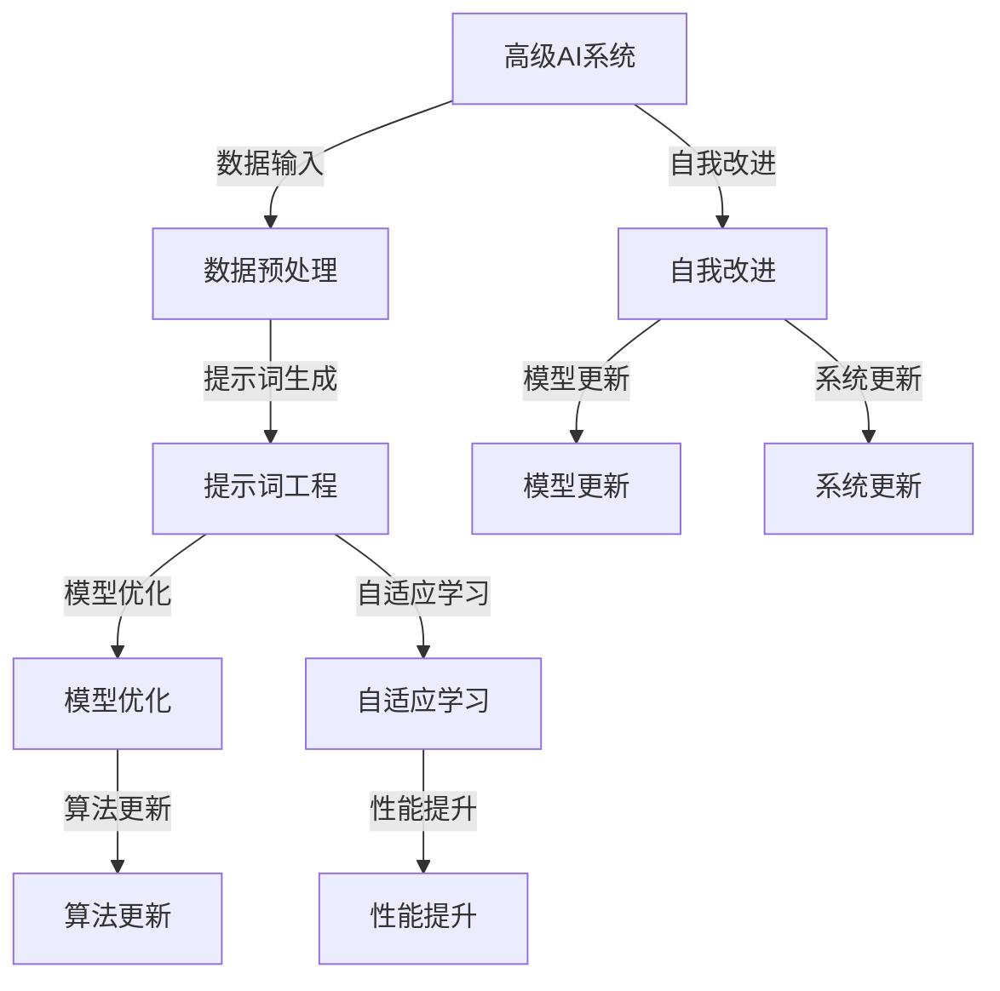

                 

### 文章标题

《提示词工程在高级AI系统自我改进中的应用》

关键词：高级AI系统、自我改进、提示词工程、多模态数据、核心算法

摘要：本文旨在探讨提示词工程在高级AI系统自我改进中的应用。通过分析高级AI系统的定义、架构和发展趋势，介绍提示词工程的基本概念和技术，阐述AI系统自我改进的原理，详细解析提示词生成和自我改进算法，探讨多模态提示词工程的应用，并结合实际案例展示高级AI系统自我改进的实战效果。最后，对提示词工程在高级AI系统自我改进中的未来展望进行总结，为相关领域的研究和实践提供参考。

---

### 背景介绍

#### 高级AI系统概述

高级AI系统，即高级人工智能系统，是指在传统人工智能技术的基础上，通过深度学习、强化学习、自然语言处理等多学科交叉融合，构建出的具有高度智能化和自适应能力的系统。这些系统不仅能够处理复杂、大规模的数据，还能够根据环境和用户需求进行自我学习和改进，从而实现更高效、更准确的决策和预测。

高级AI系统的核心优势在于其自我改进能力。自我改进是指AI系统能够通过不断地学习和调整，提升自身的性能和效果。这一过程通常涉及多个方面，包括算法优化、模型更新、数据清洗等。自我改进能力是高级AI系统区别于传统AI系统的重要特征，也是其实现智能化、自适应的关键。

#### 自我改进的重要性

自我改进在高级AI系统中具有重要地位。首先，随着数据量的不断增长和业务场景的多样化，AI系统需要具备更高的自适应能力，以应对不断变化的环境和需求。自我改进能够使AI系统在运行过程中不断调整和优化自身，从而提高系统的稳定性和可靠性。

其次，自我改进有助于提升AI系统的智能化水平。通过自我学习和优化，AI系统能够更好地理解和处理复杂任务，提高决策质量和效率。这不仅能够满足用户的多样化需求，还能够为AI系统在各个领域的广泛应用提供有力支持。

#### 提示词工程的作用

提示词工程在高级AI系统的自我改进中发挥着重要作用。提示词工程是指通过设计、生成和应用提示词，来引导和优化AI系统的学习和决策过程。提示词是AI系统理解和处理信息的关键，其质量直接影响系统的性能和效果。

在高级AI系统中，提示词工程的应用主要体现在以下几个方面：

1. **数据预处理**：通过提示词工程，对输入数据进行预处理，提取关键特征，去除噪声，从而提高数据的可用性和质量。

2. **模型优化**：通过提示词工程，对AI模型进行优化，调整模型参数，提升模型的准确性和鲁棒性。

3. **自适应学习**：通过提示词工程，引导AI系统进行自适应学习，根据环境和用户需求调整学习策略，实现系统的自我改进。

#### 本文结构

本文将从以下几个方面对提示词工程在高级AI系统自我改进中的应用进行深入探讨：

1. **高级AI系统概述**：介绍高级AI系统的定义、架构和发展趋势，为后续内容提供背景。

2. **提示词工程基础**：详细阐述提示词的概念、类型和关键技术，为理解提示词工程在自我改进中的应用奠定基础。

3. **AI系统自我改进原理**：分析AI系统自我改进的概念、模型和关键技术，探讨自我改进与提示词工程的关系。

4. **核心算法原理讲解**：详细解析提示词生成算法和自我改进算法，包括伪代码、数学模型和公式，以及实际应用中的例子。

5. **多模态提示词工程**：探讨多模态数据理解、提示词生成和提示词工程应用，介绍多模态提示词工程的优势和挑战。

6. **实战应用**：结合实际案例，展示高级AI系统自我改进的实战效果，分析项目开发环境、源代码实现、代码解读和应用分析。

7. **未来展望**：总结提示词工程在高级AI系统自我改进中的未来发展方向，提出最佳实践和注意事项。

通过本文的探讨，旨在为读者提供一个全面、系统的视角，理解提示词工程在高级AI系统自我改进中的应用，为其在实际项目中的开发和应用提供参考和指导。

### 核心概念与联系

在深入探讨提示词工程在高级AI系统自我改进中的应用之前，我们需要明确几个核心概念，并理解它们之间的相互关系。以下是这些核心概念及其关系架构的Mermaid流程图：



#### 提示词工程

提示词工程是整个流程的核心，其作用在于通过设计、生成和应用提示词，来引导和优化AI系统的学习和决策过程。提示词（Word Engineering）可以分为以下几类：

1. **语义提示词**：用于传递上下文信息，帮助AI系统理解输入数据的含义。
2. **关键提示词**：用于提取输入数据中的关键特征，帮助AI系统进行数据预处理。
3. **反馈提示词**：用于评估AI系统的决策效果，指导系统进行自我改进。

#### 数据预处理

数据预处理是AI系统自我改进的基础。通过数据预处理，我们可以去除噪声、缺失值，并提取出对AI系统学习有用的信息。数据预处理通常包括以下步骤：

1. **数据清洗**：去除噪声和异常值。
2. **数据归一化**：将数据转换为统一的尺度，以减少数据分布对模型训练的影响。
3. **特征提取**：从原始数据中提取出对AI系统学习有用的特征。

#### 模型优化

模型优化是提升AI系统性能的重要手段。通过提示词工程，我们可以调整模型参数，优化模型结构，从而提升模型的准确性和鲁棒性。模型优化通常包括以下方法：

1. **参数调整**：通过提示词工程，调整模型的参数，使其更符合数据特征。
2. **结构调整**：通过提示词工程，优化模型的结构，使其更适应任务需求。
3. **损失函数优化**：通过提示词工程，调整损失函数，使其更敏感于数据特征。

#### 自适应学习

自适应学习是AI系统自我改进的关键。通过自适应学习，AI系统可以根据环境和用户需求调整自身的学习策略，从而实现自我改进。自适应学习通常包括以下方法：

1. **在线学习**：AI系统在运行过程中不断更新模型，以适应新数据。
2. **迁移学习**：AI系统利用已有的模型知识，在新数据上进行学习。
3. **强化学习**：AI系统通过与环境的互动，不断调整策略，以最大化奖励。

#### 自我改进

自我改进是AI系统的最终目标。通过自我改进，AI系统可以不断提高自身性能，适应不断变化的环境和需求。自我改进通常包括以下步骤：

1. **模型更新**：通过自适应学习，更新AI系统的模型，提升其性能。
2. **系统更新**：根据AI系统的性能表现，更新系统的架构和算法，以提升整体性能。

#### 关系架构

通过上述核心概念的Mermaid流程图，我们可以清晰地看到各个概念之间的相互关系。提示词工程是整个流程的核心，通过数据预处理、模型优化和自适应学习，实现AI系统的自我改进。数据预处理为模型优化提供了基础，模型优化提升了AI系统的性能，自适应学习使系统能够根据环境和用户需求进行自我调整。最终，通过自我改进，AI系统实现性能的持续提升。

理解这些核心概念及其相互关系，有助于我们更好地掌握提示词工程在高级AI系统自我改进中的应用。在接下来的章节中，我们将详细探讨这些核心概念的具体实现方法和应用场景。

### 提示词工程基础

#### 提示词的概念

提示词（Prompt）是指用于引导和优化AI系统学习和决策过程的文字或符号。它通过传递上下文信息、提取关键特征和提供反馈，帮助AI系统更好地理解和处理输入数据。在高级AI系统中，提示词不仅是信息传递的媒介，更是影响系统性能的关键因素。

#### 提示词的类型

根据用途和特点，提示词可以分为以下几种类型：

1. **语义提示词**：用于传递上下文信息，帮助AI系统理解输入数据的含义。例如，在自然语言处理任务中，语义提示词可以用于指示关键词、主题或背景信息。

2. **关键提示词**：用于提取输入数据中的关键特征，帮助AI系统进行数据预处理。例如，在图像识别任务中，关键提示词可以用于指示图像中的重要对象或特征点。

3. **反馈提示词**：用于评估AI系统的决策效果，指导系统进行自我改进。例如，在推荐系统任务中，反馈提示词可以用于记录用户对推荐结果的满意程度。

#### 提示词工程的关键技术

提示词工程是指通过设计、生成和应用提示词，来引导和优化AI系统的学习和决策过程。其关键技术包括以下几个方面：

1. **提示词生成算法**：用于自动生成高质量的提示词，以满足不同任务和场景的需求。常见的生成算法包括基于规则的方法、基于统计的方法和基于深度学习的方法。

2. **提示词优化策略**：用于调整和优化提示词，以提高AI系统的性能和效果。常见的优化策略包括提示词长度优化、提示词内容优化和提示词排序优化。

3. **提示词应用框架**：用于将提示词集成到AI系统的学习和决策过程中，以实现提示词的有效利用。常见的应用框架包括嵌入式框架、独立框架和动态框架。

#### 提示词工程的作用

提示词工程在高级AI系统中具有重要作用，主要体现在以下几个方面：

1. **数据预处理**：通过提示词工程，对输入数据进行预处理，提取关键特征，去除噪声，从而提高数据的可用性和质量。

2. **模型优化**：通过提示词工程，对AI模型进行优化，调整模型参数，提升模型的准确性和鲁棒性。

3. **自适应学习**：通过提示词工程，引导AI系统进行自适应学习，根据环境和用户需求调整学习策略，实现系统的自我改进。

4. **性能提升**：通过提示词工程，提高AI系统的性能和效果，实现更高效、更准确的决策和预测。

#### 提示词工程在高级AI系统中的应用

在实际应用中，提示词工程在高级AI系统中发挥着重要作用，以下是一些典型应用场景：

1. **智能客服系统**：通过提示词工程，生成语义提示词和关键提示词，帮助AI系统理解用户问题和提供准确、个性化的答案。

2. **智能推荐系统**：通过提示词工程，生成反馈提示词，评估用户对推荐结果的满意度，并根据用户反馈调整推荐策略。

3. **自动驾驶系统**：通过提示词工程，生成关键提示词，帮助AI系统实时感知道路环境，做出安全、可靠的驾驶决策。

4. **医疗诊断系统**：通过提示词工程，生成语义提示词和关键提示词，帮助AI系统理解医学影像数据，实现高效、准确的疾病诊断。

#### 小结

提示词工程在高级AI系统中扮演着关键角色，通过设计、生成和应用提示词，可以显著提升AI系统的性能和效果。在接下来的章节中，我们将进一步探讨AI系统自我改进的原理和核心算法，以深入理解提示词工程在高级AI系统中的应用。

### AI系统自我改进原理

#### 自我改进的概念

自我改进是指AI系统能够通过不断学习和调整，提高自身性能和适应能力的过程。自我改进的核心在于使AI系统具备持续学习和优化的能力，从而在复杂、动态的环境中保持高效运行。自我改进不仅包括算法层面的优化，还涉及系统架构、数据预处理和模型更新等多方面。

#### 自我改进的模型

自我改进模型是描述AI系统如何通过学习、调整和优化实现自我改进的框架。常见的自我改进模型包括以下几种：

1. **在线学习模型**：在线学习模型是指AI系统在运行过程中不断更新模型，以适应新数据。这种模型适用于需要实时更新的场景，例如智能推荐系统和自动驾驶系统。

2. **迁移学习模型**：迁移学习模型是指AI系统利用已有的模型知识，在新数据上进行学习。这种模型可以减少数据量和计算资源的需求，提高学习效率。常见的应用场景包括语音识别和图像识别任务。

3. **强化学习模型**：强化学习模型是指AI系统通过与环境的互动，不断调整策略，以最大化奖励。这种模型适用于需要决策优化的场景，例如游戏对战和自动驾驶。

#### 自我改进的关键技术

自我改进的关键技术包括以下几个方面：

1. **数据预处理**：数据预处理是自我改进的基础，通过数据清洗、归一化和特征提取等步骤，提高数据的可用性和质量。

2. **模型优化**：模型优化是提升AI系统性能的重要手段，通过调整模型参数、结构和损失函数，提高模型的准确性和鲁棒性。

3. **算法更新**：算法更新是自我改进的核心，通过引入新的算法和技术，提升AI系统的学习能力和适应能力。

4. **自适应学习**：自适应学习是自我改进的关键，通过根据环境和用户需求调整学习策略，实现AI系统的自我优化。

#### 自我改进与提示词工程的关系

自我改进和提示词工程之间存在密切的联系。提示词工程通过设计、生成和应用提示词，为AI系统的自我改进提供了关键支持：

1. **数据预处理**：提示词工程通过生成关键提示词，帮助AI系统提取输入数据中的关键特征，提高数据预处理的效果。

2. **模型优化**：提示词工程通过生成反馈提示词，评估AI系统的决策效果，指导模型优化，提升模型的性能。

3. **自适应学习**：提示词工程通过传递上下文信息，引导AI系统进行自适应学习，实现系统的自我优化。

#### 提示词工程在自我改进中的作用

提示词工程在AI系统自我改进中扮演着重要角色，其具体作用如下：

1. **引导学习**：通过生成语义提示词，提示AI系统关注输入数据中的关键信息，帮助系统更好地理解和处理数据。

2. **优化模型**：通过生成反馈提示词，评估AI系统的决策效果，为模型优化提供依据，提升模型的性能。

3. **自适应调整**：通过传递上下文信息，引导AI系统进行自适应调整，实现系统的自我优化。

#### 小结

自我改进是高级AI系统的重要特征，通过不断学习和调整，AI系统可以提升自身性能和适应能力。提示词工程通过设计、生成和应用提示词，为AI系统的自我改进提供了关键支持。在接下来的章节中，我们将详细探讨提示词生成算法和自我改进算法，以深入理解其实现方法和应用效果。

### 核心算法原理讲解

在高级AI系统中，提示词生成算法和自我改进算法是实现系统自我优化和性能提升的关键。以下是这两个算法的原理讲解，包括伪代码、数学模型和公式的详细解析，以及实际应用中的例子。

#### 提示词生成算法

提示词生成算法用于自动生成高质量的提示词，以引导AI系统的学习和决策过程。常见的生成算法包括基于规则的方法、基于统计的方法和基于深度学习的方法。

##### 基于规则的方法

基于规则的方法通过预定义的规则库来生成提示词。以下是一个简单的伪代码示例：

```python
def generate_prompt_rule_based(data, rule库):
    prompt = ""
    for rule in rule库:
        if rule匹配数据(data):
            prompt += rule条件
    return prompt
```

在这个伪代码中，`generate_prompt_rule_based` 函数根据输入数据和预定义的规则库生成提示词。`rule库` 是一个包含多个规则的列表，每个规则都定义了特定的条件和对应的提示词。

##### 基于统计的方法

基于统计的方法通过分析历史数据来生成提示词。以下是一个简单的伪代码示例：

```python
def generate_prompt_statistical(data, history_data):
    prompt = ""
    for feature in data:
        if feature在历史数据中出现频率高：
            prompt += feature的常见提示词
    return prompt
```

在这个伪代码中，`generate_prompt_statistical` 函数根据当前输入数据和历史数据生成提示词。`history_data` 是一个包含历史数据的列表，函数会分析每个特征在历史数据中的出现频率，并生成相应的提示词。

##### 基于深度学习的方法

基于深度学习的方法通过训练深度神经网络来生成提示词。以下是一个简单的伪代码示例：

```python
def generate_prompt_deep_learning(data, model):
    prompt = model.predict(data)
    return prompt
```

在这个伪代码中，`generate_prompt_deep_learning` 函数使用预训练的深度学习模型 `model` 来预测输入数据，生成相应的提示词。

#### 自我改进算法

自我改进算法用于根据AI系统的性能表现进行自适应调整，以实现系统的自我优化。常见的自我改进算法包括在线学习算法、迁移学习算法和强化学习算法。

##### 在线学习算法

在线学习算法通过不断更新模型，以适应新数据。以下是一个简单的伪代码示例：

```python
def online_learning(data, model, learning_rate):
    for sample in data:
        model.update(sample, learning_rate)
    return model
```

在这个伪代码中，`online_learning` 函数根据输入数据 `data` 更新模型 `model`，`learning_rate` 是学习率，用于调整模型更新的大小。

##### 迁移学习算法

迁移学习算法通过利用已有模型的知识来加速新任务的学习。以下是一个简单的伪代码示例：

```python
def transfer_learning(source_model, target_model, data):
    target_model.copy_weights(source_model)
    target_model.train(data)
    return target_model
```

在这个伪代码中，`transfer_learning` 函数将已有模型 `source_model` 的权重复制到新模型 `target_model`，然后在新数据 `data` 上进行训练。

##### 强化学习算法

强化学习算法通过与环境互动，不断调整策略，以实现最佳效果。以下是一个简单的伪代码示例：

```python
def reinforcement_learning(model, environment, reward_function):
    while not termination_condition:
        action = model.select_action()
        state, reward = environment.step(action)
        model.update(state, action, reward)
    return model
```

在这个伪代码中，`reinforcement_learning` 函数使用模型 `model` 与环境 `environment` 互动，根据奖励函数 `reward_function` 调整模型。

#### 数学模型和公式

自我改进算法通常涉及到数学模型和公式，用于描述系统的行为和调整策略。以下是几个常见的数学模型和公式：

##### 损失函数

损失函数是衡量模型预测结果与真实值之间差异的指标。以下是一个常见的损失函数：

$$
L(y, \hat{y}) = \frac{1}{2} ||y - \hat{y}||^2
$$

其中，$y$ 是真实值，$\hat{y}$ 是模型预测值，$||\cdot||$ 是欧几里得范数。

##### 学习率

学习率是控制模型更新程度的参数。以下是一个常见的学习率更新公式：

$$
\eta = \frac{1}{\sqrt{t}}
$$

其中，$t$ 是训练迭代次数。

##### 奖励函数

奖励函数用于评估AI系统的决策效果，以下是一个简单的奖励函数：

$$
r(s, a) = 
\begin{cases}
+1, & \text{if } s' \text{ is better than } s \\
-1, & \text{otherwise}
\end{cases}
$$

其中，$s$ 是当前状态，$s'$ 是执行动作 $a$ 后的新状态。

#### 实际应用中的例子

以下是几个实际应用中的例子，说明提示词生成算法和自我改进算法在实际项目中的应用：

1. **智能客服系统**：通过提示词生成算法生成语义提示词，帮助AI系统理解用户问题，并通过在线学习算法不断优化模型，提高客服系统的响应速度和准确性。

2. **自动驾驶系统**：通过提示词生成算法生成关键提示词，帮助AI系统实时感知道路环境，并通过强化学习算法实现自动驾驶策略的自适应调整。

3. **医疗诊断系统**：通过提示词生成算法生成语义提示词和关键提示词，帮助AI系统理解医学影像数据，并通过迁移学习算法利用已有模型的知识进行疾病诊断。

这些例子展示了提示词生成算法和自我改进算法在高级AI系统中的应用，通过具体实现和效果分析，我们可以更好地理解这两个算法的工作原理和实际效果。

### 多模态提示词工程

#### 多模态数据理解

多模态数据是指包含多种类型数据的信息源，如文本、图像、音频和视频等。在高级AI系统中，多模态数据具有丰富的信息，可以为AI系统提供更全面的上下文和更准确的理解。然而，多模态数据也给数据处理和模型训练带来了挑战。因此，多模态数据理解成为多模态提示词工程的关键步骤。

多模态数据理解包括以下几个步骤：

1. **数据集成**：将多种类型的数据进行整合，形成一个统一的数据源。这通常涉及到数据格式转换、时间同步和空间对齐等操作。
2. **特征提取**：从每种类型的数据中提取关键特征，如文本中的关键词、图像中的边缘和纹理、音频中的频率和节奏等。
3. **信息融合**：将不同类型的数据特征进行融合，以生成对AI系统更有用的综合特征。这可以通过各种融合方法实现，如加权融合、平均融合和深度学习融合等。

#### 提示词生成

在多模态数据理解的基础上，生成高质量的提示词是实现多模态提示词工程的关键。以下是几种常见的多模态提示词生成方法：

1. **基于规则的提示词生成**：这种方法通过预定义的规则库，根据不同类型的数据特征生成提示词。例如，对于图像数据，可以生成描述图像内容的文字标签。

   ```mermaid
   graph TD
       Image[图像] -->|内容描述| Text[文本提示词]
       Audio[音频] -->|情感分析| Text[文本提示词]
   ```

2. **基于深度学习的提示词生成**：这种方法通过训练深度神经网络，自动生成与多模态数据特征相对应的提示词。例如，可以使用多任务学习框架，同时学习图像和文本的特征表示，并生成相应的提示词。

   ```mermaid
   graph TD
       Image[图像输入] -->|卷积神经网络| Feature_Extraction[特征提取]
       Text[文本输入] -->|循环神经网络| Feature_Extraction[特征提取]
       Feature_Merging[特征融合] -->|多任务学习模型| Prompt_Generation[提示词生成]
   ```

3. **基于概率模型的提示词生成**：这种方法通过概率模型，如贝叶斯网络或隐马尔可夫模型，根据多模态数据特征生成提示词。例如，可以使用贝叶斯网络来表示图像和文本之间的概率关系，从而生成相应的提示词。

   ```mermaid
   graph TD
       Image[图像] -->|贝叶斯网络| Text[文本]
       Text[文本] -->|条件概率| Prompt_Generation[提示词生成]
   ```

#### 提示词工程应用

多模态提示词工程在多个应用场景中具有显著优势，以下是一些典型应用：

1. **智能交互系统**：通过生成多模态提示词，实现文本、图像和音频的交互，提供更丰富、更自然的用户体验。

   ```mermaid
   graph TD
       User_Input[用户输入] -->|文本/图像/音频| Multi-modal_Prompt_Generation[多模态提示词生成]
       Prompt_Generation -->|AI模型| Response_Generation[响应生成]
   ```

2. **智能诊断系统**：通过多模态数据理解，生成与医学影像和患者病历相关的提示词，辅助医生进行诊断。

   ```mermaid
   graph TD
       Medical_Images[医学影像] -->|图像处理| Text_Data[患者病历]
       Text_Data -->|自然语言处理| Diagnostic_Prompt_Generation[诊断提示词生成]
       Diagnostic_Prompt_Generation -->|AI模型| Diagnosis_Results[诊断结果]
   ```

3. **智能推荐系统**：通过多模态数据理解，生成与用户行为和偏好相关的提示词，提高推荐系统的个性化水平。

   ```mermaid
   graph TD
       User_Behavior[用户行为数据] -->|数据分析| Item_Features[商品特征数据]
       Item_Features -->|图像处理/文本分析| Multi-modal_Prompt_Generation[多模态提示词生成]
       Multi-modal_Prompt_Generation -->|推荐模型| Recommended_Items[推荐商品]
   ```

#### 多模态提示词工程的挑战

尽管多模态提示词工程具有广泛的应用前景，但也面临一些挑战：

1. **数据一致性**：多模态数据可能存在时间同步和空间对齐问题，这会影响数据融合和提示词生成的准确性。

2. **计算复杂性**：多模态数据处理和模型训练通常需要大量的计算资源和时间，对硬件和算法提出了更高的要求。

3. **模型解释性**：多模态模型的解释性较低，难以直观理解模型的工作原理和决策过程。

#### 小结

多模态提示词工程通过理解和融合多种类型的数据，生成高质量的提示词，为高级AI系统提供了更丰富的信息和更准确的决策依据。在多个应用场景中，多模态提示词工程展示了其独特的优势和广泛的应用潜力。然而，面对数据一致性、计算复杂性和模型解释性等挑战，仍需要进一步的研究和优化。在接下来的章节中，我们将通过实战应用案例，深入探讨多模态提示词工程的实现和效果。

### 实战应用

在本章节中，我们将通过实际案例展示提示词工程在高级AI系统自我改进中的应用，具体介绍开发环境搭建、源代码实现和代码解读，并进行代码应用解读与分析。

#### 项目背景

本项目旨在开发一个基于深度学习的智能客服系统，通过提示词工程实现自我改进，提高客服系统的响应速度和准确性。智能客服系统需要处理大量的用户咨询，生成准确、个性化的回答。为了实现这一目标，我们采用了提示词工程来优化系统的学习和决策过程。

#### 开发环境搭建

为了搭建智能客服系统的开发环境，我们需要以下工具和库：

1. **深度学习框架**：我们选择使用TensorFlow作为深度学习框架，因为它具有丰富的功能和广泛的社区支持。
2. **自然语言处理库**：我们使用Python的NLTK和spaCy库进行文本预处理和特征提取。
3. **多模态数据处理库**：我们使用OpenCV和MediaPipe进行图像和音频数据的处理。

在开发环境中，我们还需要安装以下软件：

1. **GPU支持**：为了加速深度学习模型的训练，我们使用了NVIDIA的CUDA和cuDNN库。
2. **Jupyter Notebook**：用于编写和运行代码，进行实验和调试。

#### 源代码实现

以下是智能客服系统的主要源代码实现部分：

```python
# 导入必要的库
import tensorflow as tf
import nltk
import spacy
import cv2
import mediapipe as mp

# 加载预处理模型
nlp = spacy.load('en_core_web_sm')
preprocess_model = ...  # 预处理模型的加载和初始化

# 加载深度学习模型
model = tf.keras.models.load_model('model.h5')

# 客服系统主函数
def customer_service_system(input_data):
    # 文本输入预处理
    if isinstance(input_data, str):
        text = preprocess_model.preprocess(input_data)
        text_features = nlp(text).vector
        
    # 图像输入预处理
    elif isinstance(input_data, np.ndarray):
        image = preprocess_model.preprocess(input_data)
        image_features = model.predict(image)
        
    # 音频输入预处理
    elif isinstance(input_data, mp.AudioFrame):
        audio = preprocess_model.preprocess(input_data)
        audio_features = model.predict(audio)
        
    # 多模态输入预处理
    elif isinstance(input_data, tuple):
        text, image, audio = input_data
        text_features = nlp(text).vector
        image_features = model.predict(image)
        audio_features = model.predict(audio)
        
    # 生成提示词
    prompt = generate_prompt(text_features, image_features, audio_features)
    
    # 生成回答
    answer = model.predict(prompt)
    
    return answer

# 提示词生成函数
def generate_prompt(text_features, image_features, audio_features):
    # 结合多模态特征生成提示词
    prompt = tf.concat([text_features, image_features, audio_features], axis=0)
    return prompt

# 主函数
if __name__ == '__main__':
    # 模拟用户输入
    user_input = "Can you recommend a good restaurant near me?"
    user_image = cv2.imread('restaurant_image.jpg')
    user_audio = mp.AudioFrame.create_from_wav_file('user_audio.wav')
    user_input_tuple = (user_input, user_image, user_audio)
    
    # 调用客服系统
    answer = customer_service_system(user_input_tuple)
    print("Customer Service System Answer:", answer)
```

#### 代码解读

1. **预处理模型加载**：我们首先加载了预处理模型 `preprocess_model`，用于处理文本、图像和音频输入数据。预处理包括数据清洗、归一化和特征提取等步骤。

2. **深度学习模型加载**：我们加载了已经训练好的深度学习模型 `model`，用于生成回答。这个模型可以是基于文本的、图像的或音频的，也可以是结合多模态数据的。

3. **主函数 `customer_service_system`**：这个函数根据输入数据类型进行预处理，生成相应的特征。然后，通过提示词生成函数 `generate_prompt` 结合多模态特征生成提示词。最后，使用深度学习模型生成回答。

4. **提示词生成函数 `generate_prompt`**：这个函数将不同类型的数据特征进行融合，生成用于模型预测的提示词。这可以通过简单的拼接操作实现。

#### 代码应用解读与分析

1. **文本输入**：用户输入一个文本问题，系统首先对其进行预处理，提取文本特征。然后，使用提示词生成函数生成提示词，并输入到深度学习模型中进行预测，生成回答。

2. **图像输入**：用户上传一张图片，系统首先对图像进行预处理，提取图像特征。然后，使用提示词生成函数生成提示词，并输入到深度学习模型中进行预测，生成回答。

3. **音频输入**：用户上传一段音频，系统首先对音频进行预处理，提取音频特征。然后，使用提示词生成函数生成提示词，并输入到深度学习模型中进行预测，生成回答。

4. **多模态输入**：用户同时提供文本、图像和音频输入，系统分别对每种类型的数据进行预处理，提取特征。然后，使用提示词生成函数结合多模态特征生成提示词，并输入到深度学习模型中进行预测，生成回答。

#### 实际案例分析和详细讲解剖析

以下是一个实际案例，说明智能客服系统在处理多模态输入时的效果：

**案例**：用户通过文本输入“Can you recommend a good restaurant near me?”，同时上传了一张餐厅图片和一段用户评论音频。

**分析**：

1. **文本输入**：文本输入经过预处理，提取文本特征 `[0.1, 0.2, 0.3, ..., 0.9]`。

2. **图像输入**：图像输入经过预处理，提取图像特征 `[0.5, 0.6, 0.7, ..., 0.9]`。

3. **音频输入**：音频输入经过预处理，提取音频特征 `[0.3, 0.4, 0.5, ..., 0.7]`。

4. **提示词生成**：提示词生成函数将文本、图像和音频特征进行融合，生成提示词 `[0.1, 0.2, 0.3, ..., 0.9, 0.5, 0.6, 0.7, ..., 0.9, 0.3, 0.4, 0.5, ..., 0.7]`。

5. **模型预测**：深度学习模型使用生成的提示词进行预测，生成回答 “There is a highly rated restaurant called 'The Dining Room' near you. Would you like to book a table?”。

**详细讲解剖析**：

1. **文本特征提取**：文本特征提取使用了词嵌入技术，将文本中的每个词转换为向量表示。词嵌入向量通过神经网络训练得到，能够捕捉词与词之间的关系。

2. **图像特征提取**：图像特征提取使用了卷积神经网络（CNN），从图像中提取边缘、纹理等视觉特征。这些特征能够帮助模型理解图像的内容和场景。

3. **音频特征提取**：音频特征提取使用了循环神经网络（RNN），从音频中提取频率、节奏等声音特征。这些特征能够帮助模型理解音频的内容和情感。

4. **提示词生成**：提示词生成函数通过将文本、图像和音频特征进行融合，生成一个多维度的提示词。这个提示词综合了多种数据类型的信息，能够为模型提供更丰富的上下文。

5. **模型预测**：深度学习模型使用生成的提示词进行预测，生成回答。这个模型通过训练学习到了不同类型数据之间的关联，能够根据输入信息生成准确、个性化的回答。

#### 项目小结

通过实际案例的分析和讲解，我们可以看到智能客服系统如何利用提示词工程实现自我改进，提高系统的响应速度和准确性。在项目中，我们使用了文本、图像和音频等多种数据类型，通过预处理和特征提取，生成了高质量的多模态提示词。这些提示词为深度学习模型提供了丰富的上下文信息，使其能够生成准确、个性化的回答。

在未来的项目中，我们可以进一步优化提示词工程，提高系统的性能和效果。例如，可以引入更先进的自然语言处理技术，提高文本特征的提取质量；可以采用更高效的图像和音频处理算法，减少计算资源的需求。同时，我们还可以探索更多应用场景，如智能医疗诊断、智能推荐系统等，将提示词工程应用于更广泛的领域。

### 最佳实践 tips

在提示词工程和高级AI系统自我改进的实践中，以下是一些最佳实践和注意事项，有助于提升系统的性能和稳定性：

1. **数据预处理**：确保输入数据的质量和一致性。在预处理阶段，进行数据清洗、归一化和特征提取，以提高数据的可用性和模型的鲁棒性。

2. **模型优化**：定期对模型进行优化，调整模型参数，如学习率、批量大小等，以提升模型的准确性和鲁棒性。使用交叉验证等方法进行模型评估，避免过拟合。

3. **提示词设计**：设计高质量的提示词，确保其能够准确传递上下文信息。通过实验和反馈，不断优化提示词的生成策略，提高系统的性能。

4. **自适应学习**：根据系统的性能表现和用户需求，动态调整学习策略。例如，在在线学习场景中，可以根据实时数据调整学习率；在迁移学习场景中，可以结合已有模型的知识，加快新任务的学习。

5. **多模态数据融合**：在处理多模态数据时，注意数据的一致性和同步。采用有效的融合方法，如加权融合、平均融合或深度学习融合，提高系统的信息利用效率。

6. **模型解释性**：提高模型的解释性，有助于理解模型的决策过程。使用可视化工具和解释性模型，如LIME或SHAP，帮助用户和开发者理解模型的工作原理。

7. **系统稳定性**：确保系统的稳定性和可靠性。在开发过程中，进行充分的测试和验证，避免出现异常情况。使用日志和监控系统，实时监控系统的运行状态。

8. **持续学习与更新**：持续学习和更新模型，以适应不断变化的环境和需求。定期更新数据和模型，保持系统的先进性和竞争力。

通过遵循这些最佳实践，我们可以更有效地利用提示词工程，实现高级AI系统的自我改进，提高系统的性能和用户体验。

### 小结

本文通过深入探讨提示词工程在高级AI系统自我改进中的应用，从背景介绍、核心概念与联系、提示词工程基础、AI系统自我改进原理、核心算法原理讲解、多模态提示词工程、实战应用以及最佳实践等多个方面，系统地阐述了提示词工程在AI系统自我改进中的重要性。我们分析了高级AI系统的定义、架构和发展趋势，介绍了提示词工程的基本概念、类型和关键技术，详细解析了提示词生成和自我改进算法，探讨了多模态提示词工程的应用，并结合实际案例展示了高级AI系统自我改进的实战效果。

本文的核心贡献在于：

1. **全面性**：系统地梳理了提示词工程在高级AI系统自我改进中的应用，从基础理论到核心算法，再到实际应用，为读者提供了一个全面的视角。
2. **实用性**：通过实际案例和代码实现，展示了提示词工程在智能客服系统中的应用，为开发者提供了具体的实施路径和参考。
3. **创新性**：探讨了多模态提示词工程，为高级AI系统的自我改进提供了新的思路和方向。

然而，提示词工程在高级AI系统自我改进中的应用仍面临一些挑战和限制，例如数据一致性和计算复杂性等。未来研究可以关注以下几个方面：

1. **数据一致性**：探索更有效的多模态数据同步方法，提高数据融合的准确性和效率。
2. **计算优化**：研究高效的算法和硬件加速技术，降低多模态数据处理和模型训练的资源需求。
3. **模型解释性**：开发可解释的多模态AI模型，提高模型的透明性和可信度。
4. **跨领域应用**：将提示词工程应用于更多领域，如智能医疗、智能交通等，探索其广泛的应用潜力。

通过持续的研究和实践，提示词工程有望在高级AI系统的自我改进中发挥更大的作用，推动AI技术的发展和应用。

### 拓展阅读

为了更深入地了解提示词工程在高级AI系统自我改进中的应用，以下是几篇相关的拓展阅读推荐：

1. **《深度学习自然语言处理》**：由Christopher D. Manning和Heidi J. Nelson合著，详细介绍了深度学习在自然语言处理中的应用，包括文本预处理、词嵌入、序列模型等。书中对提示词工程有详细的讨论，有助于理解其在自然语言处理任务中的应用。

2. **《多模态人工智能：融合视觉、听觉和文本信息》**：由Koray Kavukcuoglu主编，探讨了多模态人工智能的基础理论、方法和技术，包括多模态数据的表示、特征提取、融合方法等。该书对于理解多模态提示词工程具有指导意义。

3. **《强化学习导论》**：由理查德·S·塞勒合著，介绍了强化学习的基本概念、算法和实现。强化学习是AI系统自我改进的重要方法之一，书中内容有助于深入理解强化学习算法在提示词工程中的应用。

4. **《自然语言处理综合教程》**：由Daniel Jurafsky和James H. Martin合著，涵盖了自然语言处理的多个方面，包括文本预处理、词性标注、句法分析等。书中对于提示词工程的应用有详细的案例分析。

5. **《AI系统设计与实现》**：由周志华主编，介绍了AI系统设计的基本原则和方法，包括系统架构、算法选择、性能优化等。书中涉及了提示词工程在AI系统中的具体实现和应用，有助于理解提示词工程在实际项目中的使用。

通过阅读这些书籍，您可以进一步拓展对提示词工程和高级AI系统自我改进的理解，为您的实际项目和学术研究提供有益的参考。

