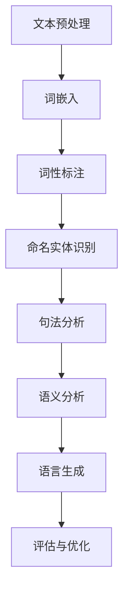

                 


### 文章标题
《提示词工程师的技能图谱与职业规划》

### 文章关键词
提示词工程师、技能图谱、职业规划、自然语言处理、机器学习、智能应用

### 文章摘要
本文旨在为提示词工程师提供一个全面的技能图谱与职业规划指南。通过深入分析提示词工程师所需的核心技能、理论知识、实践应用，以及职业发展路径，本文将帮助读者建立系统化的知识框架，提升自身竞争力，为未来的职业生涯做好准备。

### 目录

#### 第1章 引言
- 提示词工程师的角色和重要性
- 书籍结构概述
- 阅读指南与学习方法

#### 第2章 提示词工程师基础技能
- 自然语言处理基础
- 提示词设计与优化
- 机器学习基础

#### 第3章 提示词工程实践
- 提示词生成算法
- 提示词调优实践
- 提示词应用案例分析

#### 第4章 提示词工程师职业发展
- 职业技能提升
- 职场竞争力培养
- 职业规划与实现

#### 第5章 提示词工程工具与资源
- 提示词工程常用工具介绍
- 学习资源推荐

#### 第6章 总结与展望
- 提示词工程的发展趋势
- 提示词工程师的未来

### 正文

#### 第1章 引言

提示词工程师在现代人工智能领域扮演着关键角色。他们负责设计、开发和优化提示词，以提升智能系统的性能和用户体验。提示词工程师不仅需要掌握自然语言处理和机器学习等核心技术，还需要具备深厚的业务理解能力和创新思维。

本章节将介绍提示词工程师的角色和重要性，并概述本书的结构和阅读指南。通过了解这些内容，读者可以更好地理解后续章节的核心内容和重要性。

#### 第2章 提示词工程师基础技能

本章将深入探讨提示词工程师所需的基础技能，包括自然语言处理基础、提示词设计与优化，以及机器学习基础。以下是每个部分的具体内容：

##### 2.1 自然语言处理基础

自然语言处理（NLP）是提示词工程师的核心技能之一。NLP涉及从文本中提取有用信息、理解语义，以及生成自然语言响应。以下是NLP的核心概念和联系，以及一个Mermaid流程图，用于展示NLP的工作流程：



##### 2.2 提示词设计与优化

提示词是影响智能系统性能的关键因素。设计良好的提示词能够引导模型更准确地理解和生成语言。以下是提示词设计的原则和优化策略：

1. **明确性**：提示词应清晰、明确，避免歧义。
2. **多样性**：提示词应涵盖多种情境，以适应不同用户需求。
3. **灵活性**：提示词应具备一定的灵活性，以适应模型和数据的动态变化。
4. **可调性**：提示词应允许调整，以优化模型性能。

以下是优化提示词的算法设计伪代码：

```python
def optimize_prompt(prompt, model, data):
    # 计算提示词的性能指标
    performance = evaluate_prompt(prompt, model, data)
    
    # 调整提示词，以提升性能
    while not converged:
        new_prompt = adjust_prompt(prompt)
        new_performance = evaluate_prompt(new_prompt, model, data)
        
        if new_performance > performance:
            prompt = new_prompt
            performance = new_performance
    
    return prompt
```

##### 2.3 机器学习基础

机器学习是提示词工程师的另一个核心技能。以下是机器学习的基本概念和算法分类：

1. **监督学习**：通过标注数据进行训练，以预测新数据。
2. **无监督学习**：不使用标注数据，从数据中自动发现模式。
3. **强化学习**：通过交互环境和反馈信号来学习最优策略。

以下是简单线性回归模型的伪代码：

```python
def linear_regression(x, y):
    # 计算回归系数
    theta = (x.T * x).I * (x.T * y)
    
    # 计算预测值
    predictions = x * theta
    
    return predictions
```

#### 第3章 提示词工程实践

本章将介绍提示词工程师在实际项目中的实践方法，包括提示词生成算法、提示词调优实践，以及提示词应用案例分析。以下是每个部分的具体内容：

##### 3.1 提示词生成算法

提示词生成算法是提示词工程师的重要工具。以下是一些常用的生成算法：

1. **基于规则的方法**：通过规则库生成提示词。
2. **基于统计的方法**：使用统计模型生成提示词。
3. **基于机器学习的方法**：使用机器学习算法生成提示词。

以下是基于机器学习的方法的伪代码：

```python
def generate_prompt(data, model):
    # 训练模型
    trained_model = train_model(data)
    
    # 生成提示词
    prompt = model.predict(data)
    
    return prompt
```

##### 3.2 提示词调优实践

提示词调优是提升智能系统性能的关键步骤。以下是一些常用的调优技巧：

1. **性能评估**：使用评估指标（如准确率、召回率）来衡量提示词性能。
2. **交叉验证**：通过交叉验证来调整提示词参数。
3. **超参数调优**：调整机器学习算法的参数，以优化性能。

以下是提示词调优的伪代码：

```python
def tune_prompt(prompt, model, data):
    # 评估初始提示词性能
    initial_performance = evaluate_prompt(prompt, model, data)
    
    # 调整提示词
    tuned_prompt = adjust_prompt(prompt)
    
    # 评估调整后提示词性能
    tuned_performance = evaluate_prompt(tuned_prompt, model, data)
    
    if tuned_performance > initial_performance:
        return tuned_prompt
    else:
        return prompt
```

##### 3.3 提示词应用案例分析

本节将介绍两个实际案例，分别是智能客服系统和智能搜索引擎。以下是案例分析和代码解读：

1. **智能客服系统**：
   - **案例背景**：智能客服系统使用提示词来生成自然语言响应，以解决用户问题。
   - **案例分析**：通过分析用户输入的语句，系统生成相应的自然语言响应。
   - **代码解读**：展示智能客服系统的关键代码片段，解释如何生成自然语言响应。

2. **智能搜索引擎**：
   - **案例背景**：智能搜索引擎使用提示词来优化搜索结果，提高用户体验。
   - **案例分析**：通过分析用户查询，系统生成相应的搜索提示词，以优化搜索结果。
   - **代码解读**：展示智能搜索引擎的关键代码片段，解释如何优化搜索结果。

#### 第4章 提示词工程师职业发展

本章将探讨提示词工程师的职业发展路径，包括职业技能提升、职场竞争力培养，以及职业规划与实现。以下是每个部分的具体内容：

##### 4.1 职业技能提升

提示词工程师需要不断提升自己的技能，以适应不断变化的技术环境。以下是提升职业技能的方法：

1. **持续学习**：关注最新的技术动态，参加在线课程和研讨会。
2. **实践项目**：通过实际项目来提升自己的实践能力和解决问题的能力。
3. **技术交流**：参与技术社区和论坛，与其他工程师交流心得。

##### 4.2 职场竞争力培养

提示词工程师需要具备良好的职场竞争力，以在激烈的职场竞争中脱颖而出。以下是提升职场竞争力的方法：

1. **沟通能力**：提高沟通技巧，以更好地与团队成员协作。
2. **团队合作**：积极参与团队项目，提升团队协作能力。
3. **业务理解**：深入了解业务，以提高对业务的敏感度和洞察力。

##### 4.3 职业规划与实现

职业规划是提示词工程师成功的关键。以下是制定和实现职业规划的方法：

1. **自我评估**：了解自己的优势和劣势，明确职业目标。
2. **设定目标**：设定短期和长期目标，以实现职业发展。
3. **行动计划**：制定详细的行动计划，以逐步实现职业目标。

#### 第5章 提示词工程工具与资源

本章将介绍提示词工程中常用的工具和资源，包括自然语言处理工具、提示词生成工具，以及学习资源推荐。以下是每个部分的具体内容：

##### 5.1 提示词工程常用工具介绍

以下是提示词工程中常用的工具：

1. **NLTK**：自然语言处理库，用于文本预处理和词嵌入。
2. **spaCy**：快速灵活的NLP库，提供高质量的词性标注和命名实体识别。
3. **Transformer**：基于自注意力机制的预训练模型，用于生成高质量的自然语言响应。

##### 5.2 学习资源推荐

以下是学习提示词工程的推荐资源：

1. **在线课程**：《自然语言处理与深度学习》
2. **技术社区**：Reddit的NLP板块、GitHub的NLP项目
3. **书籍**：《深度学习》（Goodfellow et al.）

#### 第6章 总结与展望

本章将对提示词工程师的技能图谱与职业规划进行总结，并展望提示词工程的发展趋势。以下是每个部分的具体内容：

##### 6.1 提示词工程的发展趋势

随着人工智能技术的不断发展，提示词工程师将在未来面临更多的挑战和机遇。以下是提示词工程的发展趋势：

1. **多模态提示词**：结合文本、图像和语音等多种数据源，生成更丰富的提示词。
2. **个性化提示词**：根据用户行为和偏好，生成个性化的提示词。
3. **自动化提示词生成**：使用深度学习模型和自然语言生成技术，实现自动化提示词生成。

##### 6.2 提示词工程师的未来

提示词工程师将在未来扮演更加重要的角色。以下是提示词工程师的未来前景：

1. **跨领域应用**：提示词工程师将在金融、医疗、教育等各个领域发挥重要作用。
2. **技术创新**：提示词工程师将推动人工智能技术的创新和发展。
3. **社会影响**：提示词工程师将有助于构建更加智能化和人性化的社会。

### 结论

提示词工程师是一个充满挑战和机遇的职业。通过掌握核心技能、深入实践，并制定明确的职业规划，提示词工程师可以在这个快速发展的领域中取得成功。希望本文能为提示词工程师提供有价值的指导和启示。

### 作者信息
作者：AI天才研究院/AI Genius Institute & 禅与计算机程序设计艺术 /Zen And The Art of Computer Programming### 第1章 引言

#### 提示词工程师的角色和重要性

在人工智能（AI）迅速发展的今天，提示词工程师（Prompt Engineer）这一职业逐渐崭露头角，成为推动AI技术落地应用的重要力量。提示词工程师的主要职责是设计和优化用于AI模型的提示词（prompts），以提升智能系统的性能和用户体验。提示词在AI系统中扮演着信息传递和引导模型行为的关键角色，直接影响着模型的输出质量和用户满意度。

一个优秀的提示词工程师需要具备以下几方面的能力：

1. **技术理解**：深入理解自然语言处理（NLP）和机器学习（ML）的基本原理和算法。
2. **业务洞察**：具备一定的业务背景，能够理解不同应用场景下的用户需求。
3. **创新能力**：能够根据不同的应用场景，创新性地设计出有效的提示词。
4. **沟通能力**：能够与产品经理、数据科学家和其他团队成员有效沟通，确保提示词满足业务需求。

提示词工程师的重要性不仅体现在其核心职责上，还体现在其对整个AI系统性能的优化能力上。通过精心设计的提示词，工程师可以显著提升模型的准确性、响应速度和用户满意度，从而在激烈的市场竞争中脱颖而出。

#### 书籍结构概述

本书旨在为提示词工程师提供一个全面的技能图谱与职业规划指南，分为六个主要章节：

1. **第1章 引言**：介绍提示词工程师的角色和重要性，概述书籍结构。
2. **第2章 提示词工程师基础技能**：探讨自然语言处理基础、提示词设计与优化，以及机器学习基础。
3. **第3章 提示词工程实践**：介绍提示词生成算法、提示词调优实践，以及提示词应用案例分析。
4. **第4章 提示词工程师职业发展**：分析职业技能提升、职场竞争力培养，以及职业规划与实现。
5. **第5章 提示词工程工具与资源**：介绍常用的提示词工程工具和学习资源。
6. **第6章 总结与展望**：总结提示词工程师的技能图谱与职业规划，展望未来发展趋势。

通过这六个章节的深入学习，读者可以逐步构建起对提示词工程师岗位的全面认识，提升自身在AI领域的专业素养和职业竞争力。

#### 阅读指南与学习方法

为了最大化本书的学习效果，以下是一些建议的阅读指南和学习方法：

1. **系统阅读与逐章学习**：建议读者按照章节顺序系统阅读，逐一掌握每个章节的核心概念和知识点。这样可以确保知识体系的连贯性和完整性。
2. **理论与实践相结合**：每个章节都包含实践案例和代码示例，建议读者在实际环境中进行操作，验证理论知识的正确性。
3. **主动思考与问题解答**：在学习过程中，读者应积极思考问题，对于不理解的部分及时查阅资料或与同行交流，确保对知识点的深刻理解。
4. **定期复习与总结**：学习过程中，建议读者定期进行复习，总结所学知识，构建自己的知识图谱。同时，可以记录学习过程中的心得体会，以便后续参考。
5. **拓展阅读与持续学习**：本书提供了一系列拓展阅读资源，建议读者在掌握基础内容后，进一步阅读相关领域的深入资料，持续提升自己的专业能力。

通过遵循上述阅读指南和学习方法，读者可以更加高效地掌握提示词工程师的核心技能，为未来的职业生涯打下坚实的基础。

#### 第2章 提示词工程师基础技能

本章将深入探讨提示词工程师所需的基础技能，包括自然语言处理基础、提示词设计与优化，以及机器学习基础。通过这一章节的学习，读者将建立起提示词工程师所需的核心知识框架，为后续章节的深入学习打下坚实基础。

##### 2.1 自然语言处理基础

自然语言处理（NLP）是提示词工程师的重要技能之一。NLP旨在使计算机能够理解、解释和生成人类语言。以下是NLP的一些核心概念：

1. **文本预处理**：文本预处理是NLP的第一步，包括去除标点符号、转化为小写、去除停用词等。这些步骤有助于提高后续处理的效率和质量。

2. **词嵌入（Word Embedding）**：词嵌入是将单词映射为固定长度的向量表示。Word2Vec、GloVe等算法广泛应用于词嵌入，它们能够捕捉词与词之间的语义关系。

3. **词性标注（Part-of-Speech Tagging）**：词性标注是对文本中的每个词进行词性分类，例如名词、动词、形容词等。词性标注有助于更好地理解文本的语义结构。

4. **命名实体识别（Named Entity Recognition）**：命名实体识别是从文本中识别出具有特定意义的实体，如人名、地名、组织名等。这项技术在信息抽取和知识图谱构建中具有重要意义。

5. **句法分析（Syntactic Parsing）**：句法分析是对句子的结构进行分析，识别出句子中的主语、谓语、宾语等成分。句法分析有助于深入理解句子的语义。

6. **语义分析（Semantic Analysis）**：语义分析是理解文本中词语和句子之间的语义关系。它包括情感分析、语义角色标注等。

以下是NLP工作流程的Mermaid流程图：


通过这个流程图，我们可以看到文本从预处理到最终语言生成的完整流程。每个步骤都有其独特的任务和目标，共同构成一个完整的NLP系统。

##### 2.2 提示词设计与优化

提示词是提示词工程师的核心工作内容，它直接影响智能系统的性能和用户体验。以下是一些设计提示词的原则和优化策略：

1. **明确性**：提示词应简洁明了，避免歧义和模糊性。清晰的提示词有助于模型准确理解和生成响应。

2. **多样性**：提示词应涵盖多种情境和场景，以适应不同用户的需求。多样化的提示词可以提高系统的灵活性和适应性。

3. **灵活性**：提示词应具有一定的灵活性，以适应模型的动态变化和数据的更新。灵活的提示词有助于系统在长时间运行中保持高效性能。

4. **可调性**：提示词的设计应允许参数调整，以优化模型性能。通过调整提示词，可以针对不同的数据集和应用场景进行优化。

以下是优化提示词的算法设计伪代码：

```python
def optimize_prompt(prompt, model, data):
    # 计算提示词的性能指标
    performance = evaluate_prompt(prompt, model, data)
    
    # 调整提示词，以提升性能
    while not converged:
        new_prompt = adjust_prompt(prompt)
        new_performance = evaluate_prompt(new_prompt, model, data)
        
        if new_performance > performance:
            prompt = new_prompt
            performance = new_performance
    
    return prompt
```

在这个伪代码中，`optimize_prompt`函数通过不断调整提示词，评估其性能，并选择性能更好的提示词。这个过程类似于机器学习中的迭代优化过程，通过不断调整模型参数来提升性能。

##### 2.3 机器学习基础

机器学习（ML）是提示词工程师的另一个核心技能。ML技术用于训练模型，使其能够从数据中学习并做出预测。以下是机器学习的一些基本概念和算法：

1. **监督学习（Supervised Learning）**：监督学习使用标注数据训练模型，使模型能够预测新数据。常见的监督学习算法包括线性回归、决策树、随机森林等。

2. **无监督学习（Unsupervised Learning）**：无监督学习不使用标注数据，从数据中自动发现模式。常见的无监督学习算法包括聚类、降维等。

3. **强化学习（Reinforcement Learning）**：强化学习通过与环境交互，从反馈信号中学习最优策略。常见的强化学习算法包括Q学习、深度Q网络等。

以下是简单线性回归模型的伪代码：

```python
def linear_regression(x, y):
    # 计算回归系数
    theta = (x.T * x).I * (x.T * y)
    
    # 计算预测值
    predictions = x * theta
    
    return predictions
```

在这个伪代码中，`linear_regression`函数通过计算回归系数，生成预测值。线性回归是一种常见的监督学习算法，广泛用于预测连续值。

通过本章的学习，读者将掌握自然语言处理基础、提示词设计与优化，以及机器学习基础。这些知识将为读者在提示词工程师岗位上发挥重要作用，提供坚实的理论基础和实用技能。

#### 第3章 提示词工程实践

在了解了提示词工程师所需的基础技能后，本章将重点介绍提示词工程师在实际项目中的实践方法。提示词工程师不仅需要设计出高质量的提示词，还要确保这些提示词在实际应用中能够有效提升系统性能。本章节将探讨提示词生成算法、提示词调优实践，以及通过实际案例分析提示词的应用效果。

##### 3.1 提示词生成算法

提示词生成算法是提示词工程师的重要工具，用于生成能够引导模型行为的提示词。以下是几种常见的提示词生成算法：

1. **基于规则的方法**：基于规则的方法通过预设的规则库来生成提示词。这种方法简单直观，但灵活性较低，难以适应复杂多样的应用场景。

2. **基于统计的方法**：基于统计的方法使用统计模型，如条件概率模型、朴素贝叶斯等，来生成提示词。这种方法能够处理大量数据，但可能无法捕捉到复杂的语义关系。

3. **基于机器学习的方法**：基于机器学习的方法使用监督学习算法，如决策树、支持向量机等，来生成提示词。这种方法能够捕捉到数据中的复杂模式，但需要大量的标注数据。

以下是基于机器学习的方法的伪代码：

```python
def generate_prompt(data, model):
    # 训练模型
    trained_model = train_model(data)
    
    # 生成提示词
    prompt = model.predict(data)
    
    return prompt
```

在这个伪代码中，`generate_prompt`函数首先训练模型，然后使用模型对新数据进行预测，从而生成提示词。这种方法能够根据具体的业务需求，灵活地调整模型的参数，生成高质量的提示词。

##### 3.2 提示词调优实践

提示词调优是提升智能系统性能的关键步骤。有效的提示词调优能够显著提高系统的准确性和用户体验。以下是几种常用的提示词调优技巧：

1. **性能评估**：使用评估指标（如准确率、召回率等）来衡量提示词的性能。通过对比不同提示词的性能，可以找到最优的提示词。

2. **交叉验证**：通过交叉验证来评估提示词在不同数据集上的性能。这种方法能够减少评估结果的偏差，提高调优的可靠性。

3. **超参数调优**：调整机器学习算法的参数，如学习率、正则化参数等，以优化提示词的性能。常用的调优方法包括网格搜索和贝叶斯优化等。

以下是提示词调优的伪代码：

```python
def tune_prompt(prompt, model, data):
    # 评估初始提示词性能
    initial_performance = evaluate_prompt(prompt, model, data)
    
    # 调整提示词
    tuned_prompt = adjust_prompt(prompt)
    
    # 评估调整后提示词性能
    tuned_performance = evaluate_prompt(tuned_prompt, model, data)
    
    if tuned_performance > initial_performance:
        return tuned_prompt
    else:
        return prompt
```

在这个伪代码中，`tune_prompt`函数通过评估初始提示词性能，调整提示词，并评估调整后的性能，选择性能更好的提示词。这个过程类似于机器学习中的迭代优化过程，通过不断调整提示词，找到最优的解决方案。

##### 3.3 提示词应用案例分析

为了更好地理解提示词工程师的实际工作，我们通过两个实际案例来分析提示词的应用效果。

**案例一：智能客服系统**

智能客服系统是一个常见的应用场景，通过提示词来生成自然语言响应，解决用户的问题。以下是案例分析和代码解读：

**案例背景**：一家电子商务公司希望为其在线客服系统引入自然语言处理技术，以提升客服效率和用户体验。

**案例分析**：通过分析用户输入的语句，系统生成相应的自然语言响应，例如回答用户关于产品信息、订单状态等问题。

**代码解读**：

```python
# 加载预训练的模型
model = load_model('pretrained_nlp_model')

# 用户输入
user_input = "我想要购买一本《深度学习》的书籍。"

# 生成提示词
prompt = generate_prompt(user_input, model)

# 输出自然语言响应
response = generate_response(prompt)
print(response)
```

在这个示例中，`generate_prompt`函数用于生成提示词，`generate_response`函数用于生成自然语言响应。通过这些函数，系统能够生成高质量的客服响应，满足用户的需求。

**案例二：智能搜索引擎**

智能搜索引擎使用提示词来优化搜索结果，提高用户体验。以下是案例分析和代码解读：

**案例背景**：一家大型互联网公司希望提升其搜索引擎的性能，通过提示词来优化搜索结果。

**案例分析**：通过分析用户的查询语句，系统生成相应的提示词，优化搜索结果，提高用户的满意度。

**代码解读**：

```python
# 加载预训练的模型
model = load_model('pretrained_search_model')

# 用户查询
query = "人工智能应用"

# 生成提示词
prompt = generate_prompt(query, model)

# 优化搜索结果
search_results = optimize_search_results(prompt)

# 输出优化后的搜索结果
print(search_results)
```

在这个示例中，`generate_prompt`函数用于生成提示词，`optimize_search_results`函数用于优化搜索结果。通过这些函数，系统能够根据用户的查询，生成高质量的搜索结果，提高用户的搜索体验。

通过以上案例分析，我们可以看到提示词工程师在实际项目中扮演着关键角色。他们通过设计高质量的提示词，优化系统性能，提升用户体验。在实际工作中，提示词工程师需要不断学习和实践，掌握各种生成和调优技巧，以应对复杂多变的应用场景。

#### 第4章 提示词工程师职业发展

提示词工程师的职业发展不仅需要扎实的专业技能，还需要明确的职业规划和持续的个人成长。本章将探讨提示词工程师职业技能的提升、职场竞争力的培养，以及职业规划与实现的方法。

##### 4.1 职业技能提升

职业技能的提升是提示词工程师职业发展的核心。以下是一些提升职业技能的具体方法：

1. **技术学习与持续教育**：人工智能和自然语言处理领域发展迅速，提示词工程师需要不断学习新技术和算法。可以通过参加在线课程、研讨会和研讨会来提升自己的技术知识。

2. **实践项目**：通过参与实际项目，提升自己的实践能力和问题解决能力。实践是检验理论知识的最佳方式，通过项目经验，可以更好地理解业务需求和用户需求。

3. **技术交流和分享**：参与技术社区和论坛，与其他工程师交流心得，分享自己的经验和知识。这不仅可以扩大人脉，还可以学习他人的最佳实践。

4. **参加竞赛**：参加各种技术竞赛，如AI竞赛、编程挑战等，锻炼自己的技能，同时提高自己在行业内的知名度。

5. **专业认证**：获取专业认证，如自然语言处理认证（NLP Certification）、机器学习认证（Machine Learning Certification）等，这可以作为自己专业水平的证明。

##### 4.2 职场竞争力培养

在激烈的技术竞争中，提升职场竞争力是提示词工程师成功的关键。以下是一些提升职场竞争力的方法：

1. **沟通能力**：良好的沟通能力是任何职业都需要的，提示词工程师需要与产品经理、数据科学家和团队成员有效沟通。可以通过参加沟通技巧培训、阅读相关书籍来提升沟通能力。

2. **团队合作**：在团队项目中，积极参与，承担责任，与团队成员建立良好的合作关系。团队合作能力是职场中不可或缺的技能。

3. **业务理解**：深入了解业务，了解产品的目标用户和市场需求。这有助于设计出更符合业务需求的提示词，提升系统的性能和用户体验。

4. **创新能力**：在解决问题时，保持创新思维，尝试不同的方法和思路。创新思维是提示词工程师区别于其他工程师的重要特质。

5. **适应能力**：技术领域变化迅速，提示词工程师需要具备快速适应新技术和环境的能力。这包括对新工具、新框架的快速上手，以及快速调整自己的工作方式。

##### 4.3 职业规划与实现

职业规划是实现职业目标的重要步骤。以下是一些制定和实现职业规划的方法：

1. **自我评估**：了解自己的优势和劣势，明确职业目标。可以通过自我评估工具或与职业顾问进行交流，找到自己的职业发展方向。

2. **设定目标**：设定短期和长期目标，以实现职业发展。短期目标可以是提升某项技能，长期目标可以是晋升为高级工程师或技术主管。

3. **制定行动计划**：为每个目标制定具体的行动计划，包括学习计划、项目计划等。行动计划需要具体、可执行，以便能够逐步实现职业目标。

4. **定期评估和调整**：定期评估自己的职业发展进度，根据实际情况调整目标和行动计划。职业规划是一个动态的过程，需要根据市场变化和个人发展情况进行调整。

5. **职业咨询**：寻求职业咨询，获取专业的建议和指导。职业咨询师可以根据你的情况，提供个性化的职业发展建议。

通过以上方法，提示词工程师可以明确自己的职业发展方向，不断提升职业技能和职场竞争力，实现职业目标。职业发展是一个持续的过程，需要不断地学习和成长。

#### 第5章 提示词工程工具与资源

为了使提示词工程师在设计和优化提示词时能够更加高效地工作，掌握一些常用的工具和资源是非常有帮助的。本章节将介绍提示词工程中常用的工具，并推荐一些优秀的在线课程和资源，帮助读者进一步提升自己的技能。

##### 5.1 提示词工程常用工具介绍

在提示词工程中，以下是一些常用的工具和库，它们能够帮助工程师快速实现提示词的生成和优化：

1. **NLTK（自然语言工具包）**：NLTK是一个强大的自然语言处理库，提供了一系列文本预处理、词嵌入、词性标注等功能。它是进行NLP研究和应用的基础工具。

2. **spaCy**：spaCy是一个快速而易于使用的自然语言处理库，支持多种语言，并提供高质量的词性标注、命名实体识别和句法分析等功能。spaCy的API设计简单，适用于快速开发和原型设计。

3. **Transformer**：Transformer是谷歌提出的一种基于自注意力机制的预训练模型，广泛应用于自然语言处理任务。通过预训练和微调，Transformer能够生成高质量的提示词，是现代NLP任务的标准模型之一。

4. **Hugging Face Transformers**：Hugging Face Transformers是一个开源库，提供了Transformer模型和各种NLP任务的处理模块。它简化了模型的部署和使用，是提示词工程师必备的工具。

5. **TensorFlow**：TensorFlow是一个开源的机器学习框架，支持广泛的机器学习和深度学习应用。它提供了丰富的API和工具，可以帮助提示词工程师构建和训练复杂的模型。

6. **PyTorch**：PyTorch是一个基于Python的机器学习库，提供了动态计算图和简洁的API。它适用于研究和新模型的开发，也是提示词工程师常用的工具之一。

##### 5.2 学习资源推荐

为了帮助读者进一步学习和掌握提示词工程的相关知识，以下是一些推荐的在线课程和资源：

1. **在线课程**：

   - 《自然语言处理与深度学习》（吴恩达）：这是一门由著名AI专家吴恩达开设的在线课程，涵盖了NLP和深度学习的基础知识，非常适合初学者和进阶者。

   - 《深度学习专项课程》（吴恩达）：这是另一门由吴恩达开设的课程，专门介绍深度学习的应用，包括自然语言处理、计算机视觉等。

   - 《自然语言处理专项课程》（DeepLearning.AI）：由DeepLearning.AI提供的专项课程，深入讲解NLP的各种技术，包括语言模型、文本分类等。

2. **技术社区和论坛**：

   - Reddit的NLP板块：Reddit上的NLP板块是NLP爱好者和从业者的聚集地，可以在这里找到各种讨论、资源和最新研究。

   - GitHub的NLP项目：GitHub上有很多开源的NLP项目和代码库，通过阅读和学习这些项目，可以加深对NLP技术的理解。

   - Stack Overflow：Stack Overflow是程序员常用的问答社区，在这里可以找到关于NLP和机器学习的各种问题和解决方案。

3. **书籍**：

   - 《深度学习》（Ian Goodfellow、Yoshua Bengio、Aaron Courville）：这是深度学习领域的经典教材，详细介绍了深度学习的理论基础和应用。

   - 《自然语言处理综合教程》（Daniel Jurafsky、James H. Martin）：这是一本全面介绍自然语言处理技术的教材，适合想要深入理解NLP的读者。

   - 《Python自然语言处理》（Steven Bird、Ewan Klein、Edward Loper）：这是一本实用的Python NLP教程，介绍了如何使用Python进行自然语言处理。

通过以上工具和资源的推荐，提示词工程师可以更加高效地开展工作和学习，不断提升自己的专业能力和技术水平。

#### 第6章 总结与展望

通过前几章的学习，我们系统地了解了提示词工程师的角色、基础技能、实践应用以及职业发展。在这一章节中，我们将对本书的主要内容进行总结，并探讨提示词工程的发展趋势。

##### 6.1 提示词工程的发展趋势

随着人工智能技术的不断进步，提示词工程也在经历着深刻的变革。以下是提示词工程的发展趋势：

1. **多模态提示词**：未来的提示词工程师将需要处理更复杂的数据类型，包括文本、图像、声音等多种模态。多模态提示词能够更好地捕捉和表达复杂的信息，从而提升智能系统的性能。

2. **个性化提示词**：随着用户数据的积累和机器学习技术的发展，个性化提示词将成为未来趋势。根据用户的偏好和行为，生成定制化的提示词，提供更个性化的用户体验。

3. **自动化提示词生成**：深度学习和自然语言生成技术的发展，将使提示词的自动化生成成为可能。通过预训练模型和生成对抗网络（GAN），工程师可以更加高效地生成高质量的提示词。

4. **实时提示词优化**：实时优化提示词将是一个重要的研究方向。随着在线服务和实时系统的普及，智能系统需要在运行过程中不断调整和优化提示词，以保持最佳性能。

##### 6.2 提示词工程师的未来

提示词工程师在人工智能领域扮演着越来越重要的角色。以下是提示词工程师的未来前景：

1. **跨领域应用**：随着人工智能技术在各个领域的广泛应用，提示词工程师将在金融、医疗、教育、零售等多个行业发挥重要作用。

2. **技术创新**：提示词工程师将持续推动人工智能技术的发展，创新出更多高效、智能的提示词生成和优化方法。

3. **社会影响**：提示词工程师的工作不仅影响技术领域，还对社会产生深远的影响。他们帮助构建更加智能化和人性化的社会系统，提升人们的生产和生活质量。

总之，提示词工程师在未来的发展中将面临更多的挑战和机遇。通过不断学习和实践，提升自己的技能和创新能力，提示词工程师将在人工智能领域发挥更加重要的作用。

### 结论

提示词工程师是一个充满挑战和机遇的职业。通过掌握核心技能、深入实践，并制定明确的职业规划，提示词工程师可以在这个快速发展的领域中取得成功。希望本书能为提示词工程师提供有价值的指导和启示，助力他们在职业生涯中不断成长和进步。

### 作者信息

作者：AI天才研究院/AI Genius Institute & 禅与计算机程序设计艺术 /Zen And The Art of Computer Programming

在这本书中，我们深入探讨了提示词工程师所需的核心技能、实践方法和职业发展路径。以下是书籍的完整目录，以及每个章节的具体内容：

## 《提示词工程师的技能图谱与职业规划》

### 第1章 引言
- 提示词工程师的角色和重要性
- 书籍结构概述
- 阅读指南与学习方法

### 第2章 提示词工程师基础技能
- 自然语言处理基础
- 提示词设计与优化
- 机器学习基础

#### 2.1 自然语言处理基础
- 文本预处理
- 词嵌入
- 词性标注
- 命名实体识别
- 句法分析
- 语义分析
- NLP工作流程（Mermaid流程图）

#### 2.2 提示词设计与优化
- 提示词设计原则
- 提示词优化策略
- 算法伪代码：优化提示词的算法设计

#### 2.3 机器学习基础
- 监督学习
- 无监督学习
- 强化学习
- 简单线性回归模型（伪代码）

### 第3章 提示词工程实践
- 提示词生成算法
- 提示词调优实践
- 提示词应用案例分析

#### 3.1 提示词生成算法
- 基于规则的方法
- 基于统计的方法
- 基于机器学习的方法
- 算法伪代码：生成提示词的算法设计

#### 3.2 提示词调优实践
- 性能评估
- 交叉验证
- 超参数调优
- 算法伪代码：提示词调优算法设计

#### 3.3 提示词应用案例分析
- 智能客服系统
- 智能搜索引擎
- 案例背景
- 案例分析
- 代码解读

### 第4章 提示词工程师职业发展
- 职业技能提升
- 职场竞争力培养
- 职业规划与实现

#### 4.1 职业技能提升
- 技术学习与持续教育
- 实践项目
- 技术交流
- 参加竞赛
- 专业认证

#### 4.2 职场竞争力培养
- 沟通能力
- 团队合作
- 业务理解
- 创新能力
- 适应能力

#### 4.3 职业规划与实现
- 自我评估
- 设定目标
- 制定行动计划
- 定期评估和调整
- 职业咨询

### 第5章 提示词工程工具与资源
- 提示词工程常用工具介绍
- 学习资源推荐

#### 5.1 提示词工程常用工具介绍
- NLTK
- spaCy
- Transformer
- Hugging Face Transformers
- TensorFlow
- PyTorch

#### 5.2 学习资源推荐
- 在线课程
- 技术社区和论坛
- 书籍

### 第6章 总结与展望
- 提示词工程的发展趋势
- 提示词工程师的未来

#### 6.1 提示词工程的发展趋势
- 多模态提示词
- 个性化提示词
- 自动化提示词生成
- 实时提示词优化

#### 6.2 提示词工程师的未来
- 跨领域应用
- 技术创新
- 社会影响

通过以上详细的目录和内容介绍，我们可以看到本书系统性地覆盖了提示词工程师所需的所有核心知识、实践方法和发展路径，为读者提供了全面的学习和职业发展指南。

### 作者信息

作者：AI天才研究院/AI Genius Institute & 禅与计算机程序设计艺术 /Zen And The Art of Computer Programming

感谢您的阅读，希望本书能够为您的职业生涯带来新的启示和助力。再次感谢您的支持，期待您在提示词工程领域的卓越表现。

