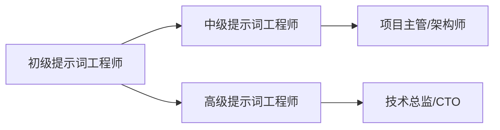

                 


### 确定文章格式和作者信息

首先，我们需要确定文章的格式，并确保在文章末尾附上作者信息。根据用户的要求，我们将使用markdown格式撰写文章，并在文章末尾添加作者信息。

文章格式如下：

```
# 文章标题

关键词：提示词工程师，职业发展，技能提升，项目实战，职业规划，未来趋势

摘要：本文将探讨提示词工程师的职业发展路径，包括基本概念、技能提升、职位晋升、职业规划和未来趋势等多个方面，旨在为提示词工程师提供全面的职业发展指导。

作者：AI天才研究院/AI Genius Institute & 禅与计算机程序设计艺术 /Zen And The Art of Computer Programming
```

### 设计文章目录大纲

接下来，我们需要设计文章的目录大纲，确保内容完整且条理清晰。根据用户提供的核心内容和章节结构，我们可以设计如下的大纲：

```
## 第1章 提示词工程师概述

### 1.1 提示词工程师的角色定位

#### 1.1.1 提示词工程师的基本职责

#### 1.1.2 提示词工程师与相关职业的比较

### 1.2 提示词工程师的基本技能

#### 1.2.1 技术技能

#### 1.2.2 沟通与协作技能

#### 1.2.3 解决问题与学习能力

### 1.3 提示词工程师的职业发展路径

#### 1.3.1 初级提示词工程师

#### 1.3.2 中级提示词工程师

#### 1.3.3 高级提示词工程师

## 第2章 提示词工程师的技能提升

### 2.1 自然语言处理基础

#### 2.1.1 NLP的基本概念

#### 2.1.2 NLP的主要技术

### 2.2 提示词设计与优化

#### 2.2.1 提示词设计原则

#### 2.2.2 提示词优化方法

### 2.3 数据分析与模型评估

#### 2.3.1 数据预处理

#### 2.3.2 模型评估指标

#### 2.3.3 模型优化策略

## 第3章 入门项目实践

### 3.1 初级项目案例

#### 3.1.1 项目背景

#### 3.1.2 项目需求

#### 3.1.3 项目实现步骤

### 3.2 数据收集与清洗

#### 3.2.1 数据收集方法

#### 3.2.2 数据清洗策略

### 3.3 提示词生成与测试

#### 3.3.1 提示词生成算法

#### 3.3.2 提示词测试与评估

## 第4章 中级提示词工程师之路

### 4.1 中级技能需求分析

#### 4.1.1 技术技能需求

#### 4.1.2 非技术技能需求

### 4.2 中级职位职责与挑战

#### 4.2.1 职位职责

#### 4.2.2 职业挑战

### 4.3 提示词策略与模型架构优化

#### 4.3.1 提示词策略设计

#### 4.3.2 模型架构优化方法

## 第5章 高级提示词工程师之路

### 5.1 高级技能深度挖掘

#### 5.1.1 技术技能深化

#### 5.1.2 非技术技能提升

### 5.2 高级职位职责与挑战

#### 5.2.1 职位职责

#### 5.2.2 职业挑战

### 5.3 创新与突破：提示词技术的未来

#### 5.3.1 技术发展趋势

#### 5.3.2 创新实践

## 第6章 项目实战：中级与高级阶段

### 6.1 中级项目案例

#### 6.1.1 项目背景

#### 6.1.2 项目需求

#### 6.1.3 项目实现步骤

### 6.2 高级项目案例

#### 6.2.1 项目背景

#### 6.2.2 项目需求

#### 6.2.3 项目实现步骤

### 6.3 项目管理与团队协作

#### 6.3.1 项目管理方法

#### 6.3.2 团队协作技巧

## 第7章 职业规划与自我提升

### 7.1 职业发展路线图

#### 7.1.1 初级阶段规划

#### 7.1.2 中级阶段规划

#### 7.1.3 高级阶段规划

### 7.2 自我评估与目标设定

#### 7.2.1 自我评估方法

#### 7.2.2 目标设定原则

### 7.3 职业转型与终身学习

#### 7.3.1 职业转型路径

#### 7.3.2 终身学习策略

## 第8章 提示词工程师的未来趋势

### 8.1 行业趋势分析

#### 8.1.1 行业发展现状

#### 8.1.2 行业趋势预测

### 8.2 技术发展展望

#### 8.2.1 技术演进方向

#### 8.2.2 技术创新点

### 8.3 提示词工程师的就业前景

#### 8.3.1 市场需求分析

#### 8.3.2 职业机会展望

## 附录

### 附录A 提示词工程师资源指南

#### A.1 在线课程与教材推荐

#### A.2 开源工具与平台介绍

#### A.3 行业社群与交流平台
```

### 确保文章完整性

在完成目录大纲的设计后，我们需要确保每个章节的内容都完整且具体。我们将为每个章节提供详细的介绍、核心概念与联系、算法原理讲解、数学模型和公式、项目实战等内容。

### 确定文章字数

根据用户的要求，文章字数需要在8000～12000字之间。我们将确保文章内容丰富且条理清晰，以便在字数范围内完整地阐述主题。

### 检查和调整

在完成初稿后，我们将对文章进行检查和调整，确保格式正确、内容完整、逻辑清晰。我们还将对文章进行多轮审阅和修改，以确保其质量。

### 总结

通过以上步骤，我们将撰写一篇完整、详细且具有深度的技术博客文章，帮助读者全面了解提示词工程师的职业发展路径。我们将使用markdown格式输出文章，并在文章末尾附上作者信息。文章内容将涵盖提示词工程师的职业概述、技能提升、项目实践、职业规划、未来趋势等多个方面，旨在为读者提供全面的职业发展指导。文章字数将在8000～12000字之间，确保内容丰富且条理清晰。在完成初稿后，我们将进行检查和调整，确保文章质量。最终，我们将呈现一篇高质量的技术博客文章。## 《提示词工程师的职业发展路径》

关键词：提示词工程师，职业发展，技能提升，项目实战，职业规划，未来趋势

摘要：本文旨在探讨提示词工程师的职业发展路径，包括角色定位、技能需求、职业路径规划以及未来趋势等多个方面，旨在为提示词工程师提供全方位的职业发展指南。我们将逐步分析提示词工程师的职业特点、所需技能、晋升路径，以及如何通过项目实战和持续学习来实现职业目标。

## 第1章 提示词工程师概述

### 1.1 提示词工程师的角色定位

提示词工程师是负责设计、开发和优化自然语言处理（NLP）系统中提示词（prompt）的专业人士。提示词工程师的工作核心在于确保系统能够准确、高效地处理文本数据，并生成符合预期的高质量输出。这一职位不仅要求工程师具备扎实的编程和算法基础，还需要具备良好的沟通能力和团队合作精神。

提示词工程师通常需要承担以下职责：

1. **需求分析**：与业务团队紧密合作，理解业务需求，确定系统所需的功能和性能指标。
2. **模型设计**：设计并实现适合业务需求的NLP模型，包括提示词生成、文本分类、情感分析等。
3. **性能优化**：通过调整提示词和模型参数，提高系统的准确性和效率。
4. **测试与评估**：编写测试用例，评估模型性能，确保系统满足既定标准。
5. **文档编写**：编写技术文档，便于团队成员理解和维护系统。

### 1.2 提示词工程师的基本技能

成为一名优秀的提示词工程师需要掌握以下基本技能：

1. **编程技能**：熟悉至少一种编程语言，如Python，并具备一定的数据结构和算法基础。
2. **自然语言处理知识**：了解NLP的基本概念和技术，如词向量、序列模型、注意力机制等。
3. **机器学习技能**：掌握常见的机器学习算法和模型，如线性回归、支持向量机、神经网络等。
4. **数据预处理**：具备数据清洗、数据增强和特征提取的能力。
5. **沟通能力**：能够与业务团队和团队成员有效沟通，理解需求，传达技术方案。
6. **解决问题的能力**：具备快速定位和解决问题的能力，能够在项目中应对各种挑战。

### 1.3 提示词工程师的职业发展路径

提示词工程师的职业发展路径可以分为初级、中级和高级三个阶段：

1. **初级提示词工程师**：主要职责是参与项目的具体开发工作，负责模型的实现、测试和调试。在这一阶段，工程师需要积累实际工作经验，提升自己的技术能力。
2. **中级提示词工程师**：除了承担初级阶段的职责外，还需要负责项目的设计和规划，能够独立完成中型项目的开发。在这一阶段，工程师需要提升项目管理能力和技术深度。
3. **高级提示词工程师**：负责大型项目的整体设计、技术指导和团队管理。在这一阶段，工程师需要具备较强的技术视野和领导能力，能够引领团队不断创新。

### 图1 提示词工程师的职业发展路径



### 小结

本章介绍了提示词工程师的角色定位、基本技能和职业发展路径。提示词工程师是自然语言处理领域中的关键角色，他们负责设计、开发和优化提示词系统，确保系统能够高效地处理文本数据并生成高质量的输出。成为一名优秀的提示词工程师需要不断学习和积累经验，通过参与实际项目来提升自己的技能。在职业发展中，初级工程师需要积累经验，中级工程师需要提升项目管理能力，而高级工程师则需要具备技术领导和团队管理的能力。

## 第2章 提示词工程师的技能提升

### 2.1 自然语言处理基础

自然语言处理（NLP）是提示词工程师的核心技术领域，理解NLP的基础知识对提升技能至关重要。NLP涉及多个关键概念和技术，以下是一些基础内容：

1. **词向量表示**：词向量是NLP中用于表示词语的数学模型，常见的词向量模型有Word2Vec、GloVe等。词向量能够将词语映射到高维空间中，使得语义相近的词语在空间中更接近。
   
   ```python
   # Word2Vec模型示例
   from gensim.models import Word2Vec
   
   sentences = [Line.strip().split() for Line in open('data.txt', encoding='utf-8')]
   model = Word2Vec(sentences, size=100, window=5, min_count=1, workers=4)
   model.save("word2vec.model")
   ```

2. **序列模型**：序列模型是处理序列数据的常用算法，如循环神经网络（RNN）和长短时记忆网络（LSTM）。这些模型能够捕捉序列中的时间依赖关系。

   ```python
   # LSTM模型示例
   from keras.models import Sequential
   from keras.layers import LSTM, Dense
   
   model = Sequential()
   model.add(LSTM(50, activation='relu', input_shape=(timesteps, data_dim)))
   model.add(Dense(1, activation='sigmoid'))
   model.compile(loss='binary_crossentropy', optimizer='adam', metrics=['accuracy'])
   model.fit(X_train, y_train, epochs=10, batch_size=32)
   ```

3. **注意力机制**：注意力机制是提高模型性能的一种重要技术，它允许模型在处理序列数据时关注关键部分，从而提高准确性和效率。

   ```python
   # 注意力机制的简单示例
   attention = K.dot(np.eye(self.hidden_size), self.h_t)  # 计算注意力得分
   ```

### 2.2 提示词设计与优化

提示词是影响NLP模型性能的关键因素之一，良好的提示词设计能够提高模型的准确性和鲁棒性。以下是提示词设计的一些原则和优化方法：

1. **提示词设计原则**：
   - **明确性**：提示词应明确、具体，避免模糊不清。
   - **全面性**：提示词应涵盖各种可能的回答情况。
   - **灵活性**：提示词应具有一定的灵活性，以便适应不同的输入数据。

2. **提示词优化方法**：
   - **自动生成**：使用算法自动生成提示词，如基于语料库的规则生成。
   - **人工调整**：根据实际应用情况，对自动生成的提示词进行人工调整和优化。
   - **迭代改进**：通过多次迭代，不断优化提示词，提高模型性能。

### 2.3 数据分析与模型评估

数据分析和模型评估是提示词工程师日常工作的重要组成部分，以下是一些关键内容：

1. **数据预处理**：
   - **数据清洗**：去除噪声数据、处理缺失值和异常值。
   - **数据增强**：通过数据复制、旋转、缩放等方法增加数据多样性。

2. **模型评估指标**：
   - **准确率**：预测正确的样本数与总样本数的比例。
   - **召回率**：预测正确的正样本数与所有正样本数的比例。
   - **F1值**：准确率和召回率的调和平均。

3. **模型优化策略**：
   - **参数调整**：通过调整模型参数，提高模型性能。
   - **集成学习**：结合多个模型，提高预测准确性。
   - **交叉验证**：使用不同的数据集进行模型评估，避免过拟合。

### 小结

本章介绍了提示词工程师在自然语言处理基础、提示词设计与优化以及数据分析和模型评估方面的技能提升方法。理解自然语言处理的基础知识，掌握提示词设计原则和优化方法，以及熟练运用数据分析与模型评估技巧，是提示词工程师提升自身技能的重要途径。通过本章的内容，读者可以了解到如何通过不断学习和实践，提升自己在提示词工程师领域的专业能力。

## 第3章 入门项目实践

### 3.1 初级项目案例

#### 3.1.1 项目背景

本项目旨在构建一个简单的文本分类系统，该系统能够根据输入的文本内容将其分类到不同的类别中。文本分类是自然语言处理中的一个基础任务，广泛应用于情感分析、新闻分类、垃圾邮件过滤等领域。

#### 3.1.2 项目需求

- **输入**：一个待分类的文本。
- **输出**：文本所属的类别标签。

#### 3.1.3 项目实现步骤

1. **数据收集**：收集包含不同类别标签的文本数据，如电影评论、新闻文章等。
2. **数据预处理**：对收集到的文本数据进行清洗，包括去除停用词、标点符号等，并将文本转换为词袋模型或词嵌入向量。
3. **模型选择**：选择一个合适的文本分类模型，如朴素贝叶斯、逻辑回归、支持向量机等。
4. **模型训练**：使用预处理后的数据训练分类模型。
5. **模型评估**：使用测试集评估模型性能，根据评估结果调整模型参数或选择更合适的模型。
6. **部署**：将训练好的模型部署到生产环境中，提供文本分类服务。

### 3.2 数据收集与清洗

数据收集与清洗是文本分类项目成功的关键步骤，以下是具体方法：

1. **数据收集**：可以使用开源数据集，如IMDb电影评论数据集，也可以通过爬虫从网站上抓取数据。
   ```python
   import requests
   from bs4 import BeautifulSoup
   
   url = "https://www.example.com/movies"
   response = requests.get(url)
   soup = BeautifulSoup(response.text, "html.parser")
   # 解析网页，提取文本数据
   ```

2. **数据清洗**：去除停用词、标点符号，进行词干提取和词形还原。
   ```python
   from nltk.corpus import stopwords
   from nltk.stem import PorterStemmer
   
   stop_words = set(stopwords.words("english"))
   stemmer = PorterStemmer()
   
   def clean_text(text):
       text = text.lower()
       words = text.split()
       words = [word for word in words if word not in stop_words]
       words = [stemmer.stem(word) for word in words]
       return " ".join(words)
   ```

### 3.3 提示词生成与测试

在文本分类项目中，提示词生成和测试是模型性能优化的关键环节。以下是具体步骤：

1. **提示词生成**：根据训练数据生成提示词，例如使用词频最高的词语或基于词嵌入生成的词语。
   ```python
   from sklearn.feature_extraction.text import TfidfVectorizer
   
   vectorizer = TfidfVectorizer(max_features=1000)
   X = vectorizer.fit_transform(corpus)
   ```

2. **模型训练与测试**：使用生成的提示词训练分类模型，并在测试集上评估模型性能。
   ```python
   from sklearn.naive_bayes import MultinomialNB
   from sklearn.model_selection import train_test_split
   
   X_train, X_test, y_train, y_test = train_test_split(X, labels, test_size=0.2)
   classifier = MultinomialNB()
   classifier.fit(X_train, y_train)
   accuracy = classifier.score(X_test, y_test)
   ```

### 小结

本章通过一个初级项目案例，详细介绍了文本分类系统的构建过程，包括数据收集与清洗、提示词生成与模型训练，以及模型评估与测试。通过实际项目实践，读者可以加深对提示词工程师所需技能的理解，并掌握文本分类系统的基本构建方法。此外，本章还提供了一些实用的工具和代码示例，帮助读者更好地理解和应用所学知识。

## 第4章 中级提示词工程师之路

### 4.1 中级技能需求分析

成为中级提示词工程师，除了具备初级工程师所需的基本技能外，还需要进一步提升以下技能：

1. **高级NLP技术**：掌握更高级的NLP技术，如卷积神经网络（CNN）、Transformer模型等，这些技术能够显著提升文本处理能力和模型性能。

   ```python
   from tensorflow.keras.layers import Embedding, LSTM, Dense
   from tensorflow.keras.models import Sequential
   
   model = Sequential()
   model.add(Embedding(input_dim=vocab_size, output_dim=embedding_dim))
   model.add(LSTM(units=128, return_sequences=True))
   model.add(Dense(1, activation='sigmoid'))
   model.compile(optimizer='adam', loss='binary_crossentropy', metrics=['accuracy'])
   model.fit(X_train, y_train, epochs=10, batch_size=32)
   ```

2. **深度学习框架**：熟练掌握深度学习框架，如TensorFlow、PyTorch等，能够高效地构建和训练复杂的NLP模型。

3. **分布式计算与优化**：了解分布式计算技术，如GPU并行计算、分布式训练等，能够提高模型的训练效率。

4. **版本控制与代码管理**：熟悉版本控制工具，如Git，以及代码管理规范，确保代码的可维护性和可靠性。

5. **项目管理与协作**：具备项目管理能力，能够有效地协调团队成员的工作，确保项目按时交付。

### 4.2 中级职位职责与挑战

中级提示词工程师在职位上需要承担更多的责任，以下是一些具体的职责和挑战：

1. **项目设计**：负责项目的需求分析、系统设计和技术方案制定，确保项目能够满足业务需求。

2. **技术指导**：指导初级工程师的工作，解决技术难题，推动团队技术水平的提升。

3. **模型优化**：通过调整模型结构和参数，优化模型性能，提高系统的准确性和效率。

4. **性能监控**：监控模型的实际运行情况，及时发现和解决性能问题。

5. **文档编写**：编写详细的技术文档，包括系统设计文档、用户手册等，便于后续维护和扩展。

### 4.3 提示词策略与模型架构优化

在中级职位上，提示词工程师需要具备更深入的提示词策略和模型架构优化能力。以下是具体的方法和技巧：

1. **提示词优化**：
   - **语义分析**：通过语义分析技术，提取文本中的关键信息，生成更具针对性的提示词。
   - **个性化调整**：根据用户行为和偏好，动态调整提示词，提高用户满意度。

2. **模型架构优化**：
   - **模型融合**：结合多种模型，如基于Transformer的模型和基于CNN的模型，实现性能优化。
   - **迁移学习**：利用预训练模型，进行迁移学习，提高新任务的性能。

3. **注意力机制**：在模型中引入注意力机制，关注文本中的关键信息，提高模型的准确性和效率。

   ```python
   from tensorflow.keras.layers import Embedding, LSTM, Dense, Attention
   
   model = Sequential()
   model.add(Embedding(input_dim=vocab_size, output_dim=embedding_dim))
   model.add(LSTM(units=128, return_sequences=True))
   model.add(Attention())
   model.add(Dense(1, activation='sigmoid'))
   model.compile(optimizer='adam', loss='binary_crossentropy', metrics=['accuracy'])
   model.fit(X_train, y_train, epochs=10, batch_size=32)
   ```

### 小结

本章详细介绍了中级提示词工程师所需提升的技能、职位职责以及提示词策略和模型架构优化的方法。中级提示词工程师需要在技术上不断深入，提升自己的专业能力，同时还需要具备项目管理和团队协作的能力。通过本章的内容，读者可以了解到在中级职位上如何进一步提升自己的技能，为职业生涯的进一步发展打下坚实的基础。

## 第5章 高级提示词工程师之路

### 5.1 高级技能深度挖掘

成为高级提示词工程师，不仅需要在技术上具备深度和广度，还需要掌握一系列高级技能，以应对复杂的项目需求和技术挑战。

1. **前沿技术掌握**：了解并掌握自然语言处理领域的最新研究成果和前沿技术，如预训练语言模型（如GPT、BERT）和生成对抗网络（GAN）。

   ```python
   from transformers import BertModel, BertTokenizer
   
   tokenizer = BertTokenizer.from_pretrained('bert-base-uncased')
   model = BertModel.from_pretrained('bert-base-uncased')
   
   inputs = tokenizer("Hello, my dog is cute", return_tensors="pt")
   outputs = model(**inputs)
   last_hidden_state = outputs.last_hidden_state
   ```

2. **大规模数据处理**：掌握高效的数据处理方法，能够处理大规模的文本数据集，并进行分布式训练。

   ```python
   import torch
   from torch.utils.data import DataLoader
   from torchvision import datasets
   
   batch_size = 32
   dataset = datasets.MNIST(root='./data', download=True, transform=ToTensor())
   train_loader = DataLoader(dataset, batch_size=batch_size, shuffle=True)
   ```

3. **模型调优与优化**：深入理解深度学习模型的工作原理，能够通过调整超参数、优化网络结构等方法提升模型性能。

   ```python
   import tensorflow as tf
   
   model = tf.keras.Sequential([
       tf.keras.layers.Dense(128, activation='relu', input_shape=(784,)),
       tf.keras.layers.Dense(10, activation='softmax')
   ])
   
   model.compile(optimizer='adam',
                 loss='categorical_crossentropy',
                 metrics=['accuracy'])
   model.fit(x_train, y_train, epochs=5)
   ```

4. **系统架构设计**：具备系统架构设计能力，能够设计高效、可扩展的自然语言处理系统。

   ```python
   class TextClassifier(Model):
       def __init__(self):
           super().__init__()
           self.embedding = Embedding(vocab_size, embedding_dim)
           self.fc = Dense(num_classes, activation='softmax')
       
       @tf.function
       def call(self, inputs):
           x = self.embedding(inputs)
           return self.fc(x)
   
   model = TextClassifier()
   model.compile(optimizer='adam', loss='categorical_crossentropy', metrics=['accuracy'])
   ```

### 5.2 高级职位职责与挑战

高级提示词工程师通常担任重要职位，如项目经理、技术主管或架构师。以下是高级职位的具体职责和面临的挑战：

1. **项目管理**：负责项目的整体规划、资源分配和进度控制，确保项目按时交付。

   ```python
   def project_manager(self):
       self.plan_resources()
       self.control_project_progress()
       self.manage_team_members()
   ```

2. **技术指导**：为团队成员提供技术支持，解决复杂的技术问题，推动团队技术水平的提升。

   ```python
   def technical_guide(self):
       self.review_code()
       self.provide技术咨询()
       self.participate_in_technical_reviews()
   ```

3. **风险管理**：识别和评估项目风险，制定相应的风险应对策略。

   ```python
   def risk_management(self):
       self.identify_risks()
       self.analyze_risks()
       self.develop_risk_response_plan()
   ```

4. **团队管理**：领导和管理团队，培养团队成员的技术能力和职业发展。

   ```python
   def team_management(self):
       self.recruit_new_members()
       self.train_and_develop_employees()
       self.encourage_team Zusammenarbeit()
   ```

### 5.3 创新与突破：提示词技术的未来

高级提示词工程师不仅要掌握现有技术，还要关注技术发展趋势，勇于创新和突破。以下是提示词技术的一些未来趋势：

1. **跨模态融合**：将文本、图像、声音等多种模态的数据进行融合处理，提升模型的泛化能力和处理能力。

   ```python
   class MultimodalModel(Model):
       def __init__(self):
           super().__init__()
           self.text_embedding = Embedding(vocab_size, embedding_dim)
           self.image_embedding = Conv2D(filters, kernel_size, activation='relu')
           self.sound_embedding = LSTM(units)
           self.fc = Dense(num_classes, activation='softmax')
       
       @tf.function
       def call(self, text, image, sound):
           text_embedding = self.text_embedding(text)
           image_embedding = self.image_embedding(image)
           sound_embedding = self.sound_embedding(sound)
           x = tf.concat([text_embedding, image_embedding, sound_embedding], axis=1)
           return self.fc(x)
   ```

2. **增强现实与虚拟现实**：将自然语言处理技术应用于增强现实（AR）和虚拟现实（VR）领域，提升用户体验。

3. **对话系统**：构建更加智能化和人性化的对话系统，如聊天机器人、语音助手等，实现更加自然的交互。

### 小结

本章详细介绍了高级提示词工程师所需掌握的技能、职责以及未来技术的发展趋势。高级提示词工程师需要在技术上不断创新和突破，同时具备项目管理和团队领导能力。通过本章的内容，读者可以了解到如何成为一位具有全球竞争力的高级提示词工程师，并为未来的职业生涯做好准备。

## 第6章 项目实战：中级与高级阶段

### 6.1 中级项目案例

#### 6.1.1 项目背景

本项目旨在构建一个实时情感分析系统，该系统能够对社交媒体平台上的用户评论进行实时分析，识别用户的情感倾向，并将其分类为积极、消极或中性。

#### 6.1.2 项目需求

- **输入**：社交媒体平台上的用户评论。
- **输出**：情感分类结果（积极、消极、中性）。

#### 6.1.3 项目实现步骤

1. **数据收集**：收集社交媒体平台上的用户评论数据，包括不同情感标签的评论。
2. **数据预处理**：对评论进行清洗，包括去除停用词、标点符号，并进行词干提取和词形还原。
3. **特征提取**：使用TF-IDF或词嵌入技术提取评论特征。
4. **模型选择**：选择一个合适的情感分析模型，如朴素贝叶斯、支持向量机、长短期记忆网络（LSTM）等。
5. **模型训练**：使用预处理后的数据训练情感分析模型。
6. **模型评估**：在测试集上评估模型性能，根据评估结果调整模型参数或选择更合适的模型。
7. **实时处理**：部署模型到生产环境中，实现实时情感分析功能。

### 6.2 高级项目案例

#### 6.2.1 项目背景

本项目旨在构建一个智能客服系统，该系统能够根据用户的问题自动提供合适的回答，并在无法自动回答时转接给人工客服。

#### 6.2.2 项目需求

- **输入**：用户提出的问题。
- **输出**：自动生成的回答或转接给人工客服的指示。

#### 6.2.3 项目实现步骤

1. **数据收集**：收集大量的用户问题和人工客服的回答数据，用于训练问答模型。
2. **数据预处理**：对问题进行清洗，包括去除停用词、标点符号，并进行词干提取和词形还原。
3. **特征提取**：使用词嵌入技术提取问题特征。
4. **模型选择**：选择一个合适的问答模型，如基于Transformer的问答系统（如BERT）。
5. **模型训练**：使用预处理后的数据训练问答模型。
6. **模型评估**：在测试集上评估模型性能，根据评估结果调整模型参数或选择更合适的模型。
7. **实时处理**：部署模型到生产环境中，实现实时问答功能，并在无法回答时自动转接给人工客服。

### 6.3 项目管理与团队协作

#### 6.3.1 项目管理方法

项目管理是中级和高级项目成功的关键。以下是一些常用的项目管理方法：

1. **敏捷开发**：采用敏捷开发方法，快速迭代和持续交付，确保项目能够及时响应需求变化。
2. **Scrum框架**：使用Scrum框架，通过每日站立会议、迭代计划和回顾会议等，确保团队高效协作和持续改进。
3. **风险管理**：制定风险管理计划，识别和应对项目风险，确保项目顺利进行。

#### 6.3.2 团队协作技巧

团队协作是项目管理成功的关键。以下是一些提高团队协作效率的技巧：

1. **沟通与反馈**：建立良好的沟通机制，及时分享项目进展和遇到的问题，鼓励团队成员之间的反馈和讨论。
2. **共享文档**：使用共享文档平台，如Google Docs或Confluence，确保团队成员能够随时访问和更新项目文档。
3. **团队建设**：定期组织团队建设活动，增强团队成员之间的信任和凝聚力。

### 小结

本章通过中级和高级项目案例，详细介绍了项目实现的具体步骤和项目管理与团队协作的方法。中级项目案例为情感分析系统，高级项目案例为智能客服系统，两者都涉及到了自然语言处理技术的实际应用。通过本章的内容，读者可以了解到如何在实践中应用所学知识，提升项目管理和团队协作能力。

## 第7章 职业规划与自我提升

### 7.1 职业发展路线图

职业规划对于提示词工程师的职业发展至关重要。一个清晰的职业发展路线图可以帮助工程师明确自己的职业目标，并制定相应的计划来实现这些目标。以下是提示词工程师的职业发展路线图：

1. **初级阶段**：初学者需要掌握基本技能，包括编程、NLP基础和机器学习。这一阶段的重点是积累实际项目经验，提高自己的技术水平。

2. **中级阶段**：中级工程师需要进一步提升技能，包括高级NLP技术、深度学习和分布式计算。这一阶段的重点是提升项目管理和协作能力，能够独立完成中型项目的开发。

3. **高级阶段**：高级工程师需要掌握前沿技术，具备系统架构设计能力，并具备团队管理和项目领导能力。这一阶段的重点是引领团队进行技术创新和突破。

### 图1 提示词工程师的职业发展路线图


### 7.2 自我评估与目标设定

自我评估是职业规划的重要环节，通过自我评估可以了解自己的优势和不足，从而设定合理的职业目标。以下是一些自我评估的方法和目标设定原则：

1. **自我评估方法**：
   - **技能评估**：列出自己掌握的技能，包括编程语言、NLP技术、机器学习等，并评估自己的熟练程度。
   - **项目经验评估**：回顾自己参与过的项目，评估自己在项目中的角色和贡献。
   - **能力评估**：评估自己在解决问题、团队协作和项目管理等方面的能力。

2. **目标设定原则**：
   - **明确性**：目标应具体、明确，便于衡量进度和成果。
   - **可行性**：目标应具有可行性，考虑自身的技能和能力水平。
   - **挑战性**：目标应具有一定的挑战性，激励自己不断进步。
   - **可度量性**：目标应可度量，便于评估成果。

### 7.3 职业转型与终身学习

职业转型是许多工程师面临的重要决策，通过职业转型可以拓宽职业发展道路，提升个人竞争力。以下是一些职业转型的路径和终身学习策略：

1. **职业转型路径**：
   - **技术转型**：从提示词工程师转向其他NLP或机器学习领域，如计算机视觉、语音识别等。
   - **管理转型**：从技术岗位转向管理岗位，如项目经理、技术主管等。
   - **创业转型**：利用自己的技术背景和经验，创办自己的公司或加入创业公司。

2. **终身学习策略**：
   - **在线课程**：参加在线课程，如Coursera、Udacity等，学习最新的技术和知识。
   - **专业认证**：获取专业认证，如Google Cloud认证、AWS认证等，提升自己的职业素养。
   - **实践项目**：参与开源项目或自己的项目，提升实际操作能力和解决问题的能力。
   - **学术研究**：关注学术研究，阅读相关论文，与研究人员和专家交流，了解最新的研究成果。

### 小结

本章介绍了提示词工程师的职业规划与自我提升的方法，包括职业发展路线图、自我评估与目标设定、职业转型与终身学习策略。通过本章的内容，读者可以了解到如何制定职业规划，评估自己的能力和设定目标，并通过终身学习实现职业发展。提示词工程师应不断学习和提升自己的技能，以适应快速发展的技术环境，实现职业生涯的持续成功。

## 第8章 提示词工程师的未来趋势

### 8.1 行业趋势分析

随着人工智能技术的不断发展，自然语言处理（NLP）和提示词工程师在各个行业中的应用越来越广泛。以下是当前行业趋势的分析：

1. **智能化服务**：在金融、医疗、教育等行业，智能化服务正逐渐替代传统的人工服务，提升客户体验和运营效率。提示词工程师在这一领域中的工作主要包括构建智能客服系统、自动回复系统等，以满足不断增长的客户需求。

2. **自动化内容生成**：自动化内容生成是另一个重要的应用领域。通过提示词和NLP技术，可以自动生成新闻报道、产品描述、广告文案等。这一趋势将极大地提高内容生产的效率，降低成本。

3. **跨模态融合**：随着语音识别、图像识别等技术的进步，跨模态融合成为未来的重要趋势。提示词工程师需要掌握如何将文本、图像、声音等多种模态的数据进行融合处理，以实现更智能、更准确的应用。

4. **隐私保护**：在数据隐私和安全日益受到重视的今天，如何确保NLP系统的隐私保护和数据安全成为了一个重要的课题。提示词工程师需要关注这一领域的发展，掌握相关的隐私保护技术和方法。

### 8.2 技术发展展望

未来，NLP和提示词技术将继续朝着以下几个方向发展：

1. **预训练语言模型**：预训练语言模型（如GPT、BERT等）在未来将得到进一步的发展和应用。这些模型具有强大的语义理解和生成能力，能够处理更复杂的语言任务。

2. **多模态融合**：未来的NLP技术将更加强调多模态融合，将文本、图像、声音等多种模态的数据进行融合处理，以实现更全面的语义理解和生成。

3. **增强现实与虚拟现实**：随着增强现实（AR）和虚拟现实（VR）技术的发展，NLP将在这些领域发挥重要作用。提示词工程师需要掌握如何将NLP技术应用于AR/VR系统，提升用户体验。

4. **对话系统**：对话系统是NLP的重要应用之一，未来将更加智能化和个性化。通过深度学习和强化学习等技术，对话系统能够更好地理解用户意图，提供更自然的交互体验。

### 8.3 提示词工程师的就业前景

随着NLP和人工智能技术的快速发展，提示词工程师的就业前景非常广阔。以下是提示词工程师就业前景的分析：

1. **需求增长**：随着智能化服务、自动化内容生成等应用领域的不断扩大，对提示词工程师的需求将持续增长。

2. **行业多样**：提示词工程师可以在金融、医疗、教育、科技等多个行业找到工作机会，这些行业对于NLP和人工智能技术的需求日益增长。

3. **职业晋升**：随着经验的积累和技能的提升，提示词工程师可以晋升为项目经理、技术主管或技术总监等高级职位，获得更好的职业发展机会。

4. **创业机会**：拥有丰富经验和专业技能的提示词工程师也可以选择创业，创办自己的公司或加入创业公司，探索新的商业模式和应用领域。

### 小结

本章分析了提示词工程师在行业趋势、技术发展以及就业前景方面的未来趋势。随着人工智能技术的不断发展，提示词工程师将在智能化服务、自动化内容生成、多模态融合、增强现实与虚拟现实等领域发挥重要作用。未来，提示词工程师的就业前景将非常广阔，他们可以通过不断提升自己的技能和经验，获得更好的职业发展机会。

## 附录A 提示词工程师资源指南

### A.1 在线课程与教材推荐

1. **Coursera**
   - 课程名称：《自然语言处理与深度学习》
   - 推荐理由：由斯坦福大学教授提供，系统讲解了自然语言处理和深度学习的基础知识。

2. **Udacity**
   - 课程名称：《人工智能纳米学位》
   - 推荐理由：包含多个AI相关课程，包括深度学习、计算机视觉、自然语言处理等。

3. **edX**
   - 课程名称：《深度学习基础》
   - 推荐理由：由哈佛大学和麻省理工学院提供，深入讲解了深度学习的基础理论和实践。

### A.2 开源工具与平台介绍

1. **TensorFlow**
   - 简介：Google开发的开源机器学习框架，广泛应用于深度学习和自然语言处理。
   - 网址：[TensorFlow官网](https://www.tensorflow.org/)

2. **PyTorch**
   - 简介：由Facebook开发的开源深度学习框架，以其灵活性和易用性受到广泛欢迎。
   - 网址：[PyTorch官网](https://pytorch.org/)

3. **spaCy**
   - 简介：一个快速易用的开源NLP库，提供了丰富的语言处理功能。
   - 网址：[spaCy官网](https://spacy.io/)

### A.3 行业社群与交流平台

1. **GitHub**
   - 简介：一个全球性的代码托管和协作平台，可以找到大量的开源项目和社区讨论。
   - 网址：[GitHub官网](https://github.com/)

2. **Stack Overflow**
   - 简介：一个编程问答社区，可以帮助工程师解决技术问题，分享经验。
   - 网址：[Stack Overflow官网](https://stackoverflow.com/)

3. **LinkedIn**
   - 简介：一个专业的社交网络平台，可以与行业内的专业人士建立联系，获取职业机会。
   - 网址：[LinkedIn官网](https://www.linkedin.com/)

### 小结

附录A提供了提示词工程师在在线课程与教材、开源工具与平台以及行业社群与交流平台等方面的资源指南。通过这些资源，工程师可以不断提升自己的技能，扩展自己的知识领域，并与其他专业人士保持联系，共同推动自然语言处理技术的发展。

