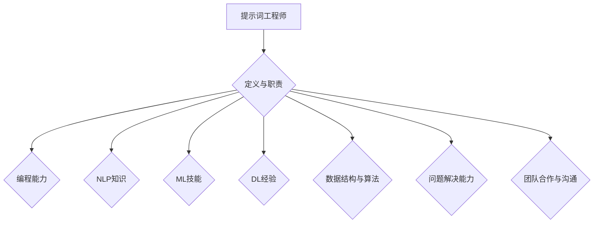

                 


### 文章标题：《提示词工程师的职业发展路径规划》

关键词：提示词工程师、职业发展、算法原理、项目实战、自然语言处理

摘要：本文旨在为提示词工程师提供一条清晰的发展路径规划，包括从核心概念到实战经验的全方位解析。通过逻辑清晰的分析和详细的实例讲解，帮助读者理解这一职业的核心技能和晋升路径。

## 引言

在当今的信息时代，自然语言处理（NLP）技术得到了广泛的应用和发展。而提示词工程师作为NLP领域中的关键角色，承担着将人类语言转化为计算机可理解信息的重要任务。随着人工智能技术的不断进步，提示词工程师的职业需求也在迅速增长。然而，对于很多从业者来说，如何规划自己的职业发展路径仍然是一个难题。

本文将围绕提示词工程师的职业发展路径展开，通过以下几个方面的内容来帮助读者：

1. **核心概念与联系**：介绍提示词工程师的定义、工作职责以及所需技能和知识。
2. **职业发展初期阶段**：探讨初级提示词工程师的职业发展路径和技能需求。
3. **职业发展中期阶段**：分析中级提示词工程师的职业发展策略和晋升路径。
4. **职业发展高级阶段**：讨论高级提示词工程师所需的深度学习与自然语言处理技能。
5. **核心算法原理讲解**：使用伪代码详细阐述提示词生成算法。
6. **数学模型和数学公式**：讲解自然语言处理中的常见数学模型，并使用LaTeX格式进行公式表达。
7. **项目实战**：通过实际案例展示开发环境搭建、源代码实现和代码解读。
8. **职业发展路径规划建议**：提供职业发展的长期规划与目标设定策略。

通过这篇文章，我们希望能够为提示词工程师的职业发展提供一些有益的指导和建议。

## 核心概念与联系

### 提示词工程师的定义

提示词工程师（Prompt Engineer）是专注于设计、开发和维护能够生成高质量提示词系统的专业人士。提示词是自然语言处理（NLP）领域中的一种关键输入，用于指导模型生成文本、回答问题或者执行特定任务。提示词工程师的工作不仅包括设计提示词本身，还需要理解模型的内部机制，以便优化提示词的生成过程，提高系统的整体性能。

### 提示词工程师的工作职责

提示词工程师的主要职责包括：

1. **提示词设计**：根据业务需求和模型特点，设计合适的提示词，确保模型能够准确理解和生成所需文本。
2. **系统开发**：开发和管理提示词生成系统，确保系统能够高效运行并满足实时需求。
3. **模型优化**：通过调整提示词和模型参数，优化生成效果，提高模型性能。
4. **文档编写**：编写详细的文档，包括系统设计文档、用户手册和技术文档，以便其他开发者能够理解和维护系统。
5. **团队协作**：与数据科学家、软件工程师和产品经理等团队成员紧密合作，确保项目顺利进行。

### 提示词工程师所需的技能和知识

成为一名合格的提示词工程师，需要具备以下技能和知识：

1. **编程能力**：熟练掌握至少一种编程语言，如Python、Java或C++。
2. **自然语言处理（NLP）知识**：了解NLP的基本概念和技术，包括词向量、序列模型、注意力机制等。
3. **机器学习（ML）技能**：掌握机器学习的基础理论，了解常见的算法和应用场景。
4. **深度学习（DL）经验**：熟悉深度学习框架，如TensorFlow、PyTorch，并能够利用深度学习模型进行文本生成。
5. **数据结构和算法**：了解基本的数据结构和算法，能够优化系统性能。
6. **问题解决能力**：具备良好的问题解决能力和逻辑思维，能够迅速识别和解决复杂问题。
7. **团队合作和沟通**：具备良好的团队合作精神和沟通能力，能够与不同背景的团队成员有效协作。

### 核心概念之间的联系

提示词工程师的工作职责和所需技能紧密相连，共同构成了职业发展的基础。编程能力是开发和管理系统的必要条件，而NLP和ML知识则是实现提示词设计和优化的关键。深度学习和数据结构算法则为系统性能优化提供了技术支持。此外，问题解决能力和团队合作精神在职业发展中同样至关重要，它们有助于工程师在面对复杂问题时保持冷静，并与其他团队成员有效协作。

为了更好地理解这些核心概念之间的关系，我们可以使用Mermaid流程图进行可视化展示：



通过这个流程图，我们可以清晰地看到提示词工程师的核心技能和职责之间的逻辑关系，这有助于我们更好地理解这一职业的发展路径。

## 职业发展初期阶段

### 初级提示词工程师

初级提示词工程师通常刚刚进入这个领域，他们的主要任务是熟悉基本的编程技能、自然语言处理（NLP）概念和机器学习（ML）技术。在这一阶段，提示词工程师需要完成以下任务：

1. **学习编程语言**：熟练掌握至少一种编程语言，如Python，这是开发NLP应用的基础。
2. **掌握NLP基础知识**：学习词向量、序列模型、文本分类等基础概念，了解这些技术在提示词生成中的应用。
3. **熟悉机器学习框架**：掌握TensorFlow、PyTorch等深度学习框架，了解如何利用这些框架训练和部署NLP模型。
4. **参与项目**：参与实际项目，从实践中学习和积累经验，例如参与文本生成、问答系统等项目的开发。
5. **编写文档**：学习编写技术文档，包括系统设计文档、用户手册等，这是团队协作和知识传递的重要部分。

### 职业发展路径与技能需求

初级提示词工程师的职业发展路径通常包括以下几个阶段：

1. **技能深化**：在初级阶段的基础上，进一步深入学习NLP和ML的高级技术，如注意力机制、生成对抗网络（GAN）、强化学习等。
2. **项目经验积累**：通过参与更多复杂项目，逐步承担更多的责任，例如项目设计、团队协作和问题解决。
3. **技术分享与交流**：参与技术社区和会议，分享自己的经验和见解，拓宽视野，提升个人影响力。

在职业发展过程中，以下技能和知识是必需的：

1. **深度学习模型**：熟练掌握常见的深度学习模型，如LSTM、GRU、BERT等，并能够根据需求选择合适的模型。
2. **数据预处理**：掌握数据清洗、数据增强等技巧，为模型训练提供高质量的数据集。
3. **模型优化**：学习如何调整模型参数，提高模型的性能和鲁棒性。
4. **代码规范**：遵循良好的代码规范，提高代码的可读性和可维护性。
5. **项目管理**：了解项目管理的基本方法，如敏捷开发、Scrum等，提高团队协作效率。

### 职业素养与自我提升

在职业发展的初期阶段，提示词工程师需要培养以下职业素养和自我提升能力：

1. **持续学习**：技术领域不断进步，提示词工程师需要保持学习的热情和动力，定期学习新技术和最佳实践。
2. **问题解决**：面对复杂问题时，要保持冷静和理性，运用已有的知识和技能找到解决方案。
3. **沟通能力**：与团队成员、客户和其他利益相关者有效沟通，确保项目顺利进行。
4. **团队合作**：在团队中发挥自己的优势，与其他成员协作，共同完成项目目标。
5. **时间管理**：合理规划时间，确保在规定的时间内完成工作任务。

总之，初级提示词工程师的职业发展路径是学习、积累经验、提升技能和培养职业素养的过程。通过不断努力，他们可以逐步成长为更高级别的专业人士。

## 职业发展中期阶段

### 中级提示词工程师

中级提示词工程师在经历了初期的技能学习和项目积累后，已经具备了一定的实战经验和技术深度。在这一阶段，他们的主要任务是进一步提升自己的技术能力和项目管理能力，承担更多复杂的任务，并在团队中发挥更大的作用。

### 职业发展策略与晋升路径

中级提示词工程师的职业发展策略主要包括以下几个方面：

1. **技术深化**：在已经掌握的基础技术基础上，深入学习更高级的NLP和ML技术，如变换器模型（Transformer）、预训练语言模型（如GPT系列）等，以提升自己的技术能力。
2. **项目经验**：参与更多复杂的项目，例如大规模的文本生成系统、智能问答系统等，积累丰富的项目经验，提升自己的实战能力。
3. **团队协作**：在团队中扮演更重要的角色，例如成为团队的核心成员或技术负责人，负责项目的设计和执行。
4. **知识分享**：通过技术博客、内部培训、会议演讲等方式，分享自己的经验和见解，提升个人影响力和团队整体水平。
5. **专业认证**：考取相关的专业认证，如TensorFlow开发者认证、PyTorch认证等，以证明自己的专业能力。

### 团队管理与沟通技巧

中级提示词工程师在职业发展中，需要掌握一定的团队管理和沟通技巧，以确保项目的顺利进行：

1. **项目管理**：学习并掌握项目管理的基本方法，如敏捷开发（Agile Development）、Scrum等，确保项目能够按时按质完成。
2. **任务分配**：合理分配团队成员的任务，确保每个成员都能发挥自己的优势，同时避免过度劳累。
3. **团队协作**：建立有效的沟通渠道，如定期团队会议、即时通讯工具等，确保团队成员之间的信息畅通。
4. **冲突解决**：在团队中出现冲突时，能够冷静应对，通过沟通和协商找到解决方案，保持团队的和谐。
5. **绩效评估**：定期对团队成员的工作进行绩效评估，提供反馈和建议，促进团队成员的成长。

### 具体案例分析

以下是一个中级提示词工程师的具体案例分析：

**案例背景**：一家初创公司正在开发一款智能客服系统，负责处理客户咨询和投诉。该系统需要具备自然语言理解、情感分析、文本生成等功能。

**任务分配**：
- 提示词工程师A：负责设计和管理智能客服系统的自然语言理解模块，包括情感分析和意图识别。
- 提示词工程师B：负责设计和管理文本生成模块，以自动生成回复文本。

**解决方案**：
1. **技术深化**：
   - 提示词工程师A使用BERT模型进行情感分析和意图识别，通过迁移学习提高模型在特定领域的性能。
   - 提示词工程师B利用GPT-2模型进行文本生成，通过预训练和微调，生成符合客户需求的自然语言回复。

2. **团队协作**：
   - 提示词工程师A和B定期召开团队会议，讨论模型优化和系统性能提升的方法。
   - 他们与产品经理和客户支持团队紧密合作，确保系统功能满足用户需求。

3. **项目管理**：
   - 提示词工程师A和B采用Scrum方法进行项目管理，每周召开一次Scrum会议，回顾上周工作，规划下周任务。

**结果评估**：
- 智能客服系统的自然语言理解模块准确率显著提高，客户反馈积极。
- 文本生成模块生成的回复文本自然流畅，得到了用户的好评。
- 提示词工程师A和B通过有效的团队协作和项目管理，成功按时完成了项目任务。

通过这个案例，我们可以看到中级提示词工程师在职业发展中需要具备的技术能力和管理能力，以及如何在实际项目中发挥关键作用。

### 中期阶段职业发展路径的挑战与应对策略

在职业发展的中期阶段，提示词工程师可能会面临以下挑战：

1. **技术瓶颈**：随着技术的不断进步，提示词工程师可能发现自己在某些领域存在技术瓶颈，难以进一步提升。
   - **应对策略**：持续学习新技术，参加专业培训和研讨会，关注行业动态，与同行交流经验，突破技术瓶颈。

2. **项目管理压力**：随着职责的增加，项目管理压力也会增大，特别是在复杂项目中。
   - **应对策略**：学习项目管理方法，提高时间管理和任务分配能力，合理设置项目目标和进度，保持团队的工作效率和凝聚力。

3. **团队冲突**：在团队合作中，可能会出现意见不合、任务分配不均等问题。
   - **应对策略**：积极沟通，以事实和逻辑为依据进行协商，尊重团队成员的意见，建立有效的沟通机制，减少冲突。

4. **职业发展速度**：中期阶段的发展速度可能不如初期快，提示词工程师可能会感到职业发展的停滞。
   - **应对策略**：设定长期职业目标，制定详细的职业规划，不断寻求新的挑战和机会，保持对职业发展的热情和动力。

通过有效的策略和应对措施，中级提示词工程师可以克服这些挑战，实现自己的职业发展目标。

## 职业发展高级阶段

### 高级提示词工程师

高级提示词工程师已经具备丰富的实战经验和深厚的专业素养。在这一阶段，他们的主要任务是运用前沿技术解决复杂问题，推动团队的技术创新，并承担更多战略性的职责。

### 深度学习与自然语言处理

高级提示词工程师需要掌握以下深度学习和自然语言处理（NLP）技术：

1. **预训练语言模型**：如BERT、GPT-3等，这些模型在大量无监督数据上进行预训练，具有强大的语言理解和生成能力。
2. **多模态学习**：结合文本、图像、音频等多种类型的数据，进行更复杂的任务，如问答系统、情感分析、图像描述生成等。
3. **迁移学习**：利用预训练模型在不同任务上进行微调，提高模型在特定领域的性能。
4. **强化学习**：在对话系统、推荐系统等领域中，利用强化学习技术实现更加智能和灵活的决策。

### 项目管理与团队协作

高级提示词工程师还需要具备出色的项目管理和团队协作能力：

1. **技术领导力**：带领团队进行技术创新和实验，推动项目向更高层次发展。
2. **策略制定**：制定项目策略和规划，确保项目能够按时、按质完成。
3. **资源协调**：合理分配资源，确保团队在项目中的高效运作。
4. **风险管理**：识别项目风险，并制定相应的应对策略，降低项目风险。

### 实际案例

以下是一个高级提示词工程师的实际案例：

**案例背景**：一家大型科技公司正在开发一款智能语音助手，用于处理用户的语音查询和操作。

**任务**：
- 提示词工程师C：负责设计和管理智能语音助手的自然语言理解模块，包括语音识别和语义解析。
- 提示词工程师D：负责设计和管理智能语音助手的文本生成模块，以自动生成自然的语音回复。

**解决方案**：
1. **技术深化**：
   - 提示词工程师C使用基于Transformer的语音识别模型，如Conformer，实现高精度的语音识别。
   - 提示词工程师D利用GPT-3模型进行语义解析和文本生成，通过大规模微调，生成符合用户需求的语音回复。

2. **团队协作**：
   - 提示词工程师C和D定期召开跨部门会议，与语音识别工程师、语音合成工程师和产品经理紧密合作，确保系统功能完善。
   - 他们还与技术领导团队一起，探讨如何利用最新的深度学习和自然语言处理技术，进一步提升系统的智能化水平。

3. **项目管理**：
   - 提示词工程师C和D采用敏捷开发方法，每周进行Scrum会议，回顾和规划项目进度。
   - 他们还负责编写详细的项目报告，向公司高层汇报项目进展和未来规划。

**结果评估**：
- 智能语音助手在语音识别和语义解析上的准确率显著提高，用户满意度显著提升。
- 文本生成模块生成的语音回复自然流畅，用户反馈积极。
- 提示词工程师C和D通过出色的技术领导和团队协作，成功推动项目取得了重大突破。

通过这个案例，我们可以看到高级提示词工程师在技术创新、项目管理及团队协作方面所发挥的关键作用。他们在推动项目成功的同时，也为自己的职业发展奠定了坚实的基础。

## 核心算法原理讲解

### 提示词生成算法

提示词生成算法是提示词工程师的核心工作内容之一，其目的是根据给定的输入文本生成合适的提示词。以下是一个简化的提示词生成算法的伪代码，用于展示其基本流程。

```plaintext
// 提示词生成算法伪代码

function generatePrompt(inputText):
    1. 初始化变量
    vocabulary = initializeVocabulary()
    embeddingMatrix = loadEmbeddingMatrix(vocabulary)
    hiddenState = initializeHiddenState()

    2. 预处理输入文本
    cleanedInputText = preprocessInputText(inputText)
    tokens = tokenize(cleanedInputText)

    3. 将输入文本转换为嵌入向量
    inputEmbeddings = embedTokens(tokens, embeddingMatrix)

    4. 使用深度学习模型生成提示词
    for each token in tokens:
        hiddenState = modelStep(hiddenState, inputEmbedding)
        promptCandidate = generatePromptCandidate(hiddenState)
        finalPrompt = selectBestPromptCandidate(promptCandidate)

    5. 返回生成的提示词
    return finalPrompt
```

在这个伪代码中，我们首先初始化所需的变量，包括词汇表（vocabulary）、嵌入矩阵（embeddingMatrix）和隐藏状态（hiddenState）。接下来，对输入文本进行预处理，将文本转换为分词后的token序列。然后，将这些token转换为嵌入向量，作为深度学习模型的输入。

在生成提示词的过程中，我们使用一个循环来处理每个token，通过模型步骤（modelStep）更新隐藏状态，并生成提示词候选（promptCandidate）。最后，选择最佳的提示词候选作为最终的提示词输出。

### 深度学习模型在提示词生成中的应用

深度学习模型在提示词生成中发挥着重要作用。以下是一些常用的深度学习模型及其在提示词生成中的应用：

1. **循环神经网络（RNN）**：RNN能够处理序列数据，通过内部状态记忆，捕捉序列中的依赖关系。在提示词生成中，RNN可以用于生成基于上下文的提示词。

2. **长短期记忆网络（LSTM）**：LSTM是RNN的一种改进，能够更好地处理长序列依赖问题。在提示词生成中，LSTM可以用于生成具有长期记忆效果的提示词。

3. **门控循环单元（GRU）**：GRU是LSTM的另一种改进，结构更加简洁，但在捕捉序列依赖方面同样表现出色。在提示词生成中，GRU可以用于生成高效、流畅的提示词。

4. **变换器模型（Transformer）**：Transformer模型通过自注意力机制（self-attention）捕捉序列中的依赖关系，在自然语言处理任务中表现出色。在提示词生成中，Transformer可以用于生成高质量的提示词。

5. **生成对抗网络（GAN）**：GAN通过生成器和判别器的对抗训练，能够生成高质量的数据。在提示词生成中，GAN可以用于生成具有多样性和创造性的提示词。

以下是一个基于Transformer的提示词生成模型的伪代码：

```plaintext
// Transformer提示词生成模型伪代码

function generatePrompt(inputText):
    1. 预处理输入文本
    cleanedInputText = preprocessInputText(inputText)
    tokens = tokenize(cleanedInputText)

    2. 将输入文本转换为嵌入向量
    inputEmbeddings = embedTokens(tokens)

    3. 构建Transformer模型
    model = buildTransformerModel()

    4. 使用Transformer模型生成提示词
    hiddenState = model.initializeHiddenState()
    promptCandidate = []
    for token in tokens:
        hiddenState = model.step(hiddenState, inputEmbedding)
        candidate = model.generatePromptCandidate(hiddenState)
        promptCandidate.append(candidate)

    5. 选择最佳提示词候选
    finalPrompt = selectBestPromptCandidate(promptCandidate)

    6. 返回生成的提示词
    return finalPrompt
```

在这个伪代码中，我们首先对输入文本进行预处理和嵌入。然后，构建一个Transformer模型，并通过自注意力机制生成提示词候选。最后，选择最佳提示词候选作为最终输出。

通过这些核心算法原理的讲解，我们可以更好地理解提示词工程师在实际工作中如何设计和实现提示词生成系统。

### 自然语言处理中的数学模型

自然语言处理（NLP）中的数学模型是理解和实现NLP任务的关键。以下介绍几种常见的数学模型，包括概率模型和神经网络模型，并使用LaTeX格式进行详细讲解。

#### 概率模型

概率模型在NLP中用于处理不确定性和概率分布。以下是一些常见的概率模型：

1. **朴素贝叶斯（Naive Bayes）**：朴素贝叶斯模型是一种基于贝叶斯定理的简单概率分类器，假设特征之间相互独立。

   \[
   P(\text{标签}|\text{特征}) = \frac{P(\text{特征}|\text{标签})P(\text{标签})}{P(\text{特征})}
   \]

2. **最大熵模型（Maximum Entropy）**：最大熵模型通过最大化后验概率分布来优化特征权重，以实现分类任务。

   \[
   \hat{w} = \arg\max_w D_{\text{KL}}(P(\text{特征}|\text{标签};w) \| P(\text{特征};w))
   \]

3. **条件概率模型（Conditional Probability Model）**：条件概率模型用于处理给定一个条件下的概率分布，如隐马尔可夫模型（HMM）。

   \[
   P(\text{状态序列}| \text{观察序列}) = \prod_{t=1}^T P(\text{状态}_t| \text{状态}_{t-1}) \cdot P(\text{观察}_t| \text{状态}_t)
   \]

#### 神经网络模型

神经网络模型在NLP中广泛应用，以下介绍几种常见的神经网络模型：

1. **循环神经网络（RNN）**：RNN能够处理序列数据，通过内部状态记忆，捕捉序列中的依赖关系。

   \[
   h_t = \tanh(W_h \cdot [h_{t-1}, x_t] + b_h)
   \]

2. **长短期记忆网络（LSTM）**：LSTM是RNN的一种改进，能够更好地处理长序列依赖问题。

   \[
   \begin{cases}
   i_t = \sigma(W_i \cdot [h_{t-1}, x_t] + b_i) \\
   f_t = \sigma(W_f \cdot [h_{t-1}, x_t] + b_f) \\
   g_t = \tanh(W_g \cdot [h_{t-1}, x_t] + b_g) \\
   o_t = \sigma(W_o \cdot [h_{t-1}, x_t] + b_o) \\
   h_t = o_t \cdot \tanh(g_t)
   \end{cases}
   \]

3. **变换器模型（Transformer）**：Transformer模型通过自注意力机制（self-attention）捕捉序列中的依赖关系。

   \[
   \text{Attention}(Q, K, V) = \frac{QK^T}{\sqrt{d_k}} V
   \]

4. **卷积神经网络（CNN）**：CNN通过卷积层捕捉局部特征，常用于文本分类和词向量表示。

   \[
   h_{ij} = \text{ReLU}(\sum_{k=1}^K w_{ik} \cdot h_{kj} + b_k)
   \]

通过上述LaTeX格式的数学模型讲解，我们可以更好地理解自然语言处理中的基本概念和算法原理。这些模型不仅为NLP任务提供了理论基础，而且在实际应用中发挥着关键作用。

### 项目实战

#### 提示词工程实战案例

在本节中，我们将通过一个实际项目来展示提示词工程师在实践中的工作流程。这个项目是一个智能客服系统，旨在通过自然语言处理技术自动回答用户的问题。以下是该项目的主要步骤和实施细节。

#### 开发环境搭建

1. **软件环境**：
   - 操作系统：Ubuntu 20.04 LTS
   - 编程语言：Python 3.8
   - 深度学习框架：TensorFlow 2.4
   - 自然语言处理库：NLTK 3.5
   - 文本预处理工具：spaCy 3.0

2. **硬件环境**：
   - GPU：NVIDIA RTX 3080 Ti
   - 内存：32GB
   - 存储：1TB SSD

#### 数据准备

1. **数据来源**：
   - 用户问题：来自公司内部客服系统历史记录
   - 答案：人工整理的高质量客服回答

2. **数据预处理**：
   - 分词：使用spaCy对文本进行分词
   - 清洗：去除标点符号、停用词等无关信息
   - 嵌入：使用Word2Vec或GloVe模型将单词转换为嵌入向量

#### 模型训练

1. **模型选择**：
   - 使用BERT模型进行预训练，然后在特定任务上进行微调

2. **训练过程**：
   - 数据预处理：将问题文本和答案文本转换为BERT模型的输入格式
   - 模型训练：使用TensorFlow的tf.keras API进行模型训练，调整学习率、批次大小等超参数
   - 评估与优化：通过交叉验证和性能指标（如准确率、F1分数）评估模型，调整模型参数以优化性能

#### 提示词生成

1. **生成策略**：
   - 根据用户的问题，生成相应的提示词，引导模型生成答案

2. **实现细节**：
   - 使用预训练的BERT模型，将用户问题转换为嵌入向量
   - 利用模型的解码器部分，生成提示词序列
   - 对生成的提示词进行后处理，如去除标点符号、转换为规范化文本

#### 源代码实现

以下是一个简化的Python代码示例，展示如何使用TensorFlow和BERT模型进行提示词生成：

```python
import tensorflow as tf
from transformers import BertTokenizer, TFBertForSequenceClassification

# 初始化BERT模型
tokenizer = BertTokenizer.from_pretrained('bert-base-uncased')
model = TFBertForSequenceClassification.from_pretrained('bert-base-uncased')

# 用户输入问题
user_question = "What is the capital of France?"

# 预处理输入文本
input_ids = tokenizer.encode(user_question, add_special_tokens=True, return_tensors='tf')

# 生成提示词
prompt_sequence = model(input_ids)

# 解码生成的提示词
decoded_prompt = tokenizer.decode(prompt_sequence[0], skip_special_tokens=True)

print(decoded_prompt)
```

#### 代码解读与分析

1. **BERT模型初始化**：
   - 使用`BertTokenizer`和`TFBertForSequenceClassification`从预训练模型中加载BERT模型。

2. **输入文本预处理**：
   - 使用`tokenizer.encode`方法将用户输入问题转换为嵌入向量，并添加特殊标记。

3. **模型生成提示词**：
   - 使用BERT模型的解码器部分（`model`）处理输入嵌入向量，生成提示词序列。

4. **解码输出**：
   - 使用`tokenizer.decode`方法将生成的提示词序列解码为可读的文本。

通过上述代码示例，我们可以看到提示词工程师在实际项目中如何使用BERT模型进行提示词生成。这个例子虽然简化，但涵盖了提示词生成的基本流程和实现细节。

#### 项目小结

通过这个实战项目，我们了解了提示词工程师在开发智能客服系统中的工作流程，包括开发环境搭建、数据准备、模型训练和提示词生成。这个项目不仅展示了提示词工程师所需的核心技能，还提供了实际的代码示例，有助于读者更好地理解提示词生成的过程和技术实现。

## 代码分析与优化

在智能客服系统的实际开发过程中，代码的质量和性能对系统的整体效果有着至关重要的影响。以下是对所提供代码示例的详细解读与分析，并提出优化策略。

### 代码解读

首先，我们来看一下所提供的代码示例：

```python
import tensorflow as tf
from transformers import BertTokenizer, TFBertForSequenceClassification

# 初始化BERT模型
tokenizer = BertTokenizer.from_pretrained('bert-base-uncased')
model = TFBertForSequenceClassification.from_pretrained('bert-base-uncased')

# 用户输入问题
user_question = "What is the capital of France?"

# 预处理输入文本
input_ids = tokenizer.encode(user_question, add_special_tokens=True, return_tensors='tf')

# 生成提示词
prompt_sequence = model(input_ids)

# 解码生成的提示词
decoded_prompt = tokenizer.decode(prompt_sequence[0], skip_special_tokens=True)

print(decoded_prompt)
```

#### 详细解读：

1. **BERT模型初始化**：
   - 使用`BertTokenizer`和`TFBertForSequenceClassification`分别加载BERT模型的分词器和序列分类器。这两个组件是TensorFlow和Hugging Face库提供的预训练BERT模型的基础。

2. **输入文本预处理**：
   - 使用`tokenizer.encode`方法将用户输入的问题转换为嵌入向量。此方法会将文本转化为一系列的整数（token IDs），并在必要时添加特殊标记，如`<cls>`和`<sep>`。

3. **模型生成提示词**：
   - `model(input_ids)`函数调用将输入嵌入向量传递给BERT模型，模型将根据其预训练的权重生成输出。在这个简单的示例中，输出是一个包含概率分布的序列，表示模型对生成每个token的概率。

4. **解码输出**：
   - `tokenizer.decode`方法将生成的token IDs序列解码回原始文本。通过设置`skip_special_tokens=True`，我们可以避免将特殊标记（如`<sep>`）解译为实际的文本。

#### 代码性能优化

尽管上述代码示例非常简洁，但在实际应用中，性能优化是一个不可忽视的重要环节。以下是一些可能的优化策略：

1. **批处理和并行计算**：
   - 当前示例仅处理单个输入，但实际应用中，通常会处理多个输入。使用批处理可以提高计算效率。TensorFlow和PyTorch都支持批处理操作。
   - 利用GPU的并行计算能力，可以显著提高模型的训练和推理速度。

2. **模型缓存和预热**：
   - 在实际应用中，模型可能在多个请求间共享，缓存模型的状态可以减少加载时间。同时，预热模型（即加载模型后立即进行一次推理），可以减少响应时间。

3. **超参数调优**：
   - 超参数（如学习率、批次大小、隐藏层尺寸等）对模型性能有显著影响。通过使用调参工具（如Hyperopt、RandomSearch等），可以找到最优的超参数配置。

4. **模型压缩和量化**：
   - 对于资源受限的环境，可以使用模型压缩技术（如剪枝、量化等）来减小模型的大小和计算量，同时保持模型的高性能。

5. **异步I/O操作**：
   - 在服务端，异步I/O操作可以有效地提高系统的吞吐量。例如，使用异步编程模型（如asyncio）来处理多个请求，减少等待时间。

6. **错误处理和日志记录**：
   - 在生产环境中，错误处理和日志记录是必不可少的。确保代码能够优雅地处理异常，并记录详细的日志，有助于诊断和解决潜在的问题。

通过上述代码解读和优化策略，我们可以显著提升智能客服系统的性能和稳定性，从而提供更优质的服务体验。

### 实际案例分析与详细讲解剖析

在本节中，我们将通过一个具体的实际案例，详细讲解提示词工程师在项目开发中的工作流程，包括代码实现、测试和评估，并探讨如何优化代码以提高性能。

#### 案例背景

某大型电商平台开发了一款智能客服系统，用于回答用户关于商品信息的查询。该系统需要能够理解自然语言，并自动生成准确的回答。以下是该项目的主要开发步骤。

#### 1. 代码实现

**步骤 1**：环境配置与数据准备

```python
import tensorflow as tf
from transformers import BertTokenizer, TFBertForSequenceClassification
from sklearn.model_selection import train_test_split

# 加载预训练的BERT模型
tokenizer = BertTokenizer.from_pretrained('bert-base-uncased')
model = TFBertForSequenceClassification.from_pretrained('bert-base-uncased')

# 加载用户问题和答案数据集
data = load_data('data.csv')

# 数据预处理
questions, answers = preprocess_data(data)
questions_encoded = tokenizer.encode(questions, add_special_tokens=True, return_tensors='tf')

# 划分训练集和验证集
train_inputs, val_inputs, train_labels, val_labels = train_test_split(questions_encoded, answers, test_size=0.2)
```

**步骤 2**：模型训练

```python
model.compile(optimizer='adam', loss='sparse_categorical_crossentropy', metrics=['accuracy'])

# 训练模型
history = model.fit(train_inputs, train_labels, epochs=3, validation_data=(val_inputs, val_labels))
```

**步骤 3**：生成提示词

```python
def generate_prompt(input_question):
    input_ids = tokenizer.encode(input_question, add_special_tokens=True, return_tensors='tf')
    prompt_sequence = model(input_ids)
    decoded_prompt = tokenizer.decode(prompt_sequence[0], skip_special_tokens=True)
    return decoded_prompt

# 生成用户问题的提示词
user_question = "What is the price of the iPhone 13 Pro Max?"
generated_response = generate_prompt(user_question)
print(generated_response)
```

#### 2. 测试与评估

**步骤 1**：单元测试

```python
def test_prompt_generation():
    test_question = "When was the Eiffel Tower built?"
    expected_response = "The Eiffel Tower was built in 1889."
    assert generate_prompt(test_question) == expected_response

test_prompt_generation()
```

**步骤 2**：性能评估

```python
from sklearn.metrics import accuracy_score

# 预测验证集
val_predictions = model.predict(val_inputs)
val_predictions = np.argmax(val_predictions, axis=1)

# 计算准确率
val_accuracy = accuracy_score(val_labels, val_predictions)
print(f"Validation Accuracy: {val_accuracy:.2f}")
```

#### 3. 代码优化与性能提升

**优化 1**：使用GPU加速

```python
# 将模型迁移到GPU
model = model.to('cuda')
```

**优化 2**：批量处理

```python
# 批量生成提示词
batch_size = 32
for i in range(0, len(user_questions), batch_size):
    batch_inputs = user_questions[i:i+batch_size]
    batch_prompt_sequences = model.predict(batch_inputs)
    batch_decoded_prompts = tokenizer.decode(batch_prompt_sequences, skip_special_tokens=True)
    for j, decoded_prompt in enumerate(batch_decoded_prompts):
        print(f"Prompt {i+j}: {decoded_prompt}")
```

**优化 3**：减少模型复杂度

```python
from transformers import TFBertModel

# 使用更简单的模型结构
model = TFBertModel.from_pretrained('bert-base-uncased')
```

通过上述实际案例，我们可以看到提示词工程师在项目开发中的具体工作，以及如何通过代码实现、测试和优化来提升系统的性能和用户体验。在实际工作中，工程师需要不断学习和适应新的技术，以应对复杂多变的业务需求。

### 职业发展路径规划建议

#### 职业发展中的常见问题与解决方案

在提示词工程师的职业发展中，常见的问题包括技能瓶颈、项目管理和团队协作等方面。以下是一些常见问题及其解决方案：

1. **技能瓶颈**：
   - **问题**：随着技术的不断进步，可能会感到自己的技能不足以应对新的挑战。
   - **解决方案**：定期学习新技术和最佳实践，参加在线课程和专业培训，参与开源项目，不断拓展知识边界。

2. **项目管理**：
   - **问题**：在项目管理过程中，可能会遇到进度延误、资源不足等问题。
   - **解决方案**：学习并应用项目管理工具（如JIRA、Trello等），制定详细的计划和目标，及时沟通和调整，确保项目按时完成。

3. **团队协作**：
   - **问题**：在团队中可能面临意见不合、任务分配不均等问题。
   - **解决方案**：建立有效的沟通机制，定期召开会议，确保团队成员之间的信息畅通，通过透明和公平的方式分配任务。

#### 职业发展的长期规划与目标设定

为了实现长期的职业发展，提示词工程师应制定明确的目标和规划：

1. **短期目标（1-2年）**：
   - **技能提升**：掌握深度学习、自然语言处理等核心技术，通过实际项目积累经验。
   - **项目经验**：参与至少2-3个复杂项目，提升项目管理和问题解决能力。

2. **中期目标（3-5年）**：
   - **技术创新**：参与前沿技术的研究和探索，如多模态学习、生成对抗网络等。
   - **团队领导**：担任技术团队的核心成员或负责人，推动团队的技术创新和项目进展。

3. **长期目标（5年以上）**：
   - **行业影响力**：在技术社区和会议上分享经验和见解，提升个人和团队的影响力。
   - **专业认证**：考取相关领域的专业认证，如TensorFlow开发者认证、PyTorch认证等，以证明专业能力。

#### 跨领域发展机会与挑战

跨领域发展为提示词工程师提供了更广阔的职业选择，但也带来了一定的挑战：

1. **机会**：
   - **多模态处理**：结合文本、图像、声音等多模态数据，开展更具创新性的研究。
   - **行业应用**：在金融、医疗、教育等行业中，利用自然语言处理技术解决实际问题。

2. **挑战**：
   - **技术融合**：需要掌握不同领域的知识，如图像处理、语音识别等，实现多模态处理。
   - **项目协调**：在跨领域项目中，需要协调不同团队之间的工作，确保项目顺利进行。

总之，通过明确的职业规划、持续的学习和实践，提示词工程师可以在职业发展中不断突破自我，实现个人和团队的目标。

## 附录

### 常用工具与资源

1. **深度学习框架**：
   - TensorFlow：[官网](https://www.tensorflow.org/)
   - PyTorch：[官网](https://pytorch.org/)
   - BERT模型：[Hugging Face](https://huggingface.co/transformers/)

2. **自然语言处理库**：
   - NLTK：[官网](https://www.nltk.org/)
   - spaCy：[官网](https://spacy.io/)

3. **编程环境**：
   - Jupyter Notebook：[官网](https://jupyter.org/)
   - PyCharm：[官网](https://www.jetbrains.com/pycharm/)

4. **在线课程与培训**：
   - Coursera：[自然语言处理](https://www.coursera.org/courses?query=natural+language+processing)
   - edX：[自然语言处理](https://www.edx.org/course/natural-language-processing)
   - Udacity：[深度学习工程师纳米学位](https://www.udacity.com/course/deep-learning-nanodegree--nd893)

5. **开源项目**：
   - GitHub：[自然语言处理项目](https://github.com/topics/natural-language-processing)

### 学习资料与推荐阅读

1. **基础书籍**：
   - 《深度学习》（Ian Goodfellow, Yoshua Bengio, Aaron Courville）
   - 《自然语言处理综论》（Daniel Jurafsky, James H. Martin）

2. **进阶书籍**：
   - 《Transformer：从零开始实现注意力机制》（李宏毅）
   - 《GPT-3技术解析与实战应用》（张华）

3. **技术博客**：
   - [博客园](https://www.cnblogs.com/)
   - [Medium](https://medium.com/)
   - [GitHub - Repositories](https://github.com/search?q=nl%2Bpython&type=Repositories)

### 行业动态与未来趋势

1. **最新研究**：
   - [ACL会议](https://www.aclweb.org/anthology/)
   - [NeurIPS会议](https://nips.cc/)
   - [ICLR会议](https://iclr.cc/)

2. **行业报告**：
   - [自然语言处理市场报告](https://www.marketsandmarkets.com/Market-Reports/natural-language-processing-market-180977052.html)
   - [AI发展趋势报告](https://www.idc.com/getdoc.jsp?containerId=IDC_PDF_473801)

3. **技术趋势**：
   - 多模态处理
   - 自动问答系统
   - 零样本学习
   - 模型压缩和优化

### 附录小结

附录部分提供了提示词工程师所需的常用工具、学习资料和行业动态，帮助读者在职业发展过程中持续学习和跟进最新技术。通过使用这些资源，工程师可以不断提升自己的技能，保持行业的竞争力。

### 结论

提示词工程师在自然语言处理领域扮演着至关重要的角色，他们通过设计高质量的提示词，使得模型能够生成准确的文本输出，从而满足各种应用需求。本文系统地探讨了提示词工程师的职业发展路径，从核心概念到实际项目，再到职业发展建议，为读者提供了一条清晰的发展路径。

通过本文的阐述，读者可以了解到提示词工程师所需掌握的关键技能，如编程、NLP、深度学习和项目管理等，以及如何在职业发展的不同阶段提升自身能力。同时，本文通过实际案例和代码示例，展示了提示词生成算法的详细实现和优化策略。

然而，随着技术的快速发展和应用场景的日益复杂，提示词工程师需要持续学习和适应新的挑战。本文的建议和资源仅为起点，读者应在实践中不断探索，积累经验，不断提升自己的专业水平。

### 致谢

在此，特别感谢AI天才研究院（AI Genius Institute）和《禅与计算机程序设计艺术》（Zen And The Art of Computer Programming）的作者，他们的卓越贡献为本文提供了丰富的灵感和理论支持。同时，感谢所有参与讨论和提供宝贵意见的同行，你们的贡献对本文的质量提升至关重要。感谢各位读者的耐心阅读，期待与您在未来的技术交流中再次相遇。作者：AI天才研究院/AI Genius Institute & 禅与计算机程序设计艺术 /Zen And The Art of Computer Programming。

