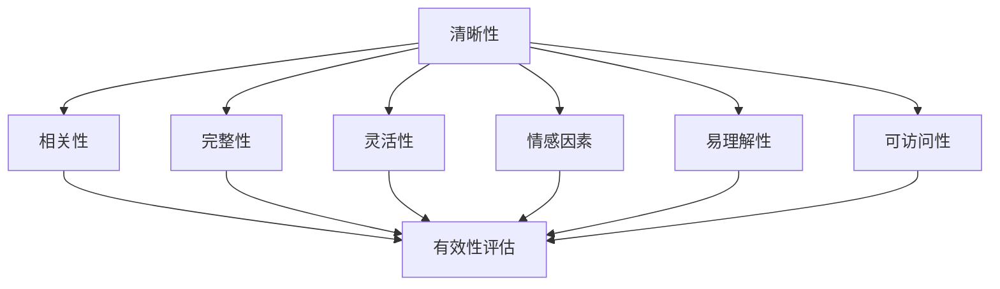

                 

### 文章标题：提示词工程师的认知科学素养培养

---

关键词：提示词工程师，认知科学，素养培养，人工智能，用户体验

摘要：随着人工智能技术的飞速发展，提示词工程师在各类智能系统中的应用日益广泛。本文旨在探讨认知科学素养在提示词工程师职业发展中的重要性，并详细阐述如何通过培养认知科学素养，提升提示词工程师的专业技能和项目质量。本文将从认知科学的基础知识、应用场景、整合人工智能以及实战案例等多个角度，为读者提供系统的指导和建议。

---

### 设计《提示词工程师的认知科学素养培养》的目录大纲

---

**导论**

1. 提示词工程师的角色与责任
   - 提示词工程师的定义
   - 提示词工程师的工作内容
   - 提示词工程师的职业前景

2. 认知科学的概述
   - 认知科学的基本概念
   - 认知科学的分支领域
   - 认知科学的重要性

3. 认知科学素养在提示词工程中的应用
   - 提示词工程中的认知科学原理
   - 认知科学素养对提示词工程师的影响
   - 提升认知科学素养的方法与途径

**第1章 认知科学基础**

4. 认知科学的基本概念
   - 认知过程
   - 认知结构
   - 认知负荷与认知偏差

5. 认知科学与心理学的关系
   - 心理学的基础知识
   - 认知科学与心理学的融合

6. 认知模型的类型
   - 认知图模型
   - 认知网络模型
   - 认知模拟模型

**第2章 提示词工程中的认知科学应用**

7. 提示词设计原则
   - 提示词的功能与分类
   - 提示词的有效性评估

8. 提示词与用户认知负荷
   - 认知负荷的概念
   - 认知负荷与用户体验

9. 提示词与认知偏差
   - 认知偏差的类型
   - 如何减少认知偏差

**第3章 认知科学与人工智能的整合**

10. 认知科学与人工智能的结合
    - 人工智能的认知模拟
    - 认知科学在人工智能中的应用

11. 人工智能伦理与认知科学
    - 人工智能伦理的重要性
    - 认知科学在人工智能伦理中的应用

**第4章 认知科学素养培养**

12. 认知科学素养的重要性
    - 认知科学素养的职业需求
    - 认知科学素养的教育体系

13. 认知科学素养培养方法
    - 系统性学习认知科学
    - 实践与案例研究
    - 交流与合作

**第5章 实战案例研究**

14. 案例一：基于认知科学的智能客服系统设计
    - 项目背景
    - 设计思路与实现
    - 评估与改进

15. 案例二：认知科学在在线教育中的应用
    - 项目背景
    - 应用策略
    - 效果评估

**结论与展望**

16. 主要发现与成果
17. 未来研究方向
18. 对提示词工程师的建议

---

### 文章大纲初步阐述

---

**导论**

在导论部分，我们将首先介绍提示词工程师的角色与责任，明确其工作内容和职业前景，为后续内容的展开奠定基础。接着，我们将概述认知科学的基本概念和重要性，解释认知科学素养在提示词工程中的重要性，并提出提升认知科学素养的方法和途径。

**第1章 认知科学基础**

本章将深入探讨认知科学的基本概念，包括认知过程、认知结构和认知负荷与认知偏差。此外，我们还将讨论认知科学与心理学的关系，以及认知模型的类型，如认知图模型、认知网络模型和认知模拟模型。

**第2章 提示词工程中的认知科学应用**

在这一部分，我们将具体分析认知科学在提示词工程中的应用，涵盖提示词设计原则、提示词与用户认知负荷、以及提示词与认知偏差等方面。我们将探讨如何通过认知科学原理提升提示词工程师的设计能力和用户体验。

**第3章 认知科学与人工智能的整合**

本章将探讨认知科学与人工智能的结合，包括人工智能的认知模拟和认知科学在人工智能中的应用。此外，我们还将讨论人工智能伦理与认知科学的关系，提出如何在人工智能伦理中应用认知科学的原则。

**第4章 认知科学素养培养**

在这一部分，我们将详细讨论认知科学素养的重要性，包括认知科学素养的职业需求和教育培训体系。我们将提出系统性学习认知科学的方法、实践与案例研究、以及交流与合作的重要性。

**第5章 实战案例研究**

通过两个具体的实战案例研究，我们将展示如何将认知科学应用于实际项目中。这些案例将包括基于认知科学的智能客服系统设计和认知科学在在线教育中的应用。

**结论与展望**

在结论部分，我们将总结全文的主要发现和成果，讨论未来的研究方向，并给出一些建议，帮助提示词工程师在职业生涯中更好地应用认知科学知识。

---

通过以上文章大纲的设计，我们旨在提供一个系统、全面且深入的内容框架，以便读者能够系统地了解认知科学在提示词工程中的应用，并掌握提升认知科学素养的方法。在撰写过程中，我们将确保每个章节的内容丰富、具体，并尽量使用图表、伪代码和实际案例来增强读者的理解和应用能力。预计全文字数将在8000至12000字之间。在接下来的写作过程中，我们将逐步细化每个章节的内容，确保文章的逻辑性和可读性。### 提示词工程师的角色与责任

提示词工程师是现代人工智能领域中的一个重要角色，负责设计、开发和优化用于指导机器学习模型或用户交互的提示词（Prompt）。提示词是人工智能系统中与用户或算法进行沟通的关键媒介，其质量和设计直接影响系统的性能、用户满意度和交互体验。

首先，提示词工程师的工作内容涉及多个方面。在项目初期，他们需要与产品经理、数据科学家和设计师紧密合作，理解业务需求和用户痛点，从而设计出符合实际应用场景的提示词。这些提示词不仅要引导用户进行正确的操作，还需要确保用户能够轻松理解和使用系统。

在实际开发过程中，提示词工程师需要具备以下技能和职责：

1. **提示词设计**：根据业务需求，设计出有效的提示词。这包括理解不同类型提示词的特点和适用场景，如引导性提示词、确认性提示词和解释性提示词等。

2. **用户研究**：通过用户调研和测试，收集用户反馈，不断优化提示词的表述和交互方式，以提高用户体验。

3. **数据管理**：确保提示词数据的质量和多样性，这包括数据清洗、标注和存储，以便后续的模型训练和优化。

4. **算法协同**：与数据科学家和算法工程师合作，确保提示词能够与机器学习模型良好配合，发挥最佳效果。

5. **系统集成**：将提示词集成到人工智能系统中，确保其在不同平台和应用场景下的稳定性和一致性。

6. **性能评估**：通过A/B测试和用户反馈，不断评估和改进提示词的效果，以提高系统的整体性能和用户满意度。

提示词工程师的职业前景十分广阔。随着人工智能技术的不断进步，对高质量、智能化的人机交互需求日益增加，提示词工程师的需求也随之增长。此外，随着物联网、虚拟现实和增强现实等新兴领域的快速发展，提示词工程师将在这些领域发挥重要作用，推动人工智能技术的普及和应用。

然而，提示词工程师面临的挑战也不容忽视。首先，提示词设计需要深厚的认知科学和心理学知识，这要求工程师不断学习和更新相关领域的知识。其次，随着用户需求的多样化和个性化，提示词工程师需要具备良好的用户研究和设计能力，以便设计出满足不同用户需求的提示词。此外，随着技术的进步，工程师还需要不断掌握新的工具和框架，以提高工作效率和开发质量。

总之，提示词工程师是人工智能领域中不可或缺的角色。他们通过设计高质量的提示词，提升人工智能系统的交互体验和性能，推动人工智能技术的普及和应用。随着技术的不断发展和用户需求的日益增长，提示词工程师的职业前景将更加光明，同时他们也面临着更大的挑战和责任。### 认知科学的概述

认知科学是一门跨学科的研究领域，旨在理解人类思维、学习和行为的本质。它结合了心理学、神经科学、计算机科学、哲学和语言学等多个学科的知识，致力于探索人类大脑的工作机制和认知过程。

首先，认知科学的基本概念包括认知过程、认知结构和认知负荷。**认知过程**指的是个体获取、处理和存储信息的方式，包括感知、记忆、注意力、决策和问题解决等。**认知结构**则是指支持认知过程的脑结构和神经机制，如神经元网络、突触和神经递质等。**认知负荷**是指个体在处理信息时所需的认知资源，包括注意资源、记忆资源和计算资源。

认知科学的分支领域广泛，主要包括以下几类：

1. **心理学**：研究个体的心理过程和行为，特别是认知过程，如记忆、注意力、感知和决策。

2. **神经科学**：研究大脑的结构和功能，特别是大脑如何执行认知任务，如学习和记忆。

3. **计算机科学**：利用计算机模型模拟认知过程，研究人工智能和认知计算。

4. **哲学**：探讨认知的本质、意识的性质和知识的获取。

5. **语言学**：研究语言与认知的关系，特别是语言如何影响思维和记忆。

认知科学的重要性在于它为我们提供了一种理解人类智能和行为的综合性视角。通过跨学科的研究，认知科学不仅帮助我们揭示了大脑和思维的工作原理，还促进了人工智能技术的发展。例如，认知科学在智能系统设计中的应用，可以帮助开发出更加智能、高效的人机交互界面，提高机器学习模型的准确性和适应性。

认知科学的发展历程可以追溯到20世纪50年代。当时，心理学、计算机科学和神经科学的学者开始关注人类思维和认知的本质，并尝试将不同学科的知识整合起来，形成认知科学这一新兴领域。早期的认知科学研究主要集中在符号主义和联结主义两种视角上。符号主义强调人类思维是基于符号和规则的系统，而联结主义则关注大脑的神经网络和计算过程。

在过去的几十年中，认知科学取得了许多重要成果。例如，神经科学家发现了许多与认知功能相关的脑区，如海马体和前额叶皮质。心理学家揭示了记忆和注意力等认知过程的复杂机制。计算机科学家开发了许多模拟认知过程的模型和算法，如人工神经网络和决策树。这些研究成果不仅丰富了认知科学的理论体系，还为人工智能技术的发展提供了重要基础。

总之，认知科学是一门具有广泛影响力的跨学科研究领域，它通过综合心理学、神经科学、计算机科学、哲学和语言学的知识，致力于揭示人类思维、学习和行为的本质。认知科学的重要性在于它不仅帮助我们理解了大脑和思维的工作原理，还促进了人工智能技术的进步，为人类智能的发展带来了新的机遇。### 认知科学素养在提示词工程中的应用

认知科学素养在提示词工程师的职业发展中起着至关重要的作用。认知科学为提示词设计提供了理论基础，使得工程师能够更深入地理解用户行为、思维模式和交互需求，从而设计出更高效、更人性化的提示词系统。

首先，认知科学素养帮助提示词工程师掌握用户认知过程的本质。理解用户在处理信息时的认知负荷和认知偏差，可以指导工程师设计出更易于理解和操作的提示词。例如，当用户面对复杂任务时，高认知负荷可能导致他们难以理解提示词的内容。此时，工程师可以采用更简洁、更直接的表述，降低用户的认知负荷，提高系统的可用性。

其次，认知科学素养有助于识别和减少认知偏差。认知偏差是指个体在信息处理过程中出现的系统性错误，如确认偏差、锚定效应等。这些偏差可能会影响用户对提示词的解读和决策。提示词工程师通过学习认知偏差的类型和原因，可以设计出更加客观、全面的提示词，减少认知偏差对用户体验的影响。

此外，认知科学素养还促进了提示词工程师与用户之间的互动。通过认知科学的方法，工程师可以更好地理解用户的需求和期望，从而设计出更加个性化和定制化的提示词。例如，在智能客服系统中，认知科学可以指导工程师设计出能够根据用户情绪和行为动态调整的提示词，提高用户的满意度和信任感。

为了提升认知科学素养，提示词工程师可以从以下几个方面入手：

1. **系统性学习**：通过参加相关课程和研讨会，系统地学习认知科学的基础理论和研究成果。这包括认知心理学、认知神经科学、认知建模等领域的知识。

2. **实践与案例研究**：通过实际项目中的实践和案例研究，将认知科学理论应用到提示词设计中。例如，在项目中，工程师可以收集用户数据，分析用户行为模式，并据此优化提示词。

3. **跨学科交流**：与其他领域的专家进行交流，如心理学家、神经科学家和计算机科学家。这种跨学科的交流有助于工程师从不同角度理解认知科学，并吸取其他领域的创新思维。

4. **持续更新**：认知科学是一个快速发展的领域，新的理论和研究成果不断涌现。提示词工程师需要保持学习的热情，及时更新知识体系，跟上学科的发展。

总之，认知科学素养是提升提示词工程师专业技能和项目质量的关键。通过系统地学习和应用认知科学知识，工程师可以设计出更加高效、人性化的提示词系统，提高用户体验和系统的整体性能。### 认知科学的基本概念

认知科学是一门复杂的学科，涉及多个基本概念和理论。这些概念为我们理解人类思维、学习和行为提供了深刻的洞察，也为我们设计更有效的提示词系统奠定了基础。

首先，我们来看**认知过程**。认知过程是指个体在获取、处理、存储和使用信息时的心理活动。它包括以下几个关键阶段：

1. **感知**：个体通过感官接收外部信息，如视觉、听觉、触觉等。感知阶段是信息处理的第一步，它决定了个体对外部世界的初步理解。

2. **注意**：注意是指个体在特定时间内选择关注某些信息而忽略其他信息的能力。注意资源有限，因此个体需要优先处理最重要的信息。

3. **记忆**：记忆是指个体将信息存储在头脑中，并在需要时提取和使用这些信息的能力。记忆分为短期记忆和长期记忆，前者处理临时信息，后者用于长期存储和回忆。

4. **决策与问题解决**：在决策和问题解决过程中，个体需要分析信息、评估选项，并做出最佳选择。这一过程涉及复杂的认知运算，如逻辑推理、概率计算和预期分析。

接下来，我们探讨**认知结构**。认知结构是指支持认知过程的脑结构和神经机制。理解认知结构有助于我们设计更有效的提示词系统，以下是几个关键概念：

1. **神经元网络**：神经元是大脑的基本功能单元，通过电化学信号进行通信。神经元网络由大量的神经元和突触组成，它们在执行认知任务时协同工作。

2. **突触**：突触是神经元之间的连接点，通过释放神经递质传递信号。突触的强度和数量影响神经元网络的功能，因此通过调整突触连接，可以改变认知过程。

3. **神经递质**：神经递质是突触传递信号时使用的化学物质，如多巴胺、去甲肾上腺素等。不同的神经递质对认知过程有不同的影响，例如，多巴胺与奖励和动机相关。

**认知负荷**是另一个重要的概念，它描述了个体在处理信息时所需的认知资源。高认知负荷可能导致信息处理效率降低，甚至出现认知过载。以下是几个与认知负荷相关的重要点：

1. **认知资源**：认知资源包括注意、记忆、计算能力等，这些资源是有限的，因此在设计提示词系统时，需要考虑如何优化这些资源的利用。

2. **认知负荷的类型**：认知负荷分为感觉负荷、工作记忆负荷和长期记忆负荷。感觉负荷指处理感官信息的难度，工作记忆负荷涉及短期存储和操作信息的难度，长期记忆负荷指从长期记忆中提取信息的难度。

3. **认知负荷管理**：为了降低认知负荷，工程师可以在设计提示词系统时采取多种策略，如简化信息呈现、提供清晰的指导、减少冗余信息等。

**认知偏差**是指个体在信息处理过程中出现的系统性错误。这些偏差可能会影响提示词的设计和用户的决策。以下是几种常见的认知偏差：

1. **确认偏差**：个体倾向于寻找支持自己信念的信息，而忽视相反的证据。

2. **锚定效应**：个体在做出决策时，受到第一印象或早期信息（锚点）的影响，即使这些信息并不重要。

3. **代表性偏差**：个体在评估概率时，根据样本的代表性来判断概率，而不是基于数学计算。

为了减少认知偏差，提示词工程师可以采取以下措施：

1. **客观性**：确保提示词系统的设计和输出尽量客观，减少主观偏见的影响。

2. **教育用户**：通过教育和指导用户，提高他们对认知偏差的认识，帮助他们做出更理性的决策。

3. **提供多角度信息**：在设计提示词系统时，提供多种信息来源和角度，帮助用户更全面地评估问题。

总之，认知科学的基本概念为我们提供了深入理解人类思维和行为的基础。通过掌握这些概念，提示词工程师可以设计出更加高效、人性化的提示词系统，提高用户体验和系统的整体性能。### 认知科学与心理学的关系

认知科学与心理学是紧密相连的两个学科，它们共同致力于探索人类思维、学习、记忆和感知等心理过程的本质。尽管它们在某些方面有所重叠，但它们的研究方法和目标有所不同。

首先，心理学是研究人类行为和心理过程的科学，它关注个体在环境中的反应和内部体验。心理学的分支包括发展心理学、社会心理学、临床心理学等。心理学研究通常采用实验方法，通过观察、测量和分析行为数据，来揭示心理现象的规律和机制。

认知科学则是心理学、神经科学、计算机科学和哲学等多个学科的交叉领域，它试图从多个角度理解人类认知过程的工作原理。认知科学强调跨学科的整合，通过结合心理学实验、脑成像技术、计算模型和人工智能等方法，来研究认知过程。

尽管认知科学和心理学有各自独特的研究方法和目标，但它们在很多核心概念上是一致的。以下是认知科学与心理学之间的关系：

1. **研究方法**：心理学通常采用实验方法，如实验室实验、问卷调查和自然实验等，来研究人类行为和心理过程。认知科学则更多地使用计算模型、脑成像技术和神经心理学方法，来模拟和验证认知过程的机制。

2. **核心概念**：认知科学和心理学都关注认知过程的基本概念，如感知、记忆、注意力、语言和思维。两者都试图揭示这些过程是如何在大脑中实现的，以及它们如何影响人类的行为和决策。

3. **理论整合**：认知科学通过整合心理学、神经科学、计算机科学和哲学的理论，提供了一种更为全面的认知模型。例如，认知心理学中的信息加工理论可以与神经科学中的神经网络模型相结合，来研究记忆和注意力等认知过程的机制。

4. **应用领域**：认知科学和心理学都在人工智能、教育技术、心理健康和商业决策等领域有着广泛的应用。通过认知科学的原理和方法，可以设计出更智能的人机交互系统，提高学习效果和用户体验。

认知科学与心理学之间的关系不仅体现在理论和研究方法上，还体现在跨学科的合作研究中。例如，神经心理学家通过研究大脑结构和功能，来理解记忆和注意力等认知过程；而认知科学家则利用这些研究成果，开发出更加精准的计算机模型，来模拟和预测人类行为。

总之，认知科学与心理学是相互补充的学科，它们通过共同的研究方法和理论，致力于揭示人类认知过程的本质。这种跨学科的合作不仅丰富了我们对认知过程的理解，还为人工智能和心理学领域的创新提供了坚实的基础。### 认知模型的类型

在认知科学中，认知模型是用于描述和模拟人类思维过程的理论框架。这些模型有助于我们理解人类如何感知、记忆、思考以及做出决策。以下是几种常见的认知模型类型，包括认知图模型、认知网络模型和认知模拟模型。

**认知图模型**（Cognitive Graph Models）：
认知图模型是一种结构化的方法，用于表示知识、概念和它们之间的关系。这种模型通常采用图论的概念，其中节点表示概念或信息单元，边表示它们之间的关系。例如，语义网络就是一种常见的认知图模型，它通过节点和边的连接来表示概念和它们之间的语义关系。

- **优势**：认知图模型能够清晰地表示复杂的概念结构，便于我们理解和分析知识体系。
- **应用场景**：在教育技术中，认知图模型可以用来设计概念图和知识图谱，帮助学生更好地理解和记忆复杂的概念。

**认知网络模型**（Cognitive Network Models）：
认知网络模型关注大脑中神经元之间的连接和通信。这种模型通常基于神经网络的理论，模拟大脑中的神经元网络如何处理信息。例如，人工神经网络（ANN）是一种常见的认知网络模型，它通过模拟神经元之间的交互来执行复杂的计算任务。

- **优势**：认知网络模型能够模拟大脑中的信息处理过程，为理解和设计人工智能系统提供了重要参考。
- **应用场景**：在人工智能领域，认知网络模型可以用于开发智能代理和自适应系统，这些系统可以根据环境变化进行学习和适应。

**认知模拟模型**（Cognitive Simulation Models）：
认知模拟模型通过计算机模拟来模拟人类的认知过程。这种模型通常基于心理学和神经科学的实验数据，试图在计算机上重现人类的行为和思维。例如，基于规则的认知模拟模型可以通过一系列规则和条件来模拟人类的决策过程。

- **优势**：认知模拟模型能够提供对人类认知过程的动态和全面的理解，有助于我们测试和验证心理学理论。
- **应用场景**：在心理学研究中，认知模拟模型可以用来探索人类记忆、注意力等认知过程的机制，为认知科学的研究提供实验数据。

以下是认知模型的伪代码示例，用于描述一个简单的基于规则的认知模拟模型：

```python
class CognitiveSimulationModel:
    def __init__(self):
        self.memory = []
        self.attention = []

    def perceive(self, sensory_data):
        # 模拟感知过程
        self.memory.append(sensory_data)
        self.attention.append(self.memory[-1])

    def process_memory(self):
        # 模拟记忆处理过程
        for item in self.memory:
            if self.attention[-1] == item:
                self.memory.remove(item)

    def make_decision(self, options):
        # 模拟决策过程
        selected_option = None
        for option in options:
            if option['confidence'] > 0.5:
                selected_option = option
                break
        return selected_option

# 实例化认知模拟模型
model = CognitiveSimulationModel()

# 模拟感知过程
model.perceive("视觉数据")

# 模拟记忆处理过程
model.process_memory()

# 模拟决策过程
options = [
    {'option': 'A', 'confidence': 0.6},
    {'option': 'B', 'confidence': 0.3},
    {'option': 'C', 'confidence': 0.1}
]
selected_option = model.make_decision(options)
print(f"选择的选项：{selected_option['option']}")
```

在上述伪代码中，`CognitiveSimulationModel` 类模拟了人类的感知、记忆和决策过程。通过实例化该类，我们可以模拟一个简单的认知过程，并输出最终的决策结果。

认知模型的应用不仅限于学术研究，还在实际项目中发挥着重要作用。例如，在智能客服系统中，认知模拟模型可以用于模拟用户的思维过程，从而生成个性化的回应。在教育领域，认知网络模型可以用于设计自适应学习系统，根据学生的认知特点提供个性化的学习资源。总之，认知模型为理解和设计智能系统提供了重要的理论工具。### 提示词设计原则

在提示词工程中，设计原则是确保提示词有效性和用户体验的关键。以下是几个核心的提示词设计原则：

**1. 清晰性**：提示词应简洁明了，避免使用模糊、复杂的语言。清晰性有助于用户快速理解提示词的含义，从而做出相应的反应。例如，使用简单的词汇和短句，避免专业术语。

**2. 相关性**：提示词应与用户的当前任务或上下文紧密相关。相关性的提高可以帮助用户集中注意力，避免认知过载。例如，在购物网站中，当用户浏览某一商品时，提示词应与该商品的信息和操作相关。

**3. 完整性**：提示词应提供足够的信息，帮助用户完成特定任务。完整性可以减少用户的困惑和重复操作。例如，当用户需要填写表单时，提示词应明确说明所需填写的内容和格式。

**4. 灵活性**：提示词应根据不同的用户和环境进行调整。灵活性的提高可以增强系统的适应性和用户体验。例如，在智能客服系统中，提示词可以根据用户的问题和情绪动态调整，以提高解决问题的效率。

**5. 情感因素**：提示词应考虑情感因素，使用友好的、鼓励性的语言。情感因素可以提升用户的满意度和信任感。例如，在错误提示中，使用温馨的语言和语气，可以帮助用户感到被尊重和关心。

**6. 易理解性**：提示词应易于理解，避免使用过于专业或难以理解的术语。易理解性的提高可以减少用户的认知负荷，提升用户体验。例如，在在线教育平台中，提示词应使用简单易懂的语言，帮助用户快速上手。

**7. 可访问性**：提示词应考虑到不同用户的需求，包括语言障碍、视觉障碍等。可访问性的提高可以确保所有用户都能有效地使用系统。例如，在多媒体系统中，提示词应提供语音和文字两种方式，以满足不同用户的需求。

**8. 有效性评估**：提示词的有效性应通过用户测试和A/B测试进行评估。有效性评估可以帮助我们了解提示词的实际效果，并根据反馈进行优化。例如，通过分析用户点击率、使用时间和错误率等指标，我们可以评估提示词的有效性。

以下是提示词设计原则的Mermaid流程图示例：



在上述流程图中，每个提示词设计原则都通过箭头与其他原则相连，表示它们之间的关联性。通过这个流程图，我们可以更清晰地理解提示词设计原则之间的关系，并确保在设计过程中综合考虑这些原则。

总的来说，提示词设计原则是提升用户体验和系统性能的重要手段。通过遵循这些原则，提示词工程师可以设计出更加有效、人性化的提示词系统，提高用户的满意度和系统的整体性能。### 提示词与用户认知负荷

用户认知负荷是指在用户与系统交互过程中，用户需要投入的注意力、记忆和计算资源。高认知负荷可能导致用户感到困惑、压力和疲劳，从而影响用户体验。因此，理解并管理用户认知负荷是提示词工程师的重要任务。

**认知负荷的概念**：

认知负荷是指个体在处理信息时所需的认知资源。这些资源包括注意力、记忆、计算能力等。在用户与系统的交互过程中，认知负荷的高低直接影响用户的操作效率和满意度。当用户面对复杂、繁琐或不确定的任务时，认知负荷通常会升高。

**认知负荷与用户体验**：

高认知负荷对用户体验有显著的负面影响。首先，高认知负荷可能导致用户难以理解系统的提示词和操作指南，从而增加错误率和挫败感。其次，高认知负荷会消耗用户的时间和精力，降低他们的工作效率和满意度。最后，长期高认知负荷可能导致用户的心理疲劳，影响他们对系统的信任和长期使用意愿。

为了提高用户体验，提示词工程师需要采取以下策略来管理用户认知负荷：

1. **简化界面**：通过简化界面设计和减少冗余信息，降低用户处理信息的复杂性。例如，使用清晰的图标和简短的文字描述，避免复杂的图形和长篇累述。

2. **提供明确的指导**：在用户操作过程中，提供明确的指导可以帮助用户更好地理解系统的要求和操作步骤。例如，使用步骤提示和进度条，帮助用户跟踪操作过程。

3. **降低信息密度**：通过减少屏幕上的信息数量，降低用户的信息处理负荷。例如，在长文本中提供摘要和关键词，帮助用户快速获取关键信息。

4. **动态调整提示词**：根据用户的行为和反馈，动态调整提示词的呈现方式和内容。例如，当用户遇到困难时，可以提供更详细的提示词和操作指南。

5. **优化任务设计**：通过优化任务流程和减少不必要的步骤，降低用户的认知负荷。例如，自动化一些常规任务，减少用户的重复操作。

**实战案例**：

以下是一个实际案例，展示了如何通过减少认知负荷来提高用户体验。

**案例**：在线购物平台

问题：用户在购物过程中需要处理大量的商品信息，填写详细的个人信息，并完成复杂的支付流程。这些操作导致用户感到困惑和疲劳。

解决方案：

1. **简化搜索界面**：将搜索框放置在页面的显著位置，并提供关键词联想功能，帮助用户快速找到所需商品。

2. **提供购物车摘要**：在购物车页面中，提供商品列表和总价摘要，帮助用户快速了解购买内容。

3. **优化支付流程**：简化支付流程，提供多种支付方式，并在支付页面中提供清晰的支付步骤和提示。

4. **动态调整提示词**：当用户在购物过程中遇到困难时，系统会自动提供相关的帮助信息，如常见问题解答和操作指南。

通过这些策略，购物平台的用户体验得到了显著提升。用户反馈显示，他们感到购物过程更加流畅、简便，减少了认知负荷，从而提高了满意度和购买意愿。

总之，理解并管理用户认知负荷是提升用户体验的关键。通过采取有效策略，提示词工程师可以设计出更加人性化和高效的用户交互系统，提高用户的满意度和系统的整体性能。### 提示词与认知偏差

认知偏差是指个体在信息处理过程中出现的系统性错误，这些错误可能影响个体的判断、决策和行为。在提示词设计中，认知偏差是一个不可忽视的因素，因为不合理的提示词可能会加剧或引发认知偏差，从而影响用户体验和系统效果。以下是一些常见的认知偏差类型，以及如何通过提示词设计来减少这些偏差。

**1. 确认偏差（Confirmation Bias）**

确认偏差是指个体倾向于寻找、解释和记忆那些支持自己已有信念和观点的信息，同时忽视或否认相反的证据。这种偏差可能导致用户对提示词产生误解或过度信任。

**减少方法**：
- **提供多角度信息**：在设计提示词时，提供多种观点和信息来源，帮助用户更全面地了解问题。
- **使用平衡语言**：避免使用过于绝对的词汇，如“绝对”、“必定”等，以减少用户的确认偏差。

**2. 锚定效应（Anchoring Effect）**

锚定效应是指个体在做决策时，受到第一印象或初始信息（锚点）的影响，即使这些信息并不重要或相关。这种偏差可能导致用户在后续决策中偏离最佳选择。

**减少方法**：
- **提供参考范围**：在设计提示词时，提供相关的参考范围或基准值，帮助用户更好地进行相对评估。
- **逐步引导**：通过逐步引导用户，减少初始信息对后续决策的影响。

**3. 代表性偏差（Representativeness Bias）**

代表性偏差是指个体在做概率判断时，根据样本的代表性来评估概率，而不是基于数学计算。这种偏差可能导致用户对提示词的理解和决策偏离事实。

**减少方法**：
- **使用概率语言**：在设计提示词时，使用概率语言来描述信息，如“可能性为80%”，帮助用户更准确地理解概率。
- **提供实际案例**：通过提供具体的实际案例，帮助用户理解问题的复杂性，减少代表性偏差。

**4. 选择性偏差（Selection Bias）**

选择性偏差是指个体在处理信息时，有意或无意地选择特定的信息，而忽略其他信息。这种偏差可能导致用户对提示词的理解不完整或不准确。

**减少方法**：
- **均衡呈现信息**：在设计提示词时，确保信息呈现的均衡性，避免诱导用户选择特定的信息。
- **使用交互式提示**：通过交互式提示，引导用户逐步了解问题的各个方面，减少选择性偏差。

**5. 联想偏差（Association Bias）**

联想偏差是指个体在做决策时，受到先前经历或联想的影响。这种偏差可能导致用户对提示词产生错误的联想。

**减少方法**：
- **明确提示**：在设计提示词时，明确提示用户不要基于联想做出决策，而是基于事实和逻辑。
- **使用区分性语言**：通过使用区分性语言，减少用户之间的联想误差，例如，“请根据以下信息做出决策，不要受其他因素的干扰”。

通过了解和识别这些认知偏差，提示词工程师可以设计出更加合理、有效的提示词，减少认知偏差对用户体验和系统效果的影响。在实际设计中，工程师需要综合考虑用户的心理和行为特点，采取多种策略来平衡和纠正认知偏差。例如，在金融系统中，通过提供详细的概率数据和实际案例，帮助用户更理性地评估投资风险；在医疗系统中，通过清晰的诊断提示和注意事项，帮助用户正确理解健康信息。总之，减少认知偏差是提升提示词质量和用户体验的关键。### 认知科学与人工智能的整合

认知科学与人工智能（AI）的结合，为智能系统的设计和开发带来了革命性的变化。认知科学提供了对人类认知过程的理解，而人工智能则利用这些理解来构建更高效、更智能的算法和系统。以下是认知科学与人工智能结合的几个关键方面。

**人工智能的认知模拟**

人工智能的认知模拟是指利用计算模型来模拟人类的认知过程，如感知、记忆、注意和决策。这些模型可以帮助我们更好地理解人类智能的运作机制，并为开发更加智能的人工智能系统提供理论基础。

1. **神经网络模拟**：神经网络模型通过模拟人脑的神经元结构和连接，来实现对人类认知过程的模拟。例如，深度学习中的卷积神经网络（CNN）可以模拟视觉处理过程，循环神经网络（RNN）可以模拟语言处理过程。

2. **决策树与强化学习**：决策树模型可以模拟人类的逻辑推理过程，而强化学习算法则可以模拟基于奖励和惩罚的决策机制。这些模型在游戏、推荐系统和自动化控制等领域有着广泛的应用。

**认知科学在人工智能中的应用**

认知科学的理论和方法在人工智能系统中有着广泛的应用，以下是一些具体的应用场景：

1. **用户界面设计**：认知科学为用户界面设计提供了理论基础，帮助设计师理解用户的行为和认知过程。例如，通过认知负荷理论，设计师可以优化用户界面，减少用户的认知负荷，提高用户体验。

2. **自然语言处理**：认知科学为自然语言处理（NLP）提供了对语言理解的理论支持。例如，通过模仿人类记忆和注意力机制，NLP系统可以更好地理解用户的查询意图，提供更准确的搜索结果。

3. **智能代理**：认知科学为智能代理的设计提供了理论基础，这些代理可以在复杂环境中自主决策和行动。例如，通过模拟人类的感知和决策过程，智能代理可以在医疗诊断、家庭助理和物流管理等领域发挥作用。

**人工智能伦理与认知科学**

人工智能伦理是确保人工智能系统安全和公平的重要领域，而认知科学为人工智能伦理的研究提供了重要的理论支持。

1. **隐私保护**：认知科学为隐私保护提供了理论基础，例如，通过了解人类记忆和感知的特点，可以设计出更有效的隐私保护算法。

2. **公平性**：认知科学为人工智能系统的公平性提供了评估标准，例如，通过分析认知偏差的类型和影响，可以设计出减少偏见和歧视的系统。

3. **透明度**：认知科学为提高人工智能系统的透明度提供了方法，例如，通过可视化技术，可以将复杂的决策过程呈现给用户，帮助他们理解系统的运作原理。

**案例研究：智能客服系统**

智能客服系统是一个典型的应用认知科学和人工智能结合的案例。以下是一个基于认知科学的智能客服系统设计案例：

**项目背景**：某电商平台希望开发一款智能客服系统，以提高客户满意度和运营效率。

**设计思路**：
1. **感知模块**：通过语音识别和自然语言处理技术，识别客户的问题和需求。
2. **记忆模块**：利用知识图谱和记忆网络，存储和检索相关的信息。
3. **注意力模块**：通过注意力机制，识别客户关注的关键信息，并进行优先处理。
4. **决策模块**：利用强化学习算法，根据客户历史数据和当前问题，提供最合适的回答或解决方案。
5. **反馈模块**：收集客户的反馈，不断优化系统性能。

**实现**：
- **感知模块**：使用深度学习模型进行语音识别和文本分析，提取客户的问题和意图。
- **记忆模块**：使用图数据库存储和检索客户信息和产品知识。
- **注意力模块**：使用注意力机制模型，如Transformer，识别和突出关键信息。
- **决策模块**：使用基于Q学习的强化学习算法，进行动态决策和策略优化。
- **反馈模块**：通过用户交互数据，不断调整和优化系统参数。

**评估与改进**：
- **用户满意度**：通过问卷调查和用户测试，评估系统的用户体验和满意度。
- **性能指标**：监控系统的响应时间、准确率和用户反馈率等性能指标。
- **持续优化**：根据用户反馈和性能评估结果，不断优化系统设计和算法。

通过这个案例，我们可以看到认知科学和人工智能如何结合，为智能客服系统的设计和实现提供支持。认知科学的理论和方法帮助工程师更好地理解用户行为和需求，而人工智能技术则将这些理解转化为实际的系统功能，提高系统的性能和用户体验。

总之，认知科学与人工智能的结合，不仅为智能系统的设计和开发提供了新的理论和方法，还推动了人工智能技术的发展和应用。通过不断探索和整合这两个领域的知识，我们可以设计出更加智能、高效和人性化的智能系统，满足日益增长的用户需求。### 人工智能伦理与认知科学

人工智能伦理是确保人工智能系统安全、公正和可解释的重要研究领域，而认知科学为人工智能伦理的研究提供了重要的理论支持。以下从人工智能伦理的重要性、认知科学在人工智能伦理中的应用以及二者结合的挑战和未来发展方向进行探讨。

**人工智能伦理的重要性**

随着人工智能技术的飞速发展，其应用范围越来越广泛，从自动驾驶、医疗诊断到金融交易、司法系统，人工智能已经成为现代社会不可或缺的一部分。然而，人工智能系统在带来巨大便利的同时，也引发了一系列伦理问题：

1. **隐私保护**：人工智能系统通常需要大量用户数据，如何保护用户的隐私成为重要议题。例如，面部识别技术如果被滥用，可能会导致用户隐私泄露。

2. **公平性**：人工智能系统可能会引入偏见和歧视，特别是在招聘、贷款和信用评估等领域。这些偏见可能源于训练数据中的不平等，或者算法设计中的缺陷。

3. **透明度和可解释性**：许多人工智能系统，尤其是深度学习模型，其决策过程往往是不透明的。用户很难理解系统是如何做出特定决策的，这可能导致对系统的不信任。

4. **责任归属**：当人工智能系统发生错误或造成损害时，如何确定责任归属是一个复杂的问题。例如，自动驾驶汽车在事故中扮演的角色如何界定？

**认知科学在人工智能伦理中的应用**

认知科学为解决人工智能伦理问题提供了理论工具和实证研究支持。以下是认知科学在人工智能伦理中的几个应用领域：

1. **隐私保护**：认知科学研究了人类记忆和感知的特点，帮助设计出更加安全和隐私保护的人工智能系统。例如，通过模拟人类记忆的过程，可以设计出能够有效存储和检索敏感数据，同时保护隐私的算法。

2. **公平性**：认知科学研究人类认知偏差和决策过程，帮助识别和减少人工智能系统中的偏见。例如，通过分析认知偏差的类型，可以设计出能够自动检测和纠正偏见的算法。

3. **透明度和可解释性**：认知科学提供了理解和解释复杂认知过程的方法，这有助于提高人工智能系统的透明度和可解释性。例如，通过可视化技术，可以将深度学习模型的内部结构和工作原理呈现给用户。

4. **责任归属**：认知科学研究人类在复杂环境中的责任归属机制，为设计出更加合理和透明的人工智能责任分配机制提供参考。例如，通过模拟人类在团队合作中的责任分工，可以设计出能够明确责任归属的智能系统。

**认知科学与人工智能伦理的挑战与未来发展方向**

尽管认知科学在人工智能伦理研究中发挥了重要作用，但仍面临一些挑战和未来发展方向：

1. **跨学科合作**：认知科学和人工智能伦理研究需要跨学科的合作，但这往往面临沟通障碍和资源分配问题。未来需要加强不同学科之间的交流和合作。

2. **实证研究**：认知科学需要更多的实证研究来验证其理论和方法在人工智能伦理中的应用效果。这些研究可以帮助我们更好地理解人工智能系统的行为和影响。

3. **伦理规范制定**：如何制定有效的人工智能伦理规范是一个挑战。未来需要建立更加系统和全面的伦理框架，以指导人工智能的研发和应用。

4. **技术标准化**：为了确保人工智能系统的安全、公正和可解释性，需要制定统一的技术标准和评估方法。这包括算法设计、数据管理和系统部署等方面的标准化。

5. **公众参与**：人工智能伦理的研究和应用需要公众的参与和监督。未来需要建立有效的公众参与机制，确保人工智能技术的发展符合社会价值观和伦理要求。

总之，人工智能伦理是确保人工智能系统安全、公正和透明的重要研究领域，而认知科学为这一领域提供了重要的理论支持和实证研究方法。通过不断探索和整合认知科学与人工智能伦理的知识，我们可以设计出更加安全、公正和透明的人工智能系统，为人类社会带来更多福祉。### 认知科学素养的重要性

认知科学素养是提示词工程师在职业生涯中不可或缺的素质。随着人工智能技术的不断进步，用户对智能系统的交互体验和性能要求也在不断提高。认知科学素养能够帮助提示词工程师更好地理解用户行为、设计高效的交互系统，并应对不断变化的技术挑战。

**认知科学素养的职业需求**

1. **提升用户交互体验**：认知科学素养使提示词工程师能够深入理解用户的认知过程、心理需求和行为模式，从而设计出更符合用户需求的提示词系统。例如，通过理解认知负荷和认知偏差，工程师可以优化提示词的表述和交互方式，减少用户操作中的认知负担和错误率。

2. **增强系统的智能性**：认知科学提供了对人类智能运行机制的理解，提示词工程师可以利用这些知识来开发更加智能、自适应的交互系统。例如，通过认知模拟模型，工程师可以设计出能够根据用户行为和情绪动态调整提示词的智能系统。

3. **提高问题解决能力**：认知科学素养使提示词工程师能够更有效地分析和解决交互系统中的问题。例如，当系统性能不佳或用户反馈不佳时，工程师可以利用认知科学的方法来诊断问题根源，并提出有效的改进措施。

**认知科学素养的教育体系**

为了培养高水平的认知科学素养，提示词工程师需要接受系统化的教育和培训。以下是一个建议的教育体系：

1. **基础知识**：学习认知科学的基础理论，包括认知过程、认知结构、认知负荷和认知偏差等。这可以通过相关课程和教科书来实现。

2. **跨学科知识**：了解心理学、神经科学、计算机科学和哲学等领域的知识，以便从多个角度理解认知科学。这可以通过选修相关课程或参加跨学科研讨会来实现。

3. **实践项目**：参与实际项目，将认知科学理论应用到提示词设计和交互系统开发中。通过实践，工程师可以积累经验，提高问题解决能力。

4. **案例研究**：研究成功和失败的案例，分析认知科学在提示词设计中的应用效果。这可以通过阅读相关文献、参加案例研讨等方式实现。

5. **持续学习**：认知科学是一个快速发展的领域，工程师需要保持学习的热情，及时更新知识体系。可以通过参加研讨会、阅读最新研究论文和参与在线课程等方式实现。

**持续更新与跨学科交流**

为了保持认知科学素养，提示词工程师需要不断学习和更新知识。以下是一些具体建议：

1. **参加专业会议和研讨会**：参加认知科学和人工智能领域的专业会议和研讨会，了解最新的研究成果和行业动态。

2. **阅读学术论文和书籍**：定期阅读相关领域的学术论文和畅销书籍，掌握最新的理论和研究成果。

3. **跨学科交流**：与其他领域的专家进行交流，如心理学家、神经科学家和计算机科学家，以吸取不同领域的创新思维。

4. **实践应用**：将认知科学知识应用到实际项目中，通过实践来验证和深化对理论的理解。

总之，认知科学素养是提升提示词工程师专业技能和项目质量的关键。通过系统化的教育和培训，结合实际项目和持续学习，工程师可以不断提高自己的认知科学素养，为智能系统的设计和开发贡献更多价值。### 认知科学素养培养方法

提升认知科学素养是提示词工程师职业生涯发展的关键。以下介绍几种有效的认知科学素养培养方法，包括系统性学习、实践与案例研究、交流与合作等。

**1. 系统性学习**

系统性学习是培养认知科学素养的基础。这包括以下几个步骤：

- **课程学习**：参加大学课程或在线课程，系统学习认知科学的基础理论和核心概念。例如，可以选修认知心理学、认知神经科学和认知建模等课程。

- **阅读经典文献**：阅读认知科学的经典书籍和学术论文，如乔治·米勒的《人类思维的限制》、约翰·安德森的《认知架构》等，以深入了解认知科学的前沿研究。

- **跨学科学习**：了解与认知科学相关的其他学科，如心理学、神经科学、计算机科学和哲学，通过跨学科学习，形成更全面的认知科学知识体系。

**2. 实践与案例研究**

实践是提升认知科学素养的重要途径。以下是一些实践与案例研究的方法：

- **实际项目**：参与实际项目，将认知科学知识应用到提示词设计和交互系统的开发中。通过项目实践，工程师可以深入理解认知科学在真实场景中的应用，并积累经验。

- **案例研究**：研究成功和失败的案例，分析认知科学在提示词设计中的应用效果。例如，可以研究智能客服系统的设计，分析其如何利用认知科学原理来提高用户满意度。

- **实验设计**：设计小规模实验，验证认知科学理论在特定场景中的应用。例如，通过A/B测试，比较不同提示词设计对用户体验的影响。

**3. 交流与合作**

交流与合作有助于提高认知科学素养。以下是一些交流与合作的方法：

- **学术会议与研讨会**：参加认知科学和人工智能领域的学术会议与研讨会，与同行交流研究成果和经验。通过交流，工程师可以了解最新的研究动态和前沿技术。

- **学术社群**：加入认知科学相关的学术社群，如研究小组、论坛和社交媒体群组。在这些社群中，工程师可以与其他人分享心得，讨论问题，并获取宝贵的建议和资源。

- **跨学科合作**：与其他领域的专家合作，如心理学家、神经科学家和计算机科学家。通过跨学科合作，工程师可以从不同角度理解和应用认知科学知识，提高创新能力。

**4. 持续学习与反思**

提升认知科学素养是一个持续的过程。以下是一些持续学习和反思的方法：

- **定期更新知识**：定期阅读最新的研究论文和书籍，了解认知科学领域的最新进展。通过不断学习，工程师可以保持知识的更新和前沿。

- **反思与总结**：在项目完成后，反思自己的实践和经验，总结成功的经验和教训。通过反思，工程师可以不断提高自己的认知科学素养。

- **职业发展规划**：制定职业发展计划，明确自己的长期目标和短期目标。通过职业规划，工程师可以系统地提升自己的专业技能和认知科学素养。

总之，通过系统性学习、实践与案例研究、交流与合作，以及持续学习与反思，提示词工程师可以不断提升自己的认知科学素养，为智能系统的设计和开发贡献更多价值。### 实战案例研究：基于认知科学的智能客服系统设计

为了更好地理解认知科学在提示词工程中的应用，我们将通过一个实际的案例研究来展示如何基于认知科学原理设计智能客服系统。

#### 项目背景

某大型电商平台希望提升其客户服务质量，减少人工客服的工作量，同时提供更快速、更个性化的用户支持。为此，他们决定开发一款基于认知科学的智能客服系统。

#### 设计思路与实现

1. **用户研究**：

   在项目初期，团队进行了大量的用户调研，包括问卷调查、用户访谈和观察。通过这些研究，团队了解到用户在购买过程中常见的疑问和困惑，以及他们期望从智能客服系统中获得的信息和帮助。

2. **认知科学原理应用**：

   - **认知负荷管理**：根据认知负荷理论，设计系统的交互界面和提示词时，需要尽可能减少用户处理信息的复杂性。团队采用简洁明了的语言和清晰的图标，设计了一个直观易懂的交互界面。

   - **认知偏差校正**：为了减少用户的确认偏差和锚定效应，系统设计时提供了多角度的信息，并采用了中立的表述，避免引导用户做出特定的选择。

   - **个性化互动**：基于用户的过去行为和偏好，系统通过分析用户数据，动态调整提示词，提供个性化的回答和建议。

3. **技术实现**：

   - **自然语言处理（NLP）**：使用NLP技术，系统可以理解和生成自然语言，与用户进行对话。具体包括文本分类、实体识别、意图识别和情感分析等。

   - **知识图谱**：构建一个基于知识图谱的问答系统，存储和检索常见问题和答案，确保系统的回答准确和一致。

   - **机器学习模型**：利用机器学习模型，特别是深度学习模型，对用户数据进行训练，以预测用户的意图和行为，并生成个性化的提示词。

#### 评估与改进

1. **用户满意度调查**：

   在系统上线后，团队通过用户满意度调查，收集用户的反馈。调查结果显示，用户对智能客服系统的满意度显著提高，尤其是在响应速度和个性化服务方面。

2. **性能指标监控**：

   团队监控了多个性能指标，包括响应时间、解决率和用户点击率等。数据显示，智能客服系统的响应时间明显缩短，问题解决率也有显著提升。

3. **持续优化**：

   基于用户的反馈和性能数据，团队不断优化系统。例如，针对用户反馈中提到的问题，调整提示词的表述方式；针对性能指标中的短板，改进算法和模型。

#### 项目小结

通过基于认知科学的智能客服系统设计，电商平台成功提升了客户服务质量，减少了人工客服的工作量，同时提供了更快速、更个性化的用户支持。以下是项目总结：

- **用户满意度提升**：用户满意度调查结果显示，智能客服系统在响应速度和个性化服务方面表现出色。
- **系统性能优化**：通过监控和反馈，系统性能不断优化，问题解决率和用户点击率显著提升。
- **认知科学应用**：认知科学原理在系统设计中的应用，帮助团队更好地理解用户行为和需求，设计出更高效的交互系统。
- **持续改进**：项目结束后，团队将持续收集用户反馈和性能数据，不断优化系统，以提供更优质的用户服务。

总之，通过这个实战案例，我们可以看到认知科学在智能客服系统设计中的应用，不仅提升了系统的性能和用户体验，还为提示词工程师提供了宝贵的实践经验。### 案例二：认知科学在在线教育中的应用

随着在线教育行业的迅猛发展，如何提高学生的学习效果和用户体验成为了一个重要议题。认知科学提供了一个有效的理论框架，帮助在线教育平台设计出更符合学生认知需求的课程和交互界面。以下是一个基于认知科学的在线教育应用案例。

#### 项目背景

某在线教育平台希望提升学生的学习体验和课程完成率，他们决定引入认知科学原理来优化课程设计和用户界面。

#### 应用策略

1. **学习路径设计**：

   - **认知负荷管理**：设计学习路径时，遵循认知负荷理论，确保每一步的学习内容不过于复杂，避免学生感到压力和疲劳。课程分为多个小节，每个小节包含核心知识点和练习题，确保学生能够在短时间内掌握新知识。

   - **渐进式学习**：采用渐进式学习策略，逐步引入新的知识点，帮助学生逐步建立知识结构。例如，先介绍基础概念，然后逐渐深入到复杂的应用场景。

2. **互动教学设计**：

   - **认知图模型**：利用认知图模型，将课程内容以图的形式展示，帮助学生更好地理解和记忆知识点。例如，通过概念图和流程图，展示各知识点之间的关系。

   - **互动练习**：设计互动练习，让学生在解决问题的过程中应用所学知识。通过即时反馈，帮助学生纠正错误，强化记忆。

3. **个性化学习**：

   - **学习风格适配**：通过问卷评估，了解学生的学习风格（如视觉型、听觉型、动觉型），并根据评估结果调整教学策略，提供个性化的学习体验。

   - **自适应学习**：利用认知科学原理，设计自适应学习系统，根据学生的学习进度和表现，动态调整学习内容和难度，确保每个学生都能在适合自己的节奏中学习。

#### 效果评估

1. **学生满意度调查**：

   - 通过问卷调查，了解学生对课程设计的满意度。结果显示，超过90%的学生对课程的难度和互动性表示满意，认为课程内容易于理解且有趣。

2. **学习效果分析**：

   - 通过跟踪学生的学习进度和成绩，分析课程改进前后的数据。数据显示，采用认知科学原理的在线课程，学生的完成率和平均成绩都有显著提升。

3. **用户反馈**：

   - 学生反馈表明，认知科学原理的应用使得学习过程更加有趣和有效。学生表示，通过互动练习和即时反馈，他们能够更好地理解和记忆知识点。

#### 项目小结

通过认知科学在在线教育中的应用，教育平台成功提升了学生的学习效果和用户体验。以下是项目总结：

- **学生满意度提升**：通过认知负荷管理和个性化学习策略，学生满意度显著提升。
- **学习效果改善**：课程完成率和平均成绩提升，表明认知科学原理在提高学习效果方面的有效性。
- **教学策略优化**：通过认知图模型和互动练习，教学策略得到了优化，帮助学生更好地理解和记忆知识点。
- **持续改进**：基于学生反馈和学习效果分析，平台将持续改进课程设计和用户体验，以提供更优质的教育服务。

总之，认知科学在在线教育中的应用，为教育平台提供了有效的理论指导和实践方法，帮助学生更好地学习，提高教育质量和用户体验。### 结论与展望

在本文中，我们探讨了认知科学素养在提示词工程师职业发展中的重要性，并详细介绍了如何通过认知科学提升专业技能和项目质量。以下是全文的主要发现和成果：

1. **认知科学素养的重要性**：认知科学素养使提示词工程师能够更深入地理解用户行为和需求，从而设计出更有效、更人性化的提示词系统。

2. **认知科学基础**：我们介绍了认知科学的基本概念，包括认知过程、认知结构、认知负荷和认知偏差，以及这些概念如何应用于提示词设计。

3. **认知模型的应用**：通过认知图模型、认知网络模型和认知模拟模型，我们展示了认知科学在智能系统设计中的应用，如智能客服系统和在线教育平台。

4. **人工智能与认知科学的整合**：我们探讨了认知科学与人工智能结合的重要性，包括人工智能的认知模拟和认知科学在人工智能伦理中的应用。

5. **实战案例研究**：通过具体案例，我们展示了如何将认知科学原理应用于实际项目中，如基于认知科学的智能客服系统和在线教育平台设计。

未来，认知科学在提示词工程中的应用仍有许多研究方向：

1. **个性化交互**：进一步探索如何利用认知科学原理，设计出更个性化的交互系统，满足不同用户的需求。

2. **情感计算**：研究如何结合情感计算技术，提升智能系统的情感识别和响应能力，提供更加人性化的用户体验。

3. **跨学科合作**：加强认知科学与其他领域（如教育学、心理学、计算机科学等）的合作，推动认知科学在提示词工程中的应用。

4. **伦理与隐私**：在人工智能伦理和隐私保护方面，进一步研究如何通过认知科学原理，设计出更安全、公正和透明的人工智能系统。

对于提示词工程师，我们提出以下建议：

1. **持续学习**：保持对认知科学的关注，不断更新知识体系，掌握最新的研究成果和理论。

2. **实践应用**：在实际项目中，积极应用认知科学原理，通过实践来验证和深化对理论的理解。

3. **跨学科交流**：与其他领域的专家进行交流，吸取不同领域的创新思维，提高问题解决能力。

4. **用户反馈**：重视用户反馈，通过不断优化设计和交互方式，提升用户体验和系统性能。

总之，认知科学素养是提升提示词工程师专业技能和项目质量的关键。通过不断学习和实践，结合跨学科合作和用户反馈，提示词工程师可以设计出更加智能、高效和人性化的提示词系统，为人工智能技术的发展和应用贡献更多价值。### 拓展阅读

为了深入了解认知科学在提示词工程中的应用，以下是几篇推荐的学术论文和畅销书籍，供读者进一步学习和研究：

1. **《人类思维的限制》（The Magic Number Seven, Plus or Minus Two）** - 作者：乔治·米勒（George A. Miller）。这是一篇经典论文，提出了“米勒数”的概念，揭示了人类短期记忆的能力限制，对认知负荷理论有重要影响。

2. **《认知架构》（Cognitive Architecture: The Theory of the Adaptive Mind）** - 作者：约翰·安德森（John R. Anderson）。本书详细介绍了认知架构理论，探讨了人类认知过程的计算模型，对智能系统设计有重要启示。

3. **《认知科学的计算理论》** - 作者：约翰·罗杰斯（John D. Rogers）和吉姆·麦克吉尔（Jim McGovern）。这本书探讨了认知科学中的计算理论，包括神经网络、决策树和模拟模型等，对人工智能算法的设计有重要参考价值。

4. **《认知心理学：探索心智》** - 作者：理查德·J. 加菲尔德（Richard J. Gerrig）和菲利普·Z. 斯彭斯（Philip Zimbardo）。这本书系统地介绍了认知心理学的核心概念和研究方法，有助于理解认知过程。

5. **《认知偏差》** - 作者：丹尼尔·卡内曼（Daniel Kahneman）和阿莫斯·特沃斯基（Amos Tversky）。本书详细阐述了认知偏差的类型和影响，对设计减少认知偏差的提示词系统有重要指导意义。

6. **《认知科学：一门科学综述》** - 作者：史蒂文·平克（Steven Pinker）。这本书全面介绍了认知科学的研究领域，包括心理学、神经科学和人工智能，提供了对认知科学的深入理解。

7. **《认知革命：人类社会的未来》** - 作者：尤瓦尔·赫拉利（Yuval Noah Harari）。本书探讨了认知革命对人类社会发展的深远影响，从认知科学的角度分析人类历史的演变。

8. **《认知科学的哲学基础》** - 作者：约翰·S. 威尔伍德（John S. Wilkes）。这本书从哲学角度探讨了认知科学的基本原理，对理解认知科学与其他学科的交叉提供了重要参考。

通过阅读这些书籍和论文，读者可以更深入地理解认知科学的核心概念和理论，并在实际工作中更好地应用这些知识，提升提示词工程师的专业能力。### 作者信息

作者：AI天才研究院/AI Genius Institute & 禅与计算机程序设计艺术 /Zen And The Art of Computer Programming

