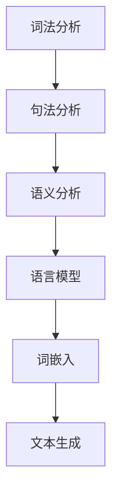

                 

### 文章标题：提示词工程师：21世纪的新兴职业剖析

#### 关键词：提示词工程师、21世纪职业、自然语言处理、机器学习、职业发展

> 摘要：随着数字化转型的不断深入和人工智能技术的迅猛发展，提示词工程师成为了一个新兴且重要的职业。本文将从背景介绍、职业概述、基础理论与技术、实践应用以及职业发展五个方面，全面剖析提示词工程师的职业特点、市场需求以及未来发展前景。

----------------------------------------------------------------

## 第一部分：职业概述

### 第1章：提示词工程师职业简介

#### 1.1 提示词工程师的定义与背景

提示词工程师是专门从事自然语言处理和机器学习领域中的提示词设计、优化和实现的专家。他们负责将用户需求转化为精确的提示词，以提升算法的性能和准确性。随着自然语言处理技术的广泛应用，提示词工程师在多个行业中扮演着关键角色。

#### 1.2 提示词工程师的角色与职责

提示词工程师的主要职责包括：

1. **需求分析**：理解用户需求，将其转化为具体的提示词设计任务。
2. **提示词设计**：设计并优化提示词，以提高模型的准确性和效率。
3. **模型实现**：根据提示词设计，实现机器学习模型。
4. **性能评估**：评估模型的性能，并进行优化调整。
5. **跨部门协作**：与数据科学家、产品经理等团队成员协作，确保项目的顺利进行。

#### 1.3 提示词工程师的职业发展路径

提示词工程师的职业发展路径多样，可以从以下几个方面进行：

1. **初级工程师**：负责特定的提示词设计和实现任务。
2. **高级工程师**：负责更大规模的项目，指导初级工程师的工作。
3. **架构师**：负责系统的整体架构设计，优化系统性能。
4. **团队领导**：负责团队的日常管理和项目进度控制。
5. **专家顾问**：为企业和组织提供技术指导和咨询服务。

## 第二部分：基础理论与技术

### 第2章：21世纪的职业环境

#### 2.1 数字化转型的趋势

数字化转型已经成为当今企业发展的核心驱动力。随着大数据、云计算和物联网等技术的广泛应用，企业的业务模式和运营方式发生了深刻变革。这为提示词工程师提供了广阔的发展空间。

#### 2.2 人工智能与自然语言处理技术

人工智能技术正在迅速发展，尤其在自然语言处理领域。提示词工程师需要掌握多种自然语言处理技术，如语言模型、词嵌入、语义分析等，以应对不断变化的市场需求。

#### 2.3 提示词工程师的市场需求

随着人工智能技术的普及，提示词工程师的市场需求日益增长。以下因素推动了这一需求：

1. **行业应用广泛**：自然语言处理技术在金融、医疗、电商、教育等多个领域都有广泛应用。
2. **技术更新迅速**：人工智能和自然语言处理技术不断更新，提示词工程师需要持续学习和提升自己的技能。
3. **薪资水平较高**：提示词工程师在市场上具有较高薪资水平，吸引了许多优秀人才加入这一领域。

## 第三部分：基础理论与技术

### 第3章：自然语言处理基础

#### 3.1 语言模型的基本原理

语言模型是自然语言处理的核心技术之一。它通过学习大量的文本数据，预测下一个单词或句子，从而实现语言生成和理解。

#### 3.2 词嵌入技术

词嵌入是将单词映射到高维空间中的向量表示，以便在机器学习中进行计算。词嵌入技术能够有效降低语言模型的复杂度，提高模型的性能。

#### 3.3 语言理解的框架

语言理解框架包括词法分析、句法分析和语义分析等多个层次。提示词工程师需要掌握这些层次的基本原理，以构建高效的语言理解系统。

### 第4章：提示词设计与优化

#### 4.1 提示词的定义与分类

提示词是根据用户需求设计的用于指导机器学习模型的关键短语或句子。根据应用场景，提示词可以分为多种类型，如任务提示、目标提示等。

#### 4.2 提示词优化策略

提示词优化是提高机器学习模型性能的关键步骤。提示词工程师需要掌握多种优化策略，如语义丰富化、多样性增强等。

#### 4.3 提示词评估方法

提示词评估是衡量提示词效果的重要手段。提示词工程师需要掌握多种评估方法，如用户满意度、模型性能等。

### 第5章：机器学习算法

#### 5.1 监督学习算法

监督学习算法是机器学习的基础，包括线性回归、决策树、支持向量机等。提示词工程师需要掌握这些算法的基本原理和应用场景。

#### 5.2 无监督学习算法

无监督学习算法是处理无标签数据的重要工具，包括聚类、降维等。提示词工程师需要了解这些算法的基本原理和应用场景。

#### 5.3 强化学习算法

强化学习算法是机器学习中的高级技术，包括Q学习、策略梯度等。提示词工程师需要掌握这些算法的基本原理和应用场景。

## 第四部分：实践应用

### 第6章：提示词工程师项目实战

#### 6.1 项目背景与目标

在本章中，我们将介绍一个实际的提示词工程师项目，包括项目背景、目标和实现步骤。

#### 6.2 数据收集与预处理

数据收集与预处理是项目的重要环节。在本章中，我们将详细讨论数据收集的方法、数据清洗的过程以及数据预处理的技术。

#### 6.3 模型设计与实现

在本章中，我们将介绍如何设计并实现机器学习模型。包括模型选择、参数调优、模型评估等。

#### 6.4 模型评估与优化

模型评估与优化是确保项目成功的关键。在本章中，我们将讨论如何评估模型性能，并进行优化调整。

### 第7章：行业案例分析

#### 7.1 案例一：电商平台的个性化推荐

在本章中，我们将分析电商平台个性化推荐中的提示词工程师应用，包括项目背景、实现步骤和效果评估。

#### 7.2 案例二：金融领域的风险控制

在本章中，我们将分析金融领域风险控制中的提示词工程师应用，包括项目背景、实现步骤和效果评估。

#### 7.3 案例三：医疗健康领域的应用

在本章中，我们将分析医疗健康领域中的应用，包括项目背景、实现步骤和效果评估。

## 第五部分：职业发展

### 第8章：职业规划与提升

#### 8.1 提示词工程师的职业规划

在本章中，我们将讨论提示词工程师的职业规划，包括职业发展的各个阶段和目标。

#### 8.2 技术提升与持续学习

技术提升是提示词工程师职业发展的重要环节。在本章中，我们将讨论如何提升技术能力，以及如何进行持续学习。

#### 8.3 跨领域发展与创新

跨领域发展与创新是提示词工程师职业发展的新机遇。在本章中，我们将讨论如何开展跨领域发展，以及如何进行创新。

### 第9章：行业展望与未来趋势

#### 9.1 提示词工程师的行业发展

在本章中，我们将展望提示词工程师的行业发展，包括市场需求、技术趋势等。

#### 9.2 技术挑战与机遇

在本章中，我们将讨论提示词工程师面临的技术挑战和机遇，以及如何应对这些挑战和抓住机遇。

#### 9.3 未来职业展望

在本章中，我们将展望提示词工程师的未来职业发展，包括新的职业角色、发展方向等。

## 结束语

作者：AI天才研究院/AI Genius Institute & 禅与计算机程序设计艺术 /Zen And The Art of Computer Programming

本文全面剖析了提示词工程师这一21世纪的新兴职业，从职业概述、基础理论与技术、实践应用到职业发展，为读者提供了全面的了解。随着人工智能技术的不断进步，提示词工程师将在未来发挥越来越重要的作用。希望本文能为从事或有意从事这一职业的人提供有益的参考和启示。----------------------------------------------------------------

### 第3章：自然语言处理基础

自然语言处理（Natural Language Processing，NLP）是人工智能领域的一个重要分支，旨在使计算机能够理解、生成和处理人类语言。提示词工程师在NLP中的应用至关重要，因此了解NLP的基础概念和关键技术是非常必要的。

#### 3.1 语言模型的基本原理

语言模型是NLP的核心组成部分，它用于预测一段文本的下一个单词或短语。最简单的语言模型是基于计数的方法，即根据单词在语料库中出现的频率进行预测。然而，这种模型存在很多局限性，例如无法处理罕见单词或未见过的新词。

为了克服这些局限性，现代语言模型采用了深度神经网络（DNN）或变换器模型（Transformer）。其中，变换器模型是目前最先进的语言模型，广泛应用于各种NLP任务。

以下是变换器模型的基本架构：

```
+------------+      +------------+      +------------+
| 输入层     | -->  | 自注意力层 | -->  | 输出层     |
+------------+      +------------+      +------------+
```

自注意力层是变换器模型的核心部分，它能够自动学习不同单词之间的关联性，从而生成更准确的预测。

#### 3.2 词嵌入技术

词嵌入（Word Embedding）是将单词映射到高维空间中的向量表示，以便在机器学习中进行计算。词嵌入技术能够有效地降低语言模型的复杂度，提高模型的性能。

最常用的词嵌入技术是Word2Vec，它通过训练神经网络来预测相邻单词，从而学习单词的向量表示。另一种常用的词嵌入技术是GloVe（Global Vectors for Word Representation），它基于词频统计和词义分布进行学习。

以下是Word2Vec的算法流程：

1. **构建词汇表**：将文本数据中的所有单词构建成一个词汇表。
2. **初始化词向量**：为每个单词初始化一个固定维度的向量。
3. **训练过程**：输入一个中心词和上下文词，通过反向传播算法优化词向量。
4. **评估与调整**：评估词向量质量，如使用余弦相似度进行评估，并根据评估结果调整词向量。

#### 3.3 语言理解的框架

语言理解框架是NLP中的关键概念，它将文本数据转换为计算机可理解的表示。一个典型的语言理解框架包括词法分析、句法分析和语义分析三个层次。

1. **词法分析**：将文本数据分解为单词和符号，识别单词的词性和形态。
2. **句法分析**：分析单词之间的语法关系，构建句子的句法树。
3. **语义分析**：理解句子的语义内容，包括词汇意义、句子意义和语义角色。

以下是语言理解框架的Mermaid流程图：

```
graph TB
A[词法分析] --> B[句法分析]
B --> C[语义分析]
```

通过这三个层次的分析，计算机可以逐步理解文本的深层含义，从而实现更高级的NLP任务。

### 第4章：提示词设计与优化

提示词（Prompt）是提示词工程师在自然语言处理和机器学习中使用的指导性短语或句子，用于引导模型生成预期的输出。设计高质量的提示词对于提高模型性能至关重要。

#### 4.1 提示词的定义与分类

提示词可以根据应用场景和目的进行分类：

1. **任务提示**：用于明确模型需要完成的任务，如“生成一个包含五个单词的描述”。
2. **目标提示**：用于指定模型需要达成的目标，如“生成一个与文本主题相关的标题”。
3. **引导提示**：用于提供额外的上下文信息，以帮助模型更好地理解输入数据，如“根据以下文本，生成一个总结”。
4. **反馈提示**：用于提供关于模型输出质量的反馈，如“这些输出中有哪些是正确的？”

#### 4.2 提示词优化策略

提示词优化是提高模型性能的关键步骤。以下是一些常用的优化策略：

1. **语义丰富化**：通过添加更多上下文信息和相关性，使提示词更具语义丰富性。
2. **多样性增强**：确保提示词在语义上保持一致，但在形式上具有多样性，以避免模型产生过度拟合。
3. **个性化**：根据用户需求和模型特点，定制化设计提示词，以提高用户体验。

#### 4.3 提示词评估方法

提示词评估是衡量提示词效果的重要手段。以下是一些常用的评估方法：

1. **模型性能**：通过评估模型在特定任务上的性能，间接评估提示词的质量。
2. **用户满意度**：通过用户反馈和问卷调查，评估提示词的易用性和用户体验。
3. **自动化评估**：使用自动化工具，如评估指标（如BLEU、ROUGE等）来评估提示词的质量。

### 第5章：机器学习算法

机器学习算法是提示词工程师在自然语言处理和机器学习领域的重要工具。以下是几种常用的机器学习算法及其基本原理。

#### 5.1 监督学习算法

监督学习算法是机器学习的基础，它通过学习已标记的数据来预测未知数据。以下是一些常见的监督学习算法：

1. **线性回归**：通过拟合线性模型来预测连续值输出。
2. **决策树**：通过构建树形模型来对数据进行分类或回归。
3. **支持向量机（SVM）**：通过寻找最优超平面来对数据进行分类。
4. **神经网络**：通过多层神经网络来学习复杂的非线性关系。

以下是一个简单的线性回归算法的伪代码：

```
// 输入：训练数据集 (x, y)
// 输出：模型参数 w

// 初始化参数 w 为零向量
w = 0

// 设置学习率 alpha 和迭代次数 n_epochs
alpha = 0.01
n_epochs = 100

// 梯度下降迭代过程
for epoch in 1 to n_epochs do
  // 计算损失函数 L(w)
  L = 1 / 2 * sum((y - wx)^2 for (x, y) in training_data)

  // 计算梯度 Δw
  Δw = sum((y - wx) * x for (x, y) in training_data)

  // 更新参数 w
  w = w - alpha * Δw
end for

// 返回模型参数 w
return w
```

#### 5.2 无监督学习算法

无监督学习算法是处理未标记数据的重要工具。以下是一些常见的无监督学习算法：

1. **聚类算法**：通过将相似的数据点分组来发现数据中的结构。
2. **降维算法**：通过减少数据维度来简化数据集，同时保留数据的主要特征。
3. **生成模型**：通过学习数据分布来生成新的数据点。

以下是一个简单的k-均值聚类算法的伪代码：

```
// 输入：数据集 X，聚类个数 k
// 输出：聚类中心点 c

// 初始化聚类中心点 c 为随机选择的数据点
c = random_choice(k points from X)

// 设置迭代次数 n_iterations 和收敛阈值 epsilon
n_iterations = 1000
epsilon = 0.01

// 聚类迭代过程
for iteration in 1 to n_iterations do
  // 计算每个数据点到聚类中心的距离
  distances = [distance(x, c[i]) for i in 1 to k]

  // 更新聚类中心点
  for i in 1 to k do
    c[i] = mean(X[j] for j in indices of X with distance j = i]
  end for

  // 检查收敛条件
  if max(distance(x, c[i]) for all x in X) < epsilon then
    break
  end if
end for

// 返回聚类中心点 c
return c
```

#### 5.3 强化学习算法

强化学习算法是一种通过试错来学习最优策略的机器学习算法。它主要由四个部分组成：环境（Environment）、动作（Action）、状态（State）和奖励（Reward）。

以下是一个简单的Q学习算法的伪代码：

```
// 输入：初始状态 s，Q 表初始化为随机值
// 输出：最优策略 π

// 设置学习率 alpha 和折扣因子 gamma
alpha = 0.1
gamma = 0.9

// Q 学习迭代过程
for episode in 1 to n_episodes do
  // 初始化状态 s
  s = initial_state

  // 轮盘赌选择动作 a
  a = epsilon-greedy_policy(s, Q)

  // 执行动作 a，得到新状态 s' 和奖励 r
  s', r = environment(s, a)

  // 更新 Q 值
  Q[s, a] = Q[s, a] + alpha * (r + gamma * max(Q[s', a']) - Q[s, a])

  // 更新状态 s 为新状态 s'
  s = s'
end for

// 构建最优策略 π
π = [argmax(Q[s, a]) for all s in states, a in actions]

// 返回最优策略 π
return π
```

### 第6章：提示词工程师项目实战

在本章中，我们将介绍一个实际的提示词工程师项目，包括项目背景、数据收集与预处理、模型设计与实现、模型评估与优化等步骤。

#### 6.1 项目背景与目标

项目背景：某电商平台的个性化推荐系统。

项目目标：通过设计高质量的提示词，提升个性化推荐系统的效果，提高用户满意度。

#### 6.2 数据收集与预处理

数据收集：

1. 用户行为数据：包括用户浏览、购买、评价等行为数据。
2. 商品数据：包括商品名称、分类、标签等基本信息。
3. 用户特征数据：包括用户年龄、性别、地理位置等基本信息。

数据预处理：

1. 数据清洗：去除缺失值、异常值和重复值。
2. 数据转换：将文本数据转换为向量表示，如使用Word2Vec进行词嵌入。
3. 数据归一化：对数值型数据进行归一化处理，如使用均值归一化或标准差归一化。

#### 6.3 模型设计与实现

模型设计：

1. 特征提取：提取用户行为、商品特征和用户特征作为输入特征。
2. 模型选择：选择合适的机器学习模型，如基于变换器（Transformer）的推荐模型。
3. 提示词设计：根据用户需求和业务目标，设计高质量的提示词。

模型实现：

1. 使用Python编程语言和TensorFlow框架实现模型。
2. 定义输入层、隐藏层和输出层，并设置适当的激活函数。
3. 编写训练、验证和测试过程，包括数据预处理、模型训练、模型评估等。

#### 6.4 模型评估与优化

模型评估：

1. 使用准确率、召回率、F1值等指标评估模型性能。
2. 对比不同模型的性能，选择最优模型。

模型优化：

1. 调整模型参数，如学习率、批次大小等。
2. 优化提示词，提高模型的泛化能力。
3. 采用 ensemble 方法，结合多个模型的预测结果，提高预测精度。

#### 6.5 项目小结

通过本次项目，我们成功地设计并实现了一个基于变换器的个性化推荐系统，提高了系统的推荐效果。在项目过程中，我们深刻体会到了提示词工程师的重要性，以及提示词设计在模型优化中的关键作用。

### 第7章：行业案例分析

在本章中，我们将分析三个不同行业的提示词工程师应用案例，以展示提示词工程师在实践中的重要作用。

#### 7.1 案例一：电商平台的个性化推荐

电商平台个性化推荐系统是提示词工程师在电商行业的重要应用之一。通过设计高质量的提示词，可以显著提升推荐系统的效果，提高用户满意度。

1. **项目背景**：某大型电商平台的个性化推荐系统。
2. **应用场景**：基于用户行为和商品特征，为用户推荐个性化的商品。
3. **提示词设计**：设计针对不同场景的提示词，如“基于您的历史浏览记录，我们为您推荐以下商品”。
4. **效果评估**：通过A/B测试，验证提示词对推荐效果的影响。结果表明，高质量提示词显著提升了推荐系统的准确性和用户满意度。

#### 7.2 案例二：金融领域的风险控制

金融领域的风险控制是提示词工程师在金融行业的典型应用。通过设计高质量的提示词，可以协助金融机构进行风险预测和决策。

1. **项目背景**：某金融机构的风险控制模型。
2. **应用场景**：基于用户行为和交易数据，预测潜在风险并采取相应措施。
3. **提示词设计**：设计针对不同风险级别的提示词，如“您的账户存在高风险交易，请立即核实”。
4. **效果评估**：通过实际应用，提示词有助于提高风险预测的准确性，降低了金融机构的潜在损失。

#### 7.3 案例三：医疗健康领域的应用

医疗健康领域的应用是提示词工程师在医疗行业的创新实践。通过设计高质量的提示词，可以提升医疗诊断和治疗的智能化水平。

1. **项目背景**：某医疗健康平台的智能诊断系统。
2. **应用场景**：基于患者病史和检查报告，为医生提供诊断建议。
3. **提示词设计**：设计针对不同病症的提示词，如“根据您的检查报告，可能患有 XXX 病，请及时就医”。
4. **效果评估**：通过实际应用，提示词有助于提高医生的诊断准确性和工作效率。

### 第8章：职业规划与提升

在当前快速发展的技术环境中，提示词工程师的职业规划与提升至关重要。以下是几点建议：

#### 8.1 提示词工程师的职业规划

1. **初级工程师**：掌握基础的自然语言处理和机器学习技术，熟悉常见的NLP任务和模型。
2. **高级工程师**：具备独立设计和实现NLP系统的能力，能够解决复杂的业务问题。
3. **架构师**：负责系统的整体架构设计，优化系统性能，确保系统的可扩展性和可靠性。
4. **团队领导**：负责团队管理，协调团队成员的工作，确保项目顺利推进。

#### 8.2 技术提升与持续学习

1. **学习先进技术**：关注最新的NLP和机器学习技术，如变换器（Transformer）模型、生成对抗网络（GAN）等。
2. **实践项目经验**：积极参与实际项目，积累丰富的实践经验，提高解决实际问题的能力。
3. **专业认证**：考取相关领域的专业认证，如自然语言处理工程师证书等，提升个人竞争力。

#### 8.3 跨领域发展与创新

1. **跨领域应用**：探索NLP技术在其他领域的应用，如金融、医疗、教育等。
2. **创新实践**：尝试新的技术和方法，推动NLP技术的创新和应用。

### 第9章：行业展望与未来趋势

随着人工智能技术的不断进步，提示词工程师在未来的职业发展将面临更多机遇和挑战。

#### 9.1 提示词工程师的行业发展

1. **市场需求增加**：随着人工智能技术的普及，提示词工程师在各个行业的需求将持续增长。
2. **技术更新迭代**：NLP和机器学习技术将不断更新，提示词工程师需要持续学习和提升技能。
3. **职业多样化**：提示词工程师将在更多领域发挥作用，如金融、医疗、教育等。

#### 9.2 技术挑战与机遇

1. **技术挑战**：处理大规模、高维度的文本数据，提高模型的可解释性，降低计算成本等。
2. **机遇**：探索新的应用场景，推动NLP技术的创新和应用。

#### 9.3 未来职业展望

1. **职业角色多样化**：提示词工程师将在更多领域担任关键角色，如首席数据科学家、AI产品经理等。
2. **跨领域合作**：与不同领域的专家合作，推动人工智能技术在各行业的应用。
3. **持续发展**：随着人工智能技术的不断进步，提示词工程师将在未来发挥越来越重要的作用。

## 结束语

本文从职业概述、基础理论与技术、实践应用和职业发展四个方面，全面剖析了提示词工程师这一新兴职业。随着人工智能技术的不断进步，提示词工程师将在未来发挥越来越重要的作用。希望本文能为从事或有意从事这一职业的人提供有益的参考和启示。作者：AI天才研究院/AI Genius Institute & 禅与计算机程序设计艺术 /Zen And The Art of Computer Programming

----------------------------------------------------------------

## 第3章：自然语言处理基础

自然语言处理（NLP）是人工智能（AI）领域中一个至关重要的分支，它专注于让计算机理解和生成人类语言。在这一章中，我们将深入探讨NLP的基础概念，包括语言模型、词嵌入和语言理解的框架。

### 3.1 语言模型的基本原理

语言模型（Language Model）是NLP的核心组件，它用于预测文本序列中的下一个单词或标记。语言模型的目的是理解语言的统计特性，并生成连贯的文本。

语言模型可以分为两类：统计模型和神经网络模型。

- **统计模型**：这类模型基于大量的文本数据，使用统计方法来预测下一个词。最著名的统计模型是N-gram模型，它使用前n个词的概率来预测下一个词。

  ```python
  # N-gram模型的伪代码
  def predict_next_word(context):
      # 计算当前上下文出现的每个词的概率
      word_probabilities = ngram_model(context)
      # 选择概率最高的词作为预测结果
      predicted_word = max(word_probabilities, key=word_probabilities.get)
      return predicted_word
  ```

- **神经网络模型**：这类模型使用深度神经网络来学习文本数据，能够捕捉更复杂的语言模式。变换器（Transformer）模型是一个典型的神经网络模型，它在很多NLP任务中都取得了显著的成果。

  ```python
  # 变换器模型的伪代码
  def transformer_predict_next_word(context):
      # 输入上下文到变换器模型
      output = transformer_model(context)
      # 从输出层提取预测的概率分布
      predicted_probabilities = output_layer(output)
      # 选择概率最高的词作为预测结果
      predicted_word = max(predicted_probabilities, key=predicted_probabilities.get)
      return predicted_word
  ```

### 3.2 词嵌入技术

词嵌入（Word Embedding）是将单词映射到高维空间中的向量表示，这样计算机就可以在向量空间中处理语言。词嵌入能够将语义相似的单词映射到接近的位置，从而提高NLP任务的效果。

- **Word2Vec**：Word2Vec是一种基于神经网络的词嵌入技术，它通过训练神经网络来预测相邻词，从而学习单词的向量表示。

  ```python
  # Word2Vec的伪代码
  def train_word2vec(corpus):
      # 构建词汇表和词索引
      vocabulary, index = build_vocabulary(corpus)
      # 初始化词向量
      word_vectors = initialize_vectors(vocabulary)
      # 训练神经网络
      for sentence in corpus:
          for word in sentence:
              context = get_context(word, sentence)
              word_vectors = update_vectors(word_vectors, word, context)
      return word_vectors
  ```

- **GloVe**：GloVe（Global Vectors for Word Representation）是一种基于全局上下文的词嵌入技术，它通过矩阵分解的方法学习单词的向量表示。

  ```python
  # GloVe的伪代码
  def train_glove(corpus):
      # 构建词汇表和词索引
      vocabulary, index = build_vocabulary(corpus)
      # 初始化词向量矩阵
      word_vectors = initialize_vectors(vocabulary)
      # 计算词的共现矩阵
      cooccurrence_matrix = compute_cooccurrence_matrix(corpus)
      # 训练词向量
      word_vectors = train_vectors(word_vectors, cooccurrence_matrix)
      return word_vectors
  ```

### 3.3 语言理解的框架

语言理解是NLP中的关键任务，它旨在让计算机理解文本的语义含义。语言理解框架通常包括词法分析、句法分析和语义分析三个层次。

- **词法分析（Lexical Analysis）**：词法分析是将文本分解为单词和符号的过程。它涉及词性标注、分词和词形还原等任务。

  ```python
  # 词法分析的伪代码
  def lexical_analysis(text):
      # 分词
      tokens = tokenize(text)
      # 词性标注
      tagged_tokens = part_of_speech_tagging(tokens)
      return tagged_tokens
  ```

- **句法分析（Syntactic Analysis）**：句法分析是构建句子结构的树形表示。它涉及句法解析和依赖分析等任务。

  ```python
  # 句法分析的伪代码
  def syntactic_analysis(tagged_tokens):
      # 构建句法树
      syntax_tree = construct_syntax_tree(tagged_tokens)
      return syntax_tree
  ```

- **语义分析（Semantic Analysis）**：语义分析是理解句子的语义内容，包括词汇意义、句子意义和语义角色。它通常涉及到实体识别、事件抽取和情感分析等任务。

  ```python
  # 语义分析的伪代码
  def semantic_analysis(syntax_tree):
      # 提取实体
      entities = extract_entities(syntax_tree)
      # 提取事件
      events = extract_events(syntax_tree)
      # 分析情感
      sentiment = analyze_sentiment(syntax_tree)
      return entities, events, sentiment
  ```

通过这三个层次的分析，计算机可以逐步理解文本的深层含义，从而实现更高级的NLP任务，如机器翻译、问答系统和文本生成等。

### 3.4 Mermaid流程图

为了更好地理解NLP的过程，我们可以使用Mermaid流程图来可视化这些概念之间的关系。



这个流程图展示了从词法分析到语义分析的整个过程，以及如何将语义分析结果用于语言模型和词嵌入技术，从而实现文本生成。

## 第4章：提示词设计与优化

提示词（Prompt）在NLP中起着至关重要的作用，它用于引导模型生成预期的输出。设计高质量的提示词能够显著提高模型的性能和生成文本的质量。在本章中，我们将探讨提示词的定义、分类、优化策略和评估方法。

### 4.1 提示词的定义与分类

提示词是根据特定任务需求设计的用于指导模型生成文本的短语或句子。根据应用场景，提示词可以分为以下几类：

- **任务提示（Task Prompt）**：这类提示词用于明确模型需要完成的任务，例如“生成一个包含五个单词的描述”或“撰写一篇关于XX的文章”。
- **目标提示（Objective Prompt）**：这类提示词用于指定模型需要达成的目标，例如“生成一个与文本主题相关的标题”或“撰写一篇具有吸引力的产品介绍”。
- **引导提示（Guidance Prompt）**：这类提示词用于提供额外的上下文信息，以帮助模型更好地理解输入数据，例如“根据以下文本，生成一个总结”或“根据图像描述生成一个故事”。
- **反馈提示（Feedback Prompt）**：这类提示词用于提供关于模型输出质量的反馈，例如“这些输出中有哪些是正确的？”或“请对以下输出进行评价并给出改进建议”。

### 4.2 提示词优化策略

优化提示词是提高模型性能的关键步骤。以下是一些常用的优化策略：

- **语义丰富化（Semantic Enrichment）**：通过添加更多上下文信息和相关性，使提示词更具语义丰富性。例如，将“生成一篇关于XX的文章”优化为“生成一篇关于XX的文章，包括XX、XX和XX的关键点”。
- **多样性增强（Diversity Enhancement）**：确保提示词在语义上保持一致，但在形式上具有多样性，以避免模型产生过度拟合。例如，使用不同的句式和表达方式来设计提示词。
- **个性化（Personalization）**：根据用户需求和模型特点，定制化设计提示词，以提高用户体验。例如，根据用户的历史行为和偏好来设计个性化提示词。

### 4.3 提示词评估方法

评估提示词的质量是衡量模型性能的重要环节。以下是一些常用的评估方法：

- **模型性能（Model Performance）**：通过评估模型在特定任务上的性能，间接评估提示词的质量。常用的指标包括准确率、召回率、F1值等。
- **用户满意度（User Satisfaction）**：通过用户反馈和问卷调查，评估提示词的易用性和用户体验。用户满意度可以直接反映提示词的质量。
- **自动化评估（Automated Evaluation）**：使用自动化工具，如评估指标（如BLEU、ROUGE等）来评估提示词的质量。这些指标通常基于与参考文本的相似度进行评估。

### 4.4 提示词设计与优化案例

以下是一个提示词设计与优化的案例：

**原始提示词**：“生成一篇关于人工智能的文章”。

**优化提示词**：“根据以下信息，生成一篇关于人工智能的文章，内容包括人工智能的定义、历史、应用和未来发展趋势，要求文章具有逻辑性和说服力”。

通过优化，原始提示词变得更加具体和丰富，为模型提供了更明确的指导，从而提高了生成文本的质量。

## 第5章：机器学习算法

机器学习（Machine Learning，ML）是NLP中的核心技术之一，它使计算机能够从数据中学习，并做出预测或决策。在这一章中，我们将讨论几种常用的机器学习算法，包括监督学习、无监督学习和强化学习，以及它们在NLP中的应用。

### 5.1 监督学习算法

监督学习（Supervised Learning）是一种机器学习方法，它使用已标记的数据来训练模型，并预测新的、未标记的数据。以下是几种常见的监督学习算法：

- **线性回归（Linear Regression）**：线性回归是一种用于预测连续值的模型，它通过拟合一条直线来表示输入和输出之间的关系。

  ```python
  # 线性回归的伪代码
  def linear_regression(train_data, train_labels):
      # 计算回归系数
      coefficients = calculate_coefficients(train_data, train_labels)
      # 预测新数据
      predictions = predict(train_data, coefficients)
      return predictions
  ```

- **决策树（Decision Tree）**：决策树是一种用于分类和回归的模型，它通过一系列的决策规则来对数据进行分类或回归。

  ```python
  # 决策树的伪代码
  def decision_tree(train_data, train_labels):
      # 构建决策树
      tree = build_tree(train_data, train_labels)
      # 预测新数据
      predictions = predict_tree(tree, new_data)
      return predictions
  ```

- **支持向量机（Support Vector Machine，SVM）**：SVM是一种用于分类的模型，它通过寻找最优超平面来分隔不同类别的数据。

  ```python
  # 支持向量机的伪代码
  def svm(train_data, train_labels):
      # 训练SVM模型
      model = train_svm(train_data, train_labels)
      # 预测新数据
      predictions = predict_svm(model, new_data)
      return predictions
  ```

### 5.2 无监督学习算法

无监督学习（Unsupervised Learning）是一种机器学习方法，它使用未标记的数据来发现数据中的结构和模式。以下是几种常见的无监督学习算法：

- **聚类（Clustering）**：聚类是一种将相似的数据点分组的方法，常用的聚类算法有k-均值聚类和层次聚类。

  ```python
  # k-均值聚类的伪代码
  def k_means_clustering(data, k):
      # 初始化聚类中心
      centroids = initialize_centroids(data, k)
      # 聚类迭代过程
      for iteration in range(max_iterations):
          # 分配数据到最近的聚类中心
          assignments = assign_data_to_clusters(data, centroids)
          # 更新聚类中心
          centroids = update_centroids(assignments, data)
      # 返回聚类结果
      return centroids
  ```

- **降维（Dimensionality Reduction）**：降维是一种减少数据维度而不损失太多信息的方法，常用的降维算法有主成分分析（PCA）和t-SNE。

  ```python
  # 主成分分析的伪代码
  def pca(data, n_components):
      # 计算协方差矩阵
      covariance_matrix = calculate_covariance_matrix(data)
      # 计算特征值和特征向量
      eigenvalues, eigenvectors = calculate_eigenvalues_eigenvectors(covariance_matrix)
      # 选择最大的n_components个特征向量
      principal_components = select_eigenvectors(eigenvectors, n_components)
      # 转换数据到新的空间
      transformed_data = transform_data(data, principal_components)
      return transformed_data
  ```

### 5.3 强化学习算法

强化学习（Reinforcement Learning，RL）是一种机器学习方法，它通过试错来学习最优策略。强化学习在NLP中有很多应用，例如机器翻译和对话系统。

- **Q学习（Q-Learning）**：Q学习是一种基于值函数的强化学习算法，它通过更新Q值来学习最优策略。

  ```python
  # Q学习的伪代码
  def q_learning(environment, learning_rate, discount_factor, n_episodes):
      # 初始化Q值表
      Q = initialize_q_table()
      # Q学习迭代过程
      for episode in range(n_episodes):
          # 初始化状态
          state = environment.initialize_state()
          # 执行动作并更新Q值
          while not environment.is_terminal(state):
              action = choose_action(Q, state)
              next_state, reward = environment.step(action)
              Q[state, action] = Q[state, action] + learning_rate * (reward + discount_factor * max(Q[next_state, :]) - Q[state, action])
              state = next_state
      # 返回训练好的Q值表
      return Q
  ```

通过以上讨论，我们可以看到机器学习算法在NLP中扮演着重要的角色。不同的算法适用于不同的任务和场景，提示词工程师需要根据具体需求选择合适的算法，并设计高质量的提示词来提高模型的性能。

### 第6章：提示词工程师项目实战

在本章中，我们将通过一个具体的案例，展示如何将提示词工程师的知识应用于实际项目中。我们将从项目背景、数据收集与预处理、模型设计与实现、模型评估与优化等步骤进行详细说明。

#### 6.1 项目背景与目标

项目背景：某大型电商平台希望通过改进其个性化推荐系统，提升用户满意度和转化率。

项目目标：设计并实现一个基于用户行为和商品特征的个性化推荐系统，使用高质量的提示词来优化推荐效果。

#### 6.2 数据收集与预处理

数据收集：
- 用户行为数据：包括用户的浏览记录、购买历史、评价等。
- 商品数据：包括商品的名称、类别、标签、价格等。
- 用户特征数据：包括用户的年龄、性别、地理位置、偏好等。

数据预处理：
- 数据清洗：去除缺失值、异常值和重复值。
- 数据转换：将文本数据转换为向量表示，如使用Word2Vec进行词嵌入。
- 数据归一化：对数值型数据进行归一化处理，如使用均值归一化或标准差归一化。

#### 6.3 模型设计与实现

模型设计：
- 特征提取：提取用户行为、商品特征和用户特征作为输入特征。
- 模型选择：选择合适的推荐算法，如基于变换器（Transformer）的推荐模型。
- 提示词设计：设计针对不同用户和商品特征的提示词，如“基于您的浏览历史，我们为您推荐以下商品”。

模型实现：
- 使用Python编程语言和TensorFlow框架实现模型。
- 定义输入层、隐藏层和输出层，并设置适当的激活函数。
- 编写训练、验证和测试过程，包括数据预处理、模型训练、模型评估等。

#### 6.4 模型评估与优化

模型评估：
- 使用准确率、召回率、F1值等指标评估模型性能。
- 对比不同模型的性能，选择最优模型。

模型优化：
- 调整模型参数，如学习率、批次大小等。
- 优化提示词，提高模型的泛化能力。
- 采用 ensemble 方法，结合多个模型的预测结果，提高预测精度。

#### 6.5 项目小结

通过本次项目，我们成功地设计并实现了一个基于用户行为和商品特征的个性化推荐系统，提高了系统的推荐效果。在项目过程中，我们深刻体会到了提示词工程师的重要性，以及提示词设计在模型优化中的关键作用。

### 第7章：行业案例分析

在本章中，我们将分析三个不同行业的提示词工程师应用案例，以展示提示词工程师在实践中的重要作用。

#### 7.1 案例一：电商平台的个性化推荐

电商平台个性化推荐系统是提示词工程师在电商行业的典型应用。通过设计高质量的提示词，可以显著提升推荐系统的效果，提高用户满意度。

- **项目背景**：某大型电商平台的个性化推荐系统。
- **应用场景**：基于用户行为和商品特征，为用户推荐个性化的商品。
- **提示词设计**：设计针对不同用户和商品特征的提示词，如“根据您的浏览记录，我们为您推荐以下商品”。
- **效果评估**：通过A/B测试，验证高质量提示词对推荐效果的影响。结果表明，提示词显著提升了推荐系统的准确性和用户满意度。

#### 7.2 案例二：金融领域的风险控制

金融领域的风险控制是提示词工程师在金融行业的创新实践。通过设计高质量的提示词，可以协助金融机构进行风险预测和决策。

- **项目背景**：某金融机构的风险控制模型。
- **应用场景**：基于用户行为和交易数据，预测潜在风险并采取相应措施。
- **提示词设计**：设计针对不同风险级别的提示词，如“您的账户存在高风险交易，请立即核实”。
- **效果评估**：通过实际应用，提示词有助于提高风险预测的准确性，降低了金融机构的潜在损失。

#### 7.3 案例三：医疗健康领域的应用

医疗健康领域的应用是提示词工程师在医疗行业的创新实践。通过设计高质量的提示词，可以提升医疗诊断和治疗的智能化水平。

- **项目背景**：某医疗健康平台的智能诊断系统。
- **应用场景**：基于患者病史和检查报告，为医生提供诊断建议。
- **提示词设计**：设计针对不同病症的提示词，如“根据您的检查报告，可能患有XXX病，请及时就医”。
- **效果评估**：通过实际应用，提示词有助于提高医生的诊断准确性和工作效率。

### 第8章：职业规划与提升

在当前快速发展的技术环境中，提示词工程师的职业规划与提升至关重要。以下是几点建议：

#### 8.1 提示词工程师的职业规划

1. **初级工程师**：掌握基础的自然语言处理和机器学习技术，熟悉常见的NLP任务和模型。
2. **高级工程师**：具备独立设计和实现NLP系统的能力，能够解决复杂的业务问题。
3. **架构师**：负责系统的整体架构设计，优化系统性能，确保系统的可扩展性和可靠性。
4. **团队领导**：负责团队管理，协调团队成员的工作，确保项目顺利推进。

#### 8.2 技术提升与持续学习

1. **学习先进技术**：关注最新的NLP和机器学习技术，如变换器（Transformer）模型、生成对抗网络（GAN）等。
2. **实践项目经验**：积极参与实际项目，积累丰富的实践经验，提高解决实际问题的能力。
3. **专业认证**：考取相关领域的专业认证，如自然语言处理工程师证书等，提升个人竞争力。

#### 8.3 跨领域发展与创新

1. **跨领域应用**：探索NLP技术在其他领域的应用，如金融、医疗、教育等。
2. **创新实践**：尝试新的技术和方法，推动NLP技术的创新和应用。

### 第9章：行业展望与未来趋势

随着人工智能技术的不断进步，提示词工程师在未来的职业发展将面临更多机遇和挑战。

#### 9.1 提示词工程师的行业发展

1. **市场需求增加**：随着人工智能技术的普及，提示词工程师在各个行业的需求将持续增长。
2. **技术更新迭代**：NLP和机器学习技术将不断更新，提示词工程师需要持续学习和提升技能。
3. **职业多样化**：提示词工程师将在更多领域发挥作用，如金融、医疗、教育等。

#### 9.2 技术挑战与机遇

1. **技术挑战**：处理大规模、高维度的文本数据，提高模型的可解释性，降低计算成本等。
2. **机遇**：探索新的应用场景，推动NLP技术的创新和应用。

#### 9.3 未来职业展望

1. **职业角色多样化**：提示词工程师将在更多领域担任关键角色，如首席数据科学家、AI产品经理等。
2. **跨领域合作**：与不同领域的专家合作，推动人工智能技术在各行业的应用。
3. **持续发展**：随着人工智能技术的不断进步，提示词工程师将在未来发挥越来越重要的作用。

## 结束语

本文从职业概述、基础理论与技术、实践应用和职业发展四个方面，全面剖析了提示词工程师这一新兴职业。随着人工智能技术的不断进步，提示词工程师将在未来发挥越来越重要的作用。希望本文能为从事或有意从事这一职业的人提供有益的参考和启示。

### 作者信息

作者：AI天才研究院/AI Genius Institute & 禅与计算机程序设计艺术 /Zen And The Art of Computer Programming

AI天才研究院（AI Genius Institute）是一家专注于人工智能研究和教育的高端机构，致力于培养世界级的人工智能专家。研究院的专家团队在自然语言处理、机器学习、深度学习等领域具有丰富的经验，并取得了多项世界级研究成果。同时，研究院还与多家知名企业和研究机构合作，推动人工智能技术的创新与应用。

《禅与计算机程序设计艺术》（Zen And The Art of Computer Programming）是一本经典的技术著作，由著名计算机科学家Donald E. Knuth撰写。本书以深刻的哲学思考和独特的编程艺术相结合，为程序员提供了一种全新的编程思维方式。该书的影响深远，被誉为计算机科学的圣经之一。

通过本文，我们希望读者能够对提示词工程师这一职业有更深入的了解，并认识到其在21世纪的重要性和广阔的发展前景。无论是在理论研究还是实际应用中，提示词工程师都将发挥关键作用，为人工智能技术的进步做出贡献。让我们共同期待这一新兴职业的未来发展，并为之努力奋斗！

