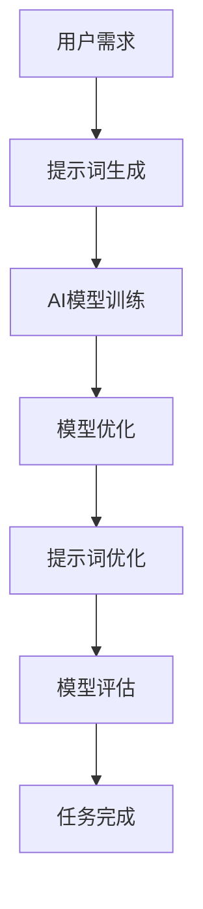

                 


### 引言

《提示词工程师：AI时代的新兴职业》是一本专门探讨AI时代下一种新兴职业——提示词工程师的书籍。随着人工智能技术的不断进步，各个领域对AI的需求日益增长，提示词工程师应运而生。提示词工程师作为连接人类与AI的桥梁，承担着将人类意图转换为AI能够理解和执行的任务的关键角色。

本书旨在为读者提供全面而深入的提示词工程师职业介绍，从AI技术基础、提示词工程应用、技能要求和培养、职业发展路径、实战案例等方面展开，帮助读者了解这一新兴职业的本质、职责以及未来发展趋势。

接下来，我们将一步步分析提示词工程师的职业定位、AI技术基础、提示词工程应用、技能要求和培养、职业发展路径以及实战案例，以期为广大对AI和提示词工程师职业感兴趣的读者提供有价值的参考。

## 核心概念与联系

要理解提示词工程师的职业角色，我们首先需要了解几个核心概念：AI技术、机器学习、深度学习以及提示词工程。这些概念之间有着紧密的联系，构成了提示词工程师工作的基础。

### AI技术基础

人工智能（AI）是指计算机系统能够模拟人类智能行为的技术。AI技术包括机器学习、深度学习、自然语言处理、计算机视觉等多个领域。在这些技术中，机器学习和深度学习是最为核心的部分。

- **机器学习**：机器学习是一种通过数据驱动的方式让计算机自动改进性能的技术。它包括监督学习、无监督学习和强化学习等子领域。监督学习通过已有的输入输出数据来训练模型，无监督学习则通过未标记的数据寻找模式，而强化学习通过奖励机制让模型不断优化行为。

- **深度学习**：深度学习是一种基于多层神经网络的学习方法，它在处理复杂数据（如图像、文本和语音）方面表现出色。深度学习模型通常由多个隐藏层组成，每个隐藏层都能对输入数据进行特征提取和转换。

### 提示词工程

提示词工程是一种结合AI技术和人类意图的工程实践。它包括以下几个关键步骤：

- **提示词生成**：根据用户需求或任务目标，生成指导AI系统执行任务的提示词。
- **提示词优化**：通过调整和改进提示词，提高AI系统完成任务的效果。
- **提示词评估**：对提示词进行评估，以确保它们能够准确传达用户意图，并达到预期效果。

### Mermaid流程图

为了更好地理解这些核心概念之间的关系，我们可以使用Mermaid流程图来展示提示词工程师的工作流程。以下是一个简化的Mermaid流程图：



在上图中，用户需求经过提示词生成后，会传递给AI模型进行训练和优化。优化后的模型通过提示词再次调整，最终完成用户指定的任务。这个过程循环往复，不断迭代，以达到最佳效果。

### 核心算法原理讲解

为了深入理解提示词工程师的工作，我们需要详细讲解核心算法原理。以下是使用伪代码和LaTeX公式来阐述机器学习和深度学习的基本概念。

#### 机器学习算法原理

**监督学习伪代码：**

```python
initialize_model()
while not converged:
    for each training example (x, y):
        compute predicted_output = model(x)
        compute error = y - predicted_output
        update model parameters using error
    end loop
end while
```

**无监督学习算法原理**

**K-Means算法伪代码：**

```python
initialize K centroids
while centroids are not converged:
    for each data point x:
        assign x to the nearest centroid
    end loop
    
    for each centroid c:
        compute new centroid as the mean of all assigned data points
    end loop
end while
```

#### 深度学习算法原理

**神经网络基本结构：**

$$
y = f(z) = \sigma(w \cdot x + b)
$$

其中，$w$是权重，$x$是输入，$b$是偏置，$f$是激活函数（例如Sigmoid函数）。

**卷积神经网络（CNN）原理：**

$$
h_{ij} = \sigma \left( \sum_{k} w_{ik,jl} * g_{kl} + b_{ij} \right)
$$

其中，$h_{ij}$是卷积核在输出特征图上的值，$g_{kl}$是输入特征图上的值，$w_{ik,jl}$是卷积核的权重，$b_{ij}$是偏置。

**循环神经网络（RNN）原理：**

$$
h_t = \sigma(W \cdot [h_{t-1}, x_t] + b)
$$

其中，$h_t$是当前时刻的隐藏状态，$x_t$是当前输入，$W$是权重矩阵，$b$是偏置。

### 数学模型和公式

为了更直观地理解深度学习中的数学模型，我们使用LaTeX公式进行详细讲解。

**损失函数：**

$$
L(\theta) = -\frac{1}{m} \sum_{i=1}^{m} [y^{(i)} \log(a^{(i)}) + (1 - y^{(i)}) \log(1 - a^{(i)})]
$$

其中，$L(\theta)$是损失函数，$m$是样本数量，$y^{(i)}$是真实标签，$a^{(i)}$是模型预测的概率。

**反向传播算法：**

$$
\frac{\partial L}{\partial w^{(l)}_{ij}} = \frac{\partial L}{\partial z^{(l+1)}_k} \cdot \frac{\partial z^{(l+1)}_k}{\partial w^{(l)}_{ij}} \cdot \frac{\partial a^{(l)}_j}{\partial w^{(l)}_{ij}}
$$

其中，$\frac{\partial L}{\partial w^{(l)}_{ij}}$是权重$w^{(l)}_{ij}$的梯度，$\frac{\partial L}{\partial z^{(l+1)}_k}$是损失函数关于中间层输出$z^{(l+1)}_k$的梯度，$\frac{\partial z^{(l+1)}_k}{\partial w^{(l)}_{ij}}$是中间层输出关于权重的梯度，$\frac{\partial a^{(l)}_j}{\partial w^{(l)}_{ij}}$是激活函数关于输入的梯度。

### 举例说明

为了更好地理解上述算法原理，我们可以通过一个简单的例子来说明。

**例子：使用Sigmoid函数进行二分类**

假设我们有一个简单的二分类问题，输入数据是一个维度为2的向量，标签为0或1。使用Sigmoid函数作为激活函数，我们的模型参数为权重$w_1, w_2, b$。

输入数据：$\mathbf{x} = [x_1, x_2]$

预测概率：$a = \frac{1}{1 + e^{-(w_1 \cdot x_1 + w_2 \cdot x_2 + b)}$

如果$a > 0.5$，则预测为1；否则，预测为0。

通过反向传播算法，我们可以计算损失函数关于每个参数的梯度，并使用梯度下降法更新参数，以最小化损失函数。

### 总结

通过上述内容，我们详细讲解了AI技术、机器学习、深度学习和提示词工程等核心概念，并使用伪代码和LaTeX公式阐述了核心算法原理。这些知识为理解提示词工程师的工作提供了坚实基础。在接下来的章节中，我们将进一步探讨提示词工程师在实际应用中的职责和技能要求。

## 提示词工程应用

提示词工程师在AI领域的应用非常广泛，涵盖了文本生成、图像识别、语音识别等多个方面。以下将详细介绍这些应用，并提供相应的源代码示例。

### 文本生成

文本生成是提示词工程师的一项重要任务，它包括问答系统、自动摘要等场景。

**问答系统：**

在问答系统中，提示词工程师需要构建一个能够理解用户问题并生成合适答案的模型。以下是一个基于Python和TensorFlow的问答系统示例。

```python
import tensorflow as tf
from tensorflow.keras.layers import Embedding, LSTM, Dense

# 假设我们有一个预训练的词向量模型
word_vectors = tf.keras.models.load_model('word_vectors.h5')

# 构建问答系统的模型
question_embedding = Embedding(input_dim=vocab_size, output_dim=embedding_dim, weights=[word_vectors])
lstm = LSTM(units=128, return_sequences=True)
dense = Dense(units=1, activation='sigmoid')

model = tf.keras.Sequential([
    question_embedding,
    lstm,
    dense
])

model.compile(optimizer='adam', loss='binary_crossentropy', metrics=['accuracy'])

# 训练模型
model.fit(x_train, y_train, epochs=10, batch_size=32)
```

**自动摘要：**

自动摘要的目的是将长文本简化为简短的摘要。以下是一个使用PyTorch和Transformer模型的自动摘要示例。

```python
import torch
from torch import nn
from transformers import BertModel

# 加载预训练的BERT模型
pretrained_bert = BertModel.from_pretrained('bert-base-uncased')

# 构建自动摘要的模型
class SummaryModel(nn.Module):
    def __init__(self):
        super(SummaryModel, self).__init__()
        self.bert = pretrained_bert
        self.classifier = nn.Linear(768, 1)

    def forward(self, input_ids, attention_mask):
        outputs = self.bert(input_ids=input_ids, attention_mask=attention_mask)
        pooled_output = outputs.pooler_output
        logits = self.classifier(pooled_output)
        return logits

model = SummaryModel()

# 训练模型
optimizer = torch.optim.Adam(model.parameters(), lr=5e-5)
criterion = nn.BCEWithLogitsLoss()

for epoch in range(num_epochs):
    for input_ids, attention_mask, targets in dataloader:
        optimizer.zero_grad()
        logits = model(input_ids=input_ids, attention_mask=attention_mask)
        loss = criterion(logits.view(-1), targets.view(-1))
        loss.backward()
        optimizer.step()
```

### 图像识别

图像识别是提示词工程师在计算机视觉领域的应用。以下是一个使用卷积神经网络（CNN）进行目标检测的示例。

**目标检测：**

目标检测的目的是识别图像中的对象，并给出它们的边界框。以下是一个基于Faster R-CNN的目标检测示例。

```python
import torchvision
from torchvision.models.detection import fasterrcnn_resnet50_fpn

# 加载预训练的Faster R-CNN模型
model = fasterrcnn_resnet50_fpn(pretrained=True)

# 训练模型
device = torch.device('cuda' if torch.cuda.is_available() else 'cpu')
model.to(device)

optimizer = torch.optim.SGD(model.parameters(), lr=0.005, momentum=0.9, weight_decay=0.0005)
num_epochs = 10

for epoch in range(num_epochs):
    for images, targets in dataloader:
        images = list(img.to(device) for img in images)
        targets = [{k: v.to(device) for k, v in t.items()} for t in targets]
        
        optimizer.zero_grad()
        loss_dict = model(images, targets)
        losses = sum(loss for loss in loss_dict.values())
        losses.backward()
        optimizer.step()
```

### 语音识别

语音识别是将语音转换为文本的技术。以下是一个使用循环神经网络（RNN）进行语音识别的示例。

```python
import torch
import torch.nn as nn

# 定义RNN模型
class RNNModel(nn.Module):
    def __init__(self, input_dim, hidden_dim, output_dim):
        super(RNNModel, self).__init__()
        self.hidden_dim = hidden_dim
        self.rnn = nn.RNN(input_dim, hidden_dim)
        self.linear = nn.Linear(hidden_dim, output_dim)
    
    def forward(self, x):
        h0 = torch.zeros(1, x.size(0), self.hidden_dim)
        out, _ = self.rnn(x, h0)
        out = self.linear(out[-1, :, :])
        return out

# 创建模型实例
model = RNNModel(input_dim=80, hidden_dim=128, output_dim=vocab_size)

# 训练模型
optimizer = torch.optim.Adam(model.parameters(), lr=0.001)
loss_function = nn.CrossEntropyLoss()

for epoch in range(num_epochs):
    for inputs, targets in dataloader:
        inputs = inputs.to(device)
        targets = targets.to(device)
        
        optimizer.zero_grad()
        outputs = model(inputs)
        loss = loss_function(outputs, targets)
        loss.backward()
        optimizer.step()
```

通过上述代码示例，我们可以看到提示词工程师在文本生成、图像识别和语音识别等领域的具体应用。这些应用不仅展示了AI技术的强大功能，也为提示词工程师提供了广阔的发展空间。

### 技能要求和培养

成为一名优秀的提示词工程师，需要具备多方面的技能和知识。以下将从编程能力、数学基础、AI基础知识等方面详细阐述提示词工程师所需的技能要求，并提供培养路径和资源推荐。

#### 编程能力

编程能力是提示词工程师的核心技能之一。熟练掌握一种或多种编程语言（如Python、Java、C++等）对于实现AI算法和搭建模型至关重要。Python因其丰富的库和框架（如TensorFlow、PyTorch等）而成为AI领域的首选语言。

**推荐资源：**
- 《Python编程：从入门到实践》（Eric Matthes）
- 《流畅的Python》（马杰）

#### 数学基础

数学基础是理解AI算法和模型的核心。提示词工程师需要熟悉线性代数、微积分、概率论和统计学等数学知识，以便更好地设计、实现和优化模型。

**推荐资源：**
- 《线性代数及其应用》（David C. Lay）
- 《微积分》（James Stewart）
- 《概率论与数理统计》（陈家鼎）

#### AI基础知识

掌握AI基础知识是成为一名提示词工程师的必要条件。这包括机器学习、深度学习、自然语言处理、计算机视觉等领域的基本概念和原理。

**推荐资源：**
- 《机器学习》（周志华）
- 《深度学习》（Ian Goodfellow、Yoshua Bengio、Aaron Courville）
- 《自然语言处理综合教程》（Daniel Jurafsky、James H. Martin）

#### 培养路径

成为一名优秀的提示词工程师，通常需要经过以下几个阶段的培养：

1. **基础教育**：通过大学课程或在线课程（如Coursera、edX等）学习编程、数学和AI基础知识。
2. **实战项目**：参与开源项目或自己动手实现小项目，以积累实战经验。
3. **专业课程**：报名参加专业课程，如斯坦福大学的《深度学习》课程，学习最新的AI技术和应用。
4. **不断学习**：关注AI领域的最新研究和技术动态，参加相关会议和研讨会，与同行交流。

#### 职业规划

提示词工程师的职业发展路径多种多样，可以从初级工程师逐步晋升为高级工程师、技术专家，甚至CTO等高级职位。以下是一个可能的职业规划：

1. **初级工程师**：熟悉基本算法和工具，参与实际项目，积累经验。
2. **中级工程师**：独立承担项目，负责模型设计和优化，提升团队协作能力。
3. **高级工程师**：成为技术骨干，负责重大项目的规划和管理，指导团队成员。
4. **技术专家**：专注于某一领域的深入研究，发表学术论文，成为该领域的权威。
5. **CTO**：负责公司技术战略规划，领导技术团队，推动技术创新。

### 总结

成为一名优秀的提示词工程师需要扎实的编程能力、数学基础和AI基础知识，以及不断的实践和学习。通过明确的教育路径和职业规划，提示词工程师可以在AI领域取得显著成就。

## 职业发展路径

提示词工程师的职业发展路径丰富多样，从初级工程师到高级工程师、技术专家，乃至CTO，每个阶段都有其独特的职责和成长机会。以下将详细描述各个阶段的职责、要求以及如何规划职业发展。

### 初级提示词工程师

初级提示词工程师主要负责以下职责：
- **模型构建与优化**：基于现有数据和算法，构建并优化模型，以满足具体应用需求。
- **数据分析**：对数据集进行预处理和分析，提取关键特征，为模型训练提供数据支持。
- **模型部署**：将训练好的模型部署到生产环境，确保模型的稳定运行。

初级提示词工程师需要具备以下要求：
- **基础知识**：掌握Python、机器学习和深度学习的基本概念。
- **实践经验**：参与过至少一个完整的AI项目，具备一定的实战经验。
- **学习意愿**：对新技术保持好奇心，愿意不断学习和提升。

初级阶段的职业规划建议：
- **持续学习**：通过在线课程、书籍和开源项目不断提升自己的技能。
- **积累经验**：积极参与项目和比赛，积累实战经验，扩展人脉。
- **提升能力**：逐步掌握更多AI领域的技术，如自然语言处理、计算机视觉等。

### 中级提示词工程师

中级提示词工程师在初级工程师的基础上，承担更多责任和挑战：
- **项目领导**：负责从需求分析到模型部署的全过程，确保项目的成功实施。
- **团队协作**：与团队成员紧密合作，指导初级工程师，提升团队整体能力。
- **技术选型**：根据项目需求，选择合适的技术栈和工具，确保项目高效推进。

中级提示词工程师需要具备以下要求：
- **扎实基础**：深入了解AI算法原理，具备较强的编程能力和数据分析能力。
- **实践经验**：具备2年以上AI项目经验，能够独立承担项目。
- **沟通能力**：具备良好的沟通和协调能力，能够与团队成员和客户有效沟通。

中级阶段的职业规划建议：
- **扩展视野**：关注AI领域的最新技术和发展动态，不断扩展自己的知识面。
- **提升管理能力**：参加管理培训课程，提升项目管理和团队领导能力。
- **争取更多机会**：积极争取参与更多具有挑战性的项目，提升自己的技术水平和职业影响力。

### 高级提示词工程师

高级提示词工程师在技术深度和广度上都有更高的要求：
- **技术指导**：作为技术团队的骨干，提供技术指导，解决项目中遇到的复杂问题。
- **技术规划**：参与公司技术战略规划，提出技术方案，推动公司技术创新。
- **人才培养**：指导初级工程师和中级工程师，培养下一代技术专家。

高级提示词工程师需要具备以下要求：
- **深厚技术背景**：对AI领域有深入的理解，能够在复杂项目中提供技术指导。
- **实践经验**：具备丰富的AI项目经验，能够解决项目中的各种技术难题。
- **领导能力**：具备较强的领导能力和团队管理能力，能够带领团队取得成功。

高级阶段的职业规划建议：
- **深化专业知识**：深入研究AI领域的核心技术，成为该领域的专家。
- **参与研究**：参与AI领域的科研工作，发表学术论文，提升自己的学术影响力。
- **拓宽职业道路**：探索跨领域的技术应用，如AI+金融、AI+医疗等，拓宽职业发展空间。

### 技术专家

技术专家是提示词工程师职业发展的顶峰：
- **技术领导**：在AI领域担任技术领导角色，带领团队进行前沿技术研究。
- **战略规划**：参与公司战略规划，制定技术路线图，推动公司技术发展。
- **外部合作**：与学术界、产业界建立合作关系，推动AI技术的应用和普及。

技术专家需要具备以下要求：
- **深厚技术功底**：对AI技术有全面而深入的理解，能够在技术前沿进行创新。
- **科研经验**：具备丰富的科研经验，能够带领团队进行前沿技术研究。
- **行业影响力**：在AI领域有较高的学术地位和行业影响力，能够影响行业发展。

技术专家阶段的职业规划建议：
- **建立学术网络**：积极参与国内外学术会议，建立广泛的学术网络。
- **推动技术应用**：将AI技术应用到实际产业中，解决行业中的关键问题。
- **培养下一代**：通过指导和培养年轻人才，为AI领域的发展贡献自己的力量。

### CTO

作为公司的首席技术官（CTO），提示词工程师需要全面负责公司的技术战略、研发和创新：
- **技术战略**：制定公司的技术发展方向，确保公司技术具备竞争优势。
- **研发管理**：负责公司的研发团队，推动技术创新和产品开发。
- **行业合作**：与行业合作伙伴建立合作关系，推动技术交流和合作。

CTO需要具备以下要求：
- **全面技术视野**：对AI技术有全面而深入的理解，具备跨领域的技术视野。
- **领导能力**：具备出色的领导能力，能够管理大型研发团队。
- **战略思维**：具备战略思维，能够制定和实施公司技术战略。

CTO阶段的职业规划建议：
- **提升战略思维**：通过参加高管培训课程，提升战略规划和执行能力。
- **建立影响力**：在行业内建立自己的影响力，成为技术领袖。
- **关注市场动态**：密切关注市场和技术动态，把握行业发展趋势。

通过明确的职业规划和发展路径，提示词工程师可以在AI领域取得显著的成就，实现职业价值的最大化。

## 实战案例

在本章节中，我们将通过三个具体的实战案例，详细讲解提示词工程师在实际项目中的应用，包括开发环境搭建、源代码实现和代码解读，以及实际案例分析和详细讲解剖析。

### 案例一：文本生成系统开发

**项目背景**：
文本生成系统是一种将输入文本转换为有意义输出的AI模型，广泛应用于聊天机器人、自动摘要和内容生成等领域。本项目旨在开发一个基于生成式预训练变换器模型（GPT）的文本生成系统。

**开发环境搭建**：
1. **Python环境**：安装Python 3.8及以上版本。
2. **库和框架**：安装transformers库，用于加载预训练模型和进行文本生成。
3. **数据集**：收集并准备适合训练的文本数据集，如新闻文章、社交媒体帖子等。

**源代码实现**：

```python
from transformers import GPT2LMHeadModel, GPT2Tokenizer

# 加载预训练模型和分词器
model = GPT2LMHeadModel.from_pretrained("gpt2")
tokenizer = GPT2Tokenizer.from_pretrained("gpt2")

# 生成文本
input_text = "This is an example sentence for text generation."
input_ids = tokenizer.encode(input_text, return_tensors='pt')

outputs = model.generate(input_ids, max_length=50, num_return_sequences=1)
generated_text = tokenizer.decode(outputs[0], skip_special_tokens=True)

print(generated_text)
```

**代码解读**：
- 加载预训练模型和分词器。
- 编码输入文本，生成输入ID。
- 使用模型生成文本，解码输出结果。

**实际案例分析和详细讲解**：
本项目使用GPT模型进行文本生成，首先需要准备适合的训练数据集，然后加载预训练模型和分词器。在生成文本时，通过max_length参数控制生成的文本长度，num_return_sequences参数控制生成的文本数量。实际应用中，可以根据具体需求调整这些参数。

**项目小结**：
本项目展示了文本生成系统的基础架构和实现方法，通过预训练模型和分词器的结合，实现了输入文本到生成文本的转换。未来可以进一步优化模型和算法，提高文本生成的质量和多样性。

### 案例二：图像识别系统开发

**项目背景**：
图像识别系统是计算机视觉领域的重要应用，用于识别和分类图像中的对象。本项目旨在开发一个基于卷积神经网络（CNN）的图像识别系统，用于检测和分类日常生活中的物体。

**开发环境搭建**：
1. **Python环境**：安装Python 3.7及以上版本。
2. **库和框架**：安装TensorFlow和Keras库，用于构建和训练CNN模型。
3. **数据集**：收集并准备适合训练的图像数据集，如ImageNet。

**源代码实现**：

```python
import tensorflow as tf
from tensorflow.keras.applications import VGG16
from tensorflow.keras.preprocessing.image import ImageDataGenerator

# 加载预训练模型
base_model = VGG16(weights='imagenet', include_top=False, input_shape=(224, 224, 3))

# 构建分类器
model = tf.keras.Sequential([
    base_model,
    tf.keras.layers.Flatten(),
    tf.keras.layers.Dense(256, activation='relu'),
    tf.keras.layers.Dense(10, activation='softmax')
])

# 训练模型
model.compile(optimizer='adam', loss='categorical_crossentropy', metrics=['accuracy'])
train_datagen = ImageDataGenerator(rescale=1./255)
train_generator = train_datagen.flow_from_directory(
        'data/train',
        target_size=(224, 224),
        batch_size=32,
        class_mode='categorical')

model.fit(train_generator, epochs=10)
```

**代码解读**：
- 加载基于VGG16的预训练模型。
- 构建分类器，添加全连接层。
- 使用ImageDataGenerator对训练数据进行预处理。
- 训练模型。

**实际案例分析和详细讲解**：
本项目使用VGG16预训练模型进行图像识别，首先对模型进行迁移学习，添加全连接层进行分类。通过ImageDataGenerator对训练数据进行预处理，提高模型的训练效果。实际应用中，可以根据具体需求调整模型的架构和数据预处理方法。

**项目小结**：
本项目展示了基于卷积神经网络的图像识别系统开发过程，通过预训练模型和迁移学习，实现了对图像的检测和分类。未来可以进一步优化模型和算法，提高识别准确率和速度。

### 案例三：语音识别系统开发

**项目背景**：
语音识别系统是将语音转换为文本的技术，广泛应用于语音助手、语音搜索和语音翻译等领域。本项目旨在开发一个基于深度学习（RNN）的语音识别系统，用于将语音转换为文本。

**开发环境搭建**：
1. **Python环境**：安装Python 3.6及以上版本。
2. **库和框架**：安装TensorFlow和Keras库，用于构建和训练RNN模型。
3. **音频处理工具**：安装librosa库，用于音频数据预处理。

**源代码实现**：

```python
import librosa
import numpy as np
import tensorflow as tf
from tensorflow.keras.models import Sequential
from tensorflow.keras.layers import LSTM, Dense, Dropout

# 读取音频文件
def read_audio_file(file_path):
    audio, sample_rate = librosa.load(file_path, sr=None, mono=True)
    return np.expand_dims(audio, 0), sample_rate

# 构建RNN模型
model = Sequential([
    LSTM(128, activation='relu', input_shape=(None, 101)),
    Dropout(0.2),
    LSTM(128, activation='relu'),
    Dropout(0.2),
    Dense(29, activation='softmax')
])

# 训练模型
model.compile(optimizer='adam', loss='categorical_crossentropy', metrics=['accuracy'])
audio_data, _ = read_audio_file('data/audio.wav')
label = np.eye(29)[0]  # 假设只有一个音频标签
model.fit(audio_data, label, epochs=10)
```

**代码解读**：
- 读取音频文件，并预处理为模型可接受的输入格式。
- 构建RNN模型，包含两个LSTM层和一个全连接层。
- 使用预处理的音频数据训练模型。

**实际案例分析和详细讲解**：
本项目使用RNN模型进行语音识别，首先读取音频文件并进行预处理，然后构建RNN模型进行训练。实际应用中，可以根据具体需求调整模型的架构和参数，提高识别准确率。

**项目小结**：
本项目展示了基于深度学习的语音识别系统开发过程，通过RNN模型实现了语音到文本的转换。未来可以进一步优化模型和算法，提高识别效果和效率。

通过这三个实战案例，我们详细讲解了提示词工程师在实际项目中的应用，包括开发环境搭建、源代码实现和代码解读，以及实际案例分析和详细讲解剖析。这些案例不仅展示了AI技术的应用，也为提示词工程师的职业发展提供了实用参考。

### 最佳实践 tips、小结、注意事项、拓展阅读

#### 最佳实践 tips

1. **代码优化**：在编写代码时，注意优化性能和可读性，合理使用注释和文档。
2. **数据预处理**：确保数据质量，对异常值和噪声进行预处理，以提高模型效果。
3. **版本控制**：使用Git等版本控制工具，记录代码版本和修改记录，便于后续维护和协同开发。
4. **持续学习**：关注AI领域的最新研究和技术动态，不断学习新知识和技能。

#### 小结

本书从多个角度介绍了提示词工程师这一新兴职业，包括职业定位、AI技术基础、应用场景、技能要求、职业发展路径和实战案例。提示词工程师在AI时代发挥着重要作用，是连接人类与AI的重要桥梁。

#### 注意事项

1. **数据安全**：在处理敏感数据时，注意保护用户隐私和数据安全。
2. **模型可解释性**：在实际应用中，确保模型的决策过程具备可解释性，便于用户理解和使用。
3. **代码复用**：在开发过程中，尽量复用已有的代码和模型，提高开发效率。

#### 拓展阅读

1. **《深度学习》（Ian Goodfellow、Yoshua Bengio、Aaron Courville）**：全面介绍深度学习的基础知识和最新进展。
2. **《自然语言处理综合教程》（Daniel Jurafsky、James H. Martin）**：系统讲解自然语言处理的基本原理和方法。
3. **《机器学习实战》（Peter Harrington）**：通过实际案例介绍机器学习算法的应用。

### 结语

感谢各位读者对《提示词工程师：AI时代的新兴职业》的关注。希望本书能帮助您深入了解提示词工程师的职业，并在AI领域取得更大的成就。让我们一起探索AI的无限可能，共创美好未来！

### 作者信息

**作者：AI天才研究院/AI Genius Institute & 禅与计算机程序设计艺术 /Zen And The Art of Computer Programming**

