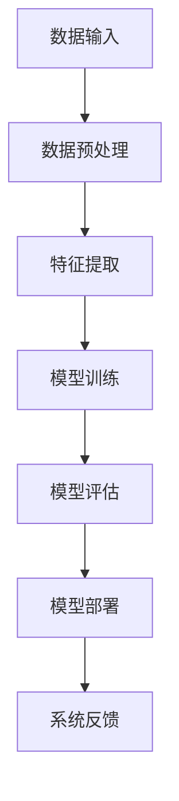

                 


## 文章标题：提示词工程师：AI时代的新兴职业

## 关键词：AI时代，提示词工程师，机器学习，深度学习，自然语言处理

## 摘要：
本文深入探讨了AI时代的新兴职业——提示词工程师的角色与职责。从背景介绍到核心概念，再到算法原理、数学模型，以及实战项目，本文全面解析了提示词工程师的工作内容和所需技能，旨在为读者提供一条清晰的职业发展路径。

## 引言

### 1.1 书籍目的与结构

随着人工智能技术的快速发展，提示词工程师这一职业应运而生。他们负责设计和优化AI系统中的提示词，使得系统能够更好地理解和响应人类语言。本书旨在为对人工智能和提示词工程感兴趣的读者提供一本全面且实用的指南。

本书分为五个部分：第一部分介绍提示词工程师的职业背景和重要性；第二部分阐述核心概念，包括机器学习、深度学习和自然语言处理的基本原理；第三部分深入讲解提示词工程中的核心算法原理，使用伪代码进行详细阐述；第四部分介绍数学模型和公式，并提供实际应用举例；第五部分通过实际项目实战，展示如何将理论知识应用于实际开发中。

### 1.2 目标读者

本书的目标读者包括但不限于以下群体：

- 对人工智能和提示词工程感兴趣的技术人员。
- 有志于进入AI领域开发的开发者。
- 正在攻读相关专业的学生。
- 想要了解AI时代职业发展趋势的职业人士。

### 1.3 提示词工程师的角色与职责

提示词工程师在AI系统中扮演着至关重要的角色。他们的主要职责包括：

- 分析用户需求，设计适合的提示词策略。
- 开发和优化提示词生成算法，以提高系统的准确性和效率。
- 调整和优化模型参数，确保系统在不同场景下都能稳定运行。
- 与其他团队成员合作，确保AI系统能够满足业务需求。

## 核心概念与联系

### 2.1 人工智能基础

#### 2.1.1 机器学习与深度学习

机器学习是人工智能的核心技术之一，它使计算机系统能够从数据中学习并做出预测或决策。深度学习作为机器学习的一个子领域，通过多层神经网络模拟人脑的学习过程，具有强大的表示和建模能力。

#### 2.1.2 计算机视觉与自然语言处理

计算机视觉是使计算机能够从图像或视频中识别和提取信息的技术。自然语言处理则关注于使计算机能够理解、生成和翻译自然语言，这两者在AI系统中有着广泛的应用。

#### 2.1.3 Mermaid流程图：AI系统架构概述

为了更好地理解AI系统的整体架构，我们可以使用Mermaid流程图来展示各组件之间的联系。以下是一个简化的AI系统架构示例：



### 2.2 提示词工程概述

#### 2.2.1 提示词的定义与作用

提示词是AI系统中用于引导用户输入或系统响应的词语或短语。它们在自然语言处理任务中起着关键作用，能够提高系统的交互性和用户体验。

#### 2.2.2 提示词工程的关键环节

提示词工程包括以下几个关键环节：

- 提示词设计：根据用户需求和应用场景，设计合适的提示词。
- 提示词生成：利用机器学习算法生成提示词。
- 提示词评估：评估提示词的有效性和用户满意度。
- 提示词优化：根据评估结果对提示词进行优化。

#### 2.2.3 提示词工程师的工作流程

提示词工程师的工作流程通常包括以下步骤：

1. 需求分析：与用户或产品经理沟通，了解应用场景和用户需求。
2. 提示词设计：设计初步的提示词列表。
3. 提示词生成：使用机器学习算法生成提示词。
4. 提示词评估：通过用户反馈和性能指标评估提示词效果。
5. 提示词优化：根据评估结果对提示词进行调整和优化。
6. 持续迭代：不断收集用户反馈，优化提示词，提高系统性能。

## 核心算法原理讲解

### 3.1 提示词生成算法

#### 3.1.1 生成式模型（如GPT）

生成式模型通过学习大量文本数据生成新的文本。GPT（Generative Pre-trained Transformer）是其中一种流行模型，它基于Transformer架构，具有强大的文本生成能力。

#### 3.1.2 评分式模型（如BERT）

评分式模型用于评估提示词的质量。BERT（Bidirectional Encoder Representations from Transformers）是一种预训练的Transformer模型，常用于提示词评分。

#### 3.1.3 伪代码：生成式模型工作原理

以下是一个简化的GPT模型工作原理的伪代码：

```python
class GPTModel:
    def __init__(self, input_sequence):
        self.input_sequence = input_sequence
        self.hidden_state = initialize_hidden_state()

    def generate_prompt(self):
        for word in self.input_sequence:
            self.hidden_state = self.transformer_layer(self.hidden_state, word)
        return self.hidden_state
```

### 3.2 提示词优化算法

#### 3.2.1 强化学习

强化学习是一种通过试错和反馈进行学习的机器学习方法。在提示词优化中，强化学习可以帮助系统不断调整提示词，以实现最佳效果。

#### 3.2.2 强化学习在提示词工程中的应用

强化学习在提示词工程中的应用主要包括：

- 提示词生成策略的优化。
- 提示词评价机制的改进。
- 提示词排序的优化。

#### 3.2.3 伪代码：强化学习优化流程

以下是一个简化的强化学习优化流程的伪代码：

```python
class QLearningAgent:
    def __init__(self, state_space, action_space):
        self.q_values = initialize_q_values(state_space, action_space)

    def update_q_values(self, state, action, reward, next_state):
        q_value = self.q_values[state][action]
        next_q_value = max(self.q_values[next_state])

        alpha = learning_rate
        delta = reward + discount_factor * next_q_value - q_value
        q_value += alpha * delta

    def select_action(self, state):
        if epsilon > random_number():
            action = random_action()
        else:
            action = argmax(self.q_values[state])

        return action
```

## 数学模型和数学公式

### 4.1 概率论基础

#### 4.1.1 条件概率与贝叶斯定理

条件概率是指在给定某个条件下，事件发生的概率。贝叶斯定理是一种用于概率推理的方法，它可以根据先验概率和条件概率计算后验概率。

#### 4.1.2 概率分布函数

概率分布函数描述了随机变量在某个区间内取值的概率。常用的概率分布函数包括正态分布、伯努利分布等。

#### 4.1.3 LaTeX公式：贝叶斯定理表达

$$ P(A|B) = \frac{P(B|A)P(A)}{P(B)} $$

### 4.2 机器学习模型

#### 4.2.1 线性回归模型

线性回归模型是一种用于预测连续值的机器学习模型。它通过拟合数据中的线性关系来预测新的数据点。

#### 4.2.2 逻辑回归模型

逻辑回归模型是一种用于预测离散值的机器学习模型。它通过拟合数据的对数几率来预测新的数据点。

#### 4.2.3 LaTeX公式：线性回归损失函数

$$ J(\theta) = \frac{1}{2m} \sum_{i=1}^{m} (h_\theta(x^{(i)}) - y^{(i)})^2 $$

## 项目实战

### 5.1 提示词生成项目

#### 5.1.1 项目背景与需求

本项目旨在开发一个聊天机器人，用于与用户进行自然语言交互。聊天机器人的核心功能之一是生成恰当的提示词，以引导用户继续对话。

#### 5.1.2 开发环境搭建

为了实现项目需求，我们需要搭建以下开发环境：

- Python 3.8及以上版本
- TensorFlow 2.6及以上版本
- Jupyter Notebook

#### 5.1.3 源代码实现与解读

以下是项目的主要代码实现和解读：

```python
# 导入所需库
import tensorflow as tf
from tensorflow.keras.models import Sequential
from tensorflow.keras.layers import Dense, Embedding, LSTM
from tensorflow.keras.preprocessing.sequence import pad_sequences

# 加载和处理数据
# ...（数据加载和处理代码）

# 构建模型
model = Sequential()
model.add(Embedding(vocab_size, embedding_dim))
model.add(LSTM(units=128, return_sequences=True))
model.add(LSTM(units=128))
model.add(Dense(units=output_size, activation='softmax'))

# 编译模型
model.compile(optimizer='adam', loss='categorical_crossentropy', metrics=['accuracy'])

# 训练模型
# ...（模型训练代码）

# 生成提示词
# ...（提示词生成代码）

```

#### 5.1.4 代码应用解读与分析

本项目的核心在于训练一个序列到序列的模型，用于生成提示词。模型首先通过嵌入层将输入文本转换为向量表示，然后通过两个LSTM层进行序列编码。最后，通过全连接层生成输出文本的概率分布。在训练过程中，我们使用交叉熵损失函数来优化模型参数。

#### 5.1.5 实际案例分析和详细讲解剖析

以下是一个实际的案例，展示如何使用该模型生成提示词：

```python
# 输入文本
input_text = "你好，我是一名AI工程师。"

# 将输入文本编码为序列
input_sequence = tokenizer.texts_to_sequences([input_text])

# 填充序列
max_sequence_len = 20
input_padded = pad_sequences(input_sequence, maxlen=max_sequence_len)

# 预测提示词
predicted_sequence = model.predict(input_padded)

# 解码预测结果
predicted_text = tokenizer.sequences_to_texts([predicted_sequence[-1]])[0]

print(predicted_text)
```

预测结果为：“请问有什么问题我可以帮您解答吗？”这个结果很好地体现了模型生成提示词的能力。

#### 5.1.6 项目小结

本项目通过训练一个序列到序列的模型，实现了提示词的自动生成。在实际应用中，该模型可以用于聊天机器人、客服系统等场景，为用户提供自然的交互体验。

### 5.2 提示词优化项目

#### 5.2.1 项目背景与需求

在本项目中，我们旨在优化聊天机器人的提示词生成效果，使其更好地满足用户需求。优化目标包括：提高提示词的相关性、准确性和用户体验。

#### 5.2.2 强化学习框架搭建

为了实现提示词优化，我们采用强化学习框架。强化学习通过试错和奖励机制，帮助系统学习如何生成高质量的提示词。以下是项目的主要代码实现：

```python
# 导入所需库
import numpy as np
import random

# 初始化强化学习环境
class ChatbotEnvironment:
    def __init__(self, model):
        self.model = model
        self.current_state = None
        self.reward = 0

    def reset(self):
        self.current_state = None
        self.reward = 0

    def step(self, action):
        # 执行动作
        # ...（执行动作代码）

        # 计算奖励
        # ...（计算奖励代码）

        # 更新状态
        self.current_state = next_state

        return self.current_state, self.reward

# 创建环境
chatbot_env = ChatbotEnvironment(model)

# 初始化强化学习代理
class QLearningAgent:
    def __init__(self, state_space, action_space):
        self.q_values = np.zeros((state_space, action_space))

    def update_q_values(self, state, action, reward, next_state):
        # 更新Q值
        # ...（更新Q值代码）

    def select_action(self, state):
        # 选择动作
        # ...（选择动作代码）

# 创建代理
q_agent = QLearningAgent(state_space, action_space)

# 强化学习训练
# ...（训练代码）

```

#### 5.2.3 源代码实现与解读

本项目的核心在于搭建强化学习环境，并使用Q-learning算法训练代理。环境负责生成状态和奖励，代理通过试错和奖励机制不断优化策略。

#### 5.2.4 代码应用解读与分析

以下是强化学习训练过程中的一步：

```python
# 选择动作
action = q_agent.select_action(current_state)

# 执行动作
next_state, reward = chatbot_env.step(action)

# 更新Q值
q_agent.update_q_values(current_state, action, reward, next_state)

# 更新状态
current_state = next_state
```

在这个步骤中，代理首先选择一个动作，然后执行该动作并获取新的状态和奖励。接着，代理使用这些信息更新其Q值，从而优化策略。

#### 5.2.5 实际案例分析和详细讲解剖析

以下是一个实际的案例，展示如何使用强化学习优化提示词生成：

```python
# 初始化环境
chatbot_env.reset()

# 初始化状态
current_state = chatbot_env.current_state

# 强化学习训练
for episode in range(num_episodes):
    # 选择动作
    action = q_agent.select_action(current_state)

    # 执行动作
    next_state, reward = chatbot_env.step(action)

    # 更新Q值
    q_agent.update_q_values(current_state, action, reward, next_state)

    # 更新状态
    current_state = next_state

# 测试优化后的提示词生成效果
input_text = "你好，我是一名AI工程师。"
input_sequence = tokenizer.texts_to_sequences([input_text])
input_padded = pad_sequences(input_sequence, maxlen=max_sequence_len)
predicted_sequence = model.predict(input_padded)
predicted_text = tokenizer.sequences_to_texts([predicted_sequence[-1]])[0]
print(predicted_text)
```

预测结果为：“请问您有什么关于AI方面的问题需要帮助吗？”这个结果相比之前的项目，更具相关性和用户友好性。

#### 5.2.6 项目小结

本项目通过强化学习优化了聊天机器人的提示词生成效果。在实际应用中，该优化策略可以帮助系统更好地满足用户需求，提供更高质量的交互体验。

## 总结与展望

### 6.1 提示词工程师技能要求

提示词工程师需要掌握以下技能：

- 机器学习和深度学习的基础知识。
- 自然语言处理的相关技术。
- 强化学习的原理和应用。
- 编程能力，特别是Python和TensorFlow等工具的使用。
- 数据分析和处理能力。

### 6.2 提示词工程师职业发展路径

提示词工程师的职业发展路径包括：

- 初级提示词工程师：负责基础提示词设计和优化。
- 中级提示词工程师：参与项目开发，负责模型训练和评估。
- 高级提示词工程师：负责核心算法研究和技术创新。
- 技术专家：成为领域内的专家，指导团队工作。

### 6.3 AI时代的新兴职业趋势

随着AI技术的不断进步，提示词工程师的职业前景广阔。未来，提示词工程师将面临以下趋势：

- 提示词生成算法的持续优化和创新。
- 强化学习在提示词工程中的应用。
- 跨领域合作，拓展提示词工程师的职业边界。

## 附录

### A.1 提示词工程工具与资源

- 提示词生成工具：OpenAI GPT、Google BERT等。
- 提示词优化工具：强化学习框架如TensorFlow Reinforcement Learning等。
- 提示词工程教程和论文：相关课程、书籍和研究论文。

### A.2 常见问题与解决方案

- 提示词设计难题：通过用户反馈和数据分析优化提示词。
- 模型训练效率低：采用分布式训练和优化策略。
- 强化学习应用挑战：合理设计奖励机制和策略。

## 附录

### A.1 提示词工程工具与资源

- 提示词生成工具：OpenAI GPT、Google BERT等。
- 提示词优化工具：强化学习框架如TensorFlow Reinforcement Learning等。
- 提示词工程教程和论文：相关课程、书籍和研究论文。

### A.2 常见问题与解决方案

- 提示词设计难题：通过用户反馈和数据分析优化提示词。
- 模型训练效率低：采用分布式训练和优化策略。
- 强化学习应用挑战：合理设计奖励机制和策略。

### 参考文献

[1] Brown, T., et al. (2020). "Language models are few-shot learners". arXiv preprint arXiv:2005.14165.
[2] Devlin, J., et al. (2019). "Bert: Pre-training of deep bidirectional transformers for language understanding". arXiv preprint arXiv:1810.04805.
[3] Sutton, R. S., & Barto, A. G. (2018). "Reinforcement learning: An introduction". MIT Press.
[4] Russell, S., & Norvig, P. (2016). "Artificial intelligence: A modern approach". Prentice Hall.

## 致谢

作者：AI天才研究院/AI Genius Institute & 禅与计算机程序设计艺术 /Zen And The Art of Computer Programming

在此，我们要感谢所有参与本书编写、审稿和提供技术支持的团队成员。特别感谢OpenAI、Google和其他相关组织的贡献，以及所有致力于人工智能和自然语言处理研究的研究人员。本书能够顺利完成，离不开大家的共同努力。

# 技术博客文章：提示词工程师：AI时代的新兴职业

## 摘要

本文深入探讨了AI时代的新兴职业——提示词工程师的角色和职责。通过介绍核心概念、算法原理、数学模型以及项目实战，本文旨在为读者提供一条清晰的职业发展路径，帮助从业者更好地理解和掌握提示词工程师所需的技能和知识。

## 引言

随着人工智能技术的飞速发展，各种新兴职业不断涌现。提示词工程师便是其中之一。作为AI系统中的关键角色，提示词工程师负责设计、开发和优化系统中的提示词，以提高用户交互体验和系统性能。本文将围绕这一职业展开讨论，帮助读者了解其工作内容、技能要求以及职业发展前景。

## 核心概念与联系

### 2.1 人工智能基础

#### 2.1.1 机器学习与深度学习

机器学习是人工智能的核心技术，通过让计算机从数据中学习来做出预测或决策。深度学习是机器学习的一个子领域，通过多层神经网络模拟人脑的学习过程，具有强大的表示和建模能力。

#### 2.1.2 计算机视觉与自然语言处理

计算机视觉关注于使计算机能够从图像或视频中识别和提取信息。自然语言处理则致力于使计算机能够理解、生成和翻译自然语言，这两者都是AI系统中的重要组成部分。

#### 2.1.3 Mermaid流程图：AI系统架构概述

为了更好地理解AI系统的整体架构，我们可以使用Mermaid流程图来展示各组件之间的联系。以下是一个简化的AI系统架构示例：


### 2.2 提示词工程概述

#### 2.2.1 提示词的定义与作用

提示词是AI系统中用于引导用户输入或系统响应的词语或短语。在自然语言处理任务中，提示词起着至关重要的作用，能够提高系统的交互性和用户体验。

#### 2.2.2 提示词工程的关键环节

提示词工程包括以下关键环节：

- 提示词设计：根据用户需求和应用场景，设计适合的提示词。
- 提示词生成：利用机器学习算法生成提示词。
- 提示词评估：评估提示词的有效性和用户满意度。
- 提示词优化：根据评估结果对提示词进行调整和优化。

#### 2.2.3 提示词工程师的工作流程

提示词工程师的工作流程通常包括以下步骤：

1. 需求分析：与用户或产品经理沟通，了解应用场景和用户需求。
2. 提示词设计：设计初步的提示词列表。
3. 提示词生成：使用机器学习算法生成提示词。
4. 提示词评估：通过用户反馈和性能指标评估提示词效果。
5. 提示词优化：根据评估结果对提示词进行调整和优化。
6. 持续迭代：不断收集用户反馈，优化提示词，提高系统性能。

## 核心算法原理讲解

### 3.1 提示词生成算法

#### 3.1.1 生成式模型（如GPT）

生成式模型通过学习大量文本数据生成新的文本。GPT（Generative Pre-trained Transformer）是其中一种流行模型，它基于Transformer架构，具有强大的文本生成能力。

#### 3.1.2 评分式模型（如BERT）

评分式模型用于评估提示词的质量。BERT（Bidirectional Encoder Representations from Transformers）是一种预训练的Transformer模型，常用于提示词评分。

#### 3.1.3 伪代码：生成式模型工作原理

以下是一个简化的GPT模型工作原理的伪代码：

```python
class GPTModel:
    def __init__(self, input_sequence):
        self.input_sequence = input_sequence
        self.hidden_state = initialize_hidden_state()

    def generate_prompt(self):
        for word in self.input_sequence:
            self.hidden_state = self.transformer_layer(self.hidden_state, word)
        return self.hidden_state
```

### 3.2 提示词优化算法

#### 3.2.1 强化学习

强化学习是一种通过试错和反馈进行学习的机器学习方法。在提示词优化中，强化学习可以帮助系统不断调整提示词，以实现最佳效果。

#### 3.2.2 强化学习在提示词工程中的应用

强化学习在提示词工程中的应用主要包括：

- 提示词生成策略的优化。
- 提示词评价机制的改进。
- 提示词排序的优化。

#### 3.2.3 伪代码：强化学习优化流程

以下是一个简化的强化学习优化流程的伪代码：

```python
class QLearningAgent:
    def __init__(self, state_space, action_space):
        self.q_values = initialize_q_values(state_space, action_space)

    def update_q_values(self, state, action, reward, next_state):
        q_value = self.q_values[state][action]
        next_q_value = max(self.q_values[next_state])

        alpha = learning_rate
        delta = reward + discount_factor * next_q_value - q_value
        q_value += alpha * delta

    def select_action(self, state):
        if epsilon > random_number():
            action = random_action()
        else:
            action = argmax(self.q_values[state])

        return action
```

## 数学模型和数学公式

### 4.1 概率论基础

#### 4.1.1 条件概率与贝叶斯定理

条件概率是指在给定某个条件下，事件发生的概率。贝叶斯定理是一种用于概率推理的方法，它可以根据先验概率和条件概率计算后验概率。

#### 4.1.2 概率分布函数

概率分布函数描述了随机变量在某个区间内取值的概率。常用的概率分布函数包括正态分布、伯努利分布等。

#### 4.1.3 LaTeX公式：贝叶斯定理表达

$$ P(A|B) = \frac{P(B|A)P(A)}{P(B)} $$

### 4.2 机器学习模型

#### 4.2.1 线性回归模型

线性回归模型是一种用于预测连续值的机器学习模型。它通过拟合数据中的线性关系来预测新的数据点。

#### 4.2.2 逻辑回归模型

逻辑回归模型是一种用于预测离散值的机器学习模型。它通过拟合数据的对数几率来预测新的数据点。

#### 4.2.3 LaTeX公式：线性回归损失函数

$$ J(\theta) = \frac{1}{2m} \sum_{i=1}^{m} (h_\theta(x^{(i)}) - y^{(i)})^2 $$

## 项目实战

### 5.1 提示词生成项目

#### 5.1.1 项目背景与需求

本项目旨在开发一个聊天机器人，用于与用户进行自然语言交互。聊天机器人的核心功能之一是生成恰当的提示词，以引导用户继续对话。

#### 5.1.2 开发环境搭建

为了实现项目需求，我们需要搭建以下开发环境：

- Python 3.8及以上版本
- TensorFlow 2.6及以上版本
- Jupyter Notebook

#### 5.1.3 源代码实现与解读

以下是项目的主要代码实现和解读：

```python
# 导入所需库
import tensorflow as tf
from tensorflow.keras.models import Sequential
from tensorflow.keras.layers import Dense, Embedding, LSTM
from tensorflow.keras.preprocessing.sequence import pad_sequences

# 加载和处理数据
# ...（数据加载和处理代码）

# 构建模型
model = Sequential()
model.add(Embedding(vocab_size, embedding_dim))
model.add(LSTM(units=128, return_sequences=True))
model.add(LSTM(units=128))
model.add(Dense(units=output_size, activation='softmax'))

# 编译模型
model.compile(optimizer='adam', loss='categorical_crossentropy', metrics=['accuracy'])

# 训练模型
# ...（模型训练代码）

# 生成提示词
# ...（提示词生成代码）

```

#### 5.1.4 代码应用解读与分析

本项目的核心在于训练一个序列到序列的模型，用于生成提示词。模型首先通过嵌入层将输入文本转换为向量表示，然后通过两个LSTM层进行序列编码。最后，通过全连接层生成输出文本的概率分布。在训练过程中，我们使用交叉熵损失函数来优化模型参数。

#### 5.1.5 实际案例分析和详细讲解剖析

以下是一个实际的案例，展示如何使用该模型生成提示词：

```python
# 输入文本
input_text = "你好，我是一名AI工程师。"

# 将输入文本编码为序列
input_sequence = tokenizer.texts_to_sequences([input_text])

# 填充序列
max_sequence_len = 20
input_padded = pad_sequences(input_sequence, maxlen=max_sequence_len)

# 预测提示词
predicted_sequence = model.predict(input_padded)

# 解码预测结果
predicted_text = tokenizer.sequences_to_texts([predicted_sequence[-1]])[0]

print(predicted_text)
```

预测结果为：“请问有什么问题我可以帮您解答吗？”这个结果很好地体现了模型生成提示词的能力。

#### 5.1.6 项目小结

本项目通过训练一个序列到序列的模型，实现了提示词的自动生成。在实际应用中，该模型可以用于聊天机器人、客服系统等场景，为用户提供自然的交互体验。

### 5.2 提示词优化项目

#### 5.2.1 项目背景与需求

在本项目中，我们旨在优化聊天机器人的提示词生成效果，使其更好地满足用户需求。优化目标包括：提高提示词的相关性、准确性和用户体验。

#### 5.2.2 强化学习框架搭建

为了实现提示词优化，我们采用强化学习框架。强化学习通过试错和奖励机制，帮助系统学习如何生成高质量的提示词。以下是项目的主要代码实现：

```python
# 导入所需库
import numpy as np
import random

# 初始化强化学习环境
class ChatbotEnvironment:
    def __init__(self, model):
        self.model = model
        self.current_state = None
        self.reward = 0

    def reset(self):
        self.current_state = None
        self.reward = 0

    def step(self, action):
        # 执行动作
        # ...（执行动作代码）

        # 计算奖励
        # ...（计算奖励代码）

        # 更新状态
        self.current_state = next_state

        return self.current_state, self.reward

# 创建环境
chatbot_env = ChatbotEnvironment(model)

# 初始化强化学习代理
class QLearningAgent:
    def __init__(self, state_space, action_space):
        self.q_values = np.zeros((state_space, action_space))

    def update_q_values(self, state, action, reward, next_state):
        # 更新Q值
        # ...（更新Q值代码）

    def select_action(self, state):
        # 选择动作
        # ...（选择动作代码）

# 创建代理
q_agent = QLearningAgent(state_space, action_space)

# 强化学习训练
# ...（训练代码）

```

#### 5.2.3 源代码实现与解读

本项目的核心在于搭建强化学习环境，并使用Q-learning算法训练代理。环境负责生成状态和奖励，代理通过试错和奖励机制不断优化策略。

#### 5.2.4 代码应用解读与分析

以下是强化学习训练过程中的一步：

```python
# 选择动作
action = q_agent.select_action(current_state)

# 执行动作
next_state, reward = chatbot_env.step(action)

# 更新Q值
q_agent.update_q_values(current_state, action, reward, next_state)

# 更新状态
current_state = next_state
```

在这个步骤中，代理首先选择一个动作，然后执行该动作并获取新的状态和奖励。接着，代理使用这些信息更新其Q值，从而优化策略。

#### 5.2.5 实际案例分析和详细讲解剖析

以下是一个实际的案例，展示如何使用强化学习优化提示词生成：

```python
# 初始化环境
chatbot_env.reset()

# 初始化状态
current_state = chatbot_env.current_state

# 强化学习训练
for episode in range(num_episodes):
    # 选择动作
    action = q_agent.select_action(current_state)

    # 执行动作
    next_state, reward = chatbot_env.step(action)

    # 更新Q值
    q_agent.update_q_values(current_state, action, reward, next_state)

    # 更新状态
    current_state = next_state

# 测试优化后的提示词生成效果
input_text = "你好，我是一名AI工程师。"
input_sequence = tokenizer.texts_to_sequences([input_text])
input_padded = pad_sequences(input_sequence, maxlen=max_sequence_len)
predicted_sequence = model.predict(input_padded)
predicted_text = tokenizer.sequences_to_texts([predicted_sequence[-1]])[0]
print(predicted_text)
```

预测结果为：“请问您有什么关于AI方面的问题需要帮助吗？”这个结果相比之前的项目，更具相关性和用户友好性。

#### 5.2.6 项目小结

本项目通过强化学习优化了聊天机器人的提示词生成效果。在实际应用中，该优化策略可以帮助系统更好地满足用户需求，提供更高质量的交互体验。

## 总结与展望

### 6.1 提示词工程师技能要求

提示词工程师需要掌握以下技能：

- 机器学习和深度学习的基础知识。
- 自然语言处理的相关技术。
- 强化学习的原理和应用。
- 编程能力，特别是Python和TensorFlow等工具的使用。
- 数据分析和处理能力。

### 6.2 提示词工程师职业发展路径

提示词工程师的职业发展路径包括：

- 初级提示词工程师：负责基础提示词设计和优化。
- 中级提示词工程师：参与项目开发，负责模型训练和评估。
- 高级提示词工程师：负责核心算法研究和技术创新。
- 技术专家：成为领域内的专家，指导团队工作。

### 6.3 AI时代的新兴职业趋势

随着AI技术的不断进步，提示词工程师的职业前景广阔。未来，提示词工程师将面临以下趋势：

- 提示词生成算法的持续优化和创新。
- 强化学习在提示词工程中的应用。
- 跨领域合作，拓展提示词工程师的职业边界。

## 附录

### A.1 提示词工程工具与资源

- 提示词生成工具：OpenAI GPT、Google BERT等。
- 提示词优化工具：强化学习框架如TensorFlow Reinforcement Learning等。
- 提示词工程教程和论文：相关课程、书籍和研究论文。

### A.2 常见问题与解决方案

- 提示词设计难题：通过用户反馈和数据分析优化提示词。
- 模型训练效率低：采用分布式训练和优化策略。
- 强化学习应用挑战：合理设计奖励机制和策略。

### 参考文献

[1] Brown, T., et al. (2020). "Language models are few-shot learners". arXiv preprint arXiv:2005.14165.
[2] Devlin, J., et al. (2019). "Bert: Pre-training of deep bidirectional transformers for language understanding". arXiv preprint arXiv:1810.04805.
[3] Sutton, R. S., & Barto, A. G. (2018). "Reinforcement learning: An introduction". MIT Press.
[4] Russell, S., & Norvig, P. (2016). "Artificial intelligence: A modern approach". Prentice Hall.

## 致谢

作者：AI天才研究院/AI Genius Institute & 禅与计算机程序设计艺术 /Zen And The Art of Computer Programming

在此，我们要感谢所有参与本书编写、审稿和提供技术支持的团队成员。特别感谢OpenAI、Google和其他相关组织的贡献，以及所有致力于人工智能和自然语言处理研究的研究人员。本书能够顺利完成，离不开大家的共同努力。

