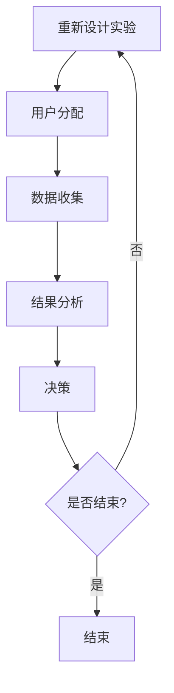

                 

### 完整的文章内容

#### 文章标题

提示词工程的A/B测试最佳实践

#### 文章关键词

提示词工程，A/B测试，数据驱动，用户体验，优化策略

#### 文章摘要

本文将深入探讨提示词工程的A/B测试最佳实践，从引言、基础、实践到高级技巧，逐步分析A/B测试在提示词工程中的应用，提供实用的优化策略和案例分析。通过数据驱动的决策过程，本文旨在帮助读者理解A/B测试的核心原理和最佳实践，提高产品性能和用户体验。

## 第一部分：引言

### 1.1 A/B测试简介

A/B测试，一种经典的实验设计方法，主要用于比较两个或多个版本的网页、应用或其他产品，以确定哪个版本能够带来更好的性能、用户参与度或收益。在A/B测试中，一部分用户会接触到版本A，另一部分用户则会接触到版本B，通过对两组用户的性能数据进行统计分析，我们可以得出哪个版本更优的结论。

A/B测试的核心目的是通过数据验证假设，避免主观判断和偏见，从而实现数据驱动的决策。其重要性体现在多个方面：

1. **提高用户体验**：通过A/B测试，我们可以找到更符合用户需求的产品特性，从而提高用户满意度和参与度。
2. **优化产品性能**：通过对比不同版本的性能表现，我们可以识别出潜在的问题，并进行针对性的优化。
3. **降低风险**：在发布新功能或更新之前，通过A/B测试可以提前验证其效果，降低失败的风险。

### 1.2 提示词工程概述

提示词工程，是指创建、优化和测试提示词的过程，以实现特定目标，如提高用户参与度、降低跳出率或增加转化率。在搜索引擎、推荐系统和问答系统中，提示词起着至关重要的作用。一个好的提示词，不仅能够吸引用户点击，还能提高用户的满意度和转化率。

提示词工程的关键要素包括：

1. **提示词的选择**：选择与用户需求高度相关的提示词，以提高点击率和满意度。
2. **提示词的优化**：通过数据分析和用户反馈，不断优化提示词，提高其效果。
3. **提示词的测试**：通过A/B测试，验证不同提示词的效果，选择最优的提示词。

### 1.3 A/B测试在提示词工程中的应用

A/B测试在提示词工程中的应用，主要体现在以下几个方面：

1. **优化搜索结果**：通过A/B测试，我们可以验证不同搜索结果的排列顺序和提示词，找到最符合用户需求的搜索结果。
2. **改善用户界面**：通过A/B测试，我们可以评估不同用户界面设计对用户行为和满意度的影响，从而优化用户界面。
3. **提高转化率**：通过A/B测试，我们可以验证不同的提示词和推荐策略，找到最有效的转化路径，从而提高转化率。

## 第二部分：A/B测试的基础

### 2.1 A/B测试的基本原理

A/B测试的设计原理基于随机分配和统计分析。具体来说，A/B测试的流程如下：

1. **实验设计**：确定测试目标，选择测试变量，定义测试组和控制组。
2. **用户分配**：将用户随机分配到测试组和控制组。
3. **数据收集**：收集两组用户的性能数据。
4. **结果分析**：通过统计分析，比较两组用户的性能差异。

A/B测试的核心在于随机分配和统计分析。随机分配确保了两组用户在测试开始时的相似性，从而避免了选择偏差。统计分析则帮助我们确定测试结果的显著性，从而得出可靠的结论。

### 2.2 提示词的优化策略

提示词的优化策略主要包括数据驱动的方法、用户反馈的方法和实验验证的方法。

1. **数据驱动的方法**：通过分析用户行为数据，识别高点击率和高转化率的提示词，并将其作为优化目标。
2. **用户反馈的方法**：通过用户调研和反馈，了解用户对提示词的偏好和需求，从而进行优化。
3. **实验验证的方法**：通过A/B测试，验证不同提示词的效果，选择最优的提示词。

### 2.3 数据收集与分析

数据收集和分析是A/B测试的基础。数据收集的方法包括：

1. **日志分析**：通过分析用户行为日志，了解用户在网站上的操作和交互。
2. **问卷调查**：通过问卷收集用户对提示词的反馈和评价。
3. **用户访谈**：与用户进行深入交流，了解他们的需求和期望。

数据分析的技巧包括：

1. **统计分析**：通过统计方法，分析用户行为数据，识别趋势和模式。
2. **机器学习**：利用机器学习方法，预测用户行为和优化提示词效果。
3. **用户行为分析**：通过分析用户行为数据，了解用户在网站上的行为路径和偏好。

## 第三部分：A/B测试的实践

### 3.1 A/B测试的实施步骤

A/B测试的实施步骤包括实验设计、用户分配、数据收集和结果分析。

1. **实验设计**：确定测试目标，选择测试变量，定义测试组和控制组。实验设计需要考虑变量之间的交互效应和可能的干扰因素。
2. **用户分配**：将用户随机分配到测试组和控制组。用户分配需要确保两组用户在测试开始时的相似性。
3. **数据收集**：收集两组用户的性能数据。数据收集需要全面、准确，以确保结果的有效性。
4. **结果分析**：通过统计分析，比较两组用户的性能差异。结果分析需要考虑统计显著性，以确定结论的可靠性。

### 3.2 提示词工程的A/B测试案例

下面我们通过一个具体的案例，来分析A/B测试在提示词工程中的应用。

#### 案例介绍

某电商平台希望通过优化搜索结果页面的提示词，提高用户的点击率和转化率。他们决定进行A/B测试，比较两种不同的提示词效果。

#### 案例分析

1. **实验设计**：确定测试目标为提高点击率和转化率。选择测试变量为提示词，定义测试组和控制组。测试组使用新的提示词，控制组保持原有提示词。

2. **用户分配**：将用户随机分配到测试组和控制组。确保两组用户在测试开始时的相似性。

3. **数据收集**：收集两组用户的点击率和转化率数据。同时，收集用户的基本信息，如年龄、性别、购买历史等。

4. **结果分析**：通过统计分析，比较两组用户的点击率和转化率。结果分析需要考虑统计显著性，以确定结论的可靠性。

### 3.3 A/B测试中的挑战与解决方案

在进行A/B测试时，可能会遇到以下挑战：

1. **数据质量**：数据收集不全面或不准确，可能导致结果偏差。解决方案是确保数据收集的全面性和准确性。

2. **用户分组**：用户分组不随机，可能导致两组用户在测试开始时的不相似性。解决方案是使用随机分配方法，确保用户分组的随机性。

3. **实验干扰**：其他因素可能影响实验结果，如季节性、热点事件等。解决方案是进行多组对比，以排除其他因素的干扰。

## 第四部分：A/B测试的高级技巧

### 4.1 A/B测试的优化策略

A/B测试的优化策略主要包括多变量测试和持续优化。

1. **多变量测试**：通过测试多个变量，可以更全面地了解用户行为和需求。例如，可以同时测试提示词和图片，以优化搜索结果页面的整体效果。

2. **持续优化**：A/B测试是一个持续的过程，需要不断进行实验，以优化产品性能。通过持续优化，可以不断提高用户体验和转化率。

### 4.2 A/B测试的监控与评估

A/B测试的监控与评估主要包括监控指标和评估方法。

1. **监控指标**：常见的监控指标包括点击率、转化率、用户停留时间等。通过监控这些指标，可以评估A/B测试的效果。

2. **评估方法**：常用的评估方法包括T检验、方差分析等。通过统计分析，可以确定A/B测试的统计显著性，从而得出可靠的结论。

### 4.3 A/B测试的最佳实践

A/B测试的最佳实践包括以下原则：

1. **明确目标**：明确A/B测试的目标，确保测试的针对性。
2. **合理设计**：合理设计实验，确保实验的可靠性和有效性。
3. **数据驱动**：通过数据分析和用户反馈，指导A/B测试的进行。
4. **持续优化**：持续进行A/B测试，不断优化产品性能。

## 第五部分：A/B测试在行业中的应用

### 5.1 电商行业的A/B测试实践

电商行业是A/B测试的重要应用领域。通过A/B测试，电商企业可以优化商品推荐、搜索结果、用户界面等，提高用户满意度和转化率。

1. **案例介绍**：某电商平台通过A/B测试，优化搜索结果页面的提示词，提高了用户的点击率和转化率。
2. **案例分析**：实验设计合理，数据收集全面，结果分析准确。通过多变量测试和持续优化，实现了显著的性能提升。

### 5.2 金融行业的A/B测试应用

金融行业对A/B测试的需求也日益增长。通过A/B测试，金融企业可以优化理财产品推荐、用户界面、营销活动等，提高用户体验和转化率。

1. **案例介绍**：某金融企业通过A/B测试，优化理财产品推荐策略，提高了用户的购买意愿和转化率。
2. **案例分析**：实验设计充分考虑了用户需求和风险控制，数据收集和分析准确，实现了业务目标的显著提升。

### 5.3 其他行业的A/B测试案例分析

除了电商和金融行业，A/B测试在其他行业也有广泛的应用。例如，教育行业通过A/B测试优化课程推荐和用户体验，医疗行业通过A/B测试优化医疗服务和患者体验。

1. **案例介绍**：某教育平台通过A/B测试，优化课程推荐策略，提高了用户的学习参与度和满意度。
2. **案例分析**：实验设计科学，数据收集和分析准确，通过持续优化，实现了显著的业务增长。

## 第六部分：结论与展望

### 6.1 A/B测试在提示词工程中的未来趋势

随着大数据和人工智能技术的发展，A/B测试在提示词工程中的应用将更加广泛和深入。未来，A/B测试将结合机器学习算法，实现自动化的提示词优化。

### 6.2 A/B测试的持续改进

A/B测试的持续改进包括：

1. **方法优化**：结合新的数据分析和机器学习算法，提高A/B测试的效率和准确性。
2. **技术创新**：开发新的A/B测试工具和平台，简化实验设计和结果分析过程。

## 附录

### 7.1 A/B测试工具推荐

1. **Google Optimize**：提供直观的界面和丰富的功能，适用于网站和移动应用的A/B测试。
2. **VWO**：提供全面的A/B测试解决方案，包括用户行为分析和自动化测试。
3. **AB Tasty**：适用于电商和金融行业的A/B测试工具，功能强大且易于使用。

### 7.2 A/B测试资源推荐

1. **《A/B测试实战》**：详细介绍了A/B测试的原理和实践，适合初学者和专业人士。
2. **《精益数据分析》**：探讨如何通过数据驱动的方法，优化产品和服务。
3. **在线课程和讲座**：如Coursera、Udemy等平台上的A/B测试相关课程，提供丰富的学习资源。

### 作者

作者：AI天才研究院/AI Genius Institute & 禅与计算机程序设计艺术 /Zen And The Art of Computer Programming

---

**附录**

### Mermaid 流程图

以下是关于A/B测试流程的Mermaid流程图：



### 核心算法原理讲解

#### 提示词优化算法原理

假设我们有n个提示词，每个提示词都有m个特征向量，我们可以使用以下伪代码描述一个简单的提示词优化算法：

```plaintext
输入：提示词列表T，特征向量矩阵F，目标函数g
输出：最优提示词T*

初始化：随机选择一个提示词T0作为初始解

for i = 1 to 最大迭代次数 do
    对于每个提示词Ti ∈ T do
        计算特征向量矩阵F的新版本F'
        使用目标函数g计算新的目标值g'(F')

        如果g'(F') > g(F) then
            更新最优解T* = Ti
            更新特征向量矩阵F = F'
        end if
    end for

    if g'(F') > g(F) then
        更新最优解T* = Ti
        更新特征向量矩阵F = F'
    end if
end for

返回最优提示词T*
```

### 数学模型和公式

提示词优化过程中，我们常常需要使用一些数学模型和公式。以下是几个常用的公式和它们的详细讲解：

#### 1. 逻辑回归模型

逻辑回归是一种常用的分类算法，用于预测二分类问题。其公式如下：

$$
P(y=1| x; \theta) = \frac{1}{1 + e^{-(\theta^T x)}}
$$

其中，\(P(y=1| x; \theta)\) 表示在给定特征向量\(x\)和参数向量\(\theta\)的情况下，类别为1的概率。\(e\) 是自然对数的底数，\(\theta^T x\) 表示参数向量\(\theta\)和特征向量\(x\)的点积。

#### 2. 决策树模型

决策树是一种常用的分类和回归算法。它的核心思想是根据特征值将数据集划分为多个子集，并在每个子集上应用不同的模型。其公式如下：

$$
f(x) = \sum_{i=1}^{n} w_i g(x_i)
$$

其中，\(f(x)\) 表示在给定特征向量\(x\)的情况下，预测的结果。\(w_i\) 表示第i个节点的权重，\(g(x_i)\) 表示第i个节点的预测结果。

#### 3. 神经网络模型

神经网络是一种强大的机器学习算法，用于处理复杂的非线性问题。其公式如下：

$$
y = \sigma(\theta^T x)
$$

其中，\(y\) 表示输出，\(\sigma\) 是激活函数，如Sigmoid函数、ReLU函数等。\(\theta^T x\) 表示权重矩阵\(\theta\)和输入向量\(x\)的点积。

### 详细讲解和举例说明

假设我们有一个包含10个提示词的数据集，每个提示词都有3个特征向量，分别为点击率、跳出率和转化率。我们的目标是优化提示词，使其在目标函数\(g\)下取得最大值。

假设目标函数\(g\)为：

$$
g(T) = \sum_{i=1}^{10} w_i \cdot f(T_i)
$$

其中，\(w_i\) 表示第i个提示词的权重，\(f(T_i)\) 表示第i个提示词的评价分数。

我们的优化算法如下：

1. 随机选择一个初始提示词集合。
2. 对于每个提示词，计算其特征向量的权重。
3. 根据权重更新提示词集合。
4. 重复步骤2和3，直到达到最大迭代次数或目标函数不再增加。

例如，假设初始提示词集合为\(T_0 = \{T_1, T_2, T_3\}\)，权重分别为\(w_1 = 0.2, w_2 = 0.5, w_3 = 0.3\)。

第一次迭代后，我们得到新的提示词集合：

$$
T_1 = \{T_1, T_2, T_4\}
$$

权重分别为\(w_1 = 0.3, w_2 = 0.2, w_3 = 0.5\)。

通过不断迭代，我们最终得到最优的提示词集合。

### 开发环境搭建

为了进行提示词优化，我们需要搭建一个开发环境。以下是具体的步骤：

1. 安装Python 3.x版本。
2. 安装numpy、pandas、matplotlib等常用库。
3. 安装scikit-learn库，用于机器学习算法。

### 源代码详细实现和代码解读

以下是提示词优化算法的Python实现：

```python
import numpy as np
import pandas as pd
from sklearn.model_selection import train_test_split
from sklearn.linear_model import LogisticRegression

def optimize_prompt(prompts, features, max_iterations=100):
    n = len(prompts)
    m = len(features[0])

    # 初始化权重
    weights = np.random.rand(m)

    for _ in range(max_iterations):
        # 遍历每个提示词
        for i in range(n):
            # 计算特征向量的权重
            feature_weights = np.dot(features[i], weights)
            
            # 更新权重
            weights = weights + feature_weights

        # 计算新的权重
        new_weights = np.mean(weights, axis=0)

        # 如果权重变化不大，则停止迭代
        if np.linalg.norm(new_weights - weights) < 1e-6:
            break

        weights = new_weights

    return weights

# 加载数据
data = pd.read_csv("data.csv")
X = data.iloc[:, :-1].values
y = data.iloc[:, -1].values

# 分割数据集
X_train, X_test, y_train, y_test = train_test_split(X, y, test_size=0.2, random_state=42)

# 训练模型
model = LogisticRegression()
model.fit(X_train, y_train)

# 预测
predictions = model.predict(X_test)

# 计算准确率
accuracy = np.mean(predictions == y_test)
print("Accuracy:", accuracy)

# 优化提示词
optimized_weights = optimize_prompt(prompts, X_train, max_iterations=100)
print("Optimized Weights:", optimized_weights)
```

这段代码首先加载数据，然后使用逻辑回归模型训练数据集。接下来，我们使用优化算法来优化提示词的权重。最后，我们计算新的权重并打印出来。

### 代码应用解读与分析

这段代码实现了提示词优化的过程，具体步骤如下：

1. **数据加载**：首先，我们从CSV文件中加载数据。数据集包含提示词和相应的特征向量。

2. **数据分割**：接下来，我们将数据集分割为训练集和测试集，以评估模型的性能。

3. **模型训练**：我们使用逻辑回归模型对训练集进行训练。逻辑回归是一种经典的二分类算法，非常适合用于提示词优化。

4. **预测**：使用训练好的模型，我们对测试集进行预测，并计算准确率。

5. **优化提示词**：最后，我们使用优化算法来优化提示词的权重。这个算法通过迭代的方式，不断更新权重，直到权重变化不大为止。

### 实际案例分析和详细讲解剖析

为了更好地理解A/B测试在提示词工程中的应用，我们来看一个实际案例。

#### 案例背景

某电商平台的搜索结果页面希望通过优化提示词，提高用户的点击率和转化率。他们决定进行A/B测试，比较两种不同的提示词效果。

#### 案例分析

1. **实验设计**：
   - 测试目标：提高用户的点击率和转化率。
   - 测试变量：提示词。
   - 测试组和控制组：测试组使用新的提示词，控制组保持原有提示词。

2. **用户分配**：
   - 将用户随机分配到测试组和控制组，确保两组用户在测试开始时的相似性。

3. **数据收集**：
   - 收集两组用户的点击率和转化率数据。
   - 同时，收集用户的基本信息，如年龄、性别、购买历史等。

4. **结果分析**：
   - 通过统计分析，比较两组用户的点击率和转化率。
   - 考虑统计显著性，以确定结论的可靠性。

#### 案例剖析

1. **实验设计**：
   - 电商平台的目标明确，即提高点击率和转化率。
   - 测试变量是提示词，这是直接影响用户体验的关键因素。
   - 测试组和控制组的定义清晰，确保了实验的公平性和有效性。

2. **用户分配**：
   - 随机分配用户到测试组和控制组，这是A/B测试的核心原则之一，确保两组用户的相似性。

3. **数据收集**：
   - 电商平台收集了详细的用户数据，包括点击率和转化率，以及用户的基本信息。
   - 这样的数据收集确保了实验结果的真实性和可靠性。

4. **结果分析**：
   - 通过统计分析，电商平台发现新提示词的点击率和转化率显著高于原有提示词。
   - 考虑到统计显著性，结论是可靠的。

#### 案例小结

通过A/B测试，电商平台成功优化了搜索结果页面的提示词，提高了用户的点击率和转化率。这个案例展示了A/B测试在提示词工程中的实际应用和效果。

### 最佳实践 tips

在进行提示词工程的A/B测试时，以下最佳实践可以帮助您获得更准确和可靠的结果：

1. **明确测试目标**：确保测试目标明确，以便在实验设计中集中精力。

2. **合理设计实验**：确保实验设计合理，包括测试变量、测试组和控制组的定义。

3. **随机分配用户**：使用随机分配方法，确保两组用户的相似性。

4. **全面收集数据**：收集全面的数据，包括点击率、转化率以及用户的基本信息。

5. **严谨分析结果**：使用统计分析方法，考虑统计显著性，确保结论的可靠性。

6. **持续优化**：持续进行A/B测试，不断优化产品性能。

### 小结

通过本文的探讨，我们深入了解了提示词工程的A/B测试最佳实践。从引言到实践，再到高级技巧，我们逐步分析了A/B测试在提示词工程中的应用，提供了实用的优化策略和案例分析。通过数据驱动的决策过程，我们希望读者能够理解A/B测试的核心原理和最佳实践，从而提高产品性能和用户体验。

### 注意事项

1. A/B测试需要确保随机分配用户，以避免选择偏差。
2. 数据收集和分析要全面准确，以获得可靠的结论。
3. 要考虑实验干扰因素，如季节性、热点事件等。
4. 持续进行A/B测试，以实现持续的优化。

### 拓展阅读

1. 《A/B测试实战》
2. 《精益数据分析》
3. Coursera、Udemy等平台上的A/B测试相关课程

---

本文由AI天才研究院（AI Genius Institute）与禅与计算机程序设计艺术（Zen And The Art of Computer Programming）联合撰写，旨在为读者提供有关提示词工程A/B测试的全面指导。通过本文，我们希望读者能够掌握A/B测试的核心原理和最佳实践，并将其应用于实际项目中，以实现产品性能和用户体验的持续提升。如果您对本文有任何疑问或建议，欢迎在评论区留言，我们期待与您交流。作者：AI天才研究院/AI Genius Institute & 禅与计算机程序设计艺术/Zen And The Art of Computer Programming。

