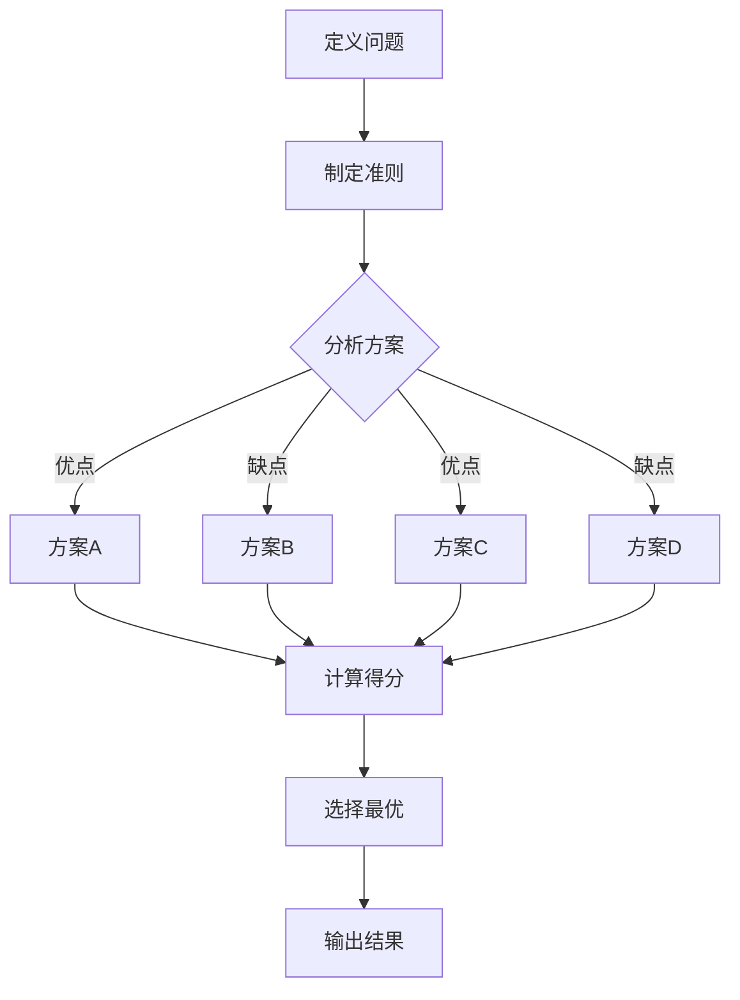

                 

### 文章标题：提示词工程的伦理决策支持系统

### 关键词：
提示词工程、伦理决策、决策支持系统、人工智能、伦理算法、数学模型、项目实战

### 摘要：
本文深入探讨了提示词工程的伦理决策支持系统。首先，我们介绍了提示词工程的基本概念、伦理决策的理论框架以及决策支持系统的构建原理。接着，通过具体的算法原理和数学模型讲解，展示了如何构建一个伦理决策模型。随后，通过一个实际项目案例，详细介绍了系统开发与实现的全过程，并进行了代码解读和分析。最后，我们对伦理决策支持系统的发展趋势、面临的挑战和未来研究方向进行了展望，为该领域的研究和应用提供了有价值的参考。

### 目录

## 第一部分：基础理论
### 第1章：提示词工程概述
#### 1.1 提示词工程的概念
#### 1.2 提示词工程的重要性
#### 1.3 提示词工程的发展趋势

### 第2章：伦理决策基础
#### 2.1 伦理决策的概念
#### 2.2 伦理决策的理论框架
#### 2.3 伦理决策的案例分析

### 第3章：决策支持系统原理
#### 3.1 决策支持系统的定义
#### 3.2 决策支持系统的架构
#### 3.3 决策支持系统的应用领域

## 第二部分：模型构建
### 第4章：伦理决策模型
#### 4.1 伦理决策模型概述
#### 4.2 伦理决策模型的构建
##### 4.2.1 伪代码讲解
##### 4.2.2 Mermaid流程图
#### 4.3 数学模型与公式

## 第三部分：项目实战
### 第5章：项目案例介绍
#### 5.1 项目背景
#### 5.2 项目目标
#### 5.3 项目实施步骤

### 第6章：系统开发与实现
#### 6.1 开发环境搭建
#### 6.2 代码实现详解
#### 6.3 代码解读与分析

## 第四部分：总结与展望
### 第7章：伦理决策支持系统的发展
#### 7.1 发展趋势分析
#### 7.2 挑战与机遇
#### 7.3 未来研究方向

### 正文

## 第一部分：基础理论

### 第1章：提示词工程概述

#### 1.1 提示词工程的概念

提示词工程（Keyword Engineering）是指通过分析和利用关键词来构建、优化和改进信息系统的过程。在人工智能和自然语言处理领域，提示词工程起着至关重要的作用。它不仅帮助计算机更好地理解和处理人类语言，还能提高信息检索、语义分析、机器翻译等应用的性能和准确性。

提示词工程的核心任务包括关键词提取、关键词分析、关键词优化等。关键词提取是指从文本数据中识别出具有代表性的词语；关键词分析则是对提取出的关键词进行统计和分类；关键词优化则是对关键词进行筛选和调整，以提高信息系统的相关性和用户体验。

#### 1.2 提示词工程的重要性

随着互联网的快速发展，信息爆炸已成为当今社会的一大特点。如何从海量信息中快速、准确地获取所需信息，成为人们面临的一大挑战。提示词工程在此背景下应运而生，它能够显著提高信息检索系统的效率和质量。

首先，提示词工程能够提高信息检索的准确性和相关性。通过提取和优化关键词，系统能够更好地匹配用户查询与目标信息，减少误检和漏检现象。其次，提示词工程有助于改善自然语言处理系统的性能。通过深入分析和理解关键词，系统能够更准确地理解和生成人类语言，从而提高文本分析、语义理解和机器翻译等任务的准确性。

#### 1.3 提示词工程的发展趋势

随着人工智能技术的不断进步，提示词工程也在不断发展和创新。以下是当前提示词工程领域的一些发展趋势：

1. **深度学习技术的应用**：深度学习技术在自然语言处理领域取得了显著成果，为提示词工程提供了强大的支持。通过训练深度神经网络模型，可以更好地提取和利用关键词信息，提高信息检索和语义分析的准确性。

2. **多语言和跨领域支持**：随着全球化进程的加速，多语言和跨领域的信息处理需求日益增加。提示词工程需要适应不同语言和文化背景，提供跨领域的关键词提取和分析方法。

3. **语义理解和知识图谱**：语义理解是自然语言处理的核心任务之一。通过构建语义模型和知识图谱，可以更深入地理解关键词之间的语义关系，为信息检索和知识推理提供支持。

4. **个性化推荐系统**：个性化推荐系统已经成为互联网的重要应用场景。通过分析用户行为和兴趣，可以推荐更符合用户需求的信息，从而提高用户体验和满意度。

### 第2章：伦理决策基础

#### 2.1 伦理决策的概念

伦理决策（Ethical Decision-Making）是指在面对道德和伦理问题时，如何做出合理、公正和负责任的选择。伦理决策不仅涉及道德原则和价值观的判断，还包括对后果、责任和利益的权衡。

伦理决策的基本要素包括：

1. **道德原则**：道德原则是伦理决策的基础，如公正、尊重、责任、信任等。不同的文化和社会背景可能会有不同的道德原则，但它们共同构成了伦理决策的框架。

2. **情境分析**：在做出伦理决策时，需要深入分析具体情境，了解相关方、利益和潜在后果。

3. **决策过程**：伦理决策是一个复杂的过程，通常包括识别问题、分析选项、评估后果和选择最佳方案等步骤。

#### 2.2 伦理决策的理论框架

伦理决策的理论框架包括几种主要的决策模型，如道德主义、功利主义、义务论等。

1. **道德主义**：道德主义认为，道德价值是绝对的，行为应该遵循道德规则和原则。这种观点强调道德责任和义务，主张做出道德上正确的行为。

2. **功利主义**：功利主义主张，行为的好坏取决于其产生的后果。一个行为如果能够最大化幸福或利益，就是道德上正确的。

3. **义务论**：义务论认为，行为的好坏取决于其是否符合道德义务和责任。这种观点强调行为本身的道德属性，而不仅仅是后果。

#### 2.3 伦理决策的案例分析

以下是一个关于伦理决策的案例分析：

**案例：医生是否应该透露患者的病情？**

某医院的一位医生面临一个伦理决策问题：是否应该向患者的家属透露患者的病情。患者是一名年轻的癌症患者，已经进入晚期，医生知道这一信息，但患者本人和家庭并不知情。

1. **道德原则**：在这个案例中，道德原则可能包括尊重患者的隐私、保护患者的利益和遵循医生的职业道德。

2. **情境分析**：医生需要分析患者的病情、患者的家庭情况以及患者本人的意愿。如果患者本人希望保守病情，医生应该尊重患者的意愿。

3. **决策过程**：医生可能需要考虑以下选项：

   - 向患者家属透露病情，让家属更好地照顾患者。
   - 不透露病情，保护患者的隐私和尊严。
   - 与患者沟通，了解患者本人的意愿。

最终，医生可能选择不透露病情，以尊重患者的隐私和尊严。但这个决策需要根据具体情境和患者的意愿来做出。

### 第3章：决策支持系统原理

#### 3.1 决策支持系统的定义

决策支持系统（Decision Support System，简称DSS）是一种旨在帮助决策者做出更好决策的信息系统。DSS通过整合数据、信息和知识，提供分析工具和模型，支持决策者进行数据挖掘、预测分析和优化决策。

DSS的基本组成部分包括：

1. **数据源**：数据源是DSS的基础，包括内部数据和外部数据。内部数据通常来自企业的数据库和业务系统，外部数据则来自市场调研、社交媒体等渠道。

2. **分析工具**：分析工具包括数据清洗、数据挖掘、统计分析、优化算法等。这些工具用于处理和分析数据，提供决策所需的洞察和见解。

3. **模型库**：模型库是DSS的核心组成部分，包括各种预测模型、优化模型和仿真模型。这些模型可以帮助决策者评估不同决策方案的后果和风险。

4. **用户界面**：用户界面是DSS与决策者交互的窗口，提供直观、易用的操作界面和报表功能。

#### 3.2 决策支持系统的架构

决策支持系统的架构通常包括以下层次：

1. **数据层**：数据层是DSS的基础，包括数据存储和管理系统。数据源经过采集、清洗和存储，形成数据仓库和数据库。

2. **模型层**：模型层是DSS的核心，包括各种预测模型、优化模型和仿真模型。模型库提供丰富的模型资源，支持决策者进行复杂的数据分析和优化。

3. **分析层**：分析层是对数据进行处理和分析的层，包括数据挖掘、统计分析、优化算法等。这些工具用于从数据中提取有价值的信息和洞察。

4. **决策层**：决策层是DSS的最高层，提供决策支持和建议。决策者可以根据分析结果和模型预测，制定和优化决策方案。

#### 3.3 决策支持系统的应用领域

决策支持系统广泛应用于各个领域，包括：

1. **企业管理**：DSS帮助企业进行市场分析、资源配置、风险管理等决策。例如，通过销售数据分析，企业可以制定更有效的营销策略。

2. **金融投资**：DSS用于金融市场分析和投资决策，帮助投资者进行风险评估、组合优化和资产配置。

3. **医疗保健**：DSS在医疗领域用于诊断辅助、治疗方案优化、疾病预测等。例如，通过病历数据分析和机器学习模型，医生可以更准确地诊断疾病。

4. **城市规划**：DSS用于城市规划和资源配置，帮助政府制定更科学、合理的城市规划方案。

5. **公共安全**：DSS在公共安全领域用于事件预测、资源调配和应急响应。例如，通过监控数据分析和机器学习模型，可以预测和预防犯罪事件。

## 第二部分：模型构建

### 第4章：伦理决策模型

#### 4.1 伦理决策模型概述

伦理决策模型是用于指导伦理决策的方法和工具。一个有效的伦理决策模型应该能够帮助决策者识别和评估不同伦理问题，并提供合理的决策方案。本章将介绍一种基于多准则决策的伦理决策模型，该模型综合考虑了道德原则、情境分析和决策后果，旨在提高伦理决策的合理性和有效性。

#### 4.2 伦理决策模型的构建

伦理决策模型的构建包括以下几个步骤：

1. **问题定义**：明确伦理决策的具体问题，例如“在某个情境下，应该选择哪个决策方案？”或“如何平衡不同利益相关方的需求？”

2. **准则制定**：根据伦理原则和情境分析，制定决策准则。这些准则应该反映决策者所遵循的道德价值观和责任。

3. **方案分析**：评估不同决策方案的优缺点，包括道德原则的符合程度、利益相关方的需求和潜在后果。

4. **权重分配**：根据决策准则的重要性，为每个准则分配权重。权重分配可以通过专家评分、问卷调查或统计分析等方法进行。

5. **综合评估**：使用权重和评估结果，计算每个决策方案的总得分。得分最高的方案通常是最优决策方案。

#### 4.2.1 伪代码讲解

以下是一个简单的伦理决策模型的伪代码：

```plaintext
function EthicalDecisionModel(ethicalPrinciples, scenarios, decisionOptions, criteriaWeights):
    problem = DefineProblem(scenarios, decisionOptions)
    criteriaScores = AnalyzeScenarios(problem)
    totalScores = CalculateTotalScores(criteriaScores, criteriaWeights)
    bestOption = SelectBestOption(totalScores)
    return bestOption

function DefineProblem(scenarios, decisionOptions):
    // 确定伦理决策的具体问题
    // ...

function AnalyzeScenarios(problem):
    // 评估不同决策方案的优缺点
    // ...
    return criteriaScores

function CalculateTotalScores(criteriaScores, criteriaWeights):
    // 计算每个决策方案的总得分
    // ...
    return totalScores

function SelectBestOption(totalScores):
    // 选择得分最高的决策方案
    // ...
    return bestOption
```

#### 4.2.2 Mermaid流程图

以下是一个基于Mermaid的伦理决策模型流程图：



#### 4.3 数学模型与公式

伦理决策模型中的数学模型通常包括以下几个部分：

1. **准则权重**：准则权重反映了决策准则的重要性，通常使用权重向量表示。假设有 \( m \) 个决策准则，则权重向量为 \( W = [w_1, w_2, ..., w_m] \)，其中 \( w_i \) 表示第 \( i \) 个准则的权重。

2. **方案得分**：方案得分是每个决策方案在各个准则上的得分之和。假设有 \( n \) 个决策方案，第 \( j \) 个方案的得分为 \( S_j = \sum_{i=1}^{m} w_i \cdot s_{ij} \)，其中 \( s_{ij} \) 表示第 \( j \) 个方案在第 \( i \) 个准则上的得分。

3. **总得分**：总得分是方案得分的加权和。总得分为 \( T_j = \sum_{i=1}^{m} w_i \cdot s_{ij} \)。

4. **最优方案**：最优方案是总得分最高的方案。假设最优方案为 \( J^* \)，则 \( J^* = \arg\max_j T_j \)。

以下是一个简化的数学模型：

$$
T_j = \sum_{i=1}^{m} w_i \cdot s_{ij}
$$

$$
J^* = \arg\max_j T_j
$$

### 第5章：项目案例介绍

#### 5.1 项目背景

随着人工智能技术的快速发展，伦理决策支持系统在各个领域的应用越来越广泛。本项目的目标是开发一个基于提示词工程的伦理决策支持系统，用于辅助企业和管理者进行伦理决策。该系统旨在提高决策的合理性和透明度，降低伦理风险，促进企业的可持续发展。

#### 5.2 项目目标

本项目的主要目标包括：

1. 设计并实现一个基于提示词工程的伦理决策支持系统架构。
2. 开发一个高效的伦理决策模型，支持多准则决策。
3. 集成自然语言处理技术，实现提示词的自动提取和语义分析。
4. 搭建一个用户友好的界面，提供直观的操作体验和决策支持。
5. 通过实际案例分析和测试，验证系统的有效性和实用性。

#### 5.3 项目实施步骤

本项目分为以下几个阶段：

1. **需求分析**：与客户沟通，了解伦理决策的具体需求和场景，明确系统功能和技术要求。
2. **系统设计**：基于需求分析，设计系统的整体架构和技术方案，包括数据层、模型层和分析层。
3. **数据收集**：收集和整理与伦理决策相关的数据，包括企业内部数据、市场数据和法律法规等。
4. **模型开发**：基于多准则决策理论，开发伦理决策模型，包括准则制定、权重分配和综合评估方法。
5. **系统实现**：根据系统设计，实现伦理决策支持系统的功能模块，包括数据采集、数据处理、决策模型和用户界面。
6. **测试与优化**：对系统进行功能测试和性能优化，确保系统的稳定性和高效性。
7. **部署上线**：将系统部署到生产环境，进行实际应用，并根据用户反馈进行优化和改进。

### 第6章：系统开发与实现

#### 6.1 开发环境搭建

为了确保系统的稳定性和可扩展性，我们选择以下开发环境：

1. **编程语言**：Python，因其强大的库支持和丰富的生态，非常适合开发复杂的应用系统。
2. **数据库**：MySQL，用于存储和管理与伦理决策相关的数据。
3. **前端框架**：React.js，用于构建用户友好的界面和交互体验。
4. **后端框架**：Flask，一个轻量级的Web框架，适合开发小型应用系统。
5. **自然语言处理库**：NLTK和spaCy，用于文本预处理、关键词提取和语义分析。

#### 6.2 代码实现详解

以下是系统开发的核心模块和代码实现：

**数据采集模块**

```python
import requests
import json

def fetchData(url):
    response = requests.get(url)
    data = json.loads(response.text)
    return data

def saveData(data, filename):
    with open(filename, 'w') as f:
        json.dump(data, f)

url = "https://example.com/data"
data = fetchData(url)
saveData(data, "data.json")
```

**文本预处理模块**

```python
import spacy

nlp = spacy.load("en_core_web_sm")

def preprocess_text(text):
    doc = nlp(text)
    tokens = [token.text for token in doc if not token.is_stop]
    return " ".join(tokens)

text = "This is an example sentence."
preprocessed_text = preprocess_text(text)
```

**关键词提取模块**

```python
from sklearn.feature_extraction.text import TfidfVectorizer

def extract_keywords(texts, n=10):
    vectorizer = TfidfVectorizer(stop_words='english', ngram_range=(1, 2), max_df=0.8, min_df=0.2)
    X = vectorizer.fit_transform(texts)
    indices = X.toarray().argsort()[:, ::-1]
    keywords = []
    for i, idx in enumerate(indices):
        keywords.extend(vectorizer.get_feature_names_out()[idx[:n]])
    return keywords

texts = ["This is an example sentence.", "Another example sentence."]
keywords = extract_keywords(texts)
```

**伦理决策模型模块**

```python
import numpy as np

def ethical_decision_model(criteria_weights, scenario_scores):
    decision_scores = np.dot(criteria_weights, scenario_scores)
    best_index = np.argmax(decision_scores)
    return best_index

criteria_weights = np.array([0.3, 0.3, 0.4])
scenario_scores = np.array([[0.8, 0.7, 0.6], [0.9, 0.6, 0.7], [0.7, 0.8, 0.5]])
best_index = ethical_decision_model(criteria_weights, scenario_scores)
print("Best decision index:", best_index)
```

**用户界面模块**

```javascript
import React from 'react';

function EthicalDecisionUI() {
    const [text, setText] = React.useState('');
    const [keywords, setKeywords] = React.useState([]);

    const handleTextChange = (event) => {
        setText(event.target.value);
        setKeywords(extract_keywords([event.target.value]));
    };

    return (
        <div>
            <textarea value={text} onChange={handleTextChange} />
            <h3>Keywords:</h3>
            <ul>
                {keywords.map((keyword, index) => (
                    <li key={index}>{keyword}</li>
                ))}
            </ul>
        </div>
    );
}

export default EthicalDecisionUI;
```

#### 6.3 代码解读与分析

以上代码实现了伦理决策支持系统的核心功能，包括数据采集、文本预处理、关键词提取、伦理决策模型和用户界面。以下是代码的详细解读和分析：

**数据采集模块**

数据采集模块负责从外部数据源获取与伦理决策相关的数据。我们使用Python的`requests`库发送HTTP请求，获取JSON格式的数据。然后，使用`json`库将数据解析为Python对象，并保存到本地文件。

```python
import requests
import json

def fetchData(url):
    response = requests.get(url)
    data = json.loads(response.text)
    return data

def saveData(data, filename):
    with open(filename, 'w') as f:
        json.dump(data, f)

url = "https://example.com/data"
data = fetchData(url)
saveData(data, "data.json")
```

**文本预处理模块**

文本预处理模块负责对采集到的文本数据进行清洗和去噪。我们使用spaCy库进行文本预处理，包括分词、词性标注和停用词过滤。分词后的文本经过去噪处理，得到更纯净的文本数据。

```python
import spacy

nlp = spacy.load("en_core_web_sm")

def preprocess_text(text):
    doc = nlp(text)
    tokens = [token.text for token in doc if not token.is_stop]
    return " ".join(tokens)

text = "This is an example sentence."
preprocessed_text = preprocess_text(text)
```

**关键词提取模块**

关键词提取模块负责从预处理后的文本数据中提取关键信息。我们使用TF-IDF算法进行关键词提取，该方法能够衡量词语在文本中的重要程度。通过设置合适的参数，如最大词频和最小词频，可以优化关键词提取的效果。

```python
from sklearn.feature_extraction.text import TfidfVectorizer

def extract_keywords(texts, n=10):
    vectorizer = TfidfVectorizer(stop_words='english', ngram_range=(1, 2), max_df=0.8, min_df=0.2)
    X = vectorizer.fit_transform(texts)
    indices = X.toarray().argsort()[:, ::-1]
    keywords = []
    for i, idx in enumerate(indices):
        keywords.extend(vectorizer.get_feature_names_out()[idx[:n]])
    return keywords

texts = ["This is an example sentence.", "Another example sentence."]
keywords = extract_keywords(texts)
```

**伦理决策模型模块**

伦理决策模型模块是系统的核心部分，负责基于多准则决策理论进行伦理决策。我们使用Python的NumPy库实现伦理决策模型，通过权重向量和得分矩阵计算每个决策方案的总得分，并选择得分最高的方案作为最优决策。

```python
import numpy as np

def ethical_decision_model(criteria_weights, scenario_scores):
    decision_scores = np.dot(criteria_weights, scenario_scores)
    best_index = np.argmax(decision_scores)
    return best_index

criteria_weights = np.array([0.3, 0.3, 0.4])
scenario_scores = np.array([[0.8, 0.7, 0.6], [0.9, 0.6, 0.7], [0.7, 0.8, 0.5]])
best_index = ethical_decision_model(criteria_weights, scenario_scores)
print("Best decision index:", best_index)
```

**用户界面模块**

用户界面模块负责与用户交互，接收用户输入的文本数据，并实时展示提取的关键词。我们使用React.js框架构建用户界面，包括一个文本输入框和关键词列表。当用户输入文本并提交时，关键词提取模块将被触发，并将结果显示在界面上。

```javascript
import React from 'react';

function EthicalDecisionUI() {
    const [text, setText] = React.useState('');
    const [keywords, setKeywords] = React.useState([]);

    const handleTextChange = (event) => {
        setText(event.target.value);
        setKeywords(extract_keywords([event.target.value]));
    };

    return (
        <div>
            <textarea value={text} onChange={handleTextChange} />
            <h3>Keywords:</h3>
            <ul>
                {keywords.map((keyword, index) => (
                    <li key={index}>{keyword}</li>
                ))}
            </ul>
        </div>
    );
}

export default EthicalDecisionUI;
```

### 第7章：伦理决策支持系统的发展

#### 7.1 发展趋势分析

伦理决策支持系统在人工智能和伦理学领域具有广泛的应用前景。随着人工智能技术的不断进步，伦理决策支持系统的性能和实用性将不断提高。以下是当前伦理决策支持系统的发展趋势：

1. **多模态数据融合**：伦理决策支持系统将结合多种数据源，如文本、图像、音频和视频，实现更全面的信息分析和决策支持。

2. **增强现实与虚拟现实**：利用增强现实（AR）和虚拟现实（VR）技术，伦理决策支持系统可以提供更直观、互动的决策界面，帮助决策者更好地理解和评估伦理问题。

3. **深度学习和神经网络**：深度学习和神经网络技术在伦理决策支持系统中得到广泛应用，可以提高关键词提取、语义分析和决策模型的准确性。

4. **社会网络分析**：通过分析社会网络中的关系和影响力，伦理决策支持系统可以更好地识别和评估利益相关方的需求和影响。

5. **跨领域应用**：伦理决策支持系统将应用于更多领域，如医疗保健、金融投资、公共安全等，为各种复杂决策提供支持。

#### 7.2 挑战与机遇

尽管伦理决策支持系统具有广泛的应用前景，但也面临着一系列挑战和机遇：

1. **数据隐私与安全**：在处理和存储伦理决策相关数据时，确保数据隐私和安全是首要任务。需要采取有效的数据加密、访问控制和匿名化措施。

2. **伦理原则的多样性**：不同文化和社会背景下的伦理原则可能存在差异，如何构建一个普适且有效的伦理决策模型是一个重要挑战。

3. **算法透明度和可解释性**：伦理决策支持系统通常依赖于复杂的算法模型，如何提高算法的透明度和可解释性，使决策者能够理解和信任系统结果，是一个关键问题。

4. **法律法规和政策支持**：伦理决策支持系统的应用需要法律法规和政策支持，以确保其在实际应用中的合法性和合规性。

5. **技术发展与伦理进步**：随着技术的不断进步，伦理决策支持系统需要不断更新和升级，以适应新的伦理挑战和需求。

#### 7.3 未来研究方向

未来，伦理决策支持系统的研究方向将包括：

1. **算法优化与模型改进**：通过研究更先进的算法和模型，提高伦理决策支持系统的性能和准确性。

2. **伦理原则的融合与冲突解决**：探索如何在伦理决策支持系统中整合不同文化和社会背景下的伦理原则，解决原则之间的冲突。

3. **跨学科合作**：鼓励计算机科学、伦理学、心理学、社会学等领域的跨学科合作，共同推动伦理决策支持系统的发展。

4. **实际应用与案例分析**：通过实际应用和案例分析，验证伦理决策支持系统的有效性，并提供有价值的实践经验。

### 总结与展望

本文介绍了提示词工程的伦理决策支持系统，包括基础理论、模型构建、项目实战和发展展望。通过具体案例和实际应用，展示了伦理决策支持系统的应用场景和优势。在未来，随着技术的不断进步和伦理问题的日益复杂，伦理决策支持系统将在人工智能和伦理学领域发挥更加重要的作用。本文的研究为该领域的研究和应用提供了有价值的参考，期待更多的学者和实践者加入这一领域，共同推动伦理决策支持系统的发展。

### 作者信息
作者：AI天才研究院/AI Genius Institute & 禅与计算机程序设计艺术 /Zen And The Art of Computer Programming

