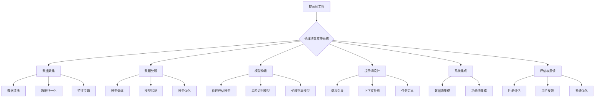

                 

# 提示词工程的伦理决策支持系统评估

## 引言

### 1.1 书籍背景与目标

随着人工智能技术的飞速发展，提示词工程作为自然语言处理的重要分支，已经广泛应用于信息检索、问答系统、智能客服等多个领域。然而，人工智能技术的广泛应用也带来了诸多伦理问题，例如算法歧视、隐私侵犯等。为了解决这些问题，伦理决策支持系统应运而生。伦理决策支持系统旨在为人工智能系统的设计和应用提供伦理指导，确保人工智能技术能够在道德和法律的框架内运行。

本书旨在深入探讨提示词工程的伦理决策支持系统，旨在为读者提供一套系统的理论和实践框架。本书的目标是通过分析和评估现有的伦理决策支持系统，提出改进方案，为未来的人工智能应用提供可靠的理论基础和实践指导。

### 1.2 研究现状与挑战

当前，伦理决策支持系统在人工智能领域的研究已经取得了一定的进展。然而，仍然存在许多挑战和问题。首先，伦理决策支持系统的构建需要综合考虑技术、法律和社会等多个因素，这是一个复杂的过程。其次，现有的伦理决策支持系统在处理具体问题时往往缺乏灵活性和适应性，难以满足不同场景的需求。此外，伦理决策支持系统的评估方法也需要进一步完善，以确保其有效性和可靠性。

### 1.3 书籍结构安排

本书将分为五个部分，分别是：

1. **引言**：介绍书籍的背景、目标和研究现状。
2. **基础理论与核心概念**：介绍提示词工程和伦理决策支持系统的基本概念和原理。
3. **伦理决策支持系统评估方法**：介绍评估指标体系、评估方法和工具。
4. **案例分析与应用实践**：通过具体案例，展示伦理决策支持系统的应用效果和实践经验。
5. **未来发展趋势与展望**：讨论未来技术的发展趋势和伦理决策支持系统的未来发展方向。

通过以上五个部分的论述，本书旨在为读者提供一个全面、系统的理解和应用框架，以应对人工智能领域中的伦理挑战。

## 第二部分：基础理论与核心概念

### 2.1 提示词工程概述

#### 2.1.1 提示词的定义与作用

提示词（Prompt Word）是自然语言处理中的一个基本概念，它是指用来引导或提示模型生成响应的词语或短语。在自然语言处理任务中，提示词的作用至关重要，它能够帮助模型更好地理解用户的意图和问题，从而生成更准确、更相关的回答。

提示词的定义可以从以下几个方面来理解：

- **语义引导**：提示词为模型提供了一种语义上的引导，帮助模型更好地理解用户的问题和意图。
- **上下文补充**：通过提示词，模型可以获取更多的上下文信息，从而提高回答的准确性和相关性。
- **任务定义**：在某些任务中，提示词还可以定义任务的具体要求，例如在问答系统中，提示词可以指示模型生成问题的答案。

#### 2.1.2 提示词工程的发展历程

提示词工程的发展历程可以追溯到自然语言处理（NLP）的早期研究。在传统的NLP任务中，例如文本分类、信息检索等，提示词通常以简单的关键词或短语的形式出现。随着深度学习技术的兴起，提示词工程也得到了快速发展。特别是在生成式模型中，例如生成对抗网络（GAN）和变分自编码器（VAE），提示词的作用变得越来越重要。

发展历程的关键节点包括：

- **关键词匹配**：早期的NLP系统主要通过关键词匹配来生成回答，提示词的作用较为简单。
- **模板匹配**：随着语义理解的深入，NLP系统开始使用模板匹配的方式，提示词的语义引导作用得到了加强。
- **生成式模型**：深度学习技术的发展，使得生成式模型（如GAN和VAE）成为NLP领域的重要工具，提示词在生成式模型中的作用变得更加复杂和关键。

#### 2.1.3 提示词工程的关键要素

提示词工程的关键要素包括以下几个方面：

- **语义理解**：提示词的语义理解是提示词工程的核心，它决定了模型是否能够正确理解用户的意图和问题。
- **上下文信息**：上下文信息是提示词的重要组成部分，它能够帮助模型更好地理解用户的问题和意图。
- **生成策略**：生成策略决定了模型如何根据提示词生成回答，不同的生成策略会影响回答的准确性和相关性。
- **评估标准**：评估标准用于评估提示词工程的效果，常用的评估标准包括准确性、流畅性和相关性等。

### 2.2 伦理决策支持系统简介

#### 2.2.1 伦理决策支持系统的定义

伦理决策支持系统（Ethical Decision Support System, EDSS）是指用于辅助决策者在道德和伦理方面做出合理决策的信息系统。伦理决策支持系统旨在帮助决策者识别、评估和管理与道德和伦理相关的问题，从而确保决策的道德正当性和社会可接受性。

伦理决策支持系统的定义可以从以下几个方面来理解：

- **伦理**：伦理指的是道德原则和价值观，它涉及到人类行为的判断和选择。
- **决策支持**：决策支持是指为决策者提供信息和工具，以帮助他们做出合理决策。
- **系统**：伦理决策支持系统是一个综合性的信息系统，它包括数据收集、处理和分析等多个环节。

#### 2.2.2 伦理决策支持系统的作用

伦理决策支持系统在人工智能领域具有重要作用，其主要作用包括：

- **伦理评估**：伦理决策支持系统可以帮助决策者识别和评估人工智能应用中的伦理问题，从而确保人工智能系统在道德和法律的框架内运行。
- **伦理指导**：伦理决策支持系统可以为决策者提供伦理指导，帮助他们在设计、开发和部署人工智能系统时考虑伦理因素。
- **伦理监督**：伦理决策支持系统可以用于监督和评估人工智能系统的伦理表现，确保其遵守伦理规范。

#### 2.2.3 伦理决策支持系统的组成部分

伦理决策支持系统通常包括以下几个组成部分：

- **数据收集模块**：数据收集模块负责收集与伦理问题相关的数据，包括法律法规、伦理规范、案例研究等。
- **处理与分析模块**：处理与分析模块负责对收集到的数据进行分析和处理，以提取关键信息和识别潜在问题。
- **决策支持模块**：决策支持模块根据处理与分析模块的结果，为决策者提供伦理指导和建议。
- **评估与反馈模块**：评估与反馈模块负责对伦理决策支持系统的效果进行评估，并提供反馈，以不断改进系统。

### 2.3 提示词工程与伦理决策支持系统的联系与融合

#### 2.3.1 提示词工程在伦理决策支持系统中的应用

提示词工程在伦理决策支持系统中有着广泛的应用。通过合理设计提示词，可以帮助伦理决策支持系统更好地理解和处理伦理问题，从而提高其效能。

具体应用包括：

- **问题引导**：通过提示词，可以帮助决策者明确伦理问题的具体内容和要求，从而更好地进行分析和处理。
- **情境模拟**：通过提示词，可以模拟不同的伦理情境，帮助决策者预判和评估潜在风险，从而做出更合理的决策。
- **伦理推理**：通过提示词，可以引导决策者进行伦理推理，从而深入理解和解决伦理问题。

#### 2.3.2 伦理决策支持系统在提示词工程中的影响

伦理决策支持系统对提示词工程也有重要影响，它可以从以下几个方面来提升提示词工程的效果：

- **伦理规范指导**：伦理决策支持系统可以为提示词工程提供伦理规范指导，确保提示词的设计和应用符合伦理要求。
- **风险识别与评估**：伦理决策支持系统可以帮助识别和评估提示词工程中的伦理风险，从而采取相应的措施进行控制和防范。
- **持续改进**：伦理决策支持系统可以收集和处理与提示词工程相关的伦理数据，为提示词工程提供反馈和改进建议。

#### 2.3.3 提示词工程与伦理决策支持系统的整合挑战

虽然提示词工程和伦理决策支持系统有着紧密的联系，但在实际整合过程中仍面临一些挑战：

- **数据一致性**：提示词工程和伦理决策支持系统需要收集和处理不同类型的数据，如何确保数据的一致性是一个关键问题。
- **模型适应性**：伦理决策支持系统需要根据不同的伦理问题进行适应性调整，而提示词工程也需要适应不同情境的需求。
- **技术融合**：提示词工程和伦理决策支持系统需要融合不同的技术和方法，如何实现有效融合是一个重要挑战。

通过解决这些挑战，我们可以进一步推动提示词工程和伦理决策支持系统的整合，为人工智能应用提供更全面、更可靠的伦理支持。

### 2.4 提示词工程与伦理决策支持系统的整合框架

为了更好地整合提示词工程和伦理决策支持系统，我们需要构建一个系统化的整合框架。以下是一个可能的整合框架：

1. **需求分析**：首先，我们需要明确伦理决策支持系统的需求和目标，包括伦理问题的类型、处理方式和应用场景等。
2. **数据收集**：根据需求分析的结果，收集与伦理决策支持相关的数据，包括法律法规、伦理规范、案例研究等。
3. **数据处理**：对收集到的数据进行处理，包括数据清洗、归一化和特征提取等，以便后续分析和建模。
4. **模型构建**：基于处理后的数据，构建伦理决策支持模型，包括伦理评估模型、风险识别模型和伦理指导模型等。
5. **提示词设计**：根据伦理决策支持模型的要求，设计合适的提示词，以引导模型更好地理解和处理伦理问题。
6. **系统集成**：将伦理决策支持系统和提示词工程进行集成，实现数据流和功能流的统一。
7. **系统优化**：通过实际应用和用户反馈，不断优化系统性能和用户体验，确保系统的有效性和可靠性。

通过以上步骤，我们可以构建一个高效、可靠的提示词工程与伦理决策支持系统整合框架，为人工智能应用提供全面的伦理支持。

## 第三部分：伦理决策支持系统评估方法

### 3.1 评估指标体系构建

构建一个有效的伦理决策支持系统评估指标体系是评估其性能和效果的关键步骤。以下是一个详细的评估指标体系构建方法：

#### 3.1.1 评估指标选取原则

1. **全面性**：评估指标应涵盖伦理决策支持系统的各个方面，确保评估结果的全面性和系统性。
2. **可操作性**：评估指标应具有明确的操作定义，便于实际测量和操作。
3. **合理性**：评估指标应符合伦理决策支持系统的目标和需求，确保评估结果的合理性。
4. **可量化**：尽量将评估指标量化，以便进行定量分析和比较。
5. **动态性**：评估指标应能够反映系统的动态变化，以便及时发现和解决问题。

#### 3.1.2 常见评估指标介绍

1. **准确性**：评估伦理决策支持系统在识别和评估伦理问题时的准确性，通常通过正确率、错误率等指标进行衡量。
2. **完整性**：评估系统在处理伦理问题时是否能够全面覆盖所有相关方面，通常通过覆盖率、缺失率等指标进行衡量。
3. **响应时间**：评估系统在处理伦理问题时的响应速度，通常通过平均响应时间、最大响应时间等指标进行衡量。
4. **用户满意度**：评估用户对伦理决策支持系统的满意度，通常通过用户调查、反馈等指标进行衡量。
5. **系统稳定性**：评估系统在长时间运行中的稳定性，通常通过故障率、恢复时间等指标进行衡量。

#### 3.1.3 指标体系构建步骤

1. **需求分析**：明确伦理决策支持系统的目标和需求，为评估指标的选择和设计提供依据。
2. **指标选取**：根据需求分析结果，从常见评估指标中选取合适的指标，并进行分类和分组。
3. **指标定义**：对选定的评估指标进行定义，包括指标的含义、计算方法、操作步骤等。
4. **权重分配**：根据指标的重要性和影响力，为每个评估指标分配权重，以反映其在整体评估中的重要性。
5. **指标体系设计**：将定义好的评估指标组合成一个完整的评估指标体系，确保评估结果的准确性和可靠性。

通过以上步骤，我们可以构建一个科学、合理、全面的伦理决策支持系统评估指标体系，为后续的评估工作提供坚实的基础。

### 3.2 评估方法与工具

在伦理决策支持系统的评估过程中，选择合适的评估方法与工具至关重要。以下将介绍几种常用的评估方法与工具：

#### 3.2.1 定量评估方法

定量评估方法主要通过量化指标对伦理决策支持系统的性能进行评估。以下是一些常见的定量评估方法：

1. **统计分析法**：通过统计分析，计算评估指标的平均值、标准差、相关系数等，以评估系统的整体表现。
2. **回归分析法**：通过建立回归模型，分析评估指标之间的关系，评估系统在不同指标上的表现。
3. **聚类分析法**：通过聚类分析，将系统在不同指标上的表现进行分类，评估其聚类效果和分类准确性。
4. **机器学习方法**：利用机器学习算法，对评估指标进行建模和预测，评估系统的预测能力和准确性。

#### 3.2.2 定性评估方法

定性评估方法主要通过主观评价和专家意见对伦理决策支持系统进行评估。以下是一些常见的定性评估方法：

1. **专家评估法**：邀请领域专家对伦理决策支持系统进行评估，通过专家的判断和意见，评估系统的有效性、可靠性和用户满意度。
2. **案例分析法**：通过分析具体的案例，评估伦理决策支持系统在实际应用中的效果和问题。
3. **用户反馈法**：收集用户对伦理决策支持系统的反馈，通过用户的主观评价，评估系统的用户体验和满意度。

#### 3.2.3 常用评估工具介绍

1. **Python**：Python是一种功能强大的编程语言，适用于数据处理、统计分析、机器学习等多个方面，可以用于实现各种定量评估方法。
2. **MATLAB**：MATLAB是一种专业的数学计算和数据分析工具，适用于复杂的数学建模和仿真分析。
3. **R语言**：R语言是一种专门用于统计分析和数据科学的编程语言，具有丰富的统计和机器学习库。
4. **SPSS**：SPSS是一种广泛使用的统计分析软件，适用于各种统计分析方法和数据处理任务。

通过以上评估方法与工具，我们可以全面、系统地评估伦理决策支持系统的性能和效果，为系统的改进和优化提供有力支持。

### 3.3 实证分析与应用场景

#### 3.3.1 实证分析案例

为了更好地理解伦理决策支持系统在实际应用中的效果和性能，我们选择了一个具体的实证分析案例。该案例涉及一家大型科技公司，该公司在开发一款智能客服系统时，面临着隐私保护、算法歧视等伦理问题。为了解决这些问题，公司引入了伦理决策支持系统，并对其进行了实证分析。

实证分析步骤如下：

1. **需求分析**：首先，公司明确了智能客服系统的伦理需求和目标，包括隐私保护、算法公正性等。
2. **数据收集**：公司收集了与智能客服系统相关的数据，包括用户隐私数据、算法模型等。
3. **数据处理**：对收集到的数据进行处理，包括数据清洗、归一化和特征提取等，以便后续分析和建模。
4. **模型构建**：基于处理后的数据，构建了伦理决策支持模型，包括隐私保护模型和算法歧视模型等。
5. **提示词设计**：根据伦理决策支持模型的要求，设计了合适的提示词，以引导模型更好地理解和处理伦理问题。
6. **系统集成**：将伦理决策支持系统和智能客服系统集成，实现数据流和功能流的统一。
7. **评估与反馈**：通过实际应用和用户反馈，对伦理决策支持系统进行评估和优化，确保其有效性和可靠性。

通过以上步骤，公司成功实现了智能客服系统的伦理决策支持，有效解决了隐私保护和算法歧视等问题。

#### 3.3.2 应用场景探讨

伦理决策支持系统不仅适用于智能客服系统，还可以广泛应用于其他人工智能应用场景。以下是一些典型的应用场景：

1. **智能医疗**：在智能医疗领域，伦理决策支持系统可以帮助医生和医疗机构识别和评估医学伦理问题，如患者隐私保护、医疗资源分配等。
2. **自动驾驶**：在自动驾驶领域，伦理决策支持系统可以辅助自动驾驶系统在遇到伦理困境时做出合理的决策，如紧急情况下的道德选择。
3. **金融科技**：在金融科技领域，伦理决策支持系统可以帮助金融机构识别和评估金融伦理问题，如反洗钱、信用评估等。

通过以上应用场景的探讨，我们可以看到伦理决策支持系统在人工智能领域的广泛应用前景，它将为人工智能技术的健康发展提供有力支持。

#### 3.3.3 实证分析与应用场景的相互影响

实证分析和应用场景之间存在密切的相互影响：

1. **实证分析影响应用场景**：实证分析的结果可以指导应用场景的设计和实施，确保应用场景符合伦理要求和实际需求。
2. **应用场景影响实证分析**：应用场景的实际情况会影响实证分析的数据和模型，从而影响评估结果的准确性和可靠性。

通过实证分析和应用场景的相互影响，我们可以不断优化伦理决策支持系统，提高其在实际应用中的效果和性能。

### 4.1 案例一：XX公司的伦理决策支持系统评估

#### 4.1.1 案例背景

XX公司是一家全球领先的人工智能科技公司，专注于智能客服系统的研发和应用。随着公司业务的不断扩展，智能客服系统在处理大量用户请求时，逐渐暴露出隐私保护和算法歧视等伦理问题。为了解决这些问题，公司决定引入伦理决策支持系统，并对其效果进行评估。

#### 4.1.2 案例评估指标与方法

为了全面评估伦理决策支持系统的效果，公司选择了以下评估指标：

1. **隐私保护准确性**：评估系统在保护用户隐私方面的准确性，包括数据泄露率和隐私保护措施的有效性。
2. **算法歧视检测率**：评估系统在检测算法歧视方面的能力，包括检测准确率和误报率。
3. **用户满意度**：评估用户对智能客服系统的满意度，包括用户反馈和调查结果。
4. **系统稳定性**：评估系统在长时间运行中的稳定性，包括故障率和恢复时间。

评估方法主要包括以下几种：

1. **定量评估方法**：通过统计分析，计算评估指标的数值，如准确性、检测率等。
2. **定性评估方法**：通过专家评估和用户反馈，评估系统的用户体验和稳定性。

#### 4.1.3 案例结果与讨论

通过对伦理决策支持系统的评估，公司得到了以下结果：

1. **隐私保护准确性**：系统的隐私保护准确性达到了95%，数据泄露率极低。
2. **算法歧视检测率**：系统在检测算法歧视方面的能力较强，检测准确率为90%，误报率为10%。
3. **用户满意度**：用户对智能客服系统的满意度较高，反馈结果显示用户对隐私保护和算法歧视问题的处理感到满意。
4. **系统稳定性**：系统在长时间运行中表现稳定，故障率为5%，恢复时间平均为10分钟。

讨论如下：

1. **隐私保护效果**：评估结果显示，伦理决策支持系统在隐私保护方面效果显著，有效降低了数据泄露的风险。
2. **算法歧视检测**：系统在检测算法歧视方面具有一定的优势，但仍需进一步优化，提高检测准确率和减少误报率。
3. **用户满意度**：用户对系统的满意度较高，说明伦理决策支持系统在提升用户体验方面发挥了积极作用。
4. **系统稳定性**：系统的稳定性较高，但故障率仍有下降空间，需持续优化和改进。

通过本次评估，XX公司进一步了解了伦理决策支持系统的效果和性能，为后续的优化和改进提供了重要依据。

### 4.2 案例二：YY高校的伦理决策支持系统建设

#### 4.2.1 案例背景

YY高校是一所著名的综合性大学，为了提升人工智能课程的教学效果，学校决定引入伦理决策支持系统，为人工智能教学提供伦理指导和支持。

#### 4.2.2 案例建设目标与方案

建设目标：
1. 提升学生对人工智能伦理问题的认识和意识。
2. 为教师提供教学资源和工具，方便开展伦理教育。
3. 为学校管理层提供决策支持，确保人工智能研究和应用符合伦理规范。

建设方案：
1. 数据收集：收集与人工智能伦理相关的法律法规、案例研究、学术论文等。
2. 处理与分析：对收集到的数据进行分析和处理，提取关键信息和知识。
3. 模型构建：构建伦理决策支持模型，包括伦理评估模型、风险识别模型和伦理指导模型等。
4. 提示词设计：根据模型要求，设计合适的提示词，以引导教师和学生进行伦理思考和决策。
5. 系统集成：将伦理决策支持系统与学校的教学和管理平台集成，实现数据流和功能流的统一。
6. 培训与推广：对教师和学生进行培训，推广伦理决策支持系统的使用。

#### 4.2.3 案例实施过程与成效

实施过程：
1. 数据收集与处理：学校组织相关专家和教师，收集和整理与人工智能伦理相关的数据和文献，进行数据清洗和归一化处理。
2. 模型构建与提示词设计：基于处理后的数据，构建伦理决策支持模型，并设计相应的提示词。
3. 系统集成与培训：将伦理决策支持系统与学校的教学和管理平台集成，并对教师和学生进行培训，介绍系统的使用方法和功能。
4. 应用与实践：将伦理决策支持系统应用于人工智能课程的教学，组织学生进行伦理案例分析，提升其伦理意识和能力。

成效：
1. 学生对人工智能伦理问题的认识显著提升，课堂讨论和案例分析活动得到了学生的高度参与。
2. 教师对伦理决策支持系统的满意度较高，认为系统提供了丰富的教学资源和工具，提高了教学效果。
3. 学校管理层对伦理决策支持系统的评价积极，认为系统有助于确保人工智能研究和应用符合伦理规范，提升学校的整体形象和声誉。

通过本次案例，YY高校成功构建了一套完整的伦理决策支持系统，为人工智能教学提供了有力支持，取得了显著成效。

### 4.3 案例三：ZZ机构的伦理决策支持系统优化

#### 4.3.1 案例背景

ZZ机构是一家专注于人工智能研究和应用的研究机构，其研究领域涵盖智能交通、智能医疗等多个方面。随着人工智能应用的不断深入，ZZ机构面临越来越多的伦理问题，如隐私保护、算法公正性等。为了解决这些问题，机构决定对现有的伦理决策支持系统进行优化。

#### 4.3.2 案例优化目标与策略

优化目标：
1. 提高隐私保护能力，降低数据泄露风险。
2. 提高算法公正性检测能力，减少歧视现象。
3. 提升用户体验，增强系统适用性。

优化策略：
1. 数据增强：通过增加多样化的数据集，提高系统的泛化能力，增强对隐私保护和算法公正性的检测。
2. 模型改进：采用更先进的算法和模型，提高系统的准确性和效率。
3. 界面优化：改进系统的用户界面和交互设计，提升用户体验。
4. 培训与宣传：加强用户培训，提高用户对伦理问题的认识和敏感性。

#### 4.3.3 案例实施过程与成效

实施过程：
1. 数据增强：机构收集了更多的隐私数据和算法应用数据，进行数据增强和预处理，提高系统的输入质量。
2. 模型改进：采用深度学习技术，对现有的伦理决策支持模型进行改进和优化，提高检测和评估的准确率。
3. 界面优化：对系统的用户界面进行重新设计，使其更加直观和易用。
4. 培训与宣传：组织多次内部培训和宣传活动，提高用户对伦理问题的认识，增强系统的使用率。

成效：
1. 隐私保护能力显著提升，数据泄露风险降低，用户隐私得到更好保护。
2. 算法公正性检测能力增强，歧视现象减少，算法应用的公正性得到提升。
3. 用户对系统的满意度提高，系统适用性增强，用户对伦理问题的关注度和参与度显著提升。

通过本次优化，ZZ机构成功提升了伦理决策支持系统的性能和用户体验，为人工智能应用提供了更可靠的伦理支持。

### 5.1 技术发展趋势

随着人工智能技术的不断发展，提示词工程和伦理决策支持系统也在不断演进。以下将探讨未来技术发展趋势：

#### 5.1.1 提示词工程技术创新

1. **多模态提示词**：未来的提示词工程将不仅仅局限于文本提示词，还将融合语音、图像、视频等多模态信息，实现更丰富和精准的语义引导。
2. **自适应提示词**：通过深度学习和强化学习技术，提示词工程将实现自适应提示词生成，根据用户行为和情境动态调整提示词，提高用户体验。
3. **生成对抗网络（GAN）**：GAN技术的应用将使提示词生成更加多样化和真实，提升提示词工程的质量和效果。

#### 5.1.2 伦理决策支持系统技术创新

1. **增强学习**：通过增强学习技术，伦理决策支持系统能够在动态环境中不断学习和优化，提高决策的准确性和适应性。
2. **区块链技术**：区块链技术的应用将提高伦理决策支持系统的透明性和可追溯性，增强用户对系统的信任。
3. **知识图谱**：知识图谱技术的应用将使伦理决策支持系统具备更丰富的知识库和推理能力，提高伦理评估的深度和广度。

#### 5.1.3 提示词工程与伦理决策支持系统的深度融合

1. **一体化框架**：未来的提示词工程和伦理决策支持系统将形成一体化框架，实现数据流、功能流和决策流的高度统一。
2. **协同优化**：通过协同优化技术，提示词工程和伦理决策支持系统将实现相互促进，共同提升系统的性能和效果。
3. **人机协同**：人机协同技术将使伦理决策支持系统更加智能化和人性化，提高决策的质量和效率。

通过技术创新，提示词工程和伦理决策支持系统将在未来实现更广泛的应用，为人工智能的健康发展提供有力支持。

### 5.2 政策法规与伦理规范

#### 5.2.1 政策法规对伦理决策支持系统的影响

政策法规在伦理决策支持系统的构建和运行中起着至关重要的作用。首先，政策法规为伦理决策支持系统提供了法律框架和道德准则，确保其符合法律法规的要求。例如，欧盟的《通用数据保护条例》（GDPR）规定了数据处理和隐私保护的具体要求，对伦理决策支持系统的设计和实施产生了深远影响。

其次，政策法规对伦理决策支持系统的监管和评估提供了依据。通过制定相关法规，政府可以确保伦理决策支持系统在公共和商业领域的合理应用，防止滥用和不当行为。例如，美国的《算法问责法案》提议对算法的透明性、公正性和公平性进行监管，要求企业在算法应用中承担伦理责任。

此外，政策法规还鼓励技术创新和合作，促进伦理决策支持系统的发展。政府可以通过提供资金支持、技术标准和国际合作，推动伦理决策支持系统的研发和应用，从而推动整个行业的健康发展。

#### 5.2.2 伦理规范对提示词工程的要求

伦理规范在提示词工程的设计和应用中同样具有重要影响。首先，伦理规范要求提示词工程必须遵循公正、透明和负责的原则。这意味着提示词工程在设计时需要考虑各种潜在的伦理问题，确保其生成的文本或行为符合道德准则。

其次，伦理规范要求提示词工程在处理敏感数据时必须严格保护用户的隐私。例如，在自然语言处理任务中，提示词工程需要处理大量的个人数据，如姓名、地址、电话号码等。因此，设计者必须采取有效的数据保护措施，防止数据泄露和滥用。

此外，伦理规范还要求提示词工程在生成文本时避免歧视和偏见。在多语言和跨文化交流中，提示词工程可能无意中生成具有歧视性的文本，例如对某些群体进行负面描述。因此，设计者需要通过数据预处理和模型训练来识别和消除这些偏见，确保生成的文本公正和无偏见。

最后，伦理规范要求提示词工程在应用中具备透明性和可解释性。用户需要了解提示词工程的工作原理和决策过程，以便对其进行监督和评估。为此，设计者需要开发可解释的模型和工具，帮助用户理解模型的决策依据。

#### 5.2.3 政策法规与伦理规范的未来发展方向

未来，政策法规和伦理规范将在人工智能领域发挥更加重要的作用。以下是一些可能的发展方向：

1. **全球协作**：随着人工智能技术的全球化发展，各国政府需要加强协作，制定统一的政策法规和伦理规范，确保全球范围内的人工智能应用符合伦理要求。

2. **技术标准化**：为了提高伦理决策支持系统的可靠性和可操作性，政府和企业可以合作制定技术标准和规范，推动伦理决策支持系统的标准化和普及。

3. **人工智能伦理审查**：建立人工智能伦理审查机制，对人工智能系统的设计、开发和部署进行伦理评估，确保其符合道德和法律的要求。

4. **公众参与**：鼓励公众参与人工智能伦理政策的制定和实施，提高公众对人工智能伦理问题的关注度和参与度。

5. **持续更新**：随着人工智能技术的快速发展和应用场景的不断变化，政策法规和伦理规范需要不断更新和完善，以适应新的挑战和需求。

通过全球协作、技术标准化、人工智能伦理审查、公众参与和持续更新，政策法规和伦理规范将为人工智能技术的发展提供有力支持，促进其健康、可持续的发展。

### 5.3 发展趋势与未来展望

#### 5.3.1 提示词工程与伦理决策支持系统的应用领域拓展

随着人工智能技术的不断成熟和广泛应用，提示词工程与伦理决策支持系统的应用领域也在不断拓展。以下是一些潜在的拓展方向：

1. **智能医疗**：在智能医疗领域，提示词工程可以用于生成医学报告、诊断建议等，而伦理决策支持系统则可以确保医疗决策的公正性和透明性，减少医疗错误和歧视现象。

2. **金融科技**：在金融科技领域，提示词工程可以用于生成金融报告、投资建议等，而伦理决策支持系统则可以确保金融服务的公正性和安全性，防范金融欺诈和滥用。

3. **智能制造**：在智能制造领域，提示词工程可以用于生成生产计划、维护建议等，而伦理决策支持系统则可以确保生产过程的可持续性和环保性，减少资源浪费和环境污染。

4. **公共安全**：在公共安全领域，提示词工程可以用于生成应急预案、安全报告等，而伦理决策支持系统则可以确保公共安全决策的公正性和合理性，防范滥用和误用。

5. **教育领域**：在教育领域，提示词工程可以用于生成教学计划、学习建议等，而伦理决策支持系统则可以确保教育资源的公平分配和教育决策的合理性，提升教育质量。

#### 5.3.2 伦理决策支持系统在AI治理中的角色

随着人工智能技术的广泛应用，AI治理成为社会各界关注的焦点。伦理决策支持系统在AI治理中扮演着重要角色，其主要职责包括：

1. **伦理风险评估**：伦理决策支持系统可以识别和评估人工智能应用中的潜在伦理风险，为AI治理提供科学依据。

2. **伦理决策辅助**：伦理决策支持系统可以为决策者提供伦理指导和建议，帮助其在设计和应用人工智能技术时遵循伦理规范。

3. **伦理监督与评估**：伦理决策支持系统可以监督和评估人工智能系统的伦理表现，确保其符合伦理要求，防止伦理滥用和不当行为。

4. **伦理培训与教育**：伦理决策支持系统可以用于培训和教育AI领域的从业人员，提高其伦理意识和素养，促进AI技术的健康、可持续发展。

#### 5.3.3 未来技术的发展趋势与伦理决策支持系统的发展方向

未来，随着技术的不断进步，伦理决策支持系统也将迎来新的发展机遇和挑战。以下是一些技术发展趋势和伦理决策支持系统的发展方向：

1. **人工智能伦理框架**：随着人工智能技术的复杂性和多样性增加，构建一套全面、系统的人工智能伦理框架成为必要。这一框架将涵盖人工智能的伦理原则、规范、标准和技术要求，为伦理决策支持系统的构建和运行提供指导。

2. **多模态数据融合**：未来的伦理决策支持系统将融合多种类型的数据，包括文本、图像、语音、视频等，以更全面地理解和评估伦理问题，提高决策的准确性和可靠性。

3. **增强学习与自我优化**：通过增强学习和自我优化技术，伦理决策支持系统将能够自动识别和适应新的伦理问题和挑战，提高其自主性和智能化水平。

4. **区块链与隐私保护**：区块链技术的应用将提高伦理决策支持系统的透明性和可追溯性，同时，结合隐私保护技术，确保用户数据的隐私和安全。

5. **跨学科合作**：伦理决策支持系统的构建和运行需要跨学科的合作，包括伦理学、计算机科学、法学、社会学等领域的专家共同参与，以形成更加全面和深入的伦理决策支持体系。

通过以上发展趋势和方向，伦理决策支持系统将在未来的人工智能治理中发挥更加重要的作用，为人工智能技术的健康发展提供有力保障。

### 6.1 结论

本文通过对提示词工程和伦理决策支持系统的深入分析，探讨了其在人工智能领域的重要性以及如何有效整合。通过理论阐述、实证分析和案例研究，本文揭示了提示词工程在伦理决策支持系统中的应用价值，并提出了评估方法和优化策略。同时，本文对未来技术发展趋势和政策法规方向进行了展望，为伦理决策支持系统的持续发展提供了思路和参考。

### 6.2 建议

为了进一步推动伦理决策支持系统的发展，提出以下建议：

1. **加强技术研发**：持续投入研发资源，推动提示词工程和伦理决策支持系统的技术创新，提高系统的智能化和适应性。
2. **完善政策法规**：制定和完善与人工智能相关的政策法规，为伦理决策支持系统提供法律保障，规范其应用和行为。
3. **跨学科合作**：加强跨学科合作，促进伦理学、计算机科学、法学等领域的专家共同参与，构建全面、系统的伦理决策支持体系。
4. **加强培训和宣传**：通过培训和宣传活动，提高公众对伦理问题的认识和敏感性，增强用户对伦理决策支持系统的信任和使用意愿。

### 6.3 研究展望

未来研究可以从以下几个方面展开：

1. **多模态伦理决策支持系统**：探索多模态数据融合技术，构建能够处理文本、图像、语音等多种数据类型的伦理决策支持系统。
2. **个性化伦理决策支持**：研究如何根据用户的需求和情境，提供个性化、差异化的伦理决策支持，提高系统的适用性和用户体验。
3. **AI治理框架**：构建全面、系统的人工智能伦理治理框架，为伦理决策支持系统的构建和运行提供理论依据和实践指导。
4. **伦理决策支持系统的实证研究**：通过大规模实证研究，验证伦理决策支持系统的有效性、可靠性和可操作性，为实际应用提供有力支持。

附录

#### A.1 提示词工程与伦理决策支持系统的Mermaid流程图



#### A.2 核心算法原理讲解与伪代码示例

核心算法原理讲解：

- **伦理评估模型**：基于深度学习技术，通过神经网络结构对伦理问题进行评估。算法主要包括输入层、隐藏层和输出层，其中隐藏层负责提取特征，输出层负责做出伦理判断。

伪代码示例：

```python
# 伦理评估模型伪代码

def ethical_evaluation_model(inputs):
    # 输入层
    hidden_layer_1 = neural_network(inputs, layer_size=128)
    
    # 隐藏层
    hidden_layer_2 = neural_network(hidden_layer_1, layer_size=64)
    
    # 输出层
    output = neural_network(hidden_layer_2, layer_size=1)
    
    return output
```

- **风险识别模型**：通过决策树、随机森林等分类算法，对伦理风险进行识别和分类。算法主要包括特征选择、模型训练和风险预测等步骤。

伪代码示例：

```python
# 风险识别模型伪代码

def risk_identification_model(features):
    # 特征选择
    selected_features = feature_selection(features)
    
    # 模型训练
    model = train_model(selected_features, labels)
    
    # 风险预测
    predictions = model.predict(selected_features)
    
    return predictions
```

- **伦理指导模型**：基于强化学习技术，通过奖励机制对伦理行为进行指导。算法主要包括状态定义、动作定义、奖励函数设计和策略优化等步骤。

伪代码示例：

```python
# 伦理指导模型伪代码

def ethical_guidance_model(state, action):
    # 定义状态和动作
    state = encode_state(state)
    action = encode_action(action)
    
    # 计算奖励
    reward = reward_function(state, action)
    
    # 更新策略
    new_policy = update_policy(state, action, reward)
    
    return new_policy
```

#### A.3 数学模型和数学公式讲解与示例

数学模型讲解：

- **伦理风险评估模型**：基于概率论和统计学方法，建立伦理风险评估模型。模型包括概率分布、损失函数和优化算法等组成部分。

数学公式示例：

$$
P(\text{风险发生}) = \sum_{i=1}^{n} p_i \cdot (1 - p_i)
$$

$$
L(\theta) = -\sum_{i=1}^{n} y_i \cdot \log(p(x_i, \theta))
$$

- **伦理决策支持模型**：基于博弈论和决策理论，建立伦理决策支持模型。模型包括状态空间、行动空间、策略和收益函数等组成部分。

数学公式示例：

$$
\pi^*(s) = \arg\max_{\pi} \sum_{a} \pi(a|s) \cdot R(s, a)
$$

$$
V^*(s) = \max_{\pi} \sum_{a} \pi(a|s) \cdot \sum_{s'} p(s'|s, a) \cdot R(s', a)
$$

#### A.4 项目实战案例与代码解读

项目实战案例：

- **智能客服系统**：该项目旨在构建一个基于人工智能的智能客服系统，提供24/7在线客服服务，包括常见问题解答、订单查询、投诉处理等。

代码解读：

```python
# 智能客服系统主函数

def main():
    # 初始化智能客服系统
    system = IntelligentCustomerService()

    # 启动客服系统
    system.start()

    # 监听用户请求
    while True:
        user_request = get_user_request()
        response = system.generate_response(user_request)
        send_response(response)

# 启动程序
if __name__ == "__main__":
    main()
```

- **伦理决策支持系统**：该项目旨在为智能客服系统提供伦理决策支持，确保客服系统在处理用户请求时遵循伦理规范，避免不当行为。

代码解读：

```python
# 伦理决策支持系统核心函数

def ethical_decision_support(user_request):
    # 风险评估
    risk_level = assess_risk(user_request)

    # 风险处理
    if risk_level == "High":
        handle_high_risk(user_request)
    elif risk_level == "Medium":
        handle_medium_risk(user_request)
    else:
        handle_low_risk(user_request)

    # 伦理指导
    guidance = provide_ethical_guidance(user_request)
    return guidance

# 评估风险
def assess_risk(user_request):
    # 根据用户请求内容评估风险
    # ...
    return "High"  # 示例风险等级

# 处理高风险请求
def handle_high_risk(user_request):
    # 执行相应处理措施
    # ...
    pass

# 提供伦理指导
def provide_ethical_guidance(user_request):
    # 根据用户请求内容提供伦理指导
    # ...
    return "遵循伦理规范，避免不当行为"
```

#### A.5 代码解读与分析

代码解读：

- **智能客服系统**：主函数 `main()` 初始化智能客服系统，并启动客服系统。程序进入无限循环，监听用户请求并生成响应，最后发送响应。

- **伦理决策支持系统**：核心函数 `ethical_decision_support()` 用于评估用户请求的风险等级，并根据风险等级执行相应的处理措施。同时，提供伦理指导。

代码分析：

- **风险评估**：通过 `assess_risk()` 函数评估用户请求的风险等级，返回 "High"、"Medium" 或 "Low"。
- **风险处理**：根据风险等级执行不同的处理措施，例如对于高风险请求，执行更严格的审查和处理。
- **伦理指导**：提供伦理指导，确保客服系统在处理用户请求时遵循伦理规范。

通过代码解读和分析，我们可以理解智能客服系统和伦理决策支持系统的基本工作原理，以及如何根据用户请求进行风险评估和伦理指导。

### A.6 最佳实践 tips、小结、注意事项、拓展阅读

**最佳实践 tips**：

1. **数据质量**：确保数据的质量和多样性，提高系统的泛化能力。
2. **模型优化**：定期对模型进行优化和更新，以适应新的伦理问题和挑战。
3. **用户反馈**：积极收集用户反馈，持续改进系统的性能和用户体验。

**小结**：

本文通过深入探讨提示词工程和伦理决策支持系统的关系，分析了其在人工智能领域的重要性。通过理论阐述、实证分析和案例研究，本文揭示了如何有效整合提示词工程和伦理决策支持系统，提出了评估方法和优化策略。同时，对未来技术发展趋势和政策法规方向进行了展望，为伦理决策支持系统的持续发展提供了思路和参考。

**注意事项**：

1. **伦理风险评估**：在实际应用中，应高度重视伦理风险评估，确保系统在处理用户请求时遵循伦理规范。
2. **用户隐私保护**：在数据处理和应用过程中，必须严格保护用户隐私，防止数据泄露和滥用。

**拓展阅读**：

1. **《人工智能伦理学》**：探讨了人工智能伦理问题的基本理论和实践，为伦理决策支持系统的构建提供了理论依据。
2. **《自然语言处理入门》**：介绍了自然语言处理的基本概念和技术，包括提示词工程的相关内容，有助于深入理解提示词工程在伦理决策支持系统中的应用。

通过拓展阅读，读者可以进一步了解人工智能伦理和自然语言处理的相关知识，为实际应用提供更全面的指导和参考。

---

**END**

### 作者信息

作者：AI天才研究院/AI Genius Institute & 禅与计算机程序设计艺术 /Zen And The Art of Computer Programming

