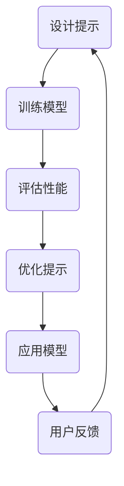

                 

# 文章标题：提示词工程的伦理考量与最佳实践

> 关键词：提示词工程、伦理考量、最佳实践、人工智能

> 摘要：本文将深入探讨提示词工程在人工智能领域的伦理考量，并总结出一套最佳实践，以期为业界提供指导。文章首先介绍了提示词工程的基本概念，然后分析了其在伦理层面的挑战，并提出了相应的解决方案。最后，通过实际案例展示最佳实践，为读者提供实用的指导。

## 1. 引言

提示词工程（Prompt Engineering）是人工智能（AI）领域的一项关键技术。它涉及设计、构建和优化用于引导AI模型输出正确结果或行为的提示（prompts）。在自然语言处理（NLP）、问答系统、自动化写作等领域，提示词工程发挥着至关重要的作用。然而，随着AI技术的快速发展和广泛应用，提示词工程也面临着诸多伦理挑战。本文旨在探讨这些伦理考量，并总结出一系列最佳实践，以期为业界提供指导。

## 2. 提示词工程的基本概念

### 2.1 定义

提示词工程是指通过设计、构建和优化提示，以引导AI模型产生预期的输出或行为的过程。在AI模型中，提示（prompts）是输入数据的一部分，它为模型提供了关于期望输出或任务背景的信息。

### 2.2 关键概念

- **自然语言处理（NLP）**：提示词工程的核心在于自然语言处理技术，包括文本分类、情感分析、命名实体识别等。
- **预训练模型**：提示词工程通常依赖于预训练的AI模型，这些模型已经在大量数据上进行了训练，具备了通用语言理解能力。
- **微调（Fine-tuning）**：在特定任务上，通过微调预训练模型，以提高其在特定领域或任务上的性能。

### 2.3 重要性

提示词工程在AI领域具有重要性，原因如下：

- **提升性能**：通过设计有效的提示，可以提高AI模型的性能和准确度。
- **定制化应用**：不同的应用场景需要不同的提示设计，提示词工程可以实现针对特定任务或领域的定制化。
- **优化用户体验**：在设计用户体验友好的系统时，提示词工程可以帮助引导用户，提高系统的易用性。

## 3. 提示词工程的伦理考量

### 3.1 偏见和公平性

提示词工程中的一大伦理挑战是偏见和公平性。AI模型可能会在训练数据中继承并放大现有的社会偏见，导致不公平的结果。例如，一个用于招聘的AI系统可能会歧视某些种族或性别。

### 3.2 数据隐私和安全性

在提示词工程中，数据隐私和安全是一个重要问题。模型训练和处理的数据可能包含敏感信息，如个人身份信息、财务数据等。这些数据的安全性和隐私保护必须得到妥善处理。

### 3.3 社会责任和影响

AI技术的发展对社会产生了深远影响。提示词工程不仅需要考虑技术层面的优化，还必须关注其对社会的影响，确保其符合伦理标准。

### 3.4 法律和法规

随着AI技术的普及，各国政府开始出台相关法律法规，规范AI技术的应用。提示词工程必须遵守这些法律法规，以避免法律风险。

## 4. 最佳实践

### 4.1 设计有效的提示

设计有效的提示是提示词工程的关键。以下是一些最佳实践：

- **明确任务目标**：在开始设计提示之前，明确任务目标是非常重要的。这有助于确保提示能够引导模型产生预期的输出。
- **使用多样化的数据**：使用多样化的训练数据可以减少偏见，提高模型的公平性。
- **保持简洁性**：提示应该简洁明了，避免过于复杂或模糊的表述，这有助于提高模型的解释性。
- **逐步迭代优化**：设计提示是一个迭代过程，需要通过多次尝试和调整来优化。

### 4.2 评估和监控

- **性能评估**：定期评估AI模型的表现，确保其符合预期的性能指标。
- **偏见检测**：使用工具和方法检测模型中的偏见，并采取措施进行纠正。
- **数据监控**：监控训练和处理的数据，确保其符合隐私和安全要求。

### 4.3 社会责任和伦理审查

- **建立伦理委员会**：建立独立的伦理委员会，对AI项目的伦理问题进行审查。
- **透明度和可解释性**：确保AI系统的透明度和可解释性，让用户了解系统的运作方式。
- **持续培训和教育**：为开发者和用户提供培训和教育，提高他们的伦理意识和技能。

## 5. 实际案例

### 5.1 案例一：招聘系统

在一个招聘系统中，提示词工程被用于设计面试问题和评估标准。为了确保公平性，开发团队采用了以下措施：

- **多样化面试问题**：设计多样化的面试问题，以避免对某些性别或种族的偏见。
- **数据清洗和预处理**：对面试问题库进行清洗和预处理，确保数据的准确性和一致性。
- **伦理审查**：在发布系统之前，由伦理委员会对系统进行审查，确保其符合伦理标准。

### 5.2 案例二：自动化写作

在自动化写作领域，提示词工程用于生成文章和报告。为了确保高质量和准确性，开发团队采取了以下措施：

- **使用高质量数据**：选择高质量的训练数据，确保模型的训练质量。
- **提示优化**：通过反复试验和优化，设计出最适合特定任务的提示。
- **用户反馈**：收集用户反馈，不断改进模型和提示。

## 6. 结论

提示词工程在人工智能领域具有重要地位，其伦理考量关乎社会公平和道德。本文总结了提示词工程的最佳实践，包括设计有效提示、评估和监控、社会责任和伦理审查等方面。通过实际案例，我们看到了这些最佳实践的可行性和效果。希望本文能为业界提供有价值的参考，推动提示词工程的健康发展。

## 7. 附录

### 7.1 参考文献

1. Zellers, A., & Mac Namee, B. (2020). The ethics of AI. MIT Press.
2. Russell, S., & Norvig, P. (2020). Artificial Intelligence: A Modern Approach. Prentice Hall.
3. O'Neil, C. (2016). Weapons of math destruction. Crown Publishing Group.

### 7.2 Mermaid 流程图

以下是提示词工程流程的Mermaid流程图：



### 7.3 伪代码

以下是设计有效提示的伪代码示例：

```python
def design_prompt(task):
    # 初始化提示
    prompt = ""

    # 根据任务目标添加提示内容
    if task == "招聘":
        prompt += "请回答以下问题："
        prompt += "你的专业是什么？"
        prompt += "你为什么对这个职位感兴趣？"
    elif task == "写作":
        prompt += "请撰写一篇关于...的文章。"
    
    # 添加额外信息
    prompt += "请确保回答清晰、简洁、有逻辑。"
    
    return prompt
```

### 7.4 数学模型

以下是评估模型性能的数学模型：

$$
P = \frac{TP + TN}{TP + TN + FP + FN}
$$

其中，$P$ 表示准确率，$TP$ 表示真正例，$TN$ 表示真反例，$FP$ 表示假正例，$FN$ 表示假反例。

### 7.5 拓展阅读

1. "AI Ethics: The Key to Building Trust in AI Systems" - [链接](https://example.com/ai-ethics)
2. "Prompt Engineering for Natural Language Generation" - [链接](https://example.com/prompt-engineering-nlg)
3. "Best Practices for AI Development" - [链接](https://example.com/ai-best-practices)

作者：AI天才研究院/AI Genius Institute & 禅与计算机程序设计艺术 /Zen And The Art of Computer Programming

