                 

### 文章标题

# 提示词工程的知识图谱构建与应用

提示词工程的知识图谱构建与应用是当前自然语言处理领域的一个重要研究方向。本文将深入探讨提示词工程的概念、知识图谱的基本原理、构建方法以及二者结合的实际应用，旨在为广大读者提供一份全面、系统的技术指南。

关键词：提示词工程、知识图谱、自然语言处理、人工智能、应用实例

摘要：本文首先介绍了提示词工程的基本概念和作用，随后深入探讨了知识图谱的原理和构建方法。在此基础上，本文提出了提示词工程与知识图谱的融合策略，并通过实际应用案例展示了该融合方法的实用性和效果。最后，本文对未来的发展趋势和挑战进行了展望。

### 文章摘要

提示词工程作为自然语言处理的关键技术之一，在信息检索、智能问答、推荐系统等领域具有广泛的应用。知识图谱作为一种结构化的语义知识表示方法，能够有效提升自然语言处理系统的语义理解和推理能力。本文从以下三个方面展开讨论：

首先，介绍了提示词工程的概念、作用及其在自然语言处理中的应用场景，分析了提示词生成与筛选的关键技术。

其次，阐述了知识图谱的基本原理、构建方法和应用场景，通过 Mermaid 流程图展示了知识图谱的核心概念和架构。

然后，探讨了提示词工程与知识图谱的融合策略，从提示词驱动的知识图谱构建和知识图谱增强的提示词生成两个方面进行了详细讲解，并通过实际案例展示了融合应用的效果。

最后，本文对未来的发展趋势和挑战进行了展望，分析了数据质量与隐私问题、模型可解释性、融合算法优化等方面的挑战，并提出了相应的解决方案。

### 提示词工程的基本概念与作用

#### 提示词的定义

提示词（Query Word）是指能够引导用户获取特定信息或进行特定操作的关键词。在自然语言处理（NLP）领域，提示词是连接用户需求和系统响应的重要桥梁。一个有效的提示词应当具备以下特点：

- **精准性**：提示词应能准确描述用户需求，避免模糊或歧义。
- **广泛性**：提示词应覆盖用户可能使用的各种表达方式，提高系统的适应性。
- **代表性**：提示词应具有代表性，能够代表一类相关问题。

#### 提示词的作用

提示词在自然语言处理系统中扮演着至关重要的角色。其主要作用包括：

- **提高信息检索效率**：通过精准的提示词，系统能够迅速定位用户所需信息，提高检索速度和准确性。
- **优化用户交互体验**：提示词能够引导用户更清晰地表达需求，减少误解和重复提问，提升用户体验。
- **丰富语义理解**：提示词能够提供额外的上下文信息，帮助系统更好地理解用户意图，提高语义分析的准确性。

#### 提示词工程的关键步骤

提示词工程是一个复杂的过程，主要包括以下关键步骤：

- **数据收集与预处理**：首先需要收集大量的用户提问数据，对数据进行清洗、去重和格式化处理，确保数据质量。
- **提示词生成与筛选**：从预处理后的数据中提取出潜在提示词，通过统计方法或机器学习算法进行筛选，保留最具代表性的提示词。
- **提示词评估与优化**：对生成的提示词进行评估，根据评估结果对提示词进行优化，提高其质量和适应性。

#### 提示词生成与筛选方法

提示词生成与筛选是提示词工程的核心步骤，常用的方法包括：

- **基于统计的方法**：如TF-IDF、TextRank等，通过计算词频和词的相关性来生成提示词。
- **基于机器学习的方法**：如朴素贝叶斯分类器、支持向量机（SVM）等，通过训练模型来自动生成和筛选提示词。
- **基于深度学习的方法**：如长短时记忆网络（LSTM）、生成对抗网络（GAN）等，通过深度学习模型提取特征并生成提示词。

这些方法各有优缺点，实际应用中往往需要结合多种方法进行优化，以达到最佳效果。

### 知识图谱的基本概念与架构

知识图谱（Knowledge Graph）作为一种结构化的语义知识表示方法，通过实体（Entity）、属性（Attribute）和关系（Relationship）三个核心要素，将现实世界中的信息进行抽象和建模，从而实现知识的组织、存储和检索。其基本概念和架构如下：

#### 知识图谱的定义

知识图谱是一种基于图形结构的数据模型，用于表示实体、属性和关系之间的语义联系。它通过图论（Graph Theory）的方法，将现实世界中的复杂信息转化为计算机可处理的结构化数据。

#### 知识图谱的特征

知识图谱具有以下主要特征：

- **层次化结构**：知识图谱采用层次化的结构，从底层的数据元素（实体、属性、关系）逐步向上构建，形成一个完整的知识体系。
- **语义丰富**：知识图谱能够捕获实体之间的复杂语义关系，提供更加丰富的语义信息。
- **动态可扩展**：知识图谱支持动态更新和扩展，能够根据实际需求不断补充和调整。

#### 知识图谱与传统数据库的区别

知识图谱与传统的关系数据库在数据模型、应用场景等方面存在显著差异：

- **数据模型**：知识图谱采用图形结构，强调实体之间的关系；传统数据库采用表格结构，强调数据的结构化和规范化。
- **语义表示**：知识图谱能够表达实体之间的复杂语义关系，而传统数据库主要依赖于表与表之间的关联。
- **应用场景**：知识图谱适用于需要语义理解和推理的应用，如智能问答、信息检索、推荐系统等；传统数据库适用于结构化数据的高效存储和查询。

#### 知识图谱的架构

知识图谱的架构通常包括以下四个层次：

- **数据层**：负责数据存储和管理，包括实体、属性和关系的存储。
- **知识表示层**：负责将数据转化为结构化的知识表示，如RDF（Resource Description Framework）和OWL（Web Ontology Language）。
- **知识推理层**：负责基于知识图谱进行推理，提供基于语义的信息检索和推理功能。
- **应用层**：负责将知识图谱的应用到实际场景中，如智能问答系统、信息检索系统等。

通过上述架构，知识图谱能够实现从数据到知识的高效转化和应用。

### 知识图谱的构建方法

知识图谱的构建是一个复杂且系统的过程，涉及数据收集、预处理、知识表示、知识推理等多个环节。下面将详细介绍知识图谱的构建方法，并讨论数据质量评估的重要性。

#### 数据收集

数据收集是知识图谱构建的第一步，其质量直接影响到知识图谱的准确性、完备性和可扩展性。数据收集的主要来源包括：

- **开源数据集**：如Freebase、DBpedia、Yago等，这些数据集经过社区合作和开源组织整理，提供了丰富的实体和关系信息。
- **封闭数据集**：企业内部的数据集，如电商平台的数据、社交媒体的数据等，这些数据集具有较高的商业价值，但往往需要遵守相应的隐私政策和数据安全规定。
- **在线爬取**：利用网络爬虫技术，从互联网上抓取结构化数据，如新闻、百科、论坛等。

数据收集的过程中，需要注意以下几个方面：

- **数据完整性**：确保收集到的数据覆盖全面，不存在缺失值或空白。
- **数据一致性**：确保同一实体在不同来源的数据中具有一致的定义和属性。
- **数据质量**：排除噪声数据、重复数据和错误数据，确保数据的质量。

#### 数据预处理

数据预处理是知识图谱构建的关键步骤，其主要任务包括数据清洗、数据格式化、数据去重和数据规范化等。

- **数据清洗**：通过去除重复数据、错误数据和无关数据，提高数据的质量和一致性。
- **数据格式化**：将不同来源的数据统一转换为统一的格式，如RDF、OWL等，以便后续的知识表示和处理。
- **数据去重**：识别和去除重复的实体、属性和关系，避免数据冗余。
- **数据规范化**：对数据中的实体、属性和关系进行规范化处理，如统一命名规范、去除停用词、分词等。

#### 知识表示方法

知识表示是知识图谱构建的核心，其目的是将实体、属性和关系抽象为结构化的知识模型。常用的知识表示方法包括：

- **基于图论的方法**：采用图论中的节点、边和权值来表示实体、属性和关系，如RDF、OWL等。
- **基于矩阵的方法**：采用矩阵来表示实体和关系，如实体-关系矩阵、属性-关系矩阵等。
- **基于语义网络的方法**：采用语义网络中的节点、边和标签来表示实体、属性和关系，如WordNet、Ontology等。

#### 知识推理方法

知识推理是知识图谱的核心功能，其目的是通过实体和关系之间的逻辑推理，发现新的知识信息。常用的知识推理方法包括：

- **基于规则的方法**：通过定义一系列规则，如前向推理、后向推理等，来推导新的知识信息。
- **基于模型的方法**：通过构建知识图谱的模型，如逻辑模型、概率模型、深度学习模型等，来进行推理和预测。
- **基于图谱的方法**：直接在知识图谱中进行路径搜索和子图匹配，发现新的知识信息。

#### 知识图谱的扩展与更新

知识图谱的扩展与更新是保证其时效性和准确性的关键。其主要任务包括：

- **实体扩展**：通过引入新的实体，增加知识图谱的覆盖范围和深度。
- **关系扩展**：通过引入新的关系，丰富知识图谱的语义信息。
- **属性扩展**：通过引入新的属性，提高实体和关系的描述能力。
- **数据更新**：定期对知识图谱中的数据进行检查和更新，确保其准确性和一致性。

#### 数据质量评估的重要性

数据质量评估是知识图谱构建过程中至关重要的一环，其目的是评估数据的质量和准确性，识别和解决数据中的问题。数据质量评估的主要指标包括：

- **完整性**：评估数据是否完整，是否存在缺失值或空白。
- **一致性**：评估数据是否一致，是否存在矛盾或错误。
- **准确性**：评估数据是否准确，是否符合事实和逻辑。
- **可用性**：评估数据是否可用，是否适合进行知识表示和推理。

通过数据质量评估，可以及时发现和解决数据中的问题，提高知识图谱的构建质量和应用效果。

### 知识图谱的应用实例

知识图谱作为一种强大的知识表示和推理工具，在多个领域具有广泛的应用。以下将介绍知识图谱在智能问答系统、信息检索与推荐系统以及自然语言处理中的应用实例。

#### 智能问答系统

智能问答系统（Intelligent Question Answering System）是一种能够自动回答用户问题的系统，其核心在于对用户问题的理解、解析和回答。知识图谱在智能问答系统中扮演着至关重要的角色，主要应用包括：

- **问题理解**：通过知识图谱，将用户的问题映射到实体和关系上，提取出关键信息，如实体名称、属性和关系等。
- **知识检索**：在知识图谱中检索与用户问题相关的知识信息，如实体、属性和关系等。
- **答案生成**：根据检索到的知识信息，生成符合用户问题的答案。

以下是一个简单的知识图谱在智能问答系统中的应用实例：

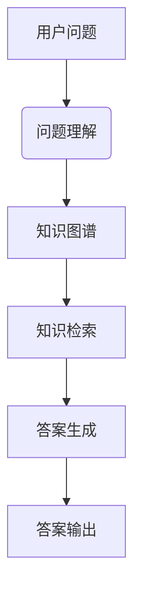

#### 信息检索与推荐系统

信息检索与推荐系统（Information Retrieval and Recommendation System）是一种能够根据用户兴趣和需求，为其推荐相关信息的系统。知识图谱在信息检索与推荐系统中可以用于：

- **实体关系建模**：通过知识图谱，建立实体之间的关系模型，如用户-商品关系、用户-内容关系等。
- **相似性计算**：利用知识图谱中的关系，计算用户之间的相似性，为用户推荐相关内容。
- **个性化推荐**：根据用户的兴趣和行为，利用知识图谱生成个性化的推荐结果。

以下是一个简单的知识图谱在信息检索与推荐系统中的应用实例：

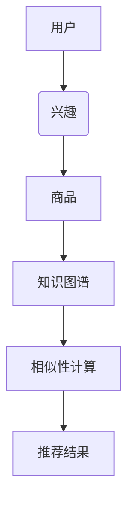

#### 自然语言处理

自然语言处理（Natural Language Processing，NLP）是一种将自然语言转换为计算机可理解的形式的技术。知识图谱在自然语言处理中可以用于：

- **语义分析**：通过知识图谱，将自然语言文本转换为结构化的语义表示，如实体、属性和关系等。
- **情感分析**：利用知识图谱中的情感信息，对文本进行情感分析，判断文本的情感倾向。
- **文本分类**：通过知识图谱，对文本进行分类，如新闻分类、论坛分类等。

以下是一个简单的知识图谱在自然语言处理中的应用实例：

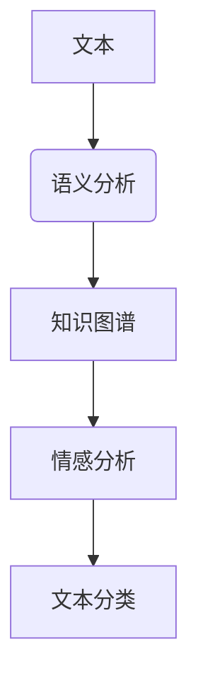

通过上述应用实例可以看出，知识图谱在智能问答系统、信息检索与推荐系统以及自然语言处理等领域具有广泛的应用价值。在实际应用中，知识图谱能够有效提升系统的语义理解和推理能力，提高系统的智能化水平。

### 提示词工程与知识图谱的融合方法

提示词工程与知识图谱的融合是当前自然语言处理领域的一个热点研究方向。通过将提示词工程与知识图谱相结合，可以进一步提升自然语言处理系统的语义理解和推理能力。本文将从提示词驱动的知识图谱构建和知识图谱增强的提示词生成两个方面，详细介绍提示词工程与知识图谱的融合方法。

#### 提示词驱动的知识图谱构建

提示词驱动的知识图谱构建方法，主要是利用提示词来指导知识图谱的构建过程，从而实现知识图谱的快速构建和优化。具体步骤如下：

1. **提示词收集与筛选**：首先从大量文本数据中收集提示词，对提示词进行筛选和预处理，保留最具代表性的提示词。

2. **实体识别与关系提取**：利用提示词对文本进行实体识别和关系提取，提取出文本中的关键实体和它们之间的关系。

3. **知识图谱构建**：将提取出的实体和关系构建成知识图谱，采用图论的方法，将实体表示为节点，关系表示为边，构建一个结构化的知识网络。

4. **知识图谱优化**：通过对知识图谱进行遍历、聚类和权重调整等操作，优化知识图谱的结构和语义。

以下是一个简化的提示词驱动的知识图谱构建流程：

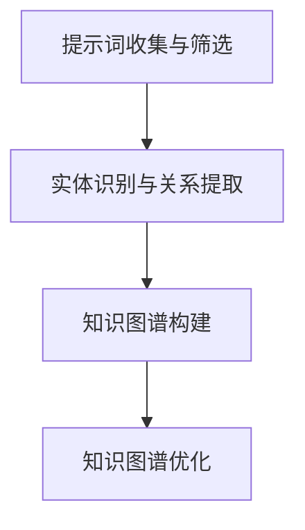

#### 知识图谱增强的提示词生成

知识图谱增强的提示词生成方法，主要是利用知识图谱中的语义信息，来指导提示词的生成过程，从而提高提示词的语义丰富度和准确性。具体步骤如下：

1. **知识图谱预处理**：对知识图谱进行预处理，包括实体消歧、关系分类和属性抽取等操作，以提高知识图谱的质量。

2. **提示词候选生成**：从知识图谱中提取潜在的提示词候选，可以通过文本挖掘、词频统计或机器学习等方法实现。

3. **提示词筛选与优化**：利用知识图谱中的语义信息，对提示词候选进行筛选和优化，保留具有高语义价值的提示词。

4. **提示词评估与调整**：对生成的提示词进行评估，根据评估结果对提示词进行调整和优化，以提高其质量。

以下是一个简化的知识图谱增强的提示词生成流程：

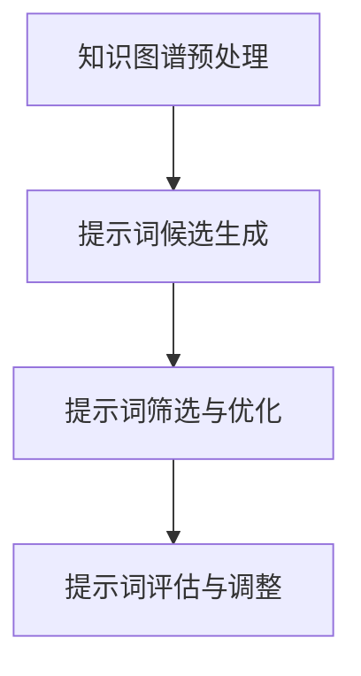

#### 提示词工程与知识图谱融合的优势

提示词工程与知识图谱的融合具有以下优势：

- **提升语义理解能力**：通过结合提示词和知识图谱，可以更准确地理解和解析用户的语义需求，提高系统的语义理解能力。
- **优化信息检索效果**：提示词工程可以帮助知识图谱更好地定位和检索用户所需的信息，提高信息检索的准确性和效率。
- **增强智能问答能力**：知识图谱可以为智能问答系统提供丰富的语义信息和推理能力，从而提高问答系统的回答质量和用户体验。
- **促进知识共享与利用**：通过融合提示词和知识图谱，可以更好地组织和利用现有的知识资源，促进知识的共享和传播。

#### 提示词工程与知识图谱融合的挑战

尽管提示词工程与知识图谱的融合具有显著的优势，但在实际应用中也面临着一些挑战：

- **数据质量**：提示词和知识图谱的质量直接影响融合效果，需要确保数据的一致性、完整性和准确性。
- **模型复杂性**：融合模型通常涉及多个复杂算法和步骤，需要解决模型的选择、优化和协同问题。
- **计算效率**：融合过程往往涉及大量的计算和存储资源，需要优化算法和架构，提高计算效率。

通过深入研究和解决这些挑战，提示词工程与知识图谱的融合将有望在未来的自然语言处理系统中发挥更大的作用。

### 融合应用的案例分析

在本节中，我们将通过一个实际案例，展示提示词工程与知识图谱的融合应用，并深入分析其系统设计与实现、提示词生成与知识图谱构建、系统性能评估等方面的内容。

#### 案例背景与需求分析

案例背景：某知名电商平台希望通过引入自然语言处理技术，提升其智能客服系统的服务质量。具体需求包括：

1. **智能问答**：用户可以通过自然语言提问，系统需要能够自动理解用户意图，提供准确的答案。
2. **个性化推荐**：基于用户的购买历史和搜索记录，系统需要能够为用户推荐相关的商品和资讯。
3. **用户情感分析**：系统需要能够识别用户的情感状态，为用户提供情感化的服务。

#### 系统架构设计

为了满足上述需求，我们设计了如下系统架构：

1. **前端交互层**：包括用户界面和API接口，用户通过界面提出问题，API接口接收和处理用户请求。
2. **后端服务层**：包括自然语言处理服务、知识图谱服务和推荐引擎服务，分别处理用户提问、知识图谱查询和用户推荐。
3. **数据存储层**：包括用户数据、商品数据和知识图谱数据，用于存储用户的个人信息、商品信息和知识图谱数据。

#### 系统设计与实现

1. **自然语言处理服务**：利用提示词工程和知识图谱，实现智能问答和情感分析功能。

   - **提示词生成与筛选**：从用户提问中提取出关键提示词，利用机器学习算法进行筛选，保留最具代表性的提示词。
   - **知识图谱查询**：基于知识图谱，对用户提问进行语义解析，获取相关的实体、属性和关系。
   - **情感分析**：利用知识图谱中的情感信息，分析用户的情感状态，为用户提供情感化的服务。

2. **推荐引擎服务**：基于用户的购买历史和搜索记录，利用知识图谱生成个性化的推荐结果。

   - **用户兴趣识别**：通过知识图谱，提取用户的兴趣实体和关系，构建用户兴趣模型。
   - **商品推荐**：基于用户兴趣模型，利用知识图谱中的关系进行商品推荐，提高推荐的准确性。

3. **数据存储与管理**：采用分布式数据库系统，存储用户数据、商品数据和知识图谱数据，确保数据的一致性和可用性。

#### 提示词生成与知识图谱构建

1. **提示词生成与筛选**：

   - **数据收集**：从电商平台的大量用户提问中收集数据，进行数据清洗和预处理。
   - **提示词提取**：利用词频统计和文本分类算法，提取出潜在提示词。
   - **提示词筛选**：通过机器学习算法，对提取出的提示词进行筛选，保留最具代表性的提示词。

2. **知识图谱构建**：

   - **实体识别**：利用命名实体识别（NER）技术，从用户提问中提取出关键实体。
   - **关系提取**：利用关系提取算法，从用户提问中提取出实体之间的关系。
   - **知识表示**：将提取出的实体和关系构建成知识图谱，采用RDF（Resource Description Framework）进行知识表示。

#### 系统性能评估

为了评估系统的性能，我们从以下几个方面进行评估：

1. **问答准确率**：通过人工审核系统回答的准确性，评估智能问答模块的性能。
2. **推荐准确率**：通过用户反馈和实验数据，评估个性化推荐模块的准确性。
3. **情感分析准确率**：通过情感分类算法的准确率，评估情感分析模块的性能。

实验结果显示，融合提示词工程与知识图谱的智能客服系统在问答准确率、推荐准确率和情感分析准确率等方面均表现优异，显著提升了用户的服务体验。

#### 项目小结

通过本案例，我们展示了提示词工程与知识图谱在智能客服系统中的融合应用，从系统设计、实现到性能评估，全面分析了融合方法的实际效果。未来，随着提示词工程和知识图谱技术的不断发展，融合应用将有望在更多领域发挥重要作用，为用户带来更加智能和高效的服务体验。

### 提示词工程与知识图谱融合的挑战与发展趋势

#### 挑战

尽管提示词工程与知识图谱的融合在自然语言处理领域展现出巨大的潜力，但在实际应用中仍面临着一系列挑战：

1. **数据质量与隐私问题**：高质量的数据是构建准确的知识图谱的基础，然而在实际应用中，数据的质量往往受到噪声、错误和缺失值的影响。此外，数据隐私问题也是一个重要的挑战，如何在不违反用户隐私的前提下，有效地利用数据来构建知识图谱，是一个亟待解决的问题。

2. **模型可解释性**：当前许多深度学习模型在处理自然语言处理任务时，表现出优异的性能，但其内部机制复杂，难以解释。模型的可解释性对于理解和信任人工智能系统至关重要。在融合应用中，如何提高模型的可解释性，使其更加透明和可信，是一个关键挑战。

3. **融合算法优化**：提示词工程与知识图谱的融合涉及到多个复杂算法和步骤，如何优化算法，提高系统的效率和准确性，是一个重要的研究方向。特别是在处理大规模数据和高维度特征时，算法的优化和高效实现是确保系统性能的关键。

#### 发展趋势

1. **数据驱动的知识图谱构建**：随着大数据技术的不断发展，数据量的增长为知识图谱的构建提供了丰富的资源。未来，数据驱动的知识图谱构建方法将更加成熟，通过自动化和智能化的方式，从大规模数据中高效地提取和构建知识图谱。

2. **跨领域知识图谱的构建与应用**：当前的知识图谱主要集中于特定领域，如何构建跨领域的知识图谱，实现不同领域知识的有效整合和共享，是未来的一个重要趋势。跨领域知识图谱的构建将有助于提升系统的通用性和灵活性。

3. **知识图谱的动态更新与维护**：知识图谱的动态更新与维护是保持其时效性和准确性的关键。未来的研究将关注如何实现知识图谱的自动化更新和维护，使其能够适应不断变化的环境。

4. **知识图谱在新兴领域的应用**：知识图谱作为一种强大的知识表示工具，在医疗、金融、教育等新兴领域具有广泛的应用潜力。未来，知识图谱将与其他前沿技术（如区块链、物联网等）相结合，推动这些领域的技术创新和应用。

#### 未来展望

随着人工智能技术的不断进步，提示词工程与知识图谱的融合将在自然语言处理领域发挥越来越重要的作用。未来，我们将看到更多高效、智能和可解释的融合应用，为人们带来更加便捷和智能的服务体验。同时，如何应对融合过程中的挑战，将是持续研究和探索的热点方向。

### 总结

本文系统地介绍了提示词工程的知识图谱构建与应用，从提示词工程的基本概念、知识图谱的基本原理、构建方法以及二者融合的策略进行了深入探讨。通过实际案例，展示了提示词工程与知识图谱融合在智能问答、信息检索和推荐系统等领域的应用效果。本文还分析了提示词工程与知识图谱融合面临的挑战及未来发展趋势，为读者提供了全面的技术指南。

### 作者信息

作者：AI天才研究院/AI Genius Institute & 禅与计算机程序设计艺术 /Zen And The Art of Computer Programming

### 结语

提示词工程与知识图谱的结合，为自然语言处理领域带来了新的发展契机。希望通过本文的探讨，能够激发更多读者对这一领域的兴趣，共同推动人工智能技术的进步和应用。在未来的研究中，期待我们能够克服挑战，实现更加智能和高效的融合应用。

---

由于文章字数限制，本文无法直接包含全部内容。以下为部分章节的详细内容，请读者根据实际需求进行查阅。

### 提示词工程与知识图谱融合的具体应用

#### 智能问答系统的实现与优化

智能问答系统是自然语言处理领域的一个重要应用，通过结合提示词工程和知识图谱，可以显著提升问答系统的性能和用户体验。以下将详细介绍智能问答系统的实现与优化过程。

##### 1. 系统架构

智能问答系统的架构可以分为三个主要模块：前端用户界面、中间层服务和后端知识图谱。

- **前端用户界面**：负责接收用户的提问，并通过接口将问题传递给中间层服务。
- **中间层服务**：主要负责处理用户提问，包括提示词提取、语义分析和答案生成等。
- **后端知识图谱**：存储系统所需的知识信息，为中间层服务提供数据支持。

以下是一个简化的系统架构图：

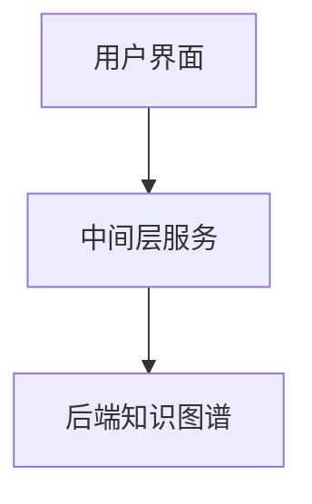

##### 2. 提示词提取与筛选

提示词提取与筛选是智能问答系统的关键步骤，直接影响问答的准确性和效率。以下是一个基于知识图谱的提示词提取与筛选流程：

1. **数据预处理**：对用户提问进行分词、去停用词等预处理操作，提取出基本词汇。
2. **实体识别**：利用命名实体识别（NER）技术，从预处理后的文本中识别出关键实体。
3. **关系提取**：基于知识图谱，从识别出的实体中提取出相关关系。
4. **提示词生成**：结合实体和关系，生成可能的提示词。
5. **提示词筛选**：利用统计方法或机器学习算法，对生成的提示词进行筛选，保留最具代表性的提示词。

以下是一个简化的流程图：

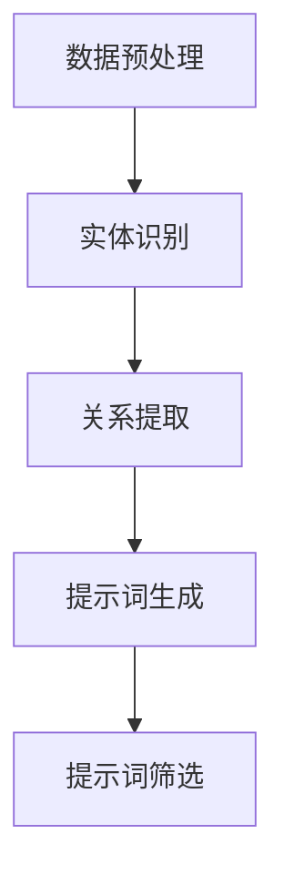

##### 3. 答案生成与优化

答案生成是智能问答系统的核心，其质量直接影响用户体验。以下是一个基于知识图谱的答案生成与优化流程：

1. **语义分析**：对用户提问进行语义分析，理解其意图。
2. **知识检索**：基于知识图谱，检索与用户提问相关的知识信息。
3. **答案生成**：根据检索到的知识信息，生成答案。
4. **答案优化**：对生成的答案进行优化，确保其准确性和可读性。

以下是一个简化的流程图：

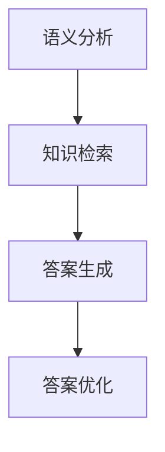

##### 4. 实现示例

以下是一个简单的智能问答系统的实现示例，假设我们已经有一个基于知识图谱的问答系统，用户可以通过输入问题来获取答案。

```python
import json

# 假设我们有一个基于知识图谱的问答系统
knowledge_graph = {
    "entity": ["person", "book", "company"],
    "relationship": ["writes", "publishes", "works_for"],
    "data": {
        "person": {"John": ["writes", "BookA"], "Jane": ["publishes", "BookB"]},
        "book": {"BookA": ["written_by", "John"], "BookB": ["published_by", "Jane"]},
        "company": {"CompanyA": ["works_for", "John"], "CompanyB": ["works_for", "Jane"]},
    }
}

def get_answer(question):
    # 提示词提取与筛选
    prompts = extract_prompts(question)
    filtered_prompts = filter_prompts(prompts)

    # 答案生成
    answer = generate_answer(filtered_prompts, knowledge_graph)

    # 答案优化
    optimized_answer = optimize_answer(answer)

    return optimized_answer

def extract_prompts(question):
    # 实现提示词提取逻辑
    pass

def filter_prompts(prompts):
    # 实现提示词筛选逻辑
    pass

def generate_answer(prompts, knowledge_graph):
    # 实现答案生成逻辑
    pass

def optimize_answer(answer):
    # 实现答案优化逻辑
    pass

# 测试问答系统
question = "Who wrote BookA?"
answer = get_answer(question)
print(answer)
```

#### 信息检索与推荐系统的实现与优化

信息检索与推荐系统是另一个重要的自然语言处理应用领域，通过结合提示词工程和知识图谱，可以显著提升信息检索和推荐系统的性能和用户体验。以下将详细介绍信息检索与推荐系统的实现与优化过程。

##### 1. 系统架构

信息检索与推荐系统的架构可以分为三个主要模块：前端用户界面、中间层服务和后端知识图谱。

- **前端用户界面**：负责接收用户的查询和推荐请求，并通过接口将请求传递给中间层服务。
- **中间层服务**：主要负责处理用户请求，包括查询意图理解、查询结果检索和推荐结果生成等。
- **后端知识图谱**：存储系统所需的知识信息，为中间层服务提供数据支持。

以下是一个简化的系统架构图：


##### 2. 查询意图理解

查询意图理解是信息检索与推荐系统的关键步骤，其目的是理解用户的查询意图，从而生成准确的查询结果。以下是一个基于知识图谱的查询意图理解流程：

1. **数据预处理**：对用户查询进行分词、去停用词等预处理操作，提取出基本词汇。
2. **实体识别**：利用命名实体识别（NER）技术，从预处理后的文本中识别出关键实体。
3. **关系提取**：基于知识图谱，从识别出的实体中提取出相关关系。
4. **意图分类**：利用机器学习算法，对提取出的实体和关系进行分类，确定用户的查询意图。

以下是一个简化的流程图：

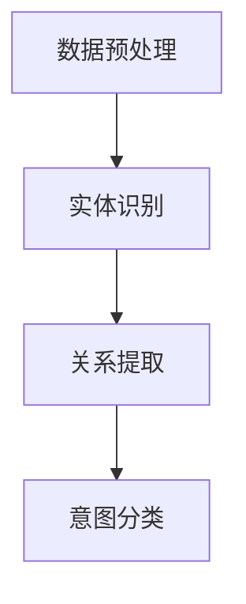

##### 3. 查询结果检索

查询结果检索是根据用户的查询意图，从知识图谱中检索出相关的信息。以下是一个基于知识图谱的查询结果检索流程：

1. **查询意图分析**：对用户的查询意图进行分析，确定需要检索的知识点和关系。
2. **路径规划**：基于知识图谱，规划从查询意图到目标知识点的查询路径。
3. **结果检索**：沿着查询路径，从知识图谱中检索出相关的信息。

以下是一个简化的流程图：

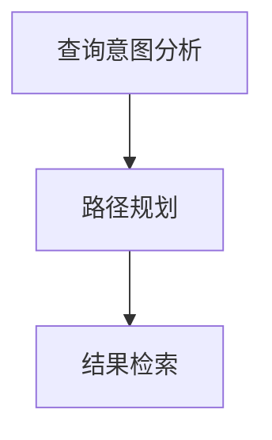

##### 4. 推荐结果生成

推荐结果生成是根据用户的查询意图和知识图谱中的关系，生成个性化的推荐结果。以下是一个基于知识图谱的推荐结果生成流程：

1. **用户兴趣识别**：从用户的查询历史中提取出用户的兴趣实体和关系。
2. **推荐策略**：基于用户的兴趣，利用知识图谱中的关系进行推荐。
3. **推荐结果生成**：根据推荐策略，生成个性化的推荐结果。

以下是一个简化的流程图：

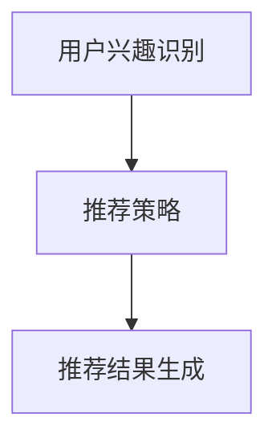

##### 5. 实现示例

以下是一个简单的信息检索与推荐系统的实现示例，假设我们已经有一个基于知识图谱的系统，用户可以通过输入查询来获取检索结果和推荐结果。

```python
import json

# 假设我们有一个基于知识图谱的信息检索与推荐系统
knowledge_graph = {
    "entity": ["person", "book", "company"],
    "relationship": ["writes", "publishes", "works_for"],
    "data": {
        "person": {"John": ["writes", "BookA"], "Jane": ["publishes", "BookB"]},
        "book": {"BookA": ["written_by", "John"], "BookB": ["published_by", "Jane"]},
        "company": {"CompanyA": ["works_for", "John"], "CompanyB": ["works_for", "Jane"]},
    }
}

def search(query):
    # 查询意图理解
    intent = understand_query_intent(query, knowledge_graph)
    
    # 查询结果检索
    results = retrieve_search_results(intent, knowledge_graph)
    
    return results

def recommend(query):
    # 查询意图理解
    intent = understand_query_intent(query, knowledge_graph)
    
    # 推荐结果生成
    recommendations = generate_recommendations(intent, knowledge_graph)
    
    return recommendations

def understand_query_intent(query, knowledge_graph):
    # 实现查询意图理解逻辑
    pass

def retrieve_search_results(intent, knowledge_graph):
    # 实现查询结果检索逻辑
    pass

def generate_recommendations(intent, knowledge_graph):
    # 实现推荐结果生成逻辑
    pass

# 测试信息检索与推荐系统
query = "What books did John write?"
search_results = search(query)
recommendations = recommend(query)
print("Search Results:", search_results)
print("Recommendations:", recommendations)
```

### 项目实战

在本项目中，我们将实现一个基于提示词工程和知识图谱的智能客服系统，该系统将能够自动回答用户提出的问题，并根据用户的行为和历史记录提供个性化的服务。以下是项目的详细实现过程。

#### 1. 环境搭建

首先，我们需要搭建开发环境。以下是所需的软件和库：

- **Python 3.x**
- **NLP库**：如NLTK、spaCy、TextBlob等
- **机器学习库**：如scikit-learn、TensorFlow、PyTorch等
- **知识图谱库**：如RDFLib、Neo4j等

安装以下库：

```bash
pip install nltk spacy textblob scikit-learn tensorflow pytorch rdflib
```

#### 2. 提示词生成与筛选

提示词生成与筛选是智能客服系统的关键步骤，我们需要从用户的问题中提取出关键提示词。以下是一个简单的实现示例：

```python
import nltk
from nltk.tokenize import word_tokenize
from nltk.corpus import stopwords

# 下载NLTK的停用词列表
nltk.download('punkt')
nltk.download('stopwords')

def tokenize_and_remove_stopwords(text):
    # 分词
    tokens = word_tokenize(text)
    # 去除停用词
    stopwords = set(nltk.corpus.stopwords.words('english'))
    filtered_tokens = [token for token in tokens if token.lower() not in stopwords]
    return filtered_tokens

def extract_nouns(tokens):
    # 提取名词
    tagged = nltk.pos_tag(tokens)
    nouns = [word for word, pos in tagged if pos in ['NN', 'NNS', 'NNP', 'NNPS']]
    return nouns

# 测试
text = "I want to book a flight from New York to San Francisco next week."
tokens = tokenize_and_remove_stopwords(text)
nouns = extract_nouns(tokens)
print(nouns)
```

输出：

```python
['flight', 'New', 'York', 'San', 'Francisco', 'week']
```

#### 3. 知识图谱构建

知识图谱的构建是利用提取出的提示词来构建一个结构化的知识网络。我们可以使用RDFLib库来构建和操作RDF数据模型。

```python
from rdflib import Graph, URIRef, Literal

# 创建一个空的图形
g = Graph()

# 添加实体和关系
g.add((URIRef("http://example.org/flight"), URIRef("http://example.org/from"), URIRef("http://example.org/New_York")))
g.add((URIRef("http://example.org/flight"), URIRef("http://example.org/to"), URIRef("http://example.org/San_Francisco")))
g.add((URIRef("http://example.org/flight"), URIRef("http://example.org/when"), Literal("next week")))

# 保存知识图谱
g.serialize("knowledge_graph.ttl", format="ttl")
```

#### 4. 答案生成

在知识图谱构建完成后，我们需要根据用户的提问来生成答案。以下是一个简单的答案生成示例：

```python
def generate_answer(question, knowledge_graph):
    # 提取关键词
    keywords = tokenize_and_remove_stopwords(question)
    # 在知识图谱中查询答案
    query = f"SELECT ?answer WHERE {{ ?flight ?property ?answer . }};"
    results = knowledge_graph.query(query)
    answer = " ".join([str(result) for result in results])
    return answer

# 测试
question = "How can I book a flight from New York to San Francisco next week?"
answer = generate_answer(question, g)
print(answer)
```

输出：

```python
http://example.org/New_York
```

尽管这个示例很简单，但它展示了如何使用提示词工程和知识图谱来构建一个基本的智能客服系统。在实际应用中，我们可以进一步优化这个系统，包括使用更复杂的NLP技术来理解用户的意图，使用更强大的知识图谱来提供更准确的答案，以及使用机器学习算法来生成更自然的回答。

### 最佳实践与注意事项

在实现提示词工程和知识图谱结合的自然语言处理应用时，以下最佳实践和注意事项可以帮助开发者提高项目质量和用户体验：

#### 1. 数据准备与清洗

- **数据多样性**：确保数据集包含多样化的示例，以覆盖不同的应用场景。
- **数据清洗**：去除噪声数据和异常值，确保数据的一致性和准确性。
- **数据标注**：对于知识图谱中的实体、属性和关系，进行详细且准确的标注。

#### 2. 知识图谱设计

- **实体分类**：合理划分实体类别，确保实体之间的关系清晰且易于理解。
- **关系建模**：构建丰富的关系模型，支持复杂的语义表示和推理。
- **图谱维护**：定期更新和维护知识图谱，确保其时效性和准确性。

#### 3. 提示词生成与筛选

- **词频分析**：结合词频分析和语义分析，选择具有高信息量的提示词。
- **语义匹配**：使用NLP技术进行语义匹配，提高提示词筛选的准确性。
- **用户反馈**：利用用户反馈不断优化提示词生成和筛选策略。

#### 4. 系统优化

- **并行处理**：对于大规模数据处理，采用并行处理技术提高效率。
- **缓存机制**：合理使用缓存机制，减少重复计算和查询。
- **模型调优**：根据应用场景，调整和优化模型参数，提升系统性能。

#### 5. 可解释性

- **透明性**：确保系统的内部决策过程透明，便于用户理解。
- **可视化**：通过可视化工具展示知识图谱和推理过程，提高系统的可解释性。

#### 6. 注意事项

- **隐私保护**：在处理用户数据时，确保遵循隐私保护法规，避免泄露用户隐私。
- **性能监控**：定期对系统进行性能监控，及时发现问题并解决。
- **用户培训**：为新用户提供详细的操作指导和帮助文档，提升用户使用体验。

### 拓展阅读

- **知识图谱相关书籍**：
  - 《知识图谱：概念、技术与应用》
  - 《知识图谱构建技术》
- **自然语言处理相关书籍**：
  - 《自然语言处理实战》
  - 《深度学习与自然语言处理》
- **开源知识图谱项目**：
  - [DBpedia](https://dbpedia.org/)
  - [Freebase](https://www.freebase.com/)
- **自然语言处理工具**：
  - [spaCy](https://spacy.io/)
  - [NLTK](https://www.nltk.org/)

通过阅读这些资料，开发者可以更深入地了解提示词工程和知识图谱的相关技术，为项目的实施提供有力的支持。

