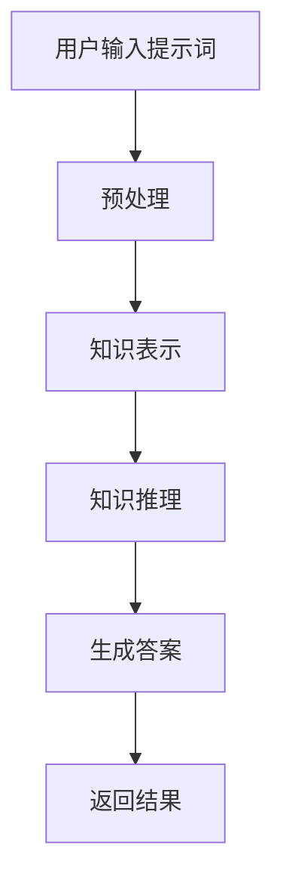

                 

### 背景介绍

#### 提示词工程的定义与重要性

提示词工程（Query Engineering）是一种利用提示词（queries）来获取、构建和推理知识的工程实践。在人工智能和大数据时代，随着信息量的爆炸式增长，如何有效地从海量数据中获取有用信息，成为了一个亟待解决的问题。提示词工程通过构建高效的知识表示与推理机制，实现了从数据到知识的转化，提升了信息检索、自然语言处理、智能问答等领域的应用效果。

提示词工程的重要性主要体现在以下几个方面：

1. **信息检索优化**：通过精确的提示词，可以提升信息检索的准确性和效率，减少用户在大量无关信息中查找所需内容的难度。

2. **知识表示与推理**：提示词工程有助于构建结构化的知识库，通过知识表示与推理，实现知识的自动获取、整合和利用。

3. **智能问答系统**：提示词工程是智能问答系统的重要组成部分，通过提示词的分析和理解，系统能够提供更加准确、个性化的回答。

4. **辅助决策**：在商业、医疗、教育等领域，提示词工程可以帮助用户快速获取关键信息，辅助决策过程。

#### 提示词工程的应用场景

提示词工程在众多领域中都有广泛的应用：

- **自然语言处理（NLP）**：在NLP中，提示词工程用于构建问答系统、信息抽取和文本生成等任务。通过分析用户输入的提示词，系统可以理解用户意图，并提供相应的回答。

- **信息检索**：搜索引擎利用提示词工程优化查询处理，提高搜索结果的准确性和相关性。

- **数据挖掘**：在数据挖掘领域，提示词工程用于发现数据中的隐藏模式，提升数据分析的效率。

- **智能推荐系统**：通过分析用户输入的提示词，智能推荐系统可以为用户提供个性化的内容推荐。

- **商业智能**：在商业智能领域，提示词工程帮助企业快速获取市场信息，分析客户需求，优化业务决策。

#### 提示词工程的发展历程

提示词工程的发展可以追溯到信息检索和自然语言处理的早期研究。随着计算机技术的发展，提示词工程经历了以下几个阶段：

1. **传统信息检索**：早期信息检索主要依赖于关键词匹配和统计方法，提示词的作用较为有限。

2. **自然语言处理**：随着自然语言处理技术的进步，提示词工程开始关注语义理解和上下文信息，使得查询处理更加精准。

3. **深度学习时代**：深度学习技术的引入，使得提示词工程在语义分析、上下文理解等方面取得了显著突破。

4. **知识图谱与推理**：近年来，知识图谱和推理技术的应用，进一步提升了提示词工程的知识表示与推理能力。

总之，提示词工程在知识获取、信息检索和智能问答等方面发挥着重要作用，随着技术的不断进步，其在各个领域的应用前景将更加广阔。接下来，我们将深入探讨提示词工程的核心概念、知识表示与推理方法，以及具体应用案例。在接下来的章节中，我们将逐步展开对提示词工程的知识表示与推理的详细讨论。

### 核心概念与联系

在深入探讨提示词工程的知识表示与推理之前，有必要首先明确几个核心概念，并理解它们之间的内在联系。

#### 提示词（Query）

提示词是用户输入的查询信息，用于指示系统需要获取的信息内容。提示词可以是简单的关键词，也可以是复杂的句子或问题。一个有效的提示词应当具备以下特点：

1. **明确性**：提示词应明确传达用户的查询意图，避免模糊不清的表达。
2. **相关性**：提示词应与系统所拥有的知识库或数据源高度相关，以便快速定位所需信息。
3. **简洁性**：提示词应简洁明了，避免冗长复杂的语句。

#### 知识表示（Knowledge Representation）

知识表示是提示词工程的核心环节，它涉及如何将信息转换为机器可以理解和处理的形式。知识表示方法可以分为以下几类：

1. **符号表示**：使用符号和符号之间的关系来表示知识。这种方法较为直观，但表达能力有限。
2. **语义网络表示**：使用节点和边来表示概念及其关系。语义网络能够表达复杂的语义关系，但需要大量的标注和预处理工作。
3. **本体论表示**：通过定义本体来表示概念及其关系。本体具有明确的语义定义，能够支持高度抽象和泛化的知识表示。
4. **图表示**：使用图结构来表示复杂的关系和实体。图表示方法具有灵活性和扩展性，适用于大规模数据集。

#### 知识推理（Knowledge Reasoning）

知识推理是利用已有知识进行逻辑推导，以获取新知识或验证假设的过程。知识推理可以分为以下几类：

1. **演绎推理**：从一般到特殊的推理方式。例如，从“所有人都会死亡”到“苏格拉底会死亡”的推理。
2. **归纳推理**：从特殊到一般的推理方式。例如，从“所有的天鹅都是白色的”到“所有的天鹅都是白色的”的推理。
3. **类比推理**：通过比较相似性进行推理。例如，从“猫有四条腿”到“狗有四条腿”的推理。

#### 提示词与知识表示、推理的关系

提示词工程中，提示词是驱动知识表示与推理的核心。提示词通过以下方式与知识表示、推理联系在一起：

1. **知识表示**：提示词用于指导知识库的构建和维护。例如，通过分析用户的查询日志，可以识别出用户关注的关键词和概念，进而构建相应的知识表示。
2. **知识推理**：提示词用于触发推理过程，以获取用户所需的信息。例如，在智能问答系统中，用户输入的问题（提示词）会被解析，并通过知识库进行推理，以生成回答。

#### Mermaid 流程图

为了更清晰地展示提示词、知识表示和知识推理之间的关系，我们可以使用Mermaid流程图来描述：



在这个流程图中，用户输入的提示词经过预处理，然后转换为知识表示形式，再通过知识推理生成答案，最后将结果返回给用户。

通过上述核心概念和Mermaid流程图的介绍，我们为后续章节的内容打下了基础。在接下来的章节中，我们将详细探讨知识表示的具体方法、知识推理的算法原理，以及如何将提示词工程应用于实际问题中。

### 提示词获取与处理方法

在提示词工程中，提示词的获取与处理是至关重要的步骤，它们直接影响知识表示和推理的效果。有效的提示词获取和处理能够确保系统能够准确理解用户的查询意图，从而提供高质量的答案。

#### 数据来源

提示词的数据来源多样，主要包括以下几个方面：

1. **用户查询日志**：通过收集和分析用户的历史查询日志，可以识别出用户关注的关键词和问题模式。这些日志数据是构建知识库和优化提示词的重要资源。
2. **社交媒体**：社交媒体平台如Twitter、Facebook等，提供了大量的用户生成内容，包括提问、评论等，这些内容可以用来丰富提示词库。
3. **公开数据集**：一些公开的数据集，如学术文章、新闻、产品评论等，也包含丰富的提示词信息，可用于提示词的获取。
4. **专业数据库**：特定领域的专业数据库，如医疗数据库、金融数据库等，提供了专业且结构化的数据，可以作为高质量提示词的来源。

#### 提示词的清洗

获取到提示词后，需要进行清洗处理，以提高数据质量和系统的鲁棒性。提示词清洗主要包括以下几个步骤：

1. **去重**：去除重复的提示词，避免重复处理相同的信息。
2. **去除停用词**：停用词是那些对查询意图没有贡献的常见词汇，如“的”、“了”、“是”等。去除停用词可以减少冗余信息，提高查询效率。
3. **词干提取**：通过词干提取算法，将变体形式（如“跑步”和“跑步者”）统一为同一种形式，以减少词汇量。
4. **拼写纠正**：对输入的提示词进行拼写检查，纠正可能的拼写错误，以确保提示词的准确性。
5. **分词**：将输入的文本分割为单个词语，以便进行后续处理。

#### 提示词的编码

编码是将提示词转换为计算机可以处理的形式，常见的方法包括：

1. **词袋模型**：将文本转换为词袋模型，每个词作为一个特征，向量中的元素表示词在文档中的出现频率。
2. **词嵌入**：通过词嵌入模型（如Word2Vec、BERT等），将每个词映射到一个低维向量空间中，向量之间的相似性可以表示词之间的语义关系。
3. **序列编码**：将提示词序列转换为序列编码，如使用LSTM、GRU等循环神经网络处理。

#### 提示词的选择与优化

选择和优化提示词是提升系统性能的关键步骤。以下是一些常用的策略：

1. **基于频率的筛选**：选择出现频率较高的提示词，这些提示词通常更具有代表性和重要性。
2. **基于语义的筛选**：通过语义分析技术，选择与用户意图高度相关的提示词，从而提高查询的准确性。
3. **动态调整**：根据系统的实际运行效果，动态调整提示词的权重，以优化查询结果。
4. **用户反馈**：利用用户反馈信息，调整提示词的选择和权重，以提高用户的满意度。

#### 具体方法与应用

1. **自然语言处理（NLP）工具**：利用NLP工具（如NLTK、spaCy等）进行文本预处理和提示词提取，可以快速实现高质量的提示词获取和处理。
2. **机器学习模型**：通过训练机器学习模型（如分类模型、聚类模型等），可以从海量数据中自动识别和提取提示词。
3. **知识图谱**：利用知识图谱进行提示词的语义分析和关联，可以提升提示词的准确性和语义丰富度。

总之，提示词的获取与处理是提示词工程的基础，通过有效的数据来源、清洗方法和编码策略，我们可以确保系统能够准确理解用户的查询意图，从而提供高质量的答案。在下一章节中，我们将进一步探讨知识表示的具体方法及其在提示词工程中的应用。

### 知识表示方法

在提示词工程中，知识表示是构建知识库的核心步骤。知识表示方法决定了知识库的结构和表达能力，直接影响知识检索和推理的效率。以下是几种常见的知识表示方法及其应用。

#### 符号表示

符号表示是一种直接使用符号和符号之间的关系来表达知识的方法。在知识表示中，符号通常表示概念、实体和关系，而符号之间的关系则用来表示它们之间的逻辑关系。

**优点**：
- **直观性**：符号表示方法直观、易于理解。
- **简洁性**：符号表示方法能够以简洁的形式表达复杂的知识结构。

**示例**：
```
A → B
C ∈ D
E ∈ {F, G, H}
```
这些符号表示分别表示“B 是 A 的后继”、“C 是 D 的子集”和“E 是 F、G、H 中的一个”。

**应用**：
符号表示广泛应用于形式逻辑、命题逻辑等领域，适用于需要高度结构化数据的场景，如定理证明和自动推理。

#### 语义网络表示

语义网络表示使用节点和边来表示概念及其关系，是一种图结构化的知识表示方法。节点表示概念或实体，边表示概念之间的关系，如上下位关系、同义关系等。

**优点**：
- **灵活性**：语义网络能够灵活地表示复杂的语义关系。
- **扩展性**：新概念和关系可以动态地添加到语义网络中，易于扩展。

**示例**：
```
[Person] --> [Student]
[Student] --> [Person]
[Student] --> [Teacher]
```
这个语义网络表示了“学生”既是“人”的一种，也可能是“教师”的一种。

**应用**：
语义网络广泛应用于自然语言处理、语义检索、智能问答等领域，适用于需要表达复杂语义关系的场景。

#### 本体论表示

本体论表示通过定义本体（Ontology）来表示概念及其关系。本体是一种形式化的知识表示方法，它定义了领域中的概念、属性、关系和约束。

**优点**：
- **形式化**：本体论表示提供了形式化的语义定义，使得知识表示更加精确。
- **标准化**：本体可以作为一种标准化的知识表示，便于不同系统之间的知识交换。

**示例**：
```
@prefix owl: <http://www.w3.org/2002/07/owl#> .
@prefix rdf: <http://www.w3.org/1999/02/22-rdf-syntax-ns#> .
@prefix : <http://example.org/> .

:University a owl:Ontology ;
    :hasStudent :John ;
    :hasCourse :CS101 .
```
这个本体表示了“大学”有一个“学生”和一个“课程”。

**应用**：
本体论表示广泛应用于语义Web、智能信息集成、领域知识库构建等领域，适用于需要高度结构化和形式化知识的场景。

#### 图表示

图表示使用图结构来表示复杂的关系和实体，是一种灵活且扩展性强的知识表示方法。在图表示中，节点表示实体，边表示实体之间的关系。

**优点**：
- **灵活性**：图表示能够灵活地表示各种类型的关系和实体。
- **扩展性**：图结构易于扩展，新实体和关系可以动态地添加。

**示例**：
```
Person --> Student
Student --> Teacher
Person --> Employee
```
这个图表示了“人”可以是“学生”、“教师”或“员工”。

**应用**：
图表示广泛应用于社交网络分析、推荐系统、知识图谱构建等领域，适用于需要表达复杂实体间关系的场景。

综上所述，不同的知识表示方法各有优劣，适用于不同的应用场景。在实际应用中，可以根据具体需求选择合适的知识表示方法，以提高知识库的构建和推理效率。

### 知识表示方法在提示词工程中的应用

在提示词工程中，知识表示方法的选择与应用直接影响系统的性能和效果。以下是几种常见知识表示方法在提示词工程中的应用案例。

#### 符号表示在提示词工程中的应用

符号表示方法因其简洁性和直观性，在提示词工程中常用于构建基础的语义解析系统。例如，在问答系统中，符号表示可以用于解析用户输入的查询语句，并将其转化为符号表达式。这种表达方式有助于系统快速定位用户查询的关键信息。

**应用案例**：

假设我们有一个问答系统，用户输入查询语句：“华盛顿是美国的首都吗？”
- **符号表示**：将查询分解为符号表达式`[Washington][is][capital of][United States]`。
- **处理过程**：系统首先识别查询中的关键词，然后通过符号关系进行匹配，最终确定答案。

**优点**：
- **高效性**：符号表示方法便于快速匹配和检索。
- **简洁性**：符号表达式简洁明了，易于理解和实现。

**局限性**：
- **表达能力有限**：符号表示难以表达复杂的语义关系和上下文信息。

#### 语义网络表示在提示词工程中的应用

语义网络表示方法在处理复杂语义关系时表现出色，适用于需要表达多层次语义信息的场景。例如，在信息检索系统中，语义网络可以用于构建词汇之间的语义关系图，从而提高查询的准确性和相关性。

**应用案例**：

假设我们有一个信息检索系统，用户输入查询语句：“请问北京有哪些著名景点？”
- **语义网络表示**：构建一个语义网络，包括节点（如“北京”、“景点”）和边（如“北京”--“有”--“景点”--“故宫”、“长城”等）。
- **处理过程**：系统通过语义网络分析查询语句，识别出关键词并找到相关的语义关系，从而生成答案。

**优点**：
- **表达能力**：能够表达复杂的语义关系和上下位关系。
- **扩展性**：易于扩展新节点和关系，适用于动态更新的知识库。

**局限性**：
- **构建成本**：需要大量的人工标注和预处理工作。
- **推理复杂性**：复杂的语义网络可能导致推理过程变得复杂。

#### 本体论表示在提示词工程中的应用

本体论表示通过定义本体来形式化地描述领域知识，适用于需要高度结构化和标准化的场景。例如，在智能问答系统中，本体论表示可以用于构建领域知识库，从而实现高效的语义理解。

**应用案例**：

假设我们有一个智能问答系统，用户输入查询语句：“请问美国的总统是谁？”
- **本体论表示**：构建一个本体，包括概念（如“国家”、“总统”）、属性（如“国家的领导人”）和关系（如“美国的总统”--“是”--“国家的领导人”）。
- **处理过程**：系统通过本体分析查询语句，识别出关键词并查找本体中的定义和关系，从而获取答案。

**优点**：
- **形式化**：提供了形式化的知识表示，便于机器理解和处理。
- **标准化**：支持不同系统之间的知识交换和共享。

**局限性**：
- **构建成本**：需要专业的领域知识和长时间的开发工作。
- **维护难度**：本体库需要定期更新和维护。

#### 图表示在提示词工程中的应用

图表示方法通过图结构来表示复杂的关系和实体，适用于需要表达大规模数据关系的场景。例如，在推荐系统中，图表示可以用于构建用户和物品之间的交互关系图，从而实现个性化的推荐。

**应用案例**：

假设我们有一个推荐系统，用户输入查询语句：“推荐一本关于人工智能的入门书籍。”
- **图表示**：构建一个图，包括节点（如“用户”、“人工智能书籍”）和边（如“用户”--“喜欢”--“人工智能书籍”--“推荐”）。
- **处理过程**：系统通过图分析用户的历史行为，识别出相关的书籍推荐给用户。

**优点**：
- **灵活性**：能够灵活地表示各种类型的关系和实体。
- **扩展性**：易于扩展新节点和关系，适用于动态变化的数据集。

**局限性**：
- **存储和计算复杂度**：大规模的图结构可能导致存储和计算复杂度增加。

综上所述，不同的知识表示方法在提示词工程中具有各自的优势和局限性。在实际应用中，可以根据具体需求选择合适的知识表示方法，以提高系统的性能和效果。

### 知识推理方法

知识推理是提示词工程中至关重要的一环，它利用已有知识进行逻辑推导，以获取新的信息或验证假设。知识推理可以分为演绎推理、归纳推理和类比推理，每种方法都有其独特的原理和应用。

#### 演绎推理

演绎推理（Deductive Reasoning）是从一般到特殊的推理过程，它基于一系列前提，通过逻辑推导得出结论。演绎推理的核心在于遵循逻辑规则，确保结论的逻辑一致性。

**原理**：

演绎推理遵循以下逻辑形式：
- 前提1：所有A都是B。
- 前提2：C是A。
- 结论：因此，C是B。

**示例**：

假设我们有以下前提：
- 前提1：所有人都会死亡。
- 前提2：苏格拉底是人。

根据演绎推理，我们可以得出结论：苏格拉底会死亡。

**伪代码示例**：

```python
def deductive_reasoning(precondition1, precondition2):
    if precondition1.startswith("所有") and "是" in precondition1:
        entity1, property1 = precondition1.split("是")
        property1 = property1.strip()
        
    if precondition2.startswith("某物") and "是" in precondition2:
        entity2, property2 = precondition2.split("是")
        property2 = property2.strip()

    if property1 == entity2:
        return f"{entity2} {property2}"
    else:
        return "结论不成立"
```

**应用**：

演绎推理在形式逻辑、自动推理和定理证明等领域有广泛应用。例如，在法律推理中，通过一系列法律条款和证据，推导出最终的判决。

#### 归纳推理

归纳推理（Inductive Reasoning）是从特殊到一般的推理过程，它通过观察特定实例，推断出普遍规律或原则。归纳推理通常涉及模式识别和数据总结。

**原理**：

归纳推理的基本逻辑形式：
- 特例1：A是B。
- 特例2：A是B。
- 结论：因此，所有A都是B。

**示例**：

观察以下特例：
- 特例1：所有的天鹅都是白色的。
- 特例2：所有看到的天鹅都是白色的。

根据归纳推理，我们可能得出结论：所有的天鹅都是白色的。

**伪代码示例**：

```python
def inductive_reasoning(examples):
    properties = set()
    for example in examples:
        properties.add(example.split()[-1])
    return f"所有 {len(examples)} 都是 {' '.join(properties)}"
```

**应用**：

归纳推理在数据挖掘、机器学习和统计分析中广泛应用。例如，在市场分析中，通过分析大量销售数据，推断出潜在的市场趋势和消费者偏好。

#### 类比推理

类比推理（Analogical Reasoning）是通过比较两个或多个类似情境，推断出新的结论。类比推理依赖于发现相似性，并通过这种相似性进行推理。

**原理**：

类比推理的基本逻辑形式：
- 情境1：如果A发生，则B发生。
- 情境2：如果C类似于A，则C也类似于B。

**示例**：

情境1：如果一个人跑步，他会出汗。
情境2：如果一只狗奔跑，它会喘气。

根据类比推理，我们可以推断出：如果一只狗奔跑，它会出汗。

**伪代码示例**：

```python
def analogical_reasoning(situation1, situation2):
    if "跑步" in situation1 and "出汗" in situation1:
        consequence1 = "出汗"
    else:
        return "情境1不符合条件"
        
    if "奔跑" in situation2 and "喘气" in situation2:
        consequence2 = "喘气"
    else:
        return "情境2不符合条件"

    if consequence1 == consequence2:
        return "类比推理成立"
    else:
        return "类比推理不成立"
```

**应用**：

类比推理在模拟、设计和创新中广泛应用。例如，在工程学中，通过比较不同设计方案的相似性，评估其性能和可行性。

综上所述，演绎推理、归纳推理和类比推理是知识推理的三种主要方法。通过这些推理方法，我们可以从已有知识中获取新的信息，从而提升提示词工程的应用效果。在接下来的章节中，我们将进一步探讨这些推理方法在实际应用中的具体实现和优化策略。

### 知识推理方法在提示词工程中的应用

在提示词工程中，知识推理方法的应用至关重要，它能够帮助系统从已有的知识库中推导出新的信息，从而提高查询的准确性和系统的智能水平。以下是几种常见知识推理方法在提示词工程中的应用案例。

#### 基于规则的推理

基于规则的推理（Rule-Based Reasoning）是一种传统的知识推理方法，它通过一系列预定义的规则来推导结论。在提示词工程中，规则可以用来处理自然语言查询，将其映射到相应的知识库和数据库中。

**应用案例**：

假设我们有一个基于规则的问答系统，用户输入查询语句：“北京的天气如何？”

- **规则库**：系统有一个规则库，包含如下规则：
  - 如果查询包含“天气”，则调用天气查询接口。
  - 如果查询包含“北京”，则设置查询的城市为“北京”。

- **处理过程**：系统首先解析查询语句，识别出关键词“天气”和“北京”，然后根据规则库中的规则，调用天气查询接口获取北京当前的天气信息。

**优点**：
- **可解释性**：规则清晰，便于理解和调试。
- **可控性**：规则可以灵活调整，适应不同的查询场景。

**局限性**：
- **规则复杂性**：当查询场景复杂时，需要定义大量规则，导致规则库变得庞大且难以维护。
- **表达能力有限**：规则方法难以表达复杂的语义关系和上下文信息。

#### 基于模型的推理

基于模型的推理（Model-Based Reasoning）通过机器学习模型来处理自然语言查询，能够自动学习和优化推理过程。常见的模型包括深度神经网络、决策树、支持向量机等。

**应用案例**：

假设我们有一个基于BERT模型的问答系统，用户输入查询语句：“北京的天气如何？”

- **预训练模型**：系统使用BERT模型进行预训练，学习大量的文本数据，获取丰富的语义表示。
- **处理过程**：系统首先使用BERT模型对查询语句进行编码，获取语义向量。然后，通过训练好的模型，将查询与知识库中的条目进行匹配，提取相关答案。

**优点**：
- **自动性**：模型可以自动学习和优化推理过程，无需手动定义规则。
- **灵活性**：模型能够处理复杂的语义关系和上下文信息。

**局限性**：
- **数据依赖性**：模型性能高度依赖训练数据的质量和数量，可能导致泛化能力不足。
- **计算复杂性**：大规模模型训练和推理过程需要大量的计算资源。

#### 基于数据驱动的推理

基于数据驱动的推理（Data-Driven Reasoning）通过分析大量的数据来发现潜在的模式和关系，从而进行推理。这种方法通常结合了统计学和机器学习技术。

**应用案例**：

假设我们有一个基于聚类算法的推荐系统，用户输入查询语句：“推荐一本类似《1984》的小说。”

- **数据集**：系统有一个包含大量小说数据的数据集，包括标题、作者、内容摘要等信息。
- **处理过程**：系统首先对数据集进行聚类，将相似的小说分为同一类。然后，根据用户的查询语句，找到与《1984》最相似的类别，推荐该类别中的小说。

**优点**：
- **高效性**：通过数据分析，可以快速发现潜在的模式和关系。
- **适应性**：系统能够根据新数据和用户反馈不断优化推荐结果。

**局限性**：
- **数据质量要求高**：数据质量对推理结果有直接影响，低质量数据可能导致错误推断。
- **可解释性**：数据驱动的推理过程较为复杂，不易解释和理解。

#### 实际应用案例

以下是一个具体的实际应用案例，展示如何将知识推理方法应用于提示词工程中：

**案例**：智能客服系统

假设我们有一个智能客服系统，用户通过文本聊天与系统交互，输入查询语句：“我如何退订服务？”

- **基于规则的推理**：系统首先检查查询语句中是否包含关键词“退订”和“服务”，如果包含，则调用预定义的退订服务规则。
- **基于模型的推理**：系统使用BERT模型对查询语句进行编码，识别出关键词和语义关系，如“退订”和“服务”，然后调用模型预测可能的回答。
- **基于数据驱动的推理**：系统分析用户的历史交互数据，发现用户可能需要查看退订流程的相关信息，自动推送相关的帮助文档和操作指南。

通过结合多种知识推理方法，智能客服系统能够提供更加准确、个性化的服务，提升用户体验。

总之，知识推理方法在提示词工程中扮演着关键角色，通过有效的推理，系统能够更好地理解和处理用户的查询，提供高质量的答案。在接下来的章节中，我们将进一步探讨如何在实际项目中应用这些推理方法，以及它们对系统性能的影响。

### 应用案例：提示词工程在自然语言处理中的应用

提示词工程在自然语言处理（NLP）中扮演着至关重要的角色，特别是在构建问答系统、信息检索系统和文本生成系统等方面。以下是几个具体的应用案例，展示如何利用提示词工程来提升这些系统的性能。

#### 提问回答系统

问答系统是NLP领域中的一项重要应用，它通过解析用户的问题，从知识库中检索相关信息，并生成回答。提示词工程在问答系统中主要用于以下几个环节：

1. **问题理解**：系统首先需要对用户的问题进行理解，提取关键信息。例如，用户输入问题：“北京是中国的哪个城市？”系统需要识别出关键提示词“北京”和“中国”。
   
2. **信息检索**：系统利用这些提示词在知识库中检索相关的信息。例如，在关系型数据库中，可以查询“北京”对应的“城市”属性值为“中国”。

3. **回答生成**：系统根据检索到的信息，生成回答。例如，系统可以生成回答：“北京是中国的首都。”

**实现过程**：

- **数据预处理**：首先，对用户输入的问题进行分词和词性标注，提取出关键提示词。
- **知识表示**：使用本体或知识图谱来表示知识库中的信息，确保能够快速检索。
- **推理引擎**：利用基于规则的推理或机器学习模型，将提取的提示词与知识库中的信息进行匹配，生成回答。

#### 信息检索系统

信息检索系统通过用户输入的提示词，从海量的数据中检索出相关的信息。提示词工程在信息检索系统中的应用主要体现在以下几个方面：

1. **查询处理**：系统需要对用户的查询进行预处理，提取出关键提示词。例如，用户输入查询：“人工智能论文”，系统需要识别出关键提示词“人工智能”和“论文”。

2. **相关性排序**：系统利用提示词在索引中检索到相关的文档，然后根据相关性对文档进行排序。例如，系统可以计算每个文档中“人工智能”和“论文”的出现频率和位置，进行相关性排序。

3. **结果展示**：系统将检索到的文档展示给用户，并提供相关的上下文信息。例如，系统可以展示每个文档的标题、摘要和关键词。

**实现过程**：

- **索引构建**：系统首先构建索引，将文档中的关键词及其出现位置等信息存储在索引中。
- **查询处理**：对用户输入的查询进行分词和词性标注，提取出关键提示词，并在索引中进行检索。
- **排序算法**：利用TF-IDF、BM25等算法对检索到的文档进行排序，以提升检索结果的准确性。

#### 文本生成系统

文本生成系统通过提示词来生成新的文本内容，广泛应用于自动摘要、文章写作、对话系统等领域。提示词工程在文本生成系统中的应用主要体现在以下几个方面：

1. **文本预训练**：系统首先使用大量的文本数据对模型进行预训练，使模型具备生成文本的能力。

2. **提示词引导**：系统接收用户的提示词，并将其作为生成文本的引导。例如，用户输入提示词：“写一篇关于人工智能的未来发展”，系统会根据这个提示词来生成相关的内容。

3. **生成控制**：系统通过控制生成过程中的参数，如温度、重复性等，来调整生成文本的风格和连贯性。

**实现过程**：

- **预训练模型**：使用预训练模型（如GPT-3、BERT等）来生成文本。
- **提示词处理**：对用户的提示词进行分词和编码，作为生成模型的输入。
- **生成控制**：利用生成模型生成文本，并根据用户需求调整生成过程中的参数。

#### 案例分析

以下是一个具体的案例，展示如何利用提示词工程来构建一个智能问答系统：

**案例**：构建一个智能问答系统

1. **问题理解**：
   - 用户输入问题：“北京的天气如何？”
   - 系统提取关键提示词：“北京”和“天气”。

2. **信息检索**：
   - 系统查询知识库，找到关于北京天气的信息。
   - 系统可能调用天气API获取实时天气数据。

3. **回答生成**：
   - 系统生成回答：“今天的北京天气是晴朗，气温在10到20摄氏度之间。”

**技术实现**：

- **预训练模型**：使用BERT模型对大量文本数据进行预训练。
- **知识图谱**：构建一个包含地理、天气等信息的知识图谱。
- **规则引擎**：定义查询天气的规则，如调用API获取天气数据。
- **文本生成**：使用GPT-3模型生成自然语言回答。

通过上述案例，我们可以看到提示词工程在NLP中的应用是如何提升系统性能和用户体验的。在接下来的章节中，我们将进一步探讨提示词工程在其他领域的应用。

### 提示词工程在其他领域的应用

除了在自然语言处理中的应用，提示词工程在医疗健康、教育培训和金融服务等领域也展现出了巨大的潜力。

#### 医疗健康

在医疗健康领域，提示词工程有助于提高患者护理的效率和质量。通过分析患者病史、体检报告和医疗文献，系统可以识别出关键提示词，如疾病名称、症状和治疗方法。以下是几个具体应用案例：

1. **诊断辅助**：医生输入患者症状，如“咳嗽”、“发烧”，系统通过知识图谱和医学数据库检索相关信息，提供可能的疾病诊断建议。例如，系统可能提示医生考虑“普通感冒”或“流感”。

2. **治疗方案推荐**：根据患者的病情和病史，系统可以推荐最佳治疗方案。例如，对于患有糖尿病的患者，系统可以推荐控制血糖的药物和饮食建议。

3. **健康咨询**：患者可以通过输入日常健康问题（如“早餐吃什么好？”）获取个性化的健康建议。系统利用自然语言处理技术，分析用户的提问，并从知识库中提取相关健康信息，生成回答。

#### 教育培训

在教育领域，提示词工程可以帮助教师和学生更有效地获取和利用教育资源。以下是几个具体应用案例：

1. **个性化学习**：学生通过输入学习问题或兴趣点，系统可以根据学生的需求和知识水平推荐合适的学习资源和课程。例如，学生输入“我想学习编程”，系统可能会推荐“Python入门教程”。

2. **教学辅助**：教师可以通过输入教学主题和目标，系统可以提供相应的教学材料和活动建议。例如，教师输入“地球科学”，系统可以推荐相关的实验、视频和文献。

3. **考试辅导**：学生可以通过输入考试题目，系统可以生成相应的练习题和答案解析，帮助学生巩固知识点。例如，学生输入“化学考试重点”，系统可以生成相关练习题和解析。

#### 金融服务

在金融服务领域，提示词工程可以提升客户服务质量和效率。以下是几个具体应用案例：

1. **智能客服**：银行和金融机构通过分析客户的问题，如“如何办理信用卡？”或“我的账户余额是多少？”，系统可以自动生成回答，提高客服响应速度和准确性。

2. **投资咨询**：投资者可以通过输入投资问题，如“哪些股票适合长期投资？”或“如何管理投资组合风险？”，系统可以提供基于数据分析和市场趋势的投资建议。

3. **风险管理**：金融机构可以利用提示词工程对客户交易行为进行分析，识别潜在的风险。例如，系统可以监控大额转账和异常交易，提示客户注意可能存在的欺诈风险。

总之，提示词工程在医疗健康、教育培训和金融服务等领域的应用，不仅提高了工作效率，还提升了用户体验。在未来的发展中，随着技术的不断进步，提示词工程将在更多领域中发挥其重要作用。

### 未来展望

随着人工智能技术的不断进步，提示词工程在未来有着广阔的发展前景。以下是对提示词工程未来发展的几点展望：

#### 技术挑战

1. **数据隐私与安全**：在大量数据处理的背景下，如何保护用户隐私和数据安全是一个重要的挑战。未来需要更多关注数据加密、匿名化处理等技术，确保用户数据的安全和隐私。

2. **跨领域融合**：不同领域的知识表示和推理方法存在差异，如何实现跨领域的知识融合和共享，是一个亟待解决的问题。未来的研究需要探索通用知识表示和推理框架，实现多领域知识的统一处理。

3. **推理效率**：随着数据量和复杂度的增加，推理效率成为制约提示词工程应用的一个关键因素。需要开发更加高效的知识表示和推理算法，以提升系统的实时响应能力。

4. **语言理解能力**：自然语言处理技术的进步对提示词工程提出了更高的要求。未来需要不断提升语言理解能力，特别是在处理多语言和跨语言场景中，实现更加准确和智能的查询处理。

#### 应用前景

1. **智能助手**：随着人工智能技术的普及，智能助手将成为人们日常生活中不可或缺的一部分。提示词工程在智能助手中的应用，将大大提升用户的交互体验，实现更加个性化和高效的智能服务。

2. **智能医疗**：在医疗领域，提示词工程可以帮助医生更快速、准确地诊断病情，提高医疗效率。未来，随着大数据和人工智能技术的结合，提示词工程在智能医疗中的应用将更加广泛。

3. **教育个性化**：在教育领域，提示词工程可以实现个性化学习，根据学生的学习需求和进度，提供定制化的教学资源和辅导，提高学习效果。

4. **金融服务**：在金融领域，提示词工程可以帮助金融机构更好地理解客户需求，提供个性化的金融服务，提高客户满意度和业务效率。

#### 未来发展方向

1. **多模态知识表示**：未来的提示词工程将不再局限于文本数据，而是融合多种数据类型（如图像、声音、视频等），实现多模态的知识表示和推理。

2. **推理图谱化**：知识图谱作为一种高效的知识表示方法，将在未来的提示词工程中发挥更大作用。通过构建大规模的推理图谱，可以实现更加复杂和高效的推理过程。

3. **自适应学习**：未来的提示词工程将具备自适应学习能力，能够根据用户的行为和反馈，动态调整知识库和推理策略，提供更加个性化的服务。

4. **跨领域应用**：未来，提示词工程将在更多领域得到应用，实现知识共享和跨领域协作，推动人工智能技术的发展和应用。

总之，提示词工程作为人工智能领域的一个重要分支，其未来发展前景广阔。随着技术的不断进步，提示词工程将在更多的应用场景中发挥其重要作用，推动人工智能技术的深入发展。

### 总结

本文详细探讨了提示词工程的知识表示与推理方法。首先，我们介绍了提示词工程的定义、背景和应用场景，强调了其在信息检索、自然语言处理和智能问答等领域的重要性。接着，我们深入分析了知识表示的几种方法，包括符号表示、语义网络表示、本体论表示和图表示，并展示了它们在实际应用中的具体实现和优缺点。随后，我们探讨了知识推理的几种方法，如演绎推理、归纳推理和类比推理，并提供了具体的伪代码示例。通过应用案例的分析，我们展示了提示词工程在问答系统、信息检索系统和文本生成系统中的应用。此外，我们还介绍了提示词工程在医疗健康、教育培训和金融服务等领域的应用案例，展示了其在实际业务中的价值。最后，我们展望了提示词工程的未来发展方向，强调了其在人工智能技术中的关键地位。

通过本文的阅读，读者可以全面了解提示词工程的核心概念、方法和应用，掌握如何在实际项目中利用提示词工程提升系统的性能和用户体验。希望本文能够为读者在提示词工程领域的研究和应用提供有价值的参考和启示。

### 最佳实践与注意事项

在实施提示词工程时，以下最佳实践和注意事项有助于提高系统的性能和稳定性：

1. **数据质量保障**：确保输入数据的质量和一致性，避免噪声数据影响推理结果。对数据进行预处理，如去重、去除停用词和拼写纠正。

2. **灵活的编码策略**：根据不同应用场景选择合适的编码方法，如词袋模型、词嵌入和序列编码，以平衡性能和计算资源。

3. **优化知识表示**：合理设计知识表示方法，避免冗余和复杂结构。使用本体论和知识图谱等高效表示方法，提升知识检索和推理效率。

4. **动态调整策略**：根据系统的运行效果和用户反馈，动态调整提示词的权重和选择策略，以优化查询结果和用户体验。

5. **安全与隐私保护**：在数据处理和存储过程中，确保用户隐私和数据安全。采用数据加密、匿名化和访问控制等技术，防止敏感信息泄露。

6. **跨领域适应性**：设计通用化的知识表示和推理框架，实现不同领域知识的一致性和共享，提高系统的适应性和扩展性。

7. **持续学习和优化**：定期更新知识库和推理模型，利用用户反馈和新数据，持续优化系统的性能和效果。

通过遵循这些最佳实践，可以确保提示词工程系统的稳定性和高效性，为用户提供高质量的查询和服务。

### 拓展阅读

为了进一步深入了解提示词工程的知识表示与推理方法，以下是几篇推荐的拓展阅读材料：

1. **《深度学习与自然语言处理》（Deep Learning and Natural Language Processing）** - 作者：Goodfellow, Bengio, Courville
   - 简介：这本书详细介绍了深度学习在自然语言处理中的应用，包括词嵌入、神经网络语言模型和序列处理技术。

2. **《知识图谱：技术、方法与应用》（Knowledge Graph: Technology, Methods and Applications）** - 作者：Hu, Wang, Wu
   - 简介：这本书详细探讨了知识图谱的构建、表示和推理方法，以及其在信息检索和智能问答中的应用。

3. **《人工智能：一种现代方法》（Artificial Intelligence: A Modern Approach）** - 作者：Russell, Norvig
   - 简介：这本书全面介绍了人工智能的基本原理和技术，包括知识表示和推理方法，适合作为人工智能领域的入门教材。

4. **《自然语言处理综合教程》（Practical Natural Language Processing with Python）** - 作者：Sproat, Yannakoudakis
   - 简介：这本书通过Python实践，详细介绍了自然语言处理的基础知识和实际应用，包括文本预处理、语义分析和知识表示。

通过阅读这些资料，读者可以更全面地了解提示词工程的最新研究进展和实际应用，提升自己在该领域的专业水平。

