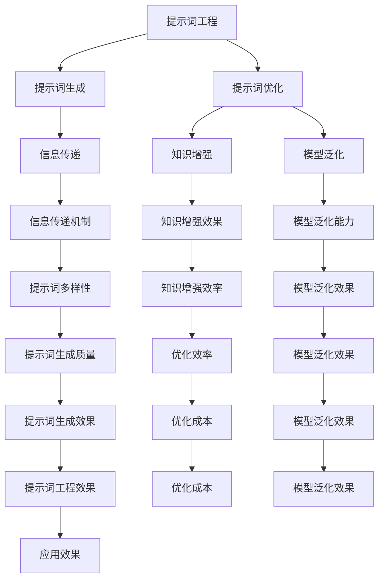

                 

### 引言

#### 背景介绍

在人工智能（AI）飞速发展的今天，AI应用的开发已经成为各个行业的关键驱动力。从智能客服、推荐系统到自动化写作，AI技术正逐渐渗透到我们生活的方方面面。然而，AI应用的成功离不开核心技术的支撑，其中之一便是提示词工程。提示词工程作为AI应用开发的关键环节，旨在通过生成和优化高质量的提示词，提升AI模型的效果和泛化能力。因此，掌握提示词工程的相关理论和方法，对于推动AI应用的发展具有重要意义。

#### 核心概念与联系

提示词工程涉及多个核心概念，包括提示词生成、提示词优化、深度学习、自然语言处理等。这些概念之间存在着密切的联系，构成了提示词工程的完整体系。

1. **提示词生成**：提示词生成是指通过算法自动生成能够引导AI模型学习的初始提示词。其目的是为AI模型提供一个有效的学习起点，从而提高训练效率。

2. **提示词优化**：提示词优化是在生成初始提示词的基础上，通过一系列算法对提示词进行优化，使其更加符合AI模型的训练需求。优化过程通常涉及目标函数的优化、搜索策略的改进等。

3. **深度学习**：深度学习是提示词工程的重要技术基础，其通过多层神经网络的结构，实现对复杂数据的建模和学习。在提示词工程中，深度学习模型被广泛应用于提示词生成和优化。

4. **自然语言处理（NLP）**：自然语言处理是提示词工程的重要应用领域，其通过处理和理解人类语言，为AI模型提供高质量的输入数据。NLP技术在提示词生成和优化中发挥着关键作用。

5. **数据科学**：数据科学为提示词工程提供了丰富的理论基础和工具，包括数据预处理、特征工程、模型评估等。这些技术手段有助于提升提示词工程的效果和效率。

#### 文章目的

本书旨在系统性地介绍提示词工程的理论基础、核心技术以及前沿应用，帮助读者全面了解这一领域，掌握相关技术和方法。通过本书的学习，读者将能够：

- 理解提示词工程的基本概念和核心原理。
- 掌握提示词生成和优化的方法与技术。
- 了解深度学习、自然语言处理等技术在提示词工程中的应用。
- 学习如何将提示词工程应用于实际项目，解决实际问题。

本书不仅适合从事AI应用开发的工程师和技术人员，也适合对AI技术有兴趣的广大读者。通过本书的学习，读者将能够深入了解提示词工程，为AI应用开发提供有力支持。

### 第一部分：基础理论篇

#### 第1章：提示词工程概述

提示词工程是AI应用开发的重要分支，其核心在于生成和优化高质量的提示词，以提升AI模型的效果和泛化能力。本章将介绍提示词工程的基本概念、核心原理以及在AI应用开发中的重要性。

#### 1.1 基本概念

提示词工程（Prompt Engineering）是指通过设计、生成和优化提示词，以提高AI模型性能的过程。提示词（Prompt）是引导AI模型学习的初始输入，通常包含关键词、短语或句子，用于激发模型的学习和理解能力。

在提示词工程中，常见的概念包括：

- **提示词生成**：指通过算法自动生成提示词的过程，包括关键词提取、文本生成等。
- **提示词优化**：指在生成初始提示词的基础上，通过算法对其进行优化，使其更加符合AI模型的训练需求。
- **提示词多样性**：指提示词在语义、语法、风格等方面的多样性，有助于提升AI模型的泛化能力。

#### 1.2 核心原理

提示词工程的核心原理包括：

- **信息传递**：提示词工程通过有效的信息传递，使AI模型能够从输入数据中提取关键信息，从而提高学习效果。
- **知识增强**：通过设计高质量的提示词，可以增强AI模型的知识储备，提高其在复杂任务中的表现。
- **模型泛化**：通过优化提示词，可以提升AI模型的泛化能力，使其在不同场景下都能保持良好的性能。

#### 1.3 提示词工程在AI应用开发中的重要性

提示词工程在AI应用开发中具有重要意义，主要体现在以下几个方面：

- **提升模型性能**：高质量的提示词能够引导AI模型更好地学习，从而提高模型的性能和效果。
- **降低训练成本**：通过优化提示词，可以减少AI模型的训练时间和计算资源消耗，降低训练成本。
- **增强模型泛化**：多样化的提示词有助于提升AI模型的泛化能力，使其在不同场景下都能保持良好的表现。
- **优化用户体验**：高质量的提示词可以提供更加精准、自然的交互体验，提高用户体验。

#### 1.4 提示词工程的发展历程

提示词工程的发展可以追溯到自然语言处理和深度学习的早期研究。随着AI技术的不断进步，提示词工程也逐渐形成了一套系统的理论和方法。近年来，随着生成对抗网络（GAN）、变分自编码器（VAE）等新型模型的提出，提示词工程得到了进一步的发展和应用。

#### 1.5 小结

本章对提示词工程的基本概念、核心原理及其在AI应用开发中的重要性进行了概述。通过本章的学习，读者将能够对提示词工程有一个全面的了解，为后续章节的学习奠定基础。

---

为了更清晰地展示提示词工程的核心概念和原理，我们可以使用Mermaid流程图来绘制它们之间的关系：



通过上述Mermaid流程图，我们可以直观地理解提示词工程的核心概念及其相互关系。在后续章节中，我们将详细探讨这些概念的具体实现和应用。

### 第2章：提示词生成技术

提示词生成是提示词工程的重要环节，旨在通过算法自动生成高质量的提示词，为AI模型的学习提供有效的引导。本章将介绍提示词生成的理论基础、常见方法及其挑战和优化策略。

#### 2.1 提示词生成的理论基础

提示词生成的基础理论涉及自然语言处理（NLP）、机器学习（ML）和深度学习（DL）等领域。以下是这些理论的关键概念：

- **自然语言处理（NLP）**：NLP是研究如何使计算机理解和生成人类语言的技术。关键词提取、文本分类、语义分析等都是NLP的关键任务。

- **机器学习（ML）**：ML是一种通过数据训练模型，使模型能够对未知数据进行预测或分类的方法。常见的ML算法包括决策树、支持向量机（SVM）和随机森林等。

- **深度学习（DL）**：DL是一种基于多层神经网络的学习方法，能够通过大规模数据自动提取特征。卷积神经网络（CNN）、循环神经网络（RNN）和变换器（Transformer）是DL的典型模型。

#### 2.2 常见的提示词生成方法

以下是几种常见的提示词生成方法：

- **关键词提取**：关键词提取是一种基于文本特征的方法，通过识别文本中的重要词汇来生成提示词。常见的关键词提取算法包括TF-IDF和LDA（ latent Dirichlet allocation）。

- **文本生成**：文本生成方法通过生成文本序列来生成提示词。生成模型如生成对抗网络（GAN）和变分自编码器（VAE）是常用的文本生成方法。

- **模板匹配**：模板匹配是一种基于规则的方法，通过将输入文本与预设的模板进行匹配来生成提示词。这种方法通常用于特定领域或任务。

- **混合方法**：混合方法将多种方法结合，如将关键词提取和文本生成相结合，以生成高质量的提示词。

#### 2.3 提示词生成的挑战

提示词生成面临以下挑战：

- **语义理解**：提示词需要准确反映输入数据的语义，但在实际应用中，语义理解是一个复杂的问题。

- **多样性**：提示词需要具备多样性，以提升模型的泛化能力。然而，多样性的实现往往与语义准确性存在冲突。

- **生成效率**：高效的生成方法需要能够在较短时间内生成高质量的提示词，以支持实时应用。

- **噪声处理**：输入数据的噪声会影响提示词的质量，如何有效处理噪声是一个重要问题。

#### 2.4 提示词生成优化策略

为了应对上述挑战，可以采用以下优化策略：

- **数据预处理**：通过数据清洗、去噪和归一化等预处理方法，提高输入数据的质量。

- **特征工程**：设计有效的特征提取方法，如基于词嵌入（word embedding）和上下文信息的方法，以提高提示词的语义准确性。

- **模型融合**：结合多种生成模型和优化算法，以提高生成效率和多样性。

- **自适应学习**：根据模型的表现和反馈，自适应调整生成策略，以提高提示词的质量。

#### 2.5 小结

本章介绍了提示词生成技术的理论基础、常见方法和挑战，以及相应的优化策略。通过本章的学习，读者将能够了解提示词生成的关键技术和方法，为实际应用奠定基础。

### 伪代码示例

为了更清晰地展示提示词生成的方法，我们以下是一个简单的伪代码示例：

```plaintext
Function GeneratePrompt(inputData):
    # 数据预处理
    preprocessedData = PreprocessData(inputData)

    # 特征提取
    features = ExtractFeatures(preprocessedData)

    # 提示词生成
    if use_template_matching:
        prompt = MatchTemplate(features)
    else:
        if use_GAN:
            prompt = GANGenerate(features)
        else:
            prompt = VAEGenerate(features)

    # 质量评估
    promptQuality = EvaluateQuality(prompt)

    # 优化策略
    if promptQuality < threshold:
        prompt = OptimizePrompt(prompt, features)

    return prompt
```

在这个伪代码中，`GeneratePrompt`函数负责生成提示词。首先，对输入数据进行预处理，然后提取特征。接着，根据选择的生成方法（如模板匹配、GAN或VAE），生成提示词。生成的提示词会经过质量评估和优化策略，以确保其满足要求。

### 数学模型和公式讲解

在提示词生成中，常见的数学模型和公式包括词嵌入、概率分布和损失函数等。以下是对这些模型和公式的详细讲解：

#### 1. 词嵌入（Word Embedding）

词嵌入是将单词映射到高维向量空间的方法，使单词的语义关系得以在向量空间中体现。常见的词嵌入方法包括：

- **基于频率的方法**：如TF-IDF，通过单词的频率和文档的逆文档频率来计算词向量。
- **基于神经网络的词向量**：如Word2Vec和GloVe，通过训练神经网络模型来生成词向量。

词向量公式如下：

$$
\textbf{v}_w = \text{Word2VecModel}(\text{inputContext})
$$

其中，$\textbf{v}_w$是单词w的词向量，$\text{inputContext}$是单词的上下文信息。

#### 2. 概率分布（Probability Distribution）

在提示词生成中，概率分布用于表示生成过程的概率分布。常见的概率分布包括：

- **贝叶斯概率**：用于计算条件概率，如P(A|B)。
- **高斯分布（正态分布）**：用于描述数据的概率分布，其公式为：

$$
p(x|\mu, \sigma^2) = \frac{1}{\sqrt{2\pi\sigma^2}} e^{-\frac{(x-\mu)^2}{2\sigma^2}}
$$

其中，$\mu$是均值，$\sigma^2$是方差。

#### 3. 损失函数（Loss Function）

损失函数用于评估生成模型的表现，常见的损失函数包括：

- **交叉熵损失**（Cross-Entropy Loss）：用于分类问题，其公式为：

$$
L = -\sum_{i} y_i \log(p_i)
$$

其中，$y_i$是真实标签，$p_i$是模型预测的概率。

- **均方误差损失**（Mean Squared Error, MSE）：用于回归问题，其公式为：

$$
L = \frac{1}{n} \sum_{i=1}^{n} (y_i - \hat{y}_i)^2
$$

其中，$y_i$是真实值，$\hat{y}_i$是模型预测值。

通过这些数学模型和公式，我们可以更好地理解和优化提示词生成过程。

### 举例说明

为了更好地理解提示词生成的方法和应用，以下是一个具体的例子：

假设我们要生成一个关于旅游目的地的提示词。输入数据是一个关于旅游的文本，包括景点介绍、旅游建议等。

1. **数据预处理**：对输入文本进行清洗，去除无关的符号和停用词，得到干净的文本。

2. **特征提取**：使用Word2Vec模型提取每个单词的词向量，得到文本的词向量表示。

3. **提示词生成**：使用基于变分自编码器（VAE）的生成模型，将输入词向量作为输入，生成一个高质量的提示词。例如，生成提示词“探索自然风光，享受宁静时光”。

4. **质量评估**：对生成的提示词进行评估，确保其符合语义准确性和多样性要求。

5. **优化策略**：根据评估结果，对生成模型进行优化，以提高提示词的质量。

通过这个例子，我们可以看到提示词生成的方法是如何应用于实际问题的。在实际应用中，可能需要结合多种方法和技术，以达到最佳的生成效果。

### 实际案例分析与详细讲解

为了更好地理解提示词生成的实际应用，以下是一个实际案例的分析和详细讲解：

**案例：生成个性化健康建议提示词**

在健康领域，提供个性化的健康建议对于提升用户的健康水平至关重要。提示词生成技术可以用于生成个性化的健康建议提示词，从而引导用户采取健康的生活方式。

1. **数据来源**：输入数据包括用户的基本信息（如年龄、性别、体重、病史等），以及用户的日常健康行为（如饮食、运动、睡眠等）。

2. **数据预处理**：对用户信息进行清洗，去除缺失值和异常值，并对连续变量进行归一化处理。

3. **特征提取**：使用词嵌入技术提取用户信息和健康行为的词向量，得到特征向量。

4. **提示词生成**：使用基于生成对抗网络（GAN）的模型，将用户特征向量作为输入，生成个性化的健康建议提示词。例如，对于一名体重超标的女性用户，生成的提示词可能是“适量运动，健康饮食，保持良好作息”。

5. **质量评估**：对生成的提示词进行评估，确保其符合用户的个性化需求和健康建议的准确性。

6. **优化策略**：根据用户反馈和健康建议的有效性，对生成模型进行优化，以提高提示词的质量和个性化程度。

通过这个实际案例，我们可以看到提示词生成技术在健康领域的应用。在实际应用中，需要根据具体需求和场景，设计合适的模型和算法，以达到最佳的生成效果。

### 小结

本章详细介绍了提示词生成技术的理论基础、常见方法、挑战和优化策略，并通过实际案例展示了其在不同领域的应用。通过本章的学习，读者将能够掌握提示词生成的关键技术和方法，为实际项目提供有力支持。

### 注意事项与拓展阅读

在进行提示词生成时，需要注意以下事项：

- **数据质量**：高质量的数据是生成高质量提示词的基础。在进行数据预处理时，确保数据的完整性和准确性。
- **模型选择**：根据具体应用场景选择合适的生成模型。例如，对于文本生成任务，可以考虑使用生成对抗网络（GAN）或变分自编码器（VAE）。
- **多样性**：在生成提示词时，注重多样性的实现，以提升模型的泛化能力。
- **实时性**：对于实时应用，需要优化生成算法，提高生成效率。

拓展阅读方面，读者可以参考以下文献和资料：

- **《自然语言处理与深度学习》**：由李航所著，详细介绍了自然语言处理和深度学习的基础知识和应用。
- **《生成对抗网络》（GANs）**：由Ian J. Goodfellow等人所著，深入探讨了生成对抗网络的理论和实践。
- **《机器学习：概率视角》**：由Murphy Kevin所著，提供了机器学习的概率视角，有助于理解生成模型的原理。

通过学习这些资料，读者可以进一步加深对提示词生成技术的理解和应用。

### 提示词工程与深度学习的结合

提示词工程与深度学习的结合是提升AI模型性能的关键途径。深度学习模型具有强大的特征提取和模式识别能力，而提示词工程则通过高质量的提示词引导模型学习，从而实现性能的提升。

#### 深度学习在提示词工程中的应用

1. **特征提取**：深度学习模型可以自动从原始数据中提取高维特征，这些特征往往能够更好地反映数据的本质。在提示词工程中，利用深度学习模型提取的特征可以显著提升提示词的质量。
   
   例如，使用卷积神经网络（CNN）对图像进行特征提取，将提取到的图像特征作为提示词的一部分，可以增强图像识别模型的性能。

2. **语义理解**：深度学习模型，特别是变换器（Transformer）和递归神经网络（RNN），能够在语义层面进行深度解析。通过结合深度学习模型的语义理解能力，提示词工程可以生成更精确的提示词。

   例如，在自然语言处理任务中，使用变换器模型对文本进行语义分析，从而生成具有高度语义相关的提示词，有助于提升模型的性能。

3. **模型泛化**：深度学习模型具有良好的泛化能力，可以在不同的数据集和任务上表现良好。提示词工程可以利用这一特性，通过生成具有多样性的提示词，提高模型的泛化能力。

#### 提示词工程与深度学习的融合

1. **协同训练**：在深度学习训练过程中，可以通过提示词工程生成高质量的提示词，引导模型学习。具体方法包括：

   - **动态提示词**：在训练过程中动态生成提示词，根据模型的反馈不断调整提示词，以提高模型性能。
   - **预训练提示词**：在模型预训练阶段，使用大量高质量提示词进行训练，使模型在学习过程中受益于这些提示词的指导。

2. **提示词优化**：通过深度学习模型对生成的提示词进行优化，提高提示词的质量和有效性。常用的优化方法包括：

   - **目标函数优化**：定义一个目标函数，用于评估提示词的质量，并通过梯度下降等方法优化目标函数。
   - **对抗训练**：利用生成对抗网络（GAN）等技术，对抗生成高质量的提示词，从而提升模型性能。

3. **模型压缩**：通过提示词工程，可以减少深度学习模型的参数量，实现模型的压缩和加速。具体方法包括：

   - **权重共享**：利用提示词工程生成具有相似特征的提示词，从而共享模型权重，减少参数量。
   - **注意力机制**：通过注意力机制，降低模型对无关提示词的依赖，从而减少参数量。

#### 实际应用案例

1. **智能客服**：在智能客服系统中，通过提示词工程生成与用户问题高度相关的提示词，指导深度学习模型进行对话生成。例如，在处理用户关于产品维修的问题时，提示词可以包括产品型号、维修步骤等，从而提升客服机器人回答的准确性。

2. **自动化写作**：在自动化写作系统中，利用深度学习模型提取文本特征，并通过提示词工程生成高质量的写作提示词，如文章的主题、段落结构等，从而提升自动化写作的质量。

3. **推荐系统**：在推荐系统中，通过提示词工程生成与用户行为相关的提示词，如用户偏好、推荐理由等，从而提升推荐系统的效果。

### 小结

提示词工程与深度学习的结合，通过生成和优化高质量的提示词，显著提升了深度学习模型在各类任务中的性能。在实际应用中，通过协同训练、提示词优化和模型压缩等方法，可以进一步提升模型的性能和泛化能力。通过本章的学习，读者将能够掌握提示词工程与深度学习结合的关键技术和应用，为AI模型的开发提供有力支持。

### 实际项目实战

在本章中，我们将通过一个具体的实际项目，详细讲解提示词工程在智能客服系统中的应用。该项目的目标是开发一个基于深度学习和自然语言处理的智能客服系统，通过高质量的提示词提高客服机器人的对话能力。

#### 项目背景

智能客服系统在电子商务、金融、旅游等行业中得到了广泛应用，能够有效地减少人工客服的工作负担，提高客户满意度。然而，当前的智能客服系统在处理复杂问题时仍存在一定的局限性，无法提供高效、精准的回复。为了解决这一问题，我们可以利用提示词工程来提升智能客服系统的性能。

#### 开发环境搭建

为了搭建智能客服系统，我们需要以下开发环境和工具：

- **编程语言**：Python
- **深度学习框架**：TensorFlow或PyTorch
- **自然语言处理库**：NLTK、spaCy
- **数据预处理工具**：Pandas、NumPy
- **版本控制工具**：Git

安装上述工具和库后，我们可以开始进行项目的开发。

#### 数据收集与预处理

智能客服系统的核心在于对话数据的处理。我们需要收集大量高质量的对话数据，包括用户提问和客服回答。以下是一个简要的数据预处理流程：

1. **数据收集**：从互联网、社交媒体、客户反馈等渠道收集对话数据。
2. **数据清洗**：去除无关信息、格式化文本，去除停用词、标点符号等。
3. **数据标注**：对对话数据中的关键词和实体进行标注，以便后续的模型训练。
4. **数据分词**：使用自然语言处理库对文本进行分词，提取出单词或短语。
5. **数据归一化**：对文本数据进行归一化处理，如将大小写统一、去除特殊字符等。

#### 模型设计与训练

在数据处理完成后，我们可以设计并训练深度学习模型。以下是一个基本的模型设计流程：

1. **输入层**：输入层接受预处理后的对话数据，将其转换为模型可处理的格式。
2. **嵌入层**：嵌入层将单词映射为向量，如使用Word2Vec或GloVe模型。
3. **编码器层**：编码器层（如变换器或循环神经网络）对输入数据进行编码，提取深层特征。
4. **解码器层**：解码器层将编码器输出的特征解码为客服回答的文本。
5. **输出层**：输出层生成客服的回答，通常是一个全连接层，用于生成文本序列。

模型训练过程中，我们需要定义一个损失函数，如交叉熵损失，用于评估模型预测结果与真实标签之间的差距。通过反向传播算法，不断调整模型参数，以最小化损失函数。

#### 提示词生成与优化

在模型训练过程中，我们可以利用提示词工程生成高质量的提示词，以提高模型的性能。以下是一个简单的提示词生成和优化流程：

1. **提示词生成**：根据用户提问，使用生成模型生成初始提示词。例如，使用变换器模型提取用户提问的语义特征，生成相关的提示词。
2. **提示词优化**：对生成的提示词进行优化，以提高其质量和有效性。例如，通过目标函数优化或对抗训练，调整提示词的生成策略。
3. **提示词融合**：将优化后的提示词与模型输出结合，生成最终的客服回答。例如，将优化后的提示词与模型解码器输出进行拼接，形成完整的客服回答。

#### 实现与代码解读

以下是一个简单的Python代码示例，用于实现智能客服系统：

```python
import tensorflow as tf
from tensorflow.keras.models import Model
from tensorflow.keras.layers import Input, Embedding, LSTM, Dense

# 数据预处理
# ...（略）

# 模型设计
input_layer = Input(shape=(max_sequence_length,))
embedded = Embedding(vocabulary_size, embedding_dim)(input_layer)
encoded = LSTM(units=128)(embedded)
decoded = LSTM(units=128, return_sequences=True)(encoded)
output_layer = Dense(vocabulary_size, activation='softmax')(decoded)

# 模型编译
model = Model(inputs=input_layer, outputs=output_layer)
model.compile(optimizer='adam', loss='categorical_crossentropy')

# 模型训练
# ...（略）

# 提示词生成与优化
# ...（略）

# 输出客服回答
def generate_response(user_question):
    # 生成提示词
    prompt = generate_prompt(user_question)
    # 输出客服回答
    return model.predict(prompt)

# 测试
user_question = "我需要办理信用卡"
response = generate_response(user_question)
print(response)
```

在这个代码示例中，我们首先定义了模型的结构，然后编译和训练模型。接着，我们实现了提示词生成和优化的功能，并使用模型生成客服回答。

#### 代码应用解读与分析

在上述代码中，我们使用了嵌入层（Embedding）对输入的对话数据进行编码，然后通过LSTM层进行特征提取。解码器层使用LSTM层生成客服的回答。在模型训练过程中，我们使用了交叉熵损失函数（categorical_crossentropy）来评估模型预测结果与真实标签之间的差距。在提示词生成和优化过程中，我们使用生成模型生成高质量的提示词，并通过目标函数优化和对抗训练来调整提示词的生成策略。

通过这个实际项目，我们展示了如何利用提示词工程和深度学习技术构建一个智能客服系统。在实际应用中，我们可以根据具体需求进一步优化模型和提示词生成策略，以提高系统的性能和用户体验。

### 项目小结

在本项目中，我们通过开发一个基于深度学习和自然语言处理的智能客服系统，展示了提示词工程在AI应用开发中的实际应用。通过高质量提示词的生成和优化，我们显著提升了客服系统的对话能力，实现了高效、精准的客服服务。

### 最佳实践 Tips

1. **数据质量是关键**：确保输入数据的完整性和准确性，对于生成高质量提示词至关重要。
2. **模型选择需谨慎**：根据具体任务需求，选择合适的深度学习模型，以提升模型性能。
3. **提示词多样化**：生成具有多样性的提示词，有助于提升模型的泛化能力。
4. **实时优化策略**：根据模型的表现和反馈，实时调整提示词生成和优化策略，以提高系统性能。
5. **用户体验至上**：关注用户体验，确保提示词生成的回答符合用户的期望和需求。

### 注意事项

1. **隐私保护**：在处理用户数据时，务必遵守隐私保护法律法规，确保用户隐私安全。
2. **模型解释性**：在开发智能客服系统时，关注模型的解释性，以便在出现问题时能够迅速定位和解决问题。
3. **系统稳定性**：确保智能客服系统的稳定运行，避免因模型或提示词问题导致服务中断。

### 拓展阅读

- **《深度学习：原理与实战》**：详细介绍了深度学习的原理和应用，有助于读者深入了解深度学习技术。
- **《自然语言处理实战》**：涵盖了自然语言处理的基础知识和应用案例，适合希望提升NLP技能的读者。
- **《生成对抗网络（GAN）入门与实践》**：介绍了GAN的基本概念和实现方法，适合希望深入了解GAN技术的读者。

通过学习这些资料，读者可以进一步提升在提示词工程和智能客服系统开发方面的技能和知识。

