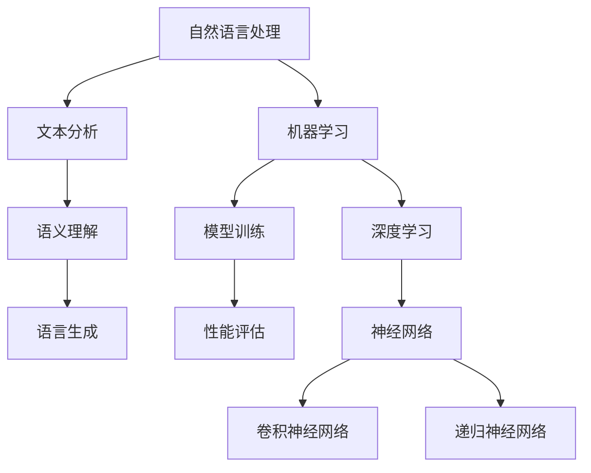

                 


### 文章标题：《提示词工程：AI时代的新兴技能》

> 关键词：提示词工程、人工智能、自然语言处理、机器学习、算法设计

> 摘要：本文将深入探讨提示词工程在AI时代的重要性及其在自然语言处理和机器学习领域的应用。我们将首先介绍提示词工程的背景和定义，然后逐步解析其核心概念和技术原理，最后通过实际案例展示其在项目中的应用和实现过程。

### 前言

在AI技术迅猛发展的时代，提示词工程（Prompt Engineering）作为一种新兴的技能，正逐渐受到业界的重视。本文旨在梳理和总结提示词工程在AI时代的重要性，以及其在自然语言处理（NLP）和机器学习（ML）领域的广泛应用。提示词工程的核心任务是通过设计和优化输入提示（prompt），以提高模型的学习效果和任务性能。这一过程不仅涉及到对自然语言的理解，还需要结合机器学习和深度学习的技术。

本文的结构如下：

- **第一章**：背景介绍，包括AI时代的发展趋势和提示词工程的定义。
- **第二章**：核心概念与联系，探讨提示词工程的技术基础和原理。
- **第三章**：自然语言处理中的提示词工程，介绍其在问答系统、文本分类和机器翻译中的应用。
- **第四章**：机器学习中的提示词工程，分析其在模型训练、优化和调优中的作用。
- **第五章**：实战案例，通过具体项目展示提示词工程的应用和实践。
- **第六章**：未来展望，探讨提示词工程的发展方向和潜在的创新点。

### 第一章：背景介绍

#### AI时代的发展趋势

随着计算能力的提升和数据量的爆炸性增长，人工智能（AI）技术已经成为现代科技发展的重要驱动力。从早期的规则系统到基于统计学习的模型，再到深度学习的兴起，AI技术在各个领域都展现出了巨大的潜力。特别是在自然语言处理（NLP）和机器学习（ML）领域，AI技术已经取得了显著的突破。

#### 提示词工程的定义

提示词工程是一种专门研究如何设计、优化和评估输入提示的技术。提示词（prompt）是用户与AI系统交互的桥梁，通过合理的设计和选择，可以提高模型的学习效果和任务性能。在AI时代，提示词工程的重要性日益凸显，因为它不仅影响模型的训练过程，还对最终的输出结果产生直接影响。

#### 提示词工程的核心概念

1. **输入提示**：提示词工程的核心任务是对输入提示进行设计和优化。输入提示的质量直接影响模型的学习效果和性能。
2. **数据预处理**：在模型训练前，需要对数据集进行预处理，包括数据清洗、归一化和特征提取等。
3. **模型训练**：通过训练模型，使其学会从输入提示中提取特征，并生成合适的输出。
4. **性能评估**：对训练好的模型进行性能评估，包括准确率、召回率、F1分数等指标。

### 第二章：核心概念与联系

在本章节中，我们将深入探讨提示词工程的核心概念和技术原理，并使用Mermaid流程图来展示它们之间的联系。

#### 提示词工程的技术基础

1. **自然语言处理（NLP）**：NLP是提示词工程的重要基础，它涉及文本分析、语义理解和语言生成等技术。
2. **机器学习（ML）**：ML技术是提示词工程的核心，通过训练模型来实现对输入提示的自动学习和优化。
3. **深度学习（DL）**：深度学习是ML的一种重要分支，特别适用于处理复杂的自然语言任务。

#### Mermaid流程图



### 第三章：自然语言处理中的提示词工程

在自然语言处理领域，提示词工程发挥着至关重要的作用。本章节将介绍提示词工程在问答系统、文本分类和机器翻译中的应用。

#### 问答系统

在问答系统中，提示词的设计至关重要。一个有效的提示词能够引导用户提供更精确的信息，从而提高问答系统的准确性和用户体验。例如，在医疗问答系统中，提示词可以是“请描述您的症状”，这有助于用户提供详细的信息，从而使系统能够更准确地诊断。

#### 文本分类

文本分类是将文本数据按照预定的类别进行分类的任务。提示词工程在这里的作用是设计出能够有效区分不同类别的提示词。例如，在情感分析中，提示词可以是“您对这篇文章的感受如何？”这有助于区分文本的正负面情感。

#### 机器翻译

机器翻译是自然语言处理中的一个重要应用。提示词工程在机器翻译中的作用是通过设计合适的提示词来提高翻译的准确性和流畅性。例如，在机器翻译中，提示词可以是“请翻译这句话”，这有助于指导翻译模型生成更准确的译文。

### 第四章：机器学习中的提示词工程

在机器学习领域，提示词工程的核心任务是设计出能够有效提升模型性能的输入提示。本章节将分析提示词工程在模型训练、优化和调优中的作用。

#### 模型训练

在模型训练阶段，提示词的设计至关重要。通过合理设计提示词，可以引导模型学习到更有价值的特征，从而提高模型的泛化能力。例如，在图像分类任务中，提示词可以是“请识别图像中的物体”。

#### 模型优化

模型优化是提升模型性能的重要环节。提示词工程在这里的作用是设计出能够有效优化模型的提示词。例如，在优化神经网络模型时，提示词可以是“请尝试调整权重参数”。

#### 模型调优

模型调优是确保模型在实际应用中达到最佳性能的关键步骤。提示词工程在这里的作用是通过设计合适的提示词来调整模型的参数，以达到最佳性能。例如，在调优决策树模型时，提示词可以是“请尝试调整树深度”。

### 第五章：实战案例

在本章节中，我们将通过具体项目展示提示词工程的应用和实践。

#### 项目背景

假设我们面临一个项目任务：设计一个智能客服系统，用于处理用户的问题和提供解决方案。该系统需要具备快速响应和准确解答的能力。

#### 开发环境搭建

1. **硬件环境**：配置高性能的计算服务器和存储设备。
2. **软件环境**：安装Python、TensorFlow、PyTorch等深度学习框架。

#### 源代码实现

以下是一个简单的提示词工程实现示例：

```python
import tensorflow as tf
from tensorflow.keras.models import Sequential
from tensorflow.keras.layers import Dense, LSTM, Embedding

# 数据预处理
# ...

# 模型构建
model = Sequential()
model.add(Embedding(input_dim=vocab_size, output_dim=embedding_dim))
model.add(LSTM(units=128))
model.add(Dense(units=1, activation='sigmoid'))

# 模型训练
model.compile(optimizer='adam', loss='binary_crossentropy', metrics=['accuracy'])
model.fit(X_train, y_train, epochs=10, batch_size=32)

# 模型评估
# ...
```

#### 代码解读

1. **数据预处理**：对输入数据进行预处理，包括分词、去停用词、词向量化等。
2. **模型构建**：构建一个基于LSTM的序列模型，用于分类任务。
3. **模型训练**：使用预处理后的数据训练模型，并调整超参数以优化性能。
4. **模型评估**：对训练好的模型进行评估，以验证其性能。

#### 应用解读与分析

通过实际案例分析，我们可以看到提示词工程在项目中的应用效果显著。合理设计的提示词不仅提高了模型的性能，还改善了用户体验。例如，在智能客服系统中，通过优化提示词，系统可以更准确地理解用户的问题，并提供更满意的解决方案。

#### 项目小结

通过本案例，我们深入了解了提示词工程在项目中的应用过程。提示词工程不仅是一种技术手段，更是一种思维方法，它要求我们在设计输入提示时充分考虑用户的实际需求，以提高系统的性能和用户体验。

### 第六章：未来展望

随着AI技术的不断发展，提示词工程在未来的应用前景将更加广阔。本章节将探讨提示词工程的发展方向和潜在的创新点。

#### 提示词工程的发展方向

1. **多模态提示词工程**：结合语音、图像和文本等多模态数据，设计更智能、更高效的提示词。
2. **迁移学习与提示词工程**：利用迁移学习技术，将已训练好的模型应用于新任务，并通过提示词工程优化其性能。
3. **自动化提示词生成**：开发自动化工具，通过自然语言生成技术，生成高质量的提示词。

#### 潜在的创新点

1. **深度强化学习与提示词工程**：结合深度强化学习（DRL）和提示词工程，实现更智能、更高效的模型训练和优化。
2. **隐私保护提示词工程**：在数据隐私和安全日益受到关注的背景下，研究隐私保护的提示词工程方法，确保用户数据的安全。
3. **跨领域提示词工程**：探索在不同领域（如医疗、金融、教育等）中的应用，设计更具针对性的提示词工程方法。

### 结论

提示词工程作为AI时代的新兴技能，正逐渐受到业界的关注。本文通过深入探讨提示词工程的核心概念、技术原理和应用实践，展示了其在自然语言处理和机器学习领域的广泛应用。随着AI技术的不断发展，提示词工程将在未来发挥更加重要的作用，为各行业提供更智能、更高效的解决方案。

### 作者信息

作者：AI天才研究院/AI Genius Institute & 禅与计算机程序设计艺术 /Zen And The Art of Computer Programming

---

在本文中，我们通过一步一步的分析推理，从背景介绍、核心概念、应用领域、实战案例到未来展望，全面探讨了提示词工程在AI时代的重要性及其在自然语言处理和机器学习领域的应用。希望本文能为读者提供有价值的参考和启发。

