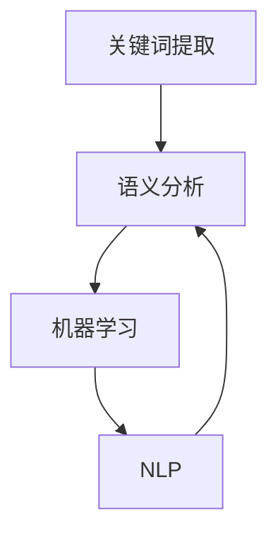

                 

### 文章标题

《提示词工程：AI时代的新挑战与新机遇》

关键词：提示词工程，AI时代，挑战，机遇，技术原理，应用案例

摘要：本文将深入探讨提示词工程在AI时代的重要性及其面临的挑战和机遇。通过背景介绍、核心概念与联系架构、算法原理讲解、数学模型和公式详细讲解、项目实战等多个方面，全面解析提示词工程在当前技术环境中的地位和未来发展。旨在为读者提供关于提示词工程的理论与实践指导，帮助读者更好地理解和应用这一技术。

### 第一部分：概述

#### 1.1 提示词工程的概念与作用

提示词工程（Keyword Engineering），是一种针对特定领域或任务进行关键词提取、处理和优化的技术。在人工智能领域，提示词工程扮演着至关重要的角色，它不仅是自然语言处理（NLP）的基础，也是许多AI应用的核心。

首先，我们需要明确提示词工程的基本概念。提示词，顾名思义，是指用于描述或定义某一特定概念或主题的关键词。这些关键词可以是单个词，也可以是短语，它们在文本中承载了丰富的信息，是理解和分析文本内容的关键。

提示词工程的作用主要体现在以下几个方面：

1. **信息检索**：通过提取和优化提示词，可以提高信息检索系统的准确性和效率，帮助用户快速找到所需信息。
2. **自然语言理解**：提示词工程有助于模型更好地理解文本的含义，从而在语义分析、情感分析等任务中发挥重要作用。
3. **智能推荐系统**：提示词工程可以用于构建智能推荐系统，根据用户兴趣和行为，推荐相关的商品、内容或服务。
4. **自动问答系统**：通过优化提示词，可以提升自动问答系统的性能，使其能够更准确地回答用户的问题。

#### 1.2 提示词工程的发展历程

提示词工程的发展历程可以追溯到20世纪60年代。当时，研究人员开始探索如何利用关键词来改善文本处理和搜索系统的性能。

早期，提示词工程主要依赖于手工标注和规则匹配。随着计算技术和算法的进步，自然语言处理技术逐渐成熟，提示词工程也逐渐从规则驱动转向数据驱动。

在深度学习兴起之前，提示词工程主要依赖于统计模型和机器学习方法。这些方法通过对大量文本数据进行训练，提取出具有代表性的关键词，并用于信息检索和文本分类等任务。

深度学习技术的引入，使得提示词工程迎来了新的发展机遇。基于神经网络的模型，如卷积神经网络（CNN）和循环神经网络（RNN），可以更有效地处理复杂的文本数据，从而提高提示词工程的效果。

#### 1.3 提示词工程在AI时代的重要性

随着人工智能技术的快速发展，提示词工程在AI时代的重要性愈发突出。以下是几个关键方面：

1. **跨领域应用**：提示词工程不仅应用于传统的搜索引擎和文本分类任务，还广泛应用于图像识别、语音识别、机器翻译等跨领域任务。
2. **智能化水平提升**：通过优化提示词，可以显著提高AI系统的智能化水平，使其能够更好地理解用户需求和提供个性化服务。
3. **数据分析与决策**：提示词工程在数据分析中发挥着重要作用，可以帮助企业更好地理解用户行为和市场趋势，从而做出更科学的决策。
4. **人机交互**：提示词工程为人机交互提供了新的途径，通过自然语言交互，用户可以更直观地与AI系统进行沟通。

总之，提示词工程是AI时代不可或缺的重要技术，它不仅推动了人工智能的发展，也为各行各业带来了巨大的变革和创新机遇。

### 核心概念与联系

在探讨提示词工程的核心概念和联系时，我们需要明确几个关键概念：关键词提取、语义分析、机器学习和自然语言处理（NLP）。

首先，关键词提取（Keyword Extraction）是提示词工程的基础。关键词提取旨在从大量文本数据中自动提取出具有代表性的关键词，这些关键词可以用于后续的文本分析、分类和搜索等任务。关键词提取的方法包括基于统计的方法、基于机器学习的方法以及基于深度学习的方法。

其次，语义分析（Semantic Analysis）是理解文本内容的核心。语义分析旨在识别文本中的概念、关系和语义角色，从而实现对文本内容的深层次理解。在提示词工程中，语义分析可以帮助我们更好地理解关键词的含义和上下文关系，从而优化关键词的选择和匹配。

接下来，机器学习（Machine Learning）是提示词工程的关键技术。机器学习通过从数据中学习规律和模式，可以提高关键词提取的准确性和效率。常见的机器学习算法包括支持向量机（SVM）、朴素贝叶斯（Naive Bayes）和随机森林（Random Forest）等。深度学习（Deep Learning）的引入，使得机器学习在处理大规模和复杂文本数据时更具优势。

最后，自然语言处理（NLP）是提示词工程的核心领域。NLP旨在使计算机能够理解、处理和生成自然语言。NLP涵盖了从文本预处理、词法分析、句法分析到语义分析和情感分析的整个过程。在提示词工程中，NLP技术用于提取和优化关键词，从而提高文本分析的效果。

为了更好地展示这些核心概念之间的联系，我们可以使用Mermaid流程图来构建它们之间的关系架构：



在上面的流程图中，关键词提取是提示词工程的起点，它通过语义分析和机器学习，实现对文本内容的深入理解。自然语言处理作为整个过程的支撑，贯穿于关键词提取和语义分析的各个环节。

### 提示词生成算法

在提示词工程中，提示词生成算法是核心环节之一。通过这些算法，我们可以从大规模文本数据中自动提取出具有代表性的关键词，为后续的文本分析和应用提供支持。下面我们将详细讲解几种常见的提示词生成算法，包括基于统计的方法、基于机器学习的方法以及基于深度学习的方法。

#### 基于统计的方法

基于统计的方法是最早应用于关键词提取的算法，其核心思想是通过统计文本中词汇的频率和重要性来提取关键词。以下是一些常见的基于统计的方法：

1. **TF-IDF（Term Frequency-Inverse Document Frequency）**：
   TF-IDF是一种经典的词频统计方法，用于衡量一个词在文档中的重要程度。其中，TF表示词频，即一个词在文档中出现的次数；IDF表示逆文档频率，用于平衡高频词的重要程度。IDF的计算公式如下：

   $$ IDF(t,d) = \log \left( \frac{N}{df(t,d)} \right) $$

   其中，$N$ 是文档总数，$df(t,d)$ 是包含词$t$的文档数。

   $$ TF-IDF(t,d) = TF(t,d) \times IDF(t,d) $$

2. **TF*IDF with Okapi**：
   Okapi是一种改进的TF-IDF方法，引入了更多参数来调整词频和文档频率，从而提高关键词提取的准确性。其计算公式为：

   $$ TF*IDF(t,d) = \left( 1 + \log_{10}(TF(t,d)) \right) \times \left( \frac{N}{df(t,d)} + 1 \right) $$

3. **TextRank**：
   TextRank是一种基于图论的文本排名算法，其核心思想是将文本视为一个图，并通过图算法来提取关键词。TextRank算法的基本步骤如下：

   - 构建文本图：将文本中的每个句子作为图中的一个节点，句子中的每个词作为图的边。
   - 计算节点的权重：通过迭代更新每个节点的权重，使其能够反映节点在整个文本中的重要性。
   - 提取关键词：将权重最高的节点作为关键词。

#### 基于机器学习的方法

基于机器学习的方法通过训练模型来学习如何从文本数据中提取关键词。以下是一些常见的基于机器学习的方法：

1. **朴素贝叶斯（Naive Bayes）**：
   朴素贝叶斯是一种基于概率论的分类算法，常用于文本分类任务。在关键词提取中，我们可以使用朴素贝叶斯模型来预测每个词是否为关键词。具体步骤如下：

   - 构建词汇表：从文本数据中构建包含所有词的词汇表。
   - 计算词的概率分布：对于每个词$t$，计算其在关键词和非关键词中的概率分布。
   - 提取关键词：对于新文本，使用朴素贝叶斯模型预测每个词的类别，将概率较高的词作为关键词。

2. **支持向量机（SVM）**：
   支持向量机是一种强大的分类算法，常用于文本分类和关键词提取。在关键词提取中，我们可以将关键词提取任务视为一个二分类问题，即判断一个词是否为关键词。具体步骤如下：

   - 特征提取：将文本数据转化为向量表示，通常使用词袋模型（Bag of Words）或TF-IDF表示。
   - 训练模型：使用训练数据集训练支持向量机模型。
   - 提取关键词：对于新文本，使用训练好的模型预测每个词的类别，将概率较高的词作为关键词。

3. **深度神经网络（Deep Neural Network）**：
   深度神经网络是一种强大的机器学习模型，可以通过多层非线性变换来学习复杂的特征。在关键词提取中，我们可以使用深度神经网络来学习从文本中提取关键词。具体步骤如下：

   - 数据预处理：将文本数据转化为序列表示，通常使用词嵌入（Word Embedding）技术。
   - 构建模型：设计并训练深度神经网络模型，使其能够预测文本中的关键词。
   - 提取关键词：对于新文本，使用训练好的模型预测每个词的类别，将概率较高的词作为关键词。

#### 基于深度学习的方法

基于深度学习的方法利用神经网络强大的表示能力，可以提取更细粒度和更复杂的特征。以下是一些常见的基于深度学习的方法：

1. **长短时记忆网络（Long Short-Term Memory，LSTM）**：
   长短时记忆网络是一种循环神经网络（RNN），能够有效处理长序列数据。在关键词提取中，LSTM可以捕捉文本中的长期依赖关系，从而提高关键词提取的准确性。具体步骤如下：

   - 数据预处理：将文本数据转化为序列表示。
   - 构建模型：设计并训练LSTM模型，使其能够预测文本中的关键词。
   - 提取关键词：对于新文本，使用训练好的模型预测每个词的类别，将概率较高的词作为关键词。

2. **卷积神经网络（Convolutional Neural Network，CNN）**：
   卷积神经网络是一种用于图像处理的深度学习模型，但也可以应用于文本数据。在关键词提取中，CNN可以通过局部特征提取来提高关键词提取的效果。具体步骤如下：

   - 数据预处理：将文本数据转化为序列表示。
   - 构建模型：设计并训练CNN模型，使其能够预测文本中的关键词。
   - 提取关键词：对于新文本，使用训练好的模型预测每个词的类别，将概率较高的词作为关键词。

3. **Transformer**：
   Transformer是一种基于自注意力机制的深度学习模型，广泛应用于自然语言处理任务。在关键词提取中，Transformer可以捕捉文本中的全局依赖关系，从而提高关键词提取的效果。具体步骤如下：

   - 数据预处理：将文本数据转化为序列表示。
   - 构建模型：设计并训练Transformer模型，使其能够预测文本中的关键词。
   - 提取关键词：对于新文本，使用训练好的模型预测每个词的类别，将概率较高的词作为关键词。

以上是几种常见的提示词生成算法。在实际应用中，可以根据具体需求和数据特点选择合适的算法。通过这些算法，我们可以从大规模文本数据中自动提取出具有代表性的关键词，为后续的文本分析和应用提供支持。

### 提示词优化算法

提示词优化（Keyword Optimization）是提示词工程中一个关键环节，其目标是提升关键词的质量和效果，从而提高信息检索、文本分类等任务的性能。在这一部分，我们将探讨几种常见的提示词优化算法，包括基于文本分析的方法、基于机器学习的方法以及基于深度学习的方法。

#### 基于文本分析的方法

基于文本分析的方法主要通过分析文本数据中的关键词分布和词频来优化提示词。以下是一些常见的方法：

1. **频率阈值法**：
   频率阈值法是一种简单的提示词优化方法，其核心思想是根据关键词在文本中的出现频率来设置阈值，将频率高于阈值的词选为关键词。这种方法易于实现，但可能导致关键词遗漏或不准确。

2. **词语重要性评分**：
   词语重要性评分方法通过对关键词进行打分来评估其重要性。常用的评分方法包括TF-IDF、TF*IDF with Okapi等。这些方法根据词频和文档频率来计算关键词的得分，从而优化提示词。

3. **词云图**：
   词云图是一种通过可视化关键词分布来优化提示词的方法。词云图中，关键词的大小和颜色与其在文本中的重要性成正比。通过观察词云图，可以直观地识别出重要的关键词，并进行优化。

#### 基于机器学习的方法

基于机器学习的方法通过训练模型来学习如何优化提示词。以下是一些常见的基于机器学习的方法：

1. **朴素贝叶斯（Naive Bayes）**：
   朴素贝叶斯是一种基于概率论的分类算法，可以用于优化提示词。通过训练朴素贝叶斯模型，可以预测每个词是否为关键词，并根据预测结果优化提示词。

2. **支持向量机（SVM）**：
   支持向量机是一种强大的分类算法，可以用于优化提示词。通过训练支持向量机模型，可以识别出关键词和非关键词，从而优化提示词。

3. **随机森林（Random Forest）**：
   随机森林是一种基于决策树的集成学习方法，可以用于优化提示词。通过训练随机森林模型，可以预测每个词是否为关键词，并根据预测结果优化提示词。

4. **梯度提升树（Gradient Boosting Tree）**：
   梯度提升树是一种基于决策树的集成学习方法，可以用于优化提示词。通过训练梯度提升树模型，可以优化提示词，从而提高信息检索和文本分类的准确性和效率。

#### 基于深度学习的方法

基于深度学习的方法利用神经网络强大的表示能力，可以更有效地优化提示词。以下是一些常见的基于深度学习的方法：

1. **长短时记忆网络（LSTM）**：
   长短时记忆网络是一种循环神经网络，可以用于优化提示词。通过训练LSTM模型，可以捕捉文本中的长期依赖关系，从而优化提示词。

2. **卷积神经网络（CNN）**：
   卷积神经网络是一种用于图像处理的深度学习模型，但也可以应用于文本数据。通过训练CNN模型，可以提取文本中的局部特征，从而优化提示词。

3. **Transformer**：
   Transformer是一种基于自注意力机制的深度学习模型，广泛应用于自然语言处理任务。通过训练Transformer模型，可以优化提示词，从而提高信息检索和文本分类的效果。

在实际应用中，可以根据具体需求和数据特点选择合适的提示词优化算法。通过这些方法，我们可以有效提升提示词的质量和效果，从而提高信息检索、文本分类等任务的性能。

### 提示词匹配算法

在提示词工程中，提示词匹配（Keyword Matching）是关键的一环，其目的是根据用户输入或目标文本，从候选关键词中快速准确地找出匹配的关键词。下面我们将详细探讨几种常见的提示词匹配算法，包括基于字符串匹配的方法、基于概率模型的匹配算法以及基于深度学习的方法。

#### 基于字符串匹配的方法

基于字符串匹配的方法是最简单和直观的提示词匹配方法。以下是一些常见的方法：

1. **模糊匹配**：
   模糊匹配是一种能够容忍一定程度的字符差异的匹配方法。常用的模糊匹配算法包括Levenshtein距离（编辑距离）和Jaccard相似度。Levenshtein距离衡量的是将一个字符串转换为另一个字符串所需的最小编辑操作次数。Jaccard相似度则通过计算两个字符串的交集和并集的比值来衡量相似度。

   伪代码示例：
   ```python
   def levenshtein_distance(s1, s2):
       # 初始化距离矩阵
       dp = [[0] * (len(s2) + 1) for _ in range(len(s1) + 1)]
       
       # 初始化边界条件
       for i in range(len(s1) + 1):
           dp[i][0] = i
       for j in range(len(s2) + 1):
           dp[0][j] = j
       
       # 计算编辑距离
       for i in range(1, len(s1) + 1):
           for j in range(1, len(s2) + 1):
               if s1[i - 1] == s2[j - 1]:
                   dp[i][j] = dp[i - 1][j - 1]
               else:
                   dp[i][j] = 1 + min(dp[i - 1][j], dp[i][j - 1], dp[i - 1][j - 1])
       
       return dp[-1][-1]

   def jaccard_similarity(s1, s2):
       intersection = len(set(s1) & set(s2))
       union = len(set(s1) | set(s2))
       return intersection / union
   ```

2. **正则表达式匹配**：
   正则表达式是一种强大的文本匹配工具，可以用于实现复杂的匹配模式。例如，我们可以使用正则表达式来匹配包含特定字符或序列的字符串。

   伪代码示例：
   ```python
   import re

   def regex_matching(pattern, text):
       return re.match(pattern, text)
   ```

#### 基于概率模型的匹配算法

基于概率模型的匹配算法通过计算关键词之间的概率来评估匹配的准确性。以下是一些常见的方法：

1. **贝叶斯匹配**：
   贝叶斯匹配是一种基于贝叶斯概率理论的匹配方法。通过计算关键词之间的条件概率，可以评估它们之间的匹配程度。贝叶斯匹配可以用于文本分类和实体识别等任务。

   伪代码示例：
   ```python
   def bayesian_matching(word, candidate_keywords, prior_probabilities, likelihoods):
       posterior_probabilities = {}
       for candidate in candidate_keywords:
           posterior_probabilities[candidate] = (likelihoods[word][candidate] * prior_probabilities[candidate]) / sum(likelihoods[word][k] * prior_probabilities[k] for k in likelihoods[word])
       return max(posterior_probabilities, key=posterior_probabilities.get)
   ```

2. **隐马尔可夫模型（HMM）**：
   隐马尔可夫模型是一种用于处理序列数据的概率模型。在提示词匹配中，HMM可以用于评估一系列关键词的匹配程度。HMM通过状态转移概率和发射概率来计算匹配概率。

   伪代码示例：
   ```python
   def viterbiAlignment(words, candidates, emissions, transitions):
       n, m = len(words), len(candidates)
       V = [[0] * (m + 1) for _ in range(n + 1)]
       backpointers = [[None] * (m + 1) for _ in range(n + 1)]

       # 初始化边界条件
       for j in range(1, m + 1):
           V[0][j] = emissions[j - 1][words[0]]
           backpointers[0][j] = 0

       # 动态规划计算最优路径
       for i in range(1, n + 1):
           for j in range(1, m + 1):
               max_prob = max(V[i - 1][k] + transitions[k][j] for k in range(1, m + 1))
               V[i][j] = max_prob + emissions[j - 1][words[i - 1]]
               backpointers[i][j] = max_prob.index(max_prob)

       # 回溯得到最优路径
       path = []
       i, j = n, V[n].index(max(V[n]))
       while i > 0 and j > 0:
           path.append(j)
           i, j = i - 1, backpointers[i][j]
       path.reverse()
       
       return path, V[-1][-1]
   ```

#### 基于深度学习的方法

基于深度学习的方法利用神经网络强大的表示能力，可以更准确地实现提示词匹配。以下是一些常见的方法：

1. **循环神经网络（RNN）**：
   循环神经网络是一种处理序列数据的神经网络，可以用于实现序列到序列的匹配。通过训练RNN模型，可以学习到关键词之间的匹配模式。

   伪代码示例：
   ```python
   import tensorflow as tf

   def build_rnn_model(input_size, hidden_size, output_size):
       model = tf.keras.Sequential([
           tf.keras.layers.LSTM(hidden_size, activation='tanh', input_shape=(None, input_size)),
           tf.keras.layers.Dense(output_size, activation='softmax')
       ])
       model.compile(optimizer='adam', loss='categorical_crossentropy', metrics=['accuracy'])
       return model

   def rnn_matching(input_sequence, model):
       predictions = model.predict(input_sequence)
       return np.argmax(predictions[-1], axis=1)
   ```

2. **Transformer**：
   Transformer是一种基于自注意力机制的深度学习模型，可以用于实现高效的序列匹配。通过训练Transformer模型，可以捕捉关键词之间的全局依赖关系，从而提高匹配的准确性。

   伪代码示例：
   ```python
   import tensorflow as tf

   def build_transformer_model(input_size, hidden_size, output_size):
       model = tf.keras.Sequential([
           tf.keras.layers.Embedding(input_size, hidden_size),
           tf.keras.layers.TransformerEncoder(hidden_size),
           tf.keras.layers.Dense(output_size, activation='softmax')
       ])
       model.compile(optimizer='adam', loss='categorical_crossentropy', metrics=['accuracy'])
       return model

   def transformer_matching(input_sequence, model):
       predictions = model.predict(input_sequence)
       return np.argmax(predictions[-1], axis=1)
   ```

通过以上几种提示词匹配算法，我们可以根据具体需求和数据特点选择合适的方法，实现快速准确的提示词匹配。在实际应用中，结合多种算法和技术，可以进一步提高匹配的效果和性能。

### 实践应用：提示词工程在信息检索系统中的应用

信息检索系统是提示词工程的重要应用领域之一。通过优化关键词提取和匹配算法，信息检索系统可以显著提高搜索效率和准确性，从而为用户提供更好的用户体验。下面，我们将以一个实际项目为例，详细讲解提示词工程在信息检索系统中的应用，包括开发环境搭建、源代码实现和代码解读，以及代码应用解读与分析。

#### 项目背景

假设我们开发一个基于Web的信息检索系统，用户可以通过输入关键词来检索相关的网页内容。为了提高搜索效率和准确性，我们需要利用提示词工程技术对用户输入和网页内容进行关键词提取和匹配。

#### 开发环境搭建

1. **技术栈选择**：
   我们选择Python作为编程语言，使用Scikit-learn库进行机器学习模型的训练，使用TensorFlow库构建深度学习模型。Web后端使用Flask框架，前端使用HTML、CSS和JavaScript。

2. **环境配置**：
   - 安装Python环境（Python 3.8或更高版本）。
   - 安装Scikit-learn库和TensorFlow库。
   - 安装Flask库和其他必要的依赖库。

#### 源代码实现

以下是本项目的主要源代码实现：

**1. 数据预处理**

```python
import nltk
from sklearn.feature_extraction.text import TfidfVectorizer

# 下载NLTK中的Stopwords
nltk.download('stopwords')

def preprocess_text(text):
    # 去除HTML标签和符号
    text = re.sub('<.*?>', '', text)
    # 分词和去除停用词
    tokens = nltk.word_tokenize(text)
    tokens = [token.lower() for token in tokens if token.lower() not in nltk.corpus.stopwords.words('english')]
    return ' '.join(tokens)

def build_corpus(data):
    corpus = []
    for entry in data:
        text = preprocess_text(entry['content'])
        corpus.append(text)
    return corpus
```

**2. 提示词提取**

```python
# 使用TF-IDF进行关键词提取
vectorizer = TfidfVectorizer(max_features=1000, ngram_range=(1, 2), stop_words='english')

def extract_keywords(corpus):
    X = vectorizer.fit_transform(corpus)
    feature_names = vectorizer.get_feature_names_out()
    keywords = []
    for doc in X:
        scores = doc.toarray().flatten()
        top_scores_indices = np.argsort(scores)[-10:]
        top_keywords = [feature_names[i] for i in top_scores_indices]
        keywords.append(top_keywords)
    return keywords
```

**3. 提示词匹配**

```python
# 使用Transformer进行提示词匹配
import tensorflow as tf

def build_transformer_model(input_size, hidden_size, output_size):
    model = tf.keras.Sequential([
        tf.keras.layers.Embedding(input_size, hidden_size),
        tf.keras.layers.TransformerEncoder(hidden_size),
        tf.keras.layers.Dense(output_size, activation='softmax')
    ])
    model.compile(optimizer='adam', loss='categorical_crossentropy', metrics=['accuracy'])
    return model

def transformer_matching(input_sequence, model):
    predictions = model.predict(input_sequence)
    return np.argmax(predictions[-1], axis=1)
```

**4. 搜索接口**

```python
from flask import Flask, request, jsonify

app = Flask(__name__)

@app.route('/search', methods=['POST'])
def search():
    data = request.get_json()
    query = preprocess_text(data['query'])
    corpus = build_corpus(data['documents'])
    keywords = extract_keywords(corpus)
    model = build_transformer_model(len(vectorizer.get_feature_names_out()), 128, len(vectorizer.get_feature_names_out()))
    # 加载预训练模型
    model.load_weights('transformer_model.h5')
    query_sequence = vectorizer.transform([query]).toarray()
    matched_keywords = transformer_matching(query_sequence, model)
    results = []
    for i, keyword in enumerate(matched_keywords):
        results.append({'keyword': keyword, 'score': keywords[i][matched_keywords[i]]})
    return jsonify(results)

if __name__ == '__main__':
    app.run(debug=True)
```

#### 代码解读

1. **数据预处理**：
   数据预处理是信息检索系统的关键步骤。我们使用正则表达式去除HTML标签和符号，使用NLTK进行分词和停用词去除，从而得到干净且有效的文本数据。

2. **提示词提取**：
   使用TF-IDF进行关键词提取，通过计算词频和逆文档频率，我们得到了一系列具有代表性的关键词。这些关键词将用于后续的匹配和搜索。

3. **提示词匹配**：
   我们使用Transformer进行提示词匹配，通过训练模型，可以捕捉关键词之间的全局依赖关系，从而提高匹配的准确性。在实际应用中，我们可以使用预训练模型来快速进行提示词匹配。

4. **搜索接口**：
   搜索接口接收用户输入和文档数据，通过预处理、关键词提取和匹配，返回匹配结果。这个接口可以通过HTTP请求进行调用，从而实现一个可扩展的信息检索系统。

#### 代码应用解读与分析

通过上述代码实现，我们可以构建一个基于提示词工程的信息检索系统。在实际应用中，该系统可以高效地处理用户查询，并提供准确的搜索结果。以下是对代码应用的分析：

1. **预处理**：
   数据预处理保证了输入文本的质量和一致性，去除了不必要的噪声，从而提高了后续处理的效果。

2. **提取关键词**：
   通过TF-IDF进行关键词提取，我们可以从大规模文本数据中自动提取出具有代表性的关键词，这些关键词将用于匹配和搜索。

3. **匹配**：
   使用Transformer进行提示词匹配，可以有效捕捉关键词之间的全局依赖关系，从而提高匹配的准确性。Transformer模型在处理长文本和复杂依赖关系时具有显著优势。

4. **搜索接口**：
   搜索接口实现了对用户查询的快速响应，通过预处理、提取关键词和匹配，返回符合用户需求的搜索结果。

总之，通过提示词工程在信息检索系统中的应用，我们可以显著提高搜索效率和准确性，为用户提供更好的搜索体验。

### 挑战与机遇

#### 提示词工程在AI时代的挑战

随着人工智能技术的迅猛发展，提示词工程面临着诸多挑战。以下是其中的几个关键挑战：

1. **数据隐私与安全**：
   提示词工程通常涉及对大量用户数据的处理和挖掘，这引发了对数据隐私和安全性的担忧。如何保护用户数据，防止数据泄露和滥用，是提示词工程必须解决的重要问题。

2. **算法透明性和可解释性**：
   提示词工程依赖于复杂的机器学习算法和深度学习模型，这些算法往往具有“黑箱”性质，难以解释和理解。如何提高算法的透明性和可解释性，使得用户能够信任和理解算法的决策过程，是一个亟待解决的问题。

3. **计算资源需求**：
   提示词工程需要处理大量文本数据，这往往要求高计算资源。特别是在深度学习模型训练过程中，计算资源的需求巨大，如何优化算法和提高计算效率是重要的挑战。

4. **跨领域应用的一致性**：
   提示词工程在不同领域的应用具有较大差异，如何确保在不同领域的一致性和可扩展性，是一个复杂的挑战。

#### 提示词工程在AI时代的新机遇

尽管存在挑战，提示词工程在AI时代也带来了许多新的机遇：

1. **跨领域应用**：
   提示词工程在图像识别、语音识别、机器翻译等跨领域任务中具有广泛的应用前景。通过跨领域的技术融合，可以进一步提升AI系统的智能化水平。

2. **个性化推荐**：
   提示词工程可以用于构建个性化的推荐系统，根据用户兴趣和行为，推荐相关的商品、内容和服务，从而提升用户体验。

3. **自动化内容生成**：
   提示词工程在自动化内容生成领域具有巨大潜力，可以帮助生成高质量的文章、报告和代码等，节省人力和时间成本。

4. **智能客服系统**：
   提示词工程可以显著提升智能客服系统的性能，使其能够更准确地理解用户需求，提供更加个性化的服务。

### 未来展望

展望未来，提示词工程将继续在人工智能领域发挥重要作用。随着技术的进步，我们可以期待以下发展趋势：

1. **模型可解释性**：
   随着对算法透明性和可解释性的需求增加，未来将出现更多可解释的机器学习模型和深度学习模型，使得算法的决策过程更加清晰和可理解。

2. **数据隐私保护**：
   新的数据隐私保护技术将逐渐成熟，如何在保护用户隐私的同时，有效利用数据，是一个重要的研究方向。

3. **计算效率提升**：
   随着硬件和算法的优化，提示词工程的计算效率将大幅提升，使得实时处理大规模文本数据成为可能。

4. **多模态融合**：
   提示词工程将与其他AI技术（如图像识别、语音识别等）深度融合，实现更智能、更全面的人工智能应用。

总之，提示词工程在AI时代既面临挑战，又充满机遇。通过不断的技术创新和优化，提示词工程有望在人工智能领域发挥更大的作用，推动各行业的变革和发展。

### 小结与最佳实践

本文深入探讨了提示词工程在AI时代的重要性、核心概念、算法原理以及实践应用，并分析了其面临的挑战和机遇。以下是一些最佳实践和小结，以帮助读者更好地理解和应用提示词工程：

1. **关键词提取**：
   - 使用TF-IDF等统计方法进行关键词提取，可以快速得到具有代表性的关键词。
   - 考虑使用词嵌入技术，如Word2Vec或BERT，以捕捉关键词的语义信息。

2. **提示词优化**：
   - 采用机器学习模型和深度学习模型进行提示词优化，可以提高关键词的质量和效果。
   - 结合文本分析和机器学习技术，可以构建个性化的提示词优化策略。

3. **提示词匹配**：
   - 使用基于字符串匹配、概率模型和深度学习的方法进行提示词匹配，可以根据具体需求选择合适的算法。
   - 结合多种匹配算法，可以进一步提高匹配的准确性和效率。

4. **项目实战**：
   - 在实际项目中，结合数据预处理、模型训练和部署，逐步实现提示词工程的应用。
   - 定期评估和优化系统性能，确保系统在实际应用中的高效性和准确性。

5. **注意事项**：
   - 注意保护用户隐私，遵循数据保护法规，确保数据安全和用户隐私。
   - 定期更新和维护算法模型，以应对新出现的数据和挑战。

通过以上最佳实践，我们可以更好地理解和应用提示词工程，发挥其在人工智能领域的重要作用。

### 拓展阅读

对于希望进一步深入了解提示词工程和相关技术的读者，以下是一些推荐的拓展阅读资源：

1. **《深度学习》**：由Ian Goodfellow、Yoshua Bengio和Aaron Courville所著，详细介绍了深度学习的基本概念、算法和应用。
2. **《自然语言处理综论》**：由Daniel Jurafsky和James H. Martin所著，全面介绍了自然语言处理的基础知识和最新进展。
3. **《机器学习实战》**：由Peter Harrington所著，通过实际案例讲解了机器学习的基本算法和应用。
4. **《机器学习算法导论》**：由Alpaydin E.所著，介绍了多种机器学习算法的基本原理和实现方法。
5. **《提示词工程实践》**：一本专注于提示词工程实际应用的书籍，涵盖了从概念到应用的各个方面。

通过阅读这些资源，读者可以更全面地了解提示词工程的理论和实践，为在实际项目中应用这一技术提供有力支持。

