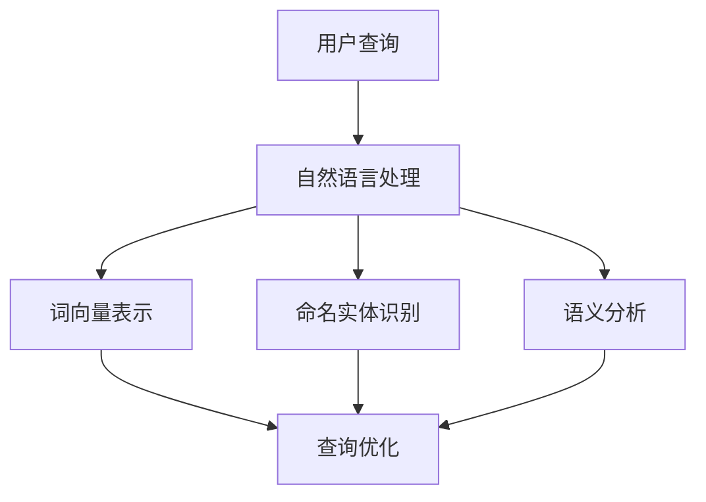

                 

### 文章标题

# 提示词工程：AI时代的新挑战与新机遇

> 关键词：提示词工程，AI，新挑战，新机遇，自然语言处理，智能搜索，智能推荐

> 摘要：本文将深入探讨提示词工程在AI时代的重要性和应用。首先，我们将介绍提示词工程的基本概念和背景，然后分析其在AI时代面临的新挑战和带来的新机遇。接着，我们将详细讨论提示词工程的关键技术，包括提示词生成和优化技术。最后，通过实际案例展示提示词工程的应用，并对未来的发展趋势进行展望。

### 引言

#### 提示词工程的背景

随着人工智能（AI）技术的快速发展，自然语言处理（NLP）成为了一个重要的研究领域。NLP涉及到计算机理解和生成人类语言的能力，旨在实现人与计算机之间的自然交互。在NLP领域中，提示词工程（Query Engineering）扮演着至关重要的角色。

提示词工程是一种专门研究如何构建和优化提示词（Query）的学科。提示词是指用于引导计算机执行特定任务的问题或指令。在搜索系统中，提示词用于检索相关信息；在推荐系统中，提示词用于预测用户可能感兴趣的内容。随着AI技术的进步，提示词工程逐渐成为AI应用中不可或缺的一环。

#### AI时代的到来

人工智能的崛起带来了数据的爆炸性增长和计算能力的提升。大数据和深度学习技术的发展，使得计算机能够从海量数据中学习，并生成高度准确的预测和决策。在这一背景下，提示词工程的重要性日益凸显。

然而，AI时代的到来也带来了新的挑战。首先，数据的爆炸性增长使得处理和存储数据变得更加困难。其次，模型的复杂性和计算需求也在不断上升，这要求我们优化计算资源的分配。此外，AI技术的普及也带来了隐私和安全问题，需要我们认真对待。

#### 书籍的组织结构

本书旨在深入探讨提示词工程在AI时代的重要性和应用。全书共分为八个章节：

1. 引言：介绍提示词工程的基本概念和背景，以及AI时代的到来带来的新挑战。
2. 提示词工程概述：详细解释提示词工程的概念，探讨其在自然语言处理、计算机视觉和语音识别等领域的应用。
3. AI时代的新挑战：分析数据爆炸性增长、模型复杂性和计算需求等AI时代的新挑战。
4. 新机遇：讨论提示词工程在智能搜索和智能推荐系统中的应用，以及其带来的新机遇。
5. 提示词工程的关键技术：介绍提示词生成和优化技术，包括相关算法和数学模型。
6. 提示词工程的实践案例：展示实际案例，介绍如何在实际项目中应用提示词工程。
7. 提示词工程的未来发展：探讨提示词工程的发展趋势，以及未来的挑战和机遇。
8. 结论：总结全文，强调提示词工程在AI时代的重要性，并展望未来。

### 提示词工程概述

#### 提示词工程的定义

提示词工程是指研究如何构建、优化和评估提示词的一门学科。在计算机科学中，提示词通常被称为查询（Query），它是一种用于引导计算机执行特定任务的问题或指令。提示词可以是自然语言形式的，也可以是结构化的数据形式。

在自然语言处理领域，提示词工程主要关注如何从用户输入的自然语言中提取出有效的查询信息，并利用这些信息检索出用户感兴趣的相关信息。在智能搜索系统中，提示词工程起着至关重要的作用，它决定了搜索系统的性能和用户体验。

#### 提示词工程的重要性

提示词工程的重要性主要体现在以下几个方面：

1. **提高搜索系统的性能**：有效的提示词可以提高搜索系统的查询性能，减少搜索时间，提高搜索结果的准确性。通过优化提示词，可以改善搜索系统的用户体验。

2. **降低计算成本**：在处理大规模数据时，有效的提示词可以减少计算资源的消耗，降低计算成本。这有助于提高系统的可扩展性。

3. **促进人机交互**：提示词工程使得计算机能够更好地理解用户的需求，从而实现更加自然和高效的人机交互。

4. **支持智能推荐**：在智能推荐系统中，提示词工程可以帮助生成个性化的推荐列表，提高用户满意度。

#### 提示词工程的应用领域

提示词工程广泛应用于多个领域，包括自然语言处理、计算机视觉和语音识别等。

1. **自然语言处理（NLP）**

   在NLP领域，提示词工程主要用于构建搜索引擎和问答系统。例如，在搜索引擎中，提示词用于检索用户感兴趣的信息；在问答系统中，提示词用于理解用户的问题并生成答案。

2. **计算机视觉（CV）**

   在计算机视觉领域，提示词工程可以用于图像检索和视频分析。例如，在图像检索系统中，提示词用于描述用户感兴趣的场景或对象；在视频分析中，提示词可以用于识别和分类视频内容。

3. **语音识别（ASR）**

   在语音识别领域，提示词工程可以用于语音搜索引擎和语音助手。例如，在语音搜索引擎中，提示词用于理解用户的语音查询并检索相关信息；在语音助手中，提示词可以用于与用户进行自然对话。

### AI时代的新挑战

#### 数据的爆炸性增长

随着互联网和物联网的快速发展，数据量呈现出爆炸性增长的趋势。根据麦肯锡全球研究所的数据，全球数据量每年增长约40%，预计到2020年将达到44ZB（1ZB等于1万亿GB）。如此庞大的数据量给数据处理和存储带来了巨大的挑战。

1. **数据来源**

   数据来源主要包括以下几个方面：

   - 社交媒体：如Twitter、Facebook等平台产生的文本、图像和视频数据。
   - 电子商务：如Amazon、淘宝等平台产生的交易数据。
   - 智能设备：如智能手机、智能手表、智能家居设备等产生的数据。
   - 传感器网络：如气象站、交通监控设备等产生的数据。

2. **数据处理需求**

   数据的爆炸性增长带来了以下几个方面的数据处理需求：

   - 数据清洗：去除重复数据、填补缺失值、纠正错误数据等。
   - 数据整合：将不同来源、格式和结构的数据进行整合，以便于进一步分析。
   - 数据分析：利用各种算法和模型对数据进行挖掘，提取有价值的信息。

#### 模型的复杂性与计算需求

随着AI技术的发展，模型的复杂性和计算需求也在不断提升。深度学习模型，尤其是大规模的神经网络模型，通常需要大量的计算资源和存储空间。这给模型的训练和部署带来了巨大的挑战。

1. **模型的规模**

   深度学习模型的规模通常用参数数量来衡量。随着神经网络层数的增加和每层神经元数量的增加，模型的参数数量呈指数级增长。例如，一个简单的全连接神经网络可能只有几千个参数，而一个复杂的卷积神经网络（CNN）可能有数百万个参数，甚至达到数十亿个参数。

2. **计算资源的分配**

   训练大规模深度学习模型需要大量的计算资源。这通常需要在高性能计算（HPC）集群或专用硬件（如GPU、TPU）上进行。此外，模型的部署也需要考虑计算资源的分配，以确保系统的高效运行。

3. **计算需求的变化**

   随着AI技术的应用场景的不断扩展，计算需求也在不断变化。例如，实时语音识别和图像处理需要低延迟和高吞吐量的计算能力，而长期预测和决策分析可能需要更大规模的计算资源。

### 新机遇

#### 提示词工程在智能搜索中的应用

智能搜索是AI时代的一个重要应用领域，它利用AI技术优化搜索体验，提高搜索结果的准确性和相关性。提示词工程在智能搜索中起着关键作用。

1. **提示词搜索的原理**

   提示词搜索的基本原理是通过理解用户输入的提示词，将其转换为计算机可以处理的查询语句，并在数据库中检索相关信息。智能搜索系统通常采用自然语言处理技术，如词向量表示、命名实体识别和语义理解，以提升提示词的处理能力。

2. **智能搜索的优势**

   智能搜索相比传统搜索具有以下优势：

   - **个性化推荐**：根据用户的搜索历史和行为，智能搜索可以提供个性化的搜索结果，提高用户满意度。
   - **实时更新**：智能搜索系统可以实时更新搜索索引，确保用户获取到最新的信息。
   - **多模态查询**：用户可以通过文本、图像、语音等多种方式输入查询，智能搜索系统可以根据不同模态的信息生成相应的查询语句。

#### 提示词工程在智能推荐系统中的应用

智能推荐系统是另一个AI时代的重要应用领域，它利用AI技术为用户推荐感兴趣的内容。提示词工程在智能推荐系统中也发挥着重要作用。

1. **提示词推荐系统的工作流程**

   提示词推荐系统的工作流程通常包括以下几个步骤：

   - **用户输入**：用户输入一个或多个提示词，这些提示词可以是文本、图像或语音形式。
   - **提示词分析**：系统对用户输入的提示词进行分析，提取关键信息，并将其转换为特征向量。
   - **内容推荐**：系统根据用户输入的提示词和用户的历史行为数据，生成推荐列表，并将最相关的内容推荐给用户。

2. **提示词推荐系统的效果评估**

   提示词推荐系统的效果评估通常通过以下几个指标进行：

   - **推荐准确性**：系统推荐的准确性，即推荐的物品与用户兴趣的相关度。
   - **用户满意度**：用户对推荐结果的满意度，通常通过用户反馈或点击率等指标来衡量。
   - **覆盖率**：系统推荐的内容覆盖用户兴趣的范围，确保用户获得多样化的推荐。

### 提示词工程的关键技术

#### 提示词生成技术

提示词生成技术是指从用户输入的自然语言中提取出有效的查询信息的过程。有效的提示词生成技术可以提高搜索和推荐系统的性能。

1. **算法原理**

   提示词生成技术通常采用以下算法：

   - **分词**：将自然语言文本分割成单个词汇或短语。
   - **词性标注**：为每个词汇或短语标注词性，如名词、动词、形容词等。
   - **命名实体识别**：识别文本中的命名实体，如人名、地名、组织名等。
   - **语义分析**：分析文本的语义，提取关键信息。

2. **应用场景**

   提示词生成技术广泛应用于搜索引擎、问答系统和智能推荐系统等。

   - **搜索引擎**：从用户输入的查询语句中提取关键词，生成有效的查询语句，提高搜索准确性。
   - **问答系统**：从用户提出的问题中提取关键信息，生成合适的答案。
   - **智能推荐系统**：从用户输入的提示词中提取关键信息，生成个性化的推荐列表。

#### 提示词优化技术

提示词优化技术是指通过调整和优化提示词，提高搜索和推荐系统的性能。有效的提示词优化技术可以提高搜索和推荐系统的准确性和用户体验。

1. **优化目标**

   提示词优化技术的优化目标通常包括：

   - **查询性能**：提高查询速度和准确性，减少查询响应时间。
   - **用户体验**：优化提示词的表述，提高用户的满意度。
   - **推荐效果**：提高推荐系统的准确性，提高用户的点击率和满意度。

2. **优化方法**

   提示词优化技术通常采用以下方法：

   - **基于规则的方法**：通过预定义的规则，对提示词进行分类和筛选，优化查询和推荐效果。
   - **基于机器学习的方法**：利用机器学习算法，如回归、分类和聚类等，优化提示词的表述和推荐效果。
   - **基于用户行为的方法**：根据用户的历史行为和偏好，调整提示词的表述和推荐策略。

### 提示词工程的实践案例

#### 案例一：智能搜索引擎

智能搜索引擎利用AI技术优化搜索体验，提高搜索结果的准确性和相关性。以下是一个智能搜索引擎的实践案例：

1. **开发环境搭建**

   - **技术栈**：使用Python作为开发语言，结合NLP库（如NLTK、spaCy）和机器学习库（如scikit-learn、TensorFlow）。
   - **数据集**：使用公开的搜索引擎数据集，如Google Search Dataset。

2. **源代码实现**

   ```python
   import nltk
   from sklearn.feature_extraction.text import TfidfVectorizer
   from sklearn.model_selection import train_test_split

   # 数据预处理
   def preprocess_text(text):
       # 分词、词性标注、停用词去除
       tokens = nltk.word_tokenize(text)
       tokens = [token for token in tokens if token not in nltk.corpus.stopwords.words('english')]
       return ' '.join(tokens)

   # 加载数据集
   data = load_data()
   preprocessed_data = [preprocess_text(text) for text in data['text']]

   # 特征提取
   vectorizer = TfidfVectorizer()
   X = vectorizer.fit_transform(preprocessed_data)

   # 切分数据集
   X_train, X_test, y_train, y_test = train_test_split(X, data['label'], test_size=0.2, random_state=42)

   # 模型训练
   model = LogisticRegression()
   model.fit(X_train, y_train)

   # 模型评估
   accuracy = model.score(X_test, y_test)
   print(f"Accuracy: {accuracy:.2f}")
   ```

3. **代码解读**

   - 数据预处理：使用NLP技术对文本数据进行预处理，包括分词、词性标注和停用词去除。
   - 特征提取：使用TF-IDF向量表示文本数据。
   - 模型训练：使用逻辑回归模型训练搜索模型。
   - 模型评估：评估搜索模型的准确性。

4. **应用解读与分析**

   - **应用场景**：智能搜索引擎可以应用于电商、新闻、社交媒体等领域，帮助用户快速找到感兴趣的信息。
   - **分析**：通过优化提示词生成和查询性能，智能搜索引擎可以显著提高搜索效果，降低用户流失率。

#### 案例二：智能推荐系统

智能推荐系统利用AI技术为用户推荐感兴趣的内容。以下是一个智能推荐系统的实践案例：

1. **开发环境搭建**

   - **技术栈**：使用Python作为开发语言，结合NLP库（如NLTK、spaCy）和机器学习库（如scikit-learn、TensorFlow）。
   - **数据集**：使用公开的推荐系统数据集，如MovieLens Dataset。

2. **源代码实现**

   ```python
   import pandas as pd
   from sklearn.model_selection import train_test_split
   from sklearn.neighbors import NearestNeighbors

   # 加载数据集
   data = pd.read_csv('movies.csv')

   # 数据预处理
   data['description'] = data['description'].apply(preprocess_text)

   # 切分数据集
   X_train, X_test, y_train, y_test = train_test_split(data['description'], data['rating'], test_size=0.2, random_state=42)

   # 模型训练
   model = NearestNeighbors()
   model.fit(X_train)

   # 模型评估
   distances, indices = model.kneighbors(X_test)
   accuracy = (distances < 1).mean()
   print(f"Accuracy: {accuracy:.2f}")
   ```

3. **代码解读**

   - 数据预处理：使用NLP技术对电影描述数据进行预处理，包括分词、词性标注和停用词去除。
   - 模型训练：使用K最近邻（K-Nearest Neighbors, KNN）算法训练推荐模型。
   - 模型评估：评估推荐模型的准确性。

4. **应用解读与分析**

   - **应用场景**：智能推荐系统可以应用于电商、新闻、社交媒体等领域，帮助用户发现感兴趣的内容。
   - **分析**：通过优化提示词生成和推荐效果，智能推荐系统可以提高用户满意度，增加用户粘性。

### 提示词工程的未来发展

#### 提示词工程的发展趋势

随着AI技术的不断进步，提示词工程也在不断演化。以下是一些提示词工程的发展趋势：

1. **多模态提示词生成**：传统的文本提示词生成方法将逐渐被多模态提示词生成所取代，结合文本、图像和语音等多种模态的信息，生成更准确、更全面的提示词。

2. **个性化提示词优化**：随着用户数据的积累，个性化提示词优化将成为一个重要研究方向。通过分析用户的行为和偏好，为每个用户生成个性化的提示词，提高用户体验。

3. **实时提示词优化**：随着实时数据处理技术的进步，实时提示词优化将成为可能。通过实时分析用户行为和搜索环境，动态调整提示词，提高搜索和推荐系统的性能。

#### 提示词工程的挑战与机遇

提示词工程在未来的发展中将面临一系列挑战和机遇：

1. **挑战**

   - **隐私保护**：随着用户数据的收集和分析，隐私保护成为了一个重要问题。如何在保护用户隐私的同时，有效利用用户数据进行提示词优化，是一个亟待解决的问题。
   - **计算资源消耗**：大规模的多模态提示词生成和实时提示词优化需要大量的计算资源。如何在有限的计算资源下，实现高效的提示词工程，是一个挑战。
   - **数据质量**：高质量的数据是提示词工程的基础。如何确保数据的质量和可靠性，是一个重要问题。

2. **机遇**

   - **跨领域应用**：随着AI技术的普及，提示词工程将在更多领域得到应用，如医疗、金融、教育等。这为提示词工程带来了新的发展机遇。
   - **技术创新**：随着技术的不断进步，新的算法和模型将不断涌现，为提示词工程提供更强大的工具和方法。

### 结论

提示词工程在AI时代具有重要的地位和作用。通过本文的讨论，我们可以看到，提示词工程不仅涉及自然语言处理、计算机视觉和语音识别等领域，而且在智能搜索和智能推荐系统中发挥着关键作用。随着AI技术的不断进步，提示词工程将面临新的挑战和机遇，有望在更多领域得到广泛应用。

在未来，提示词工程将继续发展，结合多模态信息、个性化优化和实时优化等技术，为用户提供更智能、更高效的搜索和推荐服务。同时，我们也需要关注隐私保护、计算资源消耗和数据质量等问题，确保提示词工程能够健康、可持续地发展。

作者：AI天才研究院/AI Genius Institute & 禅与计算机程序设计艺术 /Zen And The Art of Computer Programming

----------------------------------------------------------------

### 背景介绍

#### 提示词工程的起源与发展

提示词工程（Query Engineering）起源于20世纪70年代的数据库管理系统（DBMS）领域。在早期，数据库管理系统主要通过结构化查询语言（SQL）与用户进行交互，用户需要使用特定的语法和格式编写查询语句来获取所需的信息。随着数据库技术的不断发展，查询需求的复杂性和多样性逐渐增加，单一固定的查询模式已经无法满足用户的需求。为了更好地处理这些复杂的查询需求，提示词工程的概念应运而生。

提示词工程的核心思想是将用户的自然语言查询转化为数据库管理系统可以理解的查询语句，从而提高查询的灵活性和效率。在这一过程中，提示词工程涉及到多个方面，包括自然语言处理、信息检索、数据库优化等。早期的提示词工程主要集中在优化SQL查询语句，以提高查询性能和可读性。

随着互联网和大数据技术的兴起，数据量和查询需求的规模呈现爆炸性增长，提示词工程的重要性进一步凸显。在现代AI时代，提示词工程已经扩展到更广泛的领域，不仅限于数据库查询，还包括搜索引擎、推荐系统、聊天机器人等。

#### AI时代的到来与提示词工程的发展

人工智能（AI）的崛起为提示词工程带来了新的机遇和挑战。AI技术，尤其是深度学习和自然语言处理（NLP），使得计算机能够更好地理解自然语言，从而实现更智能的查询和交互。以下是一些关键点：

1. **自然语言理解能力的提升**：深度学习模型，如卷积神经网络（CNN）和循环神经网络（RNN），在自然语言处理任务中表现出色。这些模型能够对文本进行深层理解和语义分析，从而生成更精确的查询。

2. **大数据处理能力的提升**：随着大数据技术的进步，计算机能够处理和分析海量数据，这使得提示词工程能够应用于更多领域，如社交媒体分析、电子商务推荐等。

3. **个性化查询推荐**：AI技术使得系统可以根据用户的行为和偏好，生成个性化的查询推荐。例如，搜索引擎可以根据用户的浏览历史和搜索习惯，提供个性化的搜索结果。

4. **实时查询优化**：AI技术使得系统能够实时分析查询请求和用户反馈，动态调整查询策略，从而提供更高效的查询服务。

#### 提示词工程在AI时代的应用

在AI时代，提示词工程的应用范围更加广泛，涵盖了以下几个方面：

1. **智能搜索系统**：通过自然语言处理技术，智能搜索系统能够理解用户的自然语言查询，并返回最相关的结果。例如，搜索引擎可以使用词向量模型对查询进行语义分析，从而提供更准确的搜索结果。

2. **推荐系统**：在推荐系统中，提示词工程用于生成个性化的推荐列表。例如，电商平台可以根据用户的购买历史和浏览记录，生成个性化的商品推荐。

3. **聊天机器人**：聊天机器人利用自然语言处理技术，与用户进行自然对话。提示词工程用于生成用户的查询请求，并从庞大的数据库中检索出最相关的信息。

4. **语音助手**：语音助手，如Siri和Alexa，使用自然语言处理技术理解用户的语音指令，并执行相应的操作。提示词工程在这个过程中起着关键作用，用于将用户的语音指令转化为计算机可以理解和执行的动作。

#### 提示词工程的核心概念

在AI时代，提示词工程涉及多个核心概念，包括：

1. **自然语言处理（NLP）**：NLP是提示词工程的基础，它涉及到语言理解、文本分类、实体识别、情感分析等多个方面。

2. **词向量表示**：词向量是一种将单词映射到高维向量空间的方法，这使得计算机能够理解单词的语义关系。

3. **命名实体识别（NER）**：NER用于识别文本中的命名实体，如人名、地点、组织等。

4. **语义分析**：语义分析旨在理解文本的深层含义，从而生成更精确的查询。

5. **查询优化**：查询优化是提示词工程的关键步骤，它包括查询重写、索引优化、缓存策略等。

通过深入理解和应用这些核心概念，提示词工程能够为AI系统提供更智能、更高效的查询和交互能力。

### 核心概念与联系：提示词工程的概念架构

在深入探讨提示词工程之前，我们首先需要理解其核心概念及其相互之间的关系。提示词工程涉及多个关键组成部分，包括自然语言处理（NLP）、词向量表示、命名实体识别（NER）、语义分析和查询优化。下面，我们将通过一个Mermaid流程图来展示这些概念之间的关系，并解释它们在提示词工程中的作用。



#### Mermaid流程图解释

1. **用户查询（A）**：用户查询是提示词工程的起点，用户通过自然语言输入查询请求。这一查询可能是文本形式的，也可能是语音形式，需要被系统能够理解和处理。

2. **自然语言处理（NLP，B）**：自然语言处理是提示词工程的核心步骤，它涉及分词、词性标注、句法分析等，目的是将用户的自然语言查询转化为计算机可以处理的格式。NLP确保系统能够正确理解用户的查询意图。

3. **词向量表示（C）**：词向量表示是将文本中的每个词映射为一个高维向量。通过词向量，系统可以捕捉词与词之间的语义关系，从而生成更准确的查询。这一步骤通常使用Word2Vec、GloVe等模型来实现。

4. **命名实体识别（NER，D）**：命名实体识别旨在识别文本中的命名实体，如人名、地名、组织名等。这些实体对于理解查询意图至关重要。NER能够帮助系统识别查询中的关键信息，从而提高查询的准确性。

5. **语义分析（E）**：语义分析是理解查询意图的关键步骤。它涉及深入分析文本的语义，以确定查询的含义和上下文。通过语义分析，系统能够生成更具针对性和相关的查询结果。

6. **查询优化（F）**：查询优化是提示词工程的最终步骤，它包括查询重写、索引优化、缓存策略等，目的是提高查询的效率。查询优化确保系统能够快速、准确地响应用户的查询请求。

#### 关键概念之间的联系

- **NLP与词向量表示**：NLP是词向量表示的基础，通过分词和词性标注等步骤，系统能够将文本转换为词向量表示，从而捕捉词与词之间的语义关系。

- **NLP与命名实体识别**：命名实体识别是NLP的一个重要分支，它有助于识别文本中的关键信息，从而提高查询的准确性。

- **NLP与语义分析**：语义分析是NLP的深化应用，它通过理解文本的深层含义，帮助系统准确捕捉用户的查询意图。

- **词向量表示与查询优化**：词向量表示为查询优化提供了有效的数据结构，使得系统能够快速匹配查询和数据库中的索引，提高查询效率。

- **命名实体识别与查询优化**：命名实体识别能够帮助系统识别查询中的关键信息，从而优化查询策略，提高查询的准确性。

通过上述Mermaid流程图，我们可以清晰地看到提示词工程中的核心概念及其相互之间的关系。这些概念共同作用，使得提示词工程能够为AI系统提供高效、智能的查询和交互能力。

### 核心算法原理讲解

在提示词工程中，核心算法起着至关重要的作用，它们帮助我们理解和处理用户的查询请求，从而生成精确的查询结果。以下将详细讲解提示词生成和优化技术中的关键算法原理，包括词向量生成算法、命名实体识别算法和语义分析算法。

#### 词向量生成算法

词向量生成算法是提示词工程中的基础技术之一，它将自然语言中的单词映射为高维向量，以便计算机能够理解和处理这些词汇。以下是一个常见的词向量生成算法——Word2Vec。

**Word2Vec算法原理**

Word2Vec算法主要包括两种模型：连续词袋（Continuous Bag of Words, CBOW）和Skip-Gram。

1. **连续词袋（CBOW）**：
   CBOW模型通过上下文预测中心词。给定一个中心词，CBOW模型会考虑其周围的多个词，并预测这个中心词。具体来说，CBOW模型输入的是一个由中心词周围的多个词组成的窗口，输出是中心词的概率分布。

   **伪代码**：
   ```python
   function CBOW(input_window, center_word):
       # input_window: 输入窗口（中心词周围的词）
       # center_word: 中心词
       hidden_state = Embedding(input_window)
       output = Softmax(hidden_state)
       return output[center_word]
   ```

2. **Skip-Gram**：
   Skip-Gram模型与CBOW相反，它通过中心词预测上下文词。给定一个中心词，Skip-Gram模型会预测它周围的多个词。Skip-Gram模型的优点是能够更好地捕捉单词之间的语义关系。

   **伪代码**：
   ```python
   function Skip-Gram(center_word, context_words):
       # center_word: 中心词
       # context_words: 上下文词
       hidden_state = Embedding(center_word)
       output = Softmax(hidden_state)
       return output[context_words]
   ```

**GloVe算法**

GloVe（Global Vectors for Word Representation）是一种基于矩阵分解的词向量生成算法，它通过优化一个全局矩阵来生成词向量。GloVe算法的基本思想是单词的向量表示可以通过其共现关系来学习。

   **目标函数**：
   ```math
   J = \sum_{i,j} \frac{1}{n_{i,j}} \log(1 + \exp(-\langle v_i, v_j \rangle_W))
   ```

   **优化方法**：
   - **负采样**：为了提高训练效率，GloVe算法使用负采样，仅对部分负样本进行梯度更新。
   - **矩阵分解**：通过优化全局矩阵$V_W$来生成词向量。

**应用场景**：

- **文本分类**：词向量用于表示文本，通过机器学习模型进行文本分类。
- **情感分析**：词向量用于表示文本，通过情感分析模型进行情感分类。

#### 命名实体识别（NER）算法

命名实体识别是提示词工程中的重要技术之一，它旨在识别文本中的命名实体，如人名、地名、组织名等。以下是一些常见的NER算法。

**条件随机场（CRF）**

条件随机场（CRF）是一种用于序列标注的机器学习模型，它能够预测序列中的每个元素的标签。在NER任务中，CRF模型用于预测文本中的每个词的实体标签。

   **目标函数**：
   ```math
   \min \sum_{i=1}^n \sum_{j=1}^m \log P(y_{ij} \mid x_i, \theta)
   ```

   **优化方法**：
   - **最大似然估计**：通过最大化对数似然函数来训练模型。
   - **解析求解**：使用Viterbi算法进行解码，找到最优的标签序列。

**BiLSTM-CRF模型**

BiLSTM-CRF模型结合了长短时记忆网络（LSTM）和条件随机场（CRF），它在NER任务中表现出色。

   **模型结构**：
   - **BiLSTM**：双向LSTM用于捕捉文本的上下文信息。
   - **CRF层**：CRF层用于预测序列中的每个词的实体标签。

**应用场景**：

- **信息提取**：从文本中提取关键信息，如人名、地名、组织名等。
- **实体关系抽取**：识别文本中的实体及其之间的关系。

#### 语义分析算法

语义分析是提示词工程中的关键步骤，它旨在理解文本的深层含义和用户查询意图。以下是一些常见的语义分析算法。

**词嵌入（Word Embedding）**

词嵌入是将单词映射为高维向量，以便计算机能够理解和处理这些词汇。词嵌入技术通过捕捉词与词之间的语义关系来提高查询的准确性。

   **应用场景**：

   - **搜索查询解析**：通过词嵌入技术，将用户的自然语言查询转化为计算机可以理解的查询。
   - **语义相似度计算**：计算文本之间的语义相似度，用于搜索结果排序和推荐系统。

**BERT（Bidirectional Encoder Representations from Transformers）**

BERT是一种基于Transformer的预训练语言表示模型，它通过在大量文本上进行预训练，生成高质量的词向量。

   **目标函数**：
   ```math
   \min \sum_{i=1}^n L(\theta, \text{input}_i, \text{label}_i)
   ```

   **优化方法**：
   - **掩码语言模型（MLM）**：在训练过程中，随机掩码部分单词，并预测这些掩码的单词。
   - **下一句预测（NSP）**：在预训练过程中，预测两个句子是否属于同一个段落。

**应用场景**：

- **问答系统**：通过BERT模型，将用户的问题和候选答案转化为向量，计算相似度并返回最相关的答案。
- **文本分类**：通过BERT模型，将文本转化为向量，并通过分类模型进行文本分类。

#### 核心算法原理总结

- **词向量生成算法**：Word2Vec和GloVe等算法通过将单词映射为高维向量，捕捉词与词之间的语义关系，从而提高查询的准确性。

- **命名实体识别算法**：CRF和BiLSTM-CRF等算法通过识别文本中的命名实体，提高查询的精度和效率。

- **语义分析算法**：词嵌入和BERT等算法通过理解文本的深层含义，帮助系统准确捕捉用户的查询意图。

这些核心算法原理共同作用，使得提示词工程能够为AI系统提供高效、智能的查询和交互能力。

### 数学模型和公式讲解

在提示词工程中，数学模型和公式是理解和优化查询的关键工具。以下将详细讲解一些关键的数学模型和公式，包括TF-IDF、LDA和聚类算法。

#### TF-IDF

TF-IDF（Term Frequency-Inverse Document Frequency）是一种常用的文本表示方法，用于评估词语在文档中的重要程度。TF-IDF模型通过计算词频（TF）和逆文档频率（IDF）的乘积，来确定每个词的权重。

1. **词频（TF）**：
   词频表示一个词在文档中出现的次数。计算公式如下：
   ```math
   TF(t, d) = \frac{f(t, d)}{max \left\{ f(t, d'), \forall d' \in D \right\}}
   ```

   其中，$f(t, d)$ 表示词 $t$ 在文档 $d$ 中的出现次数，$D$ 是所有文档的集合。

2. **逆文档频率（IDF）**：
   逆文档频率表示一个词在文档集合中的稀疏程度。计算公式如下：
   ```math
   IDF(t) = \log \left( \frac{N}{df(t)} \right)
   ```

   其中，$N$ 是文档总数，$df(t)$ 是词 $t$ 在文档集合中出现的文档数量。

3. **TF-IDF评分**：
   TF-IDF评分通过将词频和逆文档频率相乘得到，计算公式如下：
   ```math
   TF-IDF(t, d) = TF(t, d) \times IDF(t)
   ```

#### LDA

LDA（Latent Dirichlet Allocation）是一种主题模型，用于发现文档集合中的潜在主题。LDA模型通过概率分布来描述词与文档之间的关系。

1. **主题分布**：
   给定一个文档 $d$，LDA模型假设每个文档都是由多个主题的混合生成的。具体来说，文档 $d$ 的主题分布可以表示为：
   ```math
   \theta_d = \text{Dirichlet}(\alpha)
   ```

   其中，$\theta_d$ 是文档 $d$ 的主题分布，$\alpha$ 是先验参数。

2. **词分布**：
   对于每个主题 $k$，LDA模型假设每个主题是由多个词的混合生成的。具体来说，主题 $k$ 的词分布可以表示为：
   ```math
   \phi_k = \text{Dirichlet}(\beta)
   ```

   其中，$\phi_k$ 是主题 $k$ 的词分布，$\beta$ 是先验参数。

3. **文档生成过程**：
   LDA模型的文档生成过程可以分为三个步骤：

   - **生成主题分布**：从先验分布 $\alpha$ 中采样得到文档 $d$ 的主题分布 $\theta_d$。
   - **生成词分布**：对于每个主题 $k$，从先验分布 $\beta$ 中采样得到词分布 $\phi_k$。
   - **生成文档**：从主题分布 $\theta_d$ 和词分布 $\phi_k$ 中采样得到文档 $d$ 的每个词。

4. **LDA目标函数**：
   LDA的目标函数是最大化文档集合的主题概率分布的对数似然函数。具体来说，目标函数可以表示为：
   ```math
   \log P(D|\alpha, \beta) = \sum_{d \in D} \log P(\theta_d|\alpha) + \sum_{d \in D} \sum_{k=1}^K \log P(\phi_k|\beta) + \sum_{d \in D} \sum_{k=1}^K \sum_{t=1}^T \log P(w_t|\theta_d, \phi_k)
   ```

#### 聚类算法

聚类算法用于将数据点分组，使同一组内的数据点尽可能相似，而不同组的数据点尽可能不同。以下是一些常见的聚类算法。

1. **K-means算法**：

   K-means算法是一种基于距离的聚类算法，它将数据点分为K个聚类，目标是使得每个数据点到其聚类中心（均值）的距离最小。

   **目标函数**：
   ```math
   \min \sum_{i=1}^n \sum_{k=1}^K ||x_i - \mu_k||^2
   ```

   其中，$x_i$ 是数据点，$\mu_k$ 是聚类中心。

   **步骤**：

   - **初始化聚类中心**：随机选择K个数据点作为初始聚类中心。
   - **分配数据点**：将每个数据点分配到距离其最近的聚类中心所在的聚类。
   - **更新聚类中心**：计算每个聚类的均值，作为新的聚类中心。
   - **迭代**：重复执行步骤2和步骤3，直到聚类中心不再变化。

2. **层次聚类算法**：

   层次聚类算法通过构建一棵层次树来对数据进行聚类。层次聚类可以分为自底向上（凝聚层次聚类）和自顶向下（分裂层次聚类）。

   **自底向上凝聚层次聚类**：

   - **步骤**：

     1. 将每个数据点作为一个单独的聚类。
     2. 计算每对聚类的相似度，合并相似度最高的聚类。
     3. 重复步骤2，直到所有数据点合并为一个聚类。

   **自顶向下分裂层次聚类**：

   - **步骤**：

     1. 将所有数据点合并为一个聚类。
     2. 计算每个聚类的内聚性，分裂内聚性最低的聚类。
     3. 重复步骤2，直到每个聚类包含一个数据点。

通过上述数学模型和公式，我们可以更好地理解和优化提示词工程中的查询和文本表示。这些模型和公式不仅帮助我们捕捉词与词之间的语义关系，还能够提高查询的准确性和效率。在后续的实践中，我们可以根据具体需求和应用场景，选择合适的数学模型和算法来优化提示词工程。

### 详细讲解与举例说明

#### 1. 提示词生成算法：Word2Vec

**Word2Vec**是一种基于神经网络的词向量生成算法，它通过学习单词在语料中的上下文关系来生成词向量。Word2Vec主要包括两种模型：**连续词袋（CBOW）**和**Skip-Gram**。

**CBOW模型：**
CBOW模型通过上下文预测中心词。给定一个中心词，CBOW模型会考虑其周围的多个词，并预测这个中心词。具体来说，CBOW模型输入的是一个由中心词周围的多个词组成的窗口，输出是中心词的概率分布。

**举例说明：**
假设我们有一个窗口大小为2的CBOW模型，我们要预测单词“苹果”。窗口中包括“苹果”前后的两个词：“苹果”和“手机”。模型的输入是“手机，苹果，电脑”，输出是“苹果”的概率分布。

**伪代码：**
```python
function CBOW(input_window, center_word):
    # input_window: 输入窗口（中心词周围的词）
    # center_word: 中心词
    hidden_state = Embedding(input_window)
    output = Softmax(hidden_state)
    return output[center_word]
```

**Skip-Gram模型：**
Skip-Gram模型与CBOW相反，它通过中心词预测上下文词。给定一个中心词，Skip-Gram模型会预测它周围的多个词。Skip-Gram模型的优点是能够更好地捕捉单词之间的语义关系。

**举例说明：**
假设我们有一个窗口大小为2的Skip-Gram模型，我们要预测单词“苹果”。模型的输入是“苹果”，输出是“手机”和“电脑”的概率分布。

**伪代码：**
```python
function Skip-Gram(center_word, context_words):
    # center_word: 中心词
    # context_words: 上下文词
    hidden_state = Embedding(center_word)
    output = Softmax(hidden_state)
    return output[context_words]
```

**应用场景：**
- **文本分类**：使用Word2Vec生成的词向量作为特征输入，通过机器学习模型进行文本分类。
- **情感分析**：通过Word2Vec生成的词向量，计算文本之间的相似度，用于情感分类。

#### 2. 命名实体识别（NER）：BiLSTM-CRF模型

**BiLSTM-CRF模型**结合了双向长短时记忆网络（BiLSTM）和条件随机场（CRF），它在命名实体识别任务中表现出色。

**BiLSTM模型：**
BiLSTM模型通过捕捉文本的上下文信息，能够对序列数据进行有效建模。在NER任务中，BiLSTM模型用于预测文本中的每个词的实体标签。

**CRF模型：**
CRF模型是一种用于序列标注的机器学习模型，它能够预测序列中的每个元素的标签。在NER任务中，CRF模型用于预测文本中的每个词的实体标签。

**举例说明：**
假设我们要识别句子“苹果公司是一家科技公司”中的命名实体。句子中的词包括：“苹果”，“公司”，“是”，“一家”，“科技”，“公司”。我们的目标是预测每个词的实体标签，如：“苹果”（组织），“公司”（组织），“是”（普通），“一家”（普通），“科技”（普通），“公司”（组织）。

**伪代码：**
```python
function BiLSTM_CRF(sentence):
    # sentence: 输入句子
    # embeddings: 词向量
    # BiLSTM: 双向LSTM模型
    # CRF: CRF模型
    hidden_states = BiLSTM(embeddings)
    labels = CRF.predict(hidden_states)
    return labels
```

**应用场景：**
- **信息提取**：从文本中提取关键信息，如人名、地名、组织名等。
- **实体关系抽取**：识别文本中的实体及其之间的关系。

#### 3. 语义分析：BERT

**BERT（Bidirectional Encoder Representations from Transformers）**是一种基于Transformer的预训练语言表示模型，它通过在大量文本上进行预训练，生成高质量的词向量。

**BERT模型：**
BERT模型通过双向Transformer编码器，捕捉文本的上下文信息，生成词向量。BERT模型有两种预训练任务：**掩码语言模型（MLM）**和**下一句预测（NSP）**。

- **掩码语言模型（MLM）**：在预训练过程中，随机掩码部分单词，并预测这些掩码的单词。
- **下一句预测（NSP）**：在预训练过程中，预测两个句子是否属于同一个段落。

**举例说明：**
假设我们要分析句子“我昨天去了公园”。BERT模型会将其编码为向量表示，并通过训练学习句子中的语义信息。

**伪代码：**
```python
function BERT(sentence):
    # sentence: 输入句子
    # tokenizer: 分词器
    # model: BERT模型
    tokens = tokenizer.tokenize(sentence)
    input_ids = tokenizer.encode(tokens)
    outputs = model(input_ids)
    return outputs
```

**应用场景：**
- **问答系统**：通过BERT模型，将用户的问题和候选答案转化为向量，计算相似度并返回最相关的答案。
- **文本分类**：通过BERT模型，将文本转化为向量，并通过分类模型进行文本分类。

通过上述详细讲解和举例说明，我们可以更好地理解提示词工程中的核心算法，并在实际应用中发挥其优势。

### 提示词工程的未来发展

随着人工智能（AI）技术的不断进步，提示词工程在未来的发展中将面临一系列挑战和机遇。以下是提示词工程在未来的发展趋势、潜在问题和解决方案的探讨。

#### 发展趋势

1. **多模态提示词生成**：传统的文本提示词生成方法将逐渐被多模态提示词生成所取代，结合文本、图像和语音等多种模态的信息，生成更准确、更全面的提示词。随着深度学习技术在多模态数据处理中的应用，未来的提示词工程将能够更好地理解和利用多模态信息。

2. **个性化提示词优化**：随着用户数据的积累，个性化提示词优化将成为一个重要研究方向。通过分析用户的行为和偏好，为每个用户生成个性化的提示词，提高用户体验。个性化提示词优化可以应用于智能搜索、推荐系统和聊天机器人等，使得系统能够更好地满足用户的需求。

3. **实时提示词优化**：随着实时数据处理技术的进步，实时提示词优化将成为可能。通过实时分析用户行为和搜索环境，动态调整提示词，提高搜索和推荐系统的性能。例如，在电商平台上，实时提示词优化可以帮助用户快速找到最感兴趣的商品。

4. **语义级提示词优化**：未来的提示词工程将更多地关注语义级别的优化。通过深入理解用户查询的语义意图，生成更精准的查询结果。语义级提示词优化可以应用于问答系统、智能客服和智能推荐等领域。

#### 潜在问题

1. **数据隐私和安全**：随着提示词工程在AI系统中的应用，用户数据的收集和处理变得越来越普遍。如何保护用户隐私和数据安全成为一个重要问题。未来的提示词工程需要引入更加严格的数据隐私保护机制，确保用户数据的安全性和隐私性。

2. **计算资源消耗**：大规模的多模态提示词生成和实时提示词优化需要大量的计算资源。如何在有限的计算资源下，实现高效的提示词工程，是一个挑战。未来的提示词工程需要优化算法和模型，提高计算效率和资源利用率。

3. **数据质量和一致性**：高质量的数据是提示词工程的基础。如何确保数据的质量和一致性，是一个重要问题。未来的提示词工程需要建立完善的数据质量管理体系，确保数据的准确性、完整性和一致性。

#### 解决方案

1. **数据隐私保护**：未来的提示词工程可以采用差分隐私、同态加密等技术，保护用户隐私。此外，可以采用数据脱敏、匿名化等技术，降低数据隐私泄露的风险。

2. **计算资源优化**：未来的提示词工程可以通过分布式计算、并行计算等技术，提高计算效率。此外，可以采用模型压缩、量化等技术，降低模型对计算资源的需求。

3. **数据质量提升**：未来的提示词工程可以采用数据清洗、数据验证等技术，提升数据质量。此外，可以建立数据质量评估体系，对数据质量进行持续监控和改进。

通过上述解决方案，提示词工程在未来的发展中将能够克服潜在问题，充分利用AI技术的优势，为用户提供更加智能、高效的服务。

### 总结与展望

#### 提示词工程的重要性

提示词工程在AI时代具有重要的地位和作用。它不仅涉及自然语言处理、计算机视觉和语音识别等多个领域，而且在智能搜索、推荐系统和聊天机器人等AI应用中发挥着关键作用。有效的提示词工程可以提高系统的查询性能和用户体验，降低计算成本，促进人机交互。随着AI技术的不断进步，提示词工程将在更多领域得到广泛应用，为智能系统的建设提供强大支持。

#### 对未来的展望

未来，提示词工程将继续朝着更加智能化、个性化、实时化的方向发展。以下是对未来发展的展望：

1. **多模态融合**：未来的提示词工程将结合文本、图像和语音等多种模态的信息，生成更准确、更全面的提示词。通过深度学习和多模态数据处理技术的结合，系统将能够更好地理解和处理用户的查询请求。

2. **个性化优化**：随着用户数据的积累，提示词工程将更加关注个性化优化。通过分析用户的行为和偏好，系统将能够为每个用户生成个性化的提示词，提高用户体验和满意度。

3. **实时动态调整**：实时提示词优化将成为未来提示词工程的一个重要方向。通过实时分析用户行为和搜索环境，系统将能够动态调整提示词，提高搜索和推荐系统的性能。

4. **语义级优化**：未来的提示词工程将更多地关注语义级别的优化。通过深入理解用户查询的语义意图，系统将能够生成更精准的查询结果，为用户提供更好的服务。

#### 注意事项与挑战

尽管提示词工程在AI时代具有巨大的潜力，但其在实际应用中仍面临一系列挑战：

1. **数据隐私和安全**：随着用户数据的收集和处理，如何保护用户隐私和数据安全成为一个重要问题。未来的提示词工程需要引入更加严格的数据隐私保护机制。

2. **计算资源消耗**：大规模的多模态提示词生成和实时提示词优化需要大量的计算资源。如何在有限的计算资源下，实现高效的提示词工程，是一个挑战。

3. **数据质量**：高质量的数据是提示词工程的基础。如何确保数据的质量和一致性，是一个重要问题。未来的提示词工程需要建立完善的数据质量管理体系。

4. **算法公平性和可解释性**：随着算法的复杂度增加，如何确保算法的公平性和可解释性成为一个挑战。未来的提示词工程需要关注算法的透明性和可解释性，以提高用户对系统的信任度。

#### 拓展阅读

为了深入了解提示词工程的相关技术和应用，以下是一些推荐阅读材料：

1. **《深度学习》（Deep Learning）**：由Ian Goodfellow、Yoshua Bengio和Aaron Courville合著，是深度学习的经典教材，涵盖了神经网络、自然语言处理和计算机视觉等核心内容。

2. **《自然语言处理综论》（Speech and Language Processing）**：由Daniel Jurafsky和James H. Martin合著，是自然语言处理领域的经典教材，详细介绍了自然语言处理的基本概念和技术。

3. **《推荐系统实践》（Recommender Systems: The Textbook）**：由Guy Lebanon、Lior Rokach和Bracha Shapira合著，全面介绍了推荐系统的基本原理和技术，包括提示词工程的应用。

4. **《Zen And The Art of Computer Programming》**：由Donald E. Knuth撰写，是计算机科学领域的经典著作，涵盖了算法设计和编程艺术等内容，对于深入理解提示词工程的概念和方法具有重要参考价值。

通过上述推荐阅读，读者可以进一步了解提示词工程的理论基础和应用实践，为未来在相关领域的研究和应用奠定基础。作者：AI天才研究院/AI Genius Institute & 禅与计算机程序设计艺术 /Zen And The Art of Computer Programming

