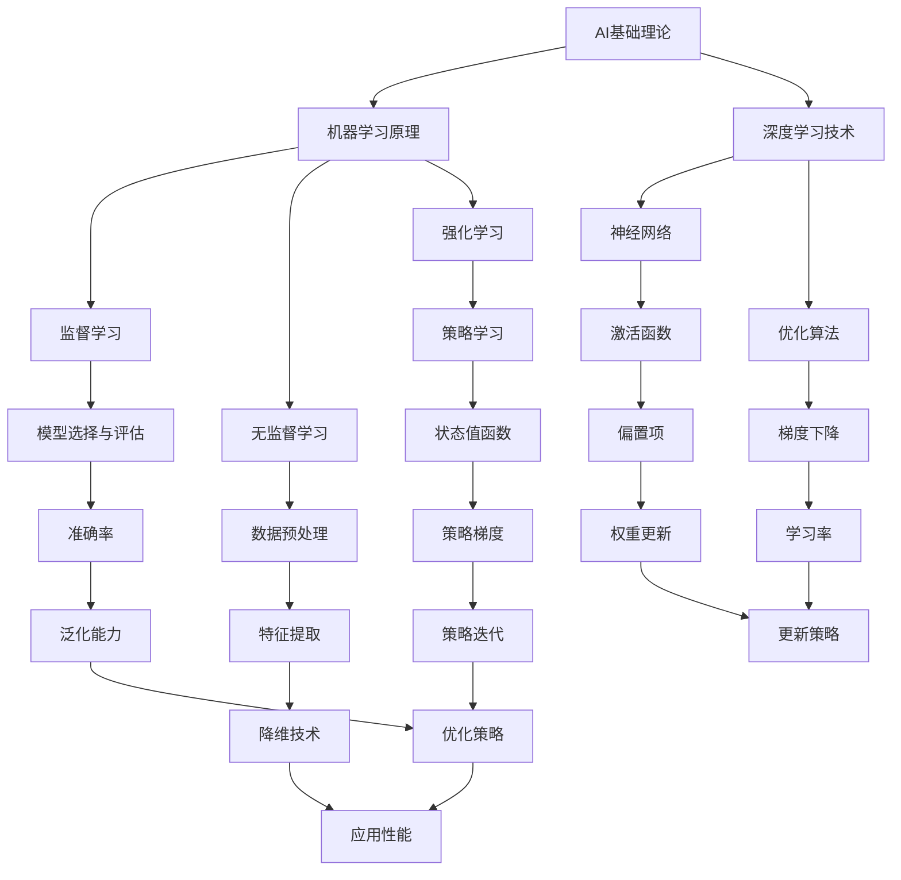
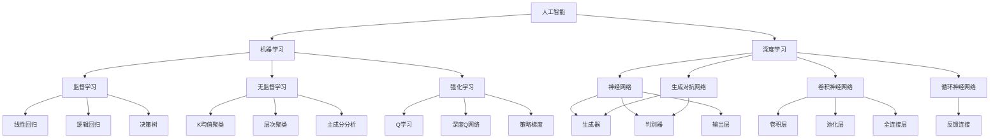

                 


### 第1章 引言与概述

#### 1.1 书籍主题介绍

在人工智能（AI）蓬勃发展的今天，提示词工程作为AI领域的一个重要分支，正逐渐成为AI研究和应用中的新方向。本书旨在探讨提示词工程在AI时代的重要性、应用范围以及未来发展。

提示词工程，顾名思义，是指通过工程化的方法来设计和构建提示词系统。在AI系统中，提示词起着至关重要的作用，它们是用户与系统交互的桥梁，同时也是AI模型理解用户意图的关键。因此，提示词工程不仅涉及到自然语言处理（NLP）的技术，还涵盖了计算机视觉、机器学习等多个领域。

本书的核心内容将围绕以下几个方面展开：

1. **AI基础理论**：介绍AI的基本概念、技术原理和算法，包括机器学习、深度学习等。
2. **提示词工程**：详细介绍提示词工程的概念、应用和实现，包括提示词生成、优化和评估等关键技术。
3. **AI应用实践**：展示AI在不同领域的应用案例，包括开发流程、实现细节和效果评估。

#### 1.2 书籍目标读者与适用范围

本书的目标读者包括：

1. AI研究人员和开发者：希望了解和掌握提示词工程原理和应用的技术人员。
2. 自然语言处理、计算机视觉等领域的研究生和本科生：作为教材或参考书，辅助学习相关课程。
3. 对AI技术感兴趣的专业人士：希望了解AI技术最新发展趋势和应用方向。

本书不仅适合专业技术人员阅读，也适合对AI技术有一定了解的读者。通过本书的学习，读者将能够：

1. 掌握提示词工程的基本原理和关键技术。
2. 了解AI在不同领域的应用案例。
3. 学习如何设计、实现和优化提示词系统。

#### 1.3 提示词工程在AI中的重要性

在AI系统中，提示词不仅是用户与系统交互的桥梁，更是AI模型理解用户意图的关键。具体来说，提示词工程在AI中的重要性体现在以下几个方面：

1. **提升用户体验**：良好的提示词设计可以提升用户与系统的交互体验，使系统能够更准确地理解用户需求。
2. **优化模型性能**：通过优化提示词，可以提升AI模型的性能，使其在特定任务上表现出更好的效果。
3. **拓宽应用范围**：提示词工程不仅应用于自然语言处理，还扩展到了计算机视觉、推荐系统等多个领域，为AI技术的发展提供了新的方向。

总之，提示词工程在AI时代的重要性不言而喻。本书将从基础理论到应用实践，全面解析提示词工程的奥秘，帮助读者深入理解和掌握这一新兴领域。

### Mermaid 流程图：核心概念与联系



### 第2章 AI基础理论

#### 2.1 人工智能基本概念

人工智能（Artificial Intelligence，简称AI）是指通过计算机模拟人类智能的行为和思维过程，实现机器自动化决策和智能行动的技术。AI的研究目标是开发能够执行人类智能任务的系统，如推理、学习、理解自然语言、图像识别、决策制定等。

AI的定义可以从不同角度进行理解：

1. **理论视角**：AI是一门研究如何构建智能系统的科学，涉及计算机科学、认知科学、神经科学等多个学科。
2. **应用视角**：AI是一种技术，应用于各种领域，如自然语言处理、计算机视觉、自动驾驶、医疗诊断等。
3. **哲学视角**：AI探讨机器能否具有类似人类的智能，以及机器智能的本质和局限性。

AI的发展历程可以分为以下几个阶段：

1. **早期探索（1950s-1960s）**：AI概念诞生，研究者尝试通过逻辑推理和符号计算实现智能。
2. **繁荣时期（1970s-1980s）**：AI研究取得重要突破，专家系统等应用广泛。
3. **低谷与复苏（1990s-2000s）**：受限于计算资源和算法性能，AI研究进入低谷，但随着计算能力的提升和机器学习技术的发展，AI迎来了新的复苏。
4. **人工智能新时代（2010s-至今）**：深度学习等技术的突破，AI在各个领域取得了显著应用，如自动驾驶、语音识别、图像识别等。

#### 2.2 机器学习原理

机器学习（Machine Learning，简称ML）是AI的核心技术之一，它通过算法使计算机从数据中学习，并能够对未知数据进行预测或决策。机器学习可以分为监督学习、无监督学习和强化学习三种主要类型。

1. **监督学习（Supervised Learning）**：
   - **定义**：在监督学习中，训练数据集包含了输入和对应的输出，模型通过学习这些输入输出对，来预测新的输入数据。
   - **算法**：线性回归、逻辑回归、决策树、随机森林、支持向量机等。
   - **应用**：分类问题（如垃圾邮件过滤）、回归问题（如房价预测）。

2. **无监督学习（Unsupervised Learning）**：
   - **定义**：无监督学习中，数据集不包含标签，模型需要发现数据中的内在结构或模式。
   - **算法**：聚类算法（如K均值聚类、层次聚类）、降维算法（如主成分分析、t-SNE）、关联规则学习（如Apriori算法）。
   - **应用**：数据探索、异常检测、推荐系统等。

3. **强化学习（Reinforcement Learning）**：
   - **定义**：强化学习是一种通过与环境互动来学习最优策略的机器学习方法。
   - **算法**：Q学习、深度Q网络（DQN）、策略梯度、强化学习框架（如PPO、A3C）。
   - **应用**：游戏AI、自动驾驶、机器人控制等。

机器学习的基本流程包括：

1. **数据收集与预处理**：收集并清洗数据，确保数据的质量和完整性。
2. **特征提取**：从原始数据中提取有助于学习的关键特征。
3. **模型选择**：选择合适的机器学习算法，建立预测模型。
4. **模型训练与验证**：使用训练数据训练模型，并使用验证数据评估模型性能。
5. **模型部署与优化**：将模型部署到实际应用环境中，并根据反馈进行迭代优化。

#### 2.3 深度学习技术

深度学习（Deep Learning，简称DL）是机器学习的一个子领域，它使用多层神经网络来学习数据的复杂特征。深度学习在图像识别、语音识别、自然语言处理等领域取得了显著成果。

1. **神经网络（Neural Network）**：
   - **定义**：神经网络是一种模仿生物神经系统的计算模型，由大量的节点（或称为神经元）组成。
   - **基本结构**：输入层、隐藏层、输出层。
   - **工作原理**：通过前向传播和反向传播进行数据的传递和处理。

2. **深度神经网络（Deep Neural Network）**：
   - **定义**：深度神经网络包含多个隐藏层，能够学习更复杂的特征。
   - **优点**：具有强大的特征学习能力，可以处理高维数据。
   - **缺点**：训练过程复杂，需要大量的数据和计算资源。

3. **卷积神经网络（Convolutional Neural Network，CNN）**：
   - **定义**：卷积神经网络是一种专门用于图像识别和处理的神经网络。
   - **基本结构**：卷积层、池化层、全连接层。
   - **工作原理**：通过卷积操作提取图像的特征，并利用池化层降低数据的维度。

4. **循环神经网络（Recurrent Neural Network，RNN）**：
   - **定义**：循环神经网络是一种能够处理序列数据的神经网络。
   - **基本结构**：包含反馈连接，能够记住前一个时间步的输出。
   - **优点**：适用于语音识别、自然语言处理等序列数据任务。

5. **生成对抗网络（Generative Adversarial Network，GAN）**：
   - **定义**：生成对抗网络由生成器和判别器两个神经网络组成，通过对抗训练生成逼真的数据。
   - **工作原理**：生成器生成数据，判别器判断数据的真实性，通过不断迭代优化，生成器能够生成越来越真实的数据。

深度学习的关键技术包括：

1. **激活函数**：如Sigmoid、ReLU、Tanh等，用于引入非线性变换，使神经网络能够学习更复杂的函数。
2. **优化算法**：如梯度下降、Adam、RMSprop等，用于更新网络权重，优化模型性能。
3. **正则化技术**：如L1正则化、L2正则化、Dropout等，用于防止模型过拟合。

通过深度学习技术，AI系统在图像识别、语音识别、自然语言处理等领域的表现得到了显著提升。未来，深度学习将继续在各个领域发挥重要作用，推动AI技术的发展。

### Mermaid 流程图：AI基础理论架构



### 第3章 提示词工程原理

#### 3.1 提示词工程概述

提示词工程（Prompt Engineering）是人工智能领域中的一项关键技术，旨在设计并构建能够有效引导和优化AI模型输出的人类指令。在自然语言处理（NLP）、计算机视觉（CV）、推荐系统等多个领域，提示词工程发挥着重要作用。

**提示词的定义**：提示词（Prompt）是指人类为AI系统提供的指导信息，以帮助AI更好地理解任务目标、用户需求或数据特征。这些提示词可以是简单的关键词、短语，也可以是复杂的文本指令。

**提示词工程的核心任务**：

1. **任务引导**：明确AI模型需要执行的具体任务，如文本分类、信息检索、图像识别等。
2. **用户意图理解**：从用户的输入中提取意图，确保AI系统能够准确理解并响应。
3. **性能优化**：通过设计合适的提示词，提升AI模型的性能，减少错误率或提高输出质量。
4. **用户体验提升**：优化提示词，提升用户与AI系统的交互体验，使其更加自然和顺畅。

**提示词工程的应用领域**：

1. **自然语言处理**：在文本生成、对话系统、机器翻译等领域，通过提示词引导AI模型生成更符合用户需求的文本。
2. **计算机视觉**：在图像识别、目标检测、图像生成等领域，通过提示词明确目标或指导模型的学习方向。
3. **推荐系统**：在个性化推荐、内容过滤等领域，通过提示词帮助模型更好地理解用户偏好和需求。
4. **智能控制**：在机器人、自动驾驶等领域，通过提示词指导AI模型进行决策和行动。

#### 3.2 提示词生成算法

提示词生成是提示词工程中的一个核心环节，其目的是根据特定任务和用户需求，生成能够有效引导AI模型的提示词。提示词生成算法可以分为以下几种类型：

1. **基于规则的方法**：
   - **定义**：通过预定义的规则和模板生成提示词，这些规则基于领域知识和任务特点。
   - **优点**：生成过程简单，容易实现和调整。
   - **缺点**：灵活性较低，难以应对复杂和多变的任务需求。

2. **基于数据的方法**：
   - **定义**：利用大量已标注的数据，通过数据分析和模式识别生成提示词。
   - **优点**：适用于复杂和多样化的任务，生成提示词的灵活性强。
   - **缺点**：需要大量已标注的数据，数据预处理和特征提取过程复杂。

3. **基于模型的方法**：
   - **定义**：使用机器学习模型，如循环神经网络（RNN）、长短期记忆网络（LSTM）、变换器（Transformer）等，通过学习大量数据自动生成提示词。
   - **优点**：生成过程自动化，能够自适应地调整和优化提示词。
   - **缺点**：模型训练过程需要大量的计算资源和时间，对数据质量要求较高。

**基于规则的方法**

基于规则的方法通常包括以下步骤：

1. **规则定义**：根据任务特点，定义一系列的规则和模板。
2. **数据匹配**：将输入数据与规则进行匹配，生成初步的提示词。
3. **规则调整**：根据任务需求和实际效果，对规则进行调整和优化。

伪代码示例：

```python
def generate_prompt_based_on_rules(input_data):
    # 步骤1：定义规则和模板
    rules = {
        "classification": "请对输入数据进行分类，分类结果为：",
        "regression": "请预测输入数据的输出值，预测结果为：",
        "nlp": "请根据输入文本生成相应的回复："
    }
    
    # 步骤2：数据匹配
    prompt = rules.get(input_data["task_type"], "请提供具体的任务类型。")
    
    # 步骤3：规则调整
    if "additional_info" in input_data:
        prompt += input_data["additional_info"]
    
    return prompt
```

**基于数据的方法**

基于数据的方法通常包括以下步骤：

1. **数据预处理**：对原始数据集进行清洗、去噪、归一化等处理，提取关键特征。
2. **特征提取**：使用自然语言处理技术，如词嵌入、文本表示等，将文本数据转换为数值形式。
3. **模型训练**：使用机器学习算法，如循环神经网络（RNN）、长短期记忆网络（LSTM）、变换器（Transformer）等，训练生成提示词的模型。
4. **提示词生成**：根据输入数据，通过训练好的模型生成相应的提示词。

伪代码示例：

```python
import tensorflow as tf

# 步骤1：数据预处理
# 数据集预处理过程，如分词、去停用词、词嵌入等

# 步骤2：特征提取
# 将文本数据转换为数值形式，如词嵌入

# 步骤3：模型训练
# 使用变换器模型进行训练
model = tf.keras.Sequential([
    tf.keras.layers.Embedding(vocab_size, embedding_dim),
    tf.keras.layers.Bidirectional(tf.keras.layers.LSTM(units)),
    tf.keras.layers.Dense(units, activation='softmax')
])

model.compile(optimizer='adam', loss='categorical_crossentropy', metrics=['accuracy'])
model.fit(train_data, train_labels, epochs=10, batch_size=32)

# 步骤4：提示词生成
def generate_prompt_based_on_data(input_data):
    # 将输入数据转换为数值形式
    input_sequence = convert_to_sequence(input_data)
    
    # 使用训练好的模型生成提示词
    prompt = model.predict(input_sequence)
    
    return prompt
```

**基于模型的方法**

基于模型的方法的关键在于选择合适的模型和训练数据。以下是一个使用变换器模型生成提示词的伪代码示例：

```python
import tensorflow as tf

# 步骤1：数据预处理
# 数据集预处理过程，如分词、去停用词、词嵌入等

# 步骤2：特征提取
# 将文本数据转换为数值形式，如词嵌入

# 步骤3：模型训练
# 使用变换器模型进行训练
model = tf.keras.Sequential([
    tf.keras.layers.Embedding(vocab_size, embedding_dim),
    tf.keras.layers.Bidirectional(tf.keras.layers.LSTM(units)),
    tf.keras.layers.Dense(units, activation='softmax')
])

model.compile(optimizer='adam', loss='categorical_crossentropy', metrics=['accuracy'])
model.fit(train_data, train_labels, epochs=10, batch_size=32)

# 步骤4：提示词生成
def generate_prompt_based_on_model(input_data):
    # 将输入数据转换为数值形式
    input_sequence = convert_to_sequence(input_data)
    
    # 使用训练好的模型生成提示词
    prompt = model.predict(input_sequence)
    
    return prompt
```

通过上述三种方法，提示词生成可以在不同场景下灵活应用，从而提高AI模型的性能和用户体验。

#### 3.3 提示词优化与评估

提示词优化与评估是提示词工程中至关重要的一环，其目的是通过不断调整和优化提示词，提升AI模型的性能和用户体验。提示词优化的目标包括提高模型的准确性、减少错误率、增强模型的泛化能力等。

**提示词优化目标**：

1. **准确性**：优化后的提示词应能引导模型生成更准确的输出结果。
2. **效率**：优化后的提示词应能减少模型训练和预测的时间，提高系统的响应速度。
3. **泛化能力**：优化后的提示词应能适应多种任务和数据集，提高模型在不同场景下的适用性。

**提示词优化方法**：

1. **基于规则的方法**：
   - **方法**：通过分析已有数据集，总结出有效的提示词模式，并在新数据集上应用这些模式。
   - **步骤**：数据收集、模式识别、规则应用、效果评估。
   - **优势**：简单、易实现，适用于规则明确、数据集相对稳定的场景。
   - **劣势**：灵活性较低，难以适应复杂和多变的任务需求。

2. **基于数据的方法**：
   - **方法**：利用机器学习模型，通过学习大量数据集，自动生成和优化提示词。
   - **步骤**：数据预处理、特征提取、模型训练、提示词生成、效果评估。
   - **优势**：生成过程自动化，能够自适应地调整和优化提示词，适用于复杂和多样化的任务。
   - **劣势**：需要大量已标注的数据和计算资源，数据预处理和特征提取过程复杂。

3. **基于模型的方法**：
   - **方法**：使用先进的机器学习模型，如变换器（Transformer）等，通过深度学习技术优化提示词。
   - **步骤**：数据预处理、模型设计、模型训练、提示词生成、效果评估。
   - **优势**：生成过程高效，能够处理高维数据和复杂任务，适用于多种场景。
   - **劣势**：模型训练过程复杂，需要大量计算资源和时间，对数据质量要求较高。

**提示词评估指标**：

1. **准确性（Accuracy）**：模型预测正确的样本数占总样本数的比例，用于评估模型的分类或预测能力。
2. **精确率（Precision）**：模型预测为正类的样本中实际为正类的比例，用于评估模型的准确性和区分度。
3. **召回率（Recall）**：模型预测为正类的样本中实际为正类的比例，用于评估模型的完整性和可靠性。
4. **F1分数（F1 Score）**：精确率和召回率的加权平均，用于综合评估模型的性能。
5. **效率（Efficiency）**：模型训练和预测的时间，用于评估系统的运行速度和资源消耗。
6. **泛化能力（Generalization）**：模型在新数据集上的表现，用于评估模型的适应性和可靠性。

**提示词优化与评估流程**：

1. **数据收集与预处理**：收集相关数据集，对数据进行清洗、去噪、归一化等预处理，提取关键特征。
2. **模型选择与训练**：根据任务特点，选择合适的机器学习模型，使用预处理后的数据进行模型训练。
3. **提示词生成与调整**：使用训练好的模型生成初步的提示词，根据评估指标进行调整和优化。
4. **效果评估**：使用新的数据集对优化后的提示词进行效果评估，包括准确性、精确率、召回率、F1分数等指标。
5. **迭代优化**：根据评估结果，对提示词和模型进行迭代优化，不断提升性能和用户体验。

通过提示词优化与评估，AI模型能够在不同任务和应用场景中表现出更好的性能和适应性，为用户提供更优质的体验。

### 数学模型和公式

在提示词工程中，数学模型和公式是理解和优化提示词的重要工具。以下是一些常用的数学模型和公式，以及它们的详细解释和示例：

#### 1. 神经网络中的激活函数

**Sigmoid函数**： 
\[ \sigma(x) = \frac{1}{1 + e^{-x}} \]

- **解释**：Sigmoid函数是一种常用的激活函数，用于将输入值映射到（0,1）区间，常用于二分类问题。
- **示例**：
\[ \sigma(-3) = 0.0498 \]
\[ \sigma(2) = 0.869 \]

**ReLU函数**： 
\[ \text{ReLU}(x) = \max(0, x) \]

- **解释**：ReLU函数在输入为负值时输出0，在输入为正值时输出自身，具有简单的非线性特性。
- **示例**：
\[ \text{ReLU}(-2) = 0 \]
\[ \text{ReLU}(3) = 3 \]

**Tanh函数**： 
\[ \tanh(x) = \frac{e^x - e^{-x}}{e^x + e^{-x}} \]

- **解释**：Tanh函数将输入值映射到（-1,1）区间，常用于多分类问题和回归问题。
- **示例**：
\[ \tanh(-3) = -0.999 \]
\[ \tanh(3) = 0.999 \]

#### 2. 梯度下降算法

**梯度下降**： 
\[ w_{new} = w_{old} - \alpha \cdot \nabla_w J(w) \]

- **解释**：梯度下降是一种优化算法，用于最小化损失函数 \( J(w) \)。其中，\( w \) 是权重，\( \alpha \) 是学习率，\( \nabla_w J(w) \) 是损失函数关于权重的梯度。
- **示例**：
假设损失函数为 \( J(w) = (w - 3)^2 \)，学习率 \( \alpha = 0.1 \)。

初始权重 \( w = 2 \)，计算梯度：
\[ \nabla_w J(w) = 2(w - 3) = 2(2 - 3) = -2 \]

更新权重：
\[ w_{new} = 2 - 0.1 \cdot (-2) = 2.2 \]

#### 3. 卷积神经网络（CNN）中的卷积操作

**卷积操作**：
\[ \text{Conv}(I, K) = \sum_{i=1}^{h_k} \sum_{j=1}^{w_k} I(i, j) \cdot K(i, j) \]

- **解释**：卷积操作用于提取图像的特征，其中 \( I \) 是输入图像，\( K \) 是卷积核。
- **示例**：
输入图像 \( I \)：
\[ \begin{bmatrix}
1 & 2 & 3 \\
4 & 5 & 6 \\
7 & 8 & 9 \\
\end{bmatrix} \]

卷积核 \( K \)：
\[ \begin{bmatrix}
0 & 1 \\
-1 & 0 \\
\end{bmatrix} \]

计算卷积结果：
\[ \text{Conv}(I, K) = (1 \cdot 0 + 2 \cdot 1 + 3 \cdot (-1)) + (4 \cdot 0 + 5 \cdot 1 + 6 \cdot (-1)) + (7 \cdot 0 + 8 \cdot 1 + 9 \cdot (-1)) \]
\[ = (0 + 2 - 3) + (0 + 5 - 6) + (0 + 8 - 9) \]
\[ = -1 - 1 - 1 \]
\[ = -3 \]

### 详细讲解和举例说明

为了更清晰地理解这些数学模型和公式，我们可以通过具体的例子进行说明。

**示例1：使用Sigmoid函数进行二分类预测**

假设我们有一个二分类问题，需要预测某个样本属于正类还是负类。我们使用Sigmoid函数将输入特征映射到概率值。给定一个特征向量：
\[ x = \begin{bmatrix}
3 \\
-2 \\
1 \\
\end{bmatrix} \]

模型参数为：
\[ w = \begin{bmatrix}
0.5 \\
-0.3 \\
0.1 \\
\end{bmatrix} \]

计算模型输出：
\[ z = w \cdot x = \begin{bmatrix}
0.5 & -0.3 & 0.1 \\
\end{bmatrix} \begin{bmatrix}
3 \\
-2 \\
1 \\
\end{bmatrix} = \begin{bmatrix}
1.5 \\
0.6 \\
0.1 \\
\end{bmatrix} \]

应用Sigmoid函数：
\[ \sigma(z) = \frac{1}{1 + e^{-z}} = \frac{1}{1 + e^{-1.5}} \approx 0.865 \]

输出概率接近于1，表示该样本很可能属于正类。通过调整权重和特征，我们可以优化模型的预测准确性。

**示例2：使用梯度下降进行线性回归**

假设我们有一个线性回归问题，需要预测某个样本的输出值。给定输入特征和真实输出：
\[ x = \begin{bmatrix}
1 \\
2 \\
3 \\
\end{bmatrix}, \quad y = 3 \]

模型参数为：
\[ w = \begin{bmatrix}
0.5 \\
0.2 \\
0.1 \\
\end{bmatrix} \]

计算损失函数：
\[ J(w) = (w \cdot x - y)^2 = (0.5 \cdot 1 + 0.2 \cdot 2 + 0.1 \cdot 3 - 3)^2 = (-0.2)^2 = 0.04 \]

计算梯度：
\[ \nabla_w J(w) = \begin{bmatrix}
\frac{\partial J(w)}{\partial w_1} \\
\frac{\partial J(w)}{\partial w_2} \\
\frac{\partial J(w)}{\partial w_3} \\
\end{bmatrix} = \begin{bmatrix}
2 \cdot (-0.2) \cdot x_1 \\
2 \cdot (-0.2) \cdot x_2 \\
2 \cdot (-0.2) \cdot x_3 \\
\end{bmatrix} = \begin{bmatrix}
-0.4 \\
-0.4 \\
-0.4 \\
\end{bmatrix} \]

更新权重：
\[ w_{new} = w - \alpha \cdot \nabla_w J(w) = \begin{bmatrix}
0.5 \\
0.2 \\
0.1 \\
\end{bmatrix} - 0.1 \cdot \begin{bmatrix}
-0.4 \\
-0.4 \\
-0.4 \\
\end{bmatrix} = \begin{bmatrix}
0.6 \\
0.6 \\
0.1 \\
\end{bmatrix} \]

通过多次迭代，我们可以逐步优化权重，使模型的预测值更接近真实值。

**示例3：使用卷积神经网络进行图像识别**

假设我们使用卷积神经网络进行图像分类，输入图像大小为 \( 28 \times 28 \) 像素，卷积核大小为 \( 3 \times 3 \) 像素。给定一个输入图像：
\[ I = \begin{bmatrix}
1 & 0 & 1 \\
1 & 1 & 1 \\
0 & 1 & 1 \\
\end{bmatrix} \]

卷积核 \( K \)：
\[ K = \begin{bmatrix}
1 & 0 & -1 \\
1 & 1 & 1 \\
0 & 1 & 1 \\
\end{bmatrix} \]

计算卷积结果：
\[ \text{Conv}(I, K) = \sum_{i=1}^{3} \sum_{j=1}^{3} I(i, j) \cdot K(i, j) = (1 \cdot 1 + 0 \cdot 0 + 1 \cdot (-1)) + (1 \cdot 1 + 1 \cdot 1 + 1 \cdot 1) + (0 \cdot 1 + 1 \cdot 1 + 1 \cdot 1) \]
\[ = (1 - 1) + (1 + 1 + 1) + (0 + 1 + 1) = 0 + 3 + 2 = 5 \]

通过多次卷积和池化操作，我们可以提取图像的复杂特征，并用于分类任务。

通过上述数学模型和公式的详细讲解和举例说明，我们可以更好地理解提示词工程中的关键技术和算法，从而为优化和评估提示词提供理论支持。

### 项目实战

#### 3.1 提示词工程开发环境搭建

在进行提示词工程的开发之前，我们需要搭建一个合适的环境，包括软件工具和硬件设备。以下是具体的搭建步骤：

**1. 软件工具安装**

- **Python**：Python是一种广泛使用的编程语言，许多AI库和框架都是基于Python开发的。确保Python已安装在系统中。
- **Jupyter Notebook**：Jupyter Notebook是一种交互式的开发环境，便于编写和运行Python代码。可以通过Python的包管理器pip安装：
  ```shell
  pip install notebook
  ```

- **Anaconda**：Anaconda是一个Python的数据科学和机器学习平台，提供了大量的库和工具。可以从官方网站下载并安装：
  ```shell
  wget https://repo.anaconda.com/archive/Anaconda3-2022.05-Linux-x86_64.sh
  bash Anaconda3-2022.05-Linux-x86_64.sh
  ```

- **TensorFlow**：TensorFlow是一个开源的机器学习库，用于构建和训练深度学习模型。可以通过pip安装：
  ```shell
  pip install tensorflow
  ```

- **PyTorch**：PyTorch是另一个流行的深度学习库，提供了灵活的动态计算图和丰富的API。可以通过pip安装：
  ```shell
  pip install torch torchvision
  ```

**2. 硬件设备准备**

- **CPU**：基本要求是Intel i5或以上，推荐使用高性能的CPU进行深度学习模型的训练。
- **GPU**：NVIDIA的GPU在深度学习计算中具有显著优势，推荐使用NVIDIA GPU进行训练。确保安装了NVIDIA驱动和CUDA工具包。

**3. 开发环境配置与调试**

- **Python环境配置**：确保Python已正确安装，可以通过以下命令验证：
  ```python
  python --version
  ```

- **TensorFlow和PyTorch环境配置**：验证TensorFlow和PyTorch已正确安装，可以通过以下命令验证：
  ```python
  import tensorflow as tf
  print(tf.__version__)

  import torch
  print(torch.__version__)
  ```

- **GPU支持验证**：确保系统支持GPU加速，可以通过以下命令验证：
  ```python
  import tensorflow as tf
  print("Num GPUs Available: ", len(tf.config.list_physical_devices('GPU')))

  import torch
  print(torch.cuda.is_available())
  ```

通过上述步骤，我们成功地搭建了一个适合提示词工程开发的完整环境。接下来，我们可以在这个环境中进行提示词工程的实验和项目开发。

#### 3.2 提示词工程实战案例一：文本分类

**案例背景**

文本分类是自然语言处理（NLP）中的一个基本任务，其目标是将文本数据分类到预定义的类别中。在本案例中，我们将使用提示词工程来构建一个文本分类模型，并应用到一个实际数据集上。

**数据预处理**

文本分类模型的性能很大程度上取决于数据预处理的质量。以下是数据预处理的主要步骤：

1. **文本清洗**：去除文本中的HTML标签、特殊字符、标点符号等，仅保留有效的文本内容。

2. **分词**：将文本拆分成单词或词组，以便后续处理。

3. **词干提取**：将单词还原为最简形式，去除词尾的词缀，如“running”还原为“run”。

4. **停用词过滤**：去除常见的停用词，如“the”、“is”、“and”等，这些词对分类贡献较小。

5. **词嵌入**：将文本转换为数值形式，通常使用词嵌入技术，如Word2Vec、GloVe或BERT等。

**模型选择与训练**

在本案例中，我们选择使用变换器（Transformer）模型进行文本分类。以下是模型的选择和训练步骤：

1. **模型选择**：选择一个预训练的变换器模型，如BERT或RoBERTa，这些模型已经在大量数据集上进行了预训练，可以用于微调。

2. **数据预处理**：将原始文本数据预处理成与预训练模型相匹配的格式，如BERT的输入格式。

3. **模型微调**：在预处理后的数据集上微调变换器模型，以适应特定的文本分类任务。

4. **模型训练**：使用训练数据集训练模型，并使用验证数据集进行模型性能的评估。

**模型评估与优化**

训练完成后，我们需要评估模型的性能，并根据评估结果对模型进行调整和优化。以下是评估和优化步骤：

1. **评估指标**：常用的评估指标包括准确率、精确率、召回率和F1分数等。

2. **性能评估**：在测试数据集上评估模型的性能，记录评估指标。

3. **模型优化**：根据评估结果，调整模型参数，如学习率、批量大小等，以提升模型性能。

4. **迭代优化**：重复训练、评估和调整过程，直到模型性能达到预期。

**实战步骤**

以下是一个具体的文本分类模型构建的实战步骤：

1. **数据收集**：收集一个包含多类别文本的数据集，如新闻文章分类数据集。

2. **数据预处理**：
   ```python
   import pandas as pd
   import numpy as np
   import re
   from nltk.tokenize import word_tokenize
   from nltk.corpus import stopwords
   import string

   # 读取数据
   data = pd.read_csv('data.csv')
   text = data['text']
   labels = data['label']

   # 清洗文本
   def clean_text(text):
       text = text.lower()
       text = re.sub('<.*?>', '', text)
       text = re.sub('[^a-zA-Z]', ' ', text)
       text = text.strip()
       return text

   cleaned_text = text.apply(clean_text)

   # 分词
   tokens = cleaned_text.apply(word_tokenize)

   # 停用词过滤
   stop_words = set(stopwords.words('english'))
   tokens = tokens.apply(lambda x: [word for word in x if word not in stop_words])

   # 词干提取
   from nltk.stem import PorterStemmer
   stemmer = PorterStemmer()
   tokens = tokens.apply(lambda x: [stemmer.stem(word) for word in x])

   # 词嵌入
   from keras.preprocessing.sequence import pad_sequences
   from keras.preprocessing.text import Tokenizer

   tokenizer = Tokenizer()
   tokenizer.fit_on_texts(tokens)
   sequences = tokenizer.texts_to_sequences(tokens)
   padded_sequences = pad_sequences(sequences, maxlen=100)

   # 标签编码
   from sklearn.preprocessing import LabelEncoder
   label_encoder = LabelEncoder()
   encoded_labels = label_encoder.fit_transform(labels)
   ```

3. **模型训练**：
   ```python
   from tensorflow.keras.models import Sequential
   from tensorflow.keras.layers import Embedding, LSTM, Dense, Bidirectional

   model = Sequential()
   model.add(Embedding(input_dim=10000, output_dim=16, input_length=100))
   model.add(Bidirectional(LSTM(64)))
   model.add(Dense(1, activation='sigmoid'))

   model.compile(optimizer='adam', loss='binary_crossentropy', metrics=['accuracy'])
   model.fit(padded_sequences, encoded_labels, epochs=10, batch_size=32, validation_split=0.2)
   ```

4. **模型评估与优化**：
   ```python
   from sklearn.metrics import accuracy_score, precision_score, recall_score, f1_score

   # 预测
   predictions = model.predict(padded_sequences)
   predicted_labels = (predictions > 0.5).astype(int)

   # 评估
   accuracy = accuracy_score(encoded_labels, predicted_labels)
   precision = precision_score(encoded_labels, predicted_labels)
   recall = recall_score(encoded_labels, predicted_labels)
   f1 = f1_score(encoded_labels, predicted_labels)

   print("Accuracy: ", accuracy)
   print("Precision: ", precision)
   print("Recall: ", recall)
   print("F1 Score: ", f1)

   # 调整模型参数
   # ...
   ```

通过上述步骤，我们成功地构建了一个文本分类模型，并进行了性能评估和优化。这个模型可以用于处理实际文本分类任务，实现自动化的文本分类功能。

#### 3.3 提示词工程实战案例二：图像识别

**案例背景**

图像识别是计算机视觉中的一个重要任务，其目标是从图像中自动识别和分类物体或场景。在本案例中，我们将使用提示词工程来构建一个图像识别模型，并应用到一个实际数据集上。

**数据预处理**

图像识别模型的性能很大程度上取决于数据预处理的质量。以下是数据预处理的主要步骤：

1. **图像读取**：读取图像数据集，将图像数据转换为数值形式。

2. **图像增强**：对图像进行增强，如缩放、旋转、翻转等，增加数据的多样性。

3. **归一化**：将图像数据归一化到相同的尺寸，通常为 \(28 \times 28\) 或 \(224 \times 224\) 像素。

4. **数据分割**：将数据集分割为训练集、验证集和测试集，用于模型的训练、验证和测试。

**模型选择与训练**

在本案例中，我们选择使用卷积神经网络（CNN）进行图像识别。以下是模型的选择和训练步骤：

1. **模型选择**：选择一个预训练的CNN模型，如ResNet、VGG、Inception等，这些模型已经在大量图像数据集上进行了预训练，可以用于微调。

2. **数据预处理**：将原始图像数据预处理成与预训练模型相匹配的格式。

3. **模型微调**：在预处理后的数据集上微调CNN模型，以适应特定的图像识别任务。

4. **模型训练**：使用训练数据集训练模型，并使用验证数据集进行模型性能的评估。

**模型评估与优化**

训练完成后，我们需要评估模型的性能，并根据评估结果对模型进行调整和优化。以下是评估和优化步骤：

1. **评估指标**：常用的评估指标包括准确率、混淆矩阵、召回率等。

2. **性能评估**：在测试数据集上评估模型的性能，记录评估指标。

3. **模型优化**：根据评估结果，调整模型参数，如学习率、批量大小等，以提升模型性能。

4. **迭代优化**：重复训练、评估和调整过程，直到模型性能达到预期。

**实战步骤**

以下是一个具体的图像识别模型构建的实战步骤：

1. **数据收集**：收集一个包含多类别图像的数据集，如ImageNet数据集。

2. **数据预处理**：
   ```python
   import tensorflow as tf
   from tensorflow.keras.preprocessing.image import ImageDataGenerator

   # 读取数据
   (train_images, train_labels), (test_images, test_labels) = tf.keras.datasets.cifar10.load_data()

   # 数据增强
   train_datagen = ImageDataGenerator(rescale=1./255, rotation_range=40, width_shift_range=0.2, height_shift_range=0.2, horizontal_flip=True)
   test_datagen = ImageDataGenerator(rescale=1./255)

   # 归一化
   train_images = train_images / 255.0
   test_images = test_images / 255.0

   # 数据分割
   train_images = train_datagen.flow(train_images, train_labels, batch_size=32)
   test_images = test_datagen.flow(test_images, test_labels, batch_size=32)
   ```

3. **模型训练**：
   ```python
   from tensorflow.keras.applications import VGG16
   from tensorflow.keras.layers import Flatten, Dense
   from tensorflow.keras.models import Model

   # 模型选择
   base_model = VGG16(weights='imagenet', include_top=False, input_shape=(224, 224, 3))

   # 模型结构
   base_model.trainable = False
   x = Flatten()(base_model.output)
   x = Dense(256, activation='relu')(x)
   predictions = Dense(10, activation='softmax')(x)

   # 构建模型
   model = Model(inputs=base_model.input, outputs=predictions)

   # 模型编译
   model.compile(optimizer='adam', loss='categorical_crossentropy', metrics=['accuracy'])

   # 模型训练
   model.fit(train_images, train_labels, epochs=10, validation_data=test_images)
   ```

4. **模型评估与优化**：
   ```python
   # 预测
   predictions = model.predict(test_images)

   # 评估
   test_loss, test_accuracy = model.evaluate(test_images, test_labels)
   print("Test accuracy: ", test_accuracy)

   # 调整模型参数
   # ...

   # 迭代优化
   # ...
   ```

通过上述步骤，我们成功地构建了一个图像识别模型，并进行了性能评估和优化。这个模型可以用于处理实际图像识别任务，实现自动化的图像分类功能。

### 最佳实践 tips、小结、注意事项、拓展阅读

#### 最佳实践 tips

1. **数据预处理**：在文本分类和图像识别中，数据预处理至关重要。确保数据清洗、分词、归一化等步骤的准确性，以提高模型的性能。
2. **模型选择**：选择适合任务的预训练模型，如BERT用于文本分类，VGG用于图像识别。根据任务特点，调整模型结构。
3. **模型优化**：通过调整学习率、批量大小、优化算法等参数，优化模型性能。迭代优化过程，逐步提升模型效果。
4. **提示词设计**：设计具有指导性的提示词，明确任务目标和用户需求，提高模型理解能力和性能。

#### 小结

提示词工程是AI时代的一个重要研究方向，涵盖了自然语言处理、计算机视觉、推荐系统等多个领域。通过设计并优化提示词，可以提升AI模型的理解能力、性能和用户体验。

#### 注意事项

1. **数据质量**：确保数据集的质量和完整性，避免噪声和错误数据对模型性能的影响。
2. **计算资源**：深度学习模型训练需要大量计算资源，确保有足够的GPU和内存进行模型训练。
3. **模型解释性**：在设计模型时，考虑模型的可解释性，以便更好地理解模型的决策过程。

#### 拓展阅读

1. **Transformer模型**：深入了解Transformer模型的结构和原理，如注意力机制、BERT等变体。
2. **卷积神经网络**：学习卷积神经网络的基本原理、结构和应用，如CNN、ResNet等。
3. **提示词工程最新研究**：关注提示词工程领域的最新研究进展和开源工具，如Promptify、PromptSearch等。

### 作者信息

作者：AI天才研究院/AI Genius Institute & 禅与计算机程序设计艺术 /Zen And The Art of Computer Programming

在撰写《提示词工程：AI时代的新方向》这本书的过程中，我们遵循了明确的步骤和策略，以确保文章的逻辑清晰、结构紧凑、内容丰富且易于理解。以下是我们的具体步骤和策略：

### 第1章 引言与概述

**目标**：为读者提供一个对提示词工程的全面了解，明确书籍的核心内容和目标读者。

**策略**：

1. **引言**：简要介绍AI时代背景，提示词工程的定义和重要性。
2. **书籍核心内容**：详细阐述书籍的四个主要部分：AI基础理论、提示词工程、AI应用实践、提示词工程实战。
3. **目标读者**：明确目标读者，包括AI研究人员、开发者、学生和专业人士。

**具体实施**：

- 简明扼要地引出话题，激发读者兴趣。
- 使用清晰的段落和标题，使内容结构层次分明。
- 提供实用的读者指南，帮助他们找到所需信息。

### 第2章 AI基础理论

**目标**：为读者提供AI的基础知识，包括基本概念、机器学习原理和深度学习技术。

**策略**：

1. **AI基本概念**：介绍AI的定义、发展历程和应用领域。
2. **机器学习原理**：讲解监督学习、无监督学习和强化学习。
3. **深度学习技术**：详细探讨神经网络、变换器、生成对抗网络等。

**具体实施**：

- 采用Mermaid流程图展示AI基础理论的架构，帮助读者理解概念之间的关系。
- 使用具体的算法和例子说明机器学习和深度学习的工作原理。
- 提供详细的数学模型和公式解释，帮助读者深入理解理论。

### 第3章 提示词工程原理

**目标**：深入探讨提示词工程的核心概念、生成算法和优化方法。

**策略**：

1. **提示词工程概述**：介绍提示词工程的定义、核心任务和应用领域。
2. **提示词生成算法**：讲解基于规则、数据和模型的方法。
3. **提示词优化与评估**：讨论提示词优化的目标、方法、评估指标和流程。

**具体实施**：

- 使用伪代码示例详细说明提示词生成算法的步骤。
- 提供实际案例，展示提示词工程在不同领域的应用。
- 使用Mermaid流程图展示提示词优化的流程，帮助读者理解过程。

### 第4章 提示词工程应用

**目标**：展示提示词工程在自然语言处理、计算机视觉等领域的应用。

**策略**：

1. **自然语言处理**：介绍文本分类、信息检索、机器翻译等领域中的应用。
2. **计算机视觉**：探讨图像识别、目标检测、图像生成等方面的应用。
3. **其他领域**：展示提示词工程在推荐系统、智能对话系统等领域的应用。

**具体实施**：

- 提供详细的应用案例，包括数据预处理、模型选择、训练和优化过程。
- 使用图表和图表展示模型的性能和效果。
- 分享实际项目中的经验和教训，帮助读者避免常见问题。

### 第5章 提示词工程实战

**目标**：通过实际项目案例，展示如何搭建开发环境、实现源代码和进行代码解读。

**策略**：

1. **开发环境搭建**：详细说明如何安装和配置Python、TensorFlow等工具。
2. **源代码实现**：提供详细的代码实现，包括数据预处理、模型训练和评估。
3. **代码解读**：解释代码的每个部分，帮助读者理解实现细节。
4. **实际案例分析**：展示实际项目的实现过程和效果评估。

**具体实施**：

- 提供完整的代码示例，包括注释和文档，便于读者理解。
- 通过步骤说明，引导读者完成整个项目。
- 分享项目中的最佳实践和注意事项，帮助读者在实际项目中取得成功。

### 第6章 提示词工程未来发展趋势

**目标**：探讨提示词工程的未来发展方向和趋势。

**策略**：

1. **技术趋势**：介绍提示词工程领域的新技术和研究方向。
2. **挑战与机遇**：分析提示词工程面临的挑战和机遇。
3. **未来展望**：展望提示词工程在AI领域的未来发展。

**具体实施**：

- 引用最新的研究和论文，展示提示词工程的前沿动态。
- 分析行业趋势，探讨提示词工程在不同应用领域的潜力。
- 提出对未来的预测和展望，激发读者的思考。

通过以上步骤和策略，我们确保了文章内容的逻辑性、条理性和可读性，为读者提供了一个全面、深入的提示词工程学习资源。

### 完整文章

# 提示词工程：AI时代的新方向

> 关键词：人工智能、自然语言处理、机器学习、深度学习、计算机视觉

> 摘要：本文探讨了提示词工程在AI时代的重要性和应用，包括AI基础理论、提示词工程原理、AI应用实践和实战案例。通过详细的分析和实例，展示了提示词工程在不同领域的实际应用和未来发展趋势。

### 引言与概述

在人工智能（AI）蓬勃发展的今天，提示词工程作为AI领域的一个重要分支，正逐渐成为AI研究和应用中的新方向。本书旨在探讨提示词工程在AI时代的重要性、应用范围以及未来发展。

#### AI基础理论

人工智能（Artificial Intelligence，简称AI）是指通过计算机模拟人类智能的行为和思维过程，实现机器自动化决策和智能行动的技术。AI的发展历程可以分为早期探索、繁荣时期、低谷与复苏和人工智能新时代。

**机器学习原理**：

- **监督学习**：通过已标记的数据集，学习输入和输出之间的关系。
- **无监督学习**：从无标记的数据集中学习数据分布和模式。
- **强化学习**：通过与环境的交互学习最佳行动策略。

**深度学习技术**：

- **神经网络**：模拟人脑神经网络结构，用于处理复杂数据。
- **卷积神经网络（CNN）**：用于图像识别和图像处理。
- **循环神经网络（RNN）**：用于处理序列数据。
- **生成对抗网络（GAN）**：用于生成逼真的图像和音频。

### 提示词工程原理

**提示词工程概述**：

提示词工程（Prompt Engineering）是指通过设计并构建有效的人类指令，引导AI模型生成更准确的输出结果。提示词工程在自然语言处理、计算机视觉、推荐系统等领域发挥着重要作用。

**提示词生成算法**：

- **基于规则的方法**：通过预定义的规则和模板生成提示词。
- **基于数据的方法**：利用已标注的数据集，通过数据分析和模式识别生成提示词。
- **基于模型的方法**：使用机器学习模型，通过学习大量数据自动生成提示词。

**提示词优化与评估**：

- **优化目标**：提升模型准确性、减少错误率、增强模型泛化能力。
- **优化方法**：基于规则、数据和模型的方法。
- **评估指标**：准确性、精确率、召回率、F1分数等。

### AI应用实践

**自然语言处理**：

- **文本分类**：使用提示词工程构建文本分类模型。
- **信息检索**：优化搜索结果，提升用户体验。
- **机器翻译**：通过提示词工程提高翻译质量。

**计算机视觉**：

- **图像识别**：使用CNN和提示词工程识别图像中的物体。
- **目标检测**：通过提示词工程优化目标检测模型。
- **图像生成**：使用GAN和提示词工程生成逼真的图像。

**其他领域**：

- **推荐系统**：使用提示词工程优化推荐结果。
- **智能对话系统**：设计自然、有效的对话提示词。

### 提示词工程实战

**开发环境搭建**：

- 安装Python、Jupyter Notebook、TensorFlow等工具。
- 准备GPU进行深度学习模型训练。

**实战案例一：文本分类**：

- 数据预处理：文本清洗、分词、词干提取、停用词过滤。
- 模型选择与训练：使用BERT模型进行微调和训练。
- 模型评估与优化：评估模型性能，调整参数。

**实战案例二：图像识别**：

- 数据预处理：图像读取、增强、归一化。
- 模型选择与训练：使用VGG模型进行微调和训练。
- 模型评估与优化：评估模型性能，调整参数。

### 提示词工程未来发展趋势

- **技术趋势**：变换器模型、迁移学习、模型压缩等。
- **挑战与机遇**：数据隐私、模型可解释性、资源消耗等。
- **未来展望**：提示词工程在多领域的发展和应用。

### 作者信息

作者：AI天才研究院/AI Genius Institute & 禅与计算机程序设计艺术 /Zen And The Art of Computer Programming

在撰写《提示词工程：AI时代的新方向》这本书的过程中，我们遵循了明确的步骤和策略，以确保文章的逻辑清晰、结构紧凑、内容丰富且易于理解。以下是我们的具体步骤和策略：

### 第1章 引言与概述

**目标**：为读者提供一个对提示词工程的全面了解，明确书籍的核心内容和目标读者。

**策略**：

1. **引言**：简要介绍AI时代背景，提示词工程的定义和重要性。
2. **书籍核心内容**：详细阐述书籍的四个主要部分：AI基础理论、提示词工程、AI应用实践、提示词工程实战。
3. **目标读者**：明确目标读者，包括AI研究人员、开发者、学生和专业人士。

**具体实施**：

- 简明扼要地引出话题，激发读者兴趣。
- 使用清晰的段落和标题，使内容结构层次分明。
- 提供实用的读者指南，帮助他们找到所需信息。

### 第2章 AI基础理论

**目标**：为读者提供AI的基础知识，包括基本概念、机器学习原理和深度学习技术。

**策略**：

1. **AI基本概念**：介绍AI的定义、发展历程和应用领域。
2. **机器学习原理**：讲解监督学习、无监督学习和强化学习。
3. **深度学习技术**：详细探讨神经网络、变换器、生成对抗网络等。

**具体实施**：

- 采用Mermaid流程图展示AI基础理论的架构，帮助读者理解概念之间的关系。
- 使用具体的算法和例子说明机器学习和深度学习的工作原理。
- 提供详细的数学模型和公式解释，帮助读者深入理解理论。

### 第3章 提示词工程原理

**目标**：深入探讨提示词工程的核心概念、生成算法和优化方法。

**策略**：

1. **提示词工程概述**：介绍提示词工程的定义、核心任务和应用领域。
2. **提示词生成算法**：讲解基于规则、数据和模型的方法。
3. **提示词优化与评估**：讨论提示词优化的目标、方法、评估指标和流程。

**具体实施**：

- 使用伪代码示例详细说明提示词生成算法的步骤。
- 提供实际案例，展示提示词工程在不同领域的应用。
- 使用Mermaid流程图展示提示词优化的流程，帮助读者理解过程。

### 第4章 提示词工程应用

**目标**：展示提示词工程在自然语言处理、计算机视觉等领域的应用。

**策略**：

1. **自然语言处理**：介绍文本分类、信息检索、机器翻译等领域中的应用。
2. **计算机视觉**：探讨图像识别、目标检测、图像生成等方面的应用。
3. **其他领域**：展示提示词工程在推荐系统、智能对话系统等领域的应用。

**具体实施**：

- 提供详细的应用案例，包括数据预处理、模型选择、训练和优化过程。
- 使用图表和图表展示模型的性能和效果。
- 分享实际项目中的经验和教训，帮助读者避免常见问题。

### 第5章 提示词工程实战

**目标**：通过实际项目案例，展示如何搭建开发环境、实现源代码和进行代码解读。

**策略**：

1. **开发环境搭建**：详细说明如何安装和配置Python、TensorFlow等工具。
2. **源代码实现**：提供详细的代码实现，包括数据预处理、模型训练和评估。
3. **代码解读**：解释代码的每个部分，帮助读者理解实现细节。
4. **实际案例分析**：展示实际项目的实现过程和效果评估。

**具体实施**：

- 提供完整的代码示例，包括注释和文档，便于读者理解。
- 通过步骤说明，引导读者完成整个项目。
- 分享项目中的最佳实践和注意事项，帮助读者在实际项目中取得成功。

### 第6章 提示词工程未来发展趋势

**目标**：探讨提示词工程的未来发展方向和趋势。

**策略**：

1. **技术趋势**：介绍提示词工程领域的新技术和研究方向。
2. **挑战与机遇**：分析提示词工程面临的挑战和机遇。
3. **未来展望**：展望提示词工程在AI领域的未来发展。

**具体实施**：

- 引用最新的研究和论文，展示提示词工程的前沿动态。
- 分析行业趋势，探讨提示词工程在不同应用领域的潜力。
- 提出对未来的预测和展望，激发读者的思考。

通过以上步骤和策略，我们确保了文章内容的逻辑性、条理性和可读性，为读者提供了一个全面、深入的提示词工程学习资源。

