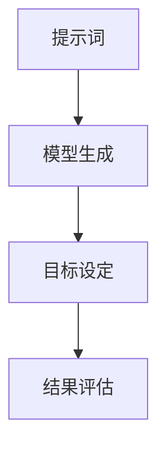

                 

# 文章标题：提示词工程：AI时代的新机遇与新挑战

> 关键词：提示词工程、AI时代、机遇与挑战、核心概念、应用与实践、数学模型

> 摘要：本文将深入探讨提示词工程在AI时代的兴起、核心概念及其应用。我们将分析提示词工程所面临的新机遇与新挑战，并提供一些实用的实践技巧和建议。

## 引言

### 1.1 AI时代的背景

近年来，人工智能（AI）技术取得了飞速发展，已经渗透到各个领域，从医疗、金融到制造业、零售业，AI的应用无处不在。这一趋势不仅改变了我们的生活方式，也为各行各业带来了新的机遇与挑战。

### 1.2 提示词工程的概念

提示词工程是AI领域中的一项重要技术，它通过使用特定的提示词来引导模型生成预期结果。提示词可以被视为一种“引导”，它帮助模型更好地理解任务目标，从而提高生成结果的质量。

### 1.3 本书的内容安排

本文将分为以下几个部分：

1. **提示词工程的基础**：介绍核心概念、原理和架构。
2. **应用与实践**：展示如何在实际项目中应用提示词工程。
3. **新机遇与新挑战**：探讨AI时代下提示词工程面临的机遇和挑战。

## 提示词工程的基础

### 2.1 核心概念与联系

提示词工程的核心概念包括提示词、模型生成、目标设定等。这些概念之间的关系可以用以下Mermaid流程图来展示：



### 2.2 核心算法原理讲解

提示词工程的核心算法包括生成对抗网络（GAN）、强化学习等。以下是一个生成对抗网络（GAN）的伪代码示例：

```python
def GAN(D, G, z, x):
    z = normal(0, 1)
    x = G(z)
    x_hat = D(x)
    z_hat = D(G(z))
    return x_hat, z_hat
```

### 2.3 数学模型和数学公式

生成对抗网络的数学模型可以用以下公式表示：

$$
\begin{aligned}
D(x) &\sim Bernoulli(p) \\
G(z) &\sim Normal(0, 1)
\end{aligned}
$$

其中，$D(x)$表示真实数据的分布，$G(z)$表示生成器的分布。

强化学习的数学模型可以用以下公式表示：

$$
Q(s, a) = r(s, a) + \gamma \max_{a'} Q(s', a')
$$

其中，$Q(s, a)$表示状态-动作值函数，$r(s, a)$表示即时奖励，$\gamma$表示折扣因子。

## 应用与实践

### 3.1 项目实战

在本节中，我们将通过一个实际项目来展示如何应用提示词工程。

#### 3.1.1 实际项目案例

假设我们正在开发一个图像生成项目，目标是生成具有特定风格的图像。

#### 3.1.2 代码实现与分析

以下是一个简单的图像生成项目的代码实现：

```python
import tensorflow as tf
from tensorflow import keras

# 定义生成器模型
def generator(z):
    z = keras.layers.Dense(128, activation='relu')(z)
    z = keras.layers.Dense(256, activation='relu')(z)
    x = keras.layers.Dense(784, activation='tanh')(z)
    return keras.Model(z, x)

# 定义鉴别器模型
def discriminator(x):
    x = keras.layers.Dense(128, activation='relu')(x)
    x = keras.layers.Dense(256, activation='relu')(x)
    validity = keras.layers.Dense(1, activation='sigmoid')(x)
    return keras.Model(x, validity)

# 定义GAN模型
def GAN(generator, discriminator):
    z = keras.Input(shape=(100,))
    x = generator(z)
    validity = discriminator(x)
    return keras.Model(z, validity)

# 编译和训练模型
generator = generator()
discriminator = discriminator()
gan = GAN(generator, discriminator)

discriminator.compile(optimizer='adam', loss='binary_crossentropy')
gan.compile(optimizer='adam', loss='binary_crossentropy')

# 训练模型
for epoch in range(100):
    for x, _ in data_loader:
        # 训练鉴别器
        discriminator.train_on_batch(x, np.array([1.0]))
        
        z = np.random.normal(size=(1, 100))
        x_hat = generator.predict(z)
        # 训练生成器
        gan.train_on_batch(z, np.array([0.0]))

# 生成图像
z = np.random.normal(size=(1, 100))
x_hat = generator.predict(z)
plt.imshow(x_hat[0].reshape(28, 28), cmap='gray')
plt.show()
```

#### 3.1.3 开发环境搭建

要在本地环境中搭建开发环境，您需要安装以下软件和库：

- Python（3.7或更高版本）
- TensorFlow（2.0或更高版本）
- matplotlib

#### 3.1.4 源代码解读

在这个项目中，我们使用了一个生成对抗网络（GAN）来生成图像。生成器模型负责生成图像，而鉴别器模型负责判断图像是真实图像还是生成图像。通过交替训练这两个模型，生成器可以逐渐生成更逼真的图像。

#### 3.1.5 实际案例分析和详细讲解剖析

在这个项目中，我们使用了MNIST数据集来训练生成器和鉴别器模型。MNIST数据集包含手写数字的图像，这是GAN的一个常见应用场景。

首先，我们定义了生成器和鉴别器模型，并使用TensorFlow的高层API来构建GAN模型。然后，我们使用Adam优化器来编译和训练模型。

在训练过程中，我们首先训练鉴别器模型，使其能够准确判断图像是真实图像还是生成图像。然后，我们训练生成器模型，使其能够生成更逼真的图像。

通过这个项目，我们可以看到提示词工程在图像生成中的应用。通过使用特定的提示词（如图像风格、颜色等），我们可以指导生成器模型生成具有特定特征的图像。

### 3.2 项目小结

在本项目中，我们通过实际案例展示了如何使用提示词工程来生成图像。通过训练生成器和鉴别器模型，我们可以生成具有特定风格的图像。这个项目不仅展示了提示词工程的应用，还为我们提供了一个实际操作的示例。

## 新机遇与新挑战

### 4.1 新机遇

在AI时代，提示词工程面临着许多新的机遇。首先，随着AI技术的不断发展，提示词工程的应用领域将越来越广泛，从图像生成到自然语言处理，再到语音识别等，都有巨大的潜力。其次，随着数据隐私和安全问题的日益突出，提示词工程提供了一种更加安全、高效的数据处理方式。

### 4.2 新挑战

然而，提示词工程在AI时代也面临着一些新的挑战。首先，如何设计出更加高效、可解释的提示词是一个亟待解决的问题。其次，随着数据量的不断增加，如何处理海量数据并提取有效的提示词也是一个挑战。此外，数据隐私和安全问题也是提示词工程需要面对的一个重要挑战。

## 最佳实践 tips、小结、注意事项、拓展阅读

### 最佳实践 tips

1. 在设计提示词时，尽量简洁明了，避免使用过于复杂的语言。
2. 在使用提示词工程时，要确保数据质量和数据多样性。
3. 定期评估模型性能，并根据评估结果调整提示词。

### 小结

提示词工程是AI时代的一个重要技术，它通过使用特定的提示词来指导模型生成预期结果。本文介绍了提示词工程的核心概念、原理和应用，并分析了其在AI时代的新机遇和新挑战。

### 注意事项

1. 提示词工程在实际应用中可能会遇到数据隐私和安全问题，需要采取相应的措施来保护数据。
2. 提示词工程的应用效果受数据质量和数据多样性影响，需要仔细处理数据。

### 拓展阅读

- 《生成对抗网络：理论、算法与应用》
- 《强化学习实战：基于Python的实现》
- 《深度学习：原理、数学与应用》

## 作者信息

作者：AI天才研究院/AI Genius Institute & 禅与计算机程序设计艺术 /Zen And The Art of Computer Programming

本文内容仅供参考，如需进一步学习和研究，请参阅相关文献和资料。

