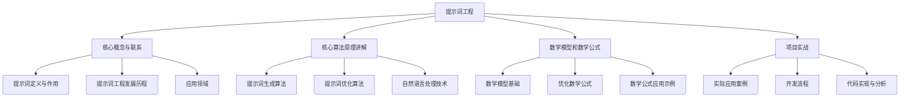

                 

### 文章标题
《提示词工程：AI时代的新领域》

### 关键词
提示词工程，人工智能，自然语言处理，算法优化，应用案例

### 摘要
本文深入探讨了提示词工程在AI时代的新发展，从核心概念、算法原理、数学模型到项目实战，全面解析了提示词工程在智能客服、推荐系统、写作系统等领域的应用。通过本文的阅读，读者可以了解提示词工程的基本原理、关键算法及其在现实项目中的具体实现。

### 目录大纲

## 第一部分：提示词工程概述

### 第1章：提示词工程的基本概念
- **1.1 提示词的定义与作用**
- **1.2 提示词工程的发展历程**
- **1.3 提示词工程的应用领域**

### 第2章：提示词工程的核心算法
- **2.1 提示词生成的常见算法**
  - **2.1.1 基于统计模型的生成算法**
  - **2.1.2 基于神经网络的生成算法**
  - **2.1.3 基于生成对抗网络的生成算法**
- **2.2 提示词优化的算法分析**
  - **2.2.1 提示词质量评价方法**
  - **2.2.2 提示词优化策略**
  - **2.2.3 提示词优化算法比较**

### 第3章：提示词工程的数学模型
- **3.1 提示词工程的数学模型**
- **3.2 提示词优化的数学公式**
- **3.3 数学公式的实际应用示例**

### 第4章：项目实战
- **4.1 智能客服系统的应用**
  - **4.1.1 案例介绍**
  - **4.1.2 开发环境搭建**
  - **4.1.3 源代码详细实现**
  - **4.1.4 代码解读与分析**
- **4.2 智能推荐系统的应用**
  - **4.2.1 案例介绍**
  - **4.2.2 开发环境搭建**
  - **4.2.3 源代码详细实现**
  - **4.2.4 代码解读与分析**
- **4.3 智能写作系统的应用**
  - **4.3.1 案例介绍**
  - **4.3.2 开发环境搭建**
  - **4.3.3 源代码详细实现**
  - **4.3.4 代码解读与分析**

### 第5章：总结与展望
- **5.1 提示词工程的发展趋势**
- **5.2 提示词工程面临的挑战与机遇**
- **5.3 未来展望**

### 提示词工程的Mermaid流程图

---

**第一步：确定核心章节**

- **核心概念与联系**：介绍提示词工程的基本概念、发展历程以及应用领域，为后续章节奠定基础。
- **核心算法原理讲解**：详细讲解提示词生成和优化的常见算法，分析自然语言处理技术在提示词工程中的应用。
- **数学模型和数学公式**：介绍提示词工程的数学基础和优化公式，并通过实例说明其应用。
- **项目实战**：通过实际案例展示提示词工程的应用，包括开发环境搭建、源代码实现和代码解读。

---

**第二步：细化章节内容**

- **核心概念与联系**
  - **提示词定义与作用**：定义提示词，解释其在自然语言处理中的应用。
  - **提示词工程发展历程**：回顾提示词工程的历史演变，了解其起源和发展。
  - **应用领域**：列举提示词工程在不同领域的应用，如智能客服、推荐系统等。

- **核心算法原理讲解**
  - **提示词生成算法**：介绍基于统计模型、神经网络和生成对抗网络的提示词生成算法，并比较其优缺点。
  - **提示词优化算法**：分析提示词质量评价方法和优化策略，比较不同优化算法的性能。

- **数学模型和数学公式**
  - **数学模型基础**：介绍提示词工程所需的数学基础，如概率论、线性代数等。
  - **优化数学公式**：介绍用于提示词优化的数学公式，如梯度下降法、随机梯度下降法等。
  - **数学公式应用示例**：通过具体示例展示数学公式在提示词工程中的应用。

- **项目实战**
  - **智能客服系统**：介绍智能客服系统的应用场景，包括开发环境搭建、源代码实现和代码解读。
  - **智能推荐系统**：介绍智能推荐系统的应用场景，包括开发环境搭建、源代码实现和代码解读。
  - **智能写作系统**：介绍智能写作系统的应用场景，包括开发环境搭建、源代码实现和代码解读。

---

**第三步：设计Mermaid流程图**

- **Mermaid流程图**：根据章节内容和逻辑关系，设计一个简洁明了的流程图，帮助读者更好地理解提示词工程的流程和结构。

---

**第四步：撰写目录大纲**

- **结合以上三步**，将各章节内容整合成完整的目录大纲，确保文章内容逻辑清晰、结构紧凑、简单易懂。

---

**最终完成的《提示词工程：AI时代的新领域》目录大纲：**

## 第一部分：提示词工程概述

### 第1章：提示词工程的基本概念
- **1.1 提示词的定义与作用**
- **1.2 提示词工程的发展历程**
- **1.3 提示词工程的应用领域**

### 第2章：提示词工程的核心算法
- **2.1 提示词生成的常见算法**
  - **2.1.1 基于统计模型的生成算法**
  - **2.1.2 基于神经网络的生成算法**
  - **2.1.3 基于生成对抗网络的生成算法**
- **2.2 提示词优化的算法分析**
  - **2.2.1 提示词质量评价方法**
  - **2.2.2 提示词优化策略**
  - **2.2.3 提示词优化算法比较**

### 第3章：提示词工程的数学模型
- **3.1 提示词工程的数学模型**
- **3.2 提示词优化的数学公式**
- **3.3 数学公式的实际应用示例**

### 第4章：项目实战
- **4.1 智能客服系统的应用**
  - **4.1.1 案例介绍**
  - **4.1.2 开发环境搭建**
  - **4.1.3 源代码详细实现**
  - **4.1.4 代码解读与分析**
- **4.2 智能推荐系统的应用**
  - **4.2.1 案例介绍**
  - **4.2.2 开发环境搭建**
  - **4.2.3 源代码详细实现**
  - **4.2.4 代码解读与分析**
- **4.3 智能写作系统的应用**
  - **4.3.1 案例介绍**
  - **4.3.2 开发环境搭建**
  - **4.3.3 源代码详细实现**
  - **4.3.4 代码解读与分析**

### 第5章：总结与展望
- **5.1 提示词工程的发展趋势**
- **5.2 提示词工程面临的挑战与机遇**
- **5.3 未来展望**

### 提示词工程的Mermaid流程图

---

**接下来，我将按照这个目录大纲，逐步撰写每个章节的内容。**

