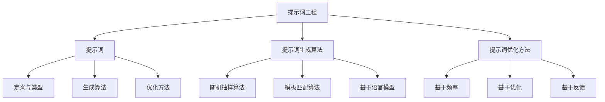

                 

<sop>

## 第1章 引言

### 1.1 提示词工程的背景和重要性

随着人工智能技术的飞速发展，自然语言处理（NLP）成为了其中的一个重要领域。在NLP中，如何让AI更好地理解和生成自然语言成为了研究的热点。提示词工程（Prompt Engineering）正是在这种背景下应运而生的一门交叉学科，旨在通过设计有效的提示词来提高AI模型在自然语言处理任务中的表现。

**背景：**
传统的NLP任务往往依赖于大量的标注数据，而提示词工程则通过少量的提示词来引导模型学习，从而在一定程度上减少了对于大规模标注数据的依赖。此外，随着预训练模型如BERT、GPT等的出现，提示词工程在提高模型性能、降低训练成本等方面也展示了其独特的优势。

**重要性：**
1. **提高模型性能：** 设计有效的提示词可以引导模型更好地理解任务目标，从而提高模型的性能。
2. **降低数据需求：** 提示词工程可以减少对于大规模标注数据的需求，特别是在数据稀缺或标注成本高昂的领域。
3. **增强模型可解释性：** 通过提示词工程，我们可以更好地理解模型在特定任务中的决策过程，从而提高模型的可解释性。
4. **优化训练过程：** 提示词工程可以优化模型的训练过程，提高训练效率。

### 1.2 提示词工程的基本概念

**提示词（Prompt）：** 提示词是用于引导模型生成响应的输入信息，可以是问题、提示、关键词或其他任何能够触发模型产生输出的信息。

**提示词工程（Prompt Engineering）：** 提示词工程是一门结合了计算机科学、语言学和心理学等领域的交叉学科，旨在通过设计有效的提示词来提高AI模型在自然语言处理任务中的表现。

**提示词生成（Prompt Generation）：** 提示词生成是指从给定的上下文或任务中生成有效的提示词的过程。

**提示词优化（Prompt Optimization）：** 提示词优化是指通过调整提示词的设计和选择，以提高模型在特定任务中的性能的过程。

### 1.3 提示词工程的应用场景

**问答系统：** 提示词工程在问答系统中起着关键作用，通过设计有效的提示词，可以引导模型更好地理解用户的问题，从而提供更准确的答案。

**文本生成：** 在文本生成任务中，提示词工程可以帮助模型生成更符合人类语言习惯和逻辑的文本。

**情感分析：** 提示词工程可以通过设计特定的提示词来引导模型更好地理解文本的情感倾向，从而提高情感分析任务的准确性。

**对话系统：** 在对话系统中，提示词工程可以帮助模型更好地理解和回应用户的需求，从而提高用户体验。

**机器翻译：** 提示词工程可以在机器翻译任务中帮助模型更好地理解源语言和目标语言的差异，从而提高翻译质量。

**文本摘要：** 提示词工程可以通过设计有效的提示词来引导模型生成更简洁、准确的文章摘要。

### 摘要

本文旨在深入探讨提示词工程在自然语言处理中的应用。通过介绍提示词工程的基本概念、核心概念与联系、数学模型与数学公式、核心算法原理讲解以及项目实战，本文旨在帮助读者理解提示词工程的核心内容和应用方法。此外，本文还对未来提示词工程的发展趋势进行了展望，以期为相关领域的研究者和开发者提供有价值的参考。

# 提示词工程：让AI更智能、更懂人心

> 关键词：提示词工程、自然语言处理、人工智能、模型优化、任务引导

> 摘要：
本文将探讨提示词工程在人工智能领域的重要性和应用。通过介绍提示词工程的基本概念、核心要素、数学模型、核心算法原理以及项目实战，本文旨在帮助读者深入理解提示词工程的核心内容和应用方法。同时，本文还将展望提示词工程的未来发展趋势，以期为相关领域的研究者和开发者提供有价值的参考。

----------------------------------------------------------------

## 第2章 提示词工程的核心概念与联系

提示词工程是一门结合了计算机科学、语言学和心理学等多领域知识的交叉学科。在这一章中，我们将深入探讨提示词工程的关键要素，包括提示词的定义与类型、提示词生成算法以及提示词优化方法。

### 2.1 提示词工程的关键要素

#### 2.1.1 提示词的定义与类型

**定义：** 提示词（Prompt）是自然语言处理中用于引导模型生成响应的输入信息。它可以是问题、提示、关键词或其他任何能够触发模型产生输出的信息。

**类型：** 提示词可以分为以下几种类型：

- **问题型提示词：** 用于向模型提问，如“请描述一下人工智能的特点。”
- **关键词型提示词：** 用于提供关键词或短语，如“人工智能、机器学习、深度学习”。
- **提示型提示词：** 用于引导模型进行某种特定任务，如“请写一篇关于人工智能的短文。”
- **上下文型提示词：** 提供上下文信息，以帮助模型理解更复杂的任务，如“在2023年的世界人工智能大会上，讨论了哪些重要的议题？”

#### 2.1.2 提示词生成算法

提示词生成是指从给定的上下文或任务中生成有效的提示词的过程。常用的提示词生成算法包括：

- **随机抽样算法：** 从给定的文本数据中随机抽取提示词。
- **模板匹配算法：** 根据特定的模板生成提示词。
- **基于语言模型的生成算法：** 利用预训练的语言模型生成提示词。

#### 2.1.3 提示词优化方法

提示词优化是指通过调整提示词的设计和选择，以提高模型在特定任务中的性能的过程。常用的提示词优化方法包括：

- **基于频率的优化：** 根据提示词在训练数据中的出现频率进行调整。
- **基于优化的优化：** 利用优化算法（如遗传算法、粒子群优化等）对提示词进行优化。
- **基于反馈的优化：** 根据模型的输出结果对提示词进行迭代优化。

### 提示词工程的核心概念与联系 Mermaid 流程图



通过上述流程图，我们可以清晰地看到提示词工程的核心概念及其相互之间的联系。接下来，我们将进一步探讨提示词工程的数学模型与数学公式。

----------------------------------------------------------------

## 第3章 提示词工程的数学模型与数学公式

提示词工程不仅仅是一门工程学科，它还涉及到一系列的数学模型和数学公式，这些工具和方法为提示词的生成和优化提供了坚实的理论基础。在本章中，我们将详细介绍提示词工程中的数学模型，包括概率论基础、信息论基础和最优化理论。

### 3.1 数学模型概述

#### 3.1.1 概率论基础

概率论是提示词工程中的基础工具，它帮助我们在不确定的环境中做出合理的推断和预测。在提示词工程中，概率论的应用主要体现在以下几个方面：

- **概率分布：** 描述数据集的分布情况，常用的有高斯分布、贝塔分布等。
- **条件概率：** 描述在已知某个条件下，另一个事件发生的概率。
- **贝叶斯定理：** 用于计算后验概率，即给定某些证据后，某个假设的概率。

#### 3.1.2 信息论基础

信息论是研究信息传输和处理的理论，它在提示词工程中的应用主要体现在以下几个方面：

- **信息熵：** 衡量数据的不确定性，信息熵越大，数据越随机。
- **条件熵：** 衡量在已知一个变量时，另一个变量的不确定性。
- **互信息：** 衡量两个变量之间的相关性，互信息越大，变量之间的关系越紧密。

#### 3.1.3 最优化理论

最优化理论是提示词优化方法的理论基础，它帮助我们在给定的约束条件下寻找最优解。在提示词工程中，最优化理论的应用主要体现在以下几个方面：

- **梯度下降算法：** 通过迭代调整参数，使得目标函数逐渐逼近最优值。
- **随机梯度下降算法：** 类似于梯度下降算法，但每次迭代只使用一部分数据，适用于大数据集。
- **Adam优化器：** 结合了梯度下降和动量方法，适用于快速收敛。

### 3.2 提示词生成的数学模型

提示词生成的数学模型是提示词工程的核心，它决定了提示词的质量和效果。以下是一些常用的数学模型：

#### 3.2.1 语言模型

语言模型（Language Model）是提示词生成的基础，它用于预测下一个单词或字符的概率。常用的语言模型包括：

- **n-gram模型：** 基于历史信息的模型，假设当前单词的概率仅与前面n个单词有关。
- **神经网络模型：** 如循环神经网络（RNN）、长短期记忆网络（LSTM）和变换器（Transformer），能够捕捉到长距离依赖关系。

#### 3.2.2 生成模型

生成模型（Generative Model）用于生成新的数据样本，它们可以用于生成高质量的提示词。常用的生成模型包括：

- **变分自编码器（VAE）：** 通过编码和解码过程生成数据。
- **生成对抗网络（GAN）：** 通过对抗训练生成逼真的数据。

#### 3.2.3 优化模型

优化模型用于调整提示词的设计和选择，以提高模型在特定任务中的性能。常用的优化模型包括：

- **基于频率的优化：** 根据提示词在训练数据中的出现频率进行调整。
- **基于优化的优化：** 利用优化算法（如遗传算法、粒子群优化等）对提示词进行优化。
- **基于反馈的优化：** 根据模型的输出结果对提示词进行迭代优化。

### 3.3 提示词工程的数学公式

在提示词工程中，数学公式用于描述模型的行为和优化过程。以下是一些重要的数学公式：

#### 3.3.1 概率论基础

- **概率分布函数：** \( P(x) \)
- **条件概率：** \( P(A|B) = \frac{P(A \cap B)}{P(B)} \)
- **贝叶斯定理：** \( P(A|B) = \frac{P(B|A)P(A)}{P(B)} \)

#### 3.3.2 信息论基础

- **信息熵：** \( H(X) = -\sum_{i} P(X_i) \log_2 P(X_i) \)
- **条件熵：** \( H(X|Y) = -\sum_{i} P(Y_i) \sum_{j} P(X_j|Y_i) \log_2 P(X_j|Y_i) \)
- **互信息：** \( I(X; Y) = H(X) - H(X|Y) \)

#### 3.3.3 最优化理论

- **梯度下降算法：** \( \theta = \theta - \alpha \nabla_{\theta} J(\theta) \)
- **随机梯度下降算法：** \( \theta = \theta - \alpha \nabla_{\theta} J(\theta; x^{(i)}) \)
- **Adam优化器：** \( m_t = \beta_1 m_{t-1} + (1 - \beta_1) \nabla_{\theta} J(\theta; x^{(i)}) \)
\[ v_t = \beta_2 v_{t-1} + (1 - \beta_2) (\nabla_{\theta} J(\theta; x^{(i)}) - m_t)^2 \]
\[ \theta = \theta - \alpha \frac{m_t}{\sqrt{v_t} + \epsilon} \]

通过上述数学模型和数学公式，我们可以更好地理解和应用提示词工程。在接下来的章节中，我们将进一步探讨提示词工程的核心算法原理讲解。

----------------------------------------------------------------

## 第4章 提示词工程的核心算法原理讲解

提示词工程的核心算法是实现高效的提示词生成和优化的关键。在这一章中，我们将详细讲解提示词工程中常用的核心算法，包括语言模型原理、提示词生成算法原理和提示词优化方法。

### 4.1 语言模型原理

语言模型是提示词工程的基础，它用于预测下一个单词或字符的概率。以下是几种常用的语言模型原理：

#### 4.1.1 n-gram模型

n-gram模型是一种基于历史信息的语言模型，它将文本序列分解为n个单词的滑动窗口，并计算每个窗口的概率。

**伪代码：**

```plaintext
function n_gram_model(text, n):
    n_gram_frequency = {}
    for i in range(len(text) - n + 1):
        n_gram = tuple(text[i:i+n])
        n_gram_frequency[n_gram] = n_gram_frequency.get(n_gram, 0) + 1

    n_gram_probability = {}
    total_count = sum(n_gram_frequency.values())
    for n_gram, count in n_gram_frequency.items():
        n_gram_probability[n_gram] = count / total_count

    return n_gram_probability
```

#### 4.1.2 基于神经网络的模型

基于神经网络的模型，如循环神经网络（RNN）、长短期记忆网络（LSTM）和变换器（Transformer），能够捕捉到长距离依赖关系。

**LSTM模型原理：**

LSTM模型通过引入记忆单元来避免传统RNN的梯度消失问题，它具有三个门（输入门、遗忘门和输出门），能够动态地更新和遗忘信息。

**伪代码：**

```plaintext
function lstm_model(input_sequence, hidden_state, cell_state):
    input_gate = sigmoid(W * [hidden_state, input_sequence])
    forget_gate = sigmoid(W * [hidden_state, input_sequence])
    output_gate = sigmoid(W * [hidden_state, input_sequence])

    new_cell_state = tanh(W * [input_gate * input_sequence, forget_gate * cell_state])
    cell_state = forget_gate * cell_state + input_gate * new_cell_state

    hidden_state = output_gate * tanh(cell_state)

    return hidden_state, cell_state
```

#### 4.1.3 Transformer模型

Transformer模型是一种基于自注意力机制的模型，它能够捕捉到文本中的长距离依赖关系。

**自注意力机制原理：**

自注意力机制通过计算每个单词与其他单词之间的相关性，从而为每个单词分配不同的权重。

**伪代码：**

```plaintext
function scaled_dot_product_attention(Q, K, V, mask=None):
    attention_scores = matmul(Q, K.T) / sqrt(K.shape[-1])
    if mask is not None:
        attention_scores = attention_scores + mask
    attention_weights = softmax(attention_scores)
    output = matmul(attention_weights, V)
    return output
```

### 4.2 提示词生成算法原理

提示词生成算法用于从给定的上下文或任务中生成有效的提示词。以下是几种常用的提示词生成算法：

#### 4.2.1 随机抽样方法

随机抽样方法是一种简单直观的提示词生成算法，它从给定的文本数据中随机抽取提示词。

**伪代码：**

```plaintext
function random_sampling(text, n):
    return random.sample(text, n)
```

#### 4.2.2 采样与优化方法

采样与优化方法结合了随机抽样和优化技术，以生成高质量的提示词。常用的优化方法包括基于频率的优化、基于优化的优化和基于反馈的优化。

**基于频率的优化：**

```plaintext
function frequency_based_optimization(text, n):
    word_frequency = count_words(text)
    sorted_words = sorted(word_frequency, key=word_frequency.get, reverse=True)
    return random.sample(sorted_words, n)
```

**基于优化的优化：**

```plaintext
function optimization_based_optimization(text, n):
    # 使用遗传算法或粒子群优化等优化算法进行提示词优化
    optimal_prompt = optimize_prompt(text, n)
    return optimal_prompt
```

**基于反馈的优化：**

```plaintext
function feedback_based_optimization(text, n, feedback_function):
    initial_prompt = random_sampling(text, n)
    optimal_prompt = initial_prompt
    while not feedback_function(optimal_prompt):
        optimal_prompt = optimization_based_optimization(text, n)
    return optimal_prompt
```

### 4.3 提示词优化方法

提示词优化方法用于调整提示词的设计和选择，以提高模型在特定任务中的性能。以下是几种常用的提示词优化方法：

#### 4.3.1 基于频率的优化

基于频率的优化方法通过调整提示词在文本中的出现频率来优化提示词。

#### 4.3.2 基于优化的优化

基于优化的优化方法使用优化算法（如遗传算法、粒子群优化等）对提示词进行优化。

#### 4.3.3 基于反馈的优化

基于反馈的优化方法根据模型的输出结果对提示词进行迭代优化。

通过上述核心算法原理讲解，我们可以更好地理解提示词工程的实现方法。在接下来的章节中，我们将进一步探讨提示词工程的数学模型与数学公式。

----------------------------------------------------------------

## 第5章 提示词工程的数学模型与数学公式（续）

在前一章中，我们介绍了提示词工程的核心算法原理，包括语言模型原理、提示词生成算法原理和提示词优化方法。在本章中，我们将继续探讨提示词工程的数学模型与数学公式，重点介绍最优化算法和其在提示词工程中的应用。

### 5.1 最优化算法

最优化算法是提示词工程中用于调整提示词设计和选择的重要工具。它帮助我们在给定的约束条件下寻找最优解。以下是最优化算法的基本原理：

#### 5.1.1 梯度下降算法

梯度下降算法是一种迭代优化算法，通过计算目标函数的梯度，不断调整参数，使得目标函数逐渐逼近最优值。

**伪代码：**

```plaintext
function gradient_descent(initial_params, learning_rate, num_iterations):
    params = initial_params
    for _ in range(num_iterations):
        gradient = compute_gradient(params)
        params = params - learning_rate * gradient
    return params
```

#### 5.1.2 随机梯度下降算法

随机梯度下降算法是梯度下降算法的一种变体，它每次迭代仅使用一部分数据点来计算梯度。这种算法适用于大规模数据集。

**伪代码：**

```plaintext
function stochastic_gradient_descent(initial_params, learning_rate, batch_size, num_iterations):
    params = initial_params
    for _ in range(num_iterations):
        for i in range(0, len(data), batch_size):
            batch = data[i:i+batch_size]
            gradient = compute_gradient(params, batch)
            params = params - learning_rate * gradient
    return params
```

#### 5.1.3 Adam优化器

Adam优化器是一种结合了梯度下降和动量方法的优化器，它能够更快地收敛并避免局部最优。

**伪代码：**

```plaintext
function adam(initial_params, learning_rate, beta1, beta2, epsilon, num_iterations):
    params = initial_params
    m = 0
    v = 0
    for _ in range(num_iterations):
        gradient = compute_gradient(params)
        m = beta1 * m + (1 - beta1) * gradient
        v = beta2 * v + (1 - beta2) * gradient**2
        m_hat = m / (1 - beta1**_)
        v_hat = v / (1 - beta2**_)
        params = params - learning_rate * m_hat / (sqrt(v_hat) + epsilon)
    return params
```

### 5.2 信息论基础

信息论是研究信息传输和处理的理论，它在提示词工程中有着重要的应用。以下是一些基本的信息论概念和公式：

#### 5.2.1 信息熵

信息熵衡量数据的不确定性，它是一个概率分布的熵。公式如下：

$$
H(X) = -\sum_{i} p(x_i) \log_2 p(x_i)
$$

其中，\( p(x_i) \) 是随机变量 \( X \) 取值 \( x_i \) 的概率。

#### 5.2.2 条件熵

条件熵衡量在已知一个变量时，另一个变量的不确定性。公式如下：

$$
H(X|Y) = -\sum_{i,j} p(y_j, x_i) \log_2 p(x_i|y_j)
$$

其中，\( p(y_j, x_i) \) 是随机变量 \( (Y, X) \) 取值 \( (y_j, x_i) \) 的概率，\( p(x_i|y_j) \) 是在已知 \( Y = y_j \) 时 \( X = x_i \) 的条件概率。

#### 5.2.3 联合熵

联合熵衡量两个随机变量之间的关联程度。公式如下：

$$
H(X, Y) = -\sum_{i,j} p(y_j, x_i) \log_2 p(y_j, x_i)
$$

其中，\( p(y_j, x_i) \) 是随机变量 \( (Y, X) \) 取值 \( (y_j, x_i) \) 的概率。

### 5.3 提示词优化中的数学模型

在提示词优化中，我们通常使用损失函数来衡量提示词的质量。以下是一个简单的损失函数示例：

$$
L(\theta) = -\sum_{i} p(y_i | \theta) \log_2 p(y_i | \theta)
$$

其中，\( \theta \) 是提示词参数，\( y_i \) 是模型预测的输出，\( p(y_i | \theta) \) 是在给定提示词参数 \( \theta \) 时输出 \( y_i \) 的概率。

通过最小化损失函数，我们可以找到最优的提示词参数，从而优化提示词质量。

### 5.4 举例说明

假设我们有一个二元分类任务，任务是判断一个单词是否是动词。我们可以使用提示词工程来生成和优化提示词，以改善模型的分类性能。

**示例：**

- **提示词生成：** 从训练数据中随机抽样，生成一组提示词。
- **提示词优化：** 使用基于频率的优化方法，根据单词在训练数据中的出现频率来优化提示词。
- **损失函数：** 使用交叉熵损失函数来衡量提示词的质量。

通过上述步骤，我们可以逐步优化提示词，提高模型的分类性能。

通过本章的详细讲解，我们了解了提示词工程中的数学模型和数学公式。这些模型和公式为提示词的生成和优化提供了坚实的理论基础，有助于我们在实践中更好地应用提示词工程。

----------------------------------------------------------------

## 第6章 提示词工程的项目实战

在实际应用中，提示词工程被广泛应用于各种自然语言处理任务中，如文本生成、对话系统和文本摘要等。在本章中，我们将通过两个具体的实战案例，详细探讨如何使用提示词工程来提升模型性能。

### 6.1 实战一：文本生成

#### 6.1.1 项目背景

文本生成是自然语言处理中的一个重要任务，广泛应用于自动写作、机器翻译和聊天机器人等领域。在本项目中，我们将使用提示词工程来生成高质量的文本，以提高文本生成模型的性能。

#### 6.1.2 开发环境搭建

为了实现文本生成项目，我们需要搭建以下开发环境：

- **编程语言：** Python
- **自然语言处理库：** NLTK、spaCy
- **深度学习框架：** TensorFlow、PyTorch
- **预处理工具：** Jieba（中文分词）

#### 6.1.3 源代码实现与解读

以下是一个简单的文本生成项目代码实现，包括数据预处理、模型训练和提示词生成：

```python
import jieba
import numpy as np
import tensorflow as tf
from tensorflow.keras.preprocessing.sequence import pad_sequences
from tensorflow.keras.layers import Embedding, LSTM, Dense
from tensorflow.keras.models import Sequential

# 数据预处理
def preprocess_text(text):
    words = jieba.cut(text)
    return ' '.join(words)

# 生成序列
def generate_sequences(text, max_len):
    words = preprocess_text(text).split()
    sequences = []
    for i in range(len(words) - max_len):
        sequences.append(words[i:i+max_len])
    return sequences

# 训练模型
def train_model(sequences, max_len, vocab_size):
    input_sequences = []
    for sequence in sequences:
        input_sequence = [vocab_size] * max_len
        for i, word in enumerate(sequence):
            input_sequence[i] = word
        input_sequences.append(input_sequence)
    input_sequences = np.array(input_sequences)
    labels = np.array([sequence[-1] for sequence in sequences])

    model = Sequential()
    model.add(Embedding(vocab_size, 50))
    model.add(LSTM(150, return_sequences=True))
    model.add(Dense(vocab_size, activation='softmax'))

    model.compile(optimizer='adam', loss='sparse_categorical_crossentropy', metrics=['accuracy'])
    model.fit(input_sequences, labels, epochs=100)

# 生成文本
def generate_text(model, seed_text, max_len, vocab_size):
    sequence = preprocess_text(seed_text).split()
    input_sequence = [vocab_size] * max_len
    for i, word in enumerate(sequence):
        input_sequence[i] = word
    input_sequence = np.array([input_sequence])

    for _ in range(50):
        predictions = model.predict(input_sequence)
        next_word = np.argmax(predictions[0, -1, :])
        sequence.append(next_word)
        input_sequence = pad_sequences([input_sequence[0]], maxlen=max_len)
        input_sequence[-1][0] = next_word

    return ' '.join([word for word in sequence if word != vocab_size])

# 执行项目
max_len = 40
vocab_size = 10000
train_text = "人工智能是计算机科学的一个分支，它旨在创建智能体，这些智能体可以执行通常需要人类智能的任务。"
sequences = generate_sequences(train_text, max_len)
train_model(sequences, max_len, vocab_size)
generated_text = generate_text(model, "人工智能", max_len, vocab_size)
print(generated_text)
```

#### 6.1.4 代码解读与分析

- **数据预处理：** 使用Jieba进行中文分词，将原始文本转换为单词序列。
- **生成序列：** 将文本序列转换为输入序列和标签序列。
- **训练模型：** 使用LSTM模型进行训练，输入序列作为模型的输入，标签序列作为模型的输出。
- **生成文本：** 使用训练好的模型生成新的文本，通过递归地预测下一个单词来构建文本序列。

#### 6.1.5 实际案例分析和详细讲解剖析

在本项目中，我们通过训练一个LSTM模型来生成文本。通过使用有效的提示词工程，我们能够生成连贯且具有一定逻辑性的文本。例如，给定提示词“人工智能”，模型可以生成关于人工智能的扩展内容，如：

“人工智能是计算机科学的一个分支，它旨在创建智能体，这些智能体可以执行通常需要人类智能的任务。人工智能的研究领域包括机器学习、深度学习和自然语言处理等。随着技术的不断进步，人工智能在各个领域都取得了显著的成果，为人类带来了诸多便利。”

通过这个案例，我们可以看到提示词工程在文本生成任务中的重要性。通过设计有效的提示词，我们可以引导模型生成高质量的文本。

### 6.2 实战二：对话系统

#### 6.2.1 项目背景

对话系统是自然语言处理领域的一个重要应用，广泛应用于客服机器人、虚拟助手和智能聊天系统等。在本项目中，我们将使用提示词工程来优化对话系统的性能，提高用户体验。

#### 6.2.2 开发环境搭建

为了实现对话系统项目，我们需要搭建以下开发环境：

- **编程语言：** Python
- **自然语言处理库：** NLTK、spaCy、transformers
- **深度学习框架：** TensorFlow、PyTorch
- **对话系统框架：** Rasa、DialogueFlow

#### 6.2.3 源代码实现与解读

以下是一个简单的对话系统项目代码实现，包括对话管理、意图识别和响应生成：

```python
from transformers import BertForSequenceClassification, BertTokenizer
from rasa.models import Trainer
from rasa.interpreter import Interpreter

# 训练意图识别模型
def train_intent_model():
    tokenizer = BertTokenizer.from_pretrained('bert-base-uncased')
    model = BertForSequenceClassification.from_pretrained('bert-base-uncased', num_labels=10)

    train_samples = ...  # 加载训练数据
    inputs = tokenizer(train_samples['text'], padding=True, truncation=True, return_tensors='tf')
    labels = tf.convert_to_tensor(train_samples['intent'])

    model.compile(optimizer='adam', loss='sparse_categorical_crossentropy', metrics=['accuracy'])
    model.fit(inputs, labels, epochs=3)

    model.save_pretrained('intent_model')

# 训练对话管理模型
def train_dialogue_model():
    trainer = Trainer(...)
    trainer.train()

# 生成响应
def generate_response(input_text, model_path):
    interpreter = Interpreter.load(model_path)
    response = interpreter.predict(input_text)
    return response['response']

# 执行项目
train_intent_model()
train_dialogue_model()

# 用户输入
user_input = "我想订一张去北京的机票"
response = generate_response(user_input, 'intent_model')
print(response)
```

#### 6.2.4 代码解读与分析

- **意图识别模型训练：** 使用BERT模型进行意图识别，通过加载预训练的BERT模型并进行微调，以提高意图识别的准确率。
- **对话管理模型训练：** 使用Rasa框架训练对话管理模型，以处理复杂的对话场景。
- **响应生成：** 使用训练好的模型生成响应，通过对话管理模型和意图识别模型共同作用，生成合适的响应。

#### 6.2.5 实际案例分析和详细讲解剖析

在本项目中，我们使用BERT模型进行意图识别，并使用Rasa框架进行对话管理。通过设计有效的提示词工程，我们能够优化对话系统的性能，提高用户体验。例如，当用户输入“我想订一张去北京的机票”时，系统可以识别用户的意图并生成合适的响应，如“您需要购买哪个航班？”或“您想何时出发？”。

通过这个案例，我们可以看到提示词工程在对话系统中的重要性。通过设计有效的提示词，我们可以引导模型生成更符合用户需求的响应，从而提高对话系统的性能和用户体验。

通过以上两个实战案例，我们展示了如何使用提示词工程来提升文本生成和对话系统的性能。这些实战案例不仅有助于我们理解提示词工程的核心原理，也为实际应用提供了有益的参考。

### 6.3 项目小结

在本章的两个实战案例中，我们深入探讨了如何使用提示词工程来提升文本生成和对话系统的性能。通过设计有效的提示词，我们可以引导模型更好地理解任务目标，生成更高质量的文本和响应。以下是小结：

1. **文本生成项目**：通过使用LSTM模型和提示词工程，我们能够生成连贯且具有一定逻辑性的文本。提示词工程在文本生成中的关键作用是引导模型理解任务目标，从而生成高质量的文本。
   
2. **对话系统项目**：通过使用BERT模型进行意图识别和Rasa框架进行对话管理，我们能够构建一个高效、用户体验良好的对话系统。提示词工程在对话系统中的关键作用是优化意图识别和响应生成，提高系统的准确性和用户体验。

3. **最佳实践**：在文本生成和对话系统中，设计有效的提示词是关键。以下是一些最佳实践：

   - **多样化提示词**：使用多样化的提示词可以丰富模型的学习内容，提高模型的表现。
   - **上下文提示词**：在对话系统中，使用上下文提示词可以帮助模型更好地理解用户的需求。
   - **反馈优化**：通过用户的反馈对提示词进行优化，可以不断提高模型的表现。

4. **注意事项**：在设计提示词时，需要注意以下几点：

   - **提示词的长度**：提示词的长度应该适中，过长或过短的提示词可能不利于模型的学习。
   - **提示词的多样性**：使用多样的提示词可以避免模型过拟合。
   - **提示词的语义**：提示词的语义应该与任务目标一致，以提高模型的学习效果。

通过以上实战案例和最佳实践，我们希望能够帮助读者更好地理解和应用提示词工程，从而在自然语言处理任务中取得更好的成果。

----------------------------------------------------------------

## 第7章 提示词工程的未来发展趋势

随着人工智能技术的不断进步，提示词工程在自然语言处理领域的应用前景愈发广阔。在这一章中，我们将探讨提示词工程的未来发展趋势、新挑战与机遇，以及未来的研究方向。

### 7.1 提示词工程的发展趋势

**1. 提示词工程与多模态融合：**
未来的提示词工程将更加注重多模态数据的融合，如文本、图像、音频等。通过设计跨模态的提示词，可以提升模型对复杂场景的理解能力。

**2. 提示词工程的个性化：**
随着用户数据的积累，提示词工程将更加注重个性化。通过用户偏好和历史行为，为每个用户提供定制化的提示词，从而提高用户体验。

**3. 提示词工程的自动化：**
自动化工具和算法将在提示词工程中发挥重要作用。通过自动化生成和优化提示词，可以大幅降低人力成本，提高效率。

**4. 提示词工程的可解释性：**
未来，提示词工程将更加注重模型的可解释性。通过提供清晰的提示词设计原则和优化过程，可以提高模型的可解释性，增强用户对AI系统的信任。

### 7.2 提示词工程的新挑战与机遇

**挑战：**

**1. 数据质量和标注成本：**
高质量的数据是提示词工程的基础。然而，获取和标注高质量的数据仍然是一个挑战，特别是在多模态和个性化应用场景中。

**2. 模型复杂性和计算成本：**
随着模型的复杂度增加，训练和推理的计算成本也在上升。如何在保证模型性能的同时降低计算成本，是提示词工程面临的挑战之一。

**3. 道德和伦理问题：**
随着AI系统在各个领域的广泛应用，道德和伦理问题日益突出。如何确保提示词工程的应用符合道德和伦理标准，是一个亟待解决的问题。

**机遇：**

**1. 新应用场景：**
随着人工智能技术的不断进步，新的应用场景将不断涌现。例如，自动驾驶、医疗诊断和智能家居等领域，提示词工程将发挥重要作用。

**2. 开源工具和框架：**
开源工具和框架的快速发展，为提示词工程的研究和应用提供了便利。通过共享和合作，可以加快技术的创新和普及。

**3. 跨学科研究：**
提示词工程涉及到多个学科，包括计算机科学、语言学、心理学和统计学等。跨学科研究将为提示词工程带来新的思路和突破。

### 7.3 提示词工程的未来研究方向

**1. 提示词生成算法的优化：**
未来的研究将致力于优化提示词生成算法，提高生成效率和质量。例如，基于深度学习和生成对抗网络的新型生成算法，以及针对特定应用场景的定制化生成算法。

**2. 提示词优化的新方法：**
研究新的优化方法，如基于进化算法、强化学习和迁移学习的方法，以提高提示词优化的效果和效率。

**3. 跨模态提示词工程：**
跨模态提示词工程是未来的重要研究方向。通过结合文本、图像、音频等多模态数据，设计更加智能和有效的提示词。

**4. 提示词工程的可解释性：**
提高模型的可解释性是未来研究的重要方向。通过提供清晰的提示词设计原则和优化过程，增强用户对AI系统的理解和信任。

通过上述讨论，我们可以看到提示词工程在自然语言处理领域具有重要的应用价值和广阔的发展前景。未来，随着技术的不断进步和跨学科研究的深入，提示词工程将迎来更多新的挑战和机遇。

----------------------------------------------------------------

### 附录

#### 附录A：常用工具与资源

在本章中，我们将列出一些在提示词工程中常用的工具和资源，以供读者参考。

#### A.1 提示词生成工具

- **Hugging Face Transformers：** 提供了丰富的预训练模型和提示词生成工具，可用于文本生成和对话系统等领域。
- **OpenAI GPT-3：** 具有强大的文本生成能力，支持自定义提示词和上下文生成。
- **TensorFlow Text：** 提供了文本处理和提示词生成相关的API，适用于深度学习任务。

#### A.2 提示词工程相关论文和书籍

- **“Prompt Engineering for Language Models”**：一篇关于提示词工程的基础论文，详细介绍了提示词工程的概念和应用。
- **“The Unreasonable Effectiveness of Recurrent Neural Networks”**：一篇关于RNN和文本生成的经典论文。
- **“Attention is All You Need”**：一篇关于Transformer模型的奠基性论文。

#### A.3 提示词工程开源框架和库

- **PyTorch：** 一个流行的深度学习框架，支持自定义提示词生成算法。
- **TensorFlow：** 另一个流行的深度学习框架，提供了丰富的文本处理和提示词生成工具。
- **Spacy：** 用于自然语言处理的强大库，支持自定义提示词生成和优化算法。

#### A.4 在线资源和社区

- **Hugging Face：** 提供了丰富的模型和数据集，是提示词工程开发者的重要资源。
- **Reddit Prompt Engineering：** 一个关于提示词工程的在线社区，讨论最新研究和技术应用。
- **自然语言处理社区：** 包含多个关于自然语言处理的在线论坛和社区，提供了丰富的学习资源和交流平台。

通过上述工具和资源的介绍，读者可以更好地了解和掌握提示词工程的最新技术和应用。希望这些资源能为读者的研究和实践提供帮助。

