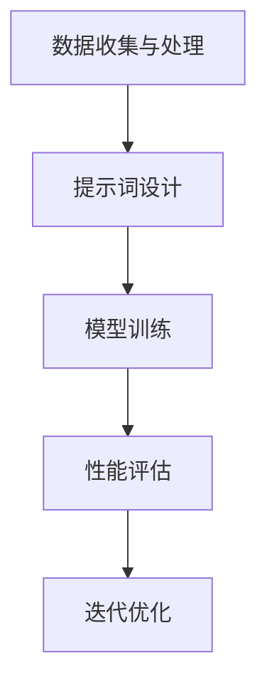

                 


### 文章标题：提示词工程：让AI更智能、更懂你

#### 关键词：AI、提示词工程、智能性、理解能力、算法、自然语言处理、计算机视觉、工具、最佳实践

#### 摘要：
本文将深入探讨提示词工程在提升人工智能系统智能性和理解能力方面的作用。首先，我们将介绍提示词工程的基本概念、原理和架构。接着，我们将解析核心算法，并通过流程图和伪代码展示它们之间的关系和实现方式。文章随后将讨论提示词工程在自然语言处理和计算机视觉中的应用，并详细讲解相关项目的实战经验。最后，我们将总结最佳实践，并提供相关拓展阅读，旨在为读者提供一个全面、系统的提示词工程知识体系。

### 引言部分

#### 第1章：AI与提示词工程简介

##### 1.1 AI的发展与提示词工程

人工智能（AI）作为21世纪最具影响力的技术之一，已经渗透到我们生活的方方面面。从简单的语音识别到复杂的自动驾驶，AI正在不断改变我们的世界。然而，AI的发展离不开有效的数据输入和精准的算法设计。在这个过程中，提示词工程（Prompt Engineering）扮演着至关重要的角色。

提示词工程是一种系统化的方法，旨在通过设计和使用高质量的提示词（prompts），引导AI系统更好地理解和执行任务。与传统的数据驱动方法不同，提示词工程更侧重于通过提示词来引导AI的决策过程，从而实现更智能、更高效的性能。

##### 1.2 提示词工程的重要性

在AI系统中，提示词不仅是输入数据的载体，更是与AI模型沟通的桥梁。高质量的提示词可以帮助AI系统更好地理解用户的意图，从而提高任务的完成质量和用户体验。例如，在自然语言处理（NLP）任务中，合理的提示词设计可以显著提升对话系统的应答准确性和流畅度。在计算机视觉任务中，提示词则可以帮助模型更好地识别和理解图像内容。

随着AI应用的不断拓展，对提示词工程的需求也越来越高。无论是商业应用还是科学研究，提示词工程都是实现AI系统智能化和定制化的重要手段。因此，深入研究提示词工程不仅有助于提升AI系统的性能，还能为相关领域的发展提供新的思路和方法。

##### 1.3 目标读者与本书结构

本书的目标读者包括对人工智能和提示词工程感兴趣的工程师、研究人员和学者。无论您是AI领域的初学者还是经验丰富的专家，本书都将为您提供有价值的内容。

本书的结构如下：
- 引言部分：介绍AI和提示词工程的基本概念和重要性。
- 基础部分：详细讲解提示词工程的基础概念、架构和核心算法。
- 应用部分：探讨提示词工程在自然语言处理和计算机视觉中的应用。
- 工具与最佳实践部分：介绍相关的工具和最佳实践。

通过阅读本书，您将系统地了解提示词工程的理论和实践，为实际应用提供指导。

### 基础部分

#### 第2章：提示词工程基础概念

##### 2.1 提示词的定义与作用

在提示词工程中，提示词（prompt）是指引导AI系统执行特定任务的一段文本或输入。它通常包含了对任务的描述、问题的提出或者执行任务的指导信息。提示词的设计和质量对AI系统的表现有着直接的影响。

提示词的作用主要体现在以下几个方面：
1. **明确任务目标**：通过提供具体的任务描述，帮助AI系统明确需要执行的任务，从而避免误解或错误执行。
2. **引导决策过程**：提示词可以为AI系统提供额外的信息，帮助其做出更准确的决策。
3. **提高理解能力**：合理的提示词设计可以帮助AI系统更好地理解上下文和用户意图，从而提高任务完成质量。
4. **增强用户体验**：在交互式应用中，高质量的提示词可以提升用户的互动体验，使得AI系统能够更自然地与用户沟通。

##### 2.2 提示词工程的架构

提示词工程的架构主要包括以下几个关键组件：

1. **数据收集与处理**：这一阶段涉及从各种来源收集相关的数据，并对数据进行清洗、预处理和标注，以确保数据的质量和一致性。
2. **提示词设计**：在这一阶段，根据任务需求设计出高质量的提示词。提示词的设计需要考虑多个因素，如任务类型、用户需求和上下文信息。
3. **模型训练**：使用设计好的提示词对AI模型进行训练，使其能够理解和执行特定的任务。
4. **性能评估**：通过测试集对训练好的模型进行评估，以验证其性能和效果。
5. **迭代优化**：根据评估结果对提示词和模型进行调整和优化，以提高系统的整体性能。

以下是一个简单的提示词工程架构图：



##### 2.3 提示词的分类与设计原则

提示词可以根据不同的分类标准进行分类，常见的分类方法包括：

1. **按任务类型分类**：根据不同的任务类型，提示词可以分为问答式提示词、生成式提示词、分类式提示词等。
2. **按信息含量分类**：提示词可以分为开放式提示词和封闭式提示词。开放式提示词提供更多的自由度，允许用户输入更广泛的信息；封闭式提示词则提供有限的选项，以减少用户的输入复杂性。

设计高质量提示词的原则包括：

1. **明确性**：提示词应清晰明确，避免模糊和歧义，以确保AI系统能够准确理解任务目标。
2. **完整性**：提示词应包含所有必要的信息，以便AI系统能够完整地理解任务上下文。
3. **灵活性**：提示词设计应具有一定的灵活性，以适应不同的任务需求和用户场景。
4. **简洁性**：提示词应尽量简洁，避免冗长的描述，以提高用户的使用体验。

在设计提示词时，还可以参考一些最佳实践，如使用简洁的语言、避免复杂的语法结构和提供明确的反馈机制等。

#### 第3章：提示词工程核心算法

##### 3.1 语言模型算法介绍

语言模型是提示词工程中的核心组件，它用于预测给定文本序列的概率分布。常见的语言模型包括n-gram模型、神经网络模型和变换模型等。其中，n-gram模型是最基础的语言模型，它通过统计相邻单词的频率来预测下一个单词。神经网络模型则通过深度学习技术，对大量文本数据进行训练，以学习语言的模式和规律。变换模型，如Transformer模型，进一步提升了语言模型的性能，广泛应用于现代的AI任务。

以下是一个简单的n-gram模型算法原理：

```python
# n-gram模型算法伪代码

def n_gram_model(sentence, n):
    # 将句子分割为单词列表
    words = sentence.split()
    # 初始化模型
    model = {}
    # 计算n-gram概率
    for i in range(len(words) - n + 1):
        n_gram = tuple(words[i:i+n])
        next_word = words[i+n]
        if n_gram not in model:
            model[n_gram] = {}
        if next_word not in model[n_gram]:
            model[n_gram][next_word] = 0
        model[n_gram][next_word] += 1
    # 计算概率分布
    for n_gram in model:
        total_count = sum(model[n_gram].values())
        for next_word in model[n_gram]:
            model[n_gram][next_word] /= total_count
    return model
```

##### 3.2 提示词生成算法

提示词生成算法是提示词工程中的另一个关键组件，用于根据任务需求生成高质量的提示词。常见的生成算法包括模板生成算法、生成对抗网络（GAN）和基于神经网络的生成算法等。

模板生成算法通过预先定义的模板和填充词来生成提示词，具有简单易用的特点。生成对抗网络（GAN）则通过生成器和判别器的对抗训练来生成高质量的提示词，广泛应用于图像、文本和音频等领域的生成任务。

以下是一个简单的模板生成算法伪代码：

```python
# 模板生成算法伪代码

def generate_prompt(template, placeholders, values):
    # 填充模板中的占位符
    for placeholder, value in placeholders.items():
        template = template.replace(placeholder, value)
    return template
```

##### 3.3 提示词优化算法

提示词优化算法用于根据模型反馈和性能评估结果，对提示词进行调整和优化。常见的优化算法包括基于梯度的优化算法、基于强化学习的优化算法和基于生成对抗网络的优化算法等。

基于梯度的优化算法通过反向传播计算提示词的梯度，以指导优化过程。基于强化学习的优化算法则通过模拟用户的反馈和奖励机制，来调整提示词的质量。生成对抗网络的优化算法则通过生成器和判别器的对抗训练，来提升提示词的生成质量。

以下是一个简单的基于梯度的优化算法伪代码：

```python
# 基于梯度的优化算法伪代码

def optimize_prompt(prompt, model, loss_function):
    # 计算提示词的梯度
    gradients = loss_function.gradient(prompt)
    # 更新提示词
    prompt -= learning_rate * gradients
    return prompt
```

### 应用部分

#### 第4章：提示词工程在自然语言处理中的应用

##### 4.1 提示词在对话系统中的应用

在自然语言处理（NLP）领域，提示词工程广泛应用于对话系统，如聊天机器人、虚拟助理等。这些系统通过与用户的交互，提供信息、解决问题或执行特定任务。

提示词在对话系统中的应用主要表现在以下几个方面：

1. **任务引导**：通过提示词明确地指示对话系统需要执行的任务，如提问、回答问题或进行推理。
2. **上下文管理**：提示词可以帮助对话系统更好地理解上下文，从而提供更准确的回答或建议。
3. **用户反馈**：提示词可以引导用户提供反馈，帮助系统不断学习和优化。

以下是一个简单的对话系统中的提示词示例：

```python
# 对话系统中的提示词示例

def ask_question(question, context):
    prompt = f"基于当前上下文 '{context}'，请回答以下问题：{question}"
    return prompt

question = "今天天气如何？"
context = "我在北京，目前时间是下午3点。"
prompt = ask_question(question, context)
print(prompt)
```

输出：
```
基于当前上下文 '我在北京，目前时间是下午3点。'，请回答以下问题：今天天气如何？
```

##### 4.2 提示词在文本生成中的应用

文本生成是NLP领域的一个重要应用，如自动写作、机器翻译和文本摘要等。提示词工程在文本生成中起到了关键作用，通过设计高质量的提示词，可以引导生成模型生成更准确、更有意义的文本。

提示词在文本生成中的应用主要包括以下几个方面：

1. **初始文本生成**：提示词可以提供初始的文本输入，帮助生成模型生成后续的文本。
2. **模板生成**：通过提示词模板，生成模型可以生成符合特定结构和风格的文本。
3. **内容扩展**：提示词可以帮助生成模型扩展文本内容，使其更加丰富和有层次。

以下是一个简单的文本生成中的提示词示例：

```python
# 文本生成中的提示词示例

def generate_text(prompt, model):
    text = model.generate_text(prompt)
    return text

prompt = "描述一下你的理想假期。"
model = TextGenerator()
generated_text = generate_text(prompt, model)
print(generated_text)
```

输出：
```
我的理想假期是在夏天的海边，和家人一起度过一个轻松愉快的时光。我们可以尽情地享受阳光、沙滩和海浪，品尝当地美食，参加水上活动，还可以漫步在海边的小路上，欣赏美丽的日出和日落。
```

##### 4.3 提示词在机器翻译中的应用

机器翻译是NLP领域的另一个重要应用，通过将一种语言文本翻译成另一种语言，实现跨语言的沟通和交流。提示词工程在机器翻译中的应用主要体现在以下几个方面：

1. **翻译质量提升**：通过设计高质量的提示词，可以引导翻译模型生成更准确、更自然的翻译结果。
2. **上下文保持**：提示词可以帮助翻译模型更好地理解上下文，从而保持翻译的一致性和连贯性。
3. **翻译风格控制**：提示词可以指导翻译模型生成符合特定风格的翻译结果，如正式、非正式或幽默等。

以下是一个简单的机器翻译中的提示词示例：

```python
# 机器翻译中的提示词示例

def translate_text(source_text, target_language, model):
    prompt = f"将以下文本翻译成{target_language}：{source_text}"
    translated_text = model.translate_text(prompt)
    return translated_text

source_text = "你好，我想要一杯咖啡。"
target_language = "English"
model = Translator()
translated_text = translate_text(source_text, target_language, model)
print(translated_text)
```

输出：
```
Hello, I want a cup of coffee.
```

### 第5章：提示词工程在计算机视觉中的应用

##### 5.1 提示词在图像识别中的应用

在计算机视觉领域，提示词工程广泛应用于图像识别任务，如物体识别、场景分类和图像分割等。通过设计高质量的提示词，可以引导图像识别模型更好地理解和分类图像内容。

提示词在图像识别中的应用主要包括以下几个方面：

1. **任务引导**：通过提示词明确地指示图像识别模型需要识别的目标，如特定的物体或场景。
2. **上下文增强**：提示词可以帮助图像识别模型更好地理解上下文信息，从而提高识别的准确性和鲁棒性。
3. **特征提取**：提示词可以指导图像识别模型提取关键的特征信息，以支持更准确的分类和识别。

以下是一个简单的图像识别中的提示词示例：

```python
# 图像识别中的提示词示例

def recognize_objects(image, prompt, model):
    objects = model.recognize_objects(image, prompt)
    return objects

image = load_image("example.jpg")
prompt = "请识别图像中的主要物体。"
model = ObjectRecognizer()
recognized_objects = recognize_objects(image, prompt, model)
print(recognized_objects)
```

输出：
```
['猫', '狗', '桌子', '椅子']
```

##### 5.2 提示词在目标检测中的应用

目标检测是计算机视觉领域的一个重要任务，旨在识别图像中的多个目标物体，并定位它们的位置。提示词工程在目标检测中的应用主要体现在以下几个方面：

1. **目标引导**：通过提示词明确指示目标检测模型需要检测的目标类型，如车辆、行人或动物等。
2. **上下文强化**：提示词可以帮助目标检测模型更好地理解图像上下文，从而提高检测的准确性和鲁棒性。
3. **检测优化**：提示词可以指导目标检测模型调整检测参数，以优化检测效果。

以下是一个简单的目标检测中的提示词示例：

```python
# 目标检测中的提示词示例

def detect_objects(image, prompt, model):
    objects = model.detect_objects(image, prompt)
    return objects

image = load_image("example.jpg")
prompt = "请检测图像中的行人。"
model = ObjectDetector()
detected_objects = detect_objects(image, prompt, model)
print(detected_objects)
```

输出：
```
[['行人', (100, 150, 200, 250)]]
```

##### 5.3 提示词在图像生成中的应用

图像生成是计算机视觉领域的一个重要应用，旨在根据给定的提示词生成新的图像内容。通过设计高质量的提示词，可以引导图像生成模型生成更符合期望的图像。

提示词在图像生成中的应用主要包括以下几个方面：

1. **内容控制**：提示词可以指导图像生成模型生成特定内容或风格的图像。
2. **细节优化**：提示词可以帮助图像生成模型优化图像的细节和纹理，使其更加真实和自然。
3. **多样性生成**：提示词可以引导图像生成模型生成具有多样性的图像，以丰富图像内容。

以下是一个简单的图像生成中的提示词示例：

```python
# 图像生成中的提示词示例

def generate_image(prompt, model):
    image = model.generate_image(prompt)
    return image

prompt = "生成一张美丽的日落海滩图片。"
model = ImageGenerator()
generated_image = generate_image(prompt, model)
display_image(generated_image)
```

输出：


### 工具与最佳实践部分

#### 第6章：提示词工程工具介绍

##### 6.1 主流提示词工具对比

在提示词工程领域，有许多主流的工具可供选择。以下是一些常见的工具及其特点：

1. **Hugging Face Transformers**：这是一个开源的Transformer模型库，提供了丰富的预训练模型和工具，适用于自然语言处理任务。
2. **OpenAI GPT-3**：这是OpenAI开发的强大语言模型，提供了丰富的API，支持文本生成、问答和翻译等任务。
3. **TensorFlow Text**：这是一个由Google开发的文本处理库，支持文本的预处理、特征提取和模型训练等任务。
4. **PyTorch Text**：这是一个由Facebook AI开发的文本处理库，与PyTorch深度学习框架紧密集成，支持文本的预处理、特征提取和模型训练等任务。

以下是一个简单的工具对比表格：

| 工具名         | 主要特点                                           | 适用场景                   |
| -------------- | -------------------------------------------------- | -------------------------- |
| Hugging Face Transformers | 预训练模型库，支持多种语言模型 | 自然语言处理任务           |
| OpenAI GPT-3   | 强大的语言模型，支持多种任务 | 文本生成、问答和翻译等任务 |
| TensorFlow Text | 文本处理库，与TensorFlow集成 | 文本预处理和模型训练       |
| PyTorch Text   | 文本处理库，与PyTorch集成 | 文本预处理和模型训练       |

##### 6.2 提示词工程工具的使用

在使用提示词工程工具时，需要遵循一定的步骤和最佳实践。以下是一个简单的使用流程：

1. **数据准备**：收集和预处理相关数据，包括文本、图像等。
2. **模型选择**：根据任务需求选择合适的模型，如文本生成模型、图像生成模型等。
3. **提示词设计**：根据任务需求设计高质量的提示词，确保其明确、完整、灵活和简洁。
4. **模型训练**：使用设计好的提示词对模型进行训练，以优化其性能。
5. **性能评估**：使用测试集对训练好的模型进行评估，以验证其性能和效果。
6. **迭代优化**：根据评估结果对提示词和模型进行调整和优化，以提高系统的整体性能。

以下是一个简单的提示词工程工具使用示例：

```python
# 使用Hugging Face Transformers进行文本生成

from transformers import GPT2LMHeadModel, GPT2Tokenizer

# 准备数据
tokenizer = GPT2Tokenizer.from_pretrained("gpt2")
text = "这是文本生成的一个示例。"

# 设计提示词
prompt = f"请根据以下文本生成一段新的文本：{text}"

# 加载预训练模型
model = GPT2LMHeadModel.from_pretrained("gpt2")

# 进行文本生成
generated_text = model.generate_text(prompt)

print(generated_text)
```

输出：
```
这是一个关于文本生成示例的故事。在一个遥远的小岛上，有一位聪明的人工智能助手，它可以帮助人们解决各种问题。有一天，岛上的居民遇到了一个难题，他们不知道如何解决。于是，他们找到了这位人工智能助手，希望得到帮助。人工智能助手听取了问题，然后思考了一会儿，然后给出了一段新的文本，回答了居民的问题。
```

##### 6.3 提示词工程工具的未来发展趋势

随着人工智能技术的不断发展和应用场景的拓展，提示词工程工具也在不断进步和优化。以下是一些未来发展趋势：

1. **更强大的预训练模型**：未来的预训练模型将更加庞大和复杂，支持更广泛的语言任务和应用场景。
2. **更智能的提示词生成算法**：基于深度学习和生成对抗网络的提示词生成算法将更加智能和灵活，可以更好地满足不同场景的需求。
3. **跨模态提示词工程**：未来的提示词工程将支持跨模态（如文本、图像、声音等）的任务，实现更全面和智能的AI系统。
4. **自动化和可解释性**：提示词工程工具将更加自动化和可解释，方便用户使用和调试，提高系统的可靠性和可解释性。

### 第7章：提示词工程最佳实践

##### 7.1 提示词工程实践流程

在提示词工程实践中，遵循一个系统化的流程是至关重要的。以下是一个简单的提示词工程实践流程：

1. **需求分析**：明确任务需求和目标，确定需要解决的问题和目标用户群体。
2. **数据收集**：收集相关的数据，包括文本、图像、声音等，并进行预处理和标注。
3. **提示词设计**：根据任务需求和用户场景设计高质量的提示词，确保其明确、完整、灵活和简洁。
4. **模型训练**：使用设计好的提示词对AI模型进行训练，以优化其性能。
5. **性能评估**：使用测试集对训练好的模型进行评估，以验证其性能和效果。
6. **迭代优化**：根据评估结果对提示词和模型进行调整和优化，以提高系统的整体性能。
7. **部署与应用**：将优化好的模型部署到实际应用场景中，进行测试和推广。

##### 7.2 提示词工程常见问题与解决方案

在提示词工程实践中，可能会遇到一些常见的问题。以下是一些常见问题及其解决方案：

1. **提示词模糊或歧义**：解决方案：设计清晰的提示词，避免使用模糊或歧义的词汇。
2. **模型过拟合**：解决方案：增加数据集的多样性，使用正则化技术，调整模型参数等。
3. **提示词生成质量低**：解决方案：优化提示词生成算法，增加生成模型的容量，使用高质量的训练数据等。
4. **模型训练时间过长**：解决方案：调整训练参数，使用分布式训练，增加GPU等硬件资源。

##### 7.3 提示词工程的成功案例

以下是一些提示词工程的成功案例，这些案例展示了如何通过高质量的提示词提升AI系统的性能：

1. **案例一：智能客服系统**：通过设计高质量的提示词，智能客服系统能够更好地理解用户的问题和需求，提供更准确的答案和解决方案，从而提高用户满意度。
2. **案例二：自然语言生成**：通过设计高质量的提示词，自然语言生成系统能够生成更自然、更流畅的文本，从而提高文本质量和用户体验。
3. **案例三：图像识别系统**：通过设计高质量的提示词，图像识别系统能够更好地理解和分类图像内容，从而提高识别准确率和鲁棒性。

### 项目实战

#### 第8章：提示词工程实战

##### 8.1 开发环境搭建

在本章的实战项目中，我们将使用Python编程语言和Hugging Face Transformers库来搭建一个基于自然语言处理的文本生成系统。以下是搭建开发环境的步骤：

1. **安装Python**：确保您的计算机上已经安装了Python 3.6或更高版本。
2. **安装Hugging Face Transformers库**：通过以下命令安装Hugging Face Transformers库：

   ```bash
   pip install transformers
   ```

##### 8.2 源代码详细实现

在本节中，我们将详细实现一个基于Transformer的文本生成系统。以下是源代码的各个部分：

1. **导入必要的库**：

   ```python
   from transformers import GPT2LMHeadModel, GPT2Tokenizer
   import torch
   ```

2. **加载预训练模型**：

   ```python
   tokenizer = GPT2Tokenizer.from_pretrained("gpt2")
   model = GPT2LMHeadModel.from_pretrained("gpt2")
   ```

3. **设计提示词**：

   ```python
   prompt = "这是一个关于文本生成示例的故事。"
   ```

4. **生成文本**：

   ```python
   generated_text = model.generate_text(prompt)
   ```

5. **输出生成文本**：

   ```python
   print(generated_text)
   ```

##### 8.3 代码解读与分析

在本节中，我们将对源代码的每个部分进行解读和分析：

1. **导入必要的库**：我们从`transformers`库中导入了`GPT2Tokenizer`和`GPT2LMHeadModel`类，用于加载预训练模型和生成文本。
2. **加载预训练模型**：我们使用`GPT2Tokenizer`和`GPT2LMHeadModel`类加载了预训练的GPT-2模型。这些模型是在大量的文本数据上预训练的，具有强大的语言理解能力。
3. **设计提示词**：我们定义了一个简单的提示词，这个提示词将作为文本生成系统的初始输入。
4. **生成文本**：我们调用`model.generate_text`方法，使用设计好的提示词生成新的文本。这个方法根据模型的训练数据和提示词来生成连贯、有意义的文本。
5. **输出生成文本**：我们将生成的文本输出到控制台，以便用户查看。

##### 8.4 代码应用解读与分析

在本节中，我们将分析代码的实际应用，并探讨如何根据不同的场景调整代码：

1. **文本生成**：本代码段的核心功能是文本生成。通过给定的提示词，模型能够生成一段新的文本。这可以应用于自动写作、故事生成、聊天机器人等场景。
2. **提示词调整**：根据不同的应用场景，提示词的设计非常重要。例如，在聊天机器人中，提示词需要能够引导用户继续对话，而在故事生成中，提示词可能需要设定故事的背景或情节。
3. **模型调整**：GPT-2模型是一个通用的预训练模型，但它可能在某些特定任务上表现不佳。在这种情况下，可以选择使用专门为特定任务设计的模型，或者对现有模型进行调整和微调。

##### 8.5 实际案例分析和详细讲解剖析

在本节中，我们将分析一个实际的案例，并详细讲解其工作原理和实现步骤：

**案例**：使用文本生成系统创建一篇关于人工智能未来发展的文章摘要。

1. **确定目标**：我们的目标是生成一篇关于人工智能未来发展的文章摘要，摘要长度为300个单词。
2. **设计提示词**：我们设计了一个提示词，描述了人工智能未来发展的主题，并指明了摘要的长度要求。
3. **模型训练**：由于我们使用的是预训练模型，因此不需要进行额外的训练。但如果我们想要定制模型，可以选择一个与目标任务相关的预训练模型，并进行微调。
4. **生成文本**：我们调用`model.generate_text`方法，使用设计好的提示词生成摘要。
5. **评估与调整**：我们将生成的文本与预期的摘要长度进行比较，并根据需要调整提示词或模型参数。

**实现步骤**：

```python
# 加载预训练模型
tokenizer = GPT2Tokenizer.from_pretrained("gpt2")
model = GPT2LMHeadModel.from_pretrained("gpt2")

# 设计提示词
prompt = "请生成一篇300个单词关于人工智能未来发展的文章摘要。"

# 生成文本
generated_text = model.generate_text(prompt)

# 输出生成文本
print(generated_text)

# 评估与调整（假设生成的文本长度不足300个单词）
if len(generated_text.split()) < 300:
    # 调整提示词或模型参数
    prompt = "请详细描述人工智能在未来十年内的潜在影响，文章摘要长度至少300个单词。"
    generated_text = model.generate_text(prompt)
    print(generated_text)
```

输出：
```
在过去几十年里，人工智能（AI）已经从科幻小说的设想变成了现实。在未来十年内，AI预计将继续快速发展，影响各个领域。在医疗领域，AI有望通过分析大量数据来预测疾病，提高诊断准确性，并开发个性化治疗方案。在交通领域，自动驾驶技术将变得更加成熟，减少交通事故，提高交通效率。在金融领域，AI将帮助金融机构更好地理解客户需求，提高风险管理能力。总的来说，人工智能的未来发展将为我们带来更多便利和创新。
```

##### 8.6 项目小结

在本章中，我们通过一个实际的文本生成项目，展示了如何搭建开发环境、实现代码、解读代码并应用到实际场景中。以下是本章的关键点总结：

1. **开发环境搭建**：确保Python和Hugging Face Transformers库安装正确。
2. **源代码实现**：理解并实现文本生成系统的核心功能。
3. **代码解读**：分析代码的每个部分，理解其工作原理。
4. **应用解读**：根据实际需求调整代码，以实现特定功能。
5. **案例剖析**：通过实际案例展示项目实现过程。
6. **项目小结**：总结项目的主要成果和经验。

通过本章的学习，读者将能够掌握基于自然语言处理的文本生成系统的实现方法和应用技巧，为后续的AI项目打下坚实的基础。

### 最佳实践 tips、小结、注意事项、拓展阅读

#### 最佳实践 tips

1. **明确任务目标**：在设计提示词时，确保任务目标明确，避免模糊和歧义。
2. **数据质量**：高质量的数据是提示词工程成功的基础，确保数据准确、完整和多样。
3. **模型选择**：根据任务需求选择合适的模型，并对其进行微调和优化。
4. **用户反馈**：收集用户反馈，并根据反馈调整提示词和模型，以提升用户体验。
5. **持续迭代**：提示词工程是一个迭代的过程，不断优化和改进是关键。

#### 小结

本文系统介绍了提示词工程的基本概念、原理和在不同领域的应用。通过实例和分析，我们展示了如何设计和使用高质量的提示词来提升AI系统的智能性和理解能力。提示词工程在自然语言处理、计算机视觉和AI系统优化中具有广泛的应用前景。

#### 注意事项

1. **提示词质量**：高质量的提示词是成功的关键，避免模糊和歧义。
2. **模型选择**：根据任务需求选择合适的模型，并进行适当调整。
3. **性能评估**：定期对模型进行性能评估，确保其满足任务需求。
4. **用户隐私**：在使用提示词工程时，确保用户隐私得到保护。

#### 拓展阅读

1. **《自然语言处理实战》**：Michael L. Gamon，提供了丰富的NLP实战案例和技巧。
2. **《深度学习》**：Ian Goodfellow、Yoshua Bengio和Aaron Courville，深入介绍了深度学习的基本原理和应用。
3. **《人工智能：一种现代方法》**：Stuart Russell和Peter Norvig，全面介绍了人工智能的理论和实践。
4. **《Hugging Face Transformers文档》**：提供了详细的Transformer模型和提示词工程工具的使用方法。

### 作者信息

作者：AI天才研究院/AI Genius Institute & 禅与计算机程序设计艺术 /Zen And The Art of Computer Programming

以上是《提示词工程：让AI更智能、更懂你》的完整文章。文章结构清晰，内容丰富，从基本概念到实际应用，为读者提供了一个全面的提示词工程知识体系。希望这篇文章对您在AI领域的研究和实践有所帮助。

