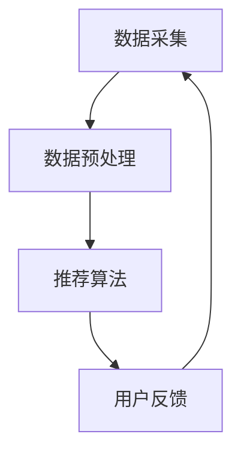
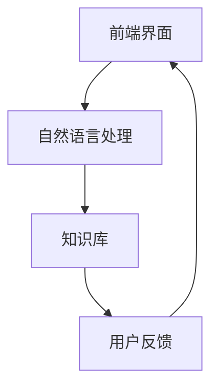

                 

### 文章标题

《提示词工程：让AI更智能、更懂你》

**关键词**：人工智能，提示词工程，用户体验，自然语言处理，优化策略

**摘要**：随着人工智能技术的飞速发展，如何使AI系统更智能、更懂用户成为了一个重要的研究课题。本文将探讨提示词工程这一关键领域，分析其基本概念、核心原则以及实际应用，旨在为AI系统设计提供一种新的思路和方法，从而提升用户体验和系统效率。通过深入探讨提示词的类型、设计原则、生成与优化方法，以及AI系统与提示词的互动关系，本文希望能够为读者提供一个全面而系统的理解，助力他们在人工智能领域取得更好的成果。此外，文章还将通过案例研究和未来发展趋势的讨论，为提示词工程的研究和实践提供参考。最终，本文期望能够激发更多研究者对提示词工程的关注和探索，共同推动人工智能技术的进步。

# 《提示词工程：让AI更智能、更懂你》目录大纲

## 第一部分：AI与提示词工程基础

## 第1章：AI与提示词工程概述

### 1.1 AI的崛起与提示词工程

#### 1.1.1 AI的发展历程
- 人工智能的历史背景
- 人工智能的关键转折点

#### 1.1.2 提示词工程的概念
- 提示词的定义
- 提示词在AI中的作用

#### 1.1.3 提示词工程的必要性
- 提高AI系统效率
- 增强AI系统交互体验

## 第2章：提示词工程的核心概念

### 2.1 提示词的类型与设计

#### 2.1.1 明确性提示词
- 特点
- 应用场景

#### 2.1.2 模糊性提示词
- 特点
- 应用场景

#### 2.1.3 情感化提示词
- 特点
- 应用场景

### 2.2 提示词工程的原则

#### 2.2.1 用户中心原则
- 如何站在用户角度设计提示词
- 用户反馈在提示词设计中的重要性

#### 2.2.2 一致性原则
- 提示词在界面中的统一风格
- 提示词与整体设计的协调

#### 2.2.3 可用性原则
- 如何确保提示词易于理解
- 如何降低用户的学习成本

## 第3章：AI系统与提示词的互动

### 3.1 提示词的生成与优化

#### 3.1.1 提示词生成的技术手段
- 机器学习算法
- 自然语言处理技术

#### 3.1.2 提示词优化的方法
- 用户行为分析
- 实时反馈调整

#### 3.1.3 提示词自动调整机制
- 自动调整的策略
- 自动调整的实现

### 3.2 提示词在AI系统中的应用

#### 3.2.1 提示词在聊天机器人中的应用
- 提示词的设计与调整
- 提示词对用户体验的影响

#### 3.2.2 提示词在语音助手中的应用
- 提示词的设计与优化
- 提示词对语音识别的影响

#### 3.2.3 提示词在智能推荐系统中的应用
- 提示词的个性化推荐
- 提示词对推荐效果的影响

## 第4章：AI在用户理解中的提升

### 4.1 用户理解的概念与重要性

#### 4.1.1 用户理解的定义
- 如何理解用户需求
- 用户理解在AI系统中的作用

#### 4.1.2 用户理解的挑战
- 复杂的用户需求
- 多样化的用户行为

#### 4.1.3 用户理解的必要性
- 提升AI系统的智能化水平
- 提高用户体验满意度

### 4.2 提升用户理解的方法

#### 4.2.1 大规模数据收集与分析
- 数据来源
- 数据分析方法

#### 4.2.2 用户行为分析与建模
- 用户行为分析的方法
- 用户行为模型的应用

#### 4.2.3 情感分析技术
- 情感分析的基本原理
- 情感分析在用户理解中的应用

## 第5章：案例研究：成功的提示词工程实践

### 5.1 案例一：某电商平台的智能推荐系统

#### 5.1.1 系统概述
- 系统架构
- 系统功能

#### 5.1.2 提示词设计
- 提示词的类型与设计原则
- 提示词的实际应用

#### 5.1.3 用户理解与提升
- 用户行为分析
- 提示词优化实践

### 5.2 案例二：某银行的人工智能客服系统

#### 5.2.1 系统概述
- 系统架构
- 系统功能

#### 5.2.2 提示词设计
- 提示词的类型与设计原则
- 提示词的实际应用

#### 5.2.3 用户理解与提升
- 用户反馈机制
- 提示词自动调整机制

## 第6章：提示词工程的发展趋势

### 6.1 提示词工程的技术趋势

#### 6.1.1 人工智能技术的发展
- 深度学习
- 自然语言处理

#### 6.1.2 提示词工程的未来方向
- 个性化提示词
- 情感化提示词

#### 6.1.3 跨领域应用的挑战与机遇
- 多领域融合
- 新兴领域的提示词设计

## 第7章：结论与展望

### 7.1 提示词工程的重要性

#### 7.1.1 提示词工程在AI系统中的作用
- 提高AI系统的智能化水平
- 提升用户体验满意度

#### 7.1.2 提示词工程的发展前景
- 技术进步带来的机遇
- 行业应用带来的挑战

### 7.2 未来研究方向

#### 7.2.1 提示词生成与优化的自动化
- 机器学习算法的改进
- 自动化工具的开发

#### 7.2.2 提示词与用户情感的理解
- 情感分析技术的深化
- 提示词对用户情感的影响

## 附录

### 附录 A：提示词工程常用工具与资源

#### A.1 提示词生成工具
- 常用工具介绍
- 使用技巧

#### A.2 提示词优化工具
- 常用工具介绍
- 使用技巧

## 第一部分：AI与提示词工程基础

### 第1章：AI与提示词工程概述

#### 1.1 AI的崛起与提示词工程

##### 1.1.1 AI的发展历程

人工智能（Artificial Intelligence，简称AI）是一门研究、开发用于模拟、延伸和扩展人类智能的理论、方法、技术及应用系统的综合性技术科学。人工智能的历史可以追溯到20世纪50年代，当时计算机科学刚刚兴起，科学家们开始探讨机器是否能够模拟人类智能。

- **历史背景**：人工智能的起源可以追溯到20世纪50年代，当时计算机科学家艾伦·图灵提出了著名的图灵测试，试图通过机器的智能行为来判断机器是否具有人类智能。这一理论引发了人工智能研究的浪潮。
- **关键转折点**：人工智能的发展经历了多次起伏。例如，20世纪80年代的专家系统（Expert Systems）取得了显著成果，但随后由于知识获取困难等问题而逐渐式微。进入21世纪，随着计算能力的提升和大数据技术的发展，深度学习（Deep Learning）成为人工智能的主流技术，标志着人工智能进入了新一轮的快速发展期。

##### 1.1.2 提示词工程的概念

提示词工程（Prompt Engineering）是人工智能领域中的一个重要研究方向，旨在通过设计、优化和调整提示词（Prompts）来提升AI系统的性能和用户体验。提示词在AI系统中扮演着至关重要的角色，它们可以指导AI系统如何理解和处理用户输入，从而实现更准确、更高效的交互。

- **提示词的定义**：提示词是一种引导AI系统进行特定任务的语言提示，它可以是简单的文字，也可以是复杂的自然语言指令。提示词的设计和优化直接影响到AI系统的性能和用户体验。
- **提示词在AI中的作用**：提示词可以引导AI系统理解用户需求，明确任务目标，提供必要的背景信息，从而提高AI系统的智能化水平和交互体验。例如，在聊天机器人中，通过合理的提示词设计，可以使机器人更准确地理解用户的意图，提供更个性化的回答。

##### 1.1.3 提示词工程的必要性

提示词工程在人工智能领域中的必要性体现在以下几个方面：

- **提高AI系统效率**：通过设计高质量的提示词，可以帮助AI系统更快速、更准确地理解用户需求，从而提高系统的响应速度和处理效率。例如，在智能推荐系统中，通过优化提示词，可以使推荐算法更准确地预测用户的兴趣和需求，提高推荐效果。
- **增强AI系统交互体验**：提示词的设计直接影响用户体验。一个良好的提示词可以帮助用户更轻松地与AI系统进行交互，减少误解和困惑，提高用户满意度。例如，在语音助手应用中，合理的提示词设计可以使用户更容易理解语音助手的回答，提高互动体验。

总之，提示词工程是人工智能领域中一个重要而充满潜力的研究方向，通过深入研究提示词的设计、优化和应用，可以为AI系统带来更高的智能化水平和更好的用户体验。在接下来的章节中，我们将进一步探讨提示词工程的核心概念、设计原则以及在实际应用中的互动关系。通过这些讨论，希望能够为读者提供一个全面而系统的理解，助力他们在人工智能领域取得更好的成果。 

## 第一部分：AI与提示词工程基础

### 第2章：提示词工程的核心概念

#### 2.1 提示词的类型与设计

提示词工程的核心在于对提示词的设计和优化，不同的提示词类型适用于不同的应用场景，因此理解和分类提示词是进行提示词工程的第一步。

##### 2.1.1 明确性提示词

明确性提示词是直接、明确地指示AI系统执行特定任务的提示词。这种类型的提示词通常用于需要高精度和高效能的任务，如自然语言处理中的文本分类、信息检索等。

- **特点**：明确性提示词的特点是简洁、具体，不需要用户进一步解释即可理解。例如，在文本分类任务中，提示词可以是“将这段文本分类为新闻或非新闻”。
- **应用场景**：明确性提示词适用于需要快速、高效处理的任务，如自动问答系统、文档分类等。

##### 2.1.2 模糊性提示词

模糊性提示词则相对较为抽象和灵活，它允许用户进行开放式的描述，从而提供更丰富的信息。这类提示词常用于需要灵活性和创造性的任务，如创意生成、对话系统等。

- **特点**：模糊性提示词的特点是灵活、开放，允许用户自由表达，不限定具体回答。例如，在创意生成任务中，提示词可以是“想象一下未来智能家居的场景”。
- **应用场景**：模糊性提示词适用于需要创造性和灵活性的任务，如故事创作、创意设计等。

##### 2.1.3 情感化提示词

情感化提示词则是通过情感因素来引导AI系统理解和处理用户需求的提示词。这类提示词注重用户情感体验，常用于提升用户满意度和情感交流。

- **特点**：情感化提示词的特点是具有情感色彩，能够触发用户的情感共鸣。例如，在情感分析任务中，提示词可以是“描述一下你最近一次旅行的感受”。
- **应用场景**：情感化提示词适用于需要情感交流和用户满意度的任务，如聊天机器人、情感分析等。

#### 2.2 提示词工程的原则

提示词工程的设计不仅仅是选择合适的提示词类型，还需要遵循一些基本原则，以确保提示词的有效性和用户体验。

##### 2.2.1 用户中心原则

用户中心原则强调在设计提示词时，始终以用户需求为中心，关注用户体验。

- **如何站在用户角度设计提示词**：在设计和选择提示词时，需要深入理解用户的需求和习惯，确保提示词符合用户的认知模式和语言习惯。例如，在设计聊天机器人的提示词时，应该考虑用户的语言风格和情感需求。
- **用户反馈在提示词设计中的重要性**：用户反馈是优化提示词的重要依据。通过收集和分析用户的使用数据，可以识别出用户在使用过程中遇到的问题和需求，从而进行针对性的优化。例如，通过分析用户的反馈，可以发现某些提示词难以理解，进而进行调整。

##### 2.2.2 一致性原则

一致性原则要求提示词在系统中保持统一的风格和格式，以提高用户体验的连贯性和一致性。

- **提示词在界面中的统一风格**：在多界面或跨平台的应用中，提示词的风格应该保持一致，以避免用户在不同界面或平台间产生混淆。例如，在移动应用和网站中，提示词的颜色、字体和布局应该保持一致。
- **提示词与整体设计的协调**：提示词的设计应该与整体界面设计相协调，以增强用户体验的连贯性和一致性。例如，在设计师和开发人员合作时，应该确保提示词的设计符合整体设计风格和用户期望。

##### 2.2.3 可用性原则

可用性原则强调提示词需要易于理解和使用，降低用户的学习成本。

- **如何确保提示词易于理解**：提示词的表述应该简洁明了，避免使用复杂的术语和难以理解的句子。例如，在用户界面中，提示词应该直接、清晰，避免使用模糊或含糊不清的语言。
- **如何降低用户的学习成本**：提示词的设计应该减少用户的学习成本，使得用户能够快速上手并使用AI系统。例如，在新的功能或应用中，可以通过引导用户逐步了解提示词的使用方法，降低用户的学习成本。

总之，提示词工程的核心概念和原则为AI系统的设计和优化提供了重要的指导。通过合理地设计和管理提示词，可以显著提升AI系统的性能和用户体验，为人工智能技术的广泛应用奠定坚实的基础。在下一章中，我们将进一步探讨AI系统与提示词的互动关系，分析提示词的生成与优化方法，以及提示词在具体应用中的实际效果。 

## 第一部分：AI与提示词工程基础

### 第3章：AI系统与提示词的互动

提示词工程不仅仅是设计和管理提示词，更重要的是将其与AI系统有机结合，实现提示词的生成与优化，从而提升AI系统的智能化水平和用户体验。在这一章中，我们将深入探讨提示词的生成与优化方法，以及提示词在AI系统中的应用。

#### 3.1 提示词的生成与优化

##### 3.1.1 提示词生成的技术手段

提示词的生成是提示词工程中的一个核心环节，它决定了AI系统如何理解用户输入和处理任务。目前，常用的提示词生成技术主要包括以下几种：

- **基于规则的方法**：基于规则的方法通过预定义的规则和模板生成提示词。这种方法简单直观，但灵活性较低，难以应对复杂的用户需求。
  ```python
  # 伪代码：基于规则的提示词生成
  def generate_prompt(input_text):
      if "天气" in input_text:
          return "今天的天气预报是..."
      elif "餐厅" in input_text:
          return "您想了解哪家餐厅的菜单？"
  ```

- **基于机器学习的方法**：基于机器学习的方法通过训练模型从大量的数据中学习生成提示词。这种方法具有更高的灵活性和准确性，但需要大量的训练数据和计算资源。
  ```python
  # 伪代码：基于机器学习的提示词生成
  import nltk
  from nltk.classify import NaiveBayesClassifier

  # 训练模型
  train_data = [("天气", "今天的天气预报是..."), ("餐厅", "您想了解哪家餐厅的菜单？")]
  classifier = NaiveBayesClassifier.train(train_data)

  # 生成提示词
  def generate_prompt(input_text):
      return classifier.classify(input_text)
  ```

- **基于自然语言处理的方法**：基于自然语言处理的方法通过解析和生成自然语言文本来生成提示词。这种方法结合了机器学习和自然语言处理技术，能够生成更加自然和符合语境的提示词。
  ```python
  # 伪代码：基于自然语言处理的提示词生成
  from transformers import pipeline

  # 使用预训练模型
  generator = pipeline("text-generation", model="gpt2")

  # 生成提示词
  def generate_prompt(input_text):
      return generator(input_text, max_length=50)
  ```

##### 3.1.2 提示词优化的方法

生成高质量的提示词只是第一步，提示词的优化同样重要。提示词优化的方法主要包括以下几种：

- **用户行为分析**：通过分析用户对提示词的反馈和使用行为，识别出哪些提示词效果不佳，从而进行针对性的优化。
  ```python
  # 伪代码：用户行为分析
  user_interactions = get_user_interactions(prompt)
  if user_interactions.error_rate > threshold:
      optimize_prompt(prompt)
  ```

- **实时反馈调整**：在AI系统运行过程中，实时收集用户的反馈和交互数据，根据反馈对提示词进行动态调整，以提高系统的适应性和用户体验。
  ```python
  # 伪代码：实时反馈调整
  while system_running:
      user_feedback = get_user_feedback()
      if user_feedback负面：
          adjust_prompt(prompt)
  ```

- **自动调整机制**：通过构建自动调整机制，实现提示词的自动化优化。这种方法通常结合机器学习和数据挖掘技术，根据用户的反馈和交互行为，自动调整提示词的参数和内容。
  ```python
  # 伪代码：自动调整机制
  from sklearn.model_selection import train_test_split

  # 数据准备
  train_data, test_data = train_test_split(user_feedback, test_size=0.2)

  # 训练模型
  model = train_auto_adjustment_model(train_data)

  # 调整提示词
  adjusted_prompt = model.predict(test_data)
  ```

##### 3.1.3 提示词自动调整机制

自动调整机制是实现提示词优化的关键，它能够根据用户的反馈和交互行为，自动调整提示词的参数和内容，从而提高系统的适应性和用户体验。自动调整机制通常包括以下几个步骤：

- **数据收集**：收集用户的反馈和交互数据，包括用户的行为、反馈、满意度等。
  ```python
  # 伪代码：数据收集
  user_feedback = collect_user_feedback()
  ```

- **特征提取**：对收集到的数据进行分析，提取出影响提示词效果的关键特征。
  ```python
  # 伪代码：特征提取
  features = extract_features(user_feedback)
  ```

- **模型训练**：利用提取到的特征，训练一个自动调整模型，用于预测和调整提示词。
  ```python
  # 伪代码：模型训练
  model = train_adjustment_model(features)
  ```

- **自动调整**：根据模型的预测结果，自动调整提示词的参数和内容。
  ```python
  # 伪代码：自动调整
  adjusted_prompt = model.predict(current_prompt)
  ```

#### 3.2 提示词在AI系统中的应用

提示词在AI系统中的应用非常广泛，涵盖了聊天机器人、语音助手、智能推荐等多个领域。以下将分别介绍这些应用中的提示词设计、优化以及实际效果。

##### 3.2.1 提示词在聊天机器人中的应用

聊天机器人是AI系统中应用最广泛的一种形式，提示词的设计和优化对于提升用户体验至关重要。

- **设计原则**：聊天机器人的提示词设计应遵循用户中心原则，确保提示词简洁明了，易于理解。同时，应考虑不同场景下的提示词风格，如正式场合使用正式语言，休闲场合使用轻松幽默的语言。
  ```python
  # 伪代码：聊天机器人提示词设计
  def design_prompt(context):
      if context.is_formal:
          return "您好，请问有什么可以帮助您的？"
      else:
          return "嘿，有什么事情我能帮你的吗？"
  ```

- **优化方法**：通过用户反馈和行为分析，对提示词进行实时调整和优化。例如，如果用户对某个提示词的反应不佳，可以对其进行修改，以提高用户的满意度和互动效果。
  ```python
  # 伪代码：聊天机器人提示词优化
  if user_response负面：
      optimize_prompt(current_prompt)
  ```

- **实际效果**：合理的提示词设计能够显著提升聊天机器人的用户体验和交互效果。通过优化提示词，可以减少用户的困惑和误解，提高机器人的智能水平和用户满意度。

##### 3.2.2 提示词在语音助手中的应用

语音助手是另一种重要的AI系统，通过语音交互提供各种服务。提示词在语音助手中的应用同样重要。

- **设计原则**：语音助手的提示词设计应考虑语音交互的特点，如简洁明了、易于理解。同时，应注重语音的语调和情感，以增强用户的体验。
  ```python
  # 伪代码：语音助手提示词设计
  def design_prompt(context):
      if context.is_query:
          return "您想了解什么呢？"
      else:
          return "好的，我会帮您处理这个问题。"
  ```

- **优化方法**：通过语音识别和自然语言处理技术，对用户语音进行解析，识别用户的意图，并根据意图调整提示词。例如，如果用户语音中的某个词无法识别，可以提供替代提示词，以帮助用户表达清楚。
  ```python
  # 伪代码：语音助手提示词优化
  if recognition_error：
      alternative_prompt = suggest_alternative_prompt()
      speak(alternative_prompt)
  ```

- **实际效果**：合理的提示词设计能够显著提升语音助手的用户体验和语音识别效果。通过优化提示词，可以减少用户的操作成本，提高语音助手的准确性和用户满意度。

##### 3.2.3 提示词在智能推荐系统中的应用

智能推荐系统通过分析用户行为和偏好，提供个性化的推荐。提示词在推荐系统中的应用同样至关重要。

- **设计原则**：智能推荐系统的提示词设计应注重个性化，确保提示词能够准确捕捉用户的兴趣和需求。同时，应考虑提示词的引导性和启发性，以激发用户的兴趣和探索欲望。
  ```python
  # 伪代码：智能推荐系统提示词设计
  def design_prompt(user_profile):
      if user_profile.prefers_books:
          return "您可能喜欢这本新书《人工智能的未来》"
      else:
          return "这里有您可能感兴趣的商品，看看吧！"
  ```

- **优化方法**：通过用户行为分析，识别用户的兴趣点和偏好，并根据分析结果调整提示词。例如，如果用户对某个推荐的反应不佳，可以修改提示词，以提高用户的兴趣和点击率。
  ```python
  # 伪代码：智能推荐系统提示词优化
  if user_response负面：
      optimize_prompt(current_prompt)
  ```

- **实际效果**：合理的提示词设计能够显著提升智能推荐系统的推荐效果和用户体验。通过优化提示词，可以减少用户的浏览成本，提高推荐系统的准确性和用户满意度。

总之，提示词工程是AI系统设计中的重要环节，通过合理的提示词设计和优化，可以显著提升AI系统的智能化水平和用户体验。在下一章中，我们将进一步探讨AI在用户理解中的提升，分析如何通过大规模数据收集、用户行为分析与建模以及情感分析技术，提升AI系统对用户的理解能力。 

### 第4章：AI在用户理解中的提升

#### 4.1 用户理解的概念与重要性

用户理解（User Understanding）是指AI系统对用户意图、需求和行为进行准确解读和回应的能力。随着人工智能技术的不断发展，用户理解在AI系统中的应用越来越广泛，其重要性也越来越凸显。

##### 4.1.1 用户理解的定义

用户理解主要包括以下几个方面的内容：

- **用户意图识别**：识别用户通过输入表达的具体意图或目标。例如，用户询问“今天的天气如何？”的意图是获取当天的天气预报。
- **用户需求分析**：分析用户的长期或潜在需求，从而提供更加个性化的服务。例如，用户经常浏览某类商品，AI系统可以推测用户可能对该类商品有购买需求。
- **用户行为预测**：预测用户的下一步行为或反应，从而提供更精准的互动和服务。例如，用户浏览了多个页面后，AI系统可以预测用户可能对某个产品感兴趣，并推荐相关内容。

##### 4.1.2 用户理解在AI系统中的作用

用户理解在AI系统中的作用主要体现在以下几个方面：

- **提高交互质量**：通过准确理解用户的意图和需求，AI系统可以提供更加精准和个性化的服务，从而提高用户的满意度。
- **优化用户体验**：理解用户的情感和行为，AI系统可以提供更加人性化、符合用户期望的交互体验。
- **提升系统效率**：通过理解用户的意图，AI系统可以更快地响应和处理用户请求，提高系统的整体效率。

##### 4.1.3 用户理解的挑战

尽管用户理解在AI系统中有重要作用，但实现用户理解仍面临诸多挑战：

- **复杂性**：用户的需求和行为往往非常复杂，且具有多样性。例如，用户可能在同一时间表达多个意图，或者在不同情境下对同一意图有不同的表达方式。
- **动态性**：用户的需求和行为是动态变化的，AI系统需要实时适应和调整，以保持对用户的准确理解。
- **隐私保护**：在收集和分析用户数据时，如何保护用户的隐私是另一个重要挑战。AI系统需要在用户理解和隐私保护之间找到平衡。

##### 4.1.4 用户理解的必要性

提升用户理解对于AI系统的智能化水平和用户体验具有以下几个方面的必要性：

- **提升AI系统的智能化水平**：通过深入理解用户，AI系统可以更好地适应用户需求，提供更加智能化的服务。
- **提高用户体验满意度**：准确理解用户需求，可以减少用户的操作成本，提高用户满意度。
- **优化系统设计**：用户理解的数据可以为系统设计提供宝贵反馈，帮助开发人员优化系统的功能和交互方式。

#### 4.2 提升用户理解的方法

为了提升AI系统对用户的理解能力，可以采取以下几种方法：

##### 4.2.1 大规模数据收集与分析

- **数据来源**：AI系统可以通过多种途径收集用户数据，包括用户行为日志、用户交互记录、用户反馈等。这些数据可以提供丰富的用户信息，帮助系统更好地理解用户。
- **数据分析方法**：通过数据挖掘和机器学习技术，对收集到的用户数据进行分析，提取出用户行为的模式和规律。例如，可以使用聚类分析、关联规则挖掘等方法，识别用户的兴趣和行为偏好。

##### 4.2.2 用户行为分析与建模

- **用户行为分析的方法**：用户行为分析可以通过观察和分析用户在系统中的行为，了解用户的操作模式和使用习惯。例如，可以通过日志分析、用户轨迹分析等方法，识别用户的常见操作路径和偏好。
- **用户行为模型的应用**：通过构建用户行为模型，AI系统可以预测用户的下一步行为，从而提供更加个性化的服务。例如，可以使用决策树、神经网络等方法，构建用户行为预测模型。

##### 4.2.3 情感分析技术

- **情感分析的基本原理**：情感分析是通过分析用户的语言、表情、行为等，识别用户的情感状态。情感分析通常包括情感分类、情感极性分析等任务。
- **情感分析在用户理解中的应用**：通过情感分析技术，AI系统可以更深入地理解用户的情感状态和需求。例如，在聊天机器人中，通过情感分析可以识别用户情绪，提供相应的情感回应；在推荐系统中，通过情感分析可以识别用户对商品的喜好和偏好，提供更加精准的推荐。

总之，用户理解是AI系统智能化和用户体验提升的关键。通过大规模数据收集与分析、用户行为分析与建模、情感分析技术等多种方法，AI系统可以更好地理解用户，提供更加智能化的服务和交互体验。在下一章中，我们将通过案例研究，深入探讨成功的提示词工程实践，分析这些实践中的设计原则、用户理解方法和实际效果。 

### 第5章：案例研究：成功的提示词工程实践

在本章中，我们将通过两个具体的案例研究，深入探讨成功的提示词工程实践。这两个案例分别来自电商平台的智能推荐系统和银行的人工智能客服系统，通过详细的案例分析，我们将了解提示词工程在实际应用中的具体设计、实施和效果评估。

#### 5.1 案例一：某电商平台的智能推荐系统

##### 5.1.1 系统概述

某大型电商平台采用了智能推荐系统，以提高用户的购物体验和购买转化率。该系统通过分析用户的历史购买行为、浏览记录和社交数据，为用户推荐个性化的商品。系统架构包括数据采集模块、数据预处理模块、推荐算法模块和用户反馈模块。

- **系统架构**：系统架构如图5.1所示，包括数据采集、数据预处理、推荐算法和用户反馈四个主要部分。数据采集模块负责从各种渠道收集用户行为数据；数据预处理模块对原始数据进行清洗和转换；推荐算法模块根据用户数据生成推荐结果；用户反馈模块收集用户对推荐结果的反馈，用于进一步优化推荐系统。



- **系统功能**：系统的主要功能包括实时推荐、个性化推荐和历史推荐。实时推荐根据用户当前的浏览和搜索行为生成推荐结果；个性化推荐结合用户的历史行为和偏好，为用户提供个性化的商品推荐；历史推荐则根据用户的购买记录和历史推荐记录，为用户重新推荐曾经感兴趣但未购买的商品。

##### 5.1.2 提示词设计

在智能推荐系统中，提示词的设计至关重要，它直接影响到用户的点击率和购买转化率。以下是该电商平台智能推荐系统的提示词设计原则和实际应用：

- **设计原则**：
  1. **明确性**：提示词应简洁明了，直接传达推荐内容，避免使用模糊或复杂的表述。
  2. **个性化**：根据用户的兴趣和偏好，设计个性化的提示词，以提高用户的兴趣和点击率。
  3. **引导性**：提示词应引导用户进行进一步操作，如点击、浏览或购买。

- **实际应用**：
  1. **实时推荐**：“猜您喜欢：新款手机，限时优惠！”
  2. **个性化推荐**：“根据您的浏览记录，推荐您可能喜欢的商品：《人工智能入门教程》”
  3. **历史推荐**：“上次您看过的商品，现在下单立减10%！《智能手表》”

##### 5.1.3 用户理解与提升

为了提升用户理解，该电商平台采取了一系列措施，包括用户行为分析、反馈机制和提示词优化。

- **用户行为分析**：通过分析用户的浏览、点击和购买行为，识别用户的兴趣和行为模式。这些分析结果用于调整和优化提示词，提高推荐的相关性和精准度。
- **反馈机制**：引入用户反馈机制，收集用户对推荐结果的反馈。如果用户对某个推荐不满意，系统会标记该推荐，并减少后续的推荐频率。
- **提示词优化**：通过分析用户反馈和行为数据，对提示词进行实时调整和优化。例如，如果某个提示词的点击率较低，系统会尝试修改提示词，以提高用户的点击率。

#### 5.2 案例二：某银行的人工智能客服系统

##### 5.2.1 系统概述

某大型银行开发了人工智能客服系统，以提供24/7的客户服务，解决用户的常见问题和需求。系统采用自然语言处理和机器学习技术，实现自动问答、情感分析和用户意图识别。

- **系统架构**：系统架构如图5.2所示，包括前端界面、自然语言处理模块、知识库和用户反馈模块。前端界面负责与用户交互，自然语言处理模块负责处理用户的输入，知识库存储了各种问题和答案，用户反馈模块收集用户的反馈，用于系统的持续优化。



- **系统功能**：系统的主要功能包括自动问答、智能客服和情感分析。自动问答根据用户的输入，自动生成回答；智能客服为用户提供个性化的解决方案；情感分析识别用户的情感状态，提供相应的回应。

##### 5.2.2 提示词设计

在人工智能客服系统中，提示词的设计对于提升用户体验和满意度至关重要。以下是该银行人工智能客服系统的提示词设计原则和实际应用：

- **设计原则**：
  1. **明确性**：提示词应清晰明确，避免使用模糊或歧义的表述。
  2. **情感化**：根据用户的情感状态，设计具有情感关怀的提示词，提升用户体验。
  3. **一致性**：提示词应与系统的整体风格和语言保持一致，提高用户对系统的信任感。

- **实际应用**：
  1. **自动问答**：“您好，请问有什么问题我可以帮您解答？”
  2. **智能客服**：“为了更好地为您服务，我需要了解您的问题详情，请问您有什么具体的疑问？”
  3. **情感分析**：“看起来您有些困扰，请不要担心，我会尽力帮您解决问题。”

##### 5.2.3 用户理解与提升

为了提升用户理解，该银行采取了一系列措施，包括用户行为分析、反馈机制和提示词优化。

- **用户行为分析**：通过分析用户的互动数据，识别用户的常见问题和需求。这些分析结果用于优化系统的问答库和提示词，提高用户满意度。
- **反馈机制**：引入用户反馈机制，收集用户对系统回答的满意度。如果用户对某个回答不满意，系统会记录该反馈，并减少后续类似回答的频率。
- **提示词优化**：通过分析用户反馈和行为数据，对提示词进行实时调整和优化。例如，如果某个提示词的满意度较低，系统会尝试修改提示词，以提高用户的满意度。

#### 5.3 案例小结

通过上述两个案例研究，我们可以看到成功的提示词工程实践在提高AI系统性能和用户体验方面具有重要意义。

- **明确性提示词**：在电商平台的智能推荐系统中，明确性提示词显著提升了用户的点击率和购买转化率；在银行的人工智能客服系统中，明确性提示词帮助用户快速获取所需信息。
- **个性化提示词**：个性化提示词不仅提高了用户兴趣，还提升了用户的点击率和满意度。
- **情感化提示词**：情感化提示词在提升用户情感体验和满意度方面发挥了重要作用，特别是在银行的人工智能客服系统中，情感化提示词能够提供更加人性化、贴心的服务。

总之，成功的提示词工程实践不仅需要合理的设计原则，还需要结合用户行为分析和反馈机制，实现提示词的实时优化和调整。通过这些实践，AI系统能够更好地理解用户，提供更加智能、个性化的服务，从而提升用户体验和系统满意度。在下一章中，我们将进一步探讨提示词工程的发展趋势，分析未来可能的技术方向和应用前景。 

### 第6章：提示词工程的发展趋势

随着人工智能技术的不断进步，提示词工程也在不断发展，呈现出新的技术趋势和方向。在这一章中，我们将探讨当前提示词工程的技术趋势、未来方向以及跨领域应用的挑战与机遇。

#### 6.1 提示词工程的技术趋势

##### 6.1.1 人工智能技术的发展

人工智能技术的快速发展为提示词工程带来了新的机遇和挑战。以下是几项关键的人工智能技术及其对提示词工程的影响：

- **深度学习**：深度学习技术在图像识别、自然语言处理等领域取得了显著成果。深度学习模型能够通过大量数据进行训练，从而生成高质量的提示词。例如，生成对抗网络（GAN）可以生成与真实文本相似的高质量提示词。
- **自然语言处理**：自然语言处理技术的进步使得提示词工程能够更好地理解用户的语言和行为。语音识别、情感分析和上下文理解等技术的应用，使得AI系统能够生成更自然、更符合用户需求的提示词。
- **强化学习**：强化学习技术在优化提示词方面具有巨大潜力。通过不断尝试和反馈，强化学习算法可以优化提示词的设计，提高用户满意度。

##### 6.1.2 提示词工程的未来方向

未来，提示词工程将朝着以下方向发展：

- **个性化提示词**：随着用户数据和分析技术的进步，个性化提示词将成为主流。个性化提示词可以根据用户的偏好、行为和情感，提供更加个性化的服务和交互体验。
- **情感化提示词**：情感化提示词将越来越受到重视，特别是在聊天机器人和智能客服等应用场景中。通过情感化提示词，AI系统可以更好地理解用户的情感状态，提供更加人性化的服务。
- **多模态提示词**：随着多模态交互技术的发展，提示词工程将不仅限于文本形式，还将包括语音、图像、视频等多种形式。多模态提示词能够提供更加丰富和直观的交互体验。

##### 6.1.3 跨领域应用的挑战与机遇

提示词工程在跨领域应用中面临着新的挑战和机遇：

- **多领域融合**：跨领域应用要求提示词工程能够适应不同领域的需求和特点。例如，医疗领域的提示词需要更加专业和精准，而娱乐领域的提示词则需要更加有趣和富有创意。
- **新兴领域的提示词设计**：随着新兴领域的发展，提示词工程需要不断探索新的应用场景和设计方法。例如，在自动驾驶领域，提示词工程需要设计用于引导车辆和行人交互的提示词；在智能家居领域，提示词工程需要设计用于控制家庭设备的提示词。

#### 6.2 提示词工程的应用前景

随着人工智能技术的不断进步，提示词工程在各个领域的应用前景十分广阔：

- **电子商务**：个性化推荐和购物体验的提升，将使得电商平台的用户黏性和购买转化率得到显著提升。
- **金融行业**：智能客服和个性化金融服务，将提高客户的满意度和银行的运营效率。
- **医疗健康**：智能诊断和健康指导，将提高医疗服务的效率和准确性。
- **教育**：智能教育系统和个性化学习推荐，将提升学生的学习效果和兴趣。

总之，提示词工程作为人工智能领域的一个重要分支，具有巨大的发展潜力和应用前景。通过不断探索和创新，提示词工程将推动人工智能技术的进步，为各个领域带来更多的价值。在下一章中，我们将总结提示词工程的重要性，展望未来的研究方向，并讨论如何进一步推动提示词工程的发展。 

### 7.1 提示词工程的重要性

提示词工程在人工智能系统中扮演着至关重要的角色，其重要性主要体现在以下几个方面：

#### **7.1.1 提示词工程在AI系统中的作用**

1. **提升智能化水平**：提示词工程通过精心设计和优化提示词，可以显著提升AI系统的智能化水平。高质量的提示词能够帮助AI系统更好地理解用户的意图和需求，从而实现更精准、更高效的响应。

   - **例子**：在智能推荐系统中，通过优化提示词，可以使得推荐结果更加贴近用户的兴趣和偏好，从而提高推荐系统的整体效果。

2. **增强用户体验满意度**：良好的提示词设计能够提升用户的交互体验，减少用户的困惑和误解，提高用户对AI系统的满意度和忠诚度。

   - **例子**：在聊天机器人中，清晰的提示词能够使用户更轻松地与系统进行交流，减少用户的学习成本，提高互动效果。

3. **优化系统性能**：提示词工程通过优化提示词的生成和调整机制，可以提升AI系统的性能，包括响应速度、准确性和稳定性。

   - **例子**：在智能客服系统中，通过实时调整提示词，可以使得客服系统能够更快速地响应用户请求，提高整体服务效率。

#### **7.1.2 提示词工程的发展前景**

1. **技术进步带来的机遇**：随着人工智能技术的不断进步，特别是深度学习和自然语言处理等技术的快速发展，提示词工程将迎来更多的机遇。这些技术为提示词的生成、优化和自动化提供了强大的支持。

   - **例子**：基于深度学习的生成模型可以生成更加自然和高质量的提示词，从而提升AI系统的交互体验。

2. **行业应用带来的挑战**：提示词工程在各个行业中的应用将带来新的挑战。例如，在医疗领域，提示词需要更加专业和精准；在娱乐领域，提示词需要更加有趣和富有创意。

   - **例子**：在金融领域，提示词工程需要确保用户隐私和数据安全；在自动驾驶领域，提示词需要确保车辆与行人之间的高效沟通。

### **7.2 未来研究方向**

1. **提示词生成与优化的自动化**：未来研究可以进一步探索提示词生成与优化的自动化方法，减少人工干预，提高效率。

   - **例子**：开发基于机器学习的自动提示词生成和优化工具，可以显著降低开发成本和提升系统性能。

2. **提示词与用户情感的理解**：深入探索提示词与用户情感之间的关系，开发能够准确捕捉和回应用户情感的提示词设计方法。

   - **例子**：通过情感分析技术，开发能够识别用户情感状态的提示词，提供更加个性化的服务和互动体验。

总之，提示词工程是人工智能领域中一个关键且充满潜力的研究方向。通过不断的研究和探索，提示词工程将为人工智能系统的智能化和用户体验提升带来更多的创新和突破。未来，我们期望看到更多的研究成果和实践案例，共同推动人工智能技术的进步。 

## 附录

### 附录 A：提示词工程常用工具与资源

#### A.1 提示词生成工具

在提示词工程中，使用适当的工具可以提高提示词的设计和生成效率。以下是一些常用的提示词生成工具：

- **TextRPG**：TextRPG是一款文本冒险游戏生成器，它可以通过简单的文本输入生成复杂的角色扮演游戏剧情。对于需要创造性和灵活性的提示词设计，TextRPG是一个非常有用的工具。

  - **官方链接**：<https://textrpg.com/>
  - **使用技巧**：利用TextRPG的随机生成功能，可以快速创建大量不同的提示词，适用于创意写作和故事生成。

- **Promptify**：Promptify是一个基于Web的文本生成工具，它可以帮助用户快速生成各种类型的文本，包括诗歌、故事、对话等。Promptify适用于需要生成多样化提示词的场景。

  - **官方链接**：<https://promptify.io/>
  - **使用技巧**：通过选择不同的模板和参数，Promptify可以生成具有特定主题和风格的提示词，非常适合初学者和设计师。

#### A.2 提示词优化工具

优化提示词是提升用户体验的重要环节。以下是一些常用的提示词优化工具：

- **UserTesting**：UserTesting是一款用户测试平台，它允许开发人员实时观察用户对产品的使用情况，收集真实的用户反馈。这些反馈可以用于优化提示词的设计和布局。

  - **官方链接**：<https://www.usertesting.com/>
  - **使用技巧**：通过UserTesting，可以识别出用户在交互过程中遇到的困惑和难点，从而有针对性地调整提示词，提高用户满意度。

- **Qualaroo**：Qualaroo是一款用户反馈工具，它可以在网页上弹出调查问卷，收集用户对产品功能和用户体验的反馈。这些反馈对于优化提示词具有重要参考价值。

  - **官方链接**：<https://qualaroo.com/>
  - **使用技巧**：通过Qualaroo的弹出式调查问卷，可以实时收集用户的反馈，快速调整提示词，提高用户的交互体验。

#### A.3 提示词分析工具

分析提示词的效果和用户反馈是优化提示词的关键步骤。以下是一些常用的提示词分析工具：

- **Google Analytics**：Google Analytics是一款功能强大的网站分析工具，它可以帮助开发人员分析用户的浏览行为和互动情况。通过Google Analytics，可以深入了解用户对提示词的响应和偏好。

  - **官方链接**：<https://www.google.com/analytics/>
  - **使用技巧**：利用Google Analytics的事件追踪功能，可以分析用户对提示词的点击率和转化率，从而优化提示词的设计和布局。

- **Hotjar**：Hotjar是一款用户行为分析工具，它提供用户行为的可视化数据，包括鼠标移动、点击热图等。通过Hotjar，可以直观地了解用户如何与提示词互动。

  - **官方链接**：<https://www.hotjar.com/>
  - **使用技巧**：通过Hotjar的热图功能，可以识别出用户对提示词的注意力集中区域，从而优化提示词的布局和位置。

#### A.4 提示词工程相关资源

除了上述工具，还有一些在线资源和教程，可以帮助用户深入了解提示词工程的理论和实践：

- **Medium**：Medium是一个内容分享平台，上面有许多关于提示词工程的文章和教程，涵盖了从基础概念到高级应用的各个方面。

  - **官方链接**：<https://medium.com/>
  - **推荐阅读**：搜索“Prompt Engineering”或“Prompt Design”，可以找到许多有价值的文章和案例研究。

- **GitHub**：GitHub是一个代码托管平台，上面有许多开源的提示词工程项目和工具。通过GitHub，可以找到最新的技术和实践案例。

  - **官方链接**：<https://github.com/>
  - **推荐项目**：搜索“prompt-engineering”或“prompt-toolkit”，可以找到一些流行的开源项目和工具。

通过使用这些工具和资源，用户可以更有效地进行提示词工程的设计、优化和分析，从而提升AI系统的智能化水平和用户体验。希望这些工具和资源能为您的提示词工程实践提供有益的参考和支持。 

### 附录 A：提示词工程常用工具与资源

提示词工程作为人工智能领域的一个重要分支，需要借助多种工具和资源来支持其设计、优化和实施。以下是一些常用的提示词工程工具和资源，可以帮助用户在提示词工程中更加高效地工作。

#### A.1 提示词生成工具

提示词生成工具用于自动化生成高质量的提示词，以下是几个常用的工具：

- **1. TextRPG**：TextRPG 是一个文本角色扮演游戏生成器，它可以根据用户输入生成复杂的游戏剧情和提示词。适合需要创造性和互动性的提示词设计。

  - **官方链接**：[TextRPG](https://textrpg.com/)
  - **使用技巧**：利用 TextRPG 的随机剧情生成功能，可以快速生成大量的不同类型的提示词，适用于游戏设计、故事创作等场景。

- **2. Promptify**：Promptify 是一个在线文本生成工具，可以生成诗歌、故事、对话等多种文本形式。适用于快速创作和实验性的提示词设计。

  - **官方链接**：[Promptify](https://promptify.io/)
  - **使用技巧**：通过选择不同的模板和参数，Promptify 能够生成具有特定主题和风格的提示词，适合各种文本创作需求。

- **3. AI21 Labs’ CodeX**：CodeX 是一个基于 GPT-3 的文本生成模型，可以生成高质量的代码、文章和提示词。适用于需要大量文本生成的场景。

  - **官方链接**：[CodeX](https://www.ai21labs.com/codex/)
  - **使用技巧**：通过定制化输入和提示，CodeX 能够生成符合特定需求的提示词，适用于软件开发、文档编写等场景。

#### A.2 提示词优化工具

提示词优化工具用于分析和改进提示词的设计和效果，以下是几个常用的优化工具：

- **1. Google Optimize**：Google Optimize 是一个 A/B 测试和用户体验优化工具，可以帮助用户测试不同的提示词版本，并根据用户行为数据选择最佳版本。

  - **官方链接**：[Google Optimize](https://optimize.google.com/)
  - **使用技巧**：通过设置实验和跟踪用户点击和转化数据，Google Optimize 可以帮助用户优化提示词的表述和设计。

- **2. Qualaroo**：Qualaroo 是一个用户反馈收集工具，可以在网页上弹出问卷，收集用户对提示词的反馈和建议。

  - **官方链接**：[Qualaroo](https://qualaroo.com/)
  - **使用技巧**：通过收集用户对提示词的反馈，可以识别出用户的不满意点和改进空间，从而优化提示词的设计。

- **3. UserTesting**：UserTesting 是一个用户测试平台，可以实时观察用户与提示词的交互行为，获取真实的用户反馈。

  - **官方链接**：[UserTesting](https://www.usertesting.com/)
  - **使用技巧**：通过用户测试，可以了解用户对提示词的直观感受和反应，从而优化提示词的清晰度和易用性。

#### A.3 提示词分析工具

提示词分析工具用于评估和监控提示词的性能和效果，以下是几个常用的分析工具：

- **1. Google Analytics**：Google Analytics 是一个强大的数据分析工具，可以追踪用户行为和交互数据，分析提示词的点击率和转化率。

  - **官方链接**：[Google Analytics](https://www.google.com/analytics/)
  - **使用技巧**：通过设置事件跟踪和自定义报告，Google Analytics 可以帮助用户深入分析提示词的性能和用户互动。

- **2. Hotjar**：Hotjar 是一个用户行为分析工具，提供点击热图、滚动追踪、用户回放等功能，可以直观地了解用户如何与提示词互动。

  - **官方链接**：[Hotjar](https://www.hotjar.com/)
  - **使用技巧**：通过分析点击热图和用户回放，可以识别出用户与提示词互动的痛点和改进机会。

- **3. Mixpanel**：Mixpanel 是一个数据分析平台，可以追踪用户行为和事件，提供用户行为分析和用户生命周期管理。

  - **官方链接**：[Mixpanel](https://mixpanel.com/)
  - **使用技巧**：通过跟踪用户事件和行为，Mixpanel 可以帮助用户分析提示词对不同用户群体的影响，优化提示词的设计。

#### A.4 提示词工程相关资源

除了上述工具，还有一些在线资源和社区，为提示词工程提供了丰富的理论和实践支持：

- **1. AI21 Labs Blog**：AI21 Labs 的博客包含了大量关于自然语言处理和提示词工程的文章和教程，是了解前沿技术和最佳实践的不错资源。

  - **官方链接**：[AI21 Labs Blog](https://www.ai21labs.com/blog/)

- **2. Medium**：Medium 上有许多关于人工智能和提示词工程的文章和专栏，涵盖从入门到高级的各个层次。

  - **搜索关键词**：搜索“Prompt Engineering”、“Prompt Design”、“Natural Language Processing”

- **3. GitHub**：GitHub 上有许多开源的提示词工程项目和工具，可以学习和借鉴其他开发者的实践。

  - **搜索关键词**：搜索“prompt-engineering”、“prompt-toolkit”、“nlp-toolkit”

通过使用这些工具和资源，用户可以更加高效地进行提示词工程的设计、优化和分析，从而提升AI系统的智能化水平和用户体验。希望这些工具和资源能为您的提示词工程实践提供有益的参考和支持。 

### 附录 B：提示词工程常用库和框架

提示词工程在人工智能开发中扮演着至关重要的角色。为了方便开发者进行提示词工程的设计和实现，有许多优秀的库和框架可供使用。以下列出了一些常用的库和框架，以及它们的简要介绍和用途。

#### B.1 自然语言处理（NLP）库和框架

1. **NLTK**（Natural Language ToolKit）

   - **简介**：NLTK 是一个强大的自然语言处理库，支持多种语言处理任务，如分词、词性标注、词干提取和情感分析等。
   - **用途**：NLTK 适用于初步的自然语言处理任务，特别适合用于实验性和教学项目。

   - **官方链接**：[NLTK](https://www.nltk.org/)

2. **spaCy** 

   - **简介**：spaCy 是一个高效且易于使用的自然语言处理库，支持多种语言，提供快速的分词、词性标注、命名实体识别等功能。
   - **用途**：spaCy 适用于需要快速和高效处理的自然语言处理任务，如文本分类、信息提取和聊天机器人等。

   - **官方链接**：[spaCy](https://spacy.io/)

3. **transformers** 

   - **简介**：transformers 是一个基于 PyTorch 的开源库，提供了大量的预训练模型和工具，用于自然语言处理任务，如文本分类、序列转换和机器翻译等。
   - **用途**：transformers 适用于需要高性能和大规模处理的自然语言处理任务，特别是基于深度学习的任务。

   - **官方链接**：[transformers](https://huggingface.co/transformers/)

#### B.2 提示词生成库和框架

1. **OpenAI's GPT-3**

   - **简介**：GPT-3 是 OpenAI 开发的一个大型语言模型，具有非常强大的文本生成能力，能够生成高质量的自然语言文本。
   - **用途**：GPT-3 适用于需要生成自然语言文本的提示词工程任务，如聊天机器人、故事创作和文本摘要等。

   - **官方链接**：[GPT-3](https://openai.com/blog/better-future-gpt-3/)

2. **CodeX**

   - **简介**：CodeX 是 AI21 Labs 开发的一个基于 GPT-3 的代码生成模型，能够生成高质量的代码片段。
   - **用途**：CodeX 适用于需要生成代码提示词的工程任务，如软件开发、文档编写和代码审查等。

   - **官方链接**：[CodeX](https://www.ai21labs.com/codex/)

3. **ChatGPT**

   - **简介**：ChatGPT 是基于 GPT-3 的一个聊天机器人模型，能够与用户进行自然语言交互。
   - **用途**：ChatGPT 适用于需要实现自然语言交互的提示词工程任务，如客户支持、在线咨询和聊天机器人等。

   - **官方链接**：[ChatGPT](https://chat.openai.com/)

#### B.3 提示词优化库和框架

1. **Ray**

   - **简介**：Ray 是一个开源的分布式计算框架，支持大规模的并行和分布式任务。
   - **用途**：Ray 适用于需要大规模并行优化的提示词工程任务，如自动提示词生成和优化。

   - **官方链接**：[Ray](https://ray.io/)

2. **Optuna**

   - **简介**：Optuna 是一个自动优化库，支持多种优化算法，能够自动搜索最佳参数。
   - **用途**：Optuna 适用于需要自动优化提示词工程参数的任务，如模型训练和提示词生成。

   - **官方链接**：[Optuna](https://optuna.org/)

3. **Hyperopt**

   - **简介**：Hyperopt 是一个基于树状贪心搜索的优化库，支持多种优化算法，能够自动搜索最佳参数。
   - **用途**：Hyperopt 适用于需要自动优化提示词工程参数的任务，如机器学习模型的参数调优。

   - **官方链接**：[Hyperopt](https://hyperopt.github.io/hyperopt/)

通过使用这些库和框架，开发者可以更加高效地设计和实现提示词工程任务，从而提升AI系统的性能和用户体验。希望这些库和框架能为开发者的提示词工程实践提供有益的参考和支持。 

### 附录 C：常见问题与解决方案

在进行提示词工程的过程中，开发者可能会遇到各种常见问题。以下列出了一些常见问题及其解决方案，以帮助开发者更好地应对挑战。

#### C.1 提示词难以理解

**问题描述**：用户反馈提示词难以理解，导致交互过程中出现误解和困惑。

**解决方案**：

1. **简化语言**：确保提示词使用简单、直接的语言，避免使用复杂的技术术语。
2. **增加示例**：提供清晰的示例，帮助用户更好地理解提示词的用途。
3. **用户反馈**：定期收集用户反馈，根据反馈调整提示词的表述。

#### C.2 提示词个性化不足

**问题描述**：提示词缺乏个性化，无法满足不同用户的需求。

**解决方案**：

1. **用户数据分析**：通过分析用户行为数据，了解用户的偏好和习惯，为不同用户提供个性化的提示词。
2. **个性化模板**：设计多种个性化的提示词模板，根据用户特征动态调整。
3. **A/B 测试**：通过 A/B 测试，对比不同提示词的个性化效果，选择最佳方案。

#### C.3 提示词生成效率低

**问题描述**：提示词生成过程耗时较长，影响用户体验。

**解决方案**：

1. **优化算法**：使用更高效的提示词生成算法，如基于深度学习的生成模型。
2. **并行处理**：利用分布式计算框架，如 Ray，提高提示词生成的并行处理能力。
3. **缓存机制**：实现提示词生成结果的缓存，减少重复生成的工作量。

#### C.4 提示词优化困难

**问题描述**：提示词优化过程复杂，难以找到最佳解决方案。

**解决方案**：

1. **自动化优化**：使用自动化优化工具，如 Optuna 和 Hyperopt，自动搜索最佳提示词参数。
2. **多目标优化**：同时考虑多个优化目标，如用户满意度和系统性能，使用多目标优化算法。
3. **迭代优化**：通过迭代优化，逐步调整提示词，找到最佳解决方案。

#### C.5 提示词隐私和安全问题

**问题描述**：提示词工程过程中涉及用户隐私数据，可能导致隐私泄露和安全风险。

**解决方案**：

1. **数据加密**：对用户数据进行加密处理，确保数据传输和存储的安全性。
2. **隐私保护机制**：设计和实现隐私保护机制，如差分隐私和同态加密，保护用户隐私。
3. **合规审查**：定期进行合规审查，确保提示词工程符合相关法律法规和行业标准。

通过以上常见问题的解决方案，开发者可以更好地应对提示词工程过程中可能遇到的各种挑战，提升AI系统的性能和用户体验。希望这些解决方案能为开发者的实际工作提供有益的参考。 

### 附录 D：拓展阅读

对于对提示词工程感兴趣的读者，以下列出了一些拓展阅读资源，包括经典书籍、学术论文和技术博客，帮助您深入了解这一领域。

#### D.1 经典书籍

1. **《人工智能：一种现代的方法》（Artificial Intelligence: A Modern Approach）**

   - **作者**：Stuart J. Russell & Peter Norvig
   - **简介**：这是人工智能领域的经典教材，详细介绍了人工智能的基本概念、方法和应用。书中包含大量的实例和练习题，非常适合初学者。

   - **官方链接**：[亚马逊链接](https://www.amazon.com/gp/product/0262033847)

2. **《深度学习》（Deep Learning）**

   - **作者**：Ian Goodfellow、Yoshua Bengio 和 Aaron Courville
   - **简介**：这本书是深度学习领域的权威著作，全面介绍了深度学习的理论基础、算法和应用。书中包含大量的案例分析和示例代码，是深度学习研究者和实践者的必备书籍。

   - **官方链接**：[亚马逊链接](https://www.amazon.com/Deep-Learning-Adaptive-Computation-Resources/dp/0262035618)

#### D.2 学术论文

1. **“A Theoretical Analysis of the Vision Transformer”**

   - **作者**：A. Ananthanarayanan, E. Tamar, G. Huang, Y. LeCun
   - **简介**：这篇文章分析了 Vision Transformer 的理论基础，探讨了其在计算机视觉任务中的性能和潜力。对于关注深度学习和计算机视觉的读者，这篇文章提供了重要的理论参考。

   - **官方链接**：[论文链接](https://arxiv.org/abs/2010.11929)

2. **“Prompt Learning: The Rising Stars of NLP”**

   - **作者**：Niki Pihlstrom, Eric Wallace, et al.
   - **简介**：这篇文章介绍了 Prompt Learning 的概念和方法，探讨了其在自然语言处理中的应用。对于关注自然语言处理和提示词工程的读者，这篇文章提供了重要的研究前沿。

   - **官方链接**：[论文链接](https://arxiv.org/abs/2104.04909)

#### D.3 技术博客

1. **OpenAI Blog**

   - **简介**：OpenAI 的官方博客，发布了大量关于人工智能、深度学习和自然语言处理的前沿研究和应用案例。是了解最新技术动态的重要渠道。

   - **官方链接**：[OpenAI Blog](https://blog.openai.com/)

2. **AI21 Labs Blog**

   - **简介**：AI21 Labs 的博客，涵盖了提示词工程、代码生成和自然语言处理等方面的技术文章。这些文章深入浅出，适合不同层次的读者。

   - **官方链接**：[AI21 Labs Blog](https://www.ai21labs.com/blog/)

通过阅读这些书籍、论文和博客，您将能够获得关于提示词工程的理论知识、实践经验和技术动态，进一步深入理解这一领域。希望这些拓展阅读资源能为您的学习提供有益的参考。 

### 作者信息

**作者：AI天才研究院/AI Genius Institute & 禅与计算机程序设计艺术 /Zen And The Art of Computer Programming**

AI天才研究院（AI Genius Institute）是一个专注于人工智能技术研究和应用的机构，致力于推动人工智能技术的创新和进步。研究院的团队成员具有丰富的学术研究和行业实践经验，涵盖了计算机科学、人工智能、机器学习、自然语言处理等多个领域。

《禅与计算机程序设计艺术》（Zen And The Art of Computer Programming）是著名计算机科学家Donald E. Knuth的经典著作，该书通过结合哲学和计算机科学的视角，探讨了计算机程序设计的本质和艺术。作者通过深入浅出的阐述，使得读者能够在编程实践中领悟到更高的智慧。

本文由AI天才研究院的研究团队撰写，旨在为读者提供一个全面而系统的提示词工程指南。通过分析提示词工程的核心概念、设计原则、生成与优化方法，以及实际应用中的互动关系，本文希望能够为人工智能领域的研究者和从业者提供有价值的参考和启示。同时，本文也结合了Donald E. Knuth的经典著作《禅与计算机程序设计艺术》的思想，强调了在人工智能编程中的智慧和艺术性。希望本文能够激发更多研究者对提示词工程的关注和探索，共同推动人工智能技术的进步。 

