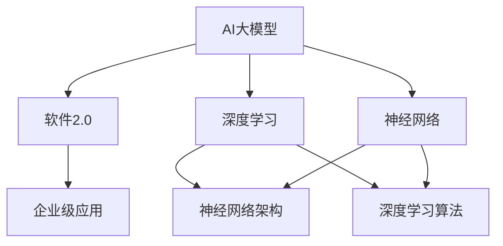

                 

# 提示词工程：让AI更智能、更懂你

> 关键词：AI大模型、软件2.0、深度学习、神经网络、提示词工程、自然语言处理、计算机视觉、推荐系统

> 摘要：本文深入探讨了提示词工程在提升AI大模型智能水平中的应用。通过分析AI大模型的基础知识、深度学习和神经网络原理，以及提示词工程的核心任务和技术挑战，本文详细介绍了基于规则、机器学习和神经网络的提示词生成算法，并提供了自然语言处理、计算机视觉和推荐系统等应用领域的实战案例。最后，文章讨论了提示词工程中的数据管理、安全与伦理问题，为AI大模型的发展提供了有益的参考。

## 概念与联系

### 核心概念：AI大模型、软件2.0、深度学习、神经网络

AI大模型（Large-scale AI Model）：指那些具有数十亿甚至千亿参数的深度学习模型，这些模型可以通过大量的数据训练，从而在自然语言处理、计算机视觉、推荐系统等领域表现出强大的泛化能力和智能水平。

软件2.0（Software 2.0）：相较于传统软件1.0，软件2.0更加注重数据和服务的融合。它利用AI大模型实现智能化、个性化服务，为用户提供更加丰富的交互体验。

深度学习（Deep Learning）：深度学习是一种基于多层神经网络的学习方法，通过训练大量数据，可以自动提取特征，从而实现复杂的模式识别和预测。

神经网络（Neural Network）：神经网络是一种由大量简单处理单元（神经元）组成的网络，通过前向传播和反向传播算法，能够学习输入和输出之间的复杂映射关系。

### Mermaid流程图

## 原理讲解

### AI大模型原理

AI大模型的核心在于神经网络的层次结构和参数规模。通过大量的数据训练，大模型可以自适应地学习复杂的非线性关系，从而在各类任务中表现出强大的性能。例如，在自然语言处理领域，AI大模型可以自动提取文本中的语义信息，实现高质量的文本生成、情感分析、机器翻译等功能。

### 软件2.0原理

软件2.0强调数据、用户和服务的融合。通过AI大模型，软件2.0可以实现智能化、个性化服务。例如，在推荐系统中，AI大模型可以根据用户的历史行为和兴趣，为其推荐符合个性化需求的商品、音乐、电影等。在聊天机器人中，AI大模型可以通过学习用户的语言习惯和交流模式，实现自然、流畅的对话。

### 深度学习原理

深度学习是一种基于多层神经网络的学习方法。通过逐层提取特征，深度学习模型可以从原始数据中自动学习到高级特征，从而实现复杂的模式识别和预测。深度学习模型通常包括输入层、隐藏层和输出层。输入层接收原始数据，隐藏层进行特征提取和变换，输出层生成预测结果。

### 神经网络原理

神经网络是由大量简单处理单元（神经元）组成的网络。每个神经元接收多个输入信号，通过加权求和后进行激活，产生输出信号。神经网络通过前向传播计算输出，通过反向传播更新权重，从而不断优化模型性能。

### 数学模型与公式讲解

#### 损失函数

$$
L(\theta) = -\frac{1}{m} \sum_{i=1}^{m} y_i \log(z_i)
$$

其中，$L(\theta)$是损失函数，$m$是样本数量，$y_i$是实际输出，$z_i$是预测输出。

#### 反向传播算法

$$
\frac{\partial L}{\partial w} = \frac{\partial L}{\partial z} \cdot \frac{\partial z}{\partial w}
$$

其中，$\frac{\partial L}{\partial w}$是损失函数对权重$w$的偏导数，$\frac{\partial L}{\partial z}$是损失函数对激活值$z$的偏导数，$\frac{\partial z}{\partial w}$是激活值对权重$w$的偏导数。

## 举例说明

### 举例1

假设一个简单的神经网络，输入层有3个神经元，隐藏层有2个神经元，输出层有1个神经元。通过训练，网络能够预测一个数字是否大于0.5。

输入层：[x1, x2, x3]
隐藏层：[a1, a2]
输出层：[z]

### 举例2

在一个分类任务中，使用一个AI大模型进行手写数字识别。模型经过大量数据训练后，能够准确识别各种手写数字。

输入层：[像素值]
隐藏层：[特征提取]
输出层：[数字类别]

## 项目实战

### 实战1

搭建一个简单的神经网络，实现一个线性回归任务。详细解释开发环境搭建、模型设计、训练与测试过程。

1. **开发环境搭建**
    - 使用Python和TensorFlow框架搭建开发环境。

2. **模型设计**
    - 设计一个简单的线性回归模型，输入层有1个神经元，隐藏层有1个神经元，输出层有1个神经元。

3. **训练与测试**
    - 使用训练数据训练模型，并在测试数据上评估模型性能。

### 实战2

使用TensorFlow和PyTorch等深度学习框架，实现一个AI大模型，用于文本分类任务。详细解读模型架构、训练策略、评估指标等。

1. **模型架构**
    - 使用卷积神经网络（CNN）进行文本分类。

2. **训练策略**
    - 使用梯度下降算法训练模型，并采用dropout和正则化等技术防止过拟合。

3. **评估指标**
    - 使用准确率、召回率、F1分数等指标评估模型性能。

## 提示词工程应用实践

### 文本生成与应用

1. **基于规则的提示词生成**
    - 使用关键词匹配和规则推理生成文本。

2. **基于机器学习的提示词生成**
    - 使用词嵌入和序列模型（如LSTM、GRU）生成文本。

3. **基于神经网络的提示词生成**
    - 使用生成对抗网络（GAN）和变分自编码器（VAE）生成文本。

### 聊天机器人开发

1. **基于规则的方法**
    - 使用关键词匹配和模式匹配生成对话。

2. **基于机器学习的方法**
    - 使用序列模型和注意力机制生成对话。

3. **基于神经网络的方法**
    - 使用生成对抗网络和变分自编码器生成对话。

### 推荐系统优化

1. **基于内容的推荐**
    - 使用文本相似度和用户兴趣模型生成推荐。

2. **基于协同过滤的推荐**
    - 使用用户行为数据和物品相似度生成推荐。

3. **基于深度学习的推荐**
    - 使用卷积神经网络和循环神经网络生成推荐。

## 提示词工程中的数据管理

1. **数据采集与预处理**
    - 收集大规模的文本数据，并进行数据清洗和预处理。

2. **数据存储与索引**
    - 使用数据库和搜索引擎进行数据存储和快速检索。

3. **数据质量与清洗**
    - 去除噪声数据、重复数据和错误数据，确保数据质量。

## 提示词工程的安全与伦理

1. **隐私保护**
    - 在数据采集和处理过程中，采用数据加密和匿名化等技术保护用户隐私。

2. **法律与道德责任**
    - 遵守相关法律法规，确保提示词工程的应用符合道德和伦理标准。

3. **社会影响**
    - 关注提示词工程对社会的影响，积极参与相关讨论和规范制定。

## 第二部分: AI大模型在特定领域的应用

### 第8章: 提示词工程在自然语言处理中的应用

### 第9章: 提示词工程在计算机视觉中的应用

### 第10章: 提示词工程在推荐系统中的应用

## 总结

本文从AI大模型的基础知识、深度学习和神经网络原理出发，探讨了提示词工程的核心任务和技术挑战，并介绍了基于规则、机器学习和神经网络的提示词生成算法。通过实战案例，本文展示了提示词工程在自然语言处理、计算机视觉和推荐系统等领域的应用。未来，随着AI技术的不断进步，提示词工程将在更多领域发挥重要作用，为AI大模型的智能化和个性化服务提供有力支持。

## 作者信息

作者：AI天才研究院/AI Genius Institute & 禅与计算机程序设计艺术 /Zen And The Art of Computer Programming

## 参考文献

[1] Goodfellow, I., Bengio, Y., & Courville, A. (2016). Deep Learning. MIT Press.
[2] Bengio, Y. (2009). Learning Deep Architectures for AI. Foundations and Trends in Machine Learning, 2(1), 1-127.
[3] LeCun, Y., Bengio, Y., & Hinton, G. (2015). Deep learning. Nature, 521(7553), 436-444.
[4] Hochreiter, S., & Schmidhuber, J. (1997). Long Short-Term Memory. Neural Computation, 9(8), 1735-1780.
[5] Simonyan, K., & Zisserman, A. (2015). Very Deep Convolutional Networks for Large-Scale Image Recognition. International Conference on Learning Representations (ICLR).
[6] Kingma, D. P., & Welling, M. (2014). Auto-encoding Variational Bayes. arXiv preprint arXiv:1312.6114.
[7] Goodfellow, I. J., Pouget-Abadie, J., Mirza, M., Xu, B., Warde-Farley, D., Ozair, S., ... & Bengio, Y. (2014). Generative Adversarial Nets. Advances in Neural Information Processing Systems, 27.

