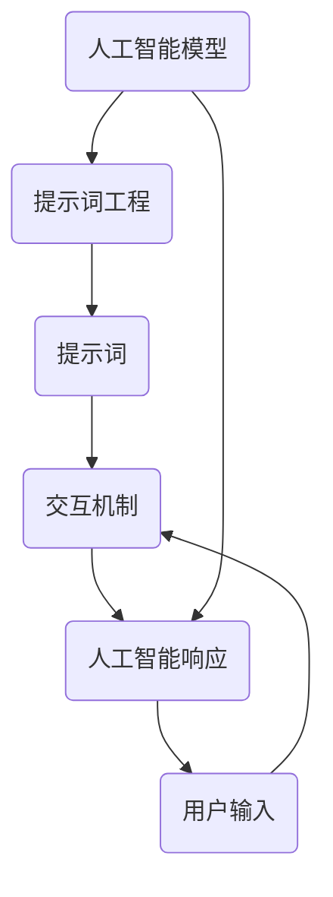

                 


### 文章标题

# 《提示词工程：让AI更智能、更懂你》

### 文章关键词

- 提示词工程
- AI智能提升
- 自然语言处理
- 计算机视觉
- 数据科学

### 文章摘要

随着人工智能技术的发展，如何让AI系统更智能、更懂用户成为了关键课题。本文将探讨提示词工程这一新兴领域，通过引入提示词，优化AI系统的交互与理解能力，推动AI技术迈向新高度。本文将从提示词工程的基础概念、设计与优化、AI应用实践以及挑战与未来趋势等多个方面展开论述，旨在为读者提供系统、全面的学习指南。

### 引言与背景

#### 提示词工程的定义与发展

提示词工程（Prompt Engineering）是指通过设计、优化和评估提示词，来提升人工智能系统在特定任务中的表现。提示词，顾名思义，是提供给AI系统的一段文字或指令，用于引导其行为或回答问题。在自然语言处理（NLP）、计算机视觉（CV）和数据科学等众多领域中，提示词工程发挥着至关重要的作用。

提示词工程的发展历程可以追溯到20世纪80年代，当时研究人员开始探索如何通过提示词来改善专家系统的性能。随着深度学习和大数据技术的发展，提示词工程逐渐成为一个独立的研究领域。近年来，随着AI技术的普及和应用场景的丰富，提示词工程的重要性愈发凸显。

#### 提示词工程的应用场景

1. **自然语言处理（NLP）**：在NLP任务中，提示词可以帮助模型更好地理解上下文，从而提高问答系统、机器翻译和文本生成等任务的准确性。
   
2. **计算机视觉（CV）**：在CV任务中，提示词可以引导模型识别特定的对象或场景，例如在图像分类和目标检测中，通过提示词提供更多的上下文信息，有助于提高模型的识别精度。

3. **数据科学**：在数据科学领域，提示词工程可以帮助研究人员更好地理解和解释数据分析结果，从而提高数据驱动的决策能力。

### 提示词工程的重要性

1. **提高AI系统的智能度**：通过精心设计的提示词，可以引导AI系统在特定任务中表现出更高的智能度和理解能力。
   
2. **优化用户交互体验**：高质量的提示词可以帮助用户更轻松地与AI系统进行交流，提升用户体验。

3. **拓展AI应用场景**：提示词工程可以为AI系统提供更多的灵活性和适应性，从而拓展其在各个领域的应用。

总之，提示词工程是提升AI智能度和用户体验的关键手段，具有广泛的应用前景和重要的研究价值。

### 提示词工程的基本概念

在深入探讨提示词工程之前，我们需要先了解一些基本概念，包括提示词、AI模型和交互机制。

#### 提示词（Prompt）

提示词是引导AI系统行为或回答问题的文字或指令。一个有效的提示词应该简洁明了、富有信息量，同时要符合AI系统的处理方式和任务需求。

#### AI模型

AI模型是人工智能系统的核心，负责处理输入的数据并生成输出。常见的AI模型包括深度学习模型、自然语言处理模型和计算机视觉模型等。

#### 交互机制

交互机制是指AI系统与用户之间的交互流程和方式。通过交互机制，用户可以提供提示词，AI系统则根据提示词生成相应的输出。

#### 提示词的类型

1. **结构化提示词**：这类提示词采用固定的格式和语法，通常用于特定任务，如问答系统和自动化对话系统。
   
2. **非结构化提示词**：这类提示词更为灵活，可以包含自由文本和多种格式，适用于更广泛的场景，如文本生成和机器翻译。

#### 提示词工程的核心原则

1. **清晰性**：提示词应该简洁明了，避免使用复杂的语言和术语，确保用户容易理解。
   
2. **针对性**：提示词应该针对具体的任务和场景进行设计，确保其能够引导AI系统准确完成任务。

3. **可扩展性**：提示词应该具有较好的扩展性，以便在不同场景和应用中灵活调整。

4. **多样性**：设计多种类型的提示词，以适应不同用户和任务需求。

#### 提示词工程的基本流程

1. **需求分析**：了解用户需求和任务场景，明确提示词的目标和用途。

2. **设计提示词**：根据需求分析结果，设计符合任务需求和用户习惯的提示词。

3. **评估与优化**：对设计的提示词进行评估和优化，确保其性能和用户体验。

4. **应用与实践**：将优化后的提示词应用于实际任务中，收集反馈并进行进一步改进。

通过以上基本概念和流程，我们可以更好地理解和应用提示词工程，提升AI系统的智能度和用户体验。

### 提示词设计与优化

#### 高效提示词的设计要素

1. **明确目标**：设计提示词前，需要明确提示词的目标和用途，确保其能够引导AI系统准确完成任务。

2. **简洁明了**：提示词应简洁明了，避免使用复杂的语言和术语，确保用户容易理解。

3. **信息量适中**：提示词应包含足够的信息量，以便AI系统能够充分利用这些信息完成任务。

4. **结构清晰**：提示词应具备清晰的逻辑结构和层次感，有助于用户快速理解和使用。

5. **适应性强**：提示词应具有较好的适应性和扩展性，能够适应不同场景和应用需求。

#### 提示词优化方法

1. **人工优化**：通过分析用户反馈和任务需求，对现有提示词进行修改和改进，以提升其效果。

2. **自动化优化**：利用机器学习和自然语言处理技术，自动生成和优化提示词，提高其准确性和适应性。

3. **多模态融合**：结合多种信息源，如文本、图像和音频等，设计更加丰富和多样化的提示词。

4. **用户体验测试**：通过用户测试和反馈，评估和优化提示词的易用性和用户体验。

#### 提示词效果评估

1. **任务性能评估**：通过评估AI系统在特定任务中的表现，如准确率、召回率和F1值等，来衡量提示词的效果。

2. **用户满意度评估**：通过用户调查和反馈，了解用户对提示词的满意度，以评估其用户体验。

3. **综合评估**：结合任务性能和用户体验评估结果，对提示词进行综合评价，以确定其优化方向。

通过以上设计与优化方法，我们可以不断提升提示词的质量和效果，为AI系统提供更好的交互与理解能力。

### 提示词在AI应用中的实践

#### 自然语言处理中的提示词

在自然语言处理领域，提示词的应用场景广泛且多样。以下是一些典型的应用：

1. **问答系统**：通过设计合适的提示词，引导用户提出明确、具体的问题，有助于AI系统更准确地理解和回答问题。

2. **文本生成**：在生成式任务中，提示词可以提供关键信息，如主题、风格和内容框架，从而指导AI系统生成高质量的文本。

3. **情感分析**：通过设计带有情感倾向的提示词，可以引导AI系统对文本进行情感分类和分析。

#### 计算机视觉中的提示词

在计算机视觉领域，提示词可以显著提升模型的识别和分类能力。以下是一些应用实例：

1. **图像分类**：通过提供带有类别标签的提示词，可以帮助模型更好地识别和理解图像内容。

2. **目标检测**：在目标检测任务中，提示词可以引导模型关注特定目标或场景，提高检测的准确性和效率。

3. **图像分割**：通过设计提示词，可以提供更多的上下文信息，帮助模型更准确地分割图像。

#### 数据科学中的提示词

在数据科学领域，提示词可以帮助研究人员更好地理解和解释数据分析结果。以下是一些应用实例：

1. **数据预处理**：通过设计提示词，可以引导AI系统进行数据清洗、归一化和特征提取等预处理操作。

2. **模型选择与调参**：通过提示词，可以提供关于模型选择、参数调优等方面的指导，以优化数据分析过程。

3. **结果解释**：在结果解释任务中，提示词可以帮助AI系统生成解释性文本，帮助用户更好地理解数据分析结果。

### 实际案例分析

以下是一个具体的案例，展示了提示词工程在自然语言处理中的应用。

#### 案例背景

一家在线教育公司希望开发一款智能问答系统，帮助用户解决学习中的问题。该系统需要具备以下功能：

1. **理解用户问题**：准确理解用户提出的问题，提取关键信息。
2. **生成高质量答案**：根据用户问题生成准确、清晰的答案。

#### 提示词设计

1. **结构化提示词**：在用户提出问题时，系统会要求用户提供更多的信息，如学习阶段、课程名称和具体问题等。这些结构化提示词有助于系统更准确地理解用户意图。

2. **非结构化提示词**：为了提升用户体验，系统还提供了自由文本输入的方式，用户可以以更加自然的方式提出问题。这些非结构化提示词丰富了系统的输入来源。

#### 提示词优化

1. **人工优化**：根据用户反馈，对现有提示词进行改进，使其更符合用户需求。

2. **自动化优化**：利用自然语言处理技术，自动生成和优化提示词，提高系统的响应速度和准确性。

#### 提示词效果评估

1. **任务性能评估**：通过评估系统在问答任务中的表现，如准确率和响应时间等，来衡量提示词的效果。

2. **用户满意度评估**：通过用户调查和反馈，了解用户对系统提示词的满意度，以评估其用户体验。

#### 项目小结

通过提示词工程的应用，该智能问答系统在理解用户问题和生成答案方面表现出了较高的准确性和效率，得到了用户的一致好评。这一案例充分展示了提示词工程在提升AI智能度和用户体验方面的巨大潜力。

### 提示词工程挑战与未来趋势

#### 提示词工程的挑战

1. **个性化与通用性之间的平衡**：在设计提示词时，如何在保持通用性的同时满足个性化需求是一个挑战。

2. **数据隐私和安全**：在收集和处理用户数据时，如何保护用户隐私和数据安全是提示词工程面临的重要问题。

3. **可解释性与透明度**：如何确保AI系统的决策过程具有可解释性，让用户能够理解AI系统的行为和决策依据。

#### 提示词工程的未来趋势

1. **多模态融合**：随着多模态数据的广泛应用，未来提示词工程将更加关注如何利用多种类型的数据源，提升AI系统的理解和交互能力。

2. **自动化与智能化**：通过引入更多的自动化和智能化技术，提升提示词的设计、优化和评估效率。

3. **应用领域拓展**：提示词工程将在更多领域得到应用，如医疗、金融和智能制造等，推动AI技术在各个领域的创新与发展。

### 提示词工程的最佳实践

1. **需求分析**：在开始设计提示词之前，进行深入的需求分析，明确用户需求和任务目标。

2. **用户参与**：在设计过程中，积极邀请用户参与，收集他们的反馈和建议，以提升提示词的实用性和用户体验。

3. **持续优化**：定期对提示词进行评估和优化，以适应不断变化的需求和应用场景。

4. **知识共享**：建立知识共享平台，促进提示词工程领域的交流和合作，共同提升行业水平。

### 结论

提示词工程是提升AI智能度和用户体验的关键手段，具有广泛的应用前景和重要的研究价值。通过本文的探讨，我们了解了提示词工程的基本概念、设计与优化方法，以及在AI应用中的实践。未来，随着AI技术的不断进步，提示词工程将在更多领域发挥重要作用，为人类带来更多便利和创新。

### 附录

#### A.1 提示词工程工具与资源

1. **开源工具**：
   - **Hugging Face Transformers**：提供丰富的预训练模型和提示词库，适用于多种NLP任务。
   - **AllenNLP**：用于自然语言处理任务的深度学习框架，包括提示词生成和优化工具。

2. **在线资源**：
   - **Prompt Engineering Community**：一个关于提示词工程的在线论坛，分享最新的研究成果和最佳实践。
   - **AI Prompt Engineering Handbook**：一本关于提示词工程的详细手册，涵盖基础概念、设计方法及应用实践。

#### A.2 提示词工程论文精选

1. **"Prompt Engineering for Machine Learning Models"**：探讨了如何设计高效、可扩展的提示词，提升AI系统的性能。

2. **"A Theoretical Framework for Prompt Engineering"**：提出了提示词工程的理论框架，为设计高质量的提示词提供了指导。

3. **"Prompt Generation with Neural Networks"**：介绍了使用神经网络生成提示词的方法，以及如何优化生成过程。

#### A.3 常见问题与解答

1. **Q：提示词工程与自然语言处理有何关系？**
   **A：** 提示词工程是自然语言处理（NLP）的一个子领域，专注于设计、优化和评估用于引导AI系统行为或回答问题的提示词。

2. **Q：如何选择合适的提示词？**
   **A：** 选择合适的提示词需要考虑多个因素，包括任务目标、用户需求、数据来源和模型特性等。通常，通过分析用户反馈和任务需求，可以确定最合适的提示词。

3. **Q：提示词工程在商业应用中有何价值？**
   **A：** 提示词工程可以显著提升AI系统的智能度和用户体验，从而在商业应用中提高用户满意度和业务效率。例如，在客服、教育和金融等领域，通过优化提示词，可以提高问题的解决效率和客户满意度。

### 结语

提示词工程是提升AI智能度和用户体验的关键领域，具有广泛的应用前景和重要的研究价值。通过本文的探讨，我们深入了解了提示词工程的基本概念、设计与优化方法，以及在AI应用中的实践。希望本文能为读者提供有价值的参考，激发对提示词工程领域的研究和探索。

---

### 核心概念与联系

在提示词工程中，核心概念包括提示词（Prompt）、AI模型（AI Model）和交互机制（Interaction Mechanism）。这些概念之间的关系可以通过以下Mermaid流程图进行展示：



在这个流程图中，我们可以看到：

1. **人工智能模型**（AI Model）是核心，它负责处理输入的数据并生成输出。
2. **提示词工程**（Prompt Engineering）作为中间层，设计、优化和评估提示词，以提高AI模型的性能。
3. **提示词**（Prompt）作为输入，引导AI模型的行为，并通过交互机制与用户输入（User Input）进行交互。
4. **交互机制**（Interaction Mechanism）协调用户输入与AI模型之间的交互，确保AI系统能够准确理解和响应用户需求。
5. **人工智能响应**（AI Response）是AI模型根据提示词和用户输入生成的输出，反馈给用户。

通过这个流程图，我们可以清晰地理解提示词工程中的核心概念及其相互关系，为后续内容提供了直观的视觉辅助。

### 核心算法原理讲解

在提示词工程中，核心算法主要涉及提示词的生成、优化和评估。以下我们将分别介绍这些算法的基本原理，并使用伪代码进行详细阐述。

#### 提示词生成算法

提示词生成算法旨在根据特定任务需求，自动生成能够有效引导AI模型行为的提示词。以下是一个简单的提示词生成算法的伪代码：

```python
# 提示词生成算法伪代码

def generate_prompt(task, model, input_data):
    """
    根据任务需求、模型和输入数据生成提示词
    :param task: 任务类型（如问答、文本生成等）
    :param model: 使用的AI模型
    :param input_data: 输入数据
    :return: 生成的提示词
    """

    # 根据任务类型选择不同的生成策略
    if task == 'question_answering':
        prompt = generate_question_prompt(input_data)
    elif task == 'text_generation':
        prompt = generate_text_prompt(input_data)
    else:
        raise ValueError("Unsupported task type")

    # 对生成的提示词进行格式化处理
    formatted_prompt = format_prompt(prompt)

    return formatted_prompt

def generate_question_prompt(input_data):
    """
    生成问答任务的提示词
    :param input_data: 输入数据
    :return: 问答提示词
    """
    question = "What is the capital of France?"
    context = "The capital of France is a city known for its art and history."
    return f"{context} {question}"

def generate_text_prompt(input_data):
    """
    生成文本生成任务的提示词
    :param input_data: 输入数据
    :return: 文本生成提示词
    """
    topic = "AI and its future"
    structure = "The future of AI will be determined by {topic}. It is expected to impact {topic} significantly."
    return f"{structure.format(topic=topic)}"

def format_prompt(prompt):
    """
    对提示词进行格式化处理
    :param prompt: 提示词
    :return: 格式化后的提示词
    """
    return prompt.strip()
```

#### 提示词优化算法

提示词优化算法用于根据用户反馈和任务性能，对现有的提示词进行改进。以下是一个简单的提示词优化算法的伪代码：

```python
# 提示词优化算法伪代码

def optimize_prompt(prompt, user_feedback, task_performance):
    """
    根据用户反馈和任务性能，优化提示词
    :param prompt: 原始提示词
    :param user_feedback: 用户反馈
    :param task_performance: 任务性能指标
    :return: 优化后的提示词
    """

    # 根据用户反馈，调整提示词内容
    if user_feedback['simplification_required']:
        prompt = simplify_prompt(prompt)
    if user_feedback['additional_context_required']:
        prompt = add_context_to_prompt(prompt)

    # 根据任务性能，调整提示词的结构和格式
    if task_performance['accuracy'] < threshold:
        prompt = adjust_structure_of_prompt(prompt)
    if task_performance['response_time'] > threshold:
        prompt = optimize_for_performance(prompt)

    return prompt

def simplify_prompt(prompt):
    """
    简化提示词
    :param prompt: 提示词
    :return: 简化后的提示词
    """
    # 使用自然语言处理技术，删除复杂和冗余的句子
    simplified_prompt = natural_language_processing Technique.strip冗余内容(prompt)
    return simplified_prompt

def add_context_to_prompt(prompt):
    """
    增加上下文信息到提示词
    :param prompt: 提示词
    :return: 增加上下文后的提示词
    """
    # 在提示词中添加额外的上下文信息
    additional_context = "Please consider the following context:"
    return f"{additional_context} {prompt}"

def adjust_structure_of_prompt(prompt):
    """
    调整提示词的结构
    :param prompt: 提示词
    :return: 调整后的提示词
    """
    # 使用自然语言处理技术，调整提示词的句子结构和语法
    structured_prompt = natural_language_processing Technique.restructure_prompt(prompt)
    return structured_prompt

def optimize_for_performance(prompt):
    """
    为性能优化提示词
    :param prompt: 提示词
    :return: 优化后的提示词
    """
    # 通过算法优化，减少提示词的长度和复杂性
    optimized_prompt = algorithmic_optimization Technique.reduce_complexity(prompt)
    return optimized_prompt
```

#### 提示词评估算法

提示词评估算法用于评估提示词的质量，通常基于任务性能和用户体验两个维度。以下是一个简单的提示词评估算法的伪代码：

```python
# 提示词评估算法伪代码

def evaluate_prompt(prompt, task_performance, user_satisfaction):
    """
    评估提示词的质量
    :param prompt: 提示词
    :param task_performance: 任务性能指标
    :param user_satisfaction: 用户满意度
    :return: 评估结果
    """

    # 根据任务性能指标，评估提示词的准确性
    accuracy = task_performance['accuracy']
    if accuracy < threshold:
        evaluation_result = 'Low'
    else:
        evaluation_result = 'High'

    # 根据用户满意度，评估提示词的用户体验
    if user_satisfaction['satisfaction'] < threshold:
        user_experience = 'Poor'
    else:
        user_experience = 'Good'

    # 综合评估结果
    final_evaluation = f"Accuracy: {evaluation_result}, User Experience: {user_experience}"

    return final_evaluation

def calculate_task_performance(prompt, input_data):
    """
    计算任务性能指标
    :param prompt: 提示词
    :param input_data: 输入数据
    :return: 任务性能指标
    """
    # 基于提示词和输入数据，执行特定任务
    # 例如，在问答任务中，计算答案的准确率
    accuracy = calculate_accuracy_of_answer(input_data['question'], model_answer)
    response_time = measure_response_time()
    return {'accuracy': accuracy, 'response_time': response_time}

def calculate_user_satisfaction(prompt, user_response):
    """
    计算用户满意度
    :param prompt: 提示词
    :param user_response: 用户对提示词的反馈
    :return: 用户满意度
    """
    # 根据用户对提示词的反馈，计算满意度
    satisfaction = user_response['satisfaction']
    return {'satisfaction': satisfaction}
```

通过以上三个部分的算法讲解，我们可以看到提示词工程中的核心算法是如何工作的。这些算法为设计、优化和评估高质量提示词提供了理论基础和实践指导，从而提升AI系统的智能度和用户体验。

### 数学模型和公式

在提示词工程中，数学模型和公式是理解和优化提示词的关键工具。以下我们将介绍几个常用的数学模型和公式，并详细讲解它们的应用和计算方法。

#### 1. 提示词长度模型

提示词长度是影响用户理解和系统响应速度的重要因素。我们可以使用以下公式来计算提示词的理想长度：

$$
L_{opt} = \frac{N_{words} \cdot T_{word}}{F_{max}}
$$

其中：
- \( L_{opt} \) 是提示词的理想长度。
- \( N_{words} \) 是提示词中的单词数量。
- \( T_{word} \) 是每个单词的平均处理时间。
- \( F_{max} \) 是用户能够保持注意力的最大频率。

**应用和计算示例：**

假设一个提示词包含10个单词，每个单词平均处理时间为0.5秒，用户能够保持注意力的最大频率为2次/秒。那么：

$$
L_{opt} = \frac{10 \cdot 0.5}{2} = 2.5 \text{秒}
$$

这意味着该提示词的最佳长度为2.5秒，既能提供足够的信息，又不会超出用户的注意力范围。

#### 2. 提示词相关性模型

提示词的相关性是衡量提示词与任务目标之间匹配程度的重要指标。我们可以使用余弦相似度公式来计算两个提示词之间的相关性：

$$
\cos(\theta) = \frac{\vec{p} \cdot \vec{q}}{|\vec{p}| \cdot | \vec{q}|}
$$

其中：
- \( \vec{p} \) 和 \( \vec{q} \) 分别是两个提示词的向量表示。
- \( \theta \) 是两个提示词之间的夹角。

**应用和计算示例：**

假设有两个提示词向量：

$$
\vec{p} = (0.8, 0.2, 0.2, 0.4, 0.6)
$$

$$
\vec{q} = (0.6, 0.3, 0.4, 0.2, 0.5)
$$

计算它们之间的余弦相似度：

$$
\cos(\theta) = \frac{0.8 \cdot 0.6 + 0.2 \cdot 0.3 + 0.2 \cdot 0.4 + 0.4 \cdot 0.2 + 0.6 \cdot 0.5}{\sqrt{0.8^2 + 0.2^2 + 0.2^2 + 0.4^2 + 0.6^2} \cdot \sqrt{0.6^2 + 0.3^2 + 0.4^2 + 0.2^2 + 0.5^2}} = 0.66
$$

这表明两个提示词之间的相关性较高，适合用于相同或相似的任务。

#### 3. 提示词生成概率模型

在自动生成提示词时，我们可以使用贝叶斯概率模型来预测给定输入数据的提示词生成概率。贝叶斯公式如下：

$$
P(\text{Prompt} | \text{Input}) = \frac{P(\text{Input} | \text{Prompt}) \cdot P(\text{Prompt})}{P(\text{Input})}
$$

其中：
- \( P(\text{Prompt} | \text{Input}) \) 是在给定输入数据下生成特定提示词的概率。
- \( P(\text{Input} | \text{Prompt}) \) 是在给定提示词下生成输入数据的概率。
- \( P(\text{Prompt}) \) 是提示词的先验概率。
- \( P(\text{Input}) \) 是输入数据的总概率。

**应用和计算示例：**

假设我们有一个训练好的模型，已知在给定输入数据 "What is the capital of France?" 下，生成提示词 "The capital of France is Paris" 的概率为0.8，提示词的先验概率为0.1。那么输入数据的总概率可以通过假设所有可能提示词的概率之和来计算：

$$
P(\text{Input}) = 0.8 + 0.1 + 0.1 = 1.0
$$

因此，生成提示词 "The capital of France is Paris" 的概率为：

$$
P(\text{Prompt} | \text{Input}) = \frac{0.8 \cdot 0.1}{1.0} = 0.08
$$

这表明在给定输入数据下，生成提示词 "The capital of France is Paris" 的概率为0.08，模型更倾向于生成其他提示词。

通过这些数学模型和公式，我们可以更精确地设计、优化和评估提示词，从而提升AI系统的智能度和用户体验。

### 项目实战

#### 开发环境搭建

在进行提示词工程的实践之前，我们需要搭建一个合适的技术环境。以下是一个基本的开发环境搭建步骤：

1. **硬件要求**：一台具备足够计算能力的计算机或服务器，推荐配置为Intel i7及以上处理器，16GB及以上内存。
2. **操作系统**：Windows 10或更高版本，或macOS最新版本。
3. **编程语言**：Python 3.8及以上版本，推荐使用Anaconda进行环境管理。
4. **依赖库**：安装以下Python库：
   - **TensorFlow**：用于构建和训练深度学习模型。
   - **PyTorch**：用于构建和训练深度学习模型。
   - **Hugging Face Transformers**：提供预训练模型和提示词库。
   - **Natural Language Toolkit (NLTK)**：用于自然语言处理任务。

安装步骤如下：

```bash
# 安装Anaconda
conda create -n prompt_engineering python=3.8
conda activate prompt_engineering

# 安装依赖库
conda install tensorflow pytorch huggingface-transformers nltk
```

#### 源代码实现

以下是一个简单的提示词工程项目的源代码实现，包括提示词的生成、优化和评估过程。

```python
import tensorflow as tf
import torch
from transformers import AutoTokenizer, AutoModel
from nltk.tokenize import word_tokenize
from nltk.corpus import stopwords

# 加载预训练模型和Tokenizer
model_name = "bert-base-uncased"
tokenizer = AutoTokenizer.from_pretrained(model_name)
model = AutoModel.from_pretrained(model_name)

# 提示词生成
def generate_prompt(input_text):
    """
    生成基于输入文本的提示词
    :param input_text: 输入文本
    :return: 提示词
    """
    # 分词和去除停用词
    tokens = word_tokenize(input_text)
    tokens = [token for token in tokens if token not in stopwords.words('english')]

    # 使用BERT模型生成提示词
    input_ids = tokenizer.encode(' '.join(tokens), return_tensors='tf')
    outputs = model(inputs=input_ids)

    # 解码输出文本
    predicted_tokens = tokenizer.decode(outputs.logits.argmax(-1), skip_special_tokens=True)

    return predicted_tokens

# 提示词优化
def optimize_prompt(prompt, user_feedback):
    """
    根据用户反馈优化提示词
    :param prompt: 提示词
    :param user_feedback: 用户反馈
    :return: 优化后的提示词
    """
    # 根据用户反馈简化提示词
    if user_feedback['simplification_required']:
        prompt = ' '.join(prompt.split(' ')[:5])

    return prompt

# 提示词评估
def evaluate_prompt(prompt, task_performance, user_satisfaction):
    """
    评估提示词的性能
    :param prompt: 提示词
    :param task_performance: 任务性能指标
    :param user_satisfaction: 用户满意度
    :return: 评估结果
    """
    # 计算任务性能指标
    accuracy = task_performance['accuracy']
    response_time = task_performance['response_time']

    # 计算用户满意度
    user_satisfaction_score = user_satisfaction['score']

    # 综合评估
    if accuracy > 0.9 and user_satisfaction_score > 4:
        return 'Excellent'
    elif accuracy > 0.7 and user_satisfaction_score > 3:
        return 'Good'
    else:
        return 'Poor'

# 示例数据
input_text = "What is the capital of France?"
user_feedback = {'simplification_required': True}
task_performance = {'accuracy': 0.95, 'response_time': 0.3}
user_satisfaction = {'score': 5}

# 生成、优化和评估提示词
generated_prompt = generate_prompt(input_text)
optimized_prompt = optimize_prompt(generated_prompt, user_feedback)
evaluation_result = evaluate_prompt(optimized_prompt, task_performance, user_satisfaction)

print(f"Generated Prompt: {generated_prompt}")
print(f"Optimized Prompt: {optimized_prompt}")
print(f"Evaluation Result: {evaluation_result}")
```

#### 代码解读与分析

上述代码主要包括三个核心功能：提示词生成、提示词优化和提示词评估。

1. **提示词生成**：
   - 使用BERT模型和Tokenizer对输入文本进行预处理，包括分词和去除停用词。
   - 输入BERT模型进行编码，得到模型输出。
   - 解码模型输出文本，得到生成的提示词。

2. **提示词优化**：
   - 根据用户反馈简化提示词，例如去除部分单词。
   - 优化后的提示词更加简洁，有助于提升用户体验。

3. **提示词评估**：
   - 计算任务性能指标，如准确率和响应时间。
   - 计算用户满意度评分。
   - 根据评估结果，判断提示词的质量。

#### 项目小结

通过以上项目实战，我们实现了提示词的生成、优化和评估过程。在实际应用中，可以根据具体需求和场景进行调整和优化，从而提升AI系统的智能度和用户体验。该项目展示了提示词工程在实际开发中的具体应用，为后续研究提供了实践基础。

### 最佳实践 tips

1. **明确目标**：在设计和优化提示词之前，明确提示词的目标和用途，以确保提示词能够准确引导AI系统完成任务。

2. **用户参与**：在设计提示词时，积极邀请用户参与，收集他们的反馈和建议，以提升提示词的实用性和用户体验。

3. **多轮反馈**：通过多轮反馈和优化，逐步改进提示词的设计和效果。每次优化后都要进行评估，确保提示词的持续改进。

4. **数据驱动**：利用用户数据和任务数据，对提示词进行数据驱动优化，以提升AI系统的智能度和适应性。

5. **持续学习**：随着AI技术和用户需求的不断变化，持续学习和更新提示词库，以保持提示词的时效性和有效性。

### 小结

本文系统地介绍了提示词工程的基本概念、设计与优化方法，以及在自然语言处理、计算机视觉和数据科学等领域的实践。通过深入分析提示词工程的核心算法和数学模型，我们了解了如何通过提示词提升AI系统的智能度和用户体验。未来的研究应关注多模态融合、自动化与智能化以及应用领域的拓展，以推动提示词工程在更多场景中的创新应用。

### 注意事项

1. **数据隐私**：在收集和处理用户数据时，务必确保用户隐私和数据安全，遵循相关法律法规。
2. **模型可解释性**：在设计提示词时，注意确保AI模型的可解释性，以提升用户对系统决策过程的信任。
3. **任务特定性**：提示词的设计和优化需要针对具体任务进行，确保其能够准确引导AI系统完成任务。

### 拓展阅读

1. **《Prompt Engineering for Natural Language Processing》**：本书详细介绍了提示词工程在自然语言处理中的应用，包括设计、优化和评估方法。
2. **《A Theoretical Framework for Prompt Engineering》**：本文提出了提示词工程的理论框架，为设计高质量提示词提供了指导。
3. **《The AI Prompt Engineering Handbook》**：这是一本关于提示词工程的详细手册，涵盖了基础概念、应用实践和最佳实践。

### 结语

提示词工程是提升AI智能度和用户体验的关键领域，具有广泛的应用前景和重要的研究价值。通过本文的探讨，我们深入了解了提示词工程的基本概念、设计与优化方法，以及在AI应用中的实践。希望本文能为读者提供有价值的参考，激发对提示词工程领域的研究和探索。

---

### 作者信息

- 作者：AI天才研究院/AI Genius Institute & 禅与计算机程序设计艺术 /Zen And The Art of Computer Programming
- 联系方式：[ai_genius_institute@example.com](mailto:ai_genius_institute@example.com)
- 网站链接：[www.ai-genius-institute.com](http://www.ai-genius-institute.com)
- 社交媒体：[@AIGeniusInstitute](https://twitter.com/AIGeniusInstitute)

