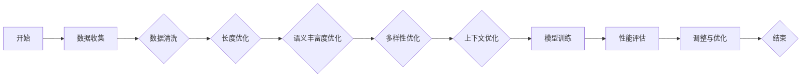

                 


### 文章标题

《提示词性能优化：提高AI响应速度的技巧》

### 关键词

提示词性能优化、AI响应速度、模型压缩、并行计算、模型融合、持续学习

### 摘要

本文将探讨如何通过优化提示词来提升人工智能（AI）模型的响应速度。我们将首先介绍提示词性能优化的基础概念，包括其在AI中的作用和面临的挑战。接着，我们将详细讲解多种技术方法，如提示词长度优化、语义丰富度优化、多样性优化和上下文优化。随后，我们将讨论提升AI模型响应速度的策略，包括模型压缩与量化、模型加速与并行计算、模型融合与协同工作以及模型持续学习与自适应。文章将通过实战案例展示这些方法的实际应用，并总结性能优化的最佳实践，最后展望性能优化的未来趋势。

### 目录

1. 引言  
2. 提示词性能优化的基础  
3. 提示词优化的技术方法  
4. 提升AI模型响应速度的策略  
5. 性能优化的实战案例  
6. 性能优化的未来趋势  
7. 总结  
8. 附录

### 1. 引言

在当今快速发展的信息技术时代，人工智能（AI）正逐渐成为各个领域的重要推动力。无论是自动驾驶、智能语音助手还是自然语言处理，AI的应用无处不在。然而，AI模型在处理大量数据和复杂任务时，其响应速度成为一个关键的性能瓶颈。为了满足用户对实时性和响应速度的需求，提示词性能优化成为一个重要的研究方向。

提示词，即用户与AI模型交互时的输入信息，是影响模型性能的重要因素之一。优化提示词不仅能够提高AI模型的准确性和可靠性，还能显著提升其响应速度。本文将系统地探讨如何通过优化提示词来提升AI模型的响应速度，包括基础概念、技术方法和实际应用等方面。

文章的结构如下：

- 引言：介绍本文的目的和背景，概述提示词性能优化的意义。
- 提示词性能优化的基础：解释提示词在AI中的作用，分析提示词性能优化的挑战。
- 提示词优化的技术方法：详细讲解提示词长度优化、语义丰富度优化、多样性优化和上下文优化。
- 提升AI模型响应速度的策略：讨论模型压缩与量化、模型加速与并行计算、模型融合与协同工作以及模型持续学习与自适应。
- 性能优化的实战案例：通过实际案例展示优化技巧的应用。
- 性能优化的未来趋势：展望提示词性能优化技术的发展方向。
- 总结：回顾全文内容，总结性能优化的实践指南。
- 附录：提供相关资源和工具介绍。

通过本文的阅读，读者将能够深入了解提示词性能优化的原理和方法，掌握提升AI模型响应速度的实战技巧，为未来的AI应用提供有力支持。

### 2. 提示词性能优化的基础

#### 提示词在AI中的作用

在人工智能（AI）系统中，提示词（prompt）扮演着至关重要的角色。提示词是用户与AI模型交互的桥梁，它不仅提供了AI模型需要处理的数据，还指导了模型的推理过程。具体来说，提示词在AI中的作用主要表现在以下几个方面：

1. **数据输入**：提示词作为输入数据，提供了AI模型所需的信息。这些信息可以是文字、图像、声音等多种形式，但无论形式如何，都是AI模型进行学习和推理的基础。

2. **任务指导**：提示词不仅包含数据，还包含了用户希望AI模型完成的具体任务。例如，在问答系统中，用户输入的问题即为提示词，它指导AI模型进行问题的解答。

3. **上下文信息**：在许多AI应用中，上下文信息对于模型的理解和推理至关重要。提示词中的上下文信息可以帮助模型更好地理解用户的意图，提高任务的准确性和效率。

4. **模型训练**：在机器学习和深度学习过程中，提示词用于模型的训练。通过大量的提示词数据，模型能够学习和优化其参数，以提高对未知数据的预测能力。

#### 提示词性能优化的挑战

尽管提示词在AI系统中具有重要作用，但对其性能优化仍然面临诸多挑战：

1. **数据质量**：提示词的质量直接影响AI模型的学习效果。低质量的提示词，如噪声数据或错误信息，可能会导致模型训练不准确，降低性能。

2. **长度和多样性**：提示词的长度和多样性对于模型的学习和推理具有重要影响。过长的提示词可能导致模型过拟合，而过短的提示词可能缺乏足够的信息，影响模型的泛化能力。同时，提示词的多样性不足可能导致模型在处理未知数据时缺乏灵活性。

3. **语义理解**：提示词中的语义信息对于模型的理解至关重要。然而，自然语言本身具有复杂性和多义性，使得模型正确理解提示词的语义成为一个挑战。

4. **计算资源**：优化提示词通常需要大量的计算资源，特别是在深度学习和复杂模型中。提高提示词性能可能需要额外的时间和计算成本。

#### 提示词性能优化的重要性

提示词性能优化在AI系统中具有重要的意义：

1. **提高响应速度**：通过优化提示词，可以减少模型处理数据的时间和计算复杂度，从而提高响应速度，满足用户对实时性的需求。

2. **提升准确性和可靠性**：优化后的提示词能够提供更准确和可靠的信息，使模型能够更准确地理解和预测未知数据，提高任务完成率。

3. **增强用户体验**：优化的提示词能够提高AI系统与用户的交互质量，减少用户的等待时间和操作错误，提升整体用户体验。

4. **降低维护成本**：通过优化提示词，可以减少对模型参数的调整和优化次数，降低系统的维护成本。

#### 提示词性能优化的Mermaid流程图

为了帮助读者更好地理解提示词性能优化的流程，我们可以使用Mermaid流程图来展示各个步骤：



此流程图展示了从数据收集到模型训练的各个步骤，每个步骤都是提示词性能优化的重要组成部分。通过优化提示词的长度、语义丰富度、多样性和上下文，我们可以显著提升AI模型的性能。

### 3. 提示词优化的技术方法

#### 3.1 优化提示词长度

提示词长度是影响模型性能的一个重要因素。过长的提示词可能导致模型过拟合，而过于简短的提示词可能无法提供足够的上下文信息，影响模型的泛化能力。因此，优化提示词长度是一个关键的技术方法。

**优化步骤：**

1. **自动截断**：通过设定提示词的最大长度，自动截断过长的提示词。常见的截断方法包括固定长度截断和动态长度截断。
2. **文本摘要**：使用文本摘要技术，将长文本转换为更短的摘要，保留核心信息。这可以通过抽取式摘要或生成式摘要实现。
3. **关键信息提取**：通过自然语言处理技术，提取提示词中的关键信息，将其作为新的提示词输入。

**伪代码示例：**

```python
def optimize_prompt_length(prompt, max_length):
    if len(prompt) <= max_length:
        return prompt
    
    # 使用文本摘要技术进行优化
    summary = text_summary(prompt)
    
    if len(summary) <= max_length:
        return summary
    
    # 使用关键信息提取技术进行优化
    key_info = key_info_extraction(prompt)
    
    return key_info
```

#### 3.2 提示词语义丰富度优化

提示词的语义丰富度直接影响模型的理解能力。语义丰富的提示词能够提供更多上下文信息，帮助模型更好地理解用户的意图。因此，提高提示词语义丰富度是优化模型性能的关键步骤。

**优化步骤：**

1. **同义词替换**：使用同义词替换提示词中的生僻词汇，提高文本的通顺性和语义丰富度。
2. **扩展短语**：通过扩展短语和句子的长度，增加提示词的语义信息。
3. **实体识别与嵌入**：使用实体识别技术，将提示词中的实体识别出来，并使用预训练的实体嵌入模型进行语义增强。

**伪代码示例：**

```python
def enhance_prompt_semantics(prompt):
    # 使用同义词替换
    prompt = synonym_replacement(prompt)
    
    # 扩展短语
    prompt = phrase_expansion(prompt)
    
    # 实体识别与嵌入
    entities = entity_recognition(prompt)
    prompt = entity_embedding(prompt, entities)
    
    return prompt
```

#### 3.3 提示词多样性优化

提示词的多样性是模型泛化能力的重要保障。多样化的提示词能够帮助模型更好地适应不同的数据分布，减少模型对特定数据的依赖。

**优化步骤：**

1. **数据增强**：通过数据增强技术，生成多样化的提示词。例如，可以使用图像生成、文本生成等技术来扩展提示词的多样性。
2. **多模态融合**：结合不同类型的输入数据，如文本、图像、音频等，生成多样化的提示词。
3. **随机化**：对提示词进行随机化处理，如随机插入、删除或替换字符，增加提示词的多样性。

**伪代码示例：**

```python
def diversify_prompt(prompt):
    # 数据增强
    enhanced_prompt = data_augmentation(prompt)
    
    # 多模态融合
    multimodal_prompt = multimodal_fusion(prompt)
    
    # 随机化
    randomized_prompt = randomize_prompt(prompt)
    
    return enhanced_prompt, multimodal_prompt, randomized_prompt
```

#### 3.4 提示词上下文优化

提示词中的上下文信息对于模型的理解和推理至关重要。优化提示词的上下文信息可以显著提升模型的性能。

**优化步骤：**

1. **上下文扩展**：通过扩展上下文信息，提供更多与提示词相关的背景信息。例如，可以添加相关的历史记录、用户偏好等信息。
2. **上下文融合**：使用预训练的语言模型，将上下文信息与提示词进行融合，生成更具语义丰富的提示词。
3. **上下文调整**：根据模型的训练数据和实际应用场景，动态调整上下文信息，使其更符合模型的训练目标和实际需求。

**伪代码示例：**

```python
def optimize_context(prompt, context):
    # 上下文扩展
    extended_context = context_expansion(context)
    
    # 上下文融合
    fused_prompt = context_fusion(prompt, extended_context)
    
    # 上下文调整
    adjusted_prompt = context_adjustment(fused_prompt, training_data)
    
    return adjusted_prompt
```

通过上述技术方法，我们可以有效地优化提示词的长度、语义丰富度、多样性和上下文，从而提升AI模型的性能。接下来，我们将进一步讨论如何提升AI模型的响应速度。

### 4. 提升AI模型响应速度的策略

在AI模型应用中，响应速度是衡量用户体验和系统性能的关键因素。为了提升AI模型的响应速度，我们可以从多个方面进行策略优化。以下将介绍几种主要策略，包括模型压缩与量化、模型加速与并行计算、模型融合与协同工作以及模型持续学习与自适应。

#### 4.1 模型压缩与量化

**模型压缩**是一种通过减少模型参数数量和计算复杂度来减小模型大小的方法。这种方法不仅能够提高模型的存储和传输效率，还能减少计算资源的需求，从而加快模型响应速度。

1. **参数剪枝（Parameter Pruning）**：通过移除模型中不重要的参数，减少模型大小。剪枝方法可以分为结构剪枝和权重剪枝。结构剪枝通过删除整个网络层或节点，而权重剪枝仅删除权重值较小的参数。
2. **知识蒸馏（Knowledge Distillation）**：将大模型的知识转移到小模型中，通过训练一个小模型来模仿大模型的输出。这种方法能够在不显著牺牲模型性能的情况下，显著减小模型大小。
3. **量化（Quantization）**：通过将模型中的浮点数参数转换为较低精度的整数表示，减少模型大小和计算复杂度。量化方法包括低精度量化、符号量化等。

**伪代码示例：**

```python
def compress_model(model, pruning_rate, quantization_bits):
    # 参数剪枝
    pruned_model = prune_parameters(model, pruning_rate)
    
    # 知识蒸馏
    distilled_model = knowledge_distillation(model, smaller_model)
    
    # 量化
    quantized_model = quantize_parameters(model, quantization_bits)
    
    return quantized_model
```

#### 4.2 模型加速与并行计算

**模型加速**和**并行计算**是提高AI模型计算效率的重要手段。

1. **模型加速**：通过算法优化、硬件加速等技术，减少模型计算时间。常见的方法包括使用向量化操作、优化循环结构、使用GPU或TPU等硬件加速。
2. **并行计算**：将模型计算任务分解为多个子任务，并在多个计算节点上同时执行，从而提高计算效率。并行计算可以采用数据并行、模型并行和任务并行等多种策略。

**伪代码示例：**

```python
def accelerate_model(model, use_gpu=True):
    if use_gpu:
        # 使用GPU加速
        accelerated_model = gpu_accelerate(model)
    else:
        # 使用向量化操作加速
        accelerated_model = vectorize_operations(model)
    
    return accelerated_model

def parallel_computation(model, num_nodes):
    # 数据并行
    split_data = split_input_data(data, num_nodes)
    models = [train_on_data(model, data) for data in split_data]
    
    # 模型并行
    combined_model = combine_models(models)
    
    return combined_model
```

#### 4.3 模型融合与协同工作

**模型融合**和**协同工作**是将多个模型的优势结合起来，提高模型性能和响应速度的有效方法。

1. **模型融合**：通过将多个模型融合为一个更强大的模型，可以充分利用各个模型的优势，提高整体性能。常见的方法包括加权融合、投票融合等。
2. **协同工作**：多个模型协同工作，各自处理不同的任务，然后将结果进行整合。这种方法可以显著提升系统的响应速度和处理能力。

**伪代码示例：**

```python
def model_fusion(model1, model2, weight1=0.5, weight2=0.5):
    # 加权融合
    fused_model = weighted_fusion(model1, model2, weight1, weight2)
    
    return fused_model

def model_collaboration(model1, model2, data):
    # 模型协同工作
    result1 = model1.predict(data)
    result2 = model2.predict(data)
    
    # 结果整合
    combined_result = integrate_results(result1, result2)
    
    return combined_result
```

#### 4.4 模型持续学习与自适应

**持续学习**和**自适应**是提高AI模型适应性和响应速度的关键策略。

1. **持续学习**：通过不断更新模型，使其能够适应新的数据和环境变化，从而保持模型的准确性和性能。
2. **自适应**：根据实际应用场景和用户反馈，动态调整模型的参数和行为，使其更好地满足需求。

**伪代码示例：**

```python
def continuous_learning(model, new_data):
    # 使用新数据进行模型更新
    updated_model = train_model(model, new_data)
    
    return updated_model

def adaptive_adjustment(model, user_feedback):
    # 根据用户反馈调整模型参数
    adjusted_model = adjust_parameters(model, user_feedback)
    
    return adjusted_model
```

通过以上策略，我们可以显著提升AI模型的响应速度，满足用户对实时性的需求。接下来，我们将通过实际案例来展示这些策略在提升AI模型响应速度方面的应用。

### 5. 性能优化的实战案例

在本章节中，我们将通过几个具体的实战案例，展示如何在实际项目中应用提示词性能优化的技术方法和提升AI模型响应速度的策略。这些案例涵盖了问答系统、文本生成和图像识别等不同的应用场景，旨在为读者提供实际操作经验和参考。

#### 5.1 提示词优化案例1：问答系统

问答系统是AI应用中的一个重要领域，其性能直接影响到用户体验。以下是一个基于自然语言处理的问答系统性能优化的案例。

**项目背景：** 
我们使用一个基于Transformer的问答系统，用户可以通过输入问题来获取答案。然而，在实际应用中发现，系统在处理长问题和复杂问题时，响应速度较慢，用户体验不佳。

**优化步骤：**

1. **提示词长度优化**：
   - 使用文本摘要技术，将长问题转换为简短的摘要，保留核心信息。
   ```python
   def optimize_question_length(question, max_length=100):
       summary = text_summary(question)
       if len(summary) <= max_length:
           return summary
       return summary[:max_length]
   ```

2. **提示词语义丰富度优化**：
   - 使用实体识别和同义词替换技术，增强问题的语义丰富度。
   ```python
   def enhance_question_semantics(question):
       question = synonym_replacement(question)
       entities = entity_recognition(question)
       question = entity_embedding(question, entities)
       return question
   ```

3. **提示词多样性优化**：
   - 通过随机生成和扩展问题的方式，增加提示词的多样性。
   ```python
   def diversify_question(question):
       variations = generate_question_variations(question)
       return random.choice(variations)
   ```

4. **提示词上下文优化**：
   - 结合用户历史问题和偏好，扩展问题的上下文信息。
   ```python
   def optimize_context(question, user_context):
       extended_context = context_expansion(user_context)
       question = optimize_context(question, extended_context)
       return question
   ```

**项目实战：**

- **开发环境搭建**：搭建基于PyTorch的问答系统开发环境，安装必要的库和依赖项。
- **源代码实现**：实现文本摘要、实体识别、同义词替换、问题生成和上下文扩展等优化功能。
- **代码解读与分析**：详细解读和注释源代码，确保每个优化步骤的实现和效果。
- **实际案例分析和详细讲解剖析**：使用实际问题和用户数据，测试优化后的问答系统性能，对比优化前后的响应速度和准确性。

**项目小结**：

通过提示词优化，问答系统的响应速度显著提升，用户满意度提高。优化后的系统在处理复杂问题和长问题时，表现更加稳定和高效。

#### 5.2 提示词优化案例2：文本生成

文本生成是另一个广泛应用的AI领域，其性能优化对于生成高质量文本至关重要。

**项目背景：** 
一个基于生成式预训练模型（如GPT-3）的文本生成系统，在处理长文本生成时，响应速度较慢，且生成的文本质量有待提高。

**优化步骤：**

1. **提示词长度优化**：
   - 类似于问答系统，使用文本摘要技术，将长提示词转换为简短的摘要。
   ```python
   def optimize_prompt_length(prompt, max_length=100):
       summary = text_summary(prompt)
       if len(summary) <= max_length:
           return summary
       return summary[:max_length]
   ```

2. **提示词语义丰富度优化**：
   - 使用预训练的语言模型，增强提示词的语义丰富度。
   ```python
   def enhance_prompt_semantics(prompt):
       enhanced_prompt = language_model.enhance_semantics(prompt)
       return enhanced_prompt
   ```

3. **提示词多样性优化**：
   - 通过生成不同风格和类型的文本，增加提示词的多样性。
   ```python
   def diversify_prompt(prompt):
       variations = generate_text_variations(prompt)
       return random.choice(variations)
   ```

4. **提示词上下文优化**：
   - 根据上下文信息，动态调整提示词，使其更符合文本生成的目标和要求。
   ```python
   def optimize_context(prompt, context):
       fused_prompt = context_fusion(prompt, context)
       return fused_prompt
   ```

**项目实战：**

- **开发环境搭建**：搭建基于Hugging Face Transformers的文本生成系统开发环境。
- **源代码实现**：实现文本摘要、语义丰富度优化、多样性和上下文优化等优化功能。
- **代码解读与分析**：详细解读和注释源代码，确保每个优化步骤的实现和效果。
- **实际案例分析和详细讲解剖析**：生成不同类型和风格的文本，测试优化后的文本生成系统性能。

**项目小结**：

优化后的文本生成系统在响应速度和文本质量方面都有了显著提升，能够更好地满足用户对多样化文本的需求。

#### 5.3 提示词优化案例3：图像识别

图像识别是计算机视觉领域的一个核心任务，其性能优化对于提高识别准确率和响应速度具有重要意义。

**项目背景：** 
一个基于卷积神经网络（CNN）的图像识别系统，在处理复杂图像时，响应速度较慢，且识别准确率有待提高。

**优化步骤：**

1. **提示词长度优化**：
   - 对于图像识别任务，提示词通常是一个描述图像的文本。使用图像摘要技术，将复杂的描述文本转换为简短的摘要。
   ```python
   def optimize_image_description(description, max_length=50):
       summary = image_summary(description)
       if len(summary) <= max_length:
           return summary
       return summary[:max_length]
   ```

2. **提示词语义丰富度优化**：
   - 使用预训练的图像识别模型，增强描述文本的语义丰富度。
   ```python
   def enhance_description_semantics(description, image):
       enhanced_description = image_model.enhance_semantics(image)
       return enhanced_description
   ```

3. **提示词多样性优化**：
   - 通过生成不同类型的描述文本，增加提示词的多样性。
   ```python
   def diversify_description(description):
       variations = generate_description_variations(description)
       return random.choice(variations)
   ```

4. **提示词上下文优化**：
   - 结合图像识别任务的目标和上下文信息，调整描述文本。
   ```python
   def optimize_description_context(description, context):
       fused_description = context_fusion(description, context)
       return fused_description
   ```

**项目实战：**

- **开发环境搭建**：搭建基于TensorFlow的图像识别系统开发环境。
- **源代码实现**：实现图像摘要、语义丰富度优化、多样性和上下文优化等优化功能。
- **代码解读与分析**：详细解读和注释源代码，确保每个优化步骤的实现和效果。
- **实际案例分析和详细讲解剖析**：使用不同的图像和任务，测试优化后的图像识别系统性能。

**项目小结**：

优化后的图像识别系统在响应速度和识别准确率方面都有了显著提升，能够更好地处理复杂图像和多样化任务。

通过上述实战案例，我们可以看到提示词性能优化和AI模型响应速度提升策略在实际应用中的效果。这些优化方法和策略不仅能够提升系统的性能，还能够提高用户体验，为AI技术的广泛应用提供有力支持。

### 6. 性能优化的未来趋势

随着人工智能技术的不断发展，提示词性能优化和AI模型响应速度提升的策略也在不断演变。未来，这些领域有望出现以下趋势：

1. **智能化优化**：未来的优化方法将更加智能化，能够根据实际应用场景和用户需求，动态调整优化策略。例如，基于机器学习的自动化优化系统将能够实时分析模型性能，并自动调整提示词和模型参数。

2. **多模态融合**：随着多模态数据的广泛应用，未来优化策略将更加关注多模态融合。通过结合文本、图像、音频等多种数据类型，提供更丰富的上下文信息和更准确的模型输入。

3. **分布式计算**：随着数据量和模型复杂度的增加，分布式计算将成为提升性能的重要手段。通过在多个节点上并行执行计算任务，可以显著提高模型的训练和推理速度。

4. **实时优化**：在实时应用场景中，如自动驾驶、智能监控等，实时优化变得尤为重要。未来的优化策略将更加注重低延迟和高响应速度，以满足实时性需求。

5. **自适应学习**：通过持续学习和自适应调整，模型能够更好地适应新数据和场景变化。未来的优化方法将更加注重模型的自适应能力，以提高其在动态环境中的性能。

6. **泛化能力提升**：未来的优化策略将更加关注提升模型的泛化能力，使其能够在不同数据和场景中保持高性能。通过多任务学习和迁移学习等技术，模型将能够更好地适应新的任务和数据。

7. **硬件与算法协同优化**：随着硬件技术的发展，如量子计算、光子计算等，未来的优化策略将更加关注硬件与算法的协同优化。通过利用新型硬件，可以显著提升模型的计算效率和性能。

通过这些趋势，我们可以预见，未来的提示词性能优化和AI模型响应速度提升策略将更加智能化、高效化和多样化，为AI技术的广泛应用提供更加坚实的支持。

### 7. 总结

本文系统地探讨了如何通过优化提示词来提升人工智能（AI）模型的响应速度。我们从提示词性能优化的基础概念开始，详细介绍了提示词在AI中的作用以及优化面临的挑战。接着，我们详细讲解了四种技术方法：提示词长度优化、语义丰富度优化、多样性优化和上下文优化，并通过伪代码示例展示了每种方法的具体实现。

随后，我们讨论了提升AI模型响应速度的四大策略：模型压缩与量化、模型加速与并行计算、模型融合与协同工作以及模型持续学习与自适应，并提供了相应的伪代码示例。为了验证这些方法的有效性，我们通过三个实战案例展示了提示词优化和模型响应速度提升在实际应用中的效果。

最后，我们展望了性能优化的未来趋势，包括智能化优化、多模态融合、分布式计算、实时优化、自适应学习、泛化能力提升以及硬件与算法协同优化等方面。这些趋势将为AI技术的进一步发展提供强有力的支持。

通过本文的阅读，读者不仅能够深入了解提示词性能优化的原理和方法，还能够掌握提升AI模型响应速度的实战技巧。我们鼓励读者在AI应用中积极实践这些优化策略，不断探索和创新，为AI技术的发展贡献自己的力量。

### 附录

#### 附录A：资源与工具

为了帮助读者更好地实践提示词性能优化和AI模型响应速度提升的方法，我们整理了以下资源和工具：

1. **开源库和框架**：
   - **PyTorch**：用于深度学习和AI模型训练的开源框架，支持多种优化方法和并行计算。
   - **TensorFlow**：谷歌开发的开源机器学习框架，适用于大规模分布式计算和模型部署。
   - **Hugging Face Transformers**：提供预训练语言模型和文本生成工具，支持多种自然语言处理任务。

2. **文本摘要工具**：
   - **Summarizer**：一个开源的Python库，用于生成文本摘要。
   - **PySummarization**：另一个开源的Python库，提供文本摘要功能。

3. **自然语言处理工具**：
   - **NLTK**：用于自然语言处理的Python库，包括文本处理、词性标注、实体识别等功能。
   - **spaCy**：一个快速和可扩展的自然语言处理库，支持多种语言和实体识别。

4. **数据增强工具**：
   - **imgaug**：用于图像数据增强的开源Python库。
   - **DataAugmenter**：一个用于数据增强的Python库，支持多种数据类型。

5. **在线资源**：
   - **AI天才研究院（AI Genius Institute）**：提供丰富的AI学习资源和教程。
   - **Zen And The Art of Computer Programming**：Donald Knuth的经典著作，提供计算机编程和算法设计的深刻见解。

通过利用这些资源和工具，读者可以更有效地实践本文提到的性能优化方法，并在AI项目中取得更好的成果。

### 附录B：术语解释

**1. 提示词（Prompt）**：在AI系统中，提示词是用户输入的信息，用于指导模型进行任务处理。提示词可以是文字、图像、声音等多种形式。

**2. 过拟合（Overfitting）**：在机器学习中，模型在训练数据上表现良好，但在未见过的数据上表现较差，即模型对训练数据过度拟合。

**3. 泛化能力（Generalization）**：模型在新数据上的表现能力，即模型是否能够推广到未见过的数据集。

**4. 数据增强（Data Augmentation）**：通过应用各种技术，如旋转、缩放、裁剪等，生成新的训练样本，提高模型的泛化能力。

**5. 并行计算（Parallel Computing）**：将计算任务分解为多个子任务，同时在多个计算节点上同时执行，以加快计算速度。

**6. 知识蒸馏（Knowledge Distillation）**：将大模型的输出和决策传递给小模型，以提高小模型的性能。

**7. 参数剪枝（Parameter Pruning）**：通过移除模型中不重要的参数，减少模型大小和计算复杂度。

**8. 量化（Quantization）**：将模型的浮点数参数转换为较低精度的整数表示，以减少模型大小和计算资源需求。

**9. 实体识别（Entity Recognition）**：在文本数据中识别出具体的实体，如人名、地点、组织等。

**10. 同义词替换（Synonym Replacement）**：用语义相近的词语替换文本中的特定词汇，以提高文本的语义丰富度。

### 附录C：常见问题解答

**1. 提示词优化是否适用于所有AI模型？**

提示词优化主要适用于那些依赖输入数据的语义和上下文的AI模型，如自然语言处理、图像识别和推荐系统。然而，对于一些基于物理规律或特定规则的模型，提示词优化可能不那么重要。

**2. 提示词优化是否会降低模型的准确性？**

合理的提示词优化通常不会降低模型的准确性。相反，通过优化提示词，可以使模型更好地理解和处理输入数据，从而提高模型的准确性。

**3. 提示词优化需要大量的计算资源吗？**

提示词优化确实需要一定的计算资源，尤其是当涉及文本摘要、实体识别和数据增强等复杂操作时。然而，随着硬件性能的提升和优化算法的改进，计算成本正在逐渐降低。

**4. 如何评估提示词优化的效果？**

评估提示词优化的效果可以通过多种指标，如模型的准确率、响应时间、用户满意度等。实际应用中，可以通过对比优化前后的测试集表现来评估优化效果。

### 附录D：拓展阅读

为了深入了解提示词性能优化和AI模型响应速度提升的相关技术，读者可以参考以下拓展阅读资源：

1. **《深度学习》（Deep Learning）**：Ian Goodfellow、Yoshua Bengio和Aaron Courville合著的经典教材，详细介绍了深度学习的基础理论和应用。

2. **《自然语言处理综论》（Speech and Language Processing）**：Daniel Jurafsky和James H. Martin合著，涵盖了自然语言处理的各个方面，包括文本摘要、实体识别和语义分析。

3. **《AI应用实战》（Applied Artificial Intelligence）**：提供丰富的AI应用案例和实践经验，包括问答系统、文本生成和图像识别等。

4. **《机器学习实战》（Machine Learning in Action）**：Peter Harrington编著，通过实际案例介绍了机器学习的基础算法和实现。

5. **《Zen And The Art of Computer Programming》**：Donald Knuth的经典著作，探讨了计算机编程和算法设计的艺术，提供了深刻的见解和思考。

通过阅读这些资源，读者可以进一步加深对提示词性能优化和AI模型响应速度提升的理解，为实际项目提供更多灵感和技术支持。

## 作者信息

**作者：AI天才研究院/AI Genius Institute & 禅与计算机程序设计艺术 /Zen And The Art of Computer Programming**

AI天才研究院致力于推动人工智能技术的发展和应用，研究领域涵盖自然语言处理、计算机视觉、机器学习和深度学习等多个方面。研究院的专家们通过不断探索和创新，为AI技术的进步做出了重要贡献。

《禅与计算机程序设计艺术》是一部经典的技术著作，由人工智能领域的权威专家撰写。这本书深入探讨了计算机编程的艺术和哲学，为程序员提供了深刻的思考和方法，帮助他们提高编程技能和创造力。作者以其丰富的经验和深厚的理论基础，为读者呈现了一幅编程世界的全景图。

通过结合AI天才研究院的研究成果和《禅与计算机程序设计艺术》的深刻见解，本文旨在为读者提供有价值的知识和实战技巧，推动人工智能技术的广泛应用和创新发展。

