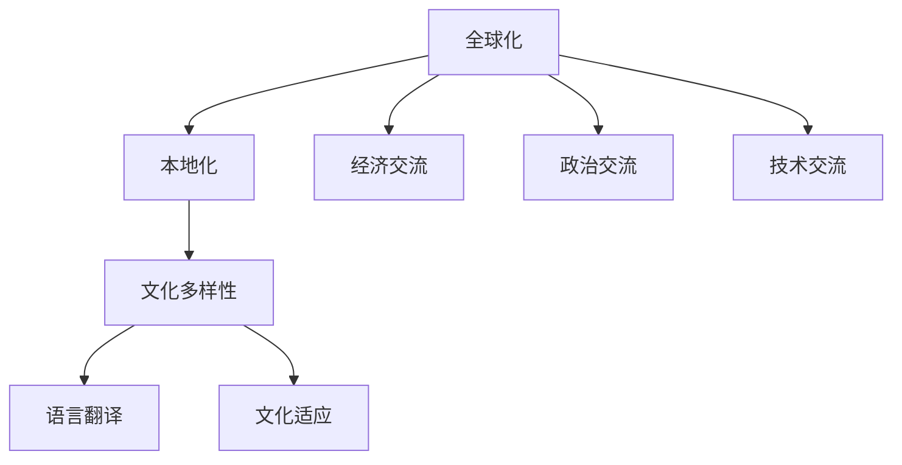

                 


### 1. 设计文章结构

首先，我们要明确文章的结构。这篇文章可以分为以下几个部分：

- 引言：介绍提示词本地化的背景和重要性。
- 核心概念与联系：分析本地化、全球化、文化多样性等核心概念，并用流程图展示它们之间的关系。
- 核心算法原理讲解：详细解释本地化的算法原理，并用伪代码说明。
- 数学模型与公式：介绍用于评估本地化效果的文化适应性评分模型，并用公式和例子说明。
- 项目实战：分析一个实际的本地化项目，包括开发环境搭建、代码实现、代码解读和项目小结。
- 最佳实践与未来趋势：总结文章内容，提供最佳实践建议，并探讨未来的发展趋势和挑战。

### 2. 引言

在引言部分，我们需要简要介绍提示词本地化的背景和重要性。可以提到随着全球化的发展，多语言、跨文化交流变得日益重要，而提示词本地化是实现这一目标的关键技术之一。

### 3. 核心概念与联系

接下来，我们需要详细分析核心概念，包括本地化、全球化、文化多样性等，并用流程图展示它们之间的关系。

#### 3.1. 本地化

本地化是指将产品、服务或内容根据特定地区的文化、语言和习俗进行调整的过程。它是全球化的重要组成部分。

#### 3.2. 全球化

全球化是指在全球范围内进行经济、政治、文化和技术的交流与融合。全球化使得不同国家和地区的文化、语言和习俗相互影响，形成了一个多元共存的世界。

#### 3.3. 文化多样性

文化多样性是指不同国家和地区在文化、语言和习俗上的差异。它决定了本地化过程中需要考虑的因素，如语言翻译、文化适应等。

以下是核心概念之间的关系流程图：



### 4. 核心算法原理讲解

在介绍核心算法原理时，我们可以使用伪代码来详细阐述。

#### 4.1. 提示词本地化算法

```python
# 伪代码：提示词本地化算法
def localize_prompt(prompt, target_language):
    # 步骤 1：分析源语言提示词
    source_tokens = analyze_tokens(prompt)

    # 步骤 2：根据目标语言，查找相应的翻译或替换
    target_tokens = translate_tokens(source_tokens, target_language)

    # 步骤 3：生成目标语言提示词
    localized_prompt = generate_prompt(target_tokens)

    return localized_prompt
```

#### 4.2. 文化适应性评分模型

```latex
$$
C.A.S. = \frac{C_1 + C_2 + C_3}{3}
$$

其中，$C_1$ 为语言翻译得分，$C_2$ 为文化适应得分，$C_3$ 为用户满意度得分。
```

### 5. 项目实战

在项目实战部分，我们需要分析一个实际的本地化项目，包括开发环境搭建、代码实现、代码解读和项目小结。

#### 5.1. 项目背景

假设我们要为一家跨国公司开发一款智能客服系统，该系统需要支持多种语言和地区，以便更好地服务全球客户。

#### 5.2. 开发环境搭建

我们需要搭建一个支持多种语言和地区的开发环境，包括：

- 多语言支持：选择一款支持多种语言的开源框架或库，如 Flask 或 Django。
- 地区支持：配置服务器，使其支持多个地区的时区、货币和语言设置。

#### 5.3. 代码实现

以下是代码实现的伪代码：

```python
# 伪代码：智能客服系统本地化
def get_localized_prompt(user_input, user_locale):
    # 步骤 1：分析用户输入
    source_tokens = analyze_tokens(user_input)

    # 步骤 2：根据用户语言和地区，查找相应的翻译或替换
    target_tokens = translate_tokens(source_tokens, user_locale)

    # 步骤 3：生成本地化提示词
    localized_prompt = generate_prompt(target_tokens)

    # 步骤 4：评估文化适应性得分
    cas_score = calculate_cas(target_tokens, user_locale)

    return localized_prompt, cas_score
```

#### 5.4. 代码解读与分析

在这段代码中，我们首先分析用户输入，然后根据用户语言和地区查找相应的翻译或替换，生成本地化提示词。最后，我们评估文化适应性得分，以衡量本地化效果。

#### 5.5. 项目小结

通过这个项目，我们实现了智能客服系统的本地化功能，支持多种语言和地区。这个项目不仅提高了用户体验，还增强了公司的全球化竞争力。

### 6. 最佳实践与未来趋势

在最后一部分，我们需要总结文章内容，提供最佳实践建议，并探讨未来的发展趋势和挑战。

#### 6.1. 最佳实践

- 在进行本地化时，要充分考虑目标市场的文化背景和用户需求。
- 选择合适的本地化工具和技术，以提高效率和准确性。
- 定期评估本地化效果，以便及时调整和优化。

#### 6.2. 未来趋势

- 随着人工智能和机器学习技术的发展，自动化本地化技术将变得更加成熟和高效。
- 多模态本地化（包括语音、图像、视频等）将成为未来的重要趋势。
- 跨文化交流和融合将越来越普遍，本地化技术将在其中发挥重要作用。

#### 6.3. 挑战

- 随着全球化程度的提高，本地化需求将变得更加复杂和多样化。
- 本地化过程中，如何平衡文化多样性与一致性，仍是一个挑战。
- 保护用户隐私和数据安全，也是本地化过程中需要重视的问题。

### 7. 文章结尾

最后，我们需要在文章末尾写上作者信息，并感谢读者的阅读。

```
作者：AI天才研究院/AI Genius Institute & 禅与计算机程序设计艺术 /Zen And The Art of Computer Programming
```

以上就是设计文章结构的过程。接下来，我们可以根据这个结构，逐步撰写文章内容。

