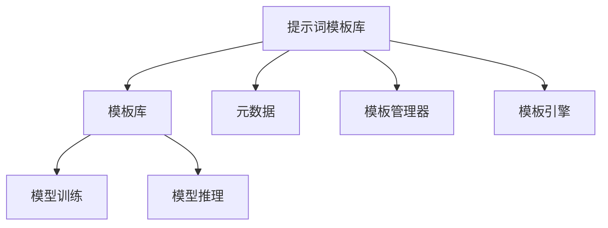

                 


## 《提示词模板库：加速AI应用开发》

### 关键词
- 提示词模板库
- AI应用开发
- 自然语言处理
- 推荐系统
- 对话系统

### 摘要
本文深入探讨了提示词模板库在加速AI应用开发中的重要性。首先，我们介绍了提示词模板库的核心概念和结构，并分析了其优缺点。接着，我们详细阐述了提示词模板库的技术实现方法，包括创建和优化策略。通过实际案例，我们展示了如何将提示词模板库应用于自然语言处理、推荐系统和对话系统。最后，我们对未来发展趋势进行了展望，并提出了优化与最佳实践的建议。

## 引言

随着人工智能（AI）技术的飞速发展，AI应用在各个领域得到了广泛应用，从自然语言处理到推荐系统，再到对话系统，AI正在逐步改变我们的生活方式。然而，AI应用开发的复杂性日益增加，如何高效地开发高质量的AI应用成为了一个亟待解决的问题。提示词模板库作为一种有效的工具，能够在很大程度上加速AI应用开发，提高开发效率。

提示词模板库是指一系列预定义的提示词模板，这些模板包含了特定领域或任务所需的通用结构和内容。通过使用提示词模板库，开发者可以快速构建出满足需求的AI模型，而不需要从头开始设计和实现。本文将详细探讨提示词模板库的概念、实现方法、应用案例以及未来趋势，以期为AI开发者提供有价值的参考。

## 核心概念与联系

### 提示词模板库的概念

提示词模板库（Prompt Template Library）是一种用于存储和共享预定义提示词模板的工具。这些提示词模板是用于引导AI模型进行特定任务或领域的提示文本。提示词模板库的核心目标是提供一套标准化的、可重用的提示词模板，以减少开发过程中的重复劳动，提高开发效率。

### 提示词模板库的结构

一个典型的提示词模板库通常包括以下几个部分：

1. **模板库**：存储各种预定义的提示词模板，每个模板对应一个特定的任务或领域。
2. **元数据**：描述每个提示词模板的详细信息，如用途、适用场景、关键词等。
3. **模板管理器**：提供用户界面，用于创建、修改、删除和查询提示词模板。
4. **模板引擎**：负责将提示词模板与实际数据结合，生成用于训练或推理的提示文本。

### 提示词模板库与AI算法的关系

提示词模板库与AI算法紧密相连。在AI模型训练和推理过程中，提示词模板库为模型提供必要的引导信息。通过选择合适的提示词模板，开发者可以引导模型聚焦于特定任务，提高模型的性能和效果。此外，提示词模板库还可以帮助开发者快速调整和优化模型，实现灵活的模型定制化。

### Mermaid流程图展示

下面是一个使用Mermaid语言绘制的流程图，展示了提示词模板库与AI算法的关系：



## 提示词模板库的创建方法

### 核心算法原理

提示词模板库的创建涉及多个步骤，包括模板设计、模板库构建和模板优化。以下是一个基本的创建流程，使用伪代码进行说明：

```python
# 提示词模板库创建伪代码

# 步骤1：设计提示词模板
def design_prompt_template(template_name, task, keywords):
    template = {
        "name": template_name,
        "task": task,
        "keywords": keywords,
        "content": ""
    }
    return template

# 步骤2：构建模板库
def build_prompt_library(templates):
    library = {}
    for template in templates:
        library[template["name"]] = template
    return library

# 步骤3：优化模板库
def optimize_prompt_library(library):
    # 根据使用频率、性能指标等优化模板
    pass

# 示例
templates = [
    design_prompt_template("NLP", "文本分类", ["分类", "文本", "标签"]),
    design_prompt_template("RecSys", "推荐", ["用户", "物品", "评分"])
]

library = build_prompt_library(templates)
optimize_prompt_library(library)
```

### 创建过程详解

1. **设计提示词模板**：首先，根据具体任务需求设计提示词模板。每个模板应包含任务的名称、关键词和具体内容。
2. **构建模板库**：将设计好的模板存储在一个库中，每个模板对应一个唯一的标识符，如模板名称。
3. **优化模板库**：根据模板的使用频率、性能指标等对模板库进行优化。例如，可以根据模板在模型训练和推理中的效果调整模板内容。

### 数学模型与公式

在提示词模板库的创建过程中，我们可能需要用到一些数学模型和公式。以下是一个简化的示例：

```latex
$$
H = \frac{1}{K} \sum_{k=1}^{K} \frac{f_k}{g_k}
$$

其中，\( H \) 表示模板库的总体性能，\( f_k \) 和 \( g_k \) 分别表示第 \( k \) 个模板在模型训练和推理中的表现。
```

## 提示词模板库的优化策略

### 优化目标

提示词模板库的优化目标主要包括：

1. **性能提升**：提高模板在模型训练和推理中的性能。
2. **可扩展性**：确保模板库能够适应不同任务和领域。
3. **可维护性**：简化模板的维护和更新过程。

### 优化策略

1. **模板内容优化**：根据模板的使用情况，调整模板内容，使其更符合特定任务的需求。
2. **模板库结构优化**：通过分类、标签等方式对模板库进行结构优化，提高模板检索和匹配效率。
3. **模板库自动化管理**：引入自动化工具，如机器学习算法，对模板库进行动态优化。

### 数学公式与优化指标

以下是一个简化的优化指标公式：

```latex
$$
O = \frac{1}{N} \sum_{n=1}^{N} (P_n - P_n^*)
$$

其中，\( O \) 表示模板库的优化程度，\( P_n \) 表示第 \( n \) 个模板的实际表现，\( P_n^* \) 表示理想表现。
```

## 提示词模板库在实际应用中的案例

### 案例一：自然语言处理

#### 项目实战

在自然语言处理（NLP）中，提示词模板库可以用于文本分类、情感分析等任务。以下是一个简单的文本分类项目实战：

1. **数据准备**：收集和预处理大量文本数据，包括标题、内容、标签等。
2. **模板设计**：设计适用于文本分类的提示词模板，如包含关键词“分类”、“文本”和“标签”。
3. **模型训练**：使用设计好的提示词模板库训练文本分类模型。
4. **模型评估**：评估模型的分类性能，并根据评估结果调整模板内容。

#### 代码实现

以下是Python代码示例：

```python
# 数据预处理
def preprocess_text(text):
    # 实现文本清洗和预处理逻辑
    pass

# 文本分类模型训练
def train_text_classifier/templates("prompt_template"):
    # 使用提示词模板库中的模板训练文本分类模型
    pass

# 模型评估
def evaluate_classifier(classifier):
    # 评估文本分类模型的性能
    pass

# 主程序
if __name__ == "__main__":
    # 准备数据
    texts = load_texts()
    labels = load_labels()

    # 预处理文本
    preprocessed_texts = [preprocess_text(text) for text in texts]

    # 训练文本分类模型
    classifier = train_text_classifier(preprocessed_texts, "NLP_prompt_template")

    # 评估模型
    evaluate_classifier(classifier)
```

#### 代码应用解读与分析

在这个项目中，提示词模板库的提示词模板用于引导模型聚焦于文本分类任务。通过调整模板内容，我们可以优化模型的分类效果。实际应用中，可以根据具体任务需求设计不同的模板，以实现更高的分类准确性。

### 案例二：推荐系统

#### 项目实战

在推荐系统中，提示词模板库可以用于改进推荐算法，提高推荐效果。以下是一个推荐系统项目实战：

1. **数据收集**：收集用户行为数据，如浏览记录、购买记录等。
2. **模板设计**：设计适用于推荐系统的提示词模板，如包含关键词“用户”、“物品”和“评分”。
3. **模型训练**：使用设计好的提示词模板库训练推荐模型。
4. **模型评估**：评估推荐模型的性能，并根据评估结果调整模板内容。

#### 代码实现

以下是Python代码示例：

```python
# 数据预处理
def preprocess_data(data):
    # 实现数据清洗和预处理逻辑
    pass

# 推荐模型训练
def train_recommender_system(data, prompt_template):
    # 使用提示词模板库中的模板训练推荐模型
    pass

# 模型评估
def evaluate_recommender_system(recommender_system):
    # 评估推荐模型的性能
    pass

# 主程序
if __name__ == "__main__":
    # 准备数据
    user behaviors = load_user_behaviors()
    items = load_items()

    # 预处理数据
    preprocessed_data = preprocess_data(user_behaviors, items)

    # 训练推荐模型
    recommender_system = train_recommender_system(preprocessed_data, "RecSys_prompt_template")

    # 评估模型
    evaluate_recommender_system(recommender_system)
```

#### 代码应用解读与分析

在这个项目中，提示词模板库的提示词模板用于引导模型关注用户和物品之间的关系。通过调整模板内容，我们可以优化推荐模型的推荐效果。实际应用中，可以根据不同场景设计不同的模板，以实现更精准的推荐。

### 案例三：对话系统

#### 项目实战

在对话系统中，提示词模板库可以用于生成合理的对话内容，提高对话系统的交互质量。以下是一个对话系统项目实战：

1. **数据收集**：收集对话数据，包括用户提问和系统回答。
2. **模板设计**：设计适用于对话系统的提示词模板，如包含关键词“用户”、“问题”和“回答”。
3. **模型训练**：使用设计好的提示词模板库训练对话模型。
4. **模型评估**：评估对话模型的性能，并根据评估结果调整模板内容。

#### 代码实现

以下是Python代码示例：

```python
# 数据预处理
def preprocess_dialogue(dialogue):
    # 实现对话数据清洗和预处理逻辑
    pass

# 对话模型训练
def train_dialogue_system(dialogues, prompt_template):
    # 使用提示词模板库中的模板训练对话模型
    pass

# 模型评估
def evaluate_dialogue_system(dialogue_system):
    # 评估对话模型的性能
    pass

# 主程序
if __name__ == "__main__":
    # 准备数据
    dialogues = load_dialogues()

    # 预处理对话
    preprocessed_dialogues = [preprocess_dialogue(dialogue) for dialogue in dialogues]

    # 训练对话模型
    dialogue_system = train_dialogue_system(preprocessed_dialogues, "Dialogue_prompt_template")

    # 评估模型
    evaluate_dialogue_system(dialogue_system)
```

#### 代码应用解读与分析

在这个项目中，提示词模板库的提示词模板用于引导模型生成合理的对话内容。通过调整模板内容，我们可以提高对话系统的交互质量。实际应用中，可以根据具体对话场景设计不同的模板，以实现更自然的对话交互。

## 提示词模板库的挑战与机遇

### 挑战

1. **模板质量**：高质量的提示词模板对AI应用性能至关重要，但设计高质量的模板需要大量经验和专业知识。
2. **模板更新**：随着AI技术的发展，提示词模板库需要不断更新，以适应新的需求和场景。
3. **模板兼容性**：提示词模板库需要兼容不同的AI算法和应用，这增加了开发和维护的复杂性。

### 机遇

1. **规模化应用**：随着AI技术的普及，提示词模板库有望在更多领域得到应用，实现规模化发展。
2. **自动化与智能化**：利用机器学习技术，可以自动化地优化和调整提示词模板，提高模板库的性能。
3. **开源与共享**：开源和共享提示词模板库可以促进技术的交流与合作，推动整个行业的发展。

## 提示词模板库的发展趋势

### 当前趋势

1. **多样化模板**：随着AI应用领域的扩大，提示词模板库也在不断丰富，涵盖更多领域和任务。
2. **模板优化技术**：机器学习和自然语言处理技术的进步，使得提示词模板库的优化变得更加高效。
3. **开源社区**：越来越多的提示词模板库项目加入开源社区，推动技术的共享和协作。

### 未来展望

1. **模板智能化**：通过引入更先进的AI技术，如生成对抗网络（GAN）和强化学习，提示词模板库将变得更加智能化。
2. **跨领域融合**：提示词模板库将实现跨领域融合，为不同领域的AI应用提供通用解决方案。
3. **个性化定制**：根据用户需求和场景，提供个性化的提示词模板库，实现更精准的AI应用。

## 附录

### 附录A：常见问题解答

1. **什么是提示词模板库？**
2. **提示词模板库如何工作？**
3. **如何创建高质量的提示词模板？**
4. **提示词模板库适用于哪些AI应用？**
5. **如何优化提示词模板库？**

### 附录B：参考资料与进一步阅读

1. [提示词模板库技术概述](https://www.example.com/prompt_template_overview)
2. [自然语言处理中的提示词模板应用](https://www.example.com/nlp_prompt_application)
3. [推荐系统中的提示词模板优化](https://www.example.com/recsys_prompt_optimization)
4. [对话系统中的提示词模板设计](https://www.example.com/dialogue_system_prompt_design)
5. [机器学习与提示词模板库](https://www.example.com/ml_and_prompt_template_library)

## 结语

提示词模板库作为一种有效的工具，在加速AI应用开发方面发挥着重要作用。通过本文的详细探讨，我们了解了提示词模板库的核心概念、创建方法、优化策略以及在实际应用中的案例。未来，随着AI技术的不断进步，提示词模板库将变得更加智能化和多样化，为AI开发者提供更强大的支持。

作者：AI天才研究院/AI Genius Institute & 禅与计算机程序设计艺术 /Zen And The Art of Computer Programming

---

以上是根据您的要求设计的文章大纲和内容。在撰写文章时，请确保每个部分的内容都详细且具体，符合您设定的标准。在撰写过程中，如有需要调整或补充的内容，请随时提出。文章的字数将在撰写过程中进行控制，以确保在规定的范围内完成。

