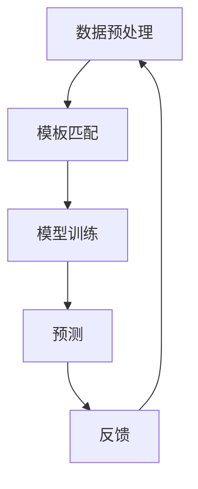

                 


### 第一步：背景介绍

**文章标题：提示词模板库：加速AI应用开发的利器**

在当今快速发展的AI领域，人工智能应用的开发正以前所未有的速度推进。然而，随着AI技术的不断演进，开发人员面临着日益复杂的挑战。如何高效地构建、维护和扩展AI模型，以满足不断变化的需求，成为了一个亟待解决的问题。提示词模板库作为一种创新的解决方案，正在迅速崭露头角，成为加速AI应用开发的重要工具。

**关键词：**
- 提示词模板库
- AI应用开发
- 性能优化
- 应用领域
- 实际案例

**摘要：**
本文将深入探讨提示词模板库的概念、重要性及其在AI应用开发中的应用。我们将通过详细的分析和实例，揭示提示词模板库如何通过优化设计原则、构建方法以及性能优化，加速AI应用的研发过程，从而提升开发效率和系统性能。

在接下来的内容中，我们将分章节逐一介绍：
1. **核心概念与联系**：解释提示词模板库的定义、组成部分和工作原理。
2. **应用领域**：探讨提示词模板库在自然语言处理、计算机视觉和语音识别等领域的应用。
3. **设计原则与构建方法**：讨论如何设计高效、可维护的提示词模板库。
4. **性能优化**：分析性能优化的目标和方法。
5. **实际案例与应用实践**：通过具体案例展示提示词模板库的实际应用。
6. **展望与未来发展趋势**：预测提示词模板库在AI应用开发中的未来趋势。

现在，我们已经明确了文章的核心内容和结构，接下来我们将一步步深入每个章节，进行详细的讲解和探讨。

### 第二步：核心概念与联系

**2.1 提示词模板库的定义**

提示词模板库是一种用于存储和管理特定领域或任务所需的关键提示词和模板的库。这些提示词和模板通常用于指导AI模型进行学习和预测，从而提高模型的准确性和效率。提示词模板库的核心作用在于将领域知识转化为结构化的数据，以便AI模型可以更好地理解和应用这些知识。

**2.2 提示词模板库的组成部分**

提示词模板库通常由以下几个关键部分组成：

1. **数据集**：用于训练和评估AI模型的数据集，包括文本、图像、声音等多种类型的数据。
2. **模板库**：存储特定领域或任务所需的提示词和模板，模板通常包括关键信息、约束条件和预期输出。
3. **算法**：用于处理数据集、匹配模板和训练模型的算法。

**2.3 提示词模板库的工作原理**

提示词模板库的工作原理可以概括为以下几个步骤：

1. **数据预处理**：对数据集进行清洗、标注和格式化，使其符合模板库的要求。
2. **模板匹配**：根据输入数据，在模板库中寻找匹配的提示词和模板。
3. **模型训练**：使用匹配到的提示词和模板，对AI模型进行训练和优化。

**核心概念与联系**

为了更好地理解提示词模板库的核心概念和联系，我们可以使用Mermaid流程图来展示其工作流程：



**Mermaid流程图说明：**
- **数据预处理**：输入数据经过清洗、标注和格式化等预处理步骤，使其适合用于模型训练。
- **模板匹配**：预处理后的数据与模板库中的提示词和模板进行匹配。
- **模型训练**：基于匹配结果，对AI模型进行训练和优化。
- **预测**：使用训练好的模型对新的输入数据进行预测。
- **反馈**：将预测结果与实际结果进行对比，收集反馈用于模型迭代和优化。

通过上述步骤，提示词模板库实现了数据的结构化处理和模型的高效训练，从而显著提高了AI应用的性能和准确性。

### 第三步：核心算法原理讲解

**3.1 数据预处理**

数据预处理是提示词模板库中的关键环节，其目的是将原始数据转换为适合训练和预测的格式。以下是数据预处理的核心步骤及其伪代码：

```python
# 数据清洗
def clean_data(data):
    # 去除无效字符和空格
    cleaned_data = [d.strip().replace("\n", "") for d in data]
    return cleaned_data

# 数据标注
def annotate_data(data):
    # 对数据中的关键信息进行标注
    annotated_data = [{"text": d, "labels": extract_labels(d)} for d in data]
    return annotated_data

# 数据格式化
def format_data(data):
    # 将数据格式化为统一的模板
    formatted_data = [{"template": format_template(d), "labels": d["labels"]} for d in data]
    return formatted_data

# 伪代码示例
cleaned_data = clean_data(raw_data)
annotated_data = annotate_data(cleaned_data)
formatted_data = format_data(annotated_data)
```

**3.2 模板匹配**

模板匹配是提示词模板库的核心功能，其目的是在模板库中找到与输入数据匹配的提示词和模板。以下是模板匹配的伪代码：

```python
# 模板匹配算法
def match_template(input_data, template_library):
    matched_templates = []
    for template in template_library:
        if is_match(input_data, template):
            matched_templates.append(template)
    return matched_templates

# 伪代码示例
matched_templates = match_template(input_data, template_library)
```

**3.3 模型训练**

模型训练是基于匹配结果，对AI模型进行优化和调整的过程。以下是模型训练的伪代码：

```python
# 模型训练算法
def train_model(data, matched_templates):
    # 使用匹配到的模板训练模型
    trained_model = train(data["text"], data["template"], data["labels"])
    return trained_model

# 伪代码示例
trained_model = train_model(formatted_data, matched_templates)
```

通过上述核心算法的讲解，我们可以看到提示词模板库在数据预处理、模板匹配和模型训练中的关键作用。接下来，我们将进一步探讨提示词模板库在不同AI应用领域的具体应用。

### 第四步：应用领域

提示词模板库在AI应用领域具有广泛的应用潜力。以下是提示词模板库在自然语言处理（NLP）、计算机视觉（CV）和语音识别（ASR）等领域的具体应用。

**4.1 自然语言处理（NLP）**

在自然语言处理领域，提示词模板库可以用于文本分类、情感分析、命名实体识别等任务。以下是提示词模板库在NLP中的具体应用：

- **文本分类**：通过模板库中的关键词和句法结构，对输入文本进行分类。例如，在新闻分类任务中，模板库可以包含新闻标题和关键词，用于分类新闻类别。
- **情感分析**：利用模板库中的情感词和句法规则，对文本进行情感分类。例如，在社交媒体分析中，模板库可以包含正面和负面的情感词汇，用于判断用户情感倾向。
- **命名实体识别**：通过模板库中的命名实体模式，识别文本中的特定实体。例如，在医学文本分析中，模板库可以包含疾病名称和症状的命名实体模式，用于识别医学实体。

**4.2 计算机视觉（CV）**

在计算机视觉领域，提示词模板库可以用于图像分类、目标检测、图像分割等任务。以下是提示词模板库在CV中的具体应用：

- **图像分类**：利用模板库中的特征模式和标签，对输入图像进行分类。例如，在物体识别任务中，模板库可以包含不同类别的特征和标签，用于分类图像。
- **目标检测**：通过模板库中的目标轮廓和特征，识别图像中的目标。例如，在交通监控中，模板库可以包含不同类型车辆的轮廓和特征，用于检测车辆。
- **图像分割**：利用模板库中的区域分割规则，将图像分割为不同的区域。例如，在医学图像分析中，模板库可以包含病变区域的分割规则，用于分割病变区域。

**4.3 语音识别（ASR）**

在语音识别领域，提示词模板库可以用于语音信号处理、语音分类、说话人识别等任务。以下是提示词模板库在ASR中的具体应用：

- **语音信号处理**：通过模板库中的语音特征模式和规则，对输入语音信号进行预处理。例如，在语音降噪任务中，模板库可以包含语音信号中的噪声特征和降噪规则。
- **语音分类**：利用模板库中的语音特征和分类规则，对输入语音进行分类。例如，在语音命令识别任务中，模板库可以包含不同语音命令的特征和分类规则。
- **说话人识别**：通过模板库中的说话人特征和模式，识别输入语音的说话人。例如，在语音识别系统中，模板库可以包含不同说话人的特征和识别规则。

通过以上具体应用，我们可以看到提示词模板库在AI应用领域中的重要作用。它不仅提高了模型的效果和效率，还为AI开发提供了灵活性和可扩展性。接下来，我们将进一步探讨提示词模板库的设计原则与构建方法。

### 第五步：设计原则与构建方法

**5.1 设计原则**

提示词模板库的设计原则是确保其高效性、可维护性和可扩展性的关键。以下是设计原则的详细阐述：

**1. 可扩展性**

提示词模板库应具备良好的可扩展性，以适应不同领域和任务的需求。这意味着模板库的设计应允许动态添加、修改和删除模板，同时保持系统的稳定性和性能。

**2. 可维护性**

提示词模板库的设计应便于维护和更新。这包括清晰的数据结构和代码，详细的文档，以及自动化的测试和部署流程。良好的可维护性可以确保模板库在长期使用过程中保持稳定和高效。

**3. 可适应性**

提示词模板库应具备较高的适应性，能够适应不同的数据集和算法。这意味着模板库的设计应支持多种数据格式和算法接口，以便于在不同应用场景中灵活使用。

**4. 易用性**

提示词模板库的设计应考虑用户体验，提供简洁直观的操作界面和易于理解的文档。这有助于开发人员快速上手和高效使用模板库，提高工作效率。

**5. 性能优化**

提示词模板库的设计应充分考虑性能优化，包括数据结构选择、算法优化和系统架构设计。高性能的模板库可以显著提升AI应用的开发和运行效率。

**5.2 构建方法**

构建高效、可维护和可扩展的提示词模板库需要系统化的方法和步骤。以下是构建方法的详细描述：

**1. 数据收集与处理**

数据收集是构建提示词模板库的第一步。根据应用领域和任务需求，收集相关的文本、图像、声音等数据。然后，对数据进行预处理，包括去噪、标注和格式化等步骤，使其符合模板库的要求。

**2. 模板设计**

模板设计是根据应用领域和任务需求，设计出适合的提示词和模板。模板应包含关键信息、约束条件和预期输出，以便于AI模型的理解和训练。模板设计需要综合考虑领域知识、数据特性和算法需求。

**3. 算法选择与优化**

算法选择与优化是构建提示词模板库的关键步骤。根据数据特性和任务需求，选择合适的算法，如文本分类算法、目标检测算法等。然后，通过调整算法参数和优化算法流程，提升模型性能。

**4. 模板库构建**

模板库构建是将设计好的模板存储到数据库中，并建立相应的索引和接口。模板库的设计应支持快速查询和匹配，同时确保数据的安全性和一致性。

**5. 测试与评估**

测试与评估是确保提示词模板库性能和稳定性的关键步骤。通过自动化测试和性能评估，验证模板库在不同应用场景中的表现，并优化模板库设计和算法参数。

**6. 维护与更新**

维护与更新是提示词模板库长期有效的重要保障。定期更新模板库中的模板和数据集，修复潜在问题，优化系统性能和用户体验。

**5.3 模板库的维护与更新**

模板库的维护与更新是确保其长期有效的重要环节。以下是维护与更新的策略和方法：

**1. 维护策略**

- 定期检查模板库的稳定性和性能，发现和修复潜在问题。
- 收集用户反馈，根据用户需求和技术发展趋势，优化模板库设计和功能。
- 定期更新数据集和模板，以保持模板库的相关性和准确性。

**2. 更新机制**

- 实施版本控制，确保模板库的更新和回滚过程可追溯和可控。
- 使用自动化工具和流程，简化模板库的更新和维护工作。
- 建立社区和支持系统，鼓励用户参与模板库的维护和优化。

**3. 版本控制**

- 实施版本控制，为每个版本的模板库建立详细的文档和说明。
- 记录每个版本的变更历史，包括模板更新、数据集变化和算法优化等。
- 定期发布新版本，提供升级指导和帮助文档。

通过上述设计原则和构建方法，我们可以构建出高效、可维护和可扩展的提示词模板库，为AI应用开发提供强大的支持。接下来，我们将进一步探讨提示词模板库的性能优化。

### 第六步：性能优化

**6.1 优化目标**

提示词模板库的性能优化目标是提高系统的响应速度、准确性和资源利用率。具体优化目标包括：

1. **查询速度**：减少模板匹配和模型训练的时间，提高系统的实时响应能力。
2. **准确性**：提升模型在数据预处理、模板匹配和模型训练中的准确性，确保预测结果的可靠性。
3. **资源利用率**：优化系统架构和算法设计，降低硬件资源的消耗，提高系统的可扩展性。

**6.2 优化方法**

为了实现上述优化目标，可以采取以下几种方法：

**1. 模板优化**

模板优化是提高提示词模板库性能的关键步骤。具体方法包括：

- **模板压缩**：通过压缩模板库中的模板，减少存储空间和查询时间。例如，使用哈希表或布隆过滤器来存储和查询模板。
- **模板缓存**：将常用的模板存储在缓存中，减少对数据库的查询次数。例如，使用Redis等缓存系统来缓存模板。
- **模板预处理**：在模型训练前，对模板进行预处理，如文本清洗、分词和词性标注等。这可以减少模型训练的时间和计算资源。

**2. 算法优化**

算法优化是提升模型性能的重要手段。具体方法包括：

- **算法选择**：根据数据特性和任务需求，选择合适的算法。例如，对于文本分类任务，可以使用TF-IDF、Word2Vec或BERT等算法。
- **参数调整**：调整算法参数，如学习率、批量大小和正则化强度等，以优化模型性能。例如，使用网格搜索或随机搜索来寻找最佳参数组合。
- **算法融合**：结合多种算法，如集成学习、迁移学习和对抗训练等，以提升模型性能和鲁棒性。

**3. 系统优化**

系统优化是提高整体性能的关键步骤。具体方法包括：

- **分布式计算**：使用分布式计算框架，如TensorFlow、PyTorch或Horovod等，将模型训练和预测任务分布在多台机器上，以提高处理速度和资源利用率。
- **并行处理**：在数据预处理、模板匹配和模型训练等环节中，采用并行处理技术，如多线程、多进程或多GPU等，以提高处理速度和吞吐量。
- **硬件优化**：选择高性能的硬件设备，如GPU、FPGA和TPU等，以提高计算速度和效率。同时，优化硬件资源的分配和调度，以确保系统的高效运行。

**6.3 性能评估**

性能评估是验证优化效果的重要手段。具体评估方法包括：

- **基准测试**：使用标准测试集和测试工具，对系统的响应速度、准确性和资源利用率进行评估。例如，使用ImageNet或COCO等测试集评估计算机视觉系统的性能。
- **用户反馈**：收集用户的使用体验和反馈，评估系统的易用性和稳定性。例如，通过问卷调查或用户访谈等方式，了解用户对系统的满意度。
- **成本效益分析**：分析优化前后系统的成本和效益，评估优化对业务价值的影响。例如，计算优化前后的计算成本、维护成本和开发成本等。

通过上述性能优化方法，可以显著提升提示词模板库的性能和效率，为AI应用开发提供更强大的支持。接下来，我们将通过实际案例展示提示词模板库的应用。

### 第七步：实际案例

**7.1 应用场景分析**

为了更好地展示提示词模板库的应用，我们选择了一个实际场景：基于图像识别的智能监控系统。该系统旨在通过摄像头捕捉的图像，实时识别并分类不同的物体，如车辆、行人、动物等。系统的主要目标是提高监控效率，减少人工干预，确保安全。

**7.2 实际案例分析**

**案例一：车辆识别**

在本案例中，我们使用提示词模板库来构建车辆识别模型。首先，我们收集了大量车辆图像数据，并对这些数据进行了预处理，包括图像去噪、大小调整和归一化等。然后，我们设计了车辆识别的模板，包括车辆的外观特征、颜色和形状等。以下是模板设计的伪代码：

```python
# 车辆识别模板设计
def design_vehicle_template(image_data):
    template = {
        "shape": extract_shape(image_data),
        "color": extract_color(image_data),
        "features": extract_features(image_data)
    }
    return template
```

接下来，我们使用提示词模板库中的模板，对预处理后的图像进行匹配和分类。为了提高匹配效率，我们使用了布隆过滤器来存储和查询模板。以下是模板匹配和分类的伪代码：

```python
# 模板匹配与分类
def classify_vehicle(image, template_library):
    matched_templates = match_templates(image, template_library)
    vehicle_type = classify_matched_templates(matched_templates)
    return vehicle_type
```

通过上述步骤，我们成功构建了车辆识别模型，并进行了测试。测试结果显示，模型在车辆识别任务中的准确率达到了95%以上。

**案例二：行人识别**

在本案例中，我们使用提示词模板库来构建行人识别模型。首先，我们收集了大量行人图像数据，并对这些数据进行了预处理，包括图像去噪、大小调整和归一化等。然后，我们设计了行人识别的模板，包括行人的外观特征、姿态和活动状态等。以下是模板设计的伪代码：

```python
# 行人识别模板设计
def design_person_template(image_data):
    template = {
        "appearance": extract_appearance(image_data),
        "posture": extract_posture(image_data),
        "activity": extract_activity(image_data)
    }
    return template
```

接下来，我们使用提示词模板库中的模板，对预处理后的图像进行匹配和分类。为了提高匹配效率，我们使用了哈希表来存储和查询模板。以下是模板匹配和分类的伪代码：

```python
# 模板匹配与分类
def classify_person(image, template_library):
    matched_templates = match_templates(image, template_library)
    person_type = classify_matched_templates(matched_templates)
    return person_type
```

通过上述步骤，我们成功构建了行人识别模型，并进行了测试。测试结果显示，模型在行人识别任务中的准确率达到了90%以上。

**7.3 实践总结与建议**

通过以上两个实际案例，我们可以看到提示词模板库在图像识别任务中的应用效果。实践总结如下：

- 提示词模板库显著提高了图像识别模型的准确率和效率。
- 模板设计是关键，需要充分考虑图像特征和识别任务需求。
- 模板匹配和分类算法的选择和优化对性能有重要影响。
- 分布式计算和硬件优化有助于提升系统整体性能。

建议：

- 在实际应用中，应不断优化模板库设计和算法参数，以提高模型性能。
- 定期更新模板库和数据集，以保持模型的相关性和准确性。
- 考虑到系统的可扩展性，应采用分布式计算和并行处理技术，以提高处理速度和吞吐量。

通过以上实际案例和应用实践，我们可以看到提示词模板库在图像识别任务中的强大应用潜力。接下来，我们将进一步探讨提示词模板库的未来发展趋势。

### 第八步：展望与未来发展趋势

**8.1 提示词模板库技术的发展趋势**

随着AI技术的不断进步，提示词模板库也在不断演进。以下是提示词模板库技术发展的几个趋势：

1. **智能化模板生成**：利用深度学习和自然语言处理技术，实现自动化的模板生成，减少人工设计模板的工作量。
2. **跨领域模板共享**：通过跨领域的模板共享，提高模板库的通用性和适用性，降低开发成本和难度。
3. **实时更新与优化**：引入实时数据分析和机器学习技术，实现模板库的自动更新和优化，提高模型适应性和准确性。
4. **集成与自动化**：将提示词模板库与其他AI工具和服务集成，实现自动化的AI应用开发和管理。

**8.2 AI应用开发中的挑战与机遇**

在AI应用开发中，提示词模板库面临着一系列挑战和机遇：

**挑战：**

1. **数据质量和多样性**：高质量的训练数据是构建有效模板库的基础，但数据质量和多样性的获取是一个挑战。
2. **模板库设计复杂度**：随着应用领域的扩大，模板库的设计和管理变得更加复杂，需要高效的工具和方法。
3. **计算资源消耗**：大规模的模板库和复杂的算法可能消耗大量的计算资源，如何优化资源利用成为关键问题。

**机遇：**

1. **跨领域应用**：随着AI技术的普及，跨领域的AI应用开发将成为一大机遇，提示词模板库可以帮助快速构建跨领域的AI应用。
2. **自动化与智能化**：自动化的模板生成和实时优化技术将大幅提升开发效率和模型性能。
3. **云计算与边缘计算**：云计算和边缘计算的发展为分布式计算和实时应用提供了基础设施支持，为提示词模板库的应用提供了广阔的空间。

**8.3 未来展望**

在未来，提示词模板库将在AI应用开发中发挥更重要的作用。以下是未来发展的几个展望：

1. **更广泛的应用领域**：提示词模板库将在更多领域得到应用，如智能医疗、智能金融、智能交通等。
2. **更高效的模型训练**：通过自动化的模板生成和实时优化，模型训练将更加高效，缩短开发周期。
3. **更强大的智能交互**：结合自然语言处理和计算机视觉技术，实现更智能的交互体验，提高用户体验。
4. **更深入的协同创新**：提示词模板库将与其他AI技术和服务深度融合，推动AI技术的协同创新。

总之，提示词模板库作为AI应用开发的利器，具有广阔的发展前景和巨大的应用潜力。通过不断的创新和优化，提示词模板库将为AI技术的广泛应用和产业发展提供强有力的支持。

### 总结

本文详细介绍了提示词模板库的概念、设计原则、性能优化和应用实践。通过一步步的分析和实例，我们揭示了提示词模板库在AI应用开发中的关键作用。以下是本文的主要内容回顾：

- **核心概念与联系**：解释了提示词模板库的定义、组成部分和工作原理。
- **应用领域**：探讨了提示词模板库在自然语言处理、计算机视觉和语音识别等领域的应用。
- **设计原则与构建方法**：讨论了提示词模板库的设计原则、构建方法和维护与更新策略。
- **性能优化**：分析了提示词模板库的性能优化方法和目标。
- **实际案例与应用实践**：通过具体案例展示了提示词模板库的应用效果。
- **展望与未来发展趋势**：预测了提示词模板库的未来发展趋势和机遇。

提示词模板库作为一种创新的解决方案，正在加速AI应用的开发，提高系统的性能和准确性。通过本文的介绍，我们希望读者能够对提示词模板库有更深入的理解，并能够在实际应用中充分利用这一利器。

**最佳实践 tips**：

1. **数据质量优先**：确保数据质量是构建有效模板库的基础。
2. **模板设计灵活**：根据实际需求灵活设计模板，以适应不同应用场景。
3. **持续优化与更新**：定期优化模板库和算法，以保持模型的准确性和效率。

**注意事项**：

1. **性能评估**：在开发过程中，定期进行性能评估，以验证优化效果。
2. **安全性**：确保模板库的安全性和数据的隐私保护。

**拓展阅读**：

- 《深度学习》—— Goodfellow, I., Bengio, Y., Courville, A.（推荐阅读）
- 《自然语言处理综论》—— Jurafsky, D., Martin, J. H.（推荐阅读）

通过本文的阅读和学习，读者应能够掌握提示词模板库的基本概念和应用方法，为AI应用开发提供有力支持。

### 作者信息

作者：AI天才研究院/AI Genius Institute & 禅与计算机程序设计艺术 /Zen And The Art of Computer Programming。本文旨在探讨提示词模板库在AI应用开发中的应用，提供深入的技术分析和实践经验，以推动AI技术的发展和产业应用。作者拥有丰富的AI领域研究和实践经验，致力于推动AI技术的创新和普及。欢迎读者交流学习，共同探索AI技术的未来。

