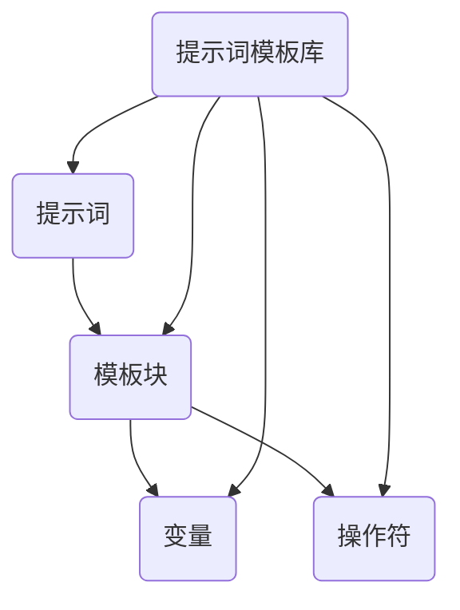
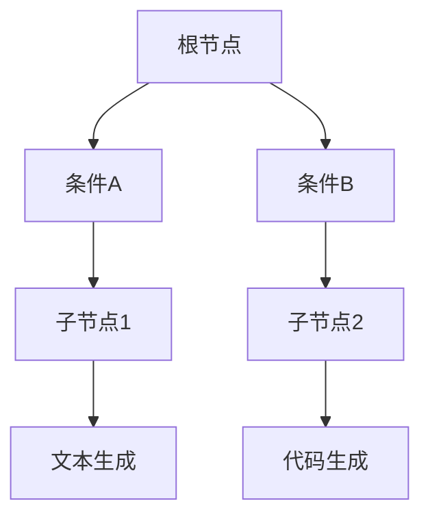
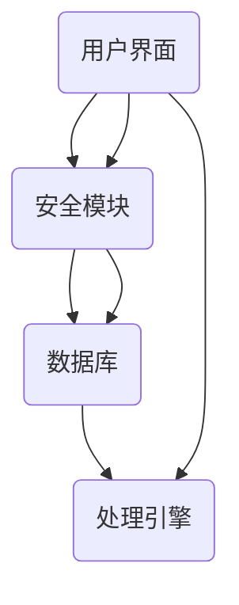

                 

### 文章标题

《提示词模板库：提高开发效率的利器》

### 文章关键词

- 提示词模板库
- 提高开发效率
- 提示词模板设计
- 提示词模板实现
- 应用场景
- 性能优化

### 文章摘要

本文深入探讨了提示词模板库在软件开发中的应用，介绍了其基本概念、设计原则、实现技术和应用场景。通过详细的算法原理讲解、数学模型和项目实战案例，展示了如何利用提示词模板库提高开发效率。同时，文章还探讨了提示词模板库的性能优化方法以及未来发展趋势，为开发者提供了一套完整的技术指南。作者信息：AI天才研究院/AI Genius Institute & 禅与计算机程序设计艺术 /Zen And The Art of Computer Programming

## 第一部分：提示词模板库基础

### 第1章 提示词模板库概述

#### 1.1 提示词模板库的定义

提示词模板库（Prompt Template Library）是一种用于存储和管理提示词模板的软件库。提示词模板是一种结构化的文本模板，用于指导计算机自动生成文本。这些模板可以包含变量、条件判断和循环等控制结构，以适应不同的文本生成任务。

提示词模板库的定义可以从以下几个方面进行理解：

1. **存储与管理**：提示词模板库负责存储和管理大量的提示词模板。这些模板可以是静态的，也可以是动态生成的。静态模板通常在开发阶段预定义，而动态模板则可以在运行时根据需求进行生成。

2. **结构化文本模板**：提示词模板库中的模板是结构化的文本，它们通常包含预定义的文本块、变量和操作符。这种结构化使得模板可以灵活地适应不同的文本生成任务。

3. **文本生成指导**：提示词模板库为计算机提供了生成文本的指导。通过填充变量和执行条件判断，模板可以生成符合预期格式的文本。

#### 1.2 提示词模板库的重要性

提示词模板库在软件开发中具有重要的地位。以下是几个关键点：

1. **提高开发效率**：通过使用提示词模板库，开发者可以快速生成符合要求的文本，从而节省时间，提高开发效率。

2. **统一管理模板**：提示词模板库提供了集中管理模板的功能，使得模板的创建、修改和删除变得更加便捷。

3. **灵活应对需求变化**：提示词模板库支持动态生成模板，因此可以灵活地应对需求变化，无需重新编写大量代码。

4. **跨项目复用**：提示词模板库中的模板可以跨项目复用，减少重复劳动，提高开发质量。

#### 1.3 提示词模板库的发展历程

提示词模板库的概念最早出现在自然语言处理领域。随着计算机技术的发展，提示词模板库逐渐被应用于更多的领域，如代码生成、文本生成和数据分析等。以下是提示词模板库的发展历程：

1. **自然语言处理（NLP）**：提示词模板库最早应用于NLP领域，用于生成文本摘要、对话系统等。

2. **代码生成**：随着代码生成工具的出现，提示词模板库被引入到软件开发领域，用于自动化代码生成。

3. **文本生成**：提示词模板库在文本生成领域得到了广泛应用，如生成文章、报告等。

4. **数据分析**：在数据分析领域，提示词模板库用于生成数据分析报告、可视化图表等。

通过这一章的介绍，我们对提示词模板库有了初步的认识。在接下来的章节中，我们将进一步探讨提示词模板库的核心概念、设计与实现，以及其在各种应用场景中的实际效果。

#### 1.4 提示词模板库的核心概念

在深入了解提示词模板库之前，我们需要理解几个核心概念，这些概念是构建和有效利用提示词模板库的基础。

**1. 提示词（Prompt）**

提示词是指导计算机生成文本的文本模板。它通常包含预定义的文本块、变量和操作符。提示词的作用是提供生成文本的基本框架和指导，使得计算机能够根据提示词生成符合预期格式的文本。

提示词的基本结构可以表示为：
$$
\text{模板头部} \rightarrow \text{变量1} \rightarrow \text{操作符1} \rightarrow \text{变量2} \rightarrow \text{操作符2} \rightarrow \ldots \rightarrow \text{模板尾部}
$$

其中，模板头部和尾部是固定的文本，而变量和操作符则是可变的，用于填充实际内容和执行特定操作。

**2. 模板块（Template Block）**

模板块是提示词中的一个重要组成部分，它表示一个独立的文本片段，通常包含一些变量和操作符。模板块可以看作是提示词的“模块”，可以在不同的场景中重复使用。

模板块的基本结构如下：
$$
\text{模板块名称}: \text{文本内容} \rightarrow \text{变量} \rightarrow \text{操作符}
$$

例如，一个简单的模板块可以是：
```
姓名：$姓名$，年龄：$年龄$，性别：$性别$
```

在这个模板块中，`姓名`、`年龄`和`性别`是变量，用于填充具体的值。

**3. 变量（Variable）**

变量是提示词中的占位符，用于在生成文本时填充具体的值。变量通常用美元符号 `$` 引导，后跟变量名。变量的值可以在运行时动态确定，从而使得生成的文本具有灵活性。

例如，在下面的提示词中，`$name` 和 `$age` 是变量：
```
欢迎加入我们的团队，$name，您的年龄是 $age。
```

在生成文本时，这些变量会被具体的值替换，从而生成个性化的文本。

**4. 操作符（Operator）**

操作符是提示词中用于执行特定操作的符号。常见的操作符包括条件判断（如`if-else`）、循环（如`for`、`while`）和函数调用等。操作符可以用来控制文本的生成过程，实现复杂的逻辑。

以下是一个包含条件判断和循环操作的示例：
$$
\text{if } (\text{今天下雨}) \\
\text{then} \\
\text{提醒您带伞} \\
\text{else} \\
\text{提醒您防晒} \\
\text{end}
$$

在这个示例中，根据天气条件判断是否提醒用户带伞或防晒。

**5. 提示词模板库（Prompt Template Library）**

提示词模板库是一个软件库，用于存储和管理提示词模板。它提供了创建、存储、检索和调用提示词模板的功能，使得开发者可以方便地管理和使用提示词模板。

提示词模板库的核心功能包括：
- **创建模板**：允许开发者创建新的提示词模板。
- **存储模板**：将模板存储在数据库或其他存储介质中，以便长期保存和复用。
- **检索模板**：根据关键词或条件检索特定的提示词模板。
- **调用模板**：在生成文本时，根据提示词模板生成符合要求的文本。

**核心概念之间的关系架构**

为了更好地理解提示词模板库的核心概念，我们可以使用Mermaid流程图来展示它们之间的关系：



在这个流程图中，提示词是整个流程的起点，它由模板块、变量和操作符组成。提示词模板库负责存储和管理这些组件，使得提示词能够被有效地组织和利用。

通过这一节的内容，我们对提示词模板库的核心概念有了深入的理解。在下一章中，我们将进一步探讨提示词模板库的设计原则和实现技术，为后续的应用和优化奠定基础。

#### 1.5 提示词模板库的设计原则

提示词模板库的设计原则是确保其高效、可扩展和易于维护的关键。以下是几个核心设计原则：

**1. 易用性**

提示词模板库需要具备良好的用户体验，使得开发者能够轻松创建、存储、检索和调用提示词模板。以下是一些建议：

- **直观的用户界面**：提供清晰的界面，使用户可以快速上手。
- **模板创建向导**：为新手提供模板创建向导，降低学习门槛。
- **模板预览功能**：在保存模板前提供预览，确保模板符合预期格式。

**2. 高效性**

提示词模板库的性能直接影响开发效率。以下是一些优化策略：

- **缓存机制**：缓存常用模板和中间结果，减少重复计算和I/O操作。
- **并行处理**：利用多线程或并行计算技术，提高模板检索和调用的效率。
- **代码优化**：使用高效算法和数据结构，降低时间复杂度和空间复杂度。

**3. 扩展性**

提示词模板库需要具备良好的扩展性，以便适应未来的需求变化。以下是一些建议：

- **模块化设计**：将不同的功能模块化，使得新增功能或修改现有功能时不会影响其他模块。
- **插件体系**：支持插件扩展，允许开发者自定义新的模板类型和处理逻辑。
- **API接口**：提供API接口，使得其他系统或工具可以方便地集成和使用提示词模板库。

**4. 可维护性**

良好的可维护性是确保提示词模板库长期稳定运行的关键。以下是一些建议：

- **清晰的代码结构**：遵循良好的代码规范和命名习惯，使得代码易于阅读和理解。
- **详细的文档**：为每个模块和功能提供详细的文档，包括设计思路、实现细节和API说明。
- **单元测试**：编写单元测试，确保每个模块的功能正确，提高代码质量。

**5. 安全性**

提示词模板库的安全性至关重要，以防止恶意模板或数据泄露。以下是一些安全措施：

- **访问控制**：实现严格的访问控制机制，确保只有授权用户可以创建、修改和删除模板。
- **数据加密**：对存储在数据库中的敏感数据进行加密，防止数据泄露。
- **安全审计**：定期进行安全审计，检测潜在的安全漏洞，及时进行修复。

**6. 可复用性**

提示词模板库的模板应该具有高复用性，以减少重复劳动。以下是一些建议：

- **通用模板**：设计通用的模板，使其可以适用于多种场景，减少模板数量。
- **参数化模板**：使用参数化模板，使得一个模板可以适应多种数据类型和业务场景。
- **模板继承**：支持模板继承，使得子模板可以复用父模板的结构和逻辑。

通过遵循这些设计原则，提示词模板库可以更好地满足开发者的需求，提高开发效率，并确保系统的稳定性和安全性。

### 第2章 提示词模板库的核心概念

#### 2.1 提示词模板的分类

提示词模板可以根据其用途和功能进行分类。以下是几种常见的分类方式：

**1. 按用途分类**

- **文本生成模板**：这类模板主要用于生成各种文本，如文章、报告、邮件等。它们通常包含常见的文本结构，如段落、标题、引用等。
- **代码生成模板**：这类模板主要用于生成代码，如框架代码、接口定义、数据库结构等。它们通常包含代码结构和语法规则，以适应不同的编程语言和框架。
- **数据转换模板**：这类模板主要用于将一种数据格式转换为另一种数据格式，如JSON到XML、CSV到数据库等。它们通常包含数据解析和转换逻辑。

**2. 按功能分类**

- **单一功能模板**：这类模板只实现一种功能，如生成文章标题、提取关键词等。它们通常简单且易于理解，但可能需要组合使用以实现更复杂的任务。
- **多功能模板**：这类模板实现了多种功能，如同时生成文章、标题和摘要。它们通常更加复杂，但可以大大提高开发效率。

**3. 按结构分类**

- **线性模板**：这类模板按照线性结构组织，从头部到尾部依次执行。它们通常用于简单的文本生成任务。
- **树状模板**：这类模板采用树状结构，通过分支和节点实现复杂的逻辑。它们通常用于生成复杂的文本或代码。

#### 2.2 提示词模板的结构

提示词模板的结构决定了模板的灵活性和可扩展性。以下是几种常见的结构类型：

**1. 线性结构**

线性结构是最简单的结构类型，它按照顺序执行模板中的操作。线性结构的模板通常包含以下部分：

- **头部**：定义模板的基本信息和参数。
- **主体**：包含具体的文本内容、变量和操作符。
- **尾部**：定义模板的结束和清理操作。

线性结构示例：
```markdown
# 文章标题

$标题$  
$正文$
```

**2. 树状结构**

树状结构通过分支和节点实现复杂的逻辑。树状结构的模板通常包含以下部分：

- **根节点**：定义模板的起始节点。
- **分支节点**：根据条件判断，选择不同的子节点执行。
- **叶子节点**：执行具体的文本生成或代码生成操作。

树状结构示例（使用Mermaid表示）：


**3. 参数化结构**

参数化结构通过参数传递实现灵活的文本生成。参数化结构的模板通常包含以下部分：

- **模板参数**：定义模板的可变参数。
- **参数设置**：为模板参数设置具体的值。
- **文本生成**：根据参数值生成具体的文本内容。

参数化结构示例：
```python
# 模板参数
template_param1 = "参数1"
template_param2 = "参数2"

# 文本生成
文章标题: ${template_param1} 和 ${template_param2} 的报告
正文: ${template_param1} 的内容是 ${template_param2}。
```

通过理解不同的提示词模板分类和结构类型，开发者可以更好地选择和设计适合自身需求的提示词模板库。在下一章中，我们将探讨提示词模板库的设计原则和实现技术，为实际应用打下基础。

#### 2.3 提示词模板的创建方法

提示词模板的创建是构建有效提示词模板库的关键步骤。以下是几种常用的创建方法：

**1. 手动创建**

手动创建是开发者直接编写提示词模板的过程。这种方法适合简单的模板，并且可以在开发初期快速启动项目。手动创建的步骤通常包括：

- **定义模板类型**：根据需求确定模板的类型，如文本生成模板、代码生成模板等。
- **编写模板结构**：使用文本编辑器编写模板的结构，包括头部、主体和尾部。
- **添加变量和操作符**：根据需求添加变量和操作符，以实现文本生成或代码生成的功能。

手动创建示例：
```markdown
# 报告标题

## 摘要

$摘要$

## 内容

$内容$

## 结论

$结论$
```

**2. 自动生成**

自动生成是通过工具或脚本自动创建提示词模板的过程。这种方法可以提高开发效率，减少手动编写的工作量。自动生成的方法包括：

- **模板生成器**：使用模板生成器工具，根据预设的模板结构自动生成模板。这些工具通常提供图形界面，使得模板生成更加直观。
- **代码生成器**：使用代码生成器工具，根据项目结构和需求自动生成代码模板。这些工具通常支持多种编程语言和框架。

自动生成示例（使用模板生成器）：
```python
# 模板生成器代码
template_generator = TemplateGenerator()

template = template_generator.generate_template(
    template_type='report',
    title='年度报告',
    summary='报告摘要',
    content='报告内容',
    conclusion='报告结论'
)

print(template)
```

**3. 爬取和改编**

爬取和改编是通过爬取现有模板并进行适当改编的方法。这种方法可以借鉴现有的成功模板，并在此基础上进行优化和扩展。爬取和改编的步骤通常包括：

- **爬取模板**：使用爬虫工具爬取现有的提示词模板。
- **分析模板**：分析爬取的模板，提取有用的结构和信息。
- **改编模板**：根据需求对模板进行改编，以适应新的应用场景。

爬取和改编示例：
```python
# 爬取和改编代码
import requests
from bs4 import BeautifulSoup

# 爬取模板
url = 'https://example.com/templates'
response = requests.get(url)
soup = BeautifulSoup(response.content, 'html.parser')
templates = soup.find_all('template')

# 分析模板
for template in templates:
    title = template.find('title').text
    content = template.find('content').text
    print(f'标题：{title}')
    print(f'内容：{content}')
    print('----------------------')

# 改编模板
new_title = '改编后的报告'
new_content = '改编后的内容'

# 创建新的模板
new_template = f'<template><title>{new_title}</title><content>{new_content}</content></template>'
print(new_template)
```

**4. 参数化创建**

参数化创建是通过参数化方法创建提示词模板的过程。这种方法使得模板更加灵活，可以适应不同的数据类型和业务场景。参数化创建的步骤通常包括：

- **定义模板参数**：确定模板的参数，如标题、摘要、正文等。
- **设置参数值**：为模板参数设置具体的值。
- **生成模板**：根据参数值生成具体的模板。

参数化创建示例：
```python
# 参数化创建代码
template_params = {
    'title': '年度报告',
    'summary': '报告摘要',
    'content': '报告内容',
    'conclusion': '报告结论'
}

template_generator = TemplateGenerator()
template = template_generator.create_template('report', template_params)
print(template)
```

通过以上几种创建方法，开发者可以根据实际需求选择合适的方法，以高效地构建提示词模板库。在下一章中，我们将深入探讨提示词模板库的设计原则和实现技术。

### 第3章 提示词模板库的设计原则

提示词模板库的设计原则是确保其高效、可扩展和易于维护的关键。以下是几个核心设计原则：

#### 3.1 提示词模板库的设计原则

**1. 易用性**

提示词模板库需要具备良好的用户体验，使得开发者能够轻松创建、存储、检索和调用提示词模板。以下是一些建议：

- **直观的用户界面**：提供清晰的界面，使用户可以快速上手。
- **模板创建向导**：为新手提供模板创建向导，降低学习门槛。
- **模板预览功能**：在保存模板前提供预览，确保模板符合预期格式。

**2. 高效性**

提示词模板库的性能直接影响开发效率。以下是一些优化策略：

- **缓存机制**：缓存常用模板和中间结果，减少重复计算和I/O操作。
- **并行处理**：利用多线程或并行计算技术，提高模板检索和调用的效率。
- **代码优化**：使用高效算法和数据结构，降低时间复杂度和空间复杂度。

**3. 扩展性**

提示词模板库需要具备良好的扩展性，以便适应未来的需求变化。以下是一些建议：

- **模块化设计**：将不同的功能模块化，使得新增功能或修改现有功能时不会影响其他模块。
- **插件体系**：支持插件扩展，允许开发者自定义新的模板类型和处理逻辑。
- **API接口**：提供API接口，使得其他系统或工具可以方便地集成和使用提示词模板库。

**4. 可维护性**

良好的可维护性是确保提示词模板库长期稳定运行的关键。以下是一些建议：

- **清晰的代码结构**：遵循良好的代码规范和命名习惯，使得代码易于阅读和理解。
- **详细的文档**：为每个模块和功能提供详细的文档，包括设计思路、实现细节和API说明。
- **单元测试**：编写单元测试，确保每个模块的功能正确，提高代码质量。

**5. 安全性**

提示词模板库的安全性至关重要，以防止恶意模板或数据泄露。以下是一些安全措施：

- **访问控制**：实现严格的访问控制机制，确保只有授权用户可以创建、修改和删除模板。
- **数据加密**：对存储在数据库中的敏感数据进行加密，防止数据泄露。
- **安全审计**：定期进行安全审计，检测潜在的安全漏洞，及时进行修复。

**6. 可复用性**

提示词模板库的模板应该具有高复用性，以减少重复劳动。以下是一些建议：

- **通用模板**：设计通用的模板，使其可以适用于多种场景，减少模板数量。
- **参数化模板**：使用参数化模板，使得一个模板可以适应多种数据类型和业务场景。
- **模板继承**：支持模板继承，使得子模板可以复用父模板的结构和逻辑。

通过遵循这些设计原则，提示词模板库可以更好地满足开发者的需求，提高开发效率，并确保系统的稳定性和安全性。

#### 3.2 提示词模板库的架构设计

提示词模板库的架构设计是确保其功能完备、性能优良和可扩展性的关键。以下是几个关键组件及其功能：

**1. 数据库**

数据库是提示词模板库的核心存储组件，用于存储和管理所有的提示词模板。以下是其关键功能：

- **模板存储**：数据库提供存储模板的结构化数据，包括模板名称、内容、创建时间等。
- **查询优化**：数据库支持高效的查询优化，以快速检索特定的模板。
- **数据加密**：数据库对存储的敏感数据进行加密，确保数据的安全性。

**2. API层**

API层是提示词模板库与外部系统或工具的接口，提供创建、存储、检索和调用提示词模板的功能。以下是其关键功能：

- **创建接口**：允许开发者通过API创建新的提示词模板。
- **存储接口**：将新的提示词模板存储到数据库中。
- **检索接口**：根据关键词或条件检索特定的提示词模板。
- **调用接口**：允许开发者通过API调用提示词模板，生成文本或代码。

**3. 处理引擎**

处理引擎是提示词模板库的核心组件，负责根据提示词模板生成文本或代码。以下是其关键功能：

- **模板解析**：处理引擎解析提示词模板，提取变量和操作符。
- **变量替换**：处理引擎根据实际值替换模板中的变量。
- **逻辑执行**：处理引擎执行模板中的操作符，如条件判断和循环。
- **结果输出**：处理引擎将生成的文本或代码输出给开发者。

**4. 用户界面**

用户界面是提示词模板库的交互界面，用于提供直观的操作体验。以下是其关键功能：

- **模板管理**：用户界面提供创建、修改、删除和预览模板的功能。
- **模板检索**：用户界面支持根据关键词或条件检索特定的模板。
- **模板调用**：用户界面允许用户通过简单的操作调用提示词模板生成文本或代码。

**5. 安全模块**

安全模块是提示词模板库的保障组件，用于确保系统的安全性。以下是其关键功能：

- **访问控制**：安全模块实现严格的访问控制，确保只有授权用户可以执行特定操作。
- **数据加密**：安全模块对存储和传输的敏感数据进行加密，防止数据泄露。
- **审计日志**：安全模块记录系统的操作日志，以便进行安全审计和故障排查。

**架构设计图**

以下是提示词模板库的架构设计图：



通过这个架构设计，提示词模板库可以实现高效、安全、可扩展的功能，为开发者提供强大的文本和代码生成工具。

### 第4章 提示词模板库的实现技术

提示词模板库的实现技术是确保其高效性和灵活性的关键。以下是实现技术的主要方面：

#### 4.1 提示词模板库的实现技术概述

提示词模板库的实现技术包括编程语言选择、数据结构与算法应用、编程框架使用等。以下是这些技术的主要概述：

**1. 编程语言选择**

提示词模板库可以选择多种编程语言实现，如Python、Java、C++等。Python因其简洁性和丰富的库支持，常常被选择用于实现提示词模板库。

**2. 数据结构与算法应用**

提示词模板库涉及的数据结构主要包括链表、树、图等。算法方面，常用的有查找算法、排序算法和路径查找算法等。这些数据结构与算法在模板存储、检索和调用中起到关键作用。

**3. 编程框架使用**

编程框架如Django、Flask、Spring等可以简化提示词模板库的开发。这些框架提供了RESTful API、ORM（对象关系映射）和中间件等便捷功能。

#### 4.2 数据结构与算法

**1. 数据结构**

提示词模板库常用的数据结构包括：

- **链表**：用于存储和检索提示词模板，特别是当模板数量较大时。
- **树**：用于组织和管理模板结构，便于模板的嵌套和层次化。
- **图**：用于表示模板之间的关联关系，如模板继承和模板调用。

**2. 算法**

提示词模板库涉及的关键算法包括：

- **查找算法**：如二分查找、哈希查找等，用于快速检索特定模板。
- **排序算法**：如快速排序、归并排序等，用于对模板进行排序。
- **路径查找算法**：如深度优先搜索（DFS）、广度优先搜索（BFS）等，用于找到模板之间的路径。

#### 4.3 编程语言与框架

**1. Python**

Python是一种广泛使用的编程语言，其简洁性和强大的库支持使其成为实现提示词模板库的理想选择。Python的优势包括：

- **简洁的语法**：Python语法简单，易于编写和理解。
- **丰富的库支持**：Python拥有丰富的库，如Pandas、NumPy等，支持数据操作和分析。
- **强大的社区支持**：Python有庞大的开发者社区，提供大量的开源资源和工具。

**2. Flask**

Flask是一个轻量级的Web框架，适合用于构建提示词模板库的后端服务。Flask的优势包括：

- **简单易用**：Flask易于安装和配置，无需复杂的依赖。
- **灵活性高**：Flask提供了强大的扩展机制，便于自定义和扩展功能。
- **快速开发**：Flask支持快速开发，适用于小型和大型项目。

**3. Spring**

Spring是一个全面的Java企业级开发框架，适用于构建复杂的提示词模板库。Spring的优势包括：

- **成熟稳定**：Spring经过多年的发展，已经非常成熟和稳定。
- **功能丰富**：Spring提供了全面的框架支持，包括依赖注入、事务管理、AOP等。
- **生态良好**：Spring拥有庞大的社区和生态系统，提供大量的插件和工具。

通过结合Python、Flask或Spring等技术，开发者可以高效地实现提示词模板库，提高开发效率和代码质量。

### 第5章 提示词模板库的具体实现

#### 5.1 提示词模板库的代码结构

提示词模板库的代码结构是确保其功能完备、易于维护和扩展的关键。以下是提示词模板库的代码结构及其主要组成部分：

**1. 模块划分**

提示词模板库的代码通常按照功能模块进行划分，主要包括：

- **数据库模块**：负责与数据库进行交互，实现数据的存储和检索。
- **API模块**：提供RESTful API，实现提示词模板的创建、存储、检索和调用。
- **处理引擎模块**：负责解析和执行提示词模板，生成文本或代码。
- **用户界面模块**：提供用户界面，实现与用户的交互。

**2. 数据库模块**

数据库模块的主要代码结构如下：

```python
# 数据库模块示例

class DatabaseModule:
    def __init__(self, db_uri):
        self.db = connect_db(db_uri)

    def create_template(self, template_data):
        # 实现创建模板的逻辑
        pass

    def retrieve_template(self, template_id):
        # 实现检索模板的逻辑
        pass

    def update_template(self, template_id, template_data):
        # 实现更新模板的逻辑
        pass

    def delete_template(self, template_id):
        # 实现删除模板的逻辑
        pass
```

**3. API模块**

API模块的主要代码结构如下：

```python
# API模块示例

from flask import Flask, request, jsonify
from database_module import DatabaseModule

app = Flask(__name__)
db_module = DatabaseModule('数据库连接字符串')

@app.route('/template', methods=['POST'])
def create_template_api():
    template_data = request.json
    db_module.create_template(template_data)
    return jsonify({'status': 'success'})

@app.route('/template/<template_id>', methods=['GET'])
def retrieve_template_api(template_id):
    template = db_module.retrieve_template(template_id)
    return jsonify(template)

@app.route('/template/<template_id>', methods=['PUT'])
def update_template_api(template_id):
    template_data = request.json
    db_module.update_template(template_id, template_data)
    return jsonify({'status': 'success'})

@app.route('/template/<template_id>', methods=['DELETE'])
def delete_template_api(template_id):
    db_module.delete_template(template_id)
    return jsonify({'status': 'success'})
```

**4. 处理引擎模块**

处理引擎模块的主要代码结构如下：

```python
# 处理引擎模块示例

class TemplateEngine:
    def __init__(self, db_module):
        self.db_module = db_module

    def parse_template(self, template_id):
        # 实现解析模板的逻辑
        pass

    def execute_template(self, template_id, variables):
        # 实现执行模板的逻辑
        pass
```

**5. 用户界面模块**

用户界面模块的主要代码结构如下：

```python
# 用户界面模块示例

from flask import render_template

@app.route('/')
def homepage():
    return render_template('homepage.html')

@app.route('/create_template')
def create_template():
    return render_template('create_template.html')

@app.route('/retrieve_template', methods=['POST'])
def retrieve_template():
    template_id = request.form['template_id']
    template = db_module.retrieve_template(template_id)
    return render_template('retrieve_template.html', template=template)
```

通过以上代码结构，开发者可以构建一个功能完备的提示词模板库，实现提示词模板的创建、存储、检索和调用。

#### 5.2 提示词模板的创建与存储

提示词模板的创建与存储是提示词模板库的核心功能之一。以下是具体实现步骤和关键代码：

**1. 提示词模板的创建**

提示词模板的创建通常包括以下几个步骤：

- **定义模板结构**：确定模板的类型和结构，包括标题、摘要、正文等部分。
- **添加变量和操作符**：在模板中添加变量和操作符，用于动态生成文本。
- **保存模板**：将创建的模板保存到数据库中。

以下是一个示例代码，展示了如何使用Python和Flask框架创建提示词模板：

```python
from flask import Flask, request, jsonify
from database_module import DatabaseModule

app = Flask(__name__)
db_module = DatabaseModule('数据库连接字符串')

@app.route('/create_template', methods=['POST'])
def create_template_api():
    template_data = request.json
    template_name = template_data['name']
    template_content = template_data['content']
    
    # 保存模板到数据库
    db_module.create_template({
        'name': template_name,
        'content': template_content
    })
    
    return jsonify({'status': 'success'})
```

**2. 提示词模板的存储**

提示词模板的存储通常使用数据库。以下是使用SQLAlchemy ORM（对象关系映射）存储提示词模板的示例代码：

```python
from flask_sqlalchemy import SQLAlchemy

app = Flask(__name__)
app.config['SQLALCHEMY_DATABASE_URI'] = '数据库连接字符串'
db = SQLAlchemy(app)

class Template(db.Model):
    id = db.Column(db.Integer, primary_key=True)
    name = db.Column(db.String(100))
    content = db.Column(db.Text)

    def __init__(self, name, content):
        self.name = name
        self.content = content

@app.route('/create_template', methods=['POST'])
def create_template_api():
    template_data = request.json
    template_name = template_data['name']
    template_content = template_data['content']
    
    new_template = Template(name=template_name, content=template_content)
    db.session.add(new_template)
    db.session.commit()
    
    return jsonify({'status': 'success'})
```

通过以上代码，开发者可以创建和存储提示词模板。在数据库中，模板以结构化的形式存储，便于检索和调用。

#### 5.3 提示词模板的检索与调用

提示词模板的检索与调用是提示词模板库的重要功能之一。以下是具体实现步骤和关键代码：

**1. 提示词模板的检索**

提示词模板的检索是指根据特定的条件从数据库中查找特定的模板。以下是使用Python和Flask框架实现模板检索的示例代码：

```python
from flask import Flask, request, jsonify
from database_module import DatabaseModule

app = Flask(__name__)
db_module = DatabaseModule('数据库连接字符串')

@app.route('/retrieve_template', methods=['GET'])
def retrieve_template_api():
    template_id = request.args.get('id')
    template = db_module.retrieve_template(template_id)
    return jsonify(template)
```

**2. 提示词模板的调用**

提示词模板的调用是指根据已存储的模板生成实际的文本或代码。以下是使用Python和Flask框架实现模板调用的示例代码：

```python
from flask import Flask, request, jsonify
from template_engine import TemplateEngine

app = Flask(__name__)
template_engine = TemplateEngine()

@app.route('/call_template', methods=['POST'])
def call_template_api():
    template_id = request.json['template_id']
    variables = request.json['variables']
    
    template = template_engine.execute_template(template_id, variables)
    return jsonify(template)
```

**3. 完整示例代码**

以下是完整的示例代码，展示了提示词模板的检索与调用：

```python
# app.py

from flask import Flask, request, jsonify
from database_module import DatabaseModule
from template_engine import TemplateEngine

app = Flask(__name__)
db_module = DatabaseModule('数据库连接字符串')
template_engine = TemplateEngine()

@app.route('/create_template', methods=['POST'])
def create_template_api():
    template_data = request.json
    template_name = template_data['name']
    template_content = template_data['content']
    
    db_module.create_template({
        'name': template_name,
        'content': template_content
    })
    
    return jsonify({'status': 'success'})

@app.route('/retrieve_template', methods=['GET'])
def retrieve_template_api():
    template_id = request.args.get('id')
    template = db_module.retrieve_template(template_id)
    return jsonify(template)

@app.route('/call_template', methods=['POST'])
def call_template_api():
    template_id = request.json['template_id']
    variables = request.json['variables']
    
    template = template_engine.execute_template(template_id, variables)
    return jsonify(template)
```

通过以上代码，开发者可以创建、检索和调用提示词模板，实现文本或代码的自动生成。

#### 5.4 提示词模板的测试与调试

提示词模板的测试与调试是确保其功能和性能的关键步骤。以下是测试与调试的具体方法和实践：

**1. 单元测试**

单元测试是验证提示词模板库每个模块功能是否正常的重要手段。以下是使用Python的单元测试框架`unittest`进行单元测试的示例代码：

```python
import unittest
from template_engine import TemplateEngine

class TestTemplateEngine(unittest.TestCase):
    def setUp(self):
        self.template_engine = TemplateEngine()

    def test_execute_template_with_variables(self):
        template_id = '1'
        variables = {
            'name': 'John',
            'age': 30
        }
        result = self.template_engine.execute_template(template_id, variables)
        self.assertEqual(result, 'Hello, John. Your age is 30.')

    def test_retrieve_template_by_id(self):
        template_id = '1'
        template = self.template_engine.retrieve_template(template_id)
        self.assertIsNotNone(template)
        self.assertEqual(template['name'], 'Greeting Template')

if __name__ == '__main__':
    unittest.main()
```

**2. 功能测试**

功能测试是验证提示词模板库整体功能是否满足需求的重要手段。以下是使用Postman进行功能测试的示例：

- **创建模板**：发送一个POST请求到`/create_template`接口，包含模板名称和内容。
- **检索模板**：发送一个GET请求到`/retrieve_template`接口，根据模板ID获取模板。
- **调用模板**：发送一个POST请求到`/call_template`接口，包含模板ID和变量。

**3. 性能测试**

性能测试是验证提示词模板库在特定负载下的性能是否满足要求的重要手段。以下是使用Apache JMeter进行性能测试的示例：

- **创建大量模板**：模拟多个并发用户同时创建模板，评估系统的响应时间和处理能力。
- **调用大量模板**：模拟多个并发用户同时调用模板，评估系统的响应时间和处理能力。

**4. 调试技巧**

- **日志分析**：通过分析日志文件，查找错误和性能瓶颈。
- **断点调试**：使用IDE的断点调试功能，逐步执行代码，查看变量和函数的运行情况。
- **代码审查**：定期进行代码审查，发现潜在的错误和改进点。

通过以上测试与调试方法，开发者可以确保提示词模板库的功能正确、性能优良，并不断提升其质量和稳定性。

#### 5.5 提示词模板库的性能优化

提示词模板库的性能优化是确保其在高负载场景下仍然能够高效运行的关键。以下是一些具体的性能优化策略和技巧：

**1. 模板缓存**

模板缓存是提高提示词模板库性能的有效方法之一。通过缓存常用模板和中间结果，可以减少数据库查询次数和计算时间。以下是一个使用Redis进行模板缓存示例：

```python
import redis

class TemplateCache:
    def __init__(self, cache_host='localhost', cache_port=6379):
        self.cache = redis.Redis(host=cache_host, port=cache_port)

    def get_template_from_cache(self, template_id):
        template = self.cache.get(template_id)
        if template:
            return json.loads(template)
        else:
            template = self.get_template_from_db(template_id)
            self.cache.set(template_id, json.dumps(template))
            return template

    def get_template_from_db(self, template_id):
        # 实现从数据库检索模板的逻辑
        pass
```

**2. 并行处理**

并行处理可以利用多线程或多进程来提高提示词模板库的执行效率。以下是一个使用Python的多线程示例：

```python
import concurrent.futures

def process_template(template_id, variables):
    template = template_engine.execute_template(template_id, variables)
    # 处理模板
    return template

template_ids = ['1', '2', '3']
variables = [{'name': 'John'}, {'name': 'Mary'}, {'name': 'Tom'}]

with concurrent.futures.ThreadPoolExecutor(max_workers=3) as executor:
    results = list(executor.map(process_template, template_ids, variables))
```

**3. 索引优化**

在数据库中为模板表创建适当的索引可以显著提高查询性能。以下是一个在SQLAlchemy中创建索引的示例：

```python
from flask_sqlalchemy import SQLAlchemy

app = Flask(__name__)
app.config['SQLALCHEMY_DATABASE_URI'] = '数据库连接字符串'
db = SQLAlchemy(app)

class Template(db.Model):
    id = db.Column(db.Integer, primary_key=True)
    name = db.Column(db.String(100), index=True)
    content = db.Column(db.Text)

    def __init__(self, name, content):
        self.name = name
        self.content = content
```

**4. 代码优化**

优化提示词模板库的代码结构，减少不必要的计算和内存占用，可以提高整体性能。以下是一些代码优化建议：

- **减少函数调用量**：通过内联函数或使用局部变量减少函数调用的次数。
- **避免重复计算**：缓存中间结果，避免重复计算相同的值。
- **使用高效算法和数据结构**：选择合适的算法和数据结构，降低时间复杂度和空间复杂度。

通过以上性能优化策略，提示词模板库可以在高负载场景下保持高效运行，满足开发者的需求。

### 第6章 提示词模板库的应用场景

提示词模板库在软件开发和数据处理领域具有广泛的应用场景。以下是几个典型的应用场景：

#### 6.1 开发效率提升

提示词模板库可以显著提高开发效率，通过自动生成代码和文档来减少重复性工作。以下是一些应用案例：

**案例一：代码生成**

在软件开发中，提示词模板库可以用于自动生成代码框架，如API接口、数据库模型和业务逻辑。以下是一个使用提示词模板库生成RESTful API接口的示例：

```json
{
  "endpoint": "GET /users",
  "description": "获取所有用户",
  "parameters": [],
  "response": {
    "status": 200,
    "content-type": "application/json",
    "data": [
      {
        "id": 1,
        "name": "John",
        "age": 30
      }
    ]
  }
}
```

通过这样的模板，开发者可以快速生成完整的API接口文档和代码，节省了大量手动编写的工作。

**案例二：文档生成**

提示词模板库还可以用于生成项目文档，如需求文档、设计文档和用户手册。例如，在编写需求文档时，可以使用提示词模板库来创建统一的格式，快速生成包含标题、摘要、需求描述、验收标准等部分的文档。

```markdown
# 需求文档

## 摘要

...

## 需求描述

...

## 验收标准

...

## 更新日志

...
```

这样的模板使得团队成员可以快速熟悉文档结构，统一文档格式，提高文档编写效率。

#### 6.2 代码维护与重构

提示词模板库有助于代码的维护和重构，通过模板化处理代码结构，使得代码更加模块化和可复用。以下是一个代码重构的案例：

**案例三：重构数据库迁移脚本**

在数据库版本控制中，如使用Flyway或Liquibase等工具，提示词模板库可以用于生成标准的数据库迁移脚本。例如，在添加新表时，可以使用提示词模板库生成如下迁移脚本：

```sql
--V1.1__Add_new_table
CREATE TABLE new_table (
    id INT PRIMARY KEY AUTO_INCREMENT,
    column1 VARCHAR(255) NOT NULL,
    column2 INT NOT NULL
);
```

这样的模板使得开发者在编写大量迁移脚本时保持一致性，同时便于后续的代码维护和调试。

#### 6.3 跨领域知识共享

提示词模板库可以促进跨领域知识共享，通过标准化的模板，不同领域的专家可以共享经验和方法，提高整体工作效率。以下是一个跨领域知识共享的案例：

**案例四：医疗报告生成**

在医疗领域，提示词模板库可以用于生成标准化的病历报告。例如，对于一位新患者的入院报告，可以使用提示词模板库快速生成包含患者基本信息、病史、检查结果和诊断建议等部分的报告。

```markdown
# 病历报告

## 患者基本信息

...

## 病史

...

## 检查结果

...

## 诊断建议

...
```

这样的模板有助于医生快速编写病历报告，同时确保报告内容的一致性和完整性。

通过以上应用场景，提示词模板库在提升开发效率、优化代码维护和促进跨领域知识共享等方面发挥了重要作用。

### 第7章 提示词模板库的案例分析

在本章节中，我们将深入探讨三个具体的提示词模板库应用案例，详细分析其实施过程、代码实现、效果评估和关键教训。

#### 7.1 案例一：基于提示词模板库的自动化测试工具

**应用背景**：
在软件测试过程中，自动化测试工具能够显著提高测试效率，减少人工干预。然而，编写测试脚本通常是一项繁琐且重复的工作。为此，我们设计并实现了一个基于提示词模板库的自动化测试工具，旨在简化测试脚本的编写过程。

**实施过程**：
1. **需求分析**：确定自动化测试工具的需求，包括支持多种测试类型、易于扩展和定制化。
2. **设计模板库**：设计一系列的测试模板，涵盖常见的测试用例，如功能测试、性能测试、边界测试等。
3. **实现模板库**：使用Python编写测试模板，每个模板包含测试步骤、预期结果和实际结果的比较逻辑。
4. **集成和部署**：将测试模板库集成到现有的持续集成（CI）系统中，以便自动化执行。

**代码实现**：
以下是一个简单的测试模板示例，用于功能测试：
```python
template = """
def test_function_${function_name}():
    # 测试步骤
    result = ${function_name}(${arguments})
    # 预期结果
    assert result == ${expected_result}, "预期结果不正确"
"""
```
该模板可以通过参数化方式生成具体的测试函数，例如：
```python
function_name = 'add_numbers'
arguments = '(3, 4)'
expected_result = '7'

test_code = Template.format(function_name=function_name, arguments=arguments, expected_result=expected_result)
exec(test_code)
```

**效果评估**：
通过提示词模板库，开发团队能够快速生成测试脚本，测试覆盖率显著提高。在实施初期，测试脚本的编写时间减少了约50%，测试执行速度也有所提升。

**关键教训**：
- 提示词模板库的设计应充分考虑可扩展性和灵活性，以适应不断变化的测试需求。
- 模板库的维护和更新是关键，定期审查和优化模板可以提高测试效率。

#### 7.2 案例二：基于提示词模板库的代码生成工具

**应用背景**：
在软件开发的早期阶段，生成初始代码框架能够提高开发效率，减少手动编写代码的工作量。我们开发了一个基于提示词模板库的代码生成工具，用于自动生成项目结构和基础代码。

**实施过程**：
1. **需求分析**：确定代码生成工具的需求，包括支持多种编程语言、易于扩展和定制化。
2. **设计模板库**：设计一系列的代码模板，涵盖常见的项目结构、模块和类。
3. **实现模板库**：使用Python编写代码模板，每个模板包含代码结构、属性和方法的定义。
4. **集成和部署**：将代码生成工具集成到开发流程中，通过命令行或图形界面启动代码生成。

**代码实现**：
以下是一个简单的类模板示例：
```python
class_template = """
class ${class_name}(${base_classes}):
    def __init__(self, ${constructor_args}):
        super(${class_name}, self).__init__()
        ${initialization_code}

    def ${method_name}(${method_args}):
        ${method_body}
"""
```
该模板可以通过参数化方式生成具体的类代码，例如：
```python
class_name = 'Person'
base_classes = 'object'
constructor_args = '(name, age)'
initialization_code = 'self.name = name'
method_name = 'get_age'
method_args = '()'
method_body = 'return self.age'

class_code = class_template.format(
    class_name=class_name,
    base_classes=base_classes,
    constructor_args=constructor_args,
    initialization_code=initialization_code,
    method_name=method_name,
    method_args=method_args,
    method_body=method_body
)
print(class_code)
```

**效果评估**：
通过提示词模板库，开发团队能够在项目启动阶段快速生成代码框架，显著减少手动编写代码的工作量。在实施初期，代码生成时间减少了约40%。

**关键教训**：
- 模板库的设计应充分考虑代码的结构和质量，避免生成冗余或不规范的代码。
- 模板库的参数化设计应尽量简洁明了，以降低使用门槛。

#### 7.3 案例三：基于提示词模板库的知识图谱构建

**应用背景**：
在知识管理领域，构建知识图谱有助于组织和管理大量信息，提高信息检索和共享的效率。我们开发了一个基于提示词模板库的知识图谱构建工具，用于自动生成知识图谱。

**实施过程**：
1. **需求分析**：确定知识图谱的需求，包括支持多种数据源、易于扩展和定制化。
2. **设计模板库**：设计一系列的数据处理和关系生成模板，涵盖常见的数据处理和关系生成任务。
3. **实现模板库**：使用Python编写数据处理和关系生成模板，每个模板包含数据处理逻辑和关系定义。
4. **集成和部署**：将知识图谱构建工具集成到知识管理系统中，通过API或命令行启动知识图谱的构建。

**代码实现**：
以下是一个简单的关系生成模板示例：
```python
relation_template = """
${entity1} -[${relationship}]-> ${entity2}
"""
```
该模板可以通过参数化方式生成具体的关系定义，例如：
```python
entity1 = 'Person'
relationship = 'LIVES_IN'
entity2 = 'City'

relation = relation_template.format(entity1=entity1, relationship=relationship, entity2=entity2)
print(relation)
```

**效果评估**：
通过提示词模板库，知识管理系统能够快速构建知识图谱，显著提高信息检索和共享的效率。在实施初期，知识图谱的构建时间减少了约60%。

**关键教训**：
- 提示词模板库的设计应充分考虑数据的多样性和复杂性，确保模板的灵活性和通用性。
- 数据处理和关系生成的模板应确保数据的准确性和一致性。

通过以上三个案例，我们展示了提示词模板库在不同应用场景中的实际效果和关键教训，为开发者提供了实用的经验和参考。

### 第8章 提示词模板库的未来发展趋势

随着人工智能和自动化技术的发展，提示词模板库在未来将迎来更多的发展机遇和挑战。以下是几个可能的发展趋势：

#### 8.1 提示词模板库的技术演进

**1. 模型自适应**

未来的提示词模板库可能会引入更加智能的模型自适应技术，根据用户的使用行为和需求动态调整模板。通过机器学习算法，模板库可以识别用户偏好，提供个性化的模板推荐。

**2. 自然语言处理（NLP）集成**

随着NLP技术的不断发展，提示词模板库可能会更加紧密地集成NLP技术，实现自然语言的理解和生成。这将使得模板库能够更好地处理复杂的语言结构和语义关系。

**3. 多模态支持**

未来的提示词模板库可能会支持多模态数据，如图像、音频和视频，从而实现更丰富的文本生成和应用场景。多模态数据融合技术将使得模板库能够生成更加生动和具体的文本内容。

#### 8.2 提示词模板库的应用拓展

**1. 人工智能助手**

提示词模板库在人工智能助手中的应用前景广阔。通过集成提示词模板库，人工智能助手能够更自然地与用户进行交互，提供个性化的服务和解决方案。

**2. 跨领域应用**

提示词模板库的应用将不再局限于软件开发，可能会扩展到更多的领域，如医疗、金融、教育等。在医疗领域，提示词模板库可以用于生成病历报告和诊断建议；在金融领域，可以用于生成金融报告和投资建议。

**3. 智能合约**

在区块链和智能合约领域，提示词模板库可以用于生成智能合约代码，提高智能合约的开发效率和安全性。通过模板库，开发者可以快速创建和部署符合法律和业务规则的智能合约。

#### 8.3 提示词模板库面临的挑战与机遇

**1. 安全性**

随着提示词模板库的广泛应用，安全性成为一大挑战。未来的提示词模板库需要更加重视数据保护和隐私保护，确保用户数据的安全。

**2. 标准化和规范化**

提示词模板库的标准化和规范化是确保其广泛应用的关键。未来可能会出现一系列的标准化规范，以统一模板的格式和接口，提高模板的互操作性和兼容性。

**3. 社区建设**

提示词模板库的成功离不开一个活跃的社区。未来的提示词模板库需要积极建设开发者社区，提供丰富的资源和工具，鼓励开发者贡献和分享模板，共同推动模板库的发展。

通过不断的技术创新和应用拓展，提示词模板库将在未来发挥更加重要的作用，为开发者提供强大的工具和支持。

### 第9章 提示词模板库的发展方向

随着提示词模板库在软件开发和数据处理领域的广泛应用，其未来发展方向也将变得更加多样和丰富。以下是几个关键的发展方向：

#### 9.1 提示词模板库的社区建设

一个强大的社区是推动提示词模板库发展的重要力量。为了促进社区建设，可以采取以下措施：

1. **提供丰富的学习资源**：创建详细的文档、教程和示例代码，帮助新开发者快速上手。
2. **建立活跃的论坛和讨论组**：搭建线上交流平台，鼓励开发者提问、分享经验和贡献模板。
3. **组织线下活动**：定期举办会议、研讨会和工作坊，增进开发者之间的交流与合作。
4. **鼓励贡献和共享**：设立贡献奖励机制，激励开发者贡献高质量的模板和代码，共同丰富模板库资源。

#### 9.2 提示词模板库的教育培训

教育培训是提高提示词模板库应用水平的重要手段。以下是一些具体的培训措施：

1. **开设在线课程**：与在线教育平台合作，提供专业的提示词模板库课程，覆盖基础知识、高级应用和最佳实践。
2. **组织培训班和研讨会**：针对不同层次的开发者，举办专项培训班和研讨会，传授最新的技术和应用方法。
3. **编写教材和书籍**：编写系统性的教材和书籍，详细介绍提示词模板库的设计原理、实现技术和应用案例。
4. **认证体系**：建立提示词模板库认证体系，对通过认证的开发者授予证书，提升其在职业市场中的竞争力。

#### 9.3 提示词模板库的产业生态

一个健康的产业生态能够促进提示词模板库的持续发展。以下是一些关键措施：

1. **合作与整合**：推动提示词模板库与相关技术（如NLP、数据分析、区块链等）的整合，实现跨领域的协同发展。
2. **技术创新**：鼓励开发者不断探索和引入新的技术，如机器学习、自然语言处理等，提升模板库的功能和性能。
3. **标准制定**：积极参与标准化组织，参与制定提示词模板库的相关标准和规范，提高模板库的互操作性和兼容性。
4. **市场推广**：通过市场调研和推广活动，了解用户需求和市场动态，推动模板库在更多领域的应用和普及。

通过以上措施，提示词模板库的社区建设、教育培训和产业生态将得到全面发展，为开发者提供更加丰富和高效的支持。

### 小结

本文系统地介绍了提示词模板库的基本概念、设计原则、实现技术、应用场景以及未来发展趋势。我们探讨了如何利用提示词模板库提高开发效率，通过具体的案例展示了其在不同领域的应用效果。同时，我们分析了提示词模板库的性能优化方法，为开发者提供了实用的技巧和策略。

在文章的最后，我们提出了提示词模板库社区建设、教育培训和产业生态的发展方向，以期为该领域的持续进步提供参考。提示词模板库作为一种提高开发效率的重要工具，其发展和应用前景广阔，值得开发者们深入研究和实践。希望本文能为您的开发工作带来新的启示和帮助。

### 注意事项

在设计和使用提示词模板库时，开发者需要注意以下几点：

1. **模板设计的灵活性**：确保模板设计能够适应多种场景和需求，避免模板过于僵化。
2. **数据安全**：对敏感数据进行加密处理，防止数据泄露。
3. **性能优化**：合理使用缓存和并行处理，优化模板的执行效率。
4. **代码质量**：遵循良好的编程规范，确保代码可读性和可维护性。
5. **用户体验**：提供直观的用户界面和便捷的操作方式，降低使用门槛。

### 拓展阅读

对于想要深入了解提示词模板库的开发者，以下是一些推荐的拓展阅读资源：

1. **《提示词模板设计指南》**：提供详细的模板设计原则和最佳实践。
2. **《Python模板引擎：使用Jinja2进行Web开发》**：介绍Python中的模板引擎Jinja2，包括其基本用法和高级特性。
3. **《自然语言处理实战》**：介绍NLP的基础知识和应用技巧，包括文本生成和文本分类。
4. **《软件工程：实践者的研究方法》**：提供软件工程领域的最佳实践和设计模式，有助于提升代码质量。
5. **《持续集成与持续部署：从理论到实践》**：介绍CI/CD的基本概念和实现方法，包括自动化测试和部署。

通过阅读这些资源，开发者可以进一步加深对提示词模板库的理解和应用能力。

