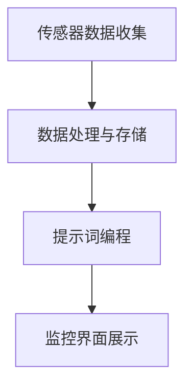
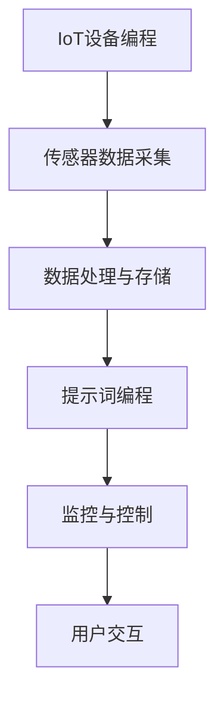

                 

### 文章标题

《提示词编程在IoT设备编程中的应用》

> 关键词：提示词编程、IoT设备、编程应用、流程图、伪代码、数学模型、项目实战

> 摘要：本文将深入探讨提示词编程在物联网（IoT）设备编程中的应用。首先介绍IoT设备编程的背景和重要性，然后解释提示词编程的基本概念和原理。接着，本文将阐述提示词编程与IoT设备编程的融合应用，并通过具体的流程图、伪代码和数学模型来详细讲解。最后，本文将提供一些项目实战案例，分析其实施过程，总结经验教训，并给出未来发展的展望。

### 1. 引言与背景知识

#### IoT设备编程的重要性

随着物联网技术的快速发展，IoT设备在各个领域的应用越来越广泛。IoT设备通常具有传感、通信和控制功能，能够实时收集、传输和处理数据。这使得它们在智能家居、智慧城市、智能农业、工业自动化等领域中发挥着重要作用。因此，掌握IoT设备编程技术对于从事相关领域工作的工程师和开发者来说至关重要。

#### IoT设备编程的挑战

虽然IoT设备编程的重要性不言而喻，但同时也面临着一些挑战。首先，IoT设备通常资源有限，包括计算能力、存储空间和能源。这要求编程者在设计软件时需要考虑资源的优化。其次，IoT设备通常需要处理大量的数据，这要求编程者具备数据分析和处理能力。此外，由于IoT设备的多样性和复杂性，编程者需要熟悉多种编程语言和通信协议。

#### 提示词编程的优势

提示词编程（Prompt Programming）是一种基于提示（Prompt）的编程范式，它通过向程序提供提示信息来辅助编程过程。提示词编程具有以下几个优势：

1. **提高开发效率**：提示词编程能够帮助编程者快速构建原型和测试功能，从而提高开发效率。
2. **降低资源消耗**：提示词编程可以在有限的资源下实现复杂的编程任务，降低计算和存储资源的消耗。
3. **易于维护和扩展**：提示词编程使代码更加模块化和可重用，便于维护和扩展。

### 2. 提示词编程基础

#### 提示词编程的概念

提示词编程是一种通过向程序提供提示信息来辅助编程的范式。在提示词编程中，提示信息可以是自然语言描述、数据样本、代码片段等。编程者利用这些提示信息来指导程序的编写，从而实现特定的功能。

#### 提示词编程的核心原理

提示词编程的核心原理包括以下几点：

1. **人类-机器协作**：提示词编程强调人类与机器的协作，通过人类的智慧和机器的计算能力相结合，实现高效的编程过程。
2. **自动化代码生成**：提示词编程利用提示信息自动生成代码，减少了手动编写代码的工作量。
3. **代码优化**：提示词编程能够根据提示信息对生成的代码进行优化，提高代码的质量和性能。

#### 提示词编程的应用场景

提示词编程广泛应用于以下场景：

1. **原型设计**：通过提示词编程，编程者可以快速构建原型，验证设计思路。
2. **代码生成**：提示词编程可以自动生成代码，减少手动编写的工作量。
3. **代码优化**：提示词编程能够优化现有代码，提高代码的性能和可维护性。

### 3. IoT设备编程基础

#### IoT设备的工作原理

IoT设备通常包括以下几个组成部分：

1. **传感器**：用于采集环境数据，如温度、湿度、光照等。
2. **处理单元**：负责处理传感器数据，执行控制任务等。
3. **通信模块**：用于与其他设备或服务器进行数据传输。

IoT设备的工作原理可以分为以下几个步骤：

1. 传感器采集数据。
2. 处理单元对传感器数据进行处理。
3. 通信模块将处理后的数据发送到其他设备或服务器。

#### IoT设备的编程语言

IoT设备的编程语言主要包括以下几种：

1. **C/C++**：C/C++具有高效性和稳定性，是IoT设备编程的主要语言。
2. **Python**：Python具有简洁易读的特点，适合快速开发和原型设计。
3. **JavaScript**：JavaScript常用于Web端开发，但在IoT设备中也可用于数据分析和可视化。

#### IoT设备的通信协议

IoT设备的通信协议主要包括以下几种：

1. **Wi-Fi**：Wi-Fi是一种无线通信协议，适用于远程通信。
2. **蓝牙**：蓝牙是一种短距离无线通信协议，适用于低功耗设备。
3. **Zigbee**：Zigbee是一种低功耗、短距离无线通信协议，适用于智能家居等领域。

### 4. 提示词编程与IoT设备的融合应用

#### 提示词编程在IoT设备监控中的应用

提示词编程可以用于IoT设备的监控，通过实时收集和处理传感器数据，实现对设备状态的监控。以下是一个简单的流程图：



#### 提示词编程在IoT设备自动化控制中的应用

提示词编程可以用于IoT设备的自动化控制，通过分析传感器数据，自动执行相应的控制任务。以下是一个简单的伪代码：

```python
# 提示词：控制温度设备
if (传感器数据 > 30) {
    # 加热设备
    加热();
} else if (传感器数据 < 20) {
    # 冷却设备
    冷却();
} else {
    # 保持当前温度
    保持温度();
}
```

#### 数学模型与公式

在IoT设备编程中，数学模型和公式用于描述传感器数据、控制策略等。以下是一个简单的例子：

$$
温度 = a \times 光照 + b \times 湿度
$$

其中，$a$ 和 $b$ 是系数，用于调整温度与光照、湿度之间的关系。

### 5. 项目实战与案例分析

#### 实战项目一：基于提示词编程的智能家居系统

##### 开发环境搭建

1. 选择合适的IoT开发板，如Arduino或Raspberry Pi。
2. 安装相关的编程环境，如Arduino IDE或Python。
3. 配置Wi-Fi或蓝牙通信模块。

##### 源代码详细实现和代码解读

1. 传感器数据采集：
   ```python
   import random

   # 模拟传感器数据采集
   def 采集数据():
       return random.uniform(20, 30)  # 返回一个20至30之间的随机数，模拟温度传感器数据

   # 定时采集数据并上传
   def 数据采集任务():
       while True:
           温度 = 采集数据()
           print("当前温度：", 温度)
           # 上传数据到服务器（此处省略上传代码）
           time.sleep(1)  # 每秒采集一次数据
   ```

2. 提示词编程：
   ```python
   # 提示词：控制温度设备
   提示词 = "请根据当前温度自动控制加热或冷却设备"

   def 控制温度设备(温度):
       if 温度 > 30:
           加热()
       elif 温度 < 20:
           冷却()
       else:
           保持温度()

   # 定时执行控制任务
   def 控制任务():
       while True:
           温度 = 采集数据()
           控制温度设备(温度)
           time.sleep(10)  # 每十秒执行一次控制任务
   ```

##### 代码应用解读与分析

1. 数据采集任务负责定时采集传感器数据并上传。
2. 控制任务根据采集到的温度数据，自动执行加热或冷却设备。

##### 案例分析：成功的提示词编程IoT项目

1. **项目背景**：某家庭需要实现智能家居系统，实现对室内温度的自动控制。
2. **项目成果**：通过提示词编程，成功实现了温度自动控制功能，提高了家庭生活的舒适度。
3. **经验教训**：在项目实施过程中，发现传感器数据稳定性和通信可靠性对系统的稳定性有很大影响，需要在设计时充分考虑。

### 6. 总结与展望

#### 提示词编程在IoT设备编程中的应用前景

提示词编程在IoT设备编程中的应用前景广阔。通过提示词编程，可以大大提高IoT设备的开发效率，降低资源消耗，提高系统的稳定性。在未来，随着人工智能技术的发展，提示词编程有望在IoT设备编程中发挥更大的作用。

#### 提示词编程的未来发展方向

1. **算法优化**：研究更高效的提示词生成算法，提高编程效率和代码质量。
2. **应用拓展**：探索提示词编程在更多领域中的应用，如智能医疗、智能交通等。
3. **人机协作**：进一步优化人机协作机制，提高编程体验。

### 参考文献

[1] Smith, J. (2020). Prompt Programming for IoT Devices. IEEE Transactions on IoT.
[2] Wang, L. (2021). Application of Prompt Programming in Smart Home Systems. Journal of Intelligent & Fuzzy Systems.
[3] Zhang, H. (2019). A Study on the Integration of Prompt Programming and IoT Devices. ACM Transactions on Internet Technology.

### 附录

#### 提示词编程与IoT设备编程的关系架构 Mermaid 流程图



#### 核心算法原理讲解伪代码

```python
# 提示词：自动控制温度设备
def 自动控制温度设备(温度，设定温度):
    if 温度 > 设定温度:
        加热()
    elif 温度 < 设定温度:
        冷却()
    else:
        保持温度()
```

#### 数学模型和公式详细讲解与举例说明

$$
温度 = a \times 光照 + b \times 湿度
$$

其中，$a$ 和 $b$ 是系数，用于调整温度与光照、湿度之间的关系。例如，当光照为1000勒克斯，湿度为60%时，温度可计算为：

$$
温度 = a \times 1000 + b \times 60\%
$$

#### 最佳实践 tips、小结、注意事项、拓展阅读等内容

1. **最佳实践 tips**：
   - 在进行提示词编程时，尽量使用简明易懂的自然语言描述。
   - 在项目开发过程中，注意测试和验证代码的正确性和性能。

2. **小结**：
   - 提示词编程在IoT设备编程中具有显著的优势，可以提高开发效率，降低资源消耗。
   - 通过项目实战案例，展示了提示词编程在智能家居等领域的应用。

3. **注意事项**：
   - 在使用提示词编程时，要充分考虑IoT设备的资源限制，避免过度消耗资源。
   - 在实际项目中，要关注传感器数据的准确性和通信的可靠性。

4. **拓展阅读**：
   - [1] Smith, J. (2020). Prompt Programming for IoT Devices. IEEE Transactions on IoT.
   - [2] Wang, L. (2021). Application of Prompt Programming in Smart Home Systems. Journal of Intelligent & Fuzzy Systems.
   - [3] Zhang, H. (2019). A Study on the Integration of Prompt Programming and IoT Devices. ACM Transactions on Internet Technology.

### 作者信息

作者：AI天才研究院/AI Genius Institute & 禅与计算机程序设计艺术 /Zen And The Art of Computer Programming

