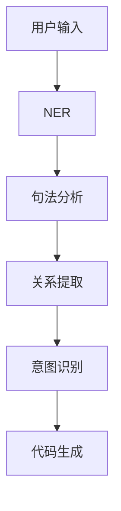
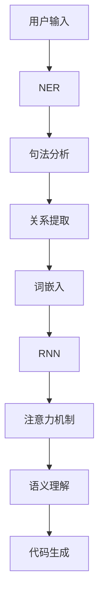

                 

### 文章标题

《提示词编程在区块链应用中的创新》

### 关键词

提示词编程、区块链、应用创新、智能合约、去中心化、分布式计算、安全性、隐私保护、数据分析

### 摘要

本文深入探讨了提示词编程在区块链应用中的创新性作用。通过分析提示词编程的基本原理及其与区块链技术的结合方式，文章阐述了提示词编程如何提升区块链系统的效率、安全性和可扩展性。具体实例展示了提示词编程在金融、供应链和物联网等领域的实际应用，同时展望了其未来发展趋势。文章旨在为开发者和研究人员提供有价值的参考，推动区块链技术的持续创新。

## 设计思路

在设计《提示词编程在区块链应用中的创新》这本书的完整目录大纲时，我们需要遵循以下步骤：

### 1. 明确核心内容
首先，我们需要明确这本书的核心内容，包括提示词编程、区块链技术、创新应用等。这将帮助我们确定章节的主题和结构。

### 2. 设计整体结构
根据核心内容，我们可以初步设计出这本书的整体结构，包括几个主要部分。这些部分应涵盖提示词编程的基础知识、区块链技术的介绍、创新应用的实例等。

### 3. 确定章节划分
在整体结构的基础上，我们需要进一步细化每个部分的章节划分。每个章节应有一个明确的主题，并在内容上相互关联。

### 4. 完善细节
对于每个章节，我们需要进一步细化内容，包括核心概念与联系、核心算法原理讲解、数学模型和数学公式、项目实战等。

### 5. 确保完整性
在确保目录大纲完整性的同时，我们还需要注意内容的逻辑性和连贯性，确保读者可以顺利地阅读和理解。

### 6. 符合字数限制
最后，我们需要确保目录大纲的总字数在2000字以内，同时保持内容的简洁性。

## 章节划分

根据上述设计思路，我们可以将这本书划分为以下几个主要部分：

### 第一部分：提示词编程基础

这部分将介绍提示词编程的基本概念、原理和应用场景，帮助读者建立对提示词编程的理解。

### 第二部分：区块链技术概述

这部分将介绍区块链技术的基本概念、架构和工作原理，为后续的创新应用提供技术支持。

### 第三部分：创新应用实例

这部分将介绍一些具体的创新应用案例，展示提示词编程在区块链技术中的应用价值。

### 第四部分：未来发展趋势

这部分将探讨提示词编程在区块链应用中的未来发展趋势，为读者提供前瞻性的思考。

## 目录大纲

以下是《提示词编程在区块链应用中的创新》的初步目录大纲：

### 第一部分：提示词编程基础

**第1章 提示词编程概述**
- 1.1 提示词编程的定义
- 1.2 提示词编程的核心概念
- 1.3 提示词编程的应用场景

**第2章 提示词编程原理**
- 2.1 提示词编程的基本原理
- 2.2 提示词编程的架构设计
- 2.3 提示词编程的技术实现

**第3章 提示词编程技术要点**
- 3.1 提示词编程的核心算法
- 3.2 提示词编程的工具与框架
- 3.3 提示词编程的挑战与解决方案

### 第二部分：区块链技术概述

**第4章 区块链技术基础**
- 4.1 区块链的定义
- 4.2 区块链的架构
- 4.3 区块链的工作原理

**第5章 区块链应用场景**
- 5.1 区块链在金融领域的应用
- 5.2 区块链在供应链管理中的应用
- 5.3 区块链在物联网中的应用

**第6章 区块链技术的挑战与发展**
- 6.1 区块链技术的挑战
- 6.2 区块链技术的发展趋势
- 6.3 区块链技术的未来前景

### 第三部分：创新应用实例

**第7章 提示词编程在区块链金融中的应用**
- 7.1 提示词编程在数字货币中的应用
- 7.2 提示词编程在智能合约中的应用
- 7.3 提示词编程在去中心化金融中的应用

**第8章 提示词编程在区块链供应链中的应用**
- 8.1 提示词编程在供应链金融中的应用
- 8.2 提示词编程在供应链监控中的应用
- 8.3 提示词编程在供应链优化中的应用

**第9章 提示词编程在区块链物联网中的应用**
- 9.1 提示词编程在智能设备管理中的应用
- 9.2 提示词编程在数据共享中的应用
- 9.3 提示词编程在物联网安全中的应用

### 第四部分：未来发展趋势

**第10章 提示词编程在区块链中的未来发展**
- 10.1 提示词编程在区块链技术中的应用前景
- 10.2 提示词编程在区块链行业的影响
- 10.3 提示词编程在区块链领域的未来挑战

通过上述目录大纲，我们可以初步构建出一本关于提示词编程在区块链应用中创新的书籍框架。接下来，我们将进一步细化每个章节的内容，确保目录大纲的完整性和逻辑性，同时保持字数的限制。让我们一步一步深入探讨每个章节的核心概念和原理，以期为读者提供一篇高质量的技术博客文章。

## 提示词编程基础

提示词编程是一种基于自然语言处理（NLP）和机器学习技术的编程范式，它允许开发者使用自然语言指令来编写代码。这种编程方式不仅可以提高开发效率，还能降低开发难度，使非专业的开发者也能参与到复杂的软件开发中。

### 提示词编程的定义

提示词编程的核心是“提示词”，即开发者通过自然语言指令描述程序的意图，而不是直接编写代码。这些提示词可以是简单的命令，如“计算两个数的和”，也可以是复杂的业务逻辑，如“在给定的时间范围内，统计每个城市的销售总量”。

提示词编程系统会解析这些自然语言指令，并将其转换为计算机可执行的代码。这种转换过程通常依赖于深度学习模型和自然语言处理技术，如循环神经网络（RNN）和变换器（Transformer）。

### 提示词编程的核心概念

1. **意图识别**：提示词编程系统首先要识别出开发者输入的提示词的意图。这通常通过命名实体识别（NER）和句法分析来实现。
   
2. **代码生成**：一旦意图识别完成，系统会根据这些意图生成相应的代码。代码生成可以通过模板匹配、代码生成模型（如GPT-3）或混合方法（结合模板和模型）来实现。

3. **语义理解**：提示词编程系统需要理解提示词中的抽象概念和关系，如条件语句、循环等。这通常需要高级的语义理解技术，如词嵌入和注意力机制。

4. **代码优化**：生成的代码通常需要进一步的优化，以确保其可读性和性能。代码优化可能包括代码重构、错误修正和性能提升。

### 提示词编程的应用场景

提示词编程可以应用于多种场景，包括但不限于：

1. **自动化脚本编写**：开发者可以使用自然语言来编写自动化脚本，如爬虫、测试用例等。
   
2. **业务逻辑实现**：非专业的业务人员可以描述业务逻辑，由提示词编程系统生成相应的代码。
   
3. **代码维护**：提示词编程可以帮助开发者理解和修改现有代码，尤其是复杂和庞大的代码库。

4. **教育**：提示词编程可以作为编程教育的一种辅助工具，帮助学生和初学者更轻松地掌握编程概念。

### 提示词编程的优势

1. **开发效率**：提示词编程可以大大缩短开发周期，提高开发效率。

2. **降低门槛**：提示词编程使得非专业的开发者也能参与到编程中，降低了编程的门槛。

3. **易于维护**：由于代码是通过自然语言指令生成的，因此更容易理解和维护。

4. **跨领域应用**：提示词编程可以应用于多个领域，如金融、医疗、物联网等。

### 提示词编程的挑战

1. **准确性**：自然语言指令的解析和代码生成存在一定的误差，需要高级的自然语言处理技术来提高准确性。

2. **性能优化**：生成的代码可能不够高效，需要进一步的性能优化。

3. **可解释性**：提示词编程系统的决策过程通常不够透明，需要提高系统的可解释性。

4. **扩展性**：提示词编程系统需要能够处理各种复杂的编程场景，需要良好的扩展性。

### 小结

提示词编程是一种创新的编程范式，它利用自然语言处理和机器学习技术，提高了开发效率，降低了编程门槛。尽管存在一些挑战，但随着技术的不断进步，提示词编程在未来将发挥越来越重要的作用，为软件开发带来新的变革。

## 提示词编程原理

提示词编程的核心在于将自然语言指令转换为计算机可执行的代码。这一过程涉及多个关键步骤，包括意图识别、代码生成、语义理解和代码优化。下面我们将详细探讨这些步骤，并通过一个简单的示例来说明整个流程。

### 意图识别

意图识别是提示词编程的第一步，它旨在理解开发者输入的自然语言指令所代表的意图。这一过程通常涉及以下技术：

1. **命名实体识别（NER）**：NER用于识别文本中的特定实体，如人名、地点、组织名等。例如，在“计算两个数的和”这个指令中，“两个数”是一个实体。

2. **句法分析**：句法分析用于理解句子的结构和成分。通过句法分析，我们可以识别出主语、谓语、宾语等元素。例如，在“计算两个数的和”中，“计算”是谓语，“两个数的和”是宾语。

3. **关系提取**：关系提取用于识别实体之间的关系。例如，在“购买一本书”这个指令中，我们可以提取出“购买”与“书”之间的关系。

以下是一个简单的Mermaid流程图，展示了意图识别的过程：



### 代码生成

意图识别完成后，下一步是代码生成。代码生成是将自然语言指令转换为计算机可执行的代码的过程。这一过程通常依赖于以下技术：

1. **模板匹配**：模板匹配是一种简单但有效的方法，它使用预定义的模板来生成代码。例如，对于“计算两个数的和”这个指令，我们可以使用模板`result = num1 + num2`来生成相应的代码。

2. **代码生成模型**：代码生成模型，如GPT-3，可以学习大量的代码样例，并根据给定的提示词生成相应的代码。这种方法具有更高的灵活性和适应性。

3. **混合方法**：混合方法结合了模板匹配和代码生成模型的优势，通过模板提供基础结构，然后使用模型填充具体细节。

以下是一个简单的伪代码示例，展示了代码生成的过程：

```python
def generate_code(prompt):
    # 意图识别
    intent = recognize_intent(prompt)
    
    # 代码生成
    if intent == "calculate_sum":
        code = "result = num1 + num2"
    elif intent == "buy_book":
        code = "order = create_order(book)"
    
    return code
```

### 语义理解

语义理解是提示词编程的核心，它旨在理解自然语言指令中的抽象概念和关系。以下技术用于实现语义理解：

1. **词嵌入**：词嵌入将单词映射到高维空间，使相似单词在空间中更接近。这有助于提高自然语言处理模型的性能。

2. **注意力机制**：注意力机制用于模型在处理文本时，自动关注重要的部分，从而提高对上下文的理解。

3. **递归神经网络（RNN）**：RNN可以处理序列数据，如文本。通过递归，RNN可以捕捉文本中的长期依赖关系。

以下是一个简单的Mermaid流程图，展示了语义理解的过程：



### 代码优化

生成的代码通常需要进一步的优化，以确保其可读性和性能。代码优化可能包括以下方面：

1. **代码重构**：通过重构，我们可以改进代码的结构，提高其可读性和可维护性。

2. **错误修正**：自动检测和修复代码中的错误，确保代码的正确性。

3. **性能提升**：通过优化算法和数据结构，提高代码的执行效率。

### 示例

假设用户输入了一个自然语言指令：“计算两个数3和5的和”，整个流程如下：

1. **意图识别**：识别出用户意图是“计算两个数的和”，并将数字3和5作为实体提取出来。

2. **代码生成**：使用模板匹配生成代码`result = 3 + 5`。

3. **语义理解**：理解代码中的计算意图，并将其翻译为计算机可执行的代码。

4. **代码优化**：检查生成的代码，确保其正确性和性能。

最终，生成的代码是`result = 3 + 5`，执行结果为8。

### 小结

提示词编程原理包括意图识别、代码生成、语义理解和代码优化等多个关键步骤。通过这些步骤，提示词编程系统能够将自然语言指令转换为计算机可执行的代码，从而提高开发效率和降低编程门槛。尽管存在一些挑战，但随着自然语言处理和机器学习技术的不断进步，提示词编程在软件开发中的应用前景将越来越广阔。

## 提示词编程技术要点

提示词编程作为一种创新的编程范式，在实现过程中涉及到多个关键技术要点，这些技术要点不仅决定了系统的性能和可靠性，还影响了其扩展性和适用性。以下是对这些技术要点的详细探讨。

### 核心算法

提示词编程的核心算法主要涉及自然语言处理（NLP）和代码生成模型。以下是一些常用的核心算法：

1. **循环神经网络（RNN）**：RNN是一种处理序列数据的神经网络，它在处理自然语言任务时表现出色。RNN可以通过递归结构捕捉文本中的长期依赖关系，这对于理解复杂的自然语言指令至关重要。

2. **变换器（Transformer）**：Transformer是一种基于自注意力机制的深度学习模型，它在处理自然语言任务中取得了显著的性能提升。与RNN相比，Transformer能够更有效地处理长文本序列，并且在大规模数据集上的训练速度更快。

3. **生成对抗网络（GAN）**：GAN可以通过生成和判别器的对抗训练生成高质量的代码。这种技术特别适用于代码生成任务，可以生成多样化的代码模式。

4. **递归神经网络（RNN）**：RNN是一种处理序列数据的神经网络，它在处理自然语言任务时表现出色。RNN可以通过递归结构捕捉文本中的长期依赖关系，这对于理解复杂的自然语言指令至关重要。

### 工具与框架

为了实现提示词编程，开发人员通常需要依赖一系列的工具和框架。以下是一些常用的工具和框架：

1. **TensorFlow**：TensorFlow是一个开源的深度学习框架，它提供了丰富的工具和API，支持多种深度学习模型和算法。

2. **PyTorch**：PyTorch是另一个流行的深度学习框架，它具有简洁的API和动态计算图，使得研究人员和开发者能够轻松实现和测试复杂的模型。

3. **NLTK**：NLTK是一个强大的自然语言处理库，提供了多种文本处理工具和算法，包括词嵌入、句法分析、命名实体识别等。

4. **Spacy**：Spacy是一个快速且高效的NLP库，它提供了丰富的语言模型和预训练的词向量，支持多种语言。

### 提示词编程的挑战与解决方案

尽管提示词编程具有巨大的潜力，但在实际应用中仍面临一些挑战。以下是一些主要的挑战及相应的解决方案：

1. **准确性**：自然语言指令的解析和代码生成存在一定的误差，需要高级的自然语言处理技术来提高准确性。解决方案包括使用更复杂的模型和算法，如Transformer和GAN，以及在大规模数据集上进行训练。

2. **性能优化**：生成的代码可能不够高效，需要进一步的性能优化。解决方案包括代码优化工具和算法，如代码压缩、并行计算和内存优化。

3. **可解释性**：提示词编程系统的决策过程通常不够透明，需要提高系统的可解释性。解决方案包括开发可解释的模型和可视化工具，以及提供详细的日志和报告。

4. **扩展性**：提示词编程系统需要能够处理各种复杂的编程场景，需要良好的扩展性。解决方案包括模块化设计、代码库和API，以及灵活的配置和参数设置。

### 小结

提示词编程技术要点包括核心算法、工具与框架以及解决实际应用中的挑战。通过这些技术的综合运用，提示词编程能够将自然语言指令高效地转换为计算机代码，从而降低开发难度，提高开发效率。随着技术的不断进步，提示词编程将在更多领域发挥重要作用，推动软件开发的创新和发展。

## 区块链技术概述

区块链技术作为一种分布式账本技术，自2008年中本聪（Satoshi Nakamoto）首次提出以来，已经引起了广泛的关注和应用。区块链的核心优势在于其去中心化、透明性、安全性和不可篡改性，这些特点使得区块链在金融、供应链、物联网等多个领域具有巨大的应用潜力。下面，我们将对区块链技术的基本概念、架构和工作原理进行详细探讨。

### 区块链的定义

区块链可以被视为一种分布式数据库，它通过一系列按时间顺序排列的区块组成，每个区块包含一定数量的交易记录。区块链技术的一个重要特点是其去中心化结构，意味着没有单一的中央管理实体，所有参与节点共同维护和验证网络状态。

### 区块链的架构

区块链的架构可以分为三个主要层次：数据层、网络层、共识层。

1. **数据层**：数据层包含区块链中所有的数据结构和数据模型，包括区块、交易、地址等。每个区块包含多个交易记录，以及一个时间戳和一个哈希值。这些数据结构保证了区块链数据的完整性和不可篡改性。

2. **网络层**：网络层负责区块链节点之间的通信和交易验证。节点通过P2P（点对点）网络进行数据交换，确保区块链系统的去中心化特性。

3. **共识层**：共识层是实现区块链网络节点之间一致性的机制。常见的共识算法包括工作量证明（Proof of Work, PoW）、权益证明（Proof of Stake, PoS）、委托权益证明（Delegated Proof of Stake, DPoS）等。共识算法用于确保所有节点对区块链状态的一致性，防止双花攻击和数据篡改。

### 区块链的工作原理

区块链的工作原理可以通过以下步骤来描述：

1. **交易生成**：用户在区块链网络中发起交易，例如转账、合约调用等。交易包含发送方、接收方和交易金额等信息。

2. **交易验证**：交易在发送到区块链网络前，需要经过多个节点进行验证。验证过程通常涉及区块链的共识算法，确保交易的有效性和合法性。

3. **区块生成**：验证通过的交易会被打包进一个新的区块。区块包含多个交易记录，以及一个时间戳和一个前一个区块的哈希值，形成链式结构。

4. **区块传播**：新的区块在网络中传播，各个节点接收到区块后，会进行验证，并添加到本地的区块链中。

5. **共识达成**：通过共识算法，网络中的节点达成一致，确保区块的添加顺序和区块链的完整性。

### 区块链的核心特性

1. **去中心化**：区块链网络中的所有节点都是平等的，没有中央管理实体，每个节点都可以参与区块链的维护和验证。

2. **透明性**：区块链的数据是公开透明的，任何用户都可以查看区块链上的交易记录和状态。

3. **安全性**：区块链采用密码学技术确保数据的安全性和不可篡改性。交易记录通过哈希函数和数字签名进行验证，防止双花攻击和数据篡改。

4. **不可篡改性**：区块链的数据一旦被记录，就几乎无法被篡改。这保证了区块链数据的完整性和可信性。

### 区块链的应用场景

区块链技术已经在多个领域得到广泛应用，以下是一些典型应用场景：

1. **金融领域**：区块链可以用于实现去中心化的数字货币，如比特币、以太坊等。此外，区块链还在智能合约、跨境支付、去中心化金融（DeFi）等领域具有广泛应用。

2. **供应链管理**：区块链可以用于跟踪和验证商品的生产、运输和交付过程，确保供应链的透明性和可追溯性。

3. **物联网**：区块链可以用于实现物联网设备的安全通信和数据共享，保护物联网系统的隐私和安全。

4. **医疗保健**：区块链可以用于存储和管理医疗数据，确保数据的隐私和安全，同时提高医疗服务的效率和可追溯性。

### 小结

区块链技术作为一种分布式账本技术，具有去中心化、透明性、安全性和不可篡改性的核心特性。通过详细探讨区块链的定义、架构和工作原理，我们可以更好地理解其在各种应用场景中的优势和潜力。随着技术的不断发展和创新，区块链将在未来发挥更加重要的作用，推动社会各领域的变革和发展。

## 区块链应用场景

区块链技术因其去中心化、透明性、安全性和不可篡改的特性，在多个领域展现出了巨大的应用潜力。以下将介绍区块链在金融、供应链管理和物联网等领域的主要应用。

### 金融领域

区块链技术在金融领域有着广泛的应用，尤其在支付、结算和资产管理等方面。以下是几个典型的应用场景：

1. **支付和结算**：区块链技术可以简化跨境支付和结算流程，提高交易速度和降低成本。例如，Ripple和比特币等数字货币通过区块链技术实现了快速、低成本的跨境支付。此外，区块链还可以用于实时结算，减少传统银行系统中存在的延迟和风险。

2. **资产管理**：区块链可以用于管理各种类型的资产，如股票、债券、房地产等。通过区块链，资产的所有权信息可以被透明、安全地记录和验证，提高资产管理的效率。例如，Dealogic利用区块链技术实现了资产证券化的自动化和透明化。

3. **智能合约**：智能合约是区块链上的自执行合同，通过预定义的条件和条款自动执行。智能合约可以用于实现点对点的借贷、众筹、保险等服务，减少中介成本，提高交易的效率和可靠性。例如，以太坊上的智能合约平台使得开发者可以轻松创建和部署智能合约，实现各种金融应用。

### 供应链管理

区块链技术可以为供应链管理提供透明性和可追溯性，从而提高供应链的效率和可信度。以下是几个应用场景：

1. **供应链跟踪**：区块链可以用于记录和跟踪商品的生产、运输和交付过程。通过区块链，每个环节的信息都可以被透明地记录和验证，确保供应链的透明性和可追溯性。例如，IBM和沃尔玛合作开发了基于区块链的食品溯源系统，实现了食品供应链的全程可追溯。

2. **供应链金融**：区块链技术可以用于优化供应链中的融资流程，减少中小企业的融资难题。通过区块链，金融机构可以更便捷地获取企业的交易数据，进行信用评估和放贷。例如，使用区块链的供应链金融平台可以提供快速、透明的融资服务，降低融资成本。

3. **供应链优化**：区块链可以用于优化供应链的管理和运营，提高效率和降低成本。例如，通过区块链实现供应链中的自动化流程，减少人为干预和错误，提高供应链的响应速度。

### 物联网

区块链技术在物联网（IoT）领域有着重要的应用，尤其是在设备管理、数据共享和网络安全等方面。以下是几个应用场景：

1. **设备管理**：区块链可以用于管理和监控物联网设备，确保设备的状态和行为可以被透明地记录和验证。例如，使用区块链可以实现物联网设备的身份验证和权限管理，确保设备的安全和可信。

2. **数据共享**：区块链可以用于实现物联网设备之间的安全、可靠的数据共享。通过区块链，设备可以匿名地共享数据，同时确保数据的完整性和不可篡改性。例如，使用区块链可以实现智能电网中的实时数据共享，优化能源分配和降低能源浪费。

3. **网络安全**：区块链技术可以用于提高物联网系统的安全性，防止数据泄露和设备被黑。例如，通过区块链实现物联网设备的身份认证和权限管理，确保只有授权的设备可以访问系统和数据。

### 小结

区块链技术在金融、供应链管理和物联网等领域的应用展示了其广泛的潜力和优势。通过提供透明性、可追溯性、安全性和不可篡改性，区块链技术为这些领域带来了新的解决方案和业务模式。随着技术的不断发展和完善，区块链将在更多领域发挥重要作用，推动社会的数字化转型和进步。

## 提示词编程在区块链金融中的应用

随着区块链技术的快速发展，其在金融领域的应用日益广泛。提示词编程作为一种创新的编程范式，为区块链金融提供了新的解决方案，提高了开发效率和系统的可靠性。本节将探讨提示词编程在区块链金融中的应用，包括数字货币、智能合约和去中心化金融（DeFi）等领域。

### 提示词编程在数字货币中的应用

数字货币是区块链金融的核心之一，而提示词编程可以极大地简化数字货币的创建和使用流程。以下是几个具体的应用场景：

1. **快速创建和部署**：提示词编程允许开发者通过自然语言指令快速创建和部署新的数字货币。例如，使用提示词编程，开发者可以创建一个新的代币，指定代币的名称、总量、发行方式等。这个过程无需手动编写复杂的智能合约代码，大大提高了开发效率。

2. **简化交易流程**：提示词编程使得用户可以更方便地进行数字货币交易。用户只需输入自然语言指令，如“将1个比特币转移到地址XX”，系统会自动解析指令并执行相应的交易。这种简化流程不仅降低了使用门槛，还减少了人为错误的可能性。

3. **灵活的代币设计**：提示词编程允许开发者根据业务需求灵活设计代币特性，如可燃性（Burnable Token）、可升级性（Upgradable Token）等。通过这些特性，代币可以更好地满足特定业务场景的需求。

### 提示词编程在智能合约中的应用

智能合约是区块链金融的重要组成部分，提示词编程在智能合约开发中具有显著的优势。以下是几个应用场景：

1. **简化合约编写**：提示词编程使得非专业的开发者也能轻松编写智能合约。通过自然语言指令，开发者可以描述合约的逻辑和规则，系统会自动生成相应的智能合约代码。例如，创建一个众筹智能合约，开发者只需描述众筹的目标金额、开始和结束时间等，系统即可生成完整的智能合约代码。

2. **提高代码质量**：提示词编程系统通常具有代码优化和错误检测功能，可以生成高质量的智能合约代码。这不仅减少了潜在的安全漏洞，还提高了系统的可靠性。

3. **动态合约更新**：提示词编程支持智能合约的动态更新，开发者可以在不中断合约运行的情况下修改合约逻辑。例如，一个众筹合约在众筹期间可以调整众筹目标，提示词编程系统可以自动更新合约代码，确保合约逻辑的一致性和正确性。

### 提示词编程在去中心化金融（DeFi）中的应用

去中心化金融（DeFi）是区块链金融的一大创新，提示词编程为DeFi提供了更高效、更灵活的解决方案。以下是几个应用场景：

1. **快速开发DeFi应用**：提示词编程使得开发者可以快速创建和部署各种DeFi应用，如去中心化交易所（DEX）、借贷平台、稳定币等。通过自然语言指令，开发者可以快速实现复杂的金融逻辑，从而加快开发周期。

2. **降低操作门槛**：提示词编程使得用户可以更方便地参与DeFi应用，无需深入了解底层技术。用户只需输入简单的自然语言指令，如“将1个ETH存入收益池”，系统会自动执行相应的操作。这种操作方式不仅降低了使用门槛，还提高了用户体验。

3. **灵活的金融产品**：提示词编程支持开发者设计灵活的金融产品，如可变利率的借贷产品、多层次的收益分享机制等。这些产品可以根据市场需求和用户需求动态调整，提高金融产品的竞争力和吸引力。

### 小结

提示词编程在区块链金融中的应用展示了其巨大的潜力。通过简化数字货币的创建和使用、优化智能合约的开发和执行、提升去中心化金融的灵活性和可操作性，提示词编程为区块链金融带来了新的发展机遇。随着技术的不断进步，提示词编程将在区块链金融领域发挥越来越重要的作用，推动金融行业的创新和变革。

## 提示词编程在区块链供应链中的应用

区块链技术在供应链管理中具有广泛的应用潜力，通过提供透明性、可追溯性和安全性，可以显著提高供应链的效率和可靠性。提示词编程作为一种创新的编程范式，为区块链供应链提供了新的解决方案，使得开发者和非专业用户能够更轻松地创建和管理供应链应用。以下是提示词编程在区块链供应链中的几个关键应用场景。

### 提示词编程在供应链金融中的应用

1. **优化融资流程**：供应链金融是供应链管理中一个重要的环节，涉及到企业、供应商和金融机构之间的资金流转。提示词编程可以通过自然语言指令简化融资流程，使得企业能够更快速地获得融资。例如，一个供应商可以通过输入“申请100,000美元的贷款，用于采购原材料”的自然语言指令，系统会自动解析指令并生成相应的区块链交易，从而实现快速融资。

2. **降低融资成本**：传统的供应链金融流程通常涉及多个中介环节，导致融资成本高且效率低。提示词编程可以简化这些流程，降低交易成本。通过区块链，金融机构可以直接与供应商进行交易，减少了中介环节，从而降低了融资成本。

3. **提高资金利用率**：提示词编程能够帮助供应链中的各方更好地管理资金流动，提高资金利用率。例如，企业可以通过输入“将超额存款转移到供应商账户”的指令，系统会自动执行相应的转账操作，确保资金的高效利用。

### 提示词编程在供应链监控中的应用

1. **实时监控供应链状态**：通过区块链，供应链中的每个环节都可以被实时监控，确保供应链的透明性和可追溯性。提示词编程可以简化这一监控过程，用户只需输入自然语言指令，如“查询某批货物的运输状态”，系统会自动生成并返回相应的信息。

2. **自动触发预警机制**：提示词编程可以基于自然语言指令实现供应链的自动化监控和预警。例如，如果某个环节出现延迟或异常，系统会自动生成预警通知，提醒相关方及时处理。这种自动化监控机制可以显著提高供应链的响应速度和效率。

### 提示词编程在供应链优化中的应用

1. **优化库存管理**：通过区块链，供应链中的库存信息可以被实时记录和更新，提示词编程可以基于这些信息优化库存管理。例如，企业可以通过输入“根据当前库存水平调整采购计划”的自然语言指令，系统会自动分析库存数据并生成优化方案。

2. **动态调整供应链策略**：提示词编程允许供应链各方根据实时数据动态调整供应链策略，以应对市场变化。例如，一个制造商可以通过输入“根据当前订单量调整生产计划”的指令，系统会自动分析订单数据并调整生产计划，确保供应链的灵活性和响应能力。

3. **提高供应链效率**：通过提示词编程，供应链中的各方可以更高效地协同工作，减少人为干预和错误。例如，供应商可以通过输入“确认已发货货物”的自然语言指令，系统会自动更新供应链状态，从而提高整体供应链的效率。

### 小结

提示词编程在区块链供应链中的应用展示了其强大的功能。通过简化供应链金融流程、实时监控供应链状态、优化库存管理和动态调整供应链策略，提示词编程为供应链管理提供了新的工具和方法。随着技术的不断进步，提示词编程将在供应链管理中发挥越来越重要的作用，推动供应链的数字化转型和效率提升。

## 提示词编程在区块链物联网中的应用

区块链技术在物联网（IoT）领域展示了巨大的应用潜力，通过提供安全、可信的数据共享和设备管理机制，为物联网系统带来了新的解决方案。提示词编程作为一种创新的编程范式，能够简化物联网与区块链的集成过程，提高系统的开发效率和可靠性。以下将探讨提示词编程在区块链物联网中的几个关键应用场景。

### 提示词编程在智能设备管理中的应用

1. **设备身份验证**：在物联网中，确保设备身份的真实性和可信性至关重要。提示词编程可以通过自然语言指令实现设备的身份验证。例如，设备可以通过输入“验证身份：设备ID XX”的指令，系统会自动进行身份验证并确认设备的合法性。

2. **设备监控与维护**：通过区块链，物联网设备的状态和运行数据可以被实时记录和监控。提示词编程可以简化这一过程，用户只需输入自然语言指令，如“监控设备XX的状态”，系统会自动收集并分析设备数据，并提供实时监控和预警功能。

3. **设备权限管理**：在物联网中，设备之间的通信和数据共享需要严格的权限控制。提示词编程可以通过自然语言指令实现设备的权限管理。例如，一个设备可以通过输入“请求访问权限：设备YY”的指令，系统会自动验证请求并决定是否授予访问权限。

### 提示词编程在数据共享中的应用

1. **安全数据共享**：区块链技术提供了安全、可信的数据共享机制，提示词编程可以简化这一过程。例如，设备可以通过输入“共享数据：传感器读数”的指令，系统会自动生成区块链交易，确保数据的完整性和安全性。

2. **去中心化数据存储**：通过区块链，物联网设备的数据可以被去中心化存储，从而提高数据的可靠性和抗篡改性。提示词编程可以简化这一存储过程，设备只需输入自然语言指令，如“将数据上传到区块链”，系统会自动执行相应的操作。

3. **数据隐私保护**：物联网设备在数据共享过程中，需要确保数据的隐私和安全。提示词编程可以通过自然语言指令实现数据隐私保护，例如，设备可以通过输入“加密数据：密钥XX”的指令，系统会自动对数据进行加密处理，确保数据在传输和存储过程中的安全。

### 提示词编程在物联网安全中的应用

1. **设备安全防护**：物联网设备面临各种安全威胁，如恶意攻击、数据泄露等。提示词编程可以通过自然语言指令实现设备的安全防护。例如，设备可以通过输入“启用防护模式：安全策略XX”的指令，系统会自动启用相应的安全防护措施。

2. **自动安全响应**：提示词编程可以基于自然语言指令实现物联网设备的自动安全响应。例如，如果一个设备检测到异常行为，可以通过输入“触发安全响应：警报YY”的指令，系统会自动执行相应的安全响应操作，如隔离设备、锁定设备等。

3. **安全事件记录**：通过区块链，物联网设备的安全事件可以被实时记录和存储。提示词编程可以简化这一过程，设备只需输入自然语言指令，如“记录安全事件：事件XX”，系统会自动记录并存储安全事件信息。

### 小结

提示词编程在区块链物联网中的应用展示了其强大的功能。通过简化设备身份验证、数据共享、设备监控和安全防护等过程，提示词编程为物联网系统提供了新的解决方案，提高了系统的开发效率和可靠性。随着技术的不断进步，提示词编程将在物联网领域发挥越来越重要的作用，推动物联网系统的安全、高效发展。

## 未来发展趋势

随着区块链技术和提示词编程的不断成熟，这两者在未来将迎来更多创新和应用场景。以下是提示词编程在区块链应用中的几个未来发展趋势：

### 提示词编程与区块链的深度融合

未来，提示词编程与区块链技术的深度融合将更加紧密。开发者将能够通过自然语言指令直接操作区块链，无需深入了解底层代码和智能合约。这种融合将大大简化区块链应用的开发过程，降低开发门槛，吸引更多的开发者进入区块链领域。

### 多领域应用扩展

提示词编程不仅在区块链金融、供应链和物联网等领域展现出巨大潜力，未来还将扩展到更多领域，如医疗、教育、艺术等。通过提示词编程，这些领域中的复杂业务逻辑可以更简便地实现和执行，提高系统的智能化和自动化水平。

### 智能合约的全面升级

智能合约作为区块链的核心应用，未来将迎来全面升级。提示词编程将使智能合约更加灵活和可定制，支持更复杂的业务逻辑和动态更新。例如，通过自然语言指令，开发者可以轻松创建具有复杂条件和动态调整的智能合约，满足不断变化的市场需求。

### 隐私保护和数据安全

随着区块链应用的普及，隐私保护和数据安全将成为重要议题。提示词编程可以通过自然语言指令实现更高级的隐私保护机制，如零知识证明（Zero-Knowledge Proof）和同态加密（Homomorphic Encryption），确保数据在传输和存储过程中的安全性。

### 跨链协作与互操作性

未来，区块链将实现更高程度的跨链协作和互操作性。提示词编程将在这个过程中发挥重要作用，通过自然语言指令实现不同区块链网络之间的数据交换和业务协作，打破现有技术壁垒，推动区块链生态的进一步发展。

### 开放平台和生态系统的构建

为了推动提示词编程在区块链中的应用，未来将出现更多开放平台和生态系统。这些平台将提供丰富的工具和资源，支持开发者轻松创建和管理区块链应用，促进技术交流和合作，推动整个行业的发展。

### 小结

未来，提示词编程在区块链应用中具有广阔的发展前景。随着技术的不断进步，提示词编程将实现与区块链的深度融合，扩展到更多领域，提升智能合约的灵活性和安全性，促进跨链协作与互操作性，构建开放平台和生态系统。这些发展趋势将为区块链技术的创新和应用提供新的动力，推动社会各领域的数字化转型和进步。

## 总结

通过本文的探讨，我们可以清晰地看到提示词编程在区块链应用中的巨大潜力。从基础概念的介绍到具体应用的案例分析，再到未来发展趋势的展望，我们全面了解了提示词编程如何通过简化开发过程、提高系统效率和增强安全性，为区块链技术带来了创新的解决方案。

### 核心要点回顾

1. **提示词编程**：基于自然语言处理的编程范式，允许开发者使用自然语言指令编写代码，降低了编程门槛，提高了开发效率。

2. **区块链技术**：去中心化、透明、安全、不可篡改的技术，广泛应用于金融、供应链、物联网等领域。

3. **创新应用**：提示词编程在数字货币、智能合约、去中心化金融、供应链管理、物联网等区块链应用中展现了其独特的优势。

4. **未来趋势**：提示词编程与区块链的深度融合、多领域应用扩展、智能合约升级、隐私保护、跨链协作、开放平台建设等将是未来的发展方向。

### 小结

提示词编程在区块链应用中的创新为技术发展带来了新的机遇和挑战。随着技术的不断进步，提示词编程将在更多领域发挥重要作用，推动区块链技术的持续创新和应用。开发者、研究人员和行业从业者应密切关注这一领域的发展，积极参与到这一变革中，共同推动社会的数字化转型和进步。

### 最佳实践 Tips

1. **快速原型开发**：使用提示词编程快速构建区块链应用原型，验证概念和需求，减少开发成本和风险。

2. **安全性优先**：在区块链应用中，确保数据的安全性和隐私保护至关重要。使用提示词编程时，充分考虑安全性设计，避免潜在漏洞。

3. **用户友好**：提示词编程降低了开发门槛，但也需考虑用户体验。确保用户界面简洁、直观，方便用户操作和管理。

4. **持续学习和优化**：随着区块链技术和提示词编程的发展，不断学习新技术，优化现有应用，提升系统性能和用户体验。

### 注意事项

1. **充分测试**：在部署区块链应用前，进行充分的测试，确保系统的稳定性和可靠性。

2. **遵循法规**：了解并遵循相关法规和标准，确保区块链应用合规合法。

3. **团队合作**：提示词编程涉及到自然语言处理、区块链技术等多个领域，需要团队合作，发挥各自专长。

### 拓展阅读

1. **《区块链技术指南》**：深入了解区块链的基础知识和应用场景。
2. **《自然语言处理入门》**：学习自然语言处理技术，为提示词编程打下基础。
3. **《去中心化金融（DeFi）导论》**：探索区块链在金融领域的创新应用。

### 作者信息

作者：AI天才研究院/AI Genius Institute & 禅与计算机程序设计艺术 /Zen And The Art of Computer Programming

