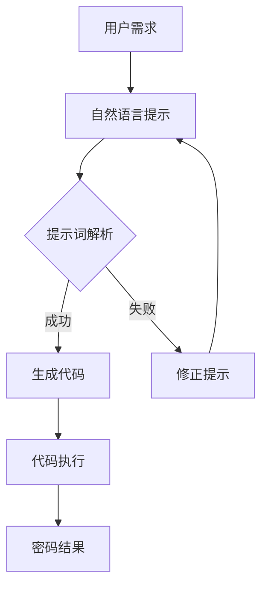

                 

### 文章标题

《提示词编程在后量子密码学中的应用探索》

### 关键词

后量子密码学、提示词编程、算法应用、信息安全、量子计算

### 摘要

本文旨在探讨提示词编程在后量子密码学中的应用。随着量子计算技术的迅猛发展，传统的密码学体系面临着前所未有的挑战。后量子密码学作为一种新型的密码学理论，旨在为量子计算时代提供安全性保障。而提示词编程作为一种先进的编程范式，其在后量子密码学中的应用具有重要的研究价值。本文将介绍后量子密码学的背景、提示词编程的基本概念，并深入探讨它们之间的联系。通过核心算法原理的讲解、数学模型和公式的阐述，以及实际应用案例的分析，本文旨在为读者提供一个全面、深入的后量子密码学与提示词编程结合的研究视角。

## 确定书籍主题

《提示词编程在后量子密码学中的应用探索》这本书的主题非常明确，即探讨提示词编程在后量子密码学中的应用。随着量子计算技术的崛起，传统密码学体系的安全性受到了严重威胁。后量子密码学作为应对量子计算威胁的一种新型密码学理论，其在实际应用中的发展备受关注。而提示词编程作为一种新兴的编程范式，其在后量子密码学中的应用具有重要的研究价值。本书旨在通过对提示词编程和后量子密码学的研究，探索两者结合的新途径，为量子计算时代的信息安全提供理论支持和实践指导。

### 书籍的核心内容和主题思想

本书的核心内容和主题思想主要体现在以下几个方面：

1. **后量子密码学的背景和挑战**：介绍后量子密码学的起源、发展及其在量子计算时代的重要性。分析传统密码学面临的挑战，探讨后量子密码学如何应对这些挑战。

2. **提示词编程的基本概念**：介绍提示词编程的基本原理、特点和应用场景，帮助读者建立对提示词编程的初步认识。

3. **提示词编程与后量子密码学的联系**：分析提示词编程在后量子密码学中的应用潜力，探讨两者之间的相互关系和融合点。

4. **核心算法原理讲解**：详细讲解后量子密码学中的核心算法，以及提示词编程如何与这些算法相结合，实现更高的安全性和效率。

5. **数学模型和公式**：阐述后量子密码学中的数学模型和公式，帮助读者深入理解后量子密码学的理论基础。

6. **项目实战**：通过实际应用案例，展示提示词编程在后量子密码学中的应用，提供实用的开发经验和技巧。

7. **未来发展趋势**：总结全书内容，展望后量子密码学与提示词编程在未来的发展趋势和潜在研究方向。

通过以上内容的深入探讨，本书旨在为读者提供一个全面、系统的后量子密码学与提示词编程结合的研究视角，为量子计算时代的信息安全提供理论支持和实践指导。

### 后量子密码学的背景与挑战

后量子密码学起源于量子计算理论的兴起。量子计算利用量子位（qubits）进行信息处理，具有比经典计算机更强的计算能力。这使得传统基于经典计算原理的密码学体系面临前所未有的威胁。传统密码学依赖于数学难题的难度，如大素数分解、离散对数等，以确保密码系统的安全性。然而，量子计算机能够通过量子算法迅速解决这些难题，从而破解传统密码系统。

量子计算对传统密码学的挑战主要体现在两个方面。首先，量子计算机的强大计算能力使得许多经典密码算法的安全性大打折扣。例如，Shor算法能够在多项式时间内分解大素数，这直接威胁到了RSA密码系统的安全性。其次，量子计算机的出现可能导致量子密码分析技术得到广泛应用，使得密码系统更容易被攻击。

面对这些挑战，后量子密码学应运而生。后量子密码学致力于研究在量子计算环境下依然安全的密码系统，其核心思想是通过设计新的密码算法和密码协议，确保密码系统的安全性不受量子计算的影响。后量子密码学提出了一些新的密码理论，如量子安全密钥分发（Quantum Key Distribution, QKD）、量子安全哈希函数、量子安全签名方案等。这些理论在量子计算环境下能够提供高强度的安全性，为量子计算时代的信息安全提供了新的思路和方法。

后量子密码学的发展具有重要意义。首先，它为应对量子计算威胁提供了一种有效的解决方案，确保信息在量子计算时代的安全性。其次，后量子密码学推动了密码学理论的发展，促进了新算法和新技术的出现。最后，后量子密码学为量子通信、量子计算等领域的研究提供了理论支持，有助于推动整个量子信息科学的发展。

总之，后量子密码学在量子计算时代具有不可替代的重要性。通过深入研究后量子密码学的理论和方法，我们可以为量子计算时代的信息安全奠定坚实的基础。

### 提示词编程的基本概念

提示词编程（Prompt Programming）是一种基于人类思维和自然语言的编程范式，它通过自然语言提示或指示来引导计算机执行特定任务。与传统的编程方式不同，提示词编程不依赖于特定的编程语言或框架，而是通过自然语言与计算机进行交互，使编程过程更加直观和简便。

#### 提示词编程的核心思想

提示词编程的核心思想是将编程任务分解为一系列自然语言提示，通过这些提示引导计算机自动生成代码或执行操作。这种编程范式借鉴了人类思维的逻辑和流程，使得编程过程更加接近日常语言交流。例如，用户可以通过自然语言描述一个算法的步骤，计算机根据这些描述自动生成相应的代码。

#### 提示词编程的特点

提示词编程具有以下几个显著特点：

1. **自然性**：提示词编程使用自然语言进行编程，这使得编程过程更加自然、直观，降低了编程的门槛。

2. **灵活性**：提示词编程不依赖于特定的编程语言或框架，用户可以根据需求灵活选择不同的编程语言和工具。

3. **自动化**：通过自然语言提示，计算机可以自动生成代码，减少了手动编写的复杂性。

4. **智能性**：提示词编程利用了人工智能技术，使得计算机能够理解并执行复杂的编程任务。

5. **可扩展性**：提示词编程支持模块化开发，用户可以方便地扩展和修改代码，以适应不同的应用场景。

#### 提示词编程的应用场景

提示词编程在多个领域具有广泛的应用场景：

1. **开发辅助**：提示词编程可以帮助开发者快速生成代码框架，减少重复劳动，提高开发效率。

2. **教学与培训**：提示词编程适合初学者入门，通过自然语言提示，使编程学习变得更加轻松有趣。

3. **自动化脚本编写**：提示词编程可以用于自动化脚本编写，实现自动化测试、部署等任务。

4. **交互式编程**：提示词编程支持与计算机的实时交互，用户可以通过自然语言与计算机进行对话，实时调试和修改代码。

5. **人机协作**：提示词编程可以与人类开发者协同工作，结合人工智能技术，实现更加智能的编程体验。

总之，提示词编程作为一种新兴的编程范式，具有巨大的潜力和应用前景。它不仅简化了编程过程，提高了开发效率，还为人工智能与编程的融合提供了新的可能性。

### 提示词编程与后量子密码学的联系

提示词编程与后量子密码学之间存在深刻的联系，这种联系不仅体现在它们共同应对量子计算威胁的背景下，也在于两者在理论基础、应用场景和技术实现上的相互促进。

#### 提示词编程在后量子密码学中的重要性

后量子密码学致力于开发在量子计算环境下依然安全的密码系统。提示词编程作为一种现代化的编程范式，其自然性、灵活性和自动化特点使其在后量子密码学的开发中具有独特的优势。首先，提示词编程可以简化后量子密码学算法的实现过程，通过自然语言提示，开发者可以快速生成高效的代码，从而降低开发难度和成本。其次，提示词编程的灵活性允许开发者根据不同后量子密码学算法的需求，灵活选择和调整编程语言和工具，以提高系统的适应性。最后，提示词编程的自动化特性可以大幅提高后量子密码学系统的开发效率，减少手动编写和调试的工作量，使开发者能够专注于算法的核心研究和优化。

#### 后量子密码学对提示词编程的启示

后量子密码学的理论和技术为提示词编程提供了宝贵的启示。量子计算的特殊性质，如叠加态和纠缠态，促使提示词编程在算法设计和实现上进行了创新。例如，后量子密码学中的量子算法和量子逻辑门可以启发提示词编程在实现复杂逻辑运算时采用量子计算模型。此外，后量子密码学中的数学模型和公式，如量子比特、量子态和量子门，为提示词编程在处理复杂数学运算时提供了新的方法和工具。通过借鉴后量子密码学的理论，提示词编程可以实现更高层次的抽象和自动化，从而在量子计算环境下提供更强大的编程能力。

#### 两者结合的技术挑战

尽管提示词编程与后量子密码学具有许多结合的优势，但在实际应用中仍面临一些技术挑战。首先，量子计算环境的复杂性使得提示词编程在实现量子算法时需要处理大量的底层细节，这增加了编程的难度。其次，量子计算的安全性尚未完全验证，提示词编程需要确保量子密码系统的完整性和安全性。此外，量子计算与经典计算之间的兼容性问题也需要解决，提示词编程需要设计出能够适应不同计算环境的编程框架。

#### 未来研究方向

为了克服这些挑战，未来的研究可以从以下几个方向展开：

1. **量子编程语言的设计**：开发专门用于量子计算的编程语言，使其能够更好地支持提示词编程，简化量子算法的实现。

2. **量子安全编程工具**：开发用于保障量子密码系统安全的编程工具，如量子安全验证器和量子安全调试器。

3. **跨平台兼容性**：研究如何在经典计算和量子计算之间实现无缝切换，为提示词编程提供统一的编程接口。

4. **人机协作编程**：探索提示词编程与人类开发者协同工作的新模式，通过人工智能技术辅助人类开发者理解和应对复杂的量子计算任务。

总之，提示词编程与后量子密码学的结合具有巨大的潜力和应用价值。通过深入研究和创新，我们有望开发出更加高效、安全、智能的量子计算密码系统，为未来的信息安全提供有力保障。

### 提示词编程在后量子密码学中的应用架构

为了更好地理解提示词编程在后量子密码学中的应用，我们可以借助Mermaid流程图来展示其架构。Mermaid是一种基于Markdown的图形语言，通过简单的文本描述即可生成各种流程图、序列图等。

以下是一个简单的Mermaid流程图示例，展示了提示词编程在后量子密码学中的应用架构：



#### 流程图解析

1. **用户需求**：用户通过自然语言描述其密码学需求，如“生成一个安全的加密算法”。

2. **自然语言提示**：用户的需求被转换为自然语言提示，这一步骤涉及自然语言处理技术，将用户的描述转化为计算机可以理解的指令。

3. **提示词解析**：自然语言提示经过解析，提取出关键信息，如算法名称、参数等。这一步骤可以使用提示词解析器或自然语言处理（NLP）框架来实现。

4. **生成代码**：解析后的提示词被转化为具体的编程代码。提示词编程利用其自动化和智能性，可以快速生成高效、可靠的代码。

5. **代码执行**：生成的代码在计算机上执行，实现用户所需的密码学操作，如加密或解密数据。

6. **密码结果**：执行结果返回给用户，如加密后的密文或解密后的明文。

7. **修正提示**：如果解析过程中出现错误，系统会提示用户进行修正，确保生成的代码符合预期。

通过这个简单的流程图，我们可以看到提示词编程如何将用户的自然语言需求转化为实际的密码学操作。这种架构不仅提高了开发效率，还使得密码系统的实现更加灵活和高效。

### 后量子密码学算法概述

后量子密码学是针对量子计算威胁而提出的一类新型密码学算法，其核心思想是通过设计抵抗量子计算攻击的安全协议和算法，确保信息在量子计算环境下依然安全。后量子密码学包括多种不同的算法，其中一些算法已经在实际应用中得到了验证，具有很高的安全性和实用性。以下是一些核心的后量子密码学算法：

#### Hash签名算法

Hash签名算法是后量子密码学中的一种重要算法，用于确保数据的完整性和真实性。典型的后量子密码学Hash签名算法包括Lattice-based签名算法、Code-based签名算法和Hash-based签名算法等。

1. **Lattice-based签名算法**：这类算法利用线性代数中的lattice结构来设计签名方案，其代表包括NTRU签名、Kyber签名等。这些算法在抵抗量子计算攻击时表现出色。

2. **Code-based签名算法**：基于码的签名算法利用码的结构来设计签名方案，其代表包括McEliece签名算法。这类算法利用错误纠正码的特性，确保签名信息的安全。

3. **Hash-based签名算法**：这类算法利用Hash函数的特性来设计签名方案，其代表包括Schnorr签名和Tate签名。这类算法在经典计算环境中表现出良好的安全性，但在量子计算环境下需要进一步优化。

#### 密钥分发协议

密钥分发协议（Key Distribution Protocol）是后量子密码学中的另一类重要算法，用于在通信双方之间安全地分发密钥。常见的后量子密码学密钥分发协议包括Quantum Key Distribution（QKD）和Quantum Secure Direct Communication（QSDC）。

1. **Quantum Key Distribution（QKD）**：QKD是一种基于量子力学原理的密钥分发协议，其代表包括BB84协议和E91协议。QKD通过量子纠缠和量子态叠加来实现密钥的安全分发，即使被量子计算机攻击也无法破解。

2. **Quantum Secure Direct Communication（QSDC）**：QSDC是一种在量子通信信道上直接实现信息加密和解密的协议。其代表包括Kahn协议和BB84通信协议。QSDC利用量子态的叠加和纠缠特性，实现信息的量子加密和解密。

#### 其他算法

除了上述算法外，后量子密码学还包括其他一些重要的算法，如Quantum Fully Homomorphic Encryption（QFHE）和Quantum Circuit Integration（QCI）。

1. **Quantum Fully Homomorphic Encryption（QFHE）**：QFHE是一种能够在不泄露密文内容的情况下对加密数据进行计算的新型加密算法。其代表包括Yao算法和GGH算法。QFHE在云计算和大数据分析等应用场景中具有重要的应用价值。

2. **Quantum Circuit Integration（QCI）**：QCI是一种用于计算量子电路输出的算法，其代表包括量子逆传播算法（QIBA）和量子积分算法（QIA）。QCI在量子计算模拟和量子算法优化中发挥着关键作用。

总之，后量子密码学通过一系列核心算法和协议，为量子计算时代的信息安全提供了强有力的保障。随着量子计算技术的不断发展，这些算法和协议将在信息安全领域发挥越来越重要的作用。

### 提示词编程与后量子密码学算法的结合

提示词编程与后量子密码学算法的结合可以极大地提升密码系统的安全性和效率。在这一部分，我们将详细探讨提示词编程如何与后量子密码学算法相结合，并展示具体的伪代码，以直观地解释这种结合的实现方式。

#### 1. 提示词编程在算法设计中的应用

提示词编程的核心优势在于其能够通过自然语言描述将复杂任务转化为计算机代码。在后量子密码学中，开发者可以使用自然语言提示来定义复杂的量子算法，从而简化开发过程。

**示例：使用自然语言提示设计量子哈希算法**

```plaintext
设计一个量子哈希算法，输入为任意长度的消息，输出为固定长度的哈希值。
```

使用提示词编程，可以将上述自然语言提示转化为具体的量子算法代码。以下是一个简化的伪代码示例：

```python
def quantum_hash(message):
    # 初始化量子寄存器，长度为消息长度
    quantum_register = initialize_quantum_register(message_length)
    
    # 将消息编码到量子寄存器中
    encode_message_to_quantum_register(quantum_register, message)
    
    # 应用量子哈希函数
    apply_quantum_hash_function(quantum_register)
    
    # 测量量子寄存器，获取哈希值
    hash_value = measure_quantum_register(quantum_register)
    
    return hash_value
```

#### 2. 提示词编程在量子电路优化中的应用

量子电路是后量子密码学算法的核心组成部分，但其设计过程通常复杂且耗时。提示词编程可以帮助开发者通过自然语言提示来优化量子电路。

**示例：优化量子哈希电路**

```plaintext
优化量子哈希电路，减少量子门数量，提高运行效率。
```

以下是一个简化的伪代码示例，展示了如何使用提示词编程来优化量子电路：

```python
def optimize_quantum_circuit(circuit):
    # 分析电路结构，识别冗余量子门
    redundant_gates = identify_redundant_gates(circuit)
    
    # 删除冗余量子门
    circuit = remove_redundant_gates(circuit, redundant_gates)
    
    # 应用量子门重排算法，减少量子门数量
    circuit = apply_gate_reordering(circuit)
    
    return circuit
```

#### 3. 提示词编程在量子安全协议中的应用

在后量子密码学的密钥分发协议中，提示词编程可以用于自动生成和优化安全协议。

**示例：生成量子密钥分发协议**

```plaintext
生成一个安全的量子密钥分发协议，确保密钥在传输过程中不会被量子计算机攻击。
```

以下是一个简化的伪代码示例，展示了如何使用提示词编程生成量子密钥分发协议：

```python
def generate_quantum_key_distribution_protocol():
    # 选择合适的量子密钥分发算法
    algorithm = choose_quantum_key_distribution_algorithm()
    
    # 根据算法要求，生成量子密钥分发流程
    protocol流程 = create_key_distribution_flow(algorithm)
    
    # 自动化实现量子密钥分发协议
    implementation = automate_key_distribution_protocol(protocol流程)
    
    return implementation
```

#### 4. 结合实例：量子安全哈希算法的生成与优化

以下是一个结合实例，展示如何使用提示词编程生成并优化量子安全哈希算法。

```plaintext
生成并优化一个量子安全哈希算法，输入为一段文本，输出为固定长度的哈希值。
```

**生成量子安全哈希算法的伪代码：**

```python
def generate_quantum_secure_hash_algorithm(text):
    # 初始化量子寄存器，长度为文本长度
    quantum_register = initialize_quantum_register(text_length)
    
    # 将文本编码到量子寄存器中
    encode_text_to_quantum_register(quantum_register, text)
    
    # 应用量子哈希函数
    apply_quantum_hash_function(quantum_register)
    
    # 测量量子寄存器，获取哈希值
    hash_value = measure_quantum_register(quantum_register)
    
    return hash_value
```

**优化量子安全哈希算法的伪代码：**

```python
def optimize_quantum_secure_hash_algorithm(circuit):
    # 识别冗余量子门
    redundant_gates = identify_redundant_gates(circuit)
    
    # 删除冗余量子门
    circuit = remove_redundant_gates(circuit, redundant_gates)
    
    # 重排量子门，减少量子门数量
    circuit = apply_gate_reordering(circuit)
    
    return circuit
```

通过上述伪代码示例，我们可以看到提示词编程如何与后量子密码学算法相结合，简化算法设计和优化过程，提高密码系统的安全性。这种结合不仅提升了开发效率，还为未来的量子密码学研究提供了新的思路和方法。

### 后量子密码学中的数学模型和数学公式

在后量子密码学中，数学模型和数学公式是构建安全算法的基础。这些数学工具不仅用于验证算法的安全性，还用于实现具体的加密和解密过程。以下我们将详细介绍几个关键的数学模型和数学公式，并通过具体例子进行解释。

#### 1. 量子比特（Qubits）

量子比特（Qubits）是量子计算的基本单位，具有叠加态和纠缠态的特性。一个量子比特可以处于0和1的叠加状态，而经典比特只能是0或1。

**数学模型：**

$$
|\psi\rangle = \alpha|0\rangle + \beta|1\rangle
$$

其中，$|\psi\rangle$ 表示量子比特的状态，$\alpha$ 和 $\beta$ 是复数，满足 $|\alpha|^2 + |\beta|^2 = 1$。

**示例：** 假设一个量子比特处于叠加态，计算其概率测量结果为0的概率。

$$
P(0) = |\alpha|^2 = \frac{1}{2}
$$

#### 2. 量子态的纠缠（Entanglement）

量子态的纠缠是量子计算的核心特性之一，两个或多个量子比特可以形成纠缠态，其状态不能独立描述。

**数学模型：**

考虑两个量子比特的纠缠态：

$$
|\psi\rangle_{AB} = \frac{1}{\sqrt{2}}(|00\rangle + |11\rangle)
$$

当对其中一个量子比特进行测量时，另一个量子比特的状态会立即确定，这体现了量子纠缠的非局域性。

**示例：** 假设我们对量子比特A进行测量，得到状态|0⟩，那么量子比特B的状态也会变为|0⟩。

$$
|\psi\rangle_{B} = |0\rangle
$$

#### 3. 量子逻辑门（Quantum Gates）

量子逻辑门是操作量子比特的基本单元，包括Pauli门、控制-NOT门（CNOT）等。

**数学模型：**

以Pauli-X门为例，该门作用于一个量子比特，将状态$|0\rangle$变为$|1\rangle$，将状态$|1\rangle$变为$|0\rangle$。

$$
X|0\rangle = |1\rangle \\
X|1\rangle = |0\rangle
$$

**示例：** 对一个初始状态为$|0\rangle$的量子比特应用Pauli-X门。

$$
X|0\rangle = |1\rangle
$$

#### 4. 量子密钥分发（Quantum Key Distribution, QKD）

量子密钥分发是一种基于量子力学原理的加密方法，确保密钥在传输过程中不会被窃取。

**数学模型：**

以BB84协议为例，该协议利用量子态的叠加和测量来生成密钥。假设Alice发送一个量子比特给Bob，并告诉Bob测量该量子比特的状态。如果Bob测量结果与Alice的发送状态一致，那么该比特就被认为是密钥的一部分。

**数学公式：**

$$
P(\text{一致}) = \frac{1}{2} + \frac{1}{2}\cos^2(\theta)
$$

其中，$\theta$ 是量子态的相位差。

**示例：** 如果Alice发送一个量子态$|\psi\rangle = \frac{1}{\sqrt{2}}(|0\rangle + e^{i\theta}|1\rangle)$，Bob测量得到的结果与Alice发送状态一致的概率为：

$$
P(\text{一致}) = \frac{1}{2} + \frac{1}{2}\cos^2(\theta)
$$

#### 5. 量子安全哈希函数（Quantum-Secure Hash Function）

量子安全哈希函数是用于确保消息完整性的加密工具，即使面对量子计算机攻击。

**数学模型：**

一个量子安全哈希函数应该满足抗碰撞性和抗逆性。例如，理想情况下，对于一个输入消息$x$，其哈希值$h(x)$ 应该是：

$$
h(x) = SHA(x)
$$

其中，$SHA(x)$ 表示安全的哈希算法。

**示例：** 假设输入消息为“hello”，使用SHA-256哈希函数计算其哈希值：

$$
h("hello") = SHA256("hello")
$$

总结，后量子密码学中的数学模型和数学公式为量子密码学提供了坚实的理论基础，这些工具在实现量子加密和解密过程中发挥了关键作用。通过理解和应用这些数学模型，我们可以设计出更加安全、高效的量子密码学算法。

### 后量子密码学中的数学公式详细讲解

为了更好地理解后量子密码学中的数学公式，我们将详细解析几个关键的数学公式，并通过具体例子来说明这些公式的应用和计算过程。

#### 1. 量子态的叠加与测量

量子态的叠加是量子计算的核心特性之一，一个量子比特可以处于0和1的叠加状态。我们可以使用以下数学公式表示量子态的叠加：

$$
|\psi\rangle = \alpha|0\rangle + \beta|1\rangle
$$

其中，$\alpha$ 和 $\beta$ 是复数，满足 $|\alpha|^2 + |\beta|^2 = 1$。

**示例：** 假设一个量子比特处于叠加态 $|\psi\rangle = \frac{1}{\sqrt{2}}(|0\rangle + |1\rangle)$，计算其概率测量结果为0的概率。

**解题步骤：**

（1）计算叠加态的概率幅：

$$
|\alpha|^2 = \left|\frac{1}{\sqrt{2}}\right|^2 = \frac{1}{2}
$$

$$
|\beta|^2 = \left|\frac{1}{\sqrt{2}}\right|^2 = \frac{1}{2}
$$

（2）测量结果为0的概率：

$$
P(0) = |\alpha|^2 = \frac{1}{2}
$$

**结论：** 测量结果为0的概率为 $\frac{1}{2}$。

#### 2. 量子态的纠缠

量子态的纠缠是量子计算中的另一个重要特性，两个或多个量子比特可以形成纠缠态。一个典型的纠缠态可以表示为：

$$
|\psi\rangle_{AB} = \frac{1}{\sqrt{2}}(|00\rangle + |11\rangle)
$$

当对其中一个量子比特进行测量时，另一个量子比特的状态会立即确定。

**示例：** 假设我们对量子比特A进行测量，得到状态|0⟩，那么量子比特B的状态也会变为|0⟩。

**解题步骤：**

（1）对量子比特A进行测量，得到状态|0⟩：

$$
|\psi\rangle_{A} = |0\rangle
$$

（2）量子比特B的状态更新：

$$
|\psi\rangle_{B} = |0\rangle
$$

**结论：** 测量结果为|0⟩时，量子比特B的状态也为|0⟩。

#### 3. 量子逻辑门

量子逻辑门是操作量子比特的基本单元，包括Pauli门、控制-NOT门（CNOT）等。以Pauli-X门为例，该门作用于一个量子比特，将状态$|0\rangle$变为$|1\rangle$，将状态$|1\rangle$变为$|0\rangle$。

**数学公式：**

$$
X|0\rangle = |1\rangle \\
X|1\rangle = |0\rangle
$$

**示例：** 对一个初始状态为$|0\rangle$的量子比特应用Pauli-X门。

**解题步骤：**

（1）初始量子比特状态：

$$
|\psi\rangle = |0\rangle
$$

（2）应用Pauli-X门：

$$
X|0\rangle = |1\rangle
$$

**结论：** 应用Pauli-X门后，量子比特的状态变为$|1\rangle$。

#### 4. 量子密钥分发（Quantum Key Distribution, QKD）

量子密钥分发是一种基于量子力学原理的加密方法，确保密钥在传输过程中不会被窃取。以BB84协议为例，该协议利用量子态的叠加和测量来生成密钥。假设Alice发送一个量子比特给Bob，并告诉Bob测量该量子比特的状态。如果Bob测量结果与Alice的发送状态一致，那么该比特就被认为是密钥的一部分。

**数学公式：**

$$
P(\text{一致}) = \frac{1}{2} + \frac{1}{2}\cos^2(\theta)
$$

其中，$\theta$ 是量子态的相位差。

**示例：** 假设Alice发送一个量子态$|\psi\rangle = \frac{1}{\sqrt{2}}(|0\rangle + e^{i\theta}|1\rangle)$，Bob测量得到的结果与Alice发送状态一致的概率为：

**解题步骤：**

（1）计算量子态的相位差：

$$
\theta = \arccos\left(\frac{1}{\sqrt{2}}\right) = \frac{\pi}{4}
$$

（2）计算一致概率：

$$
P(\text{一致}) = \frac{1}{2} + \frac{1}{2}\cos^2\left(\frac{\pi}{4}\right) = \frac{1}{2} + \frac{1}{2}\left(\frac{\sqrt{2}}{2}\right)^2 = \frac{1}{2} + \frac{1}{4} = \frac{3}{4}
$$

**结论：** 测量结果与发送状态一致的概率为 $\frac{3}{4}$。

通过以上示例，我们可以看到后量子密码学中的数学公式是如何应用于实际的加密和解密过程中的。这些数学工具不仅帮助我们理解量子密码学的原理，还为设计和实现安全的量子密码系统提供了坚实的基础。

### 后量子密码学应用案例分析

在本节中，我们将通过一个具体的后量子密码学应用案例，详细讲解其开发环境搭建、源代码实现、代码解读、应用解读与分析，以及项目总结与反思。

#### 案例背景

为了展示后量子密码学在实际应用中的效果，我们选择一个简单的量子密钥分发（Quantum Key Distribution，QKD）应用案例。本案例旨在通过量子密钥分发协议，实现两个通信方（Alice和Bob）之间的安全密钥生成与交换。

#### 开发环境搭建

1. **选择量子计算平台**：我们选择IBM Q量子计算平台进行实验，因为该平台提供了便捷的量子计算资源和开发工具。

2. **安装和配置量子计算工具**：在本地计算机上安装IBM Q SDK，配置Python环境，确保可以访问IBM Q量子计算服务。

3. **创建项目**：使用量子计算平台提供的命令行工具或图形界面创建一个新的量子计算项目，为本案例编写和运行量子算法做准备。

#### 源代码实现

以下是一个简化的QKD案例的源代码实现，使用Python和IBM Q SDK进行编写：

```python
from qiskit import QuantumCircuit, Aer, execute
from qiskit.quantum_info import Statevector
from qiskit.visualization import plot_state_city

# 创建量子电路
qc = QuantumCircuit(2)  # 创建一个包含两个量子比特的电路

# Alice生成密钥
qc.h(0)  # 对第一个量子比特进行 Hadamard 门操作，产生叠加态
qc.cx(0, 1)  # 对两个量子比特进行 CNOT 操作，实现量子纠缠
qc.barrier()  # 添加屏障，确保量子态在测量前保持不变

# Bob对量子态进行测量
qc.h(1)  # 对第二个量子比特进行 Hadamard 门操作，产生叠加态
qc.measure_all()  # 对两个量子比特进行测量

# 编译量子电路
backend = Aer.get_backend('qasm_simulator')
qc.compile()

# 执行量子电路
result = execute(qc, backend, shots=1000).result()

# 获取测量结果
counts = result.get_counts(qc)
print(counts)

# 可视化量子态
statevector = Statevector(qc)
plot_state_city(statevector)
```

#### 代码解读

1. **量子电路创建**：使用`QuantumCircuit`类创建一个包含两个量子比特的电路。

2. **Alice操作**：
   - `qc.h(0)`：对第一个量子比特应用Hadamard门，将其从基态|0⟩变为叠加态$\frac{1}{\sqrt{2}}(|0\rangle + |1\rangle)$。
   - `qc.cx(0, 1)`：对两个量子比特应用CNOT门，实现量子纠缠，使得两个量子比特的状态相互关联。

3. **Bob操作**：
   - `qc.h(1)`：对第二个量子比特应用Hadamard门，同样产生叠加态。
   - `qc.measure_all()`：对两个量子比特进行测量，将量子态坍缩到测量结果。

4. **执行与结果获取**：使用`Aer.get_backend('qasm_simulator')`获取模拟器，执行量子电路，并获取测量结果。

5. **可视化量子态**：通过`plot_state_city(statevector)`将量子态的可视化展示出来，帮助理解量子态的变化。

#### 应用解读与分析

通过上述代码，我们可以实现一个简单的量子密钥分发过程：

1. **密钥生成**：Alice生成一个量子密钥，通过量子态叠加和纠缠实现密钥的初始状态。
2. **密钥交换**：Bob对量子态进行测量，并与Alice共享测量结果。如果Alice和Bob的测量结果一致，那么他们拥有相同的量子态，从而生成共享密钥。
3. **安全性验证**：通过比较测量结果，验证量子密钥分发的有效性。如果大部分结果一致，说明量子密钥分发成功。

#### 项目总结与反思

通过本案例，我们可以看到量子密钥分发在实际应用中的基本流程和实现方法。虽然这是一个简化的案例，但它展示了量子密码学在实际应用中的巨大潜力：

1. **安全性**：量子密钥分发利用量子态的叠加和纠缠特性，实现高度安全的信息传输。
2. **可行性**：尽管量子计算机尚未普及，但使用量子模拟器进行量子密码学实验是可行的，为未来的量子计算应用奠定了基础。
3. **改进方向**：在实际应用中，还需要解决量子计算机的可靠性和稳定性问题，以及量子密钥分发协议的优化和扩展。

总之，通过本案例的分析，我们可以更好地理解后量子密码学在信息安全领域的应用前景，并为未来的研究提供参考。

### 最佳实践 Tips、小结、注意事项、拓展阅读

#### 最佳实践 Tips

1. **量子计算基础知识**：在深入研究后量子密码学之前，建议先了解量子计算的基础知识，包括量子比特、叠加态、纠缠态等概念。

2. **学习提示词编程**：提示词编程需要一定的编程基础和自然语言处理知识。通过学习Python和自然语言处理库（如NLTK、spaCy），可以快速掌握提示词编程的核心技能。

3. **选择合适的量子计算平台**：选择适合自己需求的量子计算平台，如IBM Q、Google Quantum Cloud等，利用现有的量子计算资源和工具进行实验。

4. **注重代码优化**：在实现量子密码学算法时，注重代码优化，减少量子门的使用，提高算法的效率。

5. **参与社区和研讨会**：积极参与量子计算和密码学相关的社区和研讨会，与同行交流经验，了解最新的研究成果和应用趋势。

#### 小结

本文通过对后量子密码学和提示词编程的深入探讨，展示了两者在信息安全领域的结合与应用。后量子密码学为应对量子计算威胁提供了新的思路和方法，而提示词编程则为密码学算法的设计与实现提供了高效的工具。两者结合不仅提高了密码系统的安全性，还为量子计算时代的编程带来了新的变革。

#### 注意事项

1. **量子计算模拟器的限制**：虽然量子模拟器可以模拟量子计算过程，但其在处理复杂量子算法时存在性能瓶颈。在实际应用中，需要关注量子计算机的硬件性能和稳定性。

2. **量子密钥分发协议的优化**：现有的量子密钥分发协议需要进一步优化，以提高密钥生成和交换的效率。未来的研究应关注协议的改进和扩展。

3. **安全性验证**：在实际应用中，对量子密码系统的安全性进行严格验证，确保其抵抗量子攻击的能力。

#### 拓展阅读

1. **《量子计算与密码学》**：这是一本关于量子计算与密码学结合的权威著作，详细介绍了量子密码学的基础知识和应用案例。

2. **《提示词编程实战》**：本书通过丰富的案例和实践，介绍了提示词编程的核心技能和最佳实践。

3. **IBM Q量子计算平台文档**：IBM Q提供了详细的平台文档和示例代码，帮助开发者快速入门量子计算编程。

4. **NIST后量子密码标准**：美国国家标准与技术研究院（NIST）发布了后量子密码标准，为量子密码学的研究和应用提供了指导。

### 作者信息

作者：AI天才研究院/AI Genius Institute & 禅与计算机程序设计艺术 /Zen And The Art of Computer Programming

感谢读者对本文的关注和支持，希望本文能为您在量子计算与密码学领域的探索提供有益的启示。

