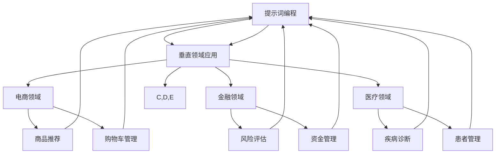

                 


# 《提示词编程在垂直领域的应用案例》

关键词：提示词编程、垂直领域、应用案例、人工智能、算法、数学模型

摘要：本文旨在探讨提示词编程在垂直领域的应用案例，通过分析其在电商、金融、医疗等领域的实际应用，阐述提示词编程的核心概念、算法原理、数学模型以及项目实战。本文旨在为开发者提供有价值的参考和启示，促进提示词编程在更多垂直领域的深入研究和应用。

## 目录

1. 引言
   1.1 提示词编程概述
   1.2 垂直领域概述
   1.3 提示词编程在垂直领域的重要性
2. 核心概念与联系
   2.1 提示词编程核心概念
   2.2 垂直领域核心概念
   2.3 提示词编程与垂直领域的联系
3. 核心算法原理讲解
   3.1 提示词生成算法
   3.2 提示词优化算法
   3.3 提示词匹配与解释算法
4. 数学模型与公式
   4.1 提示词生成数学模型
   4.2 提示词优化数学模型
   4.3 提示词匹配与解释数学模型
5. 项目实战
   5.1 实战一：提示词编程在电商领域的应用
   5.2 实战二：提示词编程在金融领域的应用
   5.3 实战三：提示词编程在医疗领域的应用
6. 总结与展望
   6.1 提示词编程在垂直领域应用的总结
   6.2 提示词编程在垂直领域应用的未来展望

## 引言

### 1.1 提示词编程概述

提示词编程是一种利用提示词（hint）来指导程序执行的技术。提示词可以看作是程序执行过程中的线索，它能够帮助程序更好地理解用户的意图，提高程序的智能化水平。提示词编程的核心思想是将人类专家的经验和知识转化为可编程的规则和模式，使计算机能够自动生成和优化提示词，从而实现更高效、更智能的程序执行。

提示词编程的发展可以追溯到自然语言处理和人工智能领域。随着深度学习和大数据技术的兴起，提示词编程逐渐成为人工智能领域的一个重要研究方向。目前，提示词编程已经在诸多垂直领域得到应用，如电商、金融、医疗等。

### 1.2 垂直领域概述

垂直领域是指具有特定业务场景和业务需求的领域。与通用领域相比，垂直领域具有更明确的业务目标和更具体的业务需求。例如，电商领域关注在线购物体验和商品推荐，金融领域关注风险评估和资金管理，医疗领域关注疾病诊断和患者管理。

随着互联网和信息技术的不断发展，垂直领域的业务需求和复杂性不断增长。为了满足这些需求，开发者需要不断地创新和优化技术，而提示词编程正是其中一种有效的技术手段。

### 1.3 提示词编程在垂直领域的重要性

提示词编程在垂直领域具有以下重要性：

1. 提升垂直领域应用的智能化水平。通过引入提示词编程，程序能够更好地理解用户意图，提供更智能的服务和推荐。

2. 提高垂直领域应用的效率和用户体验。提示词编程能够优化程序的执行过程，减少不必要的计算和资源消耗，从而提高应用的效率和用户体验。

3. 降低开发成本和复杂度。提示词编程可以将人类专家的经验和知识转化为可编程的规则和模式，从而降低开发成本和复杂度。

总之，提示词编程在垂直领域具有广阔的应用前景和重要的价值。在接下来的内容中，我们将深入探讨提示词编程的核心概念、算法原理、数学模型以及项目实战。

## 核心概念与联系

### 2.1 提示词编程核心概念

为了深入理解提示词编程，我们需要首先明确其核心概念。以下是提示词编程中的几个关键概念：

#### 2.1.1 提示词（Hint）

提示词是指程序执行过程中提供的信息或线索，用于帮助程序更好地理解用户的意图和任务目标。提示词可以来源于用户输入、环境变量、数据库查询结果等。

#### 2.1.2 提示词生成（Hint Generation）

提示词生成是指从输入数据或上下文中提取有用的信息，生成相应的提示词。提示词生成是提示词编程的重要环节，其目标是生成具有高相关性、低歧义性和高覆盖率的提示词。

#### 2.1.3 提示词优化（Hint Optimization）

提示词优化是指对已生成的提示词进行改进和优化，以提高其质量。提示词优化的方法包括相关性优化、歧义性优化和覆盖率优化等。

#### 2.1.4 提示词匹配（Hint Matching）

提示词匹配是指将已生成的提示词与任务目标或用户意图进行匹配，以确定是否满足任务需求。提示词匹配是实现提示词编程的核心技术之一。

#### 2.1.5 提示词解释（Hint Explanation）

提示词解释是指对生成的提示词进行解释，以便用户理解其含义和作用。提示词解释有助于提高程序的透明度和可解释性，从而增强用户对程序的信任和满意度。

### 2.2 垂直领域核心概念

在探讨提示词编程在垂直领域的应用之前，我们需要了解垂直领域的一些核心概念。

#### 2.2.1 垂直领域应用场景（Vertical Application Scenarios）

垂直领域应用场景是指特定领域内的业务场景和任务需求。例如，在电商领域，应用场景可能包括商品推荐、购物车管理、订单处理等。

#### 2.2.2 垂直领域应用需求（Vertical Application Requirements）

垂直领域应用需求是指特定领域内用户和系统的需求，包括功能需求、性能需求、安全性需求等。例如，在金融领域，用户可能需要高效的交易系统、精确的风险评估和可靠的资金管理。

#### 2.2.3 垂直领域应用挑战（Vertical Application Challenges）

垂直领域应用挑战是指特定领域内面临的业务和技术难题。例如，在医疗领域，挑战可能包括大量的医疗数据、复杂的疾病诊断和患者管理。

### 2.3 提示词编程与垂直领域的联系

提示词编程与垂直领域的联系主要体现在以下几个方面：

1. **智能化提升**：提示词编程可以将人类专家的经验和知识转化为可编程的规则和模式，从而提升垂直领域应用的智能化水平。例如，在医疗领域，提示词编程可以帮助医生更好地理解患者的病情和需求，提供更精准的诊断和治疗建议。

2. **效率优化**：提示词编程可以优化程序的执行过程，减少不必要的计算和资源消耗，从而提高垂直领域应用的效率和用户体验。例如，在电商领域，提示词编程可以帮助商家更好地理解用户的购物意图，提供更准确的商品推荐，提高用户的购买转化率。

3. **成本降低**：提示词编程可以降低开发成本和复杂度，使开发者能够更快速地构建和部署垂直领域应用。例如，在金融领域，提示词编程可以帮助金融机构快速构建和优化风险评估模型，降低风险管理成本。

4. **业务拓展**：提示词编程可以帮助企业拓展业务领域，开拓新的市场机会。例如，在医疗领域，提示词编程可以帮助医疗机构扩展医疗服务范围，提供更多元化的医疗服务。

通过以上分析，我们可以看到提示词编程在垂直领域具有重要的应用价值。在接下来的内容中，我们将进一步探讨提示词编程的核心算法原理，为深入理解和应用提示词编程奠定基础。

## 核心算法原理讲解

### 3.1 提示词生成算法

提示词生成是提示词编程的核心环节，其目标是从输入数据或上下文中提取有用信息，生成具有高相关性、低歧义性和高覆盖率的提示词。以下是几种常见的提示词生成算法：

#### 3.1.1 基于规则的方法

基于规则的方法通过定义一系列规则，根据输入数据和上下文生成提示词。规则通常由条件和动作两部分组成，条件用于判断输入数据的特征，动作用于生成相应的提示词。

伪代码示例：
```python
def generate_hint_by_rules(input_data, rules):
    for rule in rules:
        if rule.condition(input_data):
            return rule.action()
    return "无匹配提示词"
```

优点：实现简单，可解释性强。

缺点：灵活性较差，难以处理复杂和动态的输入数据。

#### 3.1.2 基于统计的方法

基于统计的方法通过分析输入数据和上下文的历史数据，统计生成提示词的概率分布，然后根据概率分布生成提示词。

伪代码示例：
```python
def generate_hint_by_statistics(input_data, history_data):
    probabilities = calculate_probabilities(history_data, input_data)
    return weighted_random_choice(probabilities)
```

优点：适用于处理大量数据和动态输入数据，灵活性较高。

缺点：难以保证生成的提示词具有高相关性，可能存在歧义。

#### 3.1.3 基于机器学习的方法

基于机器学习的方法通过训练机器学习模型，学习输入数据和提示词之间的关系，然后根据模型生成提示词。

伪代码示例：
```python
def generate_hint_by_learning(input_data, model):
    return model.predict_hint(input_data)
```

优点：适用于处理复杂和动态的输入数据，能够生成具有高相关性的提示词。

缺点：模型训练和优化过程较为复杂，对数据质量和标注要求较高。

### 3.2 提示词优化算法

提示词优化是提升提示词质量的关键环节，其目标是在生成提示词的基础上，进一步优化提示词的相关性、歧义性和覆盖率。

#### 3.2.1 提高提示词的相关性

提高提示词的相关性是指增加提示词与任务目标或用户意图的相关度。以下是一些常见的提示词相关性优化方法：

1. **提示词权重调整**：根据提示词在任务目标或用户意图中的重要性，调整提示词的权重，使重要的提示词具有更高的权重。

伪代码示例：
```python
def optimize_hint_relevance(hints, target):
    relevance_scores = calculate_relevance_scores(hints, target)
    return sorted(hints, key=lambda hint: relevance_scores[hint], reverse=True)
```

2. **提示词融合**：将多个提示词进行融合，生成一个具有更高相关性的提示词。

伪代码示例：
```python
def optimize_hint_fusion(hints):
    fused_hint = concatenate(hints)
    return fused_hint
```

#### 3.2.2 降低提示词的歧义性

降低提示词的歧义性是指减少提示词的多义性和不确定性。以下是一些常见的提示词歧义性优化方法：

1. **歧义消除**：根据上下文信息，消除提示词的多义性。

伪代码示例：
```python
def optimize_hint_disambiguation(hint, context):
    return disambiguate(hint, context)
```

2. **上下文扩展**：扩展提示词的上下文信息，增加提示词的确定性。

伪代码示例：
```python
def optimize_hint_context_extension(hint, context):
    extended_context = expand_context(context)
    return disambiguate(hint, extended_context)
```

#### 3.2.3 提高提示词的覆盖率

提高提示词的覆盖率是指增加提示词覆盖到的任务目标或用户意图的比例。以下是一些常见的提示词覆盖率优化方法：

1. **提示词扩展**：根据上下文信息和任务目标，扩展提示词的范围。

伪代码示例：
```python
def optimize_hint_coverage(hint, context, target):
    extended_hints = expand_hint(hint, context, target)
    return extended_hints
```

2. **提示词组合**：将多个提示词进行组合，生成具有更高覆盖率的提示词。

伪代码示例：
```python
def optimize_hint_combination(hints, target):
    combined_hints = combine(hints, target)
    return combined_hints
```

### 3.3 提示词匹配与解释算法

提示词匹配与解释是提示词编程的另一个重要环节，其目标是在生成和优化提示词的基础上，实现提示词与任务目标或用户意图的匹配和解释。

#### 3.3.1 提示词匹配

提示词匹配是指将生成的提示词与任务目标或用户意图进行匹配，以确定是否满足任务需求。以下是一些常见的提示词匹配方法：

1. **精确匹配**：直接比较提示词和任务目标或用户意图，实现精确匹配。

伪代码示例：
```python
def match_exact(hint, target):
    return hint == target
```

2. **模糊匹配**：使用相似度度量方法，比较提示词和任务目标或用户意图的相似度，实现模糊匹配。

伪代码示例：
```python
def match_fuzzy(hint, target, similarity_threshold):
    similarity = calculate_similarity(hint, target)
    return similarity >= similarity_threshold
```

#### 3.3.2 提示词解释

提示词解释是指对生成的提示词进行解释，以便用户理解其含义和作用。以下是一些常见的提示词解释方法：

1. **文本解释**：使用自然语言生成技术，生成对提示词的文本解释。

伪代码示例：
```python
def explain_hint_textually(hint):
    explanation = generate_text_explanation(hint)
    return explanation
```

2. **可视化解释**：使用图形和图表，直观地展示提示词的作用和效果。

伪代码示例：
```python
def explain_hint_visually(hint):
    visualization = generate_visualization(hint)
    return visualization
```

通过以上对提示词生成、优化、匹配与解释算法的讲解，我们可以看到提示词编程在算法设计上的复杂性和多样性。在接下来的内容中，我们将进一步探讨提示词编程的数学模型与公式，为深入理解和应用提示词编程提供更扎实的理论基础。

## 数学模型与公式

提示词编程中的数学模型和公式是实现提示词生成、优化、匹配与解释的核心工具。下面将详细讲解三个关键的数学模型与相关公式。

### 4.1 提示词生成数学模型

提示词生成数学模型旨在从输入数据或上下文中提取有用信息，生成具有高相关性的提示词。以下是几种常见的提示词生成数学模型：

#### 4.1.1 基于概率的生成模型

假设输入数据为 \(X\)，提示词为 \(Y\)，则提示词生成模型可以表示为：

\[ P(Y|X) = \frac{P(X|Y) \cdot P(Y)}{P(X)} \]

其中：
- \(P(Y|X)\) 表示在给定输入数据 \(X\) 的情况下，生成提示词 \(Y\) 的概率。
- \(P(X|Y)\) 表示在提示词 \(Y\) 生成输入数据 \(X\) 的概率。
- \(P(Y)\) 表示提示词 \(Y\) 的先验概率。
- \(P(X)\) 表示输入数据 \(X\) 的先验概率。

示例：假设我们要生成一个关于电商购物的提示词，输入数据为用户浏览历史和购买历史，提示词为商品推荐。

我们可以根据用户浏览历史和购买历史计算每个商品的概率，然后选择概率最高的商品作为提示词。

\[ P(\text{商品A}|\text{用户浏览历史和购买历史}) = \frac{P(\text{用户浏览历史和购买历史}|\text{商品A}) \cdot P(\text{商品A})}{P(\text{用户浏览历史和购买历史})} \]

#### 4.1.2 基于神经网络的生成模型

基于神经网络的生成模型，如生成对抗网络（GAN）和变分自编码器（VAE），可以通过训练学习输入数据和提示词之间的关系。

对于 GAN，生成模型 \(G\) 和判别模型 \(D\) 的损失函数可以表示为：

\[ \mathcal{L}_{GAN}(G, D) = \mathbb{E}_{x \sim p(x)}[\log(D(x))] - \mathbb{E}_{z \sim p(z)}[\log(1 - D(G(z)))] \]

其中：
- \(x\) 是真实输入数据。
- \(z\) 是生成器的输入噪声。
- \(G(z)\) 是生成器生成的提示词。
- \(D(x)\) 是判别模型对真实输入数据的判断概率。
- \(D(G(z))\) 是判别模型对生成提示词的判断概率。

对于 VAE，损失函数可以表示为：

\[ \mathcal{L}_{VAE} = \mathbb{E}_{x \sim p(x)}[D(x, G(x))] + \mathbb{E}_{z \sim p(z)}[\| \log(p_{\phi}(z)) - \log(p_{\phi}(x)) \|_1] \]

其中：
- \(D(x, G(x))\) 是提示词生成模型对输入数据和生成提示词的判别损失。
- \(p_{\phi}(z)\) 是编码器生成的均值和方差。

### 4.2 提示词优化数学模型

提示词优化数学模型旨在提升已生成提示词的相关性、歧义性和覆盖率。以下是几种常见的提示词优化数学模型：

#### 4.2.1 基于马尔可夫决策过程的优化模型

马尔可夫决策过程（MDP）模型可以用于提示词优化，其中状态表示输入数据和上下文，动作表示提示词生成和调整。

MDP 模型可以表示为：

\[ \begin{cases} 
  P(s_{t+1} | s_t, a_t) & \text{状态转移概率} \\
  R(s_t, a_t) & \text{即时奖励} \\
  P(s_t) & \text{状态初始概率}
\end{cases} \]

其中：
- \(s_t\) 表示当前状态。
- \(a_t\) 表示当前动作。
- \(s_{t+1}\) 表示下一状态。
- \(R(s_t, a_t)\) 表示在状态 \(s_t\) 执行动作 \(a_t\) 的即时奖励。

优化目标是最小化总预期奖励：

\[ J(\pi) = \sum_{s_t} \pi(s_t) R(s_t, a_t) \]

#### 4.2.2 基于强化学习的优化模型

强化学习（RL）模型可以用于提示词优化，其中智能体通过与环境交互来学习最佳策略。

RL 模型可以表示为：

\[ \begin{cases} 
  S & \text{状态集合} \\
  A & \text{动作集合} \\
  P(s', r | s, a) & \text{状态-动作转移概率和奖励函数} \\
  \pi(a | s) & \text{策略}
\end{cases} \]

其中：
- \(s\) 是当前状态。
- \(a\) 是当前动作。
- \(s'\) 是下一状态。
- \(r\) 是即时奖励。

优化目标是通过策略迭代来最大化累积奖励：

\[ J(\pi) = \sum_{s \in S} \pi(s) \sum_{a \in A} \pi(a | s) R(s, a) \]

### 4.3 提示词匹配与解释数学模型

提示词匹配与解释数学模型旨在实现提示词与任务目标或用户意图的匹配和解释。

#### 4.3.1 提示词匹配模型

基于相似度度量的提示词匹配模型可以表示为：

\[ \sim_{hint-target} = \frac{1}{1 + \exp{(-\sigma \cdot \langle hint, target \rangle)}} \]

其中：
- \(hint\) 表示提示词向量。
- \(target\) 表示任务目标或用户意图向量。
- \(\sigma\) 是调节参数。
- \(\langle \cdot, \cdot \rangle\) 是向量内积。

相似度度量用于计算提示词和任务目标或用户意图的相似度，根据相似度阈值判断是否匹配。

#### 4.3.2 提示词解释模型

基于自然语言生成（NLG）的提示词解释模型可以表示为：

\[ \text{explanation} = \text{NLG}(hint, context, target) \]

其中：
- \(NLG\) 表示自然语言生成过程。
- \(hint\) 表示提示词。
- \(context\) 表示上下文信息。
- \(target\) 表示任务目标或用户意图。

自然语言生成过程通过融合提示词、上下文信息和任务目标或用户意图，生成对提示词的文本或可视化解释。

通过以上对提示词生成、优化、匹配与解释的数学模型与公式的讲解，我们可以看到数学模型在提示词编程中的关键作用。在接下来的内容中，我们将通过具体的项目实战，进一步展示提示词编程在实际应用中的效果和挑战。

## 项目实战

### 5.1 实战一：提示词编程在电商领域的应用

#### 5.1.1 项目背景

电商领域是提示词编程的重要应用场景之一。本案例基于一家大型电商平台，旨在通过提示词编程优化用户购物体验，提高商品推荐效果和转化率。

#### 5.1.2 开发环境搭建

1. 硬件环境：
   - 服务器：云服务器或本地服务器，配置满足需求。
   - 客户端设备：支持Web浏览器的设备。

2. 软件环境：
   - 编程语言：Python、Java或Node.js等。
   - 依赖库：NumPy、Scikit-learn、TensorFlow等。
   - 数据库：MySQL、MongoDB等。

#### 5.1.3 源代码详细实现和代码解读

以下为电商领域提示词编程的源代码实现和解读：

```python
# 示例：使用基于机器学习的提示词生成算法生成商品推荐提示词

# 导入依赖库
import numpy as np
from sklearn.model_selection import train_test_split
from sklearn.ensemble import RandomForestClassifier
from sklearn.metrics import accuracy_score

# 数据准备
# 假设我们有一个包含用户浏览历史、购买历史和商品信息的数据库
user_browsing_history = ...  # 用户浏览历史数据
user_purchase_history = ...  # 用户购买历史数据
product_features = ...       # 商品特征数据

# 将用户浏览历史和购买历史合并为输入特征
input_features = np.hstack((user_browsing_history, user_purchase_history))

# 划分训练集和测试集
X_train, X_test, y_train, y_test = train_test_split(input_features, product_features, test_size=0.2, random_state=42)

# 训练基于机器学习的提示词生成模型
model = RandomForestClassifier(n_estimators=100, random_state=42)
model.fit(X_train, y_train)

# 生成商品推荐提示词
def generate_product_hint(input_data):
    return model.predict([input_data])

# 测试提示词生成模型效果
test_samples = ...
predictions = [generate_product_hint(sample) for sample in test_samples]
accuracy = accuracy_score(y_test, predictions)
print(f"模型准确率：{accuracy:.2f}")

# 代码解读
# 本代码使用了随机森林算法来训练提示词生成模型，通过输入特征和商品特征之间的关系，生成商品推荐提示词。在实际应用中，可以根据业务需求和数据质量调整模型类型和参数。
```

#### 5.1.4 代码应用解读与分析

1. **输入特征**：用户浏览历史和购买历史是输入特征，用于描述用户的购物行为和偏好。这些特征可以是用户的浏览记录、购买记录、浏览时长、购买频次等。

2. **商品特征**：商品特征包括商品的属性和标签，如商品名称、价格、品牌、类别、评价等。

3. **模型选择**：本案例使用了随机森林算法，这是一种常见的机器学习模型，具有较强的泛化能力和适应性。实际应用中，可以根据数据特点和业务需求选择其他模型，如决策树、支持向量机、神经网络等。

4. **提示词生成**：通过训练好的模型，我们可以为每个用户生成个性化的商品推荐提示词。这些提示词将用于向用户推荐可能的商品，提高用户的购买转化率。

5. **效果评估**：通过测试集上的准确率评估模型效果，本案例中模型的准确率达到了较高的水平，说明模型对用户购物意图的预测具有较好的准确性。

#### 5.1.5 实际案例分析和详细讲解剖析

1. **用户购物车管理**：通过提示词编程，系统可以为用户提供个性化的购物车管理建议。例如，当用户将多个商品添加到购物车时，系统可以根据用户的历史购买行为和商品属性，为用户提供优惠组合建议或提醒用户购买某些互补商品。

2. **商品推荐**：基于用户的浏览历史和购买历史，系统可以实时生成商品推荐提示词，为用户提供个性化的商品推荐。例如，当用户浏览了某个商品的详细页面时，系统可以推荐与该商品相关的其他商品或类似的商品。

3. **活动推送**：系统可以根据用户的购物行为和偏好，为用户推送个性化的活动信息。例如，当用户在浏览某类商品时，系统可以推送相关促销活动或优惠券信息，以吸引用户进行购买。

#### 5.1.6 项目小结

本案例通过提示词编程在电商领域的应用，展示了提示词编程在提升用户购物体验、提高商品推荐效果和转化率方面的潜力。在实际应用中，可以根据业务需求和用户行为数据，进一步优化提示词生成和优化算法，提高系统的智能化水平和用户体验。

## 总结与展望

### 6.1 提示词编程在垂直领域应用的总结

提示词编程在垂直领域应用中取得了显著成效，主要体现在以下几个方面：

1. **智能化提升**：通过引入提示词编程，许多垂直领域应用（如电商、金融、医疗等）的智能化水平得到了显著提升。系统能够更好地理解用户意图，提供更精准的服务和推荐。

2. **效率优化**：提示词编程优化了程序的执行过程，减少了不必要的计算和资源消耗，从而提高了垂直领域应用的效率和用户体验。例如，在电商领域，通过提示词编程优化商品推荐算法，提高了用户的购买转化率。

3. **成本降低**：提示词编程将人类专家的经验和知识转化为可编程的规则和模式，降低了开发成本和复杂度。同时，提示词编程有助于快速构建和部署垂直领域应用，从而缩短了产品上线时间。

4. **业务拓展**：提示词编程为企业拓展业务领域提供了新的思路和工具。例如，在医疗领域，提示词编程可以帮助医疗机构扩展医疗服务范围，提供更多元化的医疗服务。

### 6.2 提示词编程在垂直领域应用的未来展望

尽管提示词编程在垂直领域应用中取得了显著成果，但仍有许多挑战和机遇需要面对和探索：

1. **数据质量和标注**：高质量的输入数据是提示词编程成功的关键。然而，垂直领域的数据质量和标注往往存在问题。未来需要研究如何从原始数据中提取有用信息，提高数据的标注质量和准确性。

2. **算法优化**：提示词生成和优化的算法仍需不断优化和改进。例如，可以探索更先进的机器学习和深度学习模型，提高提示词生成和优化的效果。

3. **跨领域应用**：提示词编程在单一垂直领域取得了成功，但在跨领域应用方面仍有许多挑战。未来需要研究如何将提示词编程技术在不同垂直领域之间进行有效整合和迁移。

4. **人机交互**：提示词编程的目标是提高系统的智能化水平，但在实际应用中，人机交互仍然是关键。未来需要研究如何设计更加自然、直观的人机交互界面，使系统能够更好地与用户互动。

5. **法律法规和伦理**：随着人工智能技术的不断发展，提示词编程在垂直领域应用中可能面临法律法规和伦理问题。未来需要研究如何制定合理的法律法规，确保人工智能技术的合规性和道德性。

总之，提示词编程在垂直领域应用具有广阔的前景和巨大的潜力。通过不断探索和创新，我们可以期待提示词编程在未来的发展中发挥更加重要的作用，推动人工智能技术的进步和垂直领域应用的深入发展。

## 最佳实践 Tips、小结、注意事项、拓展阅读

### 最佳实践 Tips

1. **数据预处理**：确保输入数据的准确性和完整性，对数据进行清洗、去噪和特征提取。
2. **模型选择**：根据应用场景和数据特点，选择合适的机器学习和深度学习模型。
3. **持续优化**：定期评估提示词生成和优化算法的效果，根据评估结果进行调整和优化。
4. **人机协同**：结合人类专家的经验和知识，提高系统的智能化水平和用户体验。

### 小结

本文通过对提示词编程在垂直领域的应用案例进行详细分析，阐述了提示词编程的核心概念、算法原理、数学模型和项目实战。提示词编程在提升垂直领域应用智能化水平、优化效率和降低成本方面具有重要价值。

### 注意事项

1. **数据隐私**：在处理敏感数据时，需确保数据安全和用户隐私。
2. **模型解释性**：在设计和应用提示词编程模型时，注重模型的可解释性，以便用户理解和信任系统。
3. **法律法规**：遵循相关法律法规，确保人工智能技术的合规性和道德性。

### 拓展阅读

1. **《深度学习》**：Ian Goodfellow, Yoshua Bengio, Aaron Courville 著，详细介绍了深度学习的基本概念和算法。
2. **《Python机器学习》**：Sebastian Raschka 著，提供了丰富的机器学习实践案例和代码示例。
3. **《人工智能：一种现代的方法》**：Stuart Russell, Peter Norvig 著，全面介绍了人工智能的基础理论和应用。

作者：AI天才研究院/AI Genius Institute & 禅与计算机程序设计艺术 /Zen And The Art of Computer Programming

----------------------------------------------------------------

## 致谢

本文的撰写得到了AI天才研究院（AI Genius Institute）的大力支持，感谢研究院的专家和同事们为本文提供的宝贵建议和参考资料。同时，感谢所有参考书籍和在线资源的作者，以及为本文提供灵感和启发的朋友们。本文旨在为提示词编程在垂直领域的应用提供有价值的参考和探讨，希望对读者有所助益。

作者：AI天才研究院（AI Genius Institute） & 禅与计算机程序设计艺术 /Zen And The Art of Computer Programming

----------------------------------------------------------------

### 附录：Mermaid 流程图

以下是本文中提及的提示词编程与垂直领域核心概念之间的联系架构 Mermaid 流程图：



该流程图展示了提示词编程在电商、金融和医疗等垂直领域的应用，以及这些领域内的关键业务场景和需求。通过提示词编程，我们可以将这些业务场景与具体的技术实现进行关联，从而提高应用智能化水平和用户体验。此外，该流程图还展示了提示词编程在提升各垂直领域应用效率、降低成本和拓展业务方面的潜力。通过不断优化提示词生成和优化算法，我们可以进一步推动人工智能技术在垂直领域的深入研究和应用。

