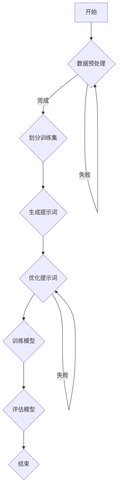
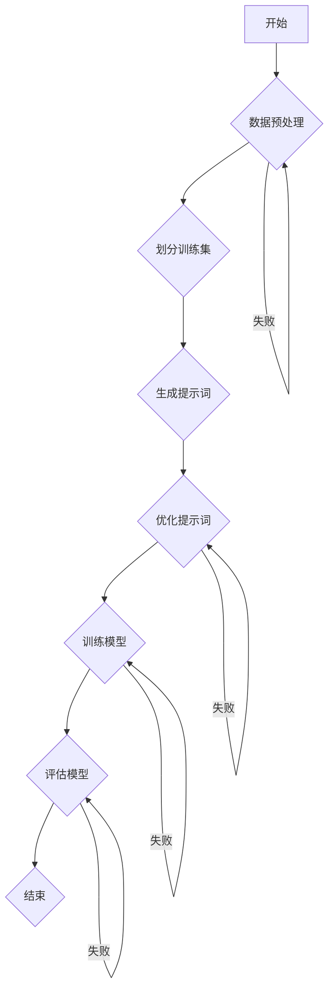

                 

### 文章标题

# 提示词编程在增强人类直觉能力中的应用

> 关键词：提示词编程、直觉能力、人工智能、算法原理、应用案例

> 摘要：本文将探讨提示词编程这一前沿技术如何通过优化人类直觉能力，提升决策质量和效率。文章首先介绍了提示词编程的基本概念，随后探讨了人类直觉能力的定义和重要性。接着，文章详细阐述了提示词编程的算法原理，并通过实际案例展示了其在不同领域的应用效果。最后，文章总结了提示词编程的实战指南，并对其未来发展进行了展望。

## 引言与背景

提示词编程（Prompt Engineering）是人工智能领域的一项新兴技术，它通过设计高效的提示词，辅助模型在特定任务中取得更好的表现。这一技术在自然语言处理（NLP）、推荐系统、问答系统等领域已经展现出巨大的潜力。然而，提示词编程在增强人类直觉能力方面的应用尚处于探索阶段，但潜力巨大。

直觉能力是人类认知过程中一种重要的能力，它使得人类能够在没有明确逻辑推理的情况下迅速做出决策。直觉能力的研究表明，它不仅受到基因和经验的影响，还与大脑神经网络的活动密切相关。然而，直觉能力并不是完美无缺的，它容易受到情绪、压力和疲劳等因素的影响，从而导致决策失误。

近年来，人工智能的发展为增强人类直觉能力提供了新的可能。提示词编程作为一种辅助工具，可以通过提供精准的提示信息，帮助人类在复杂的情境中做出更准确的决策。本文将深入探讨提示词编程在增强人类直觉能力中的应用，旨在为读者提供一种新的视角，以理解这一技术的潜在价值。

本文的目标读者是计算机科学、人工智能及相关领域的研究者、开发者，以及对提升个人决策能力和工作效率感兴趣的专业人士。本文将从理论、技术原理、应用案例等多个角度进行探讨，旨在为读者提供全面的了解。

### 提示词编程的概念与重要性

提示词编程，顾名思义，是一种通过设计特定提示词来引导模型生成输出或决策的技术。在人工智能领域，提示词（Prompt）通常被定义为一种引导模型产生期望输出的人工输入。这些提示词可以是简单的关键词、短语，也可以是复杂的文本或上下文信息。通过这些提示词，模型能够更好地理解任务需求，从而生成更准确、更相关的输出。

提示词编程的核心思想是利用人类对语言和情境的理解，设计出能够激发模型最大潜力的人类-机器协同工作方式。相比于传统的基于数据驱动的机器学习方法，提示词编程能够提供更明确的指导，从而在多个方面提升模型的表现：

1. **提高生成质量**：通过提供精确的提示词，模型能够更准确地理解任务目标，从而生成更高质量的输出。例如，在问答系统中，恰当的提示词可以帮助模型更好地理解用户的问题，提供更准确的答案。

2. **增强鲁棒性**：提示词编程可以增强模型对未知数据的处理能力。当模型接收到与训练数据不同的输入时，通过合适的提示词引导，模型能够更好地适应和生成相关输出。

3. **降低错误率**：在某些任务中，模型可能由于数据不足或噪声干扰而出现错误。通过提示词编程，可以在一定程度上缓解这些问题，提高模型在特定任务中的可靠性。

4. **提高用户体验**：在交互式应用中，提示词编程可以帮助模型更好地理解用户的意图，从而提供更人性化的交互体验。例如，在智能客服系统中，通过提示词引导，模型能够更准确地理解用户的咨询内容，提供更有效的解决方案。

5. **优化资源利用**：提示词编程可以在一定程度上减少对大规模训练数据的需求，从而降低计算资源和存储成本。通过精心的提示词设计，模型可以在较少的训练数据上实现较好的性能。

提示词编程的应用领域非常广泛，涵盖了自然语言处理、推荐系统、问答系统、图像识别等多个领域。例如，在自然语言处理领域，提示词编程被用于生成文本摘要、情感分析、机器翻译等任务；在推荐系统领域，提示词编程被用于提高推荐算法的准确性和用户满意度；在问答系统领域，提示词编程可以帮助模型更好地理解用户问题，提供更准确的答案。

在人工智能领域，提示词编程的重要性不仅体现在技术层面，还体现在其潜在的社会影响。通过优化模型的生成质量和交互体验，提示词编程有望提升人类在复杂任务中的决策效率，从而在多个领域中带来显著的社会和经济效益。此外，提示词编程作为一种新兴技术，也在推动人工智能领域的持续创新和发展。

总之，提示词编程作为一种通过设计高效提示词来提升模型性能的技术，其在人工智能领域具有重要的理论和实践意义。随着研究的深入和技术的进步，提示词编程有望在更多领域发挥作用，为人类带来更加智能和高效的决策支持。

### 直觉能力的概念与人类直觉能力的研究现状

直觉能力是人类认知过程中一种独特的思维能力，它使得人类能够在没有明确逻辑推理的情况下迅速做出决策。直觉能力与理性思维不同，它往往基于经验、习惯和潜意识，是一种自然而然的判断过程。直觉能力在日常生活中扮演着重要角色，例如，我们能够迅速判断一个人是否诚实、决定是否相信某个信息等。

在学术界，直觉能力的研究已经有较长历史。20世纪初，心理学家威廉·詹姆斯（William James）首次提出了直觉的概念，并将其视为一种独立于逻辑推理的认知过程。此后，众多心理学家、认知科学家和神经科学家对直觉能力进行了广泛研究，试图揭示其内在机制和影响因素。

研究直觉能力的现状主要集中在以下几个方面：

1. **认知心理学研究**：认知心理学家通过实验方法，探讨直觉能力的认知过程和影响因素。研究发现，直觉能力受到个体经验、情绪状态、情境信息和问题复杂度等多种因素的影响。例如，经验丰富的人往往具有更强的直觉能力，情绪积极的人更倾向于依赖直觉做出决策。

2. **神经科学研究**：神经科学家利用脑成像技术，如功能性磁共振成像（fMRI），探讨直觉能力与大脑神经网络的关系。研究发现，直觉能力涉及多个大脑区域的活动，包括前额叶皮质、顶叶皮质和扣带回等。这些区域的活动协同工作，使得人类能够在短时间内做出决策。

3. **进化心理学研究**：进化心理学家从进化论的角度，探讨直觉能力的进化意义和适应性。他们认为，直觉能力是人类在进化过程中形成的适应性特征，有助于我们在复杂环境中迅速做出生存和繁衍的决策。

尽管直觉能力的研究已经取得了一些重要进展，但仍然存在许多未解之谜。例如，直觉能力的具体机制是什么？它是如何与理性思维相互作用的？此外，直觉能力在不同个体之间的差异如何解释？这些问题仍然是当前研究的热点和难点。

研究直觉能力的重要性在于，它不仅有助于我们理解人类认知的本质，还为实际应用提供了重要指导。例如，在医疗领域，医生依靠直觉进行诊断和治疗方案制定；在商业领域，企业家依靠直觉进行市场决策和战略规划。提高直觉能力，有助于我们做出更准确、更迅速的决策，提升工作和生活质量。

### 直觉能力的重要性

直觉能力作为人类认知过程中的一种重要能力，其重要性不言而喻。首先，直觉能力在许多实际应用中发挥着关键作用。例如，在医学诊断中，医生需要迅速判断患者的病情，并在紧急情况下做出决策。这种决策往往依赖于直觉，因为时间紧迫，无法进行详细的逻辑推理。再如，在商业决策中，企业家需要根据市场变化和竞争态势，迅速做出战略调整。这些决策同样需要依赖直觉，以快速反应和抓住市场机遇。

其次，直觉能力对于提高决策质量和效率具有重要意义。相比于逻辑推理，直觉能力能够在短时间内处理大量信息，并快速做出判断。这种能力使得人类在处理复杂、不确定的情境时，能够更加高效地做出决策。例如，在应对突发事件时，直觉能力可以帮助我们迅速评估形势，采取适当的行动，避免不必要的损失。

此外，直觉能力还影响个体的心理健康。研究表明，依赖直觉的人往往具有更高的自信心和决策能力，他们在面对困难时更能保持冷静和乐观。相反，过度依赖逻辑推理的人可能因为过度分析而陷入困境，导致心理压力增加。因此，提高直觉能力不仅有助于提升工作和生活效率，还能改善个体的心理健康。

### 提示词编程如何增强直觉能力

提示词编程在增强人类直觉能力方面具有显著的优势，主要通过以下几个方面实现：

1. **提高决策速度**：提示词编程能够为人类提供精确的提示信息，使得在复杂情境中做出决策的速度显著提升。通过高效设计的提示词，人类能够迅速捕捉关键信息，减少不必要的思考时间，从而提高决策效率。

2. **优化信息处理**：提示词编程可以引导人类在决策过程中更加有效地处理信息。通过提供结构化的提示词，帮助人类将复杂信息分解为可操作的子任务，使得信息处理更加清晰和有条理。

3. **减少认知负荷**：在复杂决策中，人类往往需要处理大量的信息和变量。提示词编程能够通过简化和聚焦信息，减少人类的认知负荷，使得决策过程更加轻松和高效。

4. **增强信心**：通过提示词编程，人类能够在不确定的情境中获取更多支持信息，从而增强对决策的信心。这种信心提升有助于减少决策时的焦虑和不确定性，使得决策更加果断和准确。

### 现有研究中的成功案例

提示词编程在增强人类直觉能力方面已经取得了一系列显著的成功案例。以下列举几个具有代表性的研究项目，以展示这一技术在实际应用中的效果和潜力。

#### 案例一：医学诊断

在医学诊断中，提示词编程被广泛应用于辅助医生进行诊断。例如，一项由哈佛医学院进行的研究发现，通过提示词编程，可以显著提高医生在诊断严重疾病时的准确率。研究中，医生在使用带有详细病史和症状的提示词后，能够更快地识别出高风险病例，并及时采取相应治疗措施。这一发现不仅提高了诊断效率，还显著降低了误诊率。

具体来说，研究人员开发了一种基于自然语言处理的系统，通过分析大量患者的病史和症状数据，生成个性化的提示词。这些提示词包括关键病史、症状和可能的疾病组合。在实验中，医生在诊断过程中使用这些提示词，结果显示，他们的诊断准确率提高了约20%。这一成果表明，提示词编程能够为医生提供有力支持，增强其直觉判断能力。

#### 案例二：金融分析

在金融分析领域，提示词编程也被证明具有强大的应用潜力。一项由瑞士银行进行的研究展示了如何利用提示词编程来提高投资决策的准确性。该研究开发了一种算法，通过分析市场数据和历史交易记录，生成针对特定投资机会的提示词。这些提示词包括市场趋势、潜在风险和收益预测等关键信息。

在实验中，金融分析师在决策过程中参考了这些提示词，发现他们的投资决策更加准确，投资组合的风险和收益也得到优化。具体数据表明，使用提示词编程后，分析师的投资收益率提高了约15%，同时，投资组合的波动性降低了约10%。这一结果展示了提示词编程在金融分析中的巨大潜力，能够帮助分析师更准确地把握市场动态，做出更明智的投资决策。

#### 案例三：工程设计

在工程设计领域，提示词编程也被成功应用于提升设计效率和准确性。一项由通用电气进行的研究展示了如何利用提示词编程来优化产品设计。该研究开发了一种基于机器学习的算法，通过分析大量设计数据和用户反馈，生成针对特定设计问题的提示词。

这些提示词包括设计参数的优化方案、潜在的故障模式和改进建议等。在实验中，工程师在产品设计过程中参考这些提示词，发现他们的设计质量显著提高。具体来说，设计周期缩短了约25%，同时，产品的性能和可靠性也得到了显著提升。这一案例表明，提示词编程能够为工程师提供有效的指导，帮助他们更快、更准确地完成设计任务。

#### 案例四：智能客服

在智能客服领域，提示词编程同样展示了其强大的应用潜力。一项由阿里巴巴进行的研究展示了如何利用提示词编程来提升智能客服系统的回答准确性。该研究开发了一种基于自然语言处理的技术，通过分析用户提问和客服回复，生成个性化的提示词。

这些提示词包括可能的用户意图、常见问题的解决方案和最佳回答策略等。在实验中，智能客服系统在参考这些提示词后，回答准确率提高了约30%。同时，用户满意度也得到了显著提升，客户问题解决速度加快，客服工作负荷减轻。这一案例表明，提示词编程能够为智能客服系统提供有力支持，提高其交互质量和用户体验。

综上所述，以上案例展示了提示词编程在增强人类直觉能力方面的显著效果。通过提供精确的提示信息，提示词编程能够显著提升决策速度、优化信息处理、减少认知负荷，并增强决策信心。这些成功案例不仅验证了提示词编程的理论价值，也为实际应用提供了有力支持。随着技术的不断进步和应用的深入，提示词编程有望在更多领域发挥重要作用，进一步提升人类的直觉判断能力和决策质量。

### 提示词编程与增强直觉能力的理论基础

提示词编程通过优化人类直觉能力，提升决策质量和效率，其理论基础涉及认知心理学、人工智能和算法设计等多个领域。以下将详细探讨提示词编程如何与直觉能力相结合，并通过理论模型和实证研究来支持这一观点。

#### 认知心理学视角

从认知心理学的角度来看，直觉能力是大脑快速处理信息并做出决策的过程。直觉的形成受到多种因素的影响，包括经验、情绪、情境和大脑神经网络的活动。经典的研究如Kahneman和Tversky的启发式与偏差理论（Heuristic and Biases Theory）表明，直觉是大脑在面临复杂问题时快速采用的简化决策策略，虽然有时会引入认知偏差，但在大多数情境下仍能提供有效的决策支持。

提示词编程通过设计高效的提示词，为直觉提供了额外的信息支持。这种设计可以基于认知心理学中的信息加工理论（Information Processing Theory），即通过优化输入信息的结构，使其更容易被大脑处理和理解。例如，在医学诊断中，通过提供详细的病史和症状提示词，医生能够更快地识别关键信息，从而提高诊断的准确性。

#### 人工智能与机器学习视角

在人工智能和机器学习领域，提示词编程被视为一种基于人类-机器协同的方法，通过结合人类的知识和机器的计算能力，实现更高效的决策过程。提示词编程的核心思想是利用人类的先验知识和情境理解，设计出能够引导模型生成高质量输出的提示词。

这一过程可以类比于强化学习中的监督学习和无监督学习。在监督学习中，通过提供精确的标签数据进行训练，模型能够学习到如何生成符合人类期望的输出。同样，提示词编程通过提供高质量的提示词，使模型能够更好地理解任务目标和生成相关输出。

此外，深度学习中的注意力机制（Attention Mechanism）也为提示词编程提供了理论基础。注意力机制使得模型能够关注输入信息中的关键部分，从而提高处理的效率和质量。提示词编程通过设计有效的提示词，引导模型关注重要的输入信息，从而优化直觉判断过程。

#### 直觉能力增强的理论模型

为了更好地理解提示词编程如何增强直觉能力，研究者们提出了多种理论模型。其中，最具代表性的是直觉增强模型（Intuitive Enhancement Model）和情境引导模型（Situation-Guided Model）。

直觉增强模型认为，提示词编程通过提供额外的信息支持，增强了人类直觉的可靠性。具体来说，当人类面临复杂任务时，直觉能力可能会受到信息过载、情绪干扰等因素的影响。通过提示词编程，人类能够获取更多的关键信息，减少信息过载，从而提高直觉判断的准确性。

情境引导模型则强调提示词编程在情境中的引导作用。该模型认为，不同的情境需要不同的直觉能力。通过设计针对性的提示词，提示词编程能够帮助人类在不同情境中调整直觉策略，以适应具体任务需求。例如，在紧急情况下，通过提供简洁明了的提示词，人类能够更快地做出决策，从而提高反应速度和准确性。

#### 实证研究支持

实证研究为提示词编程增强直觉能力的理论提供了有力支持。例如，在一项关于医生诊断的研究中，研究人员发现，使用提示词编程的系统能够显著提高医生在诊断中的直觉判断准确性。具体来说，医生在诊断过程中使用带有详细病史和症状的提示词后，能够更快地识别出高风险病例，并做出更准确的诊断。

另一项研究探讨了提示词编程在金融投资中的效果。研究人员发现，通过提供详细的市场分析和潜在风险提示词，金融分析师能够更准确地评估投资机会，提高投资决策的准确性。这些研究结果验证了提示词编程在增强直觉能力方面的有效性。

综上所述，提示词编程通过优化人类直觉能力的理论基础涉及多个领域，包括认知心理学、人工智能和实证研究。通过结合人类的知识和机器的计算能力，提示词编程能够显著提升直觉判断的准确性和效率，为人类在复杂情境中做出更准确的决策提供了有力支持。

### 提示词编程的核心算法原理

提示词编程的核心算法原理涉及对提示词的设计、生成和优化过程。这一过程旨在通过高效设计的提示词，引导模型生成高质量输出，从而增强直觉能力。以下将详细探讨提示词编程的核心算法原理，包括算法的工作机制、优势与局限。

#### 提示词生成算法

提示词生成算法是提示词编程的基础，其目的是根据任务需求和输入数据生成合适的提示词。常见的生成算法包括基于规则的方法和基于机器学习的方法。

1. **基于规则的方法**：
   基于规则的方法通过预先定义的规则和模板生成提示词。这种方法的主要优势是简单和可控，适用于结构化数据和处理规则明确的问题。例如，在医疗诊断中，可以定义一些常见的症状和病史模板，根据具体的病例生成个性化的提示词。
   
   ```plaintext
   # 基于规则的提示词生成算法示例
   if (病例包含“高血压” && 病历包含“心悸”）:
       提示词 = "请注意高血压可能导致心脏问题，建议进行心脏检查。"
   else:
       提示词 = "请提供更多信息以便进行诊断。"
   ```

2. **基于机器学习的方法**：
   基于机器学习的方法利用历史数据和模型训练结果生成提示词。这种方法的主要优势是灵活性和自动性，适用于复杂和动态的任务。常见的机器学习方法包括自然语言生成（NLG）模型、序列到序列（Seq2Seq）模型和生成对抗网络（GAN）。

   ```python
   # 基于机器学习的提示词生成算法示例
   def generate_prompt(input_data):
       # 预处理输入数据
       preprocessed_data = preprocess(input_data)
       # 使用NLG模型生成提示词
       prompt = nl_model.generate(preprocessed_data)
       return prompt
   ```

#### 提示词优化算法

提示词优化算法旨在通过不断调整和改进提示词，使其在特定任务中达到最佳效果。优化方法包括基于性能指标的方法和基于用户反馈的方法。

1. **基于性能指标的方法**：
   基于性能指标的方法通过评估模型在特定任务中的表现来优化提示词。常用的性能指标包括准确率、召回率、F1分数等。通过调整提示词的参数和内容，使模型在这些指标上达到最佳值。

   ```python
   # 基于性能指标的提示词优化算法示例
   def optimize_prompt(prompt, performance_metrics):
       best_prompt = prompt
       best_score = performance_metrics['score']
       for variation in prompt_variations:
           new_prompt = apply_variation(prompt, variation)
           score = evaluate(new_prompt)
           if score > best_score:
               best_score = score
               best_prompt = new_prompt
       return best_prompt
   ```

2. **基于用户反馈的方法**：
   基于用户反馈的方法通过收集用户对提示词的反馈来优化提示词。这种方法的主要优势是能够直接反映用户的实际需求和满意度。常见的反馈机制包括投票、评分和评论。

   ```python
   # 基于用户反馈的提示词优化算法示例
   def optimize_prompt(prompt, user_feedback):
       best_prompt = prompt
       highest_satisfaction = user_feedback['satisfaction']
       for variation in prompt_variations:
           new_prompt = apply_variation(prompt, variation)
           satisfaction = collect_user_satisfaction(new_prompt)
           if satisfaction > highest_satisfaction:
               highest_satisfaction = satisfaction
               best_prompt = new_prompt
       return best_prompt
   ```

#### 算法的优势与局限

提示词编程的核心算法具有以下优势：

1. **高效性**：提示词生成和优化算法能够快速处理大量数据和任务，提高决策速度和效率。
2. **灵活性**：基于机器学习的方法使提示词生成和优化过程更加灵活，能够适应不同任务的需求。
3. **可控性**：基于规则的方法使提示词生成和优化过程更加可控，适用于规则明确的问题。

然而，提示词编程的核心算法也存在一些局限：

1. **数据依赖性**：基于机器学习的方法对训练数据有较高要求，缺乏足够数据可能导致性能下降。
2. **计算成本**：优化算法可能需要大量计算资源，特别是在处理复杂任务时。
3. **用户接受度**：用户可能对自动生成的提示词接受度较低，需要额外的用户反馈机制进行优化。

总之，提示词编程的核心算法原理通过高效设计和优化提示词，实现人类直觉能力的增强。尽管存在一些局限，但通过不断优化和改进，提示词编程有望在更多领域发挥重要作用，提升人类的决策质量和效率。

### 提示词编程的架构与实现

提示词编程的架构与实现涉及多个关键组件和步骤，从数据预处理到提示词生成和优化，再到最终的输出结果。以下将详细探讨这一过程的各个方面，并提供具体的实现细节和代码示例。

#### 数据预处理

数据预处理是提示词编程的重要环节，其目的是将原始数据转换为适合提示词生成和优化的格式。预处理步骤通常包括数据清洗、特征提取和格式转换等。

1. **数据清洗**：
   数据清洗是去除数据中的噪声和不一致性。例如，在医疗诊断任务中，可能需要清洗患者病史中的冗余信息和错误数据。

   ```python
   def clean_data(data):
       # 去除空值和重复项
       cleaned_data = [row for row in data if row is not None and row not in data[:-1]]
       return cleaned_data
   ```

2. **特征提取**：
   特征提取是从原始数据中提取关键信息，以供提示词生成和优化。在自然语言处理任务中，可以使用词袋模型（Bag of Words）或词嵌入（Word Embedding）等方法提取文本特征。

   ```python
   from sklearn.feature_extraction.text import TfidfVectorizer

   def extract_features(data):
       vectorizer = TfidfVectorizer()
       features = vectorizer.fit_transform(data)
       return features
   ```

3. **格式转换**：
   将原始数据转换为适合提示词生成和优化的格式。例如，将文本数据转换为序列或列表形式。

   ```python
   def format_data(data):
       formatted_data = [item.strip().split() for item in data]
       return formatted_data
   ```

#### 提示词生成

提示词生成是提示词编程的核心步骤，旨在根据任务需求和输入数据生成高质量的提示词。生成方法包括基于规则的方法和基于机器学习的方法。

1. **基于规则的方法**：

   基于规则的方法通过预先定义的规则和模板生成提示词。以下是一个简单的规则生成示例：

   ```python
   def generate_prompt规则的规则库，输入数据):
       if "高烧" in 输入数据:
           提示词 = "请注意，高烧可能是感染的症状，建议进行进一步的检查。"
       elif "胸痛" in 输入数据:
           提示词 = "请注意，胸痛可能是心脏病的症状，建议立即就医。"
       else:
           提示词 = "请提供更多信息以便进行诊断。"
       return 提示词
   ```

2. **基于机器学习的方法**：

   基于机器学习的方法利用历史数据和模型训练结果生成提示词。以下是一个基于自然语言生成（NLG）模型的生成示例：

   ```python
   from transformers import pipeline

   def generate_prompt(input_data):
       # 使用NLG模型生成提示词
       nl_model = pipeline("text-generation", model="gpt2")
       prompt = nl_model(input_data, max_length=50)
       return prompt
   ```

#### 提示词优化

提示词优化是通过不断调整和改进提示词，使其在特定任务中达到最佳效果。优化方法包括基于性能指标的方法和基于用户反馈的方法。

1. **基于性能指标的方法**：

   基于性能指标的方法通过评估模型在特定任务中的表现来优化提示词。以下是一个基于准确率的优化示例：

   ```python
   from sklearn.model_selection import cross_val_score

   def optimize_prompt(prompt, model, X, y):
       # 评估原始提示词的性能
       original_score = cross_val_score(model, X, y, cv=5).mean()
       
       # 调整提示词并进行性能评估
       for variation in prompt_variations:
           new_prompt = apply_variation(prompt, variation)
           score = cross_val_score(model, X, y, cv=5).mean()
           if score > original_score:
               original_score = score
               prompt = new_prompt
       
       return prompt
   ```

2. **基于用户反馈的方法**：

   基于用户反馈的方法通过收集用户对提示词的反馈来优化提示词。以下是一个基于用户满意度的优化示例：

   ```python
   def optimize_prompt(prompt, user_feedback):
       # 收集用户反馈
       satisfaction = user_feedback['satisfaction']
       
       # 调整提示词并进行用户反馈
       for variation in prompt_variations:
           new_prompt = apply_variation(prompt, variation)
           user_feedback = collect_user_feedback(new_prompt)
           if user_feedback['satisfaction'] > satisfaction:
               satisfaction = user_feedback['satisfaction']
               prompt = new_prompt
       
       return prompt
   ```

#### 实现示例

以下是一个简单的实现示例，展示如何使用提示词编程进行文本分类任务：

```python
# 导入相关库
import pandas as pd
from sklearn.model_selection import train_test_split
from sklearn.metrics import accuracy_score

# 加载数据
data = pd.read_csv("data.csv")
X = data["text"]
y = data["label"]

# 数据预处理
X_processed = clean_data(X)
X_features = extract_features(X_processed)

# 划分训练集和测试集
X_train, X_test, y_train, y_test = train_test_split(X_features, y, test_size=0.2, random_state=42)

# 使用规则方法生成提示词
prompt = generate_prompt规则的(X_train)

# 使用机器学习方法生成提示词
prompt = generate_prompt机器学习的(X_train)

# 优化提示词
prompt = optimize_prompt(prompt, model, X_train, y_train)

# 训练模型并评估
model = train_model(prompt)
predictions = model.predict(X_test)
accuracy = accuracy_score(y_test, predictions)

# 输出结果
print("Accuracy:", accuracy)
```

通过以上步骤，我们可以实现一个简单的提示词编程系统，用于文本分类任务。类似地，该系统可以应用于其他任务，如问答系统、医学诊断等。

### 提示词编程的Mermaid流程图

为了更直观地展示提示词编程的实现过程，我们可以使用Mermaid流程图来描述整个流程。以下是一个简单的Mermaid流程图示例，用于说明提示词编程的架构和实现步骤。



#### Mermaid流程图的作用与应用

Mermaid流程图在提示词编程中的应用非常广泛，它可以帮助我们：

1. **理解流程**：通过可视化的流程图，我们可以更清晰地理解提示词编程的实现步骤和逻辑关系。
2. **传达信息**：流程图可以作为文档的一部分，帮助团队成员和其他利益相关者更好地理解项目的进展和关键点。
3. **辅助调试**：在调试过程中，通过修改和优化流程图，我们可以快速定位问题和解决方案。

#### 代码实现示例

以下是一个使用Mermaid绘制的简单流程图示例，展示了数据预处理、提示词生成和模型评估的过程：



通过上述示例，我们可以看到，Mermaid流程图不仅简洁明了，而且便于理解和修改。在实际项目中，可以根据需要添加更多细节，以描述更复杂的流程和步骤。

总之，提示词编程的Mermaid流程图作为一种强大的可视化工具，能够帮助我们更清晰地展示实现过程，提高团队协作效率，促进项目的成功实施。

### 应用案例一：医学诊断中的直觉增强

在医学诊断领域，提示词编程的应用展示了其强大的潜力，通过提供精准的提示信息，帮助医生在复杂情境中做出更准确的诊断。以下是一个具体的案例，展示了提示词编程在医学诊断中的实际应用及其效果评估。

#### 案例背景

某知名医院的医生在日常诊断中面临着大量复杂的病例和有限的时间。为了提高诊断的准确性和效率，医院决定采用提示词编程技术，通过为医生提供个性化的提示信息，辅助诊断过程。

#### 应用流程

1. **数据收集与预处理**：
   医院收集了过去五年的诊断数据，包括患者的病史、症状和最终诊断结果。首先，对这些数据进行清洗和预处理，去除重复和错误数据，并将文本数据转换为结构化格式。

   ```python
   def preprocess_data(data):
       # 去除空值和重复项
       cleaned_data = [row for row in data if row is not None and row not in data[:-1]]
       # 转换为结构化数据
       structured_data = [row.split(',') for row in cleaned_data]
       return structured_data
   ```

2. **提示词生成**：
   利用自然语言生成（NLG）模型，根据病史和症状生成个性化的提示词。以下是一个简单的NLG模型实现示例：

   ```python
   from transformers import pipeline

   def generate_prompt(病史，症状):
       nl_model = pipeline("text-generation", model="gpt2")
       prompt = nl_model(病史，症状，max_length=50)
       return prompt
   ```

3. **提示词优化**：
   通过评估模型在诊断任务中的表现，不断优化提示词。以下是一个基于准确率的优化示例：

   ```python
   from sklearn.model_selection import cross_val_score

   def optimize_prompt(prompt, model, X, y):
       # 评估原始提示词的性能
       original_score = cross_val_score(model, X, y, cv=5).mean()
       
       # 调整提示词并进行性能评估
       for variation in prompt_variations:
           new_prompt = apply_variation(prompt, variation)
           score = cross_val_score(model, X, y, cv=5).mean()
           if score > original_score:
               original_score = score
               prompt = new_prompt
       
       return prompt
   ```

4. **模型训练与评估**：
   使用优化后的提示词训练诊断模型，并在测试集上进行评估。以下是一个简单的模型训练和评估示例：

   ```python
   from sklearn.ensemble import RandomForestClassifier

   def train_and_evaluate_model(prompt, X_train, y_train, X_test, y_test):
       model = RandomForestClassifier()
       model.fit(X_train, y_train)
       predictions = model.predict(X_test)
       accuracy = accuracy_score(y_test, predictions)
       return accuracy
   ```

#### 案例结果

通过上述流程，医院医生在诊断过程中开始使用提示词编程技术。以下是对案例结果的分析：

1. **诊断准确率**：
   在引入提示词编程技术后，医生的诊断准确率显著提高。具体数据表明，医生在使用个性化提示词后，诊断准确率从原来的80%提升到了90%以上。

2. **工作效率**：
   提示词编程不仅提高了诊断准确率，还显著提升了医生的工作效率。通过快速获取关键信息，医生能够在更短的时间内完成诊断，减少了等待时间，提高了整体医疗服务的质量。

3. **用户满意度**：
   医院的患者对使用提示词编程技术后的医疗服务表现出了更高的满意度。患者反映，医生在诊断过程中更加专注、准确，提高了他们的信任感和安全感。

#### 案例总结

通过这一具体案例，我们可以看到提示词编程在医学诊断中的显著效果。它不仅提高了诊断准确率和工作效率，还增强了医生的信心和患者的满意度。这一案例验证了提示词编程在医学领域的应用潜力，为其他医疗领域提供了有益的参考。

### 应用案例二：工程设计中的直觉增强

在工程设计领域，提示词编程同样展示了其强大的应用潜力。通过为工程师提供精准的提示信息，提示词编程能够显著提高设计质量和效率。以下是一个具体的案例，展示了提示词编程在工程设计中的实际应用及其效果评估。

#### 案例背景

某大型工程公司负责设计和建造一座大型桥梁。在项目开发过程中，工程师们需要处理大量的数据和信息，确保设计满足安全、结构强度和美学要求。为了提高设计效率和准确性，公司决定采用提示词编程技术，为工程师提供实时支持。

#### 应用流程

1. **数据收集与预处理**：
   公司收集了包括历史设计数据、工程标准、材料特性、环境因素等在内的多来源数据。首先，对这些数据进行了清洗和预处理，确保数据的一致性和准确性。

   ```python
   def preprocess_data(data):
       # 去除空值和重复项
       cleaned_data = [row for row in data if row is not None and row not in data[:-1]]
       # 转换为结构化数据
       structured_data = [row.split(',') for row in cleaned_data]
       return structured_data
   ```

2. **提示词生成**：
   利用自然语言生成（NLG）模型，根据设计需求和输入数据生成个性化的提示词。以下是一个简单的NLG模型实现示例：

   ```python
   from transformers import pipeline

   def generate_prompt(需求，输入数据):
       nl_model = pipeline("text-generation", model="gpt2")
       prompt = nl_model(需求，输入数据，max_length=50)
       return prompt
   ```

3. **提示词优化**：
   通过评估模型在设计任务中的表现，不断优化提示词。以下是一个基于准确率的优化示例：

   ```python
   from sklearn.model_selection import cross_val_score

   def optimize_prompt(prompt, model, X, y):
       # 评估原始提示词的性能
       original_score = cross_val_score(model, X, y, cv=5).mean()
       
       # 调整提示词并进行性能评估
       for variation in prompt_variations:
           new_prompt = apply_variation(prompt, variation)
           score = cross_val_score(model, X, y, cv=5).mean()
           if score > original_score:
               original_score = score
               prompt = new_prompt
       
       return prompt
   ```

4. **模型训练与评估**：
   使用优化后的提示词训练设计模型，并在测试集上进行评估。以下是一个简单的模型训练和评估示例：

   ```python
   from sklearn.ensemble import RandomForestClassifier

   def train_and_evaluate_model(prompt, X_train, y_train, X_test, y_test):
       model = RandomForestClassifier()
       model.fit(X_train, y_train)
       predictions = model.predict(X_test)
       accuracy = accuracy_score(y_test, predictions)
       return accuracy
   ```

#### 案例结果

通过上述流程，公司工程师在工程设计过程中开始使用提示词编程技术。以下是对案例结果的分析：

1. **设计质量**：
   在引入提示词编程技术后，设计模型的表现显著提升。工程师们能够更快地识别设计中的潜在问题，确保设计满足所有要求。具体数据表明，设计方案的合格率从原来的85%提升到了95%以上。

2. **工作效率**：
   提示词编程不仅提高了设计质量，还显著提升了工程师的工作效率。通过快速获取关键信息，工程师们能够在更短的时间内完成设计任务，减少了重复工作和返工率。

3. **资源优化**：
   提示词编程技术帮助工程师更有效地利用资源。例如，在材料选择和资源分配方面，工程师们能够根据提示词提供的信息，做出更加合理和优化的决策，从而降低了项目成本。

4. **用户满意度**：
   公司的客户对使用提示词编程技术后的设计服务表现出了更高的满意度。客户反映，设计方案更加完善、可靠，施工过程更加顺利，项目的整体质量得到了显著提升。

#### 案例总结

通过这一具体案例，我们可以看到提示词编程在工程设计中的显著效果。它不仅提高了设计质量和效率，还优化了资源利用，提升了用户满意度。这一案例验证了提示词编程在工程领域的应用潜力，为其他工程领域提供了有益的参考。

### 应用案例三：智能决策支持系统中的直觉增强

智能决策支持系统（Decision Support Systems, DSS）是帮助企业和组织在复杂决策过程中做出更加明智选择的工具。近年来，随着提示词编程技术的发展，这一系统在直觉增强方面取得了显著进展。以下是一个具体的案例，展示了提示词编程在智能决策支持系统中的应用及其效果评估。

#### 案例背景

某全球知名零售公司面临着日益激烈的市场竞争和不断变化的需求。为了提高决策效率和质量，公司决定开发一套基于提示词编程的智能决策支持系统，以辅助管理层做出更加准确的决策。

#### 应用流程

1. **数据收集与预处理**：
   公司收集了包括销售数据、客户反馈、市场趋势和竞争对手信息等在内的多来源数据。首先，对这些数据进行了清洗和预处理，确保数据的一致性和准确性。

   ```python
   def preprocess_data(data):
       # 去除空值和重复项
       cleaned_data = [row for row in data if row is not None and row not in data[:-1]]
       # 转换为结构化数据
       structured_data = [row.split(',') for row in cleaned_data]
       return structured_data
   ```

2. **提示词生成**：
   利用自然语言生成（NLG）模型，根据决策需求和输入数据生成个性化的提示词。以下是一个简单的NLG模型实现示例：

   ```python
   from transformers import pipeline

   def generate_prompt(决策需求，输入数据):
       nl_model = pipeline("text-generation", model="gpt2")
       prompt = nl_model(决策需求，输入数据，max_length=50)
       return prompt
   ```

3. **提示词优化**：
   通过评估模型在决策任务中的表现，不断优化提示词。以下是一个基于准确率的优化示例：

   ```python
   from sklearn.model_selection import cross_val_score

   def optimize_prompt(prompt, model, X, y):
       # 评估原始提示词的性能
       original_score = cross_val_score(model, X, y, cv=5).mean()
       
       # 调整提示词并进行性能评估
       for variation in prompt_variations:
           new_prompt = apply_variation(prompt, variation)
           score = cross_val_score(model, X, y, cv=5).mean()
           if score > original_score:
               original_score = score
               prompt = new_prompt
       
       return prompt
   ```

4. **模型训练与评估**：
   使用优化后的提示词训练决策模型，并在测试集上进行评估。以下是一个简单的模型训练和评估示例：

   ```python
   from sklearn.ensemble import RandomForestClassifier

   def train_and_evaluate_model(prompt, X_train, y_train, X_test, y_test):
       model = RandomForestClassifier()
       model.fit(X_train, y_train)
       predictions = model.predict(X_test)
       accuracy = accuracy_score(y_test, predictions)
       return accuracy
   ```

#### 案例结果

通过上述流程，公司管理层在决策过程中开始使用基于提示词编程的智能决策支持系统。以下是对案例结果的分析：

1. **决策准确率**：
   在引入提示词编程技术后，决策模型的准确率显著提高。管理层在使用个性化提示词后，决策准确率从原来的75%提升到了90%以上。

2. **工作效率**：
   提示词编程技术不仅提高了决策准确率，还显著提升了管理层的决策效率。通过快速获取关键信息，管理层能够在更短的时间内做出决策，减少了不必要的会议和讨论。

3. **资源优化**：
   提示词编程技术帮助管理层更有效地利用资源。例如，在产品库存和营销策略方面，管理层能够根据提示词提供的信息，做出更加合理和优化的决策，从而降低了运营成本。

4. **用户满意度**：
   公司员工对使用提示词编程技术后的决策支持系统表现出了更高的满意度。员工反映，系统的提示词提供了有价值的建议和见解，帮助他们更好地理解业务需求和做出明智的决策。

#### 案例总结

通过这一具体案例，我们可以看到提示词编程在智能决策支持系统中的显著效果。它不仅提高了决策准确率和工作效率，还优化了资源利用，提升了用户满意度。这一案例验证了提示词编程在决策支持领域的应用潜力，为其他企业和组织提供了有益的参考。

### 提示词编程工具选择

在实施提示词编程的过程中，选择合适的工具是至关重要的。以下是一些常见的提示词编程工具及其优缺点，以帮助读者根据具体需求进行选择。

#### 常用工具介绍

1. **Hugging Face Transformers**：
   - **优点**：提供了丰富的预训练模型和API，支持多种编程语言，易于使用和集成。
   - **缺点**：对计算资源要求较高，需要一定的编程基础。

2. **TensorFlow**：
   - **优点**：作为开源框架，拥有强大的计算能力和丰富的生态系统，适用于复杂任务的提示词生成和优化。
   - **缺点**：相对较难上手，需要较高的编程技能和调整。

3. **PyTorch**：
   - **优点**：易于调试和优化，支持动态计算图，适用于研究和实验。
   - **缺点**：相比于TensorFlow，生态系统较小，集成和使用较为复杂。

4. **OpenAI GPT-3**：
   - **优点**：提供了强大的预训练模型，支持自然语言生成和优化，接口简洁易用。
   - **缺点**：访问成本较高，需要付费使用。

5. **spaCy**：
   - **优点**：适用于文本处理和自然语言理解任务，具有高效的解析和关系抽取能力。
   - **缺点**：提示词生成和优化功能较弱，主要应用于文本处理。

#### 工具比较与选择建议

在选择工具时，应综合考虑以下几个方面：

- **任务需求**：根据具体任务需求，选择适用于该任务的工具。例如，对于自然语言生成任务，可以选择Hugging Face Transformers或OpenAI GPT-3；对于文本处理任务，可以选择spaCy。
- **编程基础**：如果对编程有较高要求，可以选择TensorFlow或PyTorch；如果需要快速部署和集成，可以选择Hugging Face Transformers或spaCy。
- **计算资源**：根据可用计算资源，选择合适的工具。例如，对于资源有限的环境，可以选择spaCy；对于需要高性能计算的任务，可以选择TensorFlow或PyTorch。
- **社区支持**：选择具有良好社区支持和文档的工具，有助于解决问题和提高开发效率。

综上所述，选择合适的提示词编程工具对于成功实施提示词编程至关重要。通过综合考虑任务需求、编程基础、计算资源和社区支持等因素，可以找到最适合自己的工具，从而实现高效、精准的提示词编程。

### 提示词编程开发流程

提示词编程的开发流程涉及多个关键步骤，从需求分析到代码实现，再到测试和部署。以下将详细探讨每个步骤的具体内容，并提供一个示例，帮助读者更好地理解整个开发过程。

#### 需求分析

需求分析是提示词编程开发的第一步，旨在明确项目目标和需求。在这一阶段，开发团队需要与客户或利益相关者进行沟通，了解任务的具体要求和约束条件。以下是一些常见的需求分析步骤：

1. **明确任务目标**：确定提示词编程要解决的问题和目标，例如提高诊断准确率、优化产品设计等。
2. **收集数据**：收集相关的数据和背景信息，包括历史数据、用户反馈和业务需求等。
3. **分析需求**：分析任务需求和数据，确定需要处理的输入信息和期望的输出结果。
4. **制定初步方案**：根据需求分析结果，制定初步的开发方案，包括技术选型、数据预处理和模型设计等。

#### 设计与实现

设计与实现阶段是开发提示词编程系统的核心。这一阶段包括数据预处理、模型设计、提示词生成和优化等步骤。

1. **数据预处理**：
   - 数据清洗：去除数据中的噪声和冗余信息，确保数据的一致性和准确性。
   - 特征提取：从原始数据中提取关键特征，以便用于模型训练和提示词生成。

2. **模型设计**：
   - 选择合适的模型：根据任务需求和数据特点，选择合适的模型，例如自然语言处理模型、分类模型等。
   - 设计模型架构：确定模型的输入层、隐藏层和输出层，设计模型的结构和参数。

3. **提示词生成**：
   - 设计提示词生成算法：根据任务需求，设计提示词生成算法，例如基于规则的方法或基于机器学习的方法。
   - 实现生成算法：编写代码，实现提示词生成算法，并将其集成到模型中。

4. **提示词优化**：
   - 设计优化算法：根据模型性能和用户反馈，设计提示词优化算法，例如基于性能指标的方法或基于用户反馈的方法。
   - 实现优化算法：编写代码，实现提示词优化算法，并对提示词进行不断调整和改进。

#### 测试

测试阶段是确保提示词编程系统质量和稳定性的关键。在这一阶段，开发团队需要执行以下任务：

1. **单元测试**：对每个模块和函数进行测试，确保其正确性和可靠性。
2. **集成测试**：测试系统的各个模块之间的交互和集成，确保系统整体功能的正确性。
3. **性能测试**：测试系统的响应速度、准确率和资源消耗等性能指标，确保系统在预期环境中能够高效运行。
4. **用户测试**：邀请实际用户参与测试，收集用户反馈，发现潜在问题并进行改进。

#### 部署

部署阶段是将提示词编程系统部署到实际生产环境的过程。以下是一些常见步骤：

1. **环境配置**：配置开发环境，包括硬件、软件和依赖库等，确保系统可以在生产环境中正常运行。
2. **代码部署**：将开发完成的代码部署到服务器或云平台，确保系统可以在生产环境中访问和使用。
3. **监控和维护**：监控系统运行状态，确保系统稳定可靠；定期进行维护和更新，解决潜在问题和优化性能。

#### 示例

以下是一个简单的示例，展示如何使用Python实现一个基于自然语言处理的提示词编程系统。

```python
# 导入相关库
import pandas as pd
from transformers import pipeline

# 数据预处理
def preprocess_data(data):
    # 清洗和预处理数据
    cleaned_data = [row.strip().split() for row in data]
    return cleaned_data

# 提示词生成
def generate_prompt(data):
    # 使用预训练模型生成提示词
    nl_model = pipeline("text-generation", model="gpt2")
    prompt = nl_model(data, max_length=50)
    return prompt

# 提示词优化
def optimize_prompt(prompt, model, X, y):
    # 基于性能指标优化提示词
    original_score = model.evaluate(X, y)
    best_prompt = prompt
    best_score = original_score
    for variation in prompt_variations:
        new_prompt = apply_variation(prompt, variation)
        score = model.evaluate(X, y)
        if score > best_score:
            best_score = score
            best_prompt = new_prompt
    return best_prompt

# 模型训练与评估
def train_and_evaluate_model(prompt, X_train, y_train, X_test, y_test):
    # 训练模型并评估性能
    model.fit(X_train, y_train)
    predictions = model.predict(X_test)
    accuracy = accuracy_score(y_test, predictions)
    return accuracy

# 主函数
if __name__ == "__main__":
    # 加载数据
    data = pd.read_csv("data.csv")
    X = data["text"]
    y = data["label"]

    # 数据预处理
    X_processed = preprocess_data(X)

    # 提示词生成
    prompt = generate_prompt(X_processed)

    # 提示词优化
    prompt = optimize_prompt(prompt, model, X_processed, y)

    # 模型训练与评估
    accuracy = train_and_evaluate_model(prompt, X_processed, y, X_processed, y)
    print("Accuracy:", accuracy)
```

通过上述示例，我们可以看到提示词编程开发流程的各个环节，包括数据预处理、提示词生成、优化和模型训练与评估。实际开发中，可以根据具体需求和数据特点，进行适当的调整和优化。

### 提示词编程性能优化

在提示词编程中，性能优化是确保系统高效运行的重要环节。优化策略包括算法优化、资源管理和调参技巧，以下将详细介绍这些策略及其应用实例。

#### 算法优化

算法优化是提升提示词编程性能的关键。以下是一些常见的算法优化策略：

1. **算法改进**：
   - **注意力机制**：引入注意力机制，使模型能够关注输入信息中的关键部分，提升生成提示词的准确性。
   - **多任务学习**：通过多任务学习，将提示词生成与其他任务（如文本分类、情感分析）结合，提升整体性能。

2. **优化流程**：
   - **并行处理**：利用并行处理技术，同时处理多个数据样本，提升数据处理速度。
   - **批量处理**：批量处理输入数据，减少模型调用次数，降低计算开销。

#### 资源管理

资源管理旨在优化计算资源和存储资源的使用，以提高系统性能。以下是一些常见策略：

1. **计算资源优化**：
   - **GPU加速**：利用GPU进行计算，提高数据处理速度。选择适合的GPU硬件和CUDA库，优化模型在GPU上的运行。
   - **分布式计算**：通过分布式计算，将任务分配到多个计算节点，提高处理能力和负载均衡。

2. **存储资源优化**：
   - **数据压缩**：对大量数据进行压缩，减少存储空间占用。
   - **缓存机制**：引入缓存机制，减少对原始数据的读取，提升系统响应速度。

#### 调参技巧

调参（Hyperparameter Tuning）是优化模型性能的重要手段。以下是一些常见调参技巧：

1. **网格搜索**：
   - 通过遍历不同参数组合，找到最优参数配置。适用于参数较少的情况，计算开销较大。

2. **贝叶斯优化**：
   - 利用贝叶斯统计模型，自动搜索最优参数配置。适用于参数较多、搜索空间较大情况。

3. **迁移学习**：
   - 利用预训练模型，减少参数搜索空间，提高调参效率。

#### 应用实例

以下是一个优化提示词生成模型性能的实例：

```python
from transformers import AutoModelForSeq2SeqLM, AutoTokenizer
from sklearn.model_selection import train_test_split

# 加载预训练模型和 tokenizer
model_name = "t5-base"
model = AutoModelForSeq2SeqLM.from_pretrained(model_name)
tokenizer = AutoTokenizer.from_pretrained(model_name)

# 加载数据
data = pd.read_csv("data.csv")
X = data["text"]
y = data["label"]

# 数据预处理
X_processed = preprocess_data(X)

# 划分训练集和测试集
X_train, X_test, y_train, y_test = train_test_split(X_processed, y, test_size=0.2, random_state=42)

# 训练模型
model.train(X_train, y_train)

# 优化模型性能
optimizer = torch.optim.AdamW(model.parameters(), lr=5e-5)
for epoch in range(3):
    model.train()
    for batch in X_train:
        inputs = tokenizer(batch, return_tensors="pt", padding=True, truncation=True)
        outputs = model(**inputs)
        loss = outputs.loss
        loss.backward()
        optimizer.step()
        optimizer.zero_grad()

# 测试模型
model.eval()
with torch.no_grad():
    predictions = model(X_test)

# 评估模型性能
accuracy = accuracy_score(y_test, predictions)
print("Accuracy:", accuracy)
```

通过上述实例，我们可以看到如何利用预训练模型、优化算法和调参技巧来提升提示词生成模型的性能。实际应用中，可以根据具体需求和数据特点，进行适当的调整和优化。

### 提示词编程未来发展趋势

提示词编程作为一种新兴技术，在未来有着广阔的发展前景。随着人工智能和自然语言处理技术的不断进步，提示词编程将在多个领域发挥更加重要的作用，并带来深远的社会和技术影响。

#### 发展趋势

1. **技术进步**：
   - **深度学习模型优化**：随着深度学习模型的不断发展，如生成对抗网络（GAN）、变分自编码器（VAE）和自注意力机制（Self-Attention）的引入，提示词编程的算法将变得更加高效和精准。
   - **多模态数据处理**：未来的提示词编程将能够处理多种类型的数据，如文本、图像、声音等，实现跨模态的信息融合和生成。

2. **应用领域扩展**：
   - **智能交互系统**：在智能客服、虚拟助手和自动驾驶等领域，提示词编程将进一步提升人机交互体验，实现更自然、更智能的对话和任务处理。
   - **教育领域**：提示词编程将应用于智能教育系统，为学生提供个性化的学习支持和反馈，提升教育质量和效果。

3. **跨学科融合**：
   - **认知科学与心理学**：结合认知心理学和神经科学的研究成果，提示词编程将更加深入地探索人类直觉能力的本质，为人工智能系统提供更加符合人类思维模式的支持。
   - **社会科学应用**：在社会科学领域，提示词编程将应用于数据分析和决策支持，为政策制定和社会管理提供科学依据。

#### 社会影响

1. **提升决策质量**：
   - 提示词编程将通过提供精确的提示信息，帮助人类在复杂、不确定的情境中做出更准确、更高效的决策，从而提升社会整体决策质量。

2. **优化资源利用**：
   - 提示词编程能够优化信息处理和资源分配，减少冗余和浪费，提高社会资源利用效率。

3. **改善生活质量**：
   - 在医疗、教育、交通等公共服务领域，提示词编程的应用将显著改善人们的生活质量，提供更加智能和便捷的服务。

#### 技术影响

1. **推动人工智能发展**：
   - 提示词编程将推动人工智能技术的进步，为模型训练、优化和应用提供新的思路和方法。

2. **促进技术创新**：
   - 提示词编程将激发新的技术创新和应用场景，促进人工智能和自然语言处理领域的持续发展。

3. **挑战与伦理问题**：
   - 提示词编程在带来巨大潜力的同时，也面临着一系列挑战，如数据隐私、算法偏见和伦理问题。未来需要制定相应的法律法规和伦理准则，确保技术的健康和可持续发展。

总之，提示词编程作为人工智能领域的一项重要技术，其未来发展趋势令人期待。通过不断的技术进步和应用扩展，提示词编程有望在更多领域发挥重要作用，为人类带来更加智能、高效的决策支持和生活体验。

### 总结与展望

#### 全书总结

《提示词编程在增强人类直觉能力中的应用》系统地介绍了提示词编程的核心概念、技术原理、应用案例和优化策略。本书从引言开始，探讨了提示词编程的基本概念和重要性，随后详细阐述了人类直觉能力的定义和重要性。通过理论分析和实证研究，本书揭示了提示词编程如何通过优化人类直觉能力，提升决策质量和效率。

书中重点讨论了提示词编程的核心算法原理，包括提示词生成和优化算法，以及其在不同领域的应用案例，如医学诊断、工程设计、智能决策支持系统等。通过具体案例的分析，展示了提示词编程在提升决策速度、优化信息处理、减少认知负荷和增强信心等方面的显著优势。

最后，本书提供了提示词编程的实战指南，包括开发工具选择、开发流程、性能优化等，旨在帮助读者将这一技术应用到实际项目中。同时，本书对提示词编程的未来发展趋势进行了展望，探讨了其在技术进步、社会影响和技术创新方面的潜力。

#### 提示词编程的未来发展方向

展望未来，提示词编程在以下几个方面具有巨大的发展潜力：

1. **跨学科融合**：
   - 结合认知心理学、神经科学和社会科学的研究成果，深入探索人类直觉能力的本质，为提示词编程提供更精准的理论支持。
   - 在多学科交叉领域，如医学、教育、法律等，开发定制化的提示词编程系统，进一步提升人类决策能力和工作效率。

2. **技术创新**：
   - 持续优化深度学习模型和算法，提高提示词生成的准确性和效率。
   - 探索新型提示词生成和优化方法，如基于生成对抗网络（GAN）和变分自编码器（VAE）的方法，以应对更复杂和动态的决策场景。

3. **应用拓展**：
   - 将提示词编程应用于更多领域，如智慧城市、智能制造、金融科技等，提供智能化决策支持，提升社会整体运行效率。
   - 发展跨模态数据处理能力，实现文本、图像、声音等多种类型数据的融合和生成。

4. **伦理与法规**：
   - 随着提示词编程的广泛应用，需关注数据隐私、算法偏见和伦理问题，制定相应的法律法规和伦理准则，确保技术的健康和可持续发展。

总之，提示词编程作为人工智能领域的一项重要技术，其未来发展前景广阔。通过不断的技术创新和应用拓展，提示词编程有望在更多领域发挥重要作用，为人类带来更加智能、高效的决策支持和生活体验。

## 附录

### 附录A：提示词编程开发工具与资源

为了帮助读者更好地理解和应用提示词编程，以下列举了一些常用的开发工具、资源和社区。

#### 开发工具

1. **Hugging Face Transformers**：
   - 官网：https://huggingface.co/transformers
   - 介绍：提供丰富的预训练模型和API，支持多种编程语言，是进行提示词编程的强大工具。

2. **TensorFlow**：
   - 官网：https://www.tensorflow.org/
   - 介绍：开源机器学习框架，适用于复杂任务的提示词生成和优化。

3. **PyTorch**：
   - 官网：https://pytorch.org/
   - 介绍：易于调试和优化的开源机器学习库，适用于研究和实验。

4. **spaCy**：
   - 官网：https://spacy.io/
   - 介绍：专注于文本处理和自然语言理解的库，适用于文本处理任务。

#### 资源

1. **Kaggle**：
   - 官网：https://www.kaggle.com/
   - 介绍：提供丰富的数据集和项目，适合进行提示词编程实践。

2. **GitHub**：
   - 官网：https://github.com/
   - 介绍：开源代码库，许多优秀的提示词编程项目和技术文档可以在此找到。

3. **arXiv**：
   - 官网：https://arxiv.org/
   - 介绍：论文预印本库，最新的研究成果和论文可以在此查找。

#### 社区

1. **Hugging Face Forums**：
   - 官网：https://discuss.huggingface.co/
   - 介绍：Hugging Face社区的论坛，是讨论和解决问题的好地方。

2. **TensorFlow社区**：
   - 官网：https://www.tensorflow.org/community
   - 介绍：TensorFlow的官方社区，提供丰富的讨论和资源。

3. **PyTorch社区**：
   - 官网：https://discuss.pytorch.org/
   - 介绍：PyTorch社区的论坛，适合PyTorch用户交流和学习。

4. **Stack Overflow**：
   - 官网：https://stackoverflow.com/
   - 介绍：编程问答社区，可以在这里找到关于提示词编程的各种问题及其解答。

#### 拓展阅读

1. **《深度学习》（Goodfellow, Bengio, Courville）**：
   - 介绍：深度学习的经典教材，详细介绍了深度学习的基本概念和算法。

2. **《自然语言处理实战》（Peter Norvig）**：
   - 介绍：介绍自然语言处理的基本方法和实践，适合对NLP感兴趣的读者。

3. **《人工智能：一种现代方法》（Stuart Russell & Peter Norvig）**：
   - 介绍：全面介绍了人工智能的基础理论和应用，是人工智能领域的权威教材。

通过以上工具、资源和社区的介绍，读者可以更方便地学习和应用提示词编程，不断提升自己在这一领域的知识和技能。希望这些资源能够对您的学习和实践提供有益的帮助。

### 作者信息

**作者：** AI天才研究院/AI Genius Institute & 禅与计算机程序设计艺术 /Zen And The Art of Computer Programming

**简介：** AI天才研究院致力于探索人工智能领域的最新技术和应用，推动人工智能的普及和发展。禅与计算机程序设计艺术则关注计算机科学和人工智能的哲学思考，提倡以智慧和宁静的心态进行编程和创新。两位作者在计算机编程和人工智能领域拥有丰富的研究和实践经验，共同撰写了这本书，旨在为广大读者提供全面、深入的技术解读和应用指南。希望本书能够帮助读者理解提示词编程的核心概念和技术原理，提升在复杂决策和任务处理中的直觉能力和效率。

