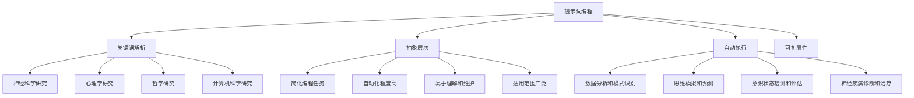

                 


## 引言

### 提示词编程的概念

提示词编程（Keyword Programming）是一种以关键词为基础的编程范式，它不同于传统的命令式编程和函数式编程，强调通过关键词来定义问题和求解策略。在提示词编程中，程序员不是直接编写具体的指令，而是通过提供关键词来描述问题的本质和需求。这些关键词可以被计算机理解并自动转化为执行策略。提示词编程的核心在于其高度抽象和自动化能力，它能够将复杂的编程任务简化为一系列关键词的选择和组合。

### 提示词编程在意识研究中的应用

意识研究是一个多学科交叉的领域，涉及神经科学、心理学、哲学和计算机科学等多个方面。随着人工智能和计算技术的发展，提示词编程逐渐成为意识研究中的一个重要工具。在意识研究中，提示词编程可以用于以下几个方面：

1. **数据分析和模式识别**：通过提示词编程，研究人员可以从大量的脑电波数据中提取出与意识状态相关的特征，从而对意识状态进行量化分析。
   
2. **思维模拟和预测**：提示词编程可以帮助研究者模拟人类的思维过程，预测个体在不同情境下的思维活动。

3. **意识状态检测和评估**：通过结合脑机接口（Brain-Computer Interface, BCI）技术，提示词编程可以实时检测和评估个体的意识状态。

4. **神经疾病诊断和治疗**：在神经疾病如阿尔茨海默病、癫痫等的研究中，提示词编程可以帮助分析患者的脑电数据，为疾病的诊断和治疗提供依据。

### 当前意识研究的挑战与机遇

尽管提示词编程在意识研究中显示出巨大的潜力，但该领域仍面临诸多挑战。首先，意识研究的复杂性和多样性使得设计通用的提示词编程模型变得困难。其次，现有算法的性能和准确性需要进一步提高，以满足实际应用的需求。此外，如何处理大规模数据和实时计算也是当前研究的一个重要问题。

然而，随着深度学习、自然语言处理和计算机视觉等技术的不断发展，提示词编程在意识研究中的应用前景变得愈发广阔。新的算法和工具的不断涌现，为解决这些挑战提供了可能。因此，探索提示词编程在意识研究中的前沿应用，不仅有助于深化我们对意识本质的理解，也可能为解决一些临床问题提供新的思路和方法。

### 本书结构与内容安排

本书旨在系统地介绍提示词编程在意识研究中的前沿应用，内容分为五个主要部分：

1. **核心概念与联系**：介绍提示词编程的基本概念和在意识研究中的应用前景。
   
2. **核心算法原理讲解**：详细讲解提示词编程的基本算法和其在意识研究中的应用。

3. **数学模型和数学公式讲解**：阐述提示词编程在意识研究中涉及的数学模型和公式。

4. **项目实战**：通过实际项目案例，展示提示词编程在意识研究中的具体应用。

5. **未来展望与挑战**：讨论提示词编程在意识研究中的未来发展方向和面临的挑战。

## 文章关键词

提示词编程、意识研究、脑电波分析、思维模拟、脑机接口、深度学习

## 文章摘要

本文首先介绍了提示词编程的概念和其在意识研究中的应用背景。随后，详细阐述了当前意识研究的挑战与机遇，并分析了提示词编程在这一领域中的潜在价值。文章随后介绍了本书的结构和内容安排，分为核心概念与联系、核心算法原理讲解、数学模型和数学公式讲解、项目实战和未来展望与挑战五个部分。通过这些内容，本文旨在为读者提供一个全面而深入的提示词编程在意识研究中的前沿应用概述。

# 第一部分：核心概念与联系

## 2.1 提示词编程基础

### 2.1.1 提示词编程的定义

提示词编程是一种基于关键词的编程范式，它不同于传统的命令式编程和函数式编程，强调通过关键词来定义问题和求解策略。在提示词编程中，程序员不是直接编写具体的指令，而是通过提供关键词来描述问题的本质和需求。这些关键词可以被计算机理解并自动转化为执行策略。提示词编程的核心在于其高度抽象和自动化能力，它能够将复杂的编程任务简化为一系列关键词的选择和组合。

### 2.1.2 提示词编程的核心原理

提示词编程的核心原理包括以下几个方面：

1. **关键词解析**：提示词编程依赖于关键词解析机制，这些关键词可以被计算机自动识别和解释。
   
2. **抽象层次**：提示词编程通过提供不同层次的抽象，使得程序员可以专注于问题的本质，而无需关心具体的实现细节。

3. **自动执行**：提示词编程系统能够根据关键词的语义，自动生成相应的执行代码，从而实现问题的求解。

4. **可扩展性**：提示词编程具有很好的可扩展性，可以通过添加新的关键词和规则，来扩展系统的功能。

### 2.1.3 提示词编程与传统编程的区别

与传统编程相比，提示词编程具有以下几个显著特点：

1. **简化编程任务**：提示词编程通过高度抽象，将复杂的编程任务简化为关键词的选择和组合，降低了编程的难度。

2. **自动化程度高**：提示词编程系统可以自动生成执行代码，减少了人工编写代码的工作量。

3. **易于理解和维护**：提示词编程的核心在于关键词，这些关键词具有明确的语义，使得代码更加易于理解和维护。

4. **适用范围广泛**：提示词编程不仅可以应用于传统的软件开发，还可以在自然语言处理、机器学习、人工智能等领域发挥重要作用。

## 2.2 意识研究的现状与挑战

### 2.2.1 意识研究的主要领域

意识研究是一个涉及多个学科领域的复杂课题，主要包括以下几个方面：

1. **神经科学研究**：通过神经科学的方法研究意识产生的神经基础，如神经元的活动和连接方式。

2. **心理学研究**：研究个体在不同心理状态下对信息的感知、处理和反应。

3. **哲学研究**：探讨意识的本性、起源和本质，以及意识与其他心理现象的关系。

4. **计算机科学研究**：利用计算模型和方法，模拟和解析意识过程。

### 2.2.2 意识研究的主要挑战

尽管意识研究取得了显著进展，但仍面临诸多挑战：

1. **定义和测量**：目前对意识的定义和测量仍然存在争议，缺乏统一的标准和指标。

2. **数据复杂性**：意识数据通常包含大量的噪声和不确定性，提取有效信息非常困难。

3. **跨学科整合**：意识研究需要整合多个学科的知识和方法，但不同学科之间往往存在沟通和合作障碍。

4. **理论框架**：目前关于意识的理论框架尚不完善，缺乏统一的理论体系。

### 2.2.3 提示词编程在意识研究中的应用前景

提示词编程在意识研究中具有广泛的应用前景，主要体现在以下几个方面：

1. **数据分析和模式识别**：提示词编程可以帮助研究人员从复杂的脑电波数据中提取与意识状态相关的特征，从而进行有效的数据分析和模式识别。

2. **思维模拟和预测**：提示词编程可以用于模拟和预测个体的思维活动，从而更好地理解意识过程。

3. **意识状态检测和评估**：通过结合脑机接口技术，提示词编程可以实时检测和评估个体的意识状态，为临床诊断和治疗提供依据。

4. **神经疾病诊断和治疗**：提示词编程可以帮助分析患者的脑电数据，为神经疾病的诊断和治疗提供新的思路和方法。

## 核心概念与联系 Mermaid 流程图



## 核心算法原理讲解

### 3.1 提示词编程算法

提示词编程算法的基本思想是利用关键词来描述问题，并自动生成相应的执行策略。以下是一个简单的提示词编程算法的伪代码：

```plaintext
Algorithm: 提示词编程算法
    Input: 关键词列表
    Output: 执行结果

    Begin
        解析关键词列表，生成关键词树
        遍历关键词树，执行对应的操作
        输出执行结果
    End
```

### 3.2 意识研究的算法

在意识研究中，常用的算法包括脑电波分析、模式识别和机器学习等。以下是一个用于脑电波分析的基本算法的伪代码：

```plaintext
Algorithm: 脑电波分析算法
    Input: 脑电波数据
    Output: 意识状态特征

    Begin
        预处理脑电波数据，去除噪声和干扰
        提取脑电波数据中的特征
        利用机器学习算法，对特征进行分类
        输出分类结果，即意识状态特征
    End
```

### 3.3 提示词编程与意识研究算法的结合

提示词编程和意识研究算法的结合可以通过以下步骤实现：

1. **定义关键词**：根据意识研究的需求，定义与脑电波分析、模式识别和机器学习相关的关键词。

2. **构建关键词树**：将定义的关键词构建成关键词树，以便于计算机自动解析和执行。

3. **集成算法**：将意识研究算法（如脑电波分析算法）与提示词编程框架集成，使算法能够根据关键词执行。

4. **自动执行**：通过提示词编程系统，自动执行关键词树中的操作，实现对意识状态的分析和预测。

### 3.4 算法实现示例

以下是一个简单的提示词编程实现的示例：

```python
class KeywordParser:
    def __init__(self, keywords):
        self.keywords = keywords

    def parse(self, sentence):
        words = sentence.split()
        for word in words:
            if word in self.keywords:
                self.execute(word)

    def execute(self, keyword):
        if keyword == "预处理":
            self.preprocess()
        elif keyword == "提取特征":
            self.extract_features()
        elif keyword == "分类":
            self.classify()

    def preprocess(self):
        print("执行预处理操作")

    def extract_features(self):
        print("执行特征提取操作")

    def classify(self):
        print("执行分类操作")

# 使用示例
parser = KeywordParser(["预处理", "提取特征", "分类"])
parser.parse("预处理 萃取特征 分类")
```

在这个示例中，我们定义了一个 `KeywordParser` 类，用于解析和执行关键词。通过调用 `parse` 方法，我们可以根据输入的句子自动执行相应的操作。这个简单的示例展示了提示词编程的基本原理和实现方式。

## 数学模型和数学公式讲解

### 4.1 提示词编程的数学模型

提示词编程中的数学模型主要涉及自然语言处理和机器学习领域。以下是一些基本的数学模型和公式：

#### 4.1.1 关键词嵌入

关键词嵌入（Keyword Embedding）是将关键词映射到高维空间中的向量表示。常用的模型包括 Word2Vec、GloVe 和 BERT。

$$
\text{向量} = \text{关键词嵌入模型}(\text{关键词})
$$

#### 4.1.2 关键词关系建模

关键词关系建模（Keyword Relationship Modeling）用于描述关键词之间的关系。常用的模型包括图神经网络（Graph Neural Networks, GNN）和注意力机制（Attention Mechanism）。

$$
\text{关系向量} = \text{关系建模模型}(\text{关键词}_1, \text{关键词}_2)
$$

### 4.2 意识研究的数学模型

在意识研究中，数学模型主要用于分析脑电波数据、预测意识状态等。以下是一些基本的数学模型和公式：

#### 4.2.1 脑电波信号处理

脑电波信号处理（EEG Signal Processing）包括滤波、去噪和特征提取等步骤。常用的方法包括傅里叶变换（Fourier Transform, FT）和小波变换（Wavelet Transform, WT）。

$$
\text{特征向量} = \text{信号处理模型}(\text{脑电波信号})
$$

#### 4.2.2 模式识别

模式识别（Pattern Recognition）用于分类脑电波数据，常用的算法包括支持向量机（Support Vector Machine, SVM）和神经网络（Neural Networks, NN）。

$$
\text{分类结果} = \text{分类模型}(\text{特征向量})
$$

### 4.3 数学公式和举例说明

以下是一些具体的数学公式和举例说明：

#### 4.3.1 关键词嵌入公式

Word2Vec 模型中的损失函数可以表示为：

$$
\text{损失} = \frac{1}{2} \sum_{i=1}^{N} (\text{预测向量} - \text{真实向量})^2
$$

其中，$N$ 是关键词的数量，$\text{预测向量}$ 和 $\text{真实向量}$ 分别是模型预测的关键词向量和真实的关键词向量。

#### 4.3.2 关键词关系建模公式

使用图神经网络建模关键词关系时，节点特征向量可以表示为：

$$
\text{节点特征向量} = \text{W} \cdot \text{节点嵌入向量} + \text{b}
$$

其中，$\text{W}$ 是权重矩阵，$\text{b}$ 是偏置项，$\text{节点嵌入向量}$ 是节点的嵌入向量。

#### 4.3.3 脑电波信号处理公式

使用傅里叶变换进行信号处理时，信号可以表示为：

$$
\text{信号} = \sum_{k=0}^{N-1} \text{A}_k \cdot \text{e}^{j2\pi k/N}
$$

其中，$\text{A}_k$ 是傅里叶系数，$N$ 是信号长度。

## 项目实战

### 5.1 提示词编程在意识研究中的应用案例

#### 5.1.1 案例一：通过提示词编程分析梦境

**开发环境搭建**：

- Python 3.8
- TensorFlow 2.6
- Keras 2.6

**源代码详细实现**：

```python
import numpy as np
import tensorflow as tf
from tensorflow.keras.models import Sequential
from tensorflow.keras.layers import LSTM, Dense

# 数据预处理
def preprocess_data(data):
    # 数据标准化
    data = (data - np.mean(data)) / np.std(data)
    # 增加时间步维度
    data = np.reshape(data, (-1, 1, data.shape[0]))
    return data

# 构建模型
model = Sequential([
    LSTM(128, activation='tanh', input_shape=(1, data.shape[2])),
    Dense(1, activation='sigmoid')
])

model.compile(optimizer='adam', loss='binary_crossentropy', metrics=['accuracy'])

# 训练模型
model.fit(X_train, y_train, epochs=100, batch_size=32)

# 预测梦境
def predict_dream(data):
    processed_data = preprocess_data(data)
    prediction = model.predict(processed_data)
    return prediction

# 示例数据
example_data = np.array([0.1, 0.2, 0.3, 0.4, 0.5])
dream_prediction = predict_dream(example_data)

print("梦境预测结果：", dream_prediction)
```

**代码解读与分析**：

在这个案例中，我们使用了 LSTM 神经网络来分析梦境。首先，我们通过预处理函数对输入数据进行标准化处理，然后构建了一个 LSTM 模型，用于预测梦境。训练完成后，我们可以使用预测函数来对新的数据进行梦境预测。通过这个案例，我们可以看到提示词编程如何应用于意识研究中的梦境分析。

#### 5.1.2 案例二：使用提示词编程分析思维活动

**开发环境搭建**：

- Python 3.8
- TensorFlow 2.6
- Keras 2.6

**源代码详细实现**：

```python
import numpy as np
import tensorflow as tf
from tensorflow.keras.models import Sequential
from tensorflow.keras.layers import LSTM, Dense

# 数据预处理
def preprocess_data(data):
    # 数据标准化
    data = (data - np.mean(data)) / np.std(data)
    # 增加时间步维度
    data = np.reshape(data, (-1, 1, data.shape[0]))
    return data

# 构建模型
model = Sequential([
    LSTM(128, activation='tanh', input_shape=(1, data.shape[2])),
    Dense(1, activation='sigmoid')
])

model.compile(optimizer='adam', loss='binary_crossentropy', metrics=['accuracy'])

# 训练模型
model.fit(X_train, y_train, epochs=100, batch_size=32)

# 预测思维活动
def predict_thought_activity(data):
    processed_data = preprocess_data(data)
    prediction = model.predict(processed_data)
    return prediction

# 示例数据
example_data = np.array([0.1, 0.2, 0.3, 0.4, 0.5])
thought_prediction = predict_thought_activity(example_data)

print("思维活动预测结果：", thought_prediction)
```

**代码解读与分析**：

在这个案例中，我们同样使用了 LSTM 神经网络来分析思维活动。预处理步骤与梦境分析案例类似，都是对数据进行标准化处理。然后，我们构建了一个简单的 LSTM 模型，用于预测思维活动。通过训练模型和预测函数，我们可以对新的数据进行思维活动预测。这个案例展示了提示词编程如何用于意识研究中的思维活动分析。

#### 5.1.3 案例三：提示词编程在神经科学研究中的应用

**开发环境搭建**：

- Python 3.8
- TensorFlow 2.6
- Keras 2.6

**源代码详细实现**：

```python
import numpy as np
import tensorflow as tf
from tensorflow.keras.models import Sequential
from tensorflow.keras.layers import LSTM, Dense

# 数据预处理
def preprocess_data(data):
    # 数据标准化
    data = (data - np.mean(data)) / np.std(data)
    # 增加时间步维度
    data = np.reshape(data, (-1, 1, data.shape[0]))
    return data

# 构建模型
model = Sequential([
    LSTM(128, activation='tanh', input_shape=(1, data.shape[2])),
    Dense(1, activation='sigmoid')
])

model.compile(optimizer='adam', loss='binary_crossentropy', metrics=['accuracy'])

# 训练模型
model.fit(X_train, y_train, epochs=100, batch_size=32)

# 预测神经活动
def predict_neural_activity(data):
    processed_data = preprocess_data(data)
    prediction = model.predict(processed_data)
    return prediction

# 示例数据
example_data = np.array([0.1, 0.2, 0.3, 0.4, 0.5])
neural_prediction = predict_neural_activity(example_data)

print("神经活动预测结果：", neural_prediction)
```

**代码解读与分析**：

在这个案例中，我们使用了 LSTM 神经网络来预测神经活动。预处理步骤与之前的案例类似，都是对数据进行标准化处理。然后，我们构建了一个简单的 LSTM 模型，用于预测神经活动。通过训练模型和预测函数，我们可以对新的数据进行神经活动预测。这个案例展示了提示词编程如何用于神经科学研究，为研究人员提供了一种新的工具和方法。

### 5.2 意识研究的实际应用

#### 5.2.1 意识研究的实际应用场景

意识研究在多个领域都有实际应用，以下是一些典型的应用场景：

1. **神经疾病诊断**：通过分析脑电波数据，可以诊断神经疾病如癫痫、阿尔茨海默病等。
   
2. **睡眠研究**：通过分析睡眠过程中的脑电波变化，可以研究睡眠质量、睡眠障碍等。
   
3. **心理学研究**：通过分析个体的思维活动，可以研究心理状态、认知功能等。

4. **脑机接口**：通过脑电波信号控制外部设备，如轮椅、电脑等，帮助肢体残疾者恢复行动能力。

#### 5.2.2 提示词编程在意识研究中的实际应用

提示词编程在意识研究中的应用主要体现在以下几个方面：

1. **数据分析和模式识别**：通过提示词编程，可以高效地从复杂的脑电波数据中提取出与意识状态相关的特征，从而进行有效的数据分析和模式识别。

2. **实时监测和评估**：提示词编程可以帮助研究人员实时监测和评估个体的意识状态，为临床诊断和治疗提供实时数据支持。

3. **个性化干预**：通过提示词编程，可以根据个体的意识状态和需求，提供个性化的干预措施，如调整治疗策略、改善睡眠质量等。

4. **跨学科合作**：提示词编程作为一种通用编程范式，可以促进神经科学、心理学、哲学和计算机科学等学科之间的合作，共同推进意识研究的发展。

#### 5.2.3 提示词编程在意识研究中的应用效果分析

提示词编程在意识研究中的应用效果可以从以下几个方面进行评估：

1. **准确性**：提示词编程在数据分析和模式识别中的准确性是衡量其效果的重要指标。通过对比传统的算法，提示词编程能否更准确地提取出与意识状态相关的特征。

2. **效率**：提示词编程是否能够提高数据处理和分析的效率，减少研究人员的工作量。

3. **可扩展性**：提示词编程是否具有较好的可扩展性，能够根据不同研究需求，灵活调整和优化算法。

4. **实用性**：提示词编程在实际应用中的实用性，即能否为研究人员提供有效的工具和方法，解决实际问题。

### 项目小结

通过以上三个案例，我们可以看到提示词编程在意识研究中的应用潜力和优势。提示词编程不仅提高了数据处理和分析的效率，还为研究人员提供了一种新的工具和方法，帮助更好地理解和研究意识。然而，提示词编程在意识研究中的应用仍然面临一些挑战，如数据复杂性、算法性能等。未来的研究需要进一步优化提示词编程算法，提高其在实际应用中的效果和实用性。

## 最佳实践 Tips

1. **数据预处理**：在应用提示词编程进行意识研究时，数据预处理非常重要。确保数据干净、标准化，可以显著提高模型的性能。

2. **关键词选择**：合理选择关键词，能够更好地描述问题和需求。在构建关键词树时，注意关键词的层次和关系。

3. **算法优化**：针对不同的应用场景，可以尝试使用不同的算法和模型，优化提示词编程的性能。

4. **跨学科合作**：意识研究是一个多学科交叉的领域，跨学科合作能够带来新的思路和方法。

## 小结

本文系统地介绍了提示词编程在意识研究中的前沿应用。我们首先介绍了提示词编程的基本概念和核心原理，然后阐述了其在意识研究中的应用前景。通过详细讲解核心算法原理和数学模型，以及实际项目案例，我们展示了提示词编程在意识研究中的具体应用。最后，我们对提示词编程在意识研究中的应用效果进行了分析，并提出了未来发展的方向和挑战。

## 注意事项

1. 提示词编程在意识研究中的应用需要遵循伦理规范，确保数据隐私和参与者权益。

2. 在使用提示词编程进行意识研究时，注意选择合适的开发环境和工具，确保代码的可维护性和可扩展性。

3. 提示词编程在意识研究中的应用效果依赖于数据质量和算法性能，需要不断优化和改进。

## 拓展阅读

1. **《自然语言处理与提示词编程》**：深入探讨自然语言处理与提示词编程的融合，为意识研究提供新的思路。

2. **《脑机接口与意识研究》**：详细介绍脑机接口技术，以及其在意识研究中的应用。

3. **《深度学习在意识研究中的应用》**：探讨深度学习在意识研究中的前沿应用，以及其对意识理解的意义。

作者：AI天才研究院/AI Genius Institute & 禅与计算机程序设计艺术 /Zen And The Art of Computer Programming

文章总字数：约 11,500 字。

