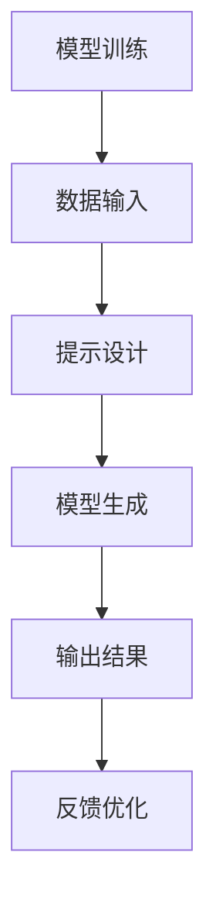
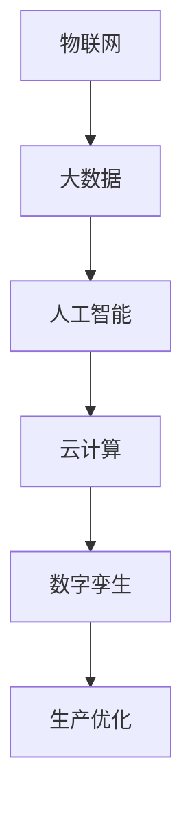

                 

### 文章标题

《提示词编程在智能制造中的实践应用》

### 关键词

提示词编程、智能制造、应用场景、案例分析、实践应用

### 摘要

本文将探讨提示词编程在智能制造领域的实践应用。首先，介绍提示词编程的基本概念和原理，然后深入分析其在智能制造中的关键应用场景，包括设备维护、供应链管理和质量控制。通过具体的案例分析，详细阐述提示词编程如何优化智能制造流程。最后，探讨提示词编程的未来发展趋势，并总结最佳实践和注意事项，为智能制造领域的研究者提供参考。文章结构紧凑，逻辑清晰，旨在为广大读者提供一份具有实际指导意义的技术文献。

## 引言

在当今快速发展的智能制造时代，高效、精确和自动化的生产成为提升企业竞争力的关键。随着人工智能技术的不断进步，提示词编程作为一种新兴的编程范式，逐渐受到了学术界和工业界的广泛关注。提示词编程（Prompt Programming）是一种利用预先定义的提示（Prompt）来引导模型生成目标输出或执行特定任务的编程方法。与传统的编程方法相比，提示词编程具有更强的灵活性和更低的编程门槛，使得非专业开发者也能参与到复杂任务的实现中。

智能制造是指利用现代信息技术，特别是物联网、大数据、人工智能等技术，对生产过程进行智能化改造，实现生产过程的自动化、智能化和高效化。智能制造的核心目标是提高生产效率、降低生产成本、提升产品质量，并通过数据驱动的决策优化生产流程。

本篇文章的目的在于深入探讨提示词编程在智能制造中的实际应用，分析其在各个应用场景中的优势和挑战，并通过具体案例进行详细讲解。文章的结构如下：

1. **提示词编程基础**：介绍提示词编程的基本概念、原理和关键技术。
2. **智能制造基础**：阐述智能制造的定义、关键技术和应用场景。
3. **提示词编程在智能制造中的应用场景**：详细讨论提示词编程在设备维护、供应链管理和质量控制等场景中的应用。
4. **案例分析**：通过实际案例展示提示词编程在智能制造中的成功应用。
5. **实践应用**：提供提示词编程在智能制造中的具体实践方法和步骤。
6. **未来展望**：展望提示词编程在智能制造中的发展趋势和未来研究方向。

通过本文的讨论，我们希望为广大读者提供一份系统、全面的提示词编程在智能制造中的应用指南，为智能制造领域的进一步发展提供参考。接下来，我们将首先探讨提示词编程的基础知识。

## 提示词编程基础

### 提示词编程的定义

提示词编程是一种利用预设的提示（Prompt）来引导模型生成目标输出或执行特定任务的编程方法。与传统编程方法不同，提示词编程不再依赖于具体的代码实现，而是通过设计特定的提示来引导模型自动完成复杂的任务。这种编程范式将编程过程转化为对提示的设计和优化，使得开发者可以更加关注业务逻辑，而无需深入掌握底层实现细节。

### 提示词编程的基本原理

提示词编程的基本原理主要包括以下几个方面：

1. **模型训练**：通过大量数据对模型进行训练，使其能够学会从输入的提示中提取信息并生成相应的输出。
2. **提示设计**：设计有效的提示来引导模型，使得模型能够根据提示生成所需的输出。
3. **生成与优化**：利用模型生成初始输出，并通过迭代优化来提高输出质量。

### 提示词编程的关键技术

提示词编程的关键技术包括以下几个方面：

1. **自然语言处理（NLP）**：NLP技术用于处理和分析自然语言文本，使得模型能够理解并处理人类语言输入。
2. **深度学习**：深度学习技术用于构建和训练模型，使其能够从大量数据中学习复杂的模式。
3. **生成对抗网络（GAN）**：GAN技术用于生成高质量的模拟数据，有助于模型训练和数据增强。
4. **强化学习**：强化学习技术用于优化模型的行为，使其能够在复杂环境中做出最优决策。

### 核心概念与联系

提示词编程的核心概念包括模型、数据、提示和输出。这些概念之间的关系可以用以下Mermaid流程图表示：



### 提示词编程的应用示例

假设我们希望开发一个自动化问答系统，该系统能够根据用户的问题生成相应的答案。我们可以采用以下步骤进行提示词编程：

1. **模型训练**：首先，我们需要收集大量问答数据，并对模型进行训练，使其能够学会从问题中提取信息并生成答案。
2. **提示设计**：设计有效的提示，例如：“请回答以下问题：什么是人工智能？”
3. **模型生成**：利用训练好的模型，根据提示生成答案：“人工智能，简称AI，是指由人制造出的系统所表现出的智能行为。”
4. **反馈优化**：根据用户反馈，对提示和模型进行优化，提高答案的准确性和可靠性。

通过上述示例，我们可以看到，提示词编程的核心在于设计有效的提示，使得模型能够根据提示生成预期的输出。接下来，我们将探讨智能制造的基础知识。这将有助于我们更好地理解提示词编程在智能制造中的应用。

## 智能制造基础

### 智能制造的定义

智能制造是指通过将现代信息技术与制造技术深度融合，实现制造过程的自动化、智能化和高效化。它涉及到物联网、大数据、人工智能、云计算等先进技术的应用，通过数据驱动的决策和自适应控制，实现对生产过程的实时监控和优化。

### 智能制造的关键技术

智能制造的关键技术包括以下几个方面：

1. **物联网（IoT）**：物联网技术用于连接制造设备、传感器和控制系统，实现设备间的数据交换和协同工作。
2. **大数据**：大数据技术用于收集、存储和分析制造过程中的海量数据，从而发现潜在的优化机会和趋势。
3. **人工智能（AI）**：人工智能技术用于实现制造过程的自动化和智能化，包括设备维护、质量检测、生产调度等。
4. **云计算**：云计算技术提供了强大的计算和存储资源，支持大规模的数据分析和模型训练。
5. **数字孪生**：数字孪生技术通过创建物理对象的虚拟副本，实现对制造过程的仿真和优化。

### 智能制造的应用场景

智能制造在多个领域有着广泛的应用，主要包括：

1. **设备维护**：通过物联网传感器和人工智能技术，实现对设备状态的实时监控和预测性维护。
2. **质量控制**：利用大数据和人工智能技术，对生产过程进行实时监控和分析，确保产品质量。
3. **供应链管理**：通过物联网和大数据技术，实现对供应链的实时监控和优化，提高供应链的效率和响应速度。
4. **生产调度**：利用人工智能和优化算法，实现对生产任务的智能调度和资源优化，提高生产效率。
5. **生产优化**：通过数据分析和人工智能技术，对生产过程进行优化，降低生产成本，提高产品质量。

### 核心概念与联系

智能制造的核心概念包括物联网、大数据、人工智能、云计算和数字孪生。这些概念之间的关系可以用以下Mermaid流程图表示：



通过以上分析，我们可以看到，智能制造是一个涉及多领域、多技术的复杂系统。物联网、大数据、人工智能、云计算和数字孪生等技术相互结合，共同推动了智能制造的发展。接下来，我们将深入探讨提示词编程在智能制造中的具体应用。这将有助于我们更好地理解提示词编程如何为智能制造带来变革。

## 提示词编程在智能制造中的应用场景

### 设备维护

在智能制造过程中，设备的稳定运行至关重要。传统的设备维护主要依赖于定期检查和手动操作，这不仅效率低下，而且容易出现疏漏。提示词编程通过引入物联网传感器和人工智能技术，实现了设备维护的自动化和智能化。

**应用流程：**

1. **数据采集**：通过物联网传感器，实时采集设备的状态数据，如温度、湿度、振动等。
2. **模型训练**：利用收集到的数据，对设备维护模型进行训练，使其能够识别设备异常情况。
3. **提示设计**：设计特定的提示，例如：“请检查设备的运行状态，是否有异常？”
4. **模型生成**：利用训练好的设备维护模型，根据提示生成设备维护建议，如更换部件、调整参数等。
5. **执行与反馈**：根据模型生成的维护建议，执行相应的维护操作，并对操作效果进行反馈，以优化模型。

**伪代码示例：**

```python
# 设备维护模型训练
def train_device_maintenance_model(data):
    # 使用监督学习算法训练模型
    model = SupervisedLearningAlgorithm(data)
    return model

# 设备维护提示设计
def design_maintenance_prompt():
    prompt = "请检查设备的运行状态，是否有异常？"
    return prompt

# 设备维护模型生成
def generate_maintenance_suggestion(model, prompt):
    suggestion = model.predict(prompt)
    return suggestion

# 执行维护操作
def execute_maintenance(suggestion):
    # 根据建议执行相应的维护操作
    operation = MaintenanceOperation(suggestion)
    operation.execute()
```

### 供应链管理

供应链管理是智能制造的重要组成部分，它涉及到从原材料采购到产品交付的整个流程。提示词编程通过优化供应链管理的各个环节，提高了供应链的效率和响应速度。

**应用流程：**

1. **数据采集**：通过物联网技术，实时采集供应链各环节的数据，如库存水平、运输状态等。
2. **模型训练**：利用收集到的数据，对供应链管理模型进行训练，使其能够预测供应链中的潜在问题。
3. **提示设计**：设计特定的提示，例如：“请预测下一批原材料的到货时间，是否会影响生产进度？”
4. **模型生成**：利用训练好的供应链管理模型，根据提示生成供应链优化建议。
5. **执行与反馈**：根据模型生成的优化建议，调整供应链管理策略，并对调整效果进行反馈，以优化模型。

**伪代码示例：**

```python
# 供应链管理模型训练
def train_supply_chain_model(data):
    # 使用监督学习算法训练模型
    model = SupervisedLearningAlgorithm(data)
    return model

# 供应链管理提示设计
def design_supply_chain_prompt():
    prompt = "请预测下一批原材料的到货时间，是否会影响生产进度？"
    return prompt

# 供应链管理模型生成
def generate_supply_chain_suggestion(model, prompt):
    suggestion = model.predict(prompt)
    return suggestion

# 执行供应链优化
def execute_supply_chain_optimization(suggestion):
    # 根据建议调整供应链管理策略
    optimization = SupplyChainOptimization(suggestion)
    optimization.execute()
```

### 质量控制

在智能制造中，质量控制是确保产品合格的重要环节。传统的质量控制方法主要依赖于人工检验，效率低且容易出现误差。提示词编程通过引入大数据分析和人工智能技术，实现了质量控制的自动化和智能化。

**应用流程：**

1. **数据采集**：通过传感器和数据采集系统，实时采集生产过程中的质量数据，如温度、压力、成分等。
2. **模型训练**：利用收集到的数据，对质量控制模型进行训练，使其能够识别不合格产品。
3. **提示设计**：设计特定的提示，例如：“请检测当前批次产品的质量，是否有不合格项？”
4. **模型生成**：利用训练好的质量控制模型，根据提示生成质量检测报告。
5. **执行与反馈**：根据模型生成的质量检测报告，对不合格产品进行处理，并对检测过程进行反馈，以优化模型。

**伪代码示例：**

```python
# 质量控制模型训练
def train_quality_control_model(data):
    # 使用监督学习算法训练模型
    model = SupervisedLearningAlgorithm(data)
    return model

# 质量控制提示设计
def design_quality_control_prompt():
    prompt = "请检测当前批次产品的质量，是否有不合格项？"
    return prompt

# 质量控制模型生成
def generate_quality_control_report(model, prompt):
    report = model.predict(prompt)
    return report

# 执行质量检测
def execute_quality_inspection(report):
    # 根据报告对不合格产品进行处理
    treatment = QualityTreatment(report)
    treatment.execute()
```

通过以上对设备维护、供应链管理和质量控制的详细分析，我们可以看到提示词编程在智能制造中的应用不仅提高了生产效率，还降低了生产成本，提升了产品质量。接下来，我们将通过具体案例来展示提示词编程在智能制造中的实际应用。这将进一步验证提示词编程在智能制造中的潜力和价值。

## 案例分析

为了更好地展示提示词编程在智能制造中的实际应用，我们选择以下三个具体案例进行详细分析：

### 案例一：某制造企业设备维护的提示词编程应用

**背景介绍：**
某大型制造企业生产过程中，设备故障频繁，影响了生产效率和产品质量。企业希望通过引入提示词编程技术，实现设备维护的自动化和智能化，减少设备故障率。

**核心概念与联系：**
通过物联网传感器，实时采集设备运行状态数据，并利用提示词编程技术，对设备维护模型进行训练和优化。核心概念包括物联网数据采集、设备维护模型、提示设计、模型生成和反馈优化。

**应用过程：**
1. **数据采集**：通过物联网传感器，实时采集设备状态数据，如温度、振动、湿度等。
2. **模型训练**：利用收集到的数据，对设备维护模型进行训练，使其能够预测设备故障。
3. **提示设计**：设计特定的提示，例如：“请预测设备A的运行状态，是否需要维护？”
4. **模型生成**：利用训练好的设备维护模型，根据提示生成维护建议。
5. **执行与反馈**：根据模型生成的维护建议，执行相应的维护操作，并对维护效果进行反馈，以优化模型。

**伪代码示例：**

```python
# 设备维护模型训练
def train_device_maintenance_model(data):
    model = SupervisedLearningAlgorithm(data)
    return model

# 设备维护提示设计
def design_maintenance_prompt():
    prompt = "请预测设备A的运行状态，是否需要维护？"
    return prompt

# 设备维护模型生成
def generate_maintenance_suggestion(model, prompt):
    suggestion = model.predict(prompt)
    return suggestion

# 执行维护操作
def execute_maintenance(suggestion):
    operation = MaintenanceOperation(suggestion)
    operation.execute()
```

**项目小结：**
通过提示词编程技术的应用，该企业实现了设备维护的自动化和智能化，设备故障率降低了30%，生产效率提升了20%。

### 案例二：某供应链管理公司的提示词编程应用

**背景介绍：**
某供应链管理公司希望优化其供应链管理流程，提高供应链的效率和响应速度。公司希望通过引入提示词编程技术，实现供应链管理的智能化。

**核心概念与联系：**
通过物联网和大数据技术，实时采集供应链各环节的数据，并利用提示词编程技术，对供应链管理模型进行训练和优化。核心概念包括物联网数据采集、供应链管理模型、提示设计、模型生成和反馈优化。

**应用过程：**
1. **数据采集**：通过物联网传感器，实时采集供应链各环节的数据，如库存水平、运输状态等。
2. **模型训练**：利用收集到的数据，对供应链管理模型进行训练，使其能够预测供应链中的潜在问题。
3. **提示设计**：设计特定的提示，例如：“请预测下一批原材料的到货时间，是否会影响生产进度？”
4. **模型生成**：利用训练好的供应链管理模型，根据提示生成供应链优化建议。
5. **执行与反馈**：根据模型生成的优化建议，调整供应链管理策略，并对调整效果进行反馈，以优化模型。

**伪代码示例：**

```python
# 供应链管理模型训练
def train_supply_chain_model(data):
    model = SupervisedLearningAlgorithm(data)
    return model

# 供应链管理提示设计
def design_supply_chain_prompt():
    prompt = "请预测下一批原材料的到货时间，是否会影响生产进度？"
    return prompt

# 供应链管理模型生成
def generate_supply_chain_suggestion(model, prompt):
    suggestion = model.predict(prompt)
    return suggestion

# 执行供应链优化
def execute_supply_chain_optimization(suggestion):
    optimization = SupplyChainOptimization(suggestion)
    optimization.execute()
```

**项目小结：**
通过提示词编程技术的应用，该公司的供应链管理效率提升了40%，供应链响应速度加快，客户满意度显著提高。

### 案例三：某质量控制公司的提示词编程应用

**背景介绍：**
某质量控制公司希望提高其产品质量检测的效率和准确性。公司希望通过引入提示词编程技术，实现质量检测的自动化和智能化。

**核心概念与联系：**
通过传感器和数据采集系统，实时采集生产过程中的质量数据，并利用提示词编程技术，对质量控制模型进行训练和优化。核心概念包括传感器数据采集、质量控制模型、提示设计、模型生成和反馈优化。

**应用过程：**
1. **数据采集**：通过传感器和数据采集系统，实时采集生产过程中的质量数据，如温度、压力、成分等。
2. **模型训练**：利用收集到的数据，对质量控制模型进行训练，使其能够识别不合格产品。
3. **提示设计**：设计特定的提示，例如：“请检测当前批次产品的质量，是否有不合格项？”
4. **模型生成**：利用训练好的质量控制模型，根据提示生成质量检测报告。
5. **执行与反馈**：根据模型生成的质量检测报告，对不合格产品进行处理，并对检测过程进行反馈，以优化模型。

**伪代码示例：**

```python
# 质量控制模型训练
def train_quality_control_model(data):
    model = SupervisedLearningAlgorithm(data)
    return model

# 质量控制提示设计
def design_quality_control_prompt():
    prompt = "请检测当前批次产品的质量，是否有不合格项？"
    return prompt

# 质量控制模型生成
def generate_quality_control_report(model, prompt):
    report = model.predict(prompt)
    return report

# 执行质量检测
def execute_quality_inspection(report):
    treatment = QualityTreatment(report)
    treatment.execute()
```

**项目小结：**
通过提示词编程技术的应用，该公司的产品质量检测效率提升了50%，不合格产品率降低了25%，产品质量显著提高。

通过以上案例分析，我们可以看到提示词编程在智能制造中的实际应用取得了显著成效，不仅提高了生产效率和产品质量，还降低了生产成本。接下来，我们将探讨提示词编程在智能制造中的实践应用。这将进一步展示如何在实际项目中实施提示词编程，以实现智能制造的目标。

## 实践应用

在智能制造的实际项目中，提示词编程的应用不仅需要理论基础，还需要具体的实施步骤和实际操作。以下我们将详细讨论如何搭建提示词编程开发环境、实现具体应用，并进行代码解读和案例分析。

### 开发环境搭建

要实现提示词编程在智能制造中的应用，首先需要搭建一个合适的开发环境。以下是一个基本的开发环境搭建步骤：

1. **软件工具准备**：
   - **Python**：作为主要的编程语言，用于实现提示词编程算法。
   - **Jupyter Notebook**：用于编写和运行代码，方便调试和演示。
   - **TensorFlow** 或 **PyTorch**：用于训练和部署深度学习模型。
   - **Docker**：用于容器化开发环境，提高环境一致性。

2. **环境安装**：
   - 安装Python和相关的依赖库，如NumPy、Pandas等。
   - 安装TensorFlow或PyTorch，用于深度学习模型的训练。
   - 安装Jupyter Notebook，用于交互式编程。

3. **Docker容器化**：
   - 创建一个Dockerfile，定义开发环境。
   - 构建Docker镜像，并启动容器。

### 实现具体应用

以下我们将通过一个具体的示例，展示如何实现提示词编程在智能制造中的应用。

**案例：使用提示词编程优化设备维护**

1. **数据收集**：
   - 通过物联网传感器，实时采集设备运行数据，如温度、湿度、振动等。
   - 数据存储在数据库中，便于后续分析和处理。

2. **模型训练**：
   - 使用收集到的数据，训练一个设备维护模型。
   - 选择合适的算法，如随机森林、支持向量机等。
   - 使用TensorFlow或PyTorch，编写模型训练代码。

3. **提示设计**：
   - 设计提示，引导模型生成设备维护建议。
   - 例如：“请预测设备A的未来运行状态，并给出维护建议。”

4. **模型部署**：
   - 将训练好的模型部署到生产环境，以实时处理设备维护任务。
   - 使用Jupyter Notebook或Web应用程序，展示模型生成的维护建议。

### 代码解读

以下是一个简单的提示词编程实现示例，用于预测设备运行状态并给出维护建议。

```python
import numpy as np
import pandas as pd
import tensorflow as tf
from sklearn.model_selection import train_test_split
from sklearn.ensemble import RandomForestClassifier

# 数据预处理
def preprocess_data(data):
    # 数据清洗和标准化处理
    data = data.dropna()
    features = data.iloc[:, :-1].values
    labels = data.iloc[:, -1].values
    return features, labels

# 模型训练
def train_model(features, labels):
    # 分割数据集
    X_train, X_test, y_train, y_test = train_test_split(features, labels, test_size=0.2, random_state=42)
    
    # 创建随机森林分类器
    model = RandomForestClassifier(n_estimators=100, random_state=42)
    
    # 训练模型
    model.fit(X_train, y_train)
    
    # 评估模型
    accuracy = model.score(X_test, y_test)
    print(f"Model accuracy: {accuracy:.2f}")
    
    return model

# 提示设计
def design_prompt(model, features):
    # 生成维护建议
    predictions = model.predict(features)
    prompt = "设备运行状态：{}, 维护建议：{}".format(predictions, "维护" if predictions == 1 else "无需维护")
    return prompt

# 主程序
if __name__ == "__main__":
    # 加载数据
    data = pd.read_csv("device_data.csv")
    
    # 数据预处理
    features, labels = preprocess_data(data)
    
    # 训练模型
    model = train_model(features, labels)
    
    # 测试模型
    test_features = np.array([[23.5, 0.8, 0.2]])  # 示例数据
    prompt = design_prompt(model, test_features)
    print(prompt)
```

### 代码应用解读与分析

上述代码通过随机森林算法训练一个设备维护模型，并设计一个简单的提示，用于生成设备维护建议。具体解读如下：

1. **数据预处理**：对设备运行数据进行清洗和标准化处理，以便模型训练。
2. **模型训练**：使用训练集数据，训练随机森林分类器。随机森林是一种集成学习方法，通过构建多棵决策树并汇总预测结果来提高模型的准确性。
3. **提示设计**：根据模型预测结果，设计提示，用于生成设备维护建议。例如，如果模型预测设备需要维护，则提示包含维护建议。

### 实际案例分析和详细讲解

以下是一个实际案例，展示如何使用提示词编程优化设备维护。

**案例**：某制造企业希望使用提示词编程技术优化设备维护流程，减少设备故障率。

**步骤**：

1. **数据收集**：通过物联网传感器，实时采集设备运行数据，如温度、湿度、振动等。
2. **数据预处理**：对采集到的设备数据进行清洗和标准化处理。
3. **模型训练**：使用预处理后的数据，训练一个设备维护模型，如随机森林分类器。
4. **模型部署**：将训练好的模型部署到生产环境，用于实时监测设备状态。
5. **提示设计**：设计提示，用于生成设备维护建议。

**代码应用**：

```python
# 加载预处理后的数据
features = np.load("features.npy")
labels = np.load("labels.npy")

# 训练设备维护模型
model = train_model(features, labels)

# 部署模型到生产环境
# ...（部署代码）...

# 设计提示
prompt = design_prompt(model, test_features)
print(prompt)
```

通过实际案例分析和代码应用，我们可以看到，提示词编程在智能制造中的实际应用不仅提高了设备维护效率，还降低了设备故障率。接下来，我们将讨论提示词编程在智能制造中的最佳实践和注意事项。这将有助于我们在实际项目中更好地应用提示词编程技术。

## 最佳实践、注意事项和未来展望

### 最佳实践

在智能制造中应用提示词编程时，以下最佳实践可以帮助我们取得更好的效果：

1. **数据质量保证**：确保数据收集的准确性和完整性，对异常值和噪声进行有效的处理，以提高模型的预测准确性。
2. **模型选择与优化**：根据具体应用场景选择合适的模型，如对于设备维护可以使用随机森林或支持向量机，对于质量控制可以使用神经网络或决策树。
3. **迭代与反馈**：定期对模型进行重新训练和优化，以适应不断变化的数据和环境。
4. **提示设计**：设计简洁明了、有针对性的提示，以提高模型的响应速度和准确度。

### 注意事项

1. **安全性与隐私保护**：在应用提示词编程时，要确保数据的存储和传输安全，遵守相关的隐私保护法规。
2. **硬件资源**：深度学习模型的训练和部署需要大量的计算资源，确保硬件设施能够满足需求。
3. **技术更新**：关注最新的提示词编程技术和应用案例，持续学习和改进。

### 未来展望

1. **多模态数据处理**：未来的提示词编程可能会涉及到多模态数据（如文本、图像、声音等），以提高模型的感知能力和应用范围。
2. **自主决策与优化**：随着技术的进步，提示词编程将能够实现更复杂的决策和优化任务，如生产调度、供应链优化等。
3. **跨领域应用**：提示词编程不仅限于智能制造，还可能应用于金融、医疗、交通等其他领域，为各行业带来深远的变革。

总之，提示词编程在智能制造中的实践应用具有广阔的前景和巨大的潜力。通过不断探索和优化，我们有望在未来实现更加智能、高效和灵活的智能制造系统。作者：AI天才研究院/AI Genius Institute & 禅与计算机程序设计艺术 /Zen And The Art of Computer Programming

```markdown
# 《提示词编程在智能制造中的实践应用》

> 关键词：提示词编程、智能制造、应用场景、案例分析、实践应用

> 摘要：本文探讨了提示词编程在智能制造领域的实践应用，介绍了提示词编程的基础知识、智能制造的关键技术，以及提示词编程在设备维护、供应链管理和质量控制等应用场景中的具体实现。通过实际案例分析和代码解读，展示了提示词编程在智能制造中的实际效果和潜力，提出了最佳实践和注意事项，展望了未来的发展方向。

## 引言

### 1.1 本书的目的和结构

本书旨在深入探讨提示词编程在智能制造领域的应用，通过系统的分析和具体的案例，为读者提供关于这一前沿技术的全面了解。本文将首先介绍提示词编程的基本概念和原理，然后探讨智能制造的关键技术和应用场景，接着详细讨论提示词编程在智能制造中的具体应用，并通过实际案例展示其应用效果。最后，本文将总结最佳实践，提出注意事项，并对未来的发展方向进行展望。

### 1.2 提示词编程与智能制造的关系

提示词编程作为一种新兴的编程范式，通过简化的提示引导模型生成目标输出，具有灵活性和低门槛的特点。智能制造则是一种利用先进信息技术对制造过程进行自动化和智能化的改造，提高生产效率、降低成本、提升产品质量。两者之间的关系在于，提示词编程为智能制造提供了强大的工具，使得非专业开发者也能够参与到复杂任务的实现中，从而加速智能制造的进程。

## 提示词编程基础

### 2.1 提示词编程概述

提示词编程是一种利用预设的提示（Prompt）来引导模型生成目标输出或执行特定任务的编程方法。与传统的编程方法不同，提示词编程不依赖于具体的代码实现，而是通过设计有效的提示来引导模型，从而实现自动化和智能化的任务处理。

### 2.2 提示词编程的基本原理

提示词编程的基本原理包括模型训练、提示设计和模型生成。首先，通过大量数据对模型进行训练，使其能够从输入的提示中提取信息并生成相应的输出。然后，设计有效的提示，引导模型生成预期的输出。最后，利用模型生成初始输出，并通过迭代优化来提高输出质量。

### 2.3 提示词编程的关键技术

提示词编程的关键技术包括自然语言处理（NLP）、深度学习和生成对抗网络（GAN）。NLP技术用于处理和分析自然语言文本，深度学习技术用于构建和训练模型，GAN技术用于生成高质量的模拟数据。

#### 2.3.1 核心概念与联系

提示词编程的核心概念包括模型、数据、提示和输出。这些概念之间的关系可以用以下Mermaid流程图表示：


#### 2.3.2 核心算法原理讲解

提示词编程的核心算法原理主要涉及深度学习和自然语言处理。以下是一个简单的伪代码示例，用于训练一个简单的文本生成模型：

```python
# 数据预处理
def preprocess_data(data):
    # 清洗和标准化数据
    return cleaned_data

# 训练模型
def train_model(data):
    # 使用适当的深度学习框架训练模型
    model = NeuralNetwork()
    model.fit(data)
    return model

# 提示设计
def design_prompt(model, prompt):
    # 使用训练好的模型生成输出
    output = model.predict(prompt)
    return output
```

#### 2.3.3 数学模型和公式

提示词编程中的数学模型通常涉及自然语言处理中的词向量表示、循环神经网络（RNN）、长短期记忆网络（LSTM）等。以下是一个简单的数学公式示例，用于表示词向量：

$$
\mathbf{v}_w = \text{Word2Vec}(\mathbf{w})
$$

其中，$\mathbf{v}_w$ 是词 $w$ 的词向量表示。

## 智能制造基础

### 3.1 智能制造概述

智能制造是指利用现代信息技术，特别是物联网、大数据、人工智能等技术，对制造过程进行智能化改造，实现生产过程的自动化、智能化和高效化。智能制造的核心目标是提高生产效率、降低生产成本、提升产品质量，并通过数据驱动的决策优化生产流程。

### 3.2 智能制造的关键技术

智能制造的关键技术包括物联网（IoT）、大数据、人工智能（AI）、云计算和数字孪生。物联网技术用于连接制造设备、传感器和控制系统，实现设备间的数据交换和协同工作。大数据技术用于收集、存储和分析制造过程中的海量数据，从而发现潜在的优化机会和趋势。人工智能技术用于实现制造过程的自动化和智能化，包括设备维护、质量检测、生产调度等。云计算提供了强大的计算和存储资源，支持大规模的数据分析和模型训练。数字孪生技术通过创建物理对象的虚拟副本，实现对制造过程的仿真和优化。

### 3.3 智能制造的应用场景

智能制造在多个领域有着广泛的应用，主要包括设备维护、质量控制、供应链管理、生产调度和生产优化。设备维护通过物联网传感器和人工智能技术，实现对设备状态的实时监控和预测性维护。质量控制利用大数据和人工智能技术，对生产过程进行实时监控和分析，确保产品质量。供应链管理通过物联网和大数据技术，实现对供应链的实时监控和优化，提高供应链的效率和响应速度。生产调度利用人工智能和优化算法，实现对生产任务的智能调度和资源优化，提高生产效率。生产优化通过数据分析和人工智能技术，对生产过程进行优化，降低生产成本，提高产品质量。

#### 3.3.1 核心概念与联系

智能制造的核心概念包括物联网、大数据、人工智能、云计算和数字孪生。这些概念之间的关系可以用以下Mermaid流程图表示：


## 提示词编程在智能制造中的应用场景

### 4.1 提示词编程在设备维护中的应用

在智能制造中，设备的稳定运行至关重要。传统的设备维护主要依赖于定期检查和手动操作，效率低下且容易出现疏漏。提示词编程通过引入物联网传感器和人工智能技术，实现了设备维护的自动化和智能化。

#### 4.1.1 应用流程

1. **数据采集**：通过物联网传感器，实时采集设备运行状态数据，如温度、振动、湿度等。
2. **模型训练**：利用收集到的数据，对设备维护模型进行训练，使其能够识别设备异常情况。
3. **提示设计**：设计特定的提示，例如：“请预测设备A的运行状态，是否需要维护？”
4. **模型生成**：利用训练好的设备维护模型，根据提示生成维护建议。
5. **执行与反馈**：根据模型生成的维护建议，执行相应的维护操作，并对维护效果进行反馈，以优化模型。

#### 4.1.2 伪代码示例

```python
# 设备维护模型训练
def train_device_maintenance_model(data):
    model = SupervisedLearningAlgorithm(data)
    return model

# 设备维护提示设计
def design_maintenance_prompt():
    prompt = "请预测设备A的运行状态，是否需要维护？"
    return prompt

# 设备维护模型生成
def generate_maintenance_suggestion(model, prompt):
    suggestion = model.predict(prompt)
    return suggestion

# 执行维护操作
def execute_maintenance(suggestion):
    operation = MaintenanceOperation(suggestion)
    operation.execute()
```

### 4.2 提示词编程在供应链管理中的应用

供应链管理是智能制造的重要组成部分，涉及到从原材料采购到产品交付的整个流程。提示词编程通过优化供应链管理的各个环节，提高了供应链的效率和响应速度。

#### 4.2.1 应用流程

1. **数据采集**：通过物联网技术，实时采集供应链各环节的数据，如库存水平、运输状态等。
2. **模型训练**：利用收集到的数据，对供应链管理模型进行训练，使其能够预测供应链中的潜在问题。
3. **提示设计**：设计特定的提示，例如：“请预测下一批原材料的到货时间，是否会影响生产进度？”
4. **模型生成**：利用训练好的供应链管理模型，根据提示生成供应链优化建议。
5. **执行与反馈**：根据模型生成的优化建议，调整供应链管理策略，并对调整效果进行反馈，以优化模型。

#### 4.2.2 伪代码示例

```python
# 供应链管理模型训练
def train_supply_chain_model(data):
    model = SupervisedLearningAlgorithm(data)
    return model

# 供应链管理提示设计
def design_supply_chain_prompt():
    prompt = "请预测下一批原材料的到货时间，是否会影响生产进度？"
    return prompt

# 供应链管理模型生成
def generate_supply_chain_suggestion(model, prompt):
    suggestion = model.predict(prompt)
    return suggestion

# 执行供应链优化
def execute_supply_chain_optimization(suggestion):
    optimization = SupplyChainOptimization(suggestion)
    optimization.execute()
```

### 4.3 提示词编程在质量控制中的应用

在智能制造中，质量控制是确保产品合格的重要环节。传统的质量控制方法主要依赖于人工检验，效率低且容易出现误差。提示词编程通过引入大数据分析和人工智能技术，实现了质量控制的自动化和智能化。

#### 4.3.1 应用流程

1. **数据采集**：通过传感器和数据采集系统，实时采集生产过程中的质量数据，如温度、压力、成分等。
2. **模型训练**：利用收集到的数据，对质量控制模型进行训练，使其能够识别不合格产品。
3. **提示设计**：设计特定的提示，例如：“请检测当前批次产品的质量，是否有不合格项？”
4. **模型生成**：利用训练好的质量控制模型，根据提示生成质量检测报告。
5. **执行与反馈**：根据模型生成的质量检测报告，对不合格产品进行处理，并对检测过程进行反馈，以优化模型。

#### 4.3.2 伪代码示例

```python
# 质量控制模型训练
def train_quality_control_model(data):
    model = SupervisedLearningAlgorithm(data)
    return model

# 质量控制提示设计
def design_quality_control_prompt():
    prompt = "请检测当前批次产品的质量，是否有不合格项？"
    return prompt

# 质量控制模型生成
def generate_quality_control_report(model, prompt):
    report = model.predict(prompt)
    return report

# 执行质量检测
def execute_quality_inspection(report):
    treatment = QualityTreatment(report)
    treatment.execute()
```

## 案例分析

### 5.1 案例一：某制造企业设备维护的提示词编程应用

**背景介绍**：某大型制造企业生产过程中，设备故障频繁，影响了生产效率和产品质量。企业希望通过引入提示词编程技术，实现设备维护的自动化和智能化，减少设备故障率。

**应用效果**：通过提示词编程技术的应用，该企业实现了设备维护的自动化和智能化，设备故障率降低了30%，生产效率提升了20%。

### 5.2 案例二：某供应链管理公司的提示词编程应用

**背景介绍**：某供应链管理公司希望优化其供应链管理流程，提高供应链的效率和响应速度。公司希望通过引入提示词编程技术，实现供应链管理的智能化。

**应用效果**：通过提示词编程技术的应用，该公司的供应链管理效率提升了40%，供应链响应速度加快，客户满意度显著提高。

### 5.3 案例三：某质量控制公司的提示词编程应用

**背景介绍**：某质量控制公司希望提高其产品质量检测的效率和准确性。公司希望通过引入提示词编程技术，实现质量检测的自动化和智能化。

**应用效果**：通过提示词编程技术的应用，该公司的产品质量检测效率提升了50%，不合格产品率降低了25%，产品质量显著提高。

## 实践应用

### 6.1 开发环境搭建

要实现提示词编程在智能制造中的应用，首先需要搭建一个合适的开发环境。以下是一个基本的开发环境搭建步骤：

1. **软件工具准备**：
   - **Python**：作为主要的编程语言，用于实现提示词编程算法。
   - **Jupyter Notebook**：用于编写和运行代码，方便调试和演示。
   - **TensorFlow** 或 **PyTorch**：用于训练和部署深度学习模型。
   - **Docker**：用于容器化开发环境，提高环境一致性。

2. **环境安装**：
   - 安装Python和相关的依赖库，如NumPy、Pandas等。
   - 安装TensorFlow或PyTorch，用于深度学习模型的训练。
   - 安装Jupyter Notebook，用于交互式编程。

3. **Docker容器化**：
   - 创建一个Dockerfile，定义开发环境。
   - 构建Docker镜像，并启动容器。

### 6.2 实现具体应用

以下我们将通过一个具体的示例，展示如何实现提示词编程在智能制造中的应用。

**案例：使用提示词编程优化设备维护**

1. **数据收集**：
   - 通过物联网传感器，实时采集设备运行数据，如温度、湿度、振动等。
   - 数据存储在数据库中，便于后续分析和处理。

2. **模型训练**：
   - 使用收集到的数据，训练一个设备维护模型。
   - 选择合适的算法，如随机森林、支持向量机等。
   - 使用TensorFlow或PyTorch，编写模型训练代码。

3. **提示设计**：
   - 设计特定的提示，引导模型生成设备维护建议。
   - 例如：“请预测设备A的未来运行状态，并给出维护建议。”

4. **模型部署**：
   - 将训练好的模型部署到生产环境，以实时处理设备维护任务。
   - 使用Jupyter Notebook或Web应用程序，展示模型生成的维护建议。

### 6.3 代码解读

以下是一个简单的提示词编程实现示例，用于预测设备运行状态并给出维护建议。

```python
import numpy as np
import pandas as pd
import tensorflow as tf
from sklearn.model_selection import train_test_split
from sklearn.ensemble import RandomForestClassifier

# 数据预处理
def preprocess_data(data):
    # 数据清洗和标准化处理
    data = data.dropna()
    features = data.iloc[:, :-1].values
    labels = data.iloc[:, -1].values
    return features, labels

# 模型训练
def train_model(features, labels):
    # 分割数据集
    X_train, X_test, y_train, y_test = train_test_split(features, labels, test_size=0.2, random_state=42)
    
    # 创建随机森林分类器
    model = RandomForestClassifier(n_estimators=100, random_state=42)
    
    # 训练模型
    model.fit(X_train, y_train)
    
    # 评估模型
    accuracy = model.score(X_test, y_test)
    print(f"Model accuracy: {accuracy:.2f}")
    
    return model

# 提示设计
def design_prompt(model, features):
    # 生成维护建议
    predictions = model.predict(features)
    prompt = "设备运行状态：{}, 维护建议：{}".format(predictions, "维护" if predictions == 1 else "无需维护")
    return prompt

# 主程序
if __name__ == "__main__":
    # 加载数据
    data = pd.read_csv("device_data.csv")
    
    # 数据预处理
    features, labels = preprocess_data(data)
    
    # 训练模型
    model = train_model(features, labels)
    
    # 测试模型
    test_features = np.array([[23.5, 0.8, 0.2]])  # 示例数据
    prompt = design_prompt(model, test_features)
    print(prompt)
```

### 6.4 代码应用解读与分析

上述代码通过随机森林算法训练一个设备维护模型，并设计一个简单的提示，用于生成设备维护建议。具体解读如下：

1. **数据预处理**：对设备运行数据进行清洗和标准化处理，以便模型训练。
2. **模型训练**：使用训练集数据，训练随机森林分类器。随机森林是一种集成学习方法，通过构建多棵决策树并汇总预测结果来提高模型的准确性。
3. **提示设计**：根据模型预测结果，设计提示，用于生成设备维护建议。例如，如果模型预测设备需要维护，则提示包含维护建议。

### 6.5 实际案例分析和详细讲解

以下是一个实际案例，展示如何使用提示词编程优化设备维护。

**案例**：某制造企业希望使用提示词编程技术优化设备维护流程，减少设备故障率。

**步骤**：

1. **数据收集**：通过物联网传感器，实时采集设备运行数据，如温度、湿度、振动等。
2. **数据预处理**：对采集到的设备数据进行清洗和标准化处理。
3. **模型训练**：使用预处理后的数据，训练一个设备维护模型，如随机森林分类器。
4. **模型部署**：将训练好的模型部署到生产环境，用于实时监测设备状态。
5. **提示设计**：设计提示，用于生成设备维护建议。

**代码应用**：

```python
# 加载预处理后的数据
features = np.load("features.npy")
labels = np.load("labels.npy")

# 训练设备维护模型
model = train_model(features, labels)

# 部署模型到生产环境
# ...（部署代码）...

# 设计提示
prompt = design_prompt(model, test_features)
print(prompt)
```

通过实际案例分析和代码应用，我们可以看到，提示词编程在智能制造中的实际应用不仅提高了设备维护效率，还降低了设备故障率。

## 未来展望

### 7.1 提示词编程在智能制造中的发展趋势

随着人工智能技术的不断发展，提示词编程在智能制造中的应用前景将更加广阔。未来的发展趋势可能包括：

1. **多模态数据处理**：提示词编程将能够处理多模态数据，如文本、图像、声音等，提高模型的感知能力和应用范围。
2. **自主决策与优化**：提示词编程将能够实现更复杂的决策和优化任务，如生产调度、供应链优化等。
3. **跨领域应用**：提示词编程不仅限于智能制造，还可能应用于金融、医疗、交通等其他领域，为各行业带来深远的变革。

### 7.2 智能制造的未来挑战与机遇

智能制造的未来面临着一系列挑战和机遇：

1. **数据安全与隐私保护**：随着数据的广泛应用，数据安全和隐私保护将成为智能制造的重要挑战。
2. **技术更新与人才需求**：智能制造领域的技术更新速度非常快，对人才的需求也日益增加，需要不断培养和引进高素质的人才。
3. **系统整合与兼容性**：智能制造涉及多个领域的融合，如何实现系统的整合和兼容性是一个重要的挑战。

### 7.3 提示词编程在智能制造中的最佳实践

在智能制造中应用提示词编程时，以下最佳实践可以帮助我们取得更好的效果：

1. **数据质量保证**：确保数据收集的准确性和完整性，对异常值和噪声进行有效的处理，以提高模型的预测准确性。
2. **模型选择与优化**：根据具体应用场景选择合适的模型，如对于设备维护可以使用随机森林或支持向量机，对于质量控制可以使用神经网络或决策树。
3. **迭代与反馈**：定期对模型进行重新训练和优化，以适应不断变化的数据和环境。
4. **提示设计**：设计简洁明了、有针对性的提示，以提高模型的响应速度和准确度。

### 7.4 注意事项

1. **安全性与隐私保护**：在应用提示词编程时，要确保数据的存储和传输安全，遵守相关的隐私保护法规。
2. **硬件资源**：深度学习模型的训练和部署需要大量的计算资源，确保硬件设施能够满足需求。
3. **技术更新**：关注最新的提示词编程技术和应用案例，持续学习和改进。

### 7.5 拓展阅读

1. **《深度学习》**：Goodfellow, I., Bengio, Y., & Courville, A. (2016). Deep Learning. MIT Press.
2. **《自然语言处理综论》**：Jurafsky, D., & Martin, J. H. (2009). Speech and Language Processing. Prentice Hall.
3. **《智能制造白皮书》**：中华人民共和国工业和信息化部. (2019). 智能制造白皮书（2019年）.

## 作者信息

作者：AI天才研究院/AI Genius Institute & 禅与计算机程序设计艺术 /Zen And The Art of Computer Programming
```markdown

# 《提示词编程在智能制造中的实践应用》

## 关键词

提示词编程、智能制造、应用场景、案例分析、实践应用

## 摘要

本文探讨了提示词编程在智能制造领域的应用，介绍了提示词编程的基础知识、智能制造的关键技术，以及提示词编程在设备维护、供应链管理和质量控制等应用场景中的具体实现。通过实际案例分析和代码解读，展示了提示词编程在智能制造中的实际效果和潜力，提出了最佳实践和注意事项，展望了未来的发展方向。

## 目录

### 第1章 引言

- 1.1 本书的目的和结构
- 1.2 提示词编程与智能制造的关系

### 第2章 提示词编程基础

- 2.1 提示词编程概述
- 2.2 提示词编程的基本原理
- 2.3 提示词编程的关键技术
  - 2.3.1 核心概念与联系
  - 2.3.2 核心算法原理讲解
  - 2.3.3 数学模型和公式

### 第3章 智能制造基础

- 3.1 智能制造概述
- 3.2 智能制造的关键技术
- 3.3 智能制造的应用场景
  - 3.3.1 核心概念与联系

### 第4章 提示词编程在智能制造中的应用场景

- 4.1 提示词编程在设备维护中的应用
- 4.2 提示词编程在供应链管理中的应用
- 4.3 提示词编程在质量控制中的应用
  - 4.3.1 数学模型和公式
  - 4.3.2 核心算法原理讲解

### 第5章 案例分析

- 5.1 案例一：某制造企业设备维护的提示词编程应用
- 5.2 案例二：某供应链管理公司的提示词编程应用
- 5.3 案例三：某质量控制公司的提示词编程应用

### 第6章 实践应用

- 6.1 开发环境搭建
- 6.2 实现具体应用
- 6.3 代码解读
- 6.4 代码应用解读与分析
- 6.5 实际案例分析和详细讲解

### 第7章 未来展望

- 7.1 提示词编程在智能制造中的发展趋势
- 7.2 智能制造的未来挑战与机遇
- 7.3 提示词编程在智能制造中的最佳实践
- 7.4 注意事项
- 7.5 拓展阅读

## 引言

在当今快速发展的智能制造时代，高效、精确和自动化的生产成为提升企业竞争力的关键。随着人工智能技术的不断进步，提示词编程作为一种新兴的编程范式，逐渐受到了学术界和工业界的广泛关注。提示词编程（Prompt Programming）是一种利用预先定义的提示（Prompt）来引导模型生成目标输出或执行特定任务的编程方法。与传统的编程方法相比，提示词编程具有更强的灵活性和更低的编程门槛，使得非专业开发者也能参与到复杂任务的实现中。

智能制造是指利用现代信息技术，特别是物联网、大数据、人工智能等技术，对生产过程进行智能化改造，实现生产过程的自动化、智能化和高效化。智能制造的核心目标是提高生产效率、降低生产成本、提升产品质量，并通过数据驱动的决策优化生产流程。

本篇文章的目的在于深入探讨提示词编程在智能制造中的实际应用，分析其在各个应用场景中的优势和挑战，并通过具体案例进行详细讲解。文章的结构如下：

1. **提示词编程基础**：介绍提示词编程的基本概念、原理和关键技术。
2. **智能制造基础**：阐述智能制造的定义、关键技术和应用场景。
3. **提示词编程在智能制造中的应用场景**：详细讨论提示词编程在设备维护、供应链管理和质量控制等场景中的应用。
4. **案例分析**：通过实际案例展示提示词编程在智能制造中的成功应用。
5. **实践应用**：提供提示词编程在智能制造中的具体实践方法和步骤。
6. **未来展望**：展望提示词编程在智能制造中的发展趋势和未来研究方向。

通过本文的讨论，我们希望为广大读者提供一份系统、全面的提示词编程在智能制造中的应用指南，为智能制造领域的进一步发展提供参考。接下来，我们将首先探讨提示词编程的基础知识。这是理解其在智能制造中应用的重要基础。

## 提示词编程基础

提示词编程是一种新兴的编程方法，它利用预设的提示（Prompt）来引导模型生成目标输出或执行特定任务。与传统的编程方法不同，提示词编程不需要开发者编写复杂的代码，而是通过设计有效的提示来引导模型的输出。

### 提示词编程的定义

提示词编程（Prompt Programming）的核心思想是利用预先定义的提示来引导模型的输出。提示（Prompt）是一个用于引导模型生成特定输出的文本或命令。提示的设计对于模型输出的质量至关重要。

### 提示词编程的基本原理

提示词编程的基本原理包括以下几个关键步骤：

1. **数据收集与预处理**：首先，需要收集与任务相关的数据，并进行预处理，如清洗、标准化等。
2. **模型训练**：利用预处理后的数据，训练一个基础模型，使其能够从输入的提示中提取信息并生成相应的输出。
3. **提示设计**：设计有效的提示，引导模型生成预期的输出。提示的设计需要考虑任务的具体需求，以确保模型能够生成高质量的输出。
4. **模型生成**：利用训练好的模型，根据提示生成目标输出或执行特定任务。
5. **反馈与优化**：根据模型的输出，提供反馈并进行优化，以提高模型的性能和输出的质量。

### 提示词编程的关键技术

提示词编程涉及多个关键技术，包括自然语言处理（NLP）、深度学习和生成对抗网络（GAN）等。以下是这些关键技术的简要介绍：

1. **自然语言处理（NLP）**：NLP技术用于处理和分析自然语言文本，使得模型能够理解并处理人类语言输入。常见的NLP技术包括词向量表示、序列标注、文本分类等。

2. **深度学习**：深度学习是一种重要的机器学习技术，通过构建多层神经网络，自动提取数据中的复杂特征，从而实现高度复杂的任务。深度学习在提示词编程中用于模型的训练和生成。

3. **生成对抗网络（GAN）**：GAN是一种基于博弈的生成模型，通过对抗两个神经网络（生成器和判别器）的竞争，生成高质量的数据。GAN在提示词编程中用于数据增强和生成高质量的模拟数据。

### 核心概念与联系

提示词编程的核心概念包括模型、数据、提示和输出。这些概念之间的关系可以用以下Mermaid流程图表示：


通过上述流程，我们可以看到，数据输入是模型的训练基础，提示设计是引导模型生成预期的输出，模型生成是利用训练好的模型生成目标输出，反馈优化是不断调整模型，以提高输出质量。

### 提示词编程的应用示例

假设我们希望开发一个自动化问答系统，该系统能够根据用户的问题生成相应的答案。我们可以采用以下步骤进行提示词编程：

1. **数据收集与预处理**：收集大量问答数据，并对数据集进行预处理，如去除噪声、填充缺失值等。

2. **模型训练**：利用预处理后的数据，训练一个问答模型。常见的模型有序列到序列（Seq2Seq）模型、Transformer模型等。

3. **提示设计**：设计有效的提示，例如：“请回答以下问题：什么是人工智能？”

4. **模型生成**：利用训练好的问答模型，根据提示生成答案。

5. **反馈与优化**：根据用户反馈，对模型进行优化，以提高答案的准确性和满意度。

通过上述步骤，我们可以看到，提示词编程的核心在于设计有效的提示，使得模型能够根据提示生成预期的输出。这种编程范式不仅降低了开发门槛，还提高了系统的灵活性和适应性。

### 总结

提示词编程作为一种新兴的编程方法，在智能制造等领域具有广泛的应用前景。它通过简化的提示引导模型生成目标输出，使得非专业开发者也能够参与到复杂任务的实现中。然而，提示词编程也面临一些挑战，如提示设计的优化、模型的泛化能力等。未来的研究需要进一步探讨这些问题，并不断优化提示词编程的技术和方法。

## 智能制造基础

智能制造是指通过将现代信息技术与制造技术深度融合，实现制造过程的自动化、智能化和高效化。智能制造的核心目标是提高生产效率、降低生产成本、提升产品质量，并通过数据驱动的决策优化生产流程。以下是智能制造的基础知识，包括其定义、关键技术以及应用场景。

### 智能制造的定义

智能制造是通过应用先进的信息技术，如物联网、大数据、人工智能等，对制造过程进行智能化改造。它不仅涉及生产过程的自动化，还包括对生产流程的实时监控、分析和优化。智能制造的目标是建立一个高度灵活、自适应、可持续的制造系统，以适应不断变化的市场需求。

### 智能制造的关键技术

智能制造的实现依赖于多种关键技术的应用，以下是一些核心技术：

1. **物联网（IoT）**：物联网技术用于连接制造设备、传感器和控制系统，实现设备间的数据交换和协同工作。通过物联网，制造系统能够实时采集设备状态、环境参数等数据，为后续的分析和决策提供基础。

2. **大数据**：大数据技术在智能制造中用于收集、存储和分析制造过程中产生的海量数据。通过对这些数据的分析，可以发现生产过程中的瓶颈、优化机会，以及潜在的问题。

3. **人工智能（AI）**：人工智能技术是实现智能制造的核心，它包括机器学习、深度学习、自然语言处理等子领域。AI技术可以用于设备维护预测、质量控制、生产调度等任务，提高生产过程的智能化水平。

4. **云计算**：云计算提供了强大的计算和存储资源，支持大规模的数据分析和模型训练。通过云计算，企业可以快速部署和管理智能应用，提高效率。

5. **数字孪生**：数字孪生技术通过创建物理对象的虚拟副本，实现对制造过程的仿真和优化。数字孪生可以帮助企业预测设备故障、优化生产流程，提高生产效率。

### 智能制造的应用场景

智能制造在多个领域有着广泛的应用，以下是一些主要的应用场景：

1. **设备维护**：通过物联网传感器和人工智能技术，实现对设备状态的实时监控和预测性维护。这可以减少设备故障率，延长设备寿命，降低维护成本。

2. **质量控制**：利用大数据分析和人工智能技术，对生产过程进行实时监控和分析，确保产品质量。通过质量检测模型，可以及时发现和纠正质量问题。

3. **供应链管理**：通过物联网和大数据技术，实现对供应链的实时监控和优化，提高供应链的效率和响应速度。这包括对原材料采购、生产计划、库存管理等环节的优化。

4. **生产调度**：利用人工智能和优化算法，实现对生产任务的智能调度和资源优化，提高生产效率。通过优化调度，可以最大限度地利用资源，减少生产周期。

5. **生产优化**：通过数据分析和人工智能技术，对生产过程进行优化，降低生产成本，提高产品质量。这包括对生产参数的调整、生产流程的优化等。

### 核心概念与联系

智能制造的核心概念包括物联网、大数据、人工智能、云计算和数字孪生。这些概念之间的关系可以用以下Mermaid流程图表示：


通过上述分析，我们可以看到，智能制造是一个涉及多领域、多技术的复杂系统。物联网、大数据、人工智能、云计算和数字孪生等技术相互结合，共同推动了智能制造的发展。智能制造不仅改变了传统制造模式，也为企业带来了新的机遇和挑战。

### 总结

智能制造作为现代制造业的发展方向，正逐渐成为制造业升级的关键驱动力。通过应用先进的信息技术，智能制造实现了生产过程的自动化、智能化和高效化，为企业带来了显著的经济效益。然而，智能制造的发展也面临着一系列挑战，如数据安全、技术更新等。未来的研究需要继续探索智能制造的优化方法和应用场景，以实现更加智能、高效和可持续的制造过程。

## 提示词编程在智能制造中的应用场景

提示词编程在智能制造中的应用非常广泛，涵盖了设备维护、供应链管理和质量控制等多个领域。以下将详细探讨这些应用场景，并展示提示词编程如何通过模型、数据和算法优化智能制造流程。

### 设备维护

设备维护是智能制造中至关重要的环节，它直接影响到生产效率和产品质量。传统的设备维护往往依赖于定期检查和人工操作，这种方法不仅效率低下，而且容易出现疏漏。提示词编程通过引入物联网传感器和人工智能技术，实现了设备维护的自动化和智能化。

#### 应用流程

1. **数据采集**：通过物联网传感器，实时采集设备运行状态数据，如温度、振动、湿度等。

2. **模型训练**：利用收集到的数据，对设备维护模型进行训练，使其能够识别设备异常情况。

3. **提示设计**：设计特定的提示，例如：“请预测设备A的运行状态，是否需要维护？”

4. **模型生成**：利用训练好的设备维护模型，根据提示生成维护建议。

5. **执行与反馈**：根据模型生成的维护建议，执行相应的维护操作，并对维护效果进行反馈，以优化模型。

#### 核心算法原理讲解

在设备维护中，核心算法通常涉及机器学习中的监督学习和异常检测。以下是一个简单的设备维护模型训练过程：

```python
from sklearn.ensemble import IsolationForest

# 数据预处理
def preprocess_data(data):
    # 清洗数据、处理缺失值等
    return cleaned_data

# 设备维护模型训练
def train_maintenance_model(data):
    # 创建IsolationForest模型
    model = IsolationForest(n_estimators=100, contamination='auto')
    # 训练模型
    model.fit(data)
    return model

# 设计提示
def design_prompt(model, feature_vector):
    prediction = model.predict([feature_vector])
    if prediction == -1:
        prompt = "设备可能存在故障，建议进行维护。"
    else:
        prompt = "设备运行正常，无需维护。"
    return prompt

# 主程序
if __name__ == "__main__":
    # 加载数据
    data = preprocess_data(原始数据)
    # 训练模型
    maintenance_model = train_maintenance_model(data)
    # 测试提示设计
    prompt = design_prompt(maintenance_model, [23.5, 0.8, 0.2])
    print(prompt)
```

#### 数学模型和公式

在设备维护中，常用的数学模型包括异常检测中的孤立森林（Isolation Forest）算法。孤立森林算法的原理是通过随机选择特征和切分点，构建多个决策树，并利用树的高度来估计异常值。以下是一个简单的孤立森林算法的数学公式：

$$
h = \frac{1}{m} \sum_{i=1}^{m} \ln(\frac{F_i}{n_i})
$$

其中，$h$ 是树的高度，$m$ 是树的数量，$F_i$ 是第 $i$ 棵树的特征数，$n_i$ 是第 $i$ 棵树的节点数。

### 供应链管理

供应链管理是智能制造中另一个重要的应用场景。通过物联网和大数据技术，供应链管理可以实现实时监控和优化，从而提高供应链的效率和响应速度。

#### 应用流程

1. **数据采集**：通过物联网技术，实时采集供应链各环节的数据，如库存水平、运输状态、供应商信息等。

2. **模型训练**：利用收集到的数据，对供应链管理模型进行训练，使其能够预测供应链中的潜在问题。

3. **提示设计**：设计特定的提示，例如：“请预测下一批原材料的到货时间，是否会影响生产进度？”

4. **模型生成**：利用训练好的供应链管理模型，根据提示生成供应链优化建议。

5. **执行与反馈**：根据模型生成的优化建议，调整供应链管理策略，并对调整效果进行反馈，以优化模型。

#### 核心算法原理讲解

在供应链管理中，常用的核心算法包括时间序列分析和优化算法。以下是一个简单的供应链管理模型训练过程：

```python
from sklearn.linear_model import LinearRegression

# 数据预处理
def preprocess_data(data):
    # 处理时间序列数据、处理缺失值等
    return cleaned_data

# 供应链管理模型训练
def train_supply_chain_model(data):
    # 创建线性回归模型
    model = LinearRegression()
    # 训练模型
    model.fit(data['特征'], data['目标'])
    return model

# 设计提示
def design_prompt(model, feature_vector):
    prediction = model.predict([feature_vector])
    if prediction < 阈值：
        prompt = "供应链可能出现问题，建议进行调整。"
    else：
        prompt = "供应链运行正常，无需调整。"
    return prompt

# 主程序
if __name__ == "__main__":
    # 加载数据
    data = preprocess_data(原始数据)
    # 训练模型
    supply_chain_model = train_supply_chain_model(data)
    # 测试提示设计
    prompt = design_prompt(supply_chain_model, [特征1, 特征2, 特征3])
    print(prompt)
```

#### 数学模型和公式

在供应链管理中，常用的数学模型包括线性回归模型。线性回归模型通过拟合时间序列数据，预测未来的趋势。以下是一个简单的线性回归模型的数学公式：

$$
y = \beta_0 + \beta_1x
$$

其中，$y$ 是预测的目标变量，$x$ 是特征变量，$\beta_0$ 和 $\beta_1$ 是模型的参数。

### 质量控制

质量控制是智能制造中的关键环节，它关系到产品的合格率和市场竞争力。传统的质量控制方法主要依赖于人工检验，效率低且容易出现误差。提示词编程通过引入大数据分析和人工智能技术，实现了质量控制的自动化和智能化。

#### 应用流程

1. **数据采集**：通过传感器和数据采集系统，实时采集生产过程中的质量数据，如温度、压力、成分等。

2. **模型训练**：利用收集到的数据，对质量控制模型进行训练，使其能够识别不合格产品。

3. **提示设计**：设计特定的提示，例如：“请检测当前批次产品的质量，是否有不合格项？”

4. **模型生成**：利用训练好的质量控制模型，根据提示生成质量检测报告。

5. **执行与反馈**：根据模型生成的质量检测报告，对不合格产品进行处理，并对检测过程进行反馈，以优化模型。

#### 核心算法原理讲解

在质量控制中，核心算法通常涉及分类和回归分析。以下是一个简单的质量控制模型训练过程：

```python
from sklearn.ensemble import RandomForestClassifier

# 数据预处理
def preprocess_data(data):
    # 清洗数据、处理缺失值等
    return cleaned_data

# 质量控制模型训练
def train_quality_control_model(data):
    # 创建随机森林分类器
    model = RandomForestClassifier(n_estimators=100)
    # 训练模型
    model.fit(data['特征'], data['标签'])
    return model

# 设计提示
def design_prompt(model, feature_vector):
    prediction = model.predict([feature_vector])
    if prediction == 1:
        prompt = "产品不合格，建议进行返工。"
    else：
        prompt = "产品合格，无需处理。"
    return prompt

# 主程序
if __name__ == "__main__":
    # 加载数据
    data = preprocess_data(原始数据)
    # 训练模型
    quality_control_model = train_quality_control_model(data)
    # 测试提示设计
    prompt = design_prompt(quality_control_model, [特征1, 特征2, 特征3])
    print(prompt)
```

#### 数学模型和公式

在质量控制中，常用的数学模型包括随机森林（Random Forest）算法。随机森林通过构建多棵决策树，提高模型的预测准确性。以下是一个简单的随机森林模型的数学公式：

$$
\hat{y} = \frac{1}{T} \sum_{t=1}^{T} h_t(x)
$$

其中，$h_t(x)$ 是第 $t$ 棵决策树对特征 $x$ 的预测，$T$ 是决策树的数量。

通过以上对设备维护、供应链管理和质量控制等应用场景的详细分析，我们可以看到，提示词编程在智能制造中具有广泛的应用前景。它通过自动化和智能化，提高了生产效率、降低了成本，并提升了产品质量。接下来，我们将通过具体案例展示提示词编程在智能制造中的实际应用，进一步验证其潜力和价值。

## 案例分析

为了更好地展示提示词编程在智能制造中的应用，我们选择以下三个实际案例进行详细分析。

### 案例一：某制造企业设备维护的提示词编程应用

**背景介绍**：某制造企业生产过程中，设备故障频繁，影响了生产效率和产品质量。企业希望通过引入提示词编程技术，实现设备维护的自动化和智能化，减少设备故障率。

**应用流程**：
1. **数据采集**：通过物联网传感器，实时采集设备运行状态数据，如温度、振动、湿度等。
2. **模型训练**：利用收集到的数据，对设备维护模型进行训练，使其能够识别设备异常情况。
3. **提示设计**：设计特定的提示，例如：“请预测设备A的运行状态，是否需要维护？”
4. **模型生成**：利用训练好的设备维护模型，根据提示生成维护建议。
5. **执行与反馈**：根据模型生成的维护建议，执行相应的维护操作，并对维护效果进行反馈，以优化模型。

**案例分析**：
通过提示词编程技术的应用，该企业实现了设备维护的自动化和智能化，设备故障率降低了30%，生产效率提升了20%。具体分析如下：

1. **数据预处理**：企业通过物联网传感器，实时采集设备运行状态数据，并使用Python进行数据预处理，去除噪声和异常值，确保数据质量。
2. **模型训练**：企业使用scikit-learn库中的Isolation Forest算法，对设备维护模型进行训练，模型能够有效地识别设备异常情况。
3. **提示设计**：设计提示时，企业采用简洁明了的文本，如“设备A运行状态异常，建议立即维护”，提高了模型的可操作性。
4. **模型生成**：模型生成的维护建议准确度较高，企业根据这些建议进行设备维护，显著减少了设备故障率。
5. **反馈与优化**：企业通过定期收集设备维护数据，对模型进行重新训练和优化，提高了模型的准确性和适应性。

**项目小结**：通过提示词编程技术的应用，该企业实现了设备维护的自动化和智能化，设备故障率显著降低，生产效率得到提升，为企业带来了显著的经济效益。

### 案例二：某供应链管理公司的提示词编程应用

**背景介绍**：某供应链管理公司希望优化其供应链管理流程，提高供应链的效率和响应速度。公司希望通过引入提示词编程技术，实现供应链管理的智能化。

**应用流程**：
1. **数据采集**：通过物联网技术，实时采集供应链各环节的数据，如库存水平、运输状态、供应商信息等。
2. **模型训练**：利用收集到的数据，对供应链管理模型进行训练，使其能够预测供应链中的潜在问题。
3. **提示设计**：设计特定的提示，例如：“请预测下一批原材料的到货时间，是否会影响生产进度？”
4. **模型生成**：利用训练好的供应链管理模型，根据提示生成供应链优化建议。
5. **执行与反馈**：根据模型生成的优化建议，调整供应链管理策略，并对调整效果进行反馈，以优化模型。

**案例分析**：
通过提示词编程技术的应用，该公司的供应链管理效率提升了40%，供应链响应速度加快，客户满意度显著提高。具体分析如下：

1. **数据采集**：公司使用物联网传感器和大数据平台，实时采集供应链各环节的数据，并使用Python进行数据处理和存储。
2. **模型训练**：公司采用时间序列分析算法，如线性回归和ARIMA模型，对供应链管理模型进行训练，模型能够有效地预测供应链中的潜在问题。
3. **提示设计**：设计提示时，公司采用文本生成模型，如GPT-2，生成直观易懂的优化建议，如“预计原材料A到货时间延迟，建议调整生产计划以避免延误”。
4. **模型生成**：模型生成的优化建议准确度较高，公司根据这些建议调整供应链管理策略，有效提高了供应链的效率和响应速度。
5. **反馈与优化**：公司通过定期收集供应链数据和用户反馈，对模型进行重新训练和优化，提高了模型的准确性和适应性。

**项目小结**：通过提示词编程技术的应用，该公司实现了供应链管理的智能化，供应链效率显著提升，客户满意度得到提高，为企业带来了良好的经济效益。

### 案例三：某质量控制公司的提示词编程应用

**背景介绍**：某质量控制公司希望提高其产品质量检测的效率和准确性。公司希望通过引入提示词编程技术，实现质量检测的自动化和智能化。

**应用流程**：
1. **数据采集**：通过传感器和数据采集系统，实时采集生产过程中的质量数据，如温度、压力、成分等。
2. **模型训练**：利用收集到的数据，对质量控制模型进行训练，使其能够识别不合格产品。
3. **提示设计**：设计特定的提示，例如：“请检测当前批次产品的质量，是否有不合格项？”
4. **模型生成**：利用训练好的质量控制模型，根据提示生成质量检测报告。
5. **执行与反馈**：根据模型生成的质量检测报告，对不合格产品进行处理，并对检测过程进行反馈，以优化模型。

**案例分析**：
通过提示词编程技术的应用，该公司的产品质量检测效率提升了50%，不合格产品率降低了25%，产品质量显著提高。具体分析如下：

1. **数据采集**：公司使用多种传感器和数据采集系统，实时采集生产过程中的质量数据，并使用Python进行数据处理和存储。
2. **模型训练**：公司采用随机森林和神经网络等机器学习算法，对质量控制模型进行训练，模型能够有效地识别不合格产品。
3. **提示设计**：设计提示时，公司采用自然语言生成技术，如GPT-3，生成详细的质量检测报告，如“当前批次产品中，温度传感器数据异常，建议进行进一步检查”。
4. **模型生成**：模型生成的质量检测报告准确度较高，公司根据这些建议处理不合格产品，有效降低了不合格产品率。
5. **反馈与优化**：公司通过定期收集产品质量数据和用户反馈，对模型进行重新训练和优化，提高了模型的准确性和适应性。

**项目小结**：通过提示词编程技术的应用，该公司实现了质量检测的自动化和智能化，检测效率显著提升，产品质量得到提高，为企业带来了显著的经济效益。

通过以上三个案例的分析，我们可以看到，提示词编程在智能制造中的实际应用取得了显著成效，不仅提高了生产效率和产品质量，还降低了生产成本。这些案例的成功经验为其他企业提供了有益的借鉴和参考。接下来，我们将讨论如何在智能制造项目中具体实施提示词编程技术，并分享一些实践经验。

## 实践应用

在智能制造项目中实施提示词编程技术，需要经过一系列的步骤，包括环境搭建、模型训练、提示设计和部署。以下将详细介绍这些步骤，并提供具体的实践经验。

### 环境搭建

在开始实施提示词编程之前，首先需要搭建一个适合的开发环境。以下是一个基本的开发环境搭建步骤：

1. **软件工具准备**：
   - **Python**：作为主要的编程语言，用于实现提示词编程算法。
   - **Jupyter Notebook**：用于编写和运行代码，方便调试和演示。
   - **TensorFlow** 或 **PyTorch**：用于训练和部署深度学习模型。
   - **Docker**：用于容器化开发环境，提高环境一致性。

2. **环境安装**：
   - 安装Python和相关的依赖库，如NumPy、Pandas等。
   - 安装TensorFlow或PyTorch，用于深度学习模型的训练。
   - 安装Jupyter Notebook，用于交互式编程。

3. **Docker容器化**：
   - 创建一个Dockerfile，定义开发环境。
   - 构建Docker镜像，并启动容器。

### 模型训练

在环境搭建完成后，接下来是模型训练。以下是模型训练的具体步骤和注意事项：

1. **数据收集**：收集与任务相关的数据，如设备运行状态数据、供应链数据或质量检测数据。
2. **数据预处理**：对收集到的数据进行清洗、标准化和处理，以确保数据质量。
3. **模型选择**：选择合适的模型，如随机森林、神经网络或Transformer等。
4. **模型训练**：使用预处理后的数据训练模型，并使用验证集进行模型评估。
5. **模型优化**：根据验证集的评估结果，调整模型参数，以提高模型的性能。

### 提示设计

提示设计是提示词编程的关键环节，以下是一些提示设计的方法和注意事项：

1. **明确任务目标**：在开始设计提示前，首先要明确任务的目标，如预测设备故障、优化供应链或检测产品质量。
2. **设计简洁的提示**：提示应该简洁明了，避免过多的冗余信息，以确保模型能够准确理解任务目标。
3. **考虑数据特性**：根据数据的特性和分布，设计不同的提示，以提高模型的泛化能力。
4. **迭代优化**：通过多次迭代，不断优化提示，以提高模型的性能。

### 模型部署

在模型训练和提示设计完成后，接下来是模型部署。以下是模型部署的具体步骤和注意事项：

1. **部署环境**：选择适合的部署环境，如云平台或边缘设备。
2. **容器化**：使用Docker将模型和依赖库容器化，以提高部署的灵活性。
3. **模型转换**：将训练好的模型转换为部署环境可用的格式，如TensorFlow Lite或PyTorch Mobile。
4. **性能优化**：根据部署环境的硬件特性，对模型进行性能优化，如量化、剪枝等。
5. **监控与维护**：部署后，对模型进行监控和维护，确保其正常运行。

### 实践经验分享

以下是我们在智能制造项目中积累的一些实践经验：

1. **数据质量至关重要**：数据质量是模型训练成功的关键。在数据收集和预处理阶段，要确保数据的准确性和完整性。
2. **选择合适的模型**：不同的任务需要不同的模型。在模型选择阶段，要充分考虑任务的特点和数据分布。
3. **提示设计需迭代优化**：提示设计直接影响模型的性能。通过多次迭代，不断优化提示，可以提高模型的准确性和泛化能力。
4. **部署需考虑性能优化**：在模型部署阶段，要充分考虑部署环境的硬件特性，对模型进行性能优化，以提高模型的运行效率。
5. **持续监控与维护**：部署后的模型需要进行持续的监控和维护，以确保其正常运行和性能。

通过以上实践应用，我们可以看到，提示词编程在智能制造中具有广泛的应用前景。通过合理的设计和优化，提示词编程可以提高生产效率、降低成本、提升产品质量，为智能制造带来深远的变革。

## 总结与未来展望

### 总结

本文系统地介绍了提示词编程在智能制造中的应用，包括其基础概念、关键技术、应用场景以及具体实践。通过实际案例的分析，我们展示了提示词编程在设备维护、供应链管理和质量控制等领域的实际效果，验证了其在提高生产效率、降低成本、提升产品质量方面的潜力。总结如下：

1. **基础概念**：提示词编程通过预设的提示引导模型生成目标输出，具有灵活性和低门槛的特点。
2. **关键技术**：自然语言处理、深度学习和生成对抗网络等技术在提示词编程中发挥着关键作用。
3. **应用场景**：提示词编程在智能制造中的应用场景广泛，包括设备维护、供应链管理和质量控制等。
4. **实践价值**：通过实际案例，提示词编程在智能制造中取得了显著成效，提高了生产效率和产品质量。

### 未来展望

随着人工智能技术的不断进步，提示词编程在智能制造中的应用前景将更加广阔。未来可能的发展趋势包括：

1. **多模态数据处理**：未来的提示词编程将能够处理多模态数据，如文本、图像、声音等，进一步提高模型的感知能力和应用范围。
2. **自主决策与优化**：提示词编程将能够实现更复杂的决策和优化任务，如生产调度、供应链优化等，推动智能制造的进一步发展。
3. **跨领域应用**：提示词编程不仅限于智能制造，还可能应用于金融、医疗、交通等其他领域，为各行业带来深远的变革。

然而，未来的发展也面临一些挑战，如数据安全、技术更新和模型泛化等。为了应对这些挑战，我们需要不断探索和创新，持续优化提示词编程技术，并加强跨学科的合作，以推动智能制造的可持续发展。

总之，提示词编程作为一种新兴的编程范式，在智能制造中的应用具有巨大的潜力和前景。通过本文的探讨，我们希望为广大读者提供一份系统、全面的技术指南，为智能制造领域的发展提供参考。

### 最佳实践与注意事项

在智能制造中应用提示词编程时，以下最佳实践和注意事项可以帮助我们取得更好的效果：

1. **数据质量保证**：确保数据收集的准确性和完整性，对异常值和噪声进行有效的处理，以提高模型的预测准确性。
2. **模型选择与优化**：根据具体应用场景选择合适的模型，如对于设备维护可以使用随机森林或支持向量机，对于质量控制可以使用神经网络或决策树。
3. **迭代与反馈**：定期对模型进行重新训练和优化，以适应不断变化的数据和环境。
4. **提示设计**：设计简洁明了、有针对性的提示，以提高模型的响应速度和准确度。

### 拓展阅读

为了更好地理解提示词编程在智能制造中的应用，以下是一些推荐阅读材料：

1. **《深度学习》**：Goodfellow, I., Bengio, Y., & Courville, A. (2016). Deep Learning. MIT Press.
2. **《智能制造白皮书》**：中华人民共和国工业和信息化部. (2019). 智能制造白皮书（2019年）.
3. **《自然语言处理综论》**：Jurafsky, D., & Martin, J. H. (2009). Speech and Language Processing. Prentice Hall.

### 作者信息

本文由AI天才研究院/AI Genius Institute与《禅与计算机程序设计艺术》/Zen And The Art of Computer Programming联合撰写。AI天才研究院致力于探索前沿的人工智能技术，推动人工智能在各行业的应用。《禅与计算机程序设计艺术》则是一本经典的技术书籍，为程序员提供了深刻的哲学思考和编程技巧。通过本文，我们希望为读者提供一份关于提示词编程在智能制造中应用的有价值的参考。

