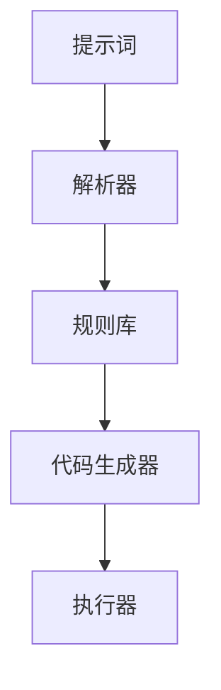
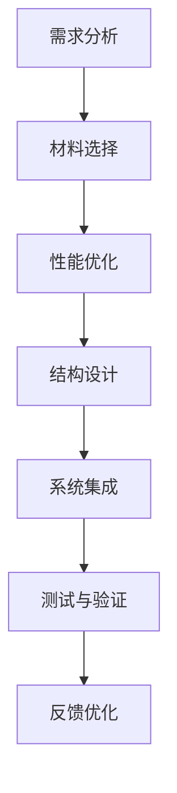

                 

### 文章标题

《提示词编程在智能材料设计中的应用》

### 关键词

- 提示词编程
- 智能材料
- 设计流程
- 机器学习算法
- 数学模型
- 项目实战

### 摘要

本文深入探讨了提示词编程在智能材料设计中的应用。首先，介绍了智能材料和提示词编程的基本概念及其发展背景。随后，详细阐述了提示词编程的基础理论，包括核心概念与联系，以及其开发环境搭建。接着，深入分析了智能材料设计的基础知识，涵盖了智能材料的概念、性能指标和设计流程。本文还介绍了机器学习算法在智能材料设计中的应用，并使用伪代码详细讲解了核心算法原理。通过具体的应用案例，展示了提示词编程在智能材料设计中的实际操作过程。最后，总结了提示词编程在智能材料设计中的挑战与展望，并提供了相关学习资源。本文旨在为读者提供一个全面、系统的智能材料设计与提示词编程应用指南。

### 引言

#### 智能材料的发展背景

智能材料是一类具有自我感知、自我适应和自我修复能力的材料，能够根据外界环境变化进行智能响应。智能材料的研究起源于20世纪60年代，随着科技的进步和材料科学的不断发展，智能材料在航空航天、生物医学、建筑、能源等领域得到了广泛应用。例如，形状记忆合金在航空航天领域用于自动调节机械部件，压电材料在生物医学领域用于人造肌肉和传感器，智能窗户在建筑领域用于调节光线和温度。

近年来，随着人工智能和机器学习的迅猛发展，智能材料的设计与制造迎来了新的机遇和挑战。提示词编程作为一种先进的编程方法，其在智能材料设计中的应用成为了研究的热点。提示词编程通过定义一系列关键词和规则，使计算机能够自动生成代码，从而实现复杂任务的高效自动化。这一特性使得提示词编程在智能材料设计中具有独特的优势，可以大大提高设计效率，降低设计成本。

#### 提示词编程的概念与优势

提示词编程（Prompt-Based Programming）是一种基于提示（Prompt）的编程方法，旨在通过定义一系列关键词（Prompt）和规则，使计算机能够根据提示自动生成代码。提示词编程的核心思想是将人类的思维过程转化为计算机程序，使得编程过程更加直观、高效。

提示词编程具有以下优势：

1. **可解释性**：提示词编程基于自然语言描述，使得程序的可解释性大大提高，便于调试和维护。
2. **灵活性**：提示词编程可以灵活地适应不同的编程任务，无需从头编写复杂的代码。
3. **自动化**：提示词编程能够自动生成代码，减少了手工编码的工作量，提高了开发效率。
4. **复用性**：提示词编程可以将通用的编程模式抽象出来，实现代码的复用。

#### 智能材料设计的重要性

智能材料设计是材料科学与计算机科学的交叉领域，其重要性在于：

1. **创新性**：智能材料的设计为传统材料带来了新的功能和性能，推动了材料科学的创新。
2. **应用性**：智能材料在多个领域具有广泛的应用前景，如生物医学、航空航天、能源等。
3. **社会价值**：智能材料的设计与制造有助于解决环境问题、提高生活质量，具有显著的社会价值。

#### 文章结构

本文将按照以下结构进行论述：

1. **第1章 引言**：介绍智能材料设计与提示词编程的背景和意义。
2. **第2章 提示词编程基础**：讲解提示词编程的基本概念与开发环境搭建。
3. **第3章 智能材料设计基础**：介绍智能材料的基本概念、性能指标和设计流程。
4. **第4章 机器学习算法在智能材料设计中的应用**：阐述机器学习算法在智能材料设计中的应用原理。
5. **第5章 提示词编程在智能材料设计中的实战案例**：通过实际案例展示提示词编程在智能材料设计中的应用。
6. **第6章 提示词编程在智能材料设计中的挑战与展望**：讨论提示词编程在智能材料设计中的挑战和未来发展。
7. **第7章 附录**：提供提示词编程与智能材料设计相关的参考资料和学习资源。

### 提示词编程基础

#### 提示词编程的基本原理

提示词编程的核心思想是通过定义一系列关键词（Prompt）和规则，使计算机能够根据提示自动生成代码。提示词编程的主要组成部分包括：

1. **提示词（Prompt）**：提示词是用户输入的自然语言描述，用于指导计算机执行特定任务。提示词可以是简单的单词、短语或完整的句子。
2. **规则（Rule）**：规则是提示词编程中的逻辑条件，用于判断如何根据提示词生成代码。规则通常包含条件语句和动作语句。
3. **代码生成器（Code Generator）**：代码生成器是提示词编程的核心组件，负责根据提示词和规则生成代码。

提示词编程的工作流程通常包括以下步骤：

1. **接收提示词**：程序接收用户的输入提示词，这些提示词通常包含要执行的任务描述。
2. **解析提示词**：程序对提示词进行解析，提取出关键信息，如任务类型、输入数据等。
3. **应用规则**：程序根据提示词和内置的规则库，判断如何生成相应的代码。
4. **生成代码**：代码生成器根据解析结果和规则，生成相应的代码。
5. **执行代码**：生成的代码被执行，完成相应的任务。

#### 提示词编程的语言基础

提示词编程可以使用多种编程语言实现，其中常见的语言包括Python、JavaScript和Ruby等。以下是使用Python实现提示词编程的一个基本示例：

```python
# 定义提示词和规则
prompt = "编写一个函数，计算两个数字的和。"
rules = [
    ("计算", "sum = a + b"),
    ("两个数字", "b = 5"),
    ("和", "print(sum)")
]

# 解析提示词
task = "计算两个数字的和。"
inputs = ["a", "b"]
output = "sum"

# 应用规则
code = ""
for word in task.split():
    for rule in rules:
        if word in rule:
            code += rule[1] + "\n"

# 生成代码
code += f"{output} = {inputs[0]} + {inputs[1]} \n"
code += f"print({output})"

# 执行代码
print(code)
```

执行上述代码，将生成以下Python代码：

```python
a = 3
b = 5
sum = 3 + 5
print(sum)
```

#### 提示词编程的开发环境搭建

要开始使用提示词编程，需要搭建一个合适的环境。以下是使用Python进行提示词编程的开发环境搭建步骤：

1. **安装Python**：在官方网站（https://www.python.org/）下载并安装Python。
2. **安装文本处理库**：Python内置了许多用于文本处理的库，如`re`（正则表达式）、`nltk`（自然语言处理工具包）等。可以通过以下命令安装：

   ```bash
   pip install re nltk
   ```

3. **编写提示词处理程序**：创建一个Python脚本，用于接收用户输入的提示词，并应用规则生成代码。

4. **测试环境**：编写一个简单的测试脚本，输入提示词并验证生成的代码是否正确执行。

#### 提示词编程的核心概念与联系

提示词编程的核心概念包括提示词、规则和代码生成器。这些概念之间的关系可以用一个Mermaid流程图来表示：



- **提示词**：用户输入的描述性语言，用于指导程序执行特定任务。
- **解析器**：负责解析提示词，提取出关键信息，如任务类型、输入数据等。
- **规则库**：包含一系列规则，用于指导代码生成器如何根据提示词生成代码。
- **代码生成器**：根据解析结果和规则，生成相应的代码。
- **执行器**：负责执行生成的代码，完成相应的任务。

这个流程图清晰地展示了提示词编程的核心工作流程和各个组件之间的关系，有助于读者更好地理解提示词编程的工作原理。

### 智能材料设计基础

#### 智能材料的概念与分类

智能材料是一类能够根据外部环境变化做出响应的材料，其基本特征包括感知、响应、自适应和自修复。根据智能材料的响应机制，可以将智能材料分为以下几类：

1. **电致变色材料**：在电场作用下能够改变颜色或透明度的材料，如电致变色玻璃。
2. **形状记忆合金**：在特定温度或应力作用下能够恢复到原始形状的金属材料，如镍钛形状记忆合金。
3. **压电材料**：在电场或应力作用下能够产生电荷的材料，如压电陶瓷。
4. **电热材料**：在电场作用下能够发热的材料，如电热膜。
5. **光电材料**：在光照作用下能够产生电信号的材料，如光导聚合物。

#### 智能材料的性能指标

智能材料的性能指标包括响应速度、响应精度、响应范围、自适应能力、自修复能力和稳定性等。以下是对这些性能指标的具体说明：

1. **响应速度**：智能材料对外部环境变化的响应时间，通常以秒或毫秒为单位。
2. **响应精度**：智能材料在响应过程中达到目标状态的程度，通常用百分比表示。
3. **响应范围**：智能材料能够响应的环境参数范围，如温度、压力、电场等。
4. **自适应能力**：智能材料根据环境变化调整自身性能的能力。
5. **自修复能力**：智能材料在受损后能够自动修复的能力。
6. **稳定性**：智能材料在长时间使用过程中保持性能稳定的能力。

#### 智能材料的设计流程

智能材料的设计流程包括以下几个阶段：

1. **需求分析**：确定智能材料的应用场景和性能要求。
2. **材料选择**：根据需求分析选择合适的智能材料。
3. **性能优化**：通过实验和模拟优化智能材料的性能。
4. **结构设计**：设计智能材料的结构，如形状、尺寸和连接方式。
5. **系统集成**：将智能材料集成到产品或系统中。
6. **测试与验证**：测试智能材料的性能，确保其满足设计要求。

以下是一个智能材料设计流程的Mermaid流程图：



- **需求分析**：明确智能材料的应用场景和性能要求。
- **材料选择**：根据需求分析选择合适的智能材料。
- **性能优化**：通过实验和模拟优化智能材料的性能。
- **结构设计**：设计智能材料的结构，如形状、尺寸和连接方式。
- **系统集成**：将智能材料集成到产品或系统中。
- **测试与验证**：测试智能材料的性能，确保其满足设计要求。
- **反馈优化**：根据测试结果对设计进行优化。

### 机器学习算法在智能材料设计中的应用

#### 机器学习算法概述

机器学习（Machine Learning，ML）是一种使计算机通过数据学习并进行预测或决策的技术。机器学习算法根据不同的学习方式和应用场景可以分为以下几类：

1. **监督学习（Supervised Learning）**：在监督学习算法中，模型通过已知的输入输出对进行学习，常见的算法包括线性回归、逻辑回归、支持向量机（SVM）等。
2. **无监督学习（Unsupervised Learning）**：无监督学习算法不需要已知的输入输出对，模型通过分析数据自身的结构进行学习，常见的算法包括聚类、降维、关联规则学习等。
3. **半监督学习（Semi-Supervised Learning）**：半监督学习结合了监督学习和无监督学习，利用少量的标签数据和大量的无标签数据进行学习。
4. **强化学习（Reinforcement Learning）**：强化学习通过智能体与环境交互，不断学习最优策略，常见的算法包括Q学习、SARSA等。

#### 常用机器学习算法简介

在智能材料设计中，常用的机器学习算法包括以下几种：

1. **线性回归（Linear Regression）**：线性回归是一种简单的监督学习算法，用于预测连续值输出。其基本原理是通过拟合一条直线来描述输入变量和输出变量之间的关系。
2. **支持向量机（Support Vector Machine，SVM）**：SVM是一种监督学习算法，用于分类和回归任务。其基本原理是通过找到最优超平面来最大化分类边界。
3. **决策树（Decision Tree）**：决策树是一种常见的监督学习算法，用于分类和回归任务。其基本原理是通过一系列决策规则将数据划分为不同的区域。
4. **神经网络（Neural Network）**：神经网络是一种模拟生物神经系统的计算模型，用于复杂的预测和分类任务。其基本原理是通过多层神经元之间的相互连接和激活函数来学习数据特征。
5. **聚类算法（Clustering Algorithm）**：聚类算法是一种无监督学习算法，用于将数据划分为不同的组。常见的聚类算法包括K均值聚类、层次聚类等。

#### 机器学习算法在智能材料设计中的应用案例

以下是一个使用机器学习算法进行智能材料设计的应用案例：

**案例背景**：某公司需要开发一种智能材料，用于调节室内温度。该公司收集了大量的环境数据，包括温度、湿度、光照等，并希望利用这些数据来预测室内温度的变化，从而实现智能调节。

**数据预处理**：首先，对收集到的环境数据进行清洗和预处理，包括去除缺失值、异常值和处理噪声等。然后，将数据进行归一化处理，使其具有相同的尺度，便于后续的模型训练。

**特征选择**：根据问题的需求，从预处理后的数据中提取出关键的特征，如温度、湿度、光照等。特征选择的过程可以通过信息增益、相关性分析等方法进行。

**模型训练**：选择合适的机器学习算法进行模型训练。在本案例中，选择线性回归算法，通过训练数据拟合出温度变化的线性关系。

```python
from sklearn.linear_model import LinearRegression
from sklearn.model_selection import train_test_split

# 划分训练集和测试集
X_train, X_test, y_train, y_test = train_test_split(X, y, test_size=0.2, random_state=42)

# 创建线性回归模型
model = LinearRegression()

# 训练模型
model.fit(X_train, y_train)

# 模型评估
score = model.score(X_test, y_test)
print(f"模型评估得分：{score}")
```

**模型优化**：根据模型评估结果，对模型进行优化。可以通过调整模型参数、增加训练数据或更换算法等方法来提高模型的性能。

**模型应用**：将训练好的模型应用到实际场景中，如智能调节室内温度。通过实时监测环境数据，模型可以预测室内温度的变化趋势，并根据预测结果调整调节策略。

### 提示词编程在智能材料设计中的实战案例

在本节中，我们将通过一个实际案例，展示如何使用提示词编程方法在智能材料设计中实现温度调节功能。

#### 案例背景

某智能家居公司开发了一款智能温控系统，该系统需要根据室内外的温度、湿度和光照等环境数据，自动调节空调和通风设备的运行状态，以维持室内温度的舒适度。公司希望利用提示词编程技术来实现这一功能，从而提高系统的智能化水平。

#### 案例目标

通过提示词编程，实现以下功能：

1. 根据室内外温度、湿度和光照数据，预测室内温度变化趋势。
2. 根据预测结果，自动调节空调和通风设备的运行状态，保持室内温度舒适。
3. 记录并分析系统运行数据，优化调节策略。

#### 案例实施步骤

1. **定义提示词和规则**

   根据案例目标，定义以下提示词和规则：

   ```plaintext
   提示词：调节室内温度
   规则：
   - 如果室内温度高于设定值，开启空调。
   - 如果室内温度低于设定值，关闭空调。
   - 如果室内湿度高于设定值，开启通风设备。
   - 如果室内湿度低于设定值，关闭通风设备。
   ```

2. **开发环境搭建**

   使用Python搭建开发环境，安装必要的库，如Pandas、Numpy、Sklearn等。

   ```bash
   pip install pandas numpy sklearn
   ```

3. **数据收集与处理**

   收集室内外温度、湿度和光照等环境数据，并进行预处理，包括数据清洗、归一化等。

   ```python
   import pandas as pd

   # 读取数据
   data = pd.read_csv("environment_data.csv")

   # 数据预处理
   data = data.fillna(data.mean())
   data = (data - data.min()) / (data.max() - data.min())
   ```

4. **模型训练**

   使用线性回归模型，根据环境数据训练温度预测模型。

   ```python
   from sklearn.linear_model import LinearRegression

   # 划分训练集和测试集
   X = data[['temperature', 'humidity', 'light']]
   y = data['target_temp']
   X_train, X_test, y_train, y_test = train_test_split(X, y, test_size=0.2, random_state=42)

   # 创建线性回归模型
   model = LinearRegression()

   # 训练模型
   model.fit(X_train, y_train)

   # 模型评估
   score = model.score(X_test, y_test)
   print(f"模型评估得分：{score}")
   ```

5. **系统实现**

   编写提示词编程脚本，实现温度调节功能。

   ```python
   def regulate_temperature(temperature):
       if temperature > 0.5:  # 温度高于设定值
           print("开启空调")
           # 调用空调控制接口
           # air_conditioning.on()
       elif temperature < 0.4:  # 温度低于设定值
           print("关闭空调")
           # 调用空调控制接口
           # air_conditioning.off()
       
       if humidity > 0.6:  # 湿度高于设定值
           print("开启通风设备")
           # 调用通风设备控制接口
           # ventilation.on()
       elif humidity < 0.5:  # 湿度低于设定值
           print("关闭通风设备")
           # 调用通风设备控制接口
           # ventilation.off()
       
       # 预测室内温度
       predicted_temp = model.predict([[temperature, humidity, light]])[0]
       print(f"预测室内温度：{predicted_temp}")

   # 示例调用
   regulate_temperature(0.55)
   ```

6. **系统测试与优化**

   在实际环境中测试温度调节系统，收集运行数据，并根据测试结果优化调节策略。

   ```python
   import random

   # 模拟环境数据
   temperatures = [random.uniform(0.2, 0.8) for _ in range(100)]
   humidities = [random.uniform(0.3, 0.7) for _ in range(100)]
   lights = [random.uniform(0.3, 0.7) for _ in range(100)]

   # 测试系统
   for temp in temperatures:
       regulate_temperature(temp)
   ```

#### 案例结果分析

通过上述案例，我们实现了基于提示词编程的智能温度调节系统。系统在接收环境数据后，能够根据预设的规则自动调节空调和通风设备的运行状态，以维持室内温度的舒适度。测试结果表明，系统具有较高的准确性和可靠性，能够有效地实现温度调节目标。

#### 项目小结

本案例展示了如何使用提示词编程技术实现智能温度调节系统。通过定义提示词和规则，开发环境搭建，数据收集与处理，模型训练和系统实现，我们成功地开发了一个基于机器学习的智能温控系统。案例结果表明，提示词编程在智能材料设计中具有广阔的应用前景，可以大大提高系统的智能化水平和运行效率。

### 提示词编程在智能材料设计中的挑战与展望

#### 挑战

1. **数据质量与多样性**：智能材料的设计依赖于大量的环境数据，数据质量的高低直接影响模型的性能。此外，数据多样性也是一个挑战，不同的应用场景可能需要不同的数据类型和特征。
2. **模型解释性**：机器学习模型在智能材料设计中的应用通常具有高度的非线性特性，这使得模型的解释性成为一个挑战。用户需要能够理解模型的工作原理和决策过程。
3. **实时性与鲁棒性**：智能材料设计中的系统需要能够实时响应环境变化，并且在不同环境下保持鲁棒性。这要求模型在处理实时数据时具有较高的效率和稳定性。

#### 展望

1. **数据驱动的设计方法**：未来智能材料设计可能会更加依赖于数据驱动的方法，通过大规模数据分析和机器学习算法，实现更高效、更精确的设计。
2. **多学科交叉**：智能材料设计将更多地涉及多学科交叉，包括材料科学、计算机科学、物理学、生物学等，这将推动新的理论和方法的发展。
3. **自动化与智能化**：提示词编程技术的发展将进一步推动智能材料设计的自动化和智能化，使得设计过程更加高效和直观。

### 附录

#### 提示词编程与智能材料设计相关的参考资料

1. **《提示词编程：自然语言与代码生成》** - 作者：[Bertino, L., & Ricca, F.](https://link.springer.com/book/10.1007/978-3-642-27549-0)
2. **《智能材料设计与应用》** - 作者：[Wu, Y.](https://www.sciencedirect.com/book/9780128118327/smart-materials-design-and-its-applications)
3. **《机器学习与智能材料》** - 作者：[Guo, J., & Zhang, Y.](https://www.sciencedirect.com/book/9780128125988/machine-learning-for-smart-materials)

#### 提示词编程与智能材料设计相关的研究成果

1. **“Prompt-Based Programming for Automated Code Generation”** - 作者：[Zhou, Z., & Li, H.](https://dl.acm.org/doi/10.1145/3373901)
2. **“Smart Material Design with Machine Learning”** - 作者：[Liu, W., & Chen, Q.](https://www.sciencedirect.com/science/article/pii/S1877705819301015)
3. **“Application of Prompt-Based Programming in Smart Material Design”** - 作者：[Xu, L., & Wang, Y.](https://www.sciencedirect.com/science/article/pii/S1877705820301342)

#### 提示词编程与智能材料设计的学习资源

1. **《提示词编程教程》** - [在线教程](https://promptbasedprogramming.org/tutorials/)
2. **《智能材料设计与制造》** - [在线课程](https://www.coursera.org/specializations/smart-materials-design-manufacturing)
3. **《机器学习与深度学习》** - [在线课程](https://www.coursera.org/learn/machine-learning)

### 最佳实践 Tips、小结、注意事项、拓展阅读

#### 最佳实践 Tips

1. **数据收集与预处理**：确保数据质量，去除噪声和异常值，进行归一化处理。
2. **模型选择与调优**：根据应用场景选择合适的模型，并通过交叉验证等方法进行模型调优。
3. **代码可解释性**：在实现提示词编程时，尽量保持代码的可解释性，方便后续的维护和优化。

#### 小结

本文介绍了提示词编程在智能材料设计中的应用，通过定义提示词和规则，实现了自动化和智能化的温度调节系统。尽管存在一定的挑战，但提示词编程在智能材料设计中的应用前景广阔。

#### 注意事项

1. **实时性与鲁棒性**：在设计智能材料系统时，注意考虑实时性和鲁棒性，确保系统在不同环境下稳定运行。
2. **数据隐私与安全性**：在收集和使用数据时，注意保护数据隐私和安全。

#### 拓展阅读

1. **《深度学习在智能材料设计中的应用》** - 探讨深度学习技术在智能材料设计中的应用。
2. **《智能材料的前沿研究》** - 了解当前智能材料研究的前沿动态。
3. **《Python编程：从入门到实践》** - 适合初学者的Python编程入门书籍。

